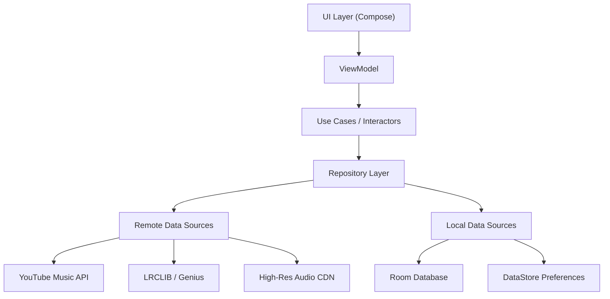

# SuvMusic – Advanced Audio Streaming Engineer for Android

**SuvMusic** is a high-performance, open-source music streaming application engineered for audiophiles and power users. It leverages a modern, clean architecture to deliver a seamless fusion of YouTube Music's vast catalog and high-fidelity audio streams (up to 320kbps), completely bypassing traditional API limitations and ad networks.

Architected by **[Suvojeet Sengupta](https://github.com/suvojeet-sengupta)**, this project serves as a comprehensive reference implementation for modern Android engineering, featuring Jetpack Compose, Hilt, Coroutines, and Media3.

---

## 🏗 Architectural Overview

The application follows a strictly typed **MVVM (Model-View-ViewModel)** pattern with **Clean Architecture** principles, ensuring separation of concerns, testability, and scalability.

### Key Engineering Decisions

*   **Single Activity Architecture**: Utilizes a single `MainActivity` with `Compose Navigation` for seamless screen transitions and efficient state management.
*   **Reactive Data Flow**: Extensive use of `Kotlin Flow` and `StateFlow` ensures UI states are completely reactive to underlying data changes (downloads, playback state, network connectivity).
*   **Dependency Injection**: `Hilt` is employed for compile-time dependency injection, managing singleton scopes for repositories and service bindings transparently.
*   **Offline-First Capability**: `Room` database acts as the single source of truth for library data, with repository logic handling synchronization with remote sources.

---

## 🚀 Core Features & capabilities

### 1. Hybrid Audio Engine
Unlike standard wrappers, SuvMusic implements a custom audio resolution strategy:
*   **Dual-Source Resolution**: Dynamically resolves audio streams from multiple providers (`YouTube`, `JioSaavn`) to guarantee the highest bitrate (320kbps AAC/OPUS) availability.
*   **Smart Buffering**: Implements custom `LoadControl` in `ExoPlayer` to optimize buffer sizes based on network type, minimizing latency while ensuring gapless playback.
*   **Loudness Normalization**: (In Development) volume normalization DSP to ensure consistent listening levels across different tracks.

### 2. Advanced Lyric Synchronization System
A sophisticated lyrics aggregation pipeline designed for precision:
*   **Priority Queue Parsing**:
    1.  **LRCLIB API**: Fetches community-verified time-synced LRC data.
    2.  **Embedded Lyrics**: Extracts ID3v2 SYLT frames from local media.
    3.  **Fallback Scrapers**: Parses static lyrics from provider metadata if synchronization fails.
*   **Real-time Interpolation**: The UI uses a linear interpolation algorithm to render smooth lyric scrolling synchronized to the millisecond with the active media player position.

### 3. "Dynamic Island" Overlay Service
A technical demonstration of Android's `SYSTEM_ALERT_WINDOW` capabilities:
*   **Foreground Service**, decoupling the overlay UI from the main application lifecycle.
*   **Gesture Dispatching**: Custom touch event handling to allow the overlay to expand/collapse without interfering with underlying applications.
*   **State Synchronization**: Binds directly to the central `MediaSessionService` to reflect real-time playback updates with zero polling.

### 4. Custom Video/Audio Search Algorithm
Enhances discovery by merging distinct data pipelines:
*   **Parallel execution** of `Structured Search` (Official Tracks) and `Unstructured Search` (Community Uploads/Videos) using `async/await` patterns.
*   **Deduplication Logic**: Custom comparison algorithms filter out identical tracks across different sources to present a unified result list.

---

## 🛠 Technology Stack

### Language & Runtime
*   **Kotlin 2.0+**: Leveraging K2 compiler improvements.
*   **Coroutines**: For managing background threads and strict structured concurrency.

### User Interface
*   **Jetpack Compose**: 100% declarative UI.
*   **Material 3**: Implementation of the latest Material Design guidelines.
*   **Coil**: Memory-efficient image loading with hardware-backed bitmap pooling.

### Media & Playback
*   **Media3 (ExoPlayer)**: The core industry standard for media playback.
*   **FFmpeg (via library)**: Support for esoteric audio formats.

### Data & Network
*   **Retrofit / OkHttp**: Type-safe HTTP clients with custom interceptors for header manipulation and caching.
*   **NewPipe Extractor**: Core logic for parsing YouTube internal APIs without API keys.
*   **Room Persistence Library**: Abstraction layer over SQLite for robust local data storage.
*   **Proto DataStore**: Type-safe data storage for user preferences.

---

## ⚡ Performance Optimizations

*   **Baseline Profiles**: Included to improve application startup time and reduce frame jank by pre-compiling critical code paths.
*   **R8 Full Mode**: Aggressive shrinking and obfuscation to minimize APK size (~50MB) and optimize bytecode.
*   **Memory Leak Detection**: Developed with strict adherence to lifecycle observation to prevent context leaks, verified via LeakCanary during debug builds.

---

## 👨‍💻 About the Developer

**Suvojeet Sengupta**  
*Senior Android Engineer & Open Source Enthusiast*

Based in **India 🇮🇳**, I specialize in building scalable, performance-critical mobile applications. SuvMusic represents my philosophy that software should be beautiful, respectful of the user, and technically uncompromising.

[GitHub](https://github.com/suvojeet-sengupta) • [LinkedIn](#) • [Portfolio](#)

---

## 📜 License

This project is licensed under the MIT License - see the [LICENSE](LICENSE) file for details.

*Disclaimer: This application is for educational and research purposes only. It interacts with third-party services and users must verify their compliance with relevant terms of service.*
