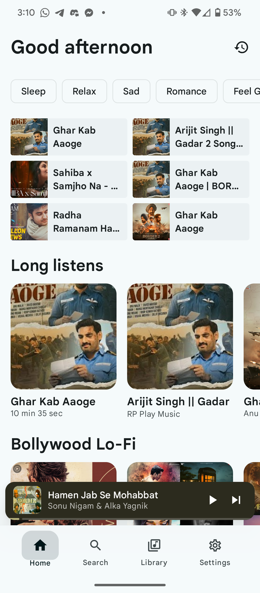
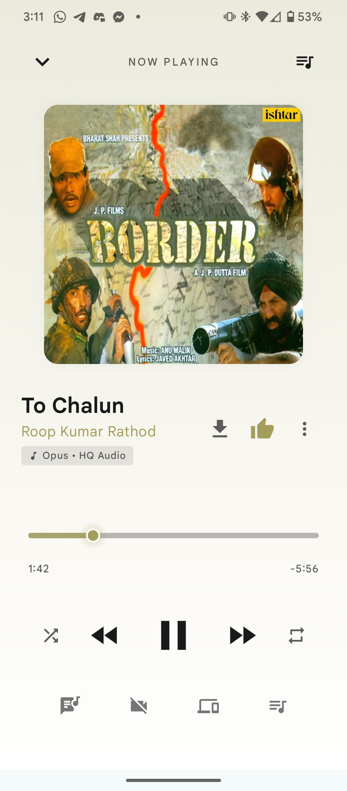
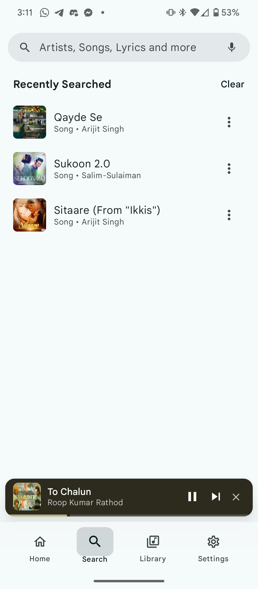
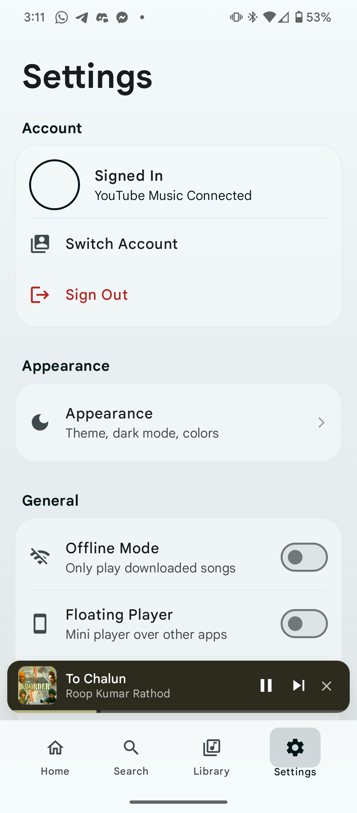
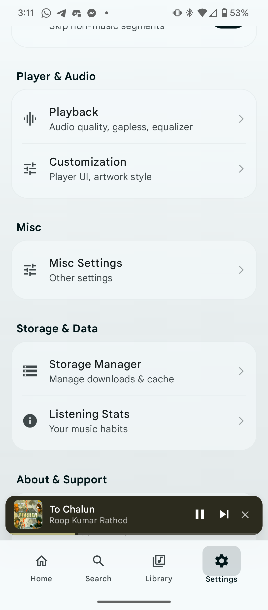
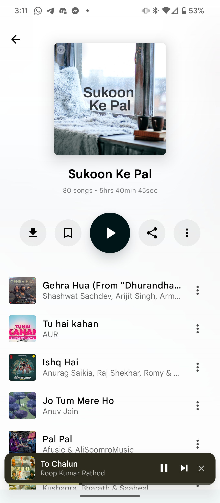
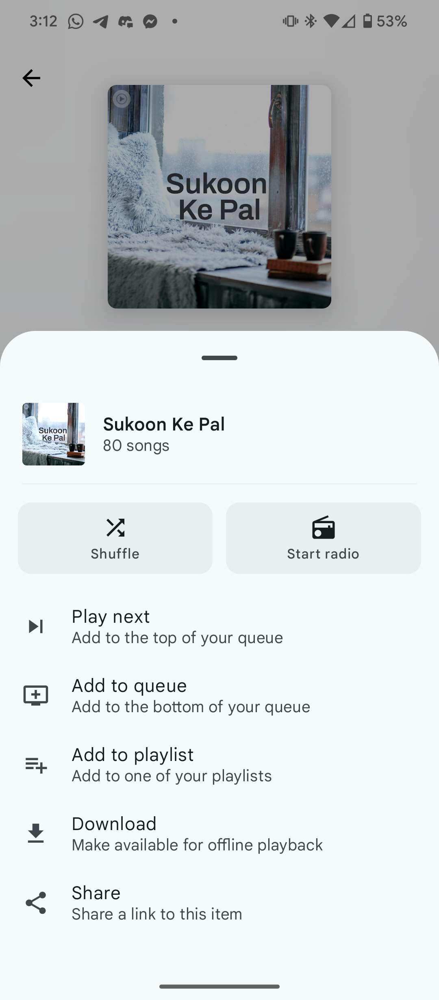

  

   
   

  <h1>SuvMusic</h1>
  <h3>High-Fidelity Music Streaming for Android</h3>

  <!-- Status Badges -->
  
  
  
  
  

   
   

  

    <strong>SuvMusic</strong> is a premium, open-source music player launched in January 2026. It bridges the gap between YouTube Music's vast catalog and high-fidelity audio. Experience ad-free streaming, real-time lyrics, and collaborative listening in a beautifully designed Material 3 interface.
  

  <!-- CTA Buttons -->
  
  

---

## Key Features

> [!NOTE]
> SuvMusic is designed to provide a premium, ad-free experience without compromising on audio quality or features.

### Core Capabilities

| **High-Fidelity Audio** | **Listen Together** |
|:---:|:---:|
|  |  |
| Stream high-quality Opus audio up to **256kbps** with loudness normalization and dual-source resolution. | Host rooms to listen with friends in perfect sync, regardless of network conditions. |

| **Synced Lyrics** | **Smart Downloads** |
|:---:|:---:|
|  |  |
| Word-by-word synchronized lyrics from **LRCLIB**, **Better Lyrics**, **Simp Music**, and **Kugou**. | Batch download albums and playlists with background service support. |

### Advanced Functionality

-    **Seamless Migration**: Import your existing playlists directly from Spotify.
-    **Tactile Feedback**: Vibrations synchronized to the beat of your music.
-    **Mini Player**: Floating, interactive overlay for system-wide control.
-    **Audio Control**: Customize playback speed (up to 5x) and pitch.
-    **Modern UI**: Fully dynamic theming with "Pure Black" OLED mode.

---

## App Showcase

  <table>
    <tr>
      <td width="33%"></td>
      <td width="33%"></td>
      <td width="33%"></td>
    </tr>
    <tr>
      <td></td>
      <td></td>
      <td></td>
    </tr>
     <tr>
      <td></td>
      <td></td>
      <td></td>
    </tr>
  </table>

---

## Technical Stack

The project leverages modern Android development standards.

| Architecture | UI / UX |
| :--- | :--- |
|        |        |

| Data & Network | Media |
| :--- | :--- |
|        |     |

---

## Installation

1.  Navigate to the **[Releases](https://github.com/suvojeet-sengupta/SuvMusic/releases)** page.
2.  Download the latest `SuvMusic-v1.0.4.apk`.
3.  Install the APK on your Android device (ensure "Unknown Sources" is enabled).

> [!TIP]
> For the best experience, enable "High Fidelity" streaming in settings after installation.

---

## Support & Contribution

&nbsp;

---

## Developer

**Suvojeet Sengupta**
 
*Senior Android Engineer*

---

## License

Copyright © 2026 Suvojeet Sengupta.
 
This project is licensed under the **[MIT License](LICENSE)**.

> [!IMPORTANT]
> **Disclaimer:** This application is strictly for educational and research purposes. It interacts with third-party services (YouTube Music, JioSaavn). The developer does not endorse piracy. Please respect intellectual property rights.