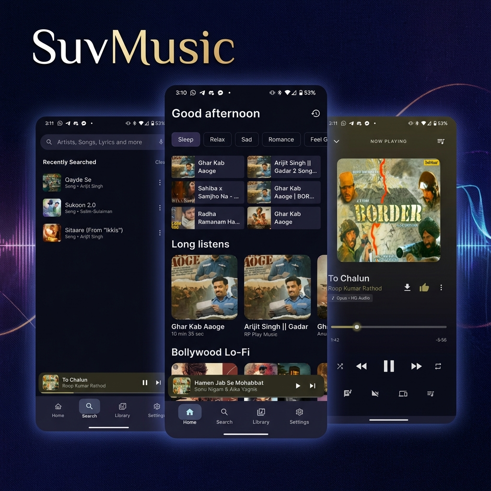
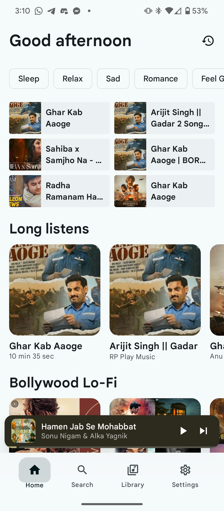
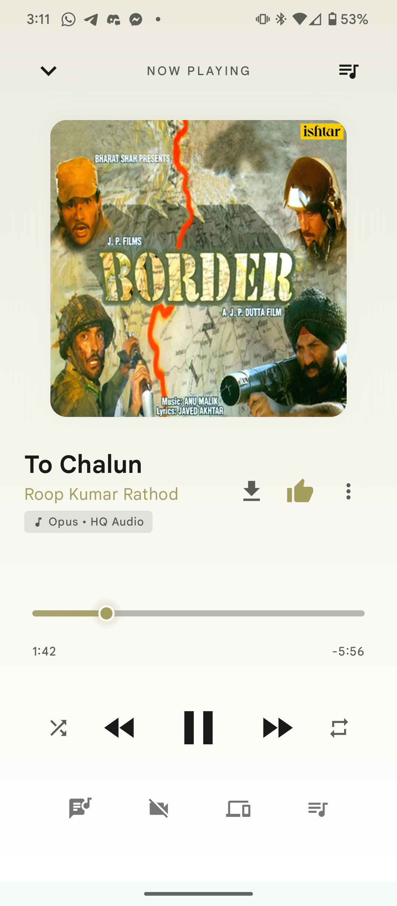
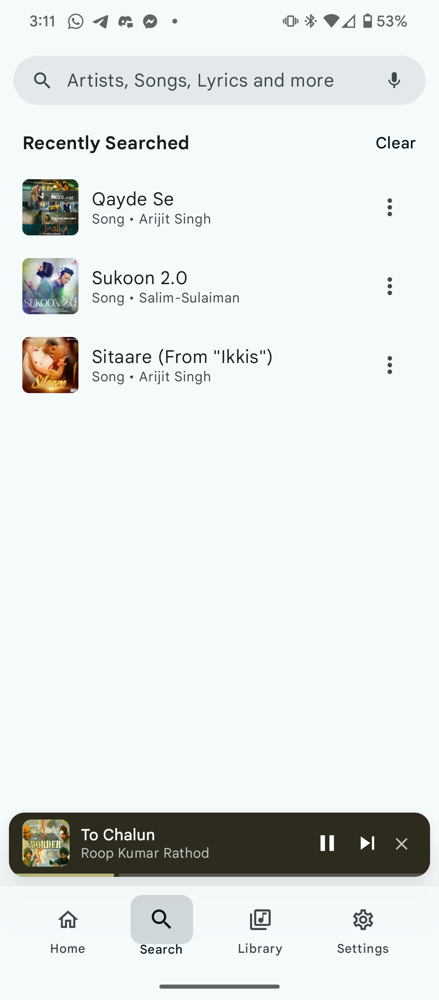
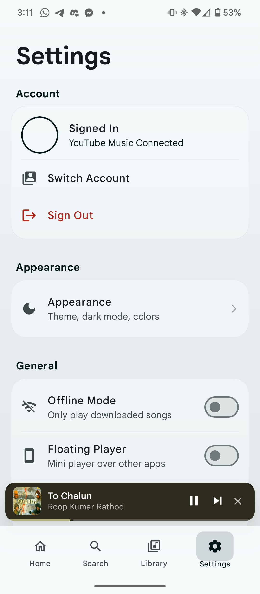
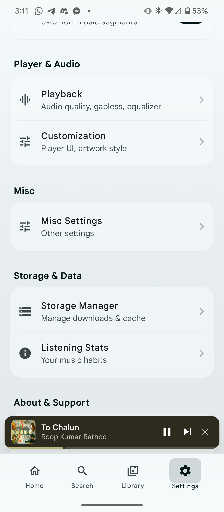
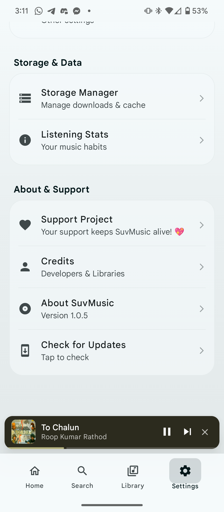

  

   
   

  <h1>SuvMusic</h1>
  <h3>High-Fidelity Music Streaming for Android</h3>

  

    <strong>SuvMusic</strong> is a premium, open-source music streaming application designed for high-resolution audio enthusiasts. Built with <strong>Jetpack Compose</strong> and a custom <strong>C++ Native Audio Engine</strong>, it provides an ad-free experience with advanced features bridging the gap between cloud streaming and professional local playback.
  

  <!-- Status Badges -->
  

    
    
    
    
  

   

  

    
    
    
    
  

---

## Documentation

Comprehensive documentation is available in the [`docs/`](docs/) directory:

| Document | Description |
|----------|-------------|
| [Project Overview](docs/Project%20Overview.md) | High-level project introduction and architecture overview |
| [Getting Started](docs/Getting%20Started.md) | Setup and development environment configuration |
| [Developer Guidelines](docs/Developer%20Guidelines.md) | Coding standards and best practices |

### Architecture & Design

| Document | Description |
|----------|-------------|
| [Application Architecture](docs/Application%20Architecture/Application%20Architecture.md) | Clean Architecture, MVVM, and modular design |
| [Modular Architecture Design](docs/Application%20Architecture/Modular%20Architecture%20Design.md) | Multi-module project structure |
| [Dependency Injection with Hilt](docs/Application%20Architecture/Dependency%20Injection%20with%20Hilt.md) | DI patterns and module organization |
| [Data Flow and State Management](docs/Application%20Architecture/Data%20Flow%20and%20State%20Management.md) | Reactive state handling |

### Core Systems

| Document | Description |
|----------|-------------|
| [Music Playback System](docs/Music%20Playback%20System/Music%20Playback%20System.md) | Media3 ExoPlayer integration and playback architecture |
| [Audio Processing Engine](docs/Audio%20Processing%20Engine/Audio%20Processing%20Engine.md) | Native C++ audio engine and DSP features |
| [Multi-Source Streaming](docs/Multi-Source%20Streaming/Multi-Source%20Streaming.md) | YouTube, JioSaavn, and local audio integration |
| [Lyrics System](docs/Lyrics%20System/Lyrics%20System.md) | Multi-provider lyrics fetching and display |
| [Download Management](docs/Download%20Management/Download%20Management.md) | Background downloads and file management |

### Advanced Features

| Document | Description |
|----------|-------------|
| [Listen Together](docs/Social%20Features/Listen%20Together/Listen%20Together.md) | Real-time synchronized listening rooms |
| [Personalization & Recommendations](docs/Personalization%20and%20Recommendations/Personalization%20and%20Recommendations.md) | Smart queue and recommendation algorithms |
| [Social Features](docs/Social%20Features/Social%20Features.md) | Discord integration and Last.fm scrobbling |

### Technical References

| Document | Description |
|----------|-------------|
| [Native Integration](docs/Native%20Integration/Native%20Integration.md) | CMake, JNI bridge, and native audio processors |
| [Data Management](docs/Data%20Management/Data%20Management.md) | Database schema, DAOs, and repositories |
| [UI/UX System](docs/UI_UX%20System/UI_UX%20System.md) | Theming, navigation, and components |
| [Testing Strategy](docs/Testing%20Strategy.md) | Unit, integration, and UI testing approaches |
| [Performance Optimization](docs/Performance%20Optimization.md) | Optimization techniques and benchmarks |
| [Security Considerations](docs/Security%20Considerations.md) | Security best practices and data protection |
| [Build and Deployment](docs/Build%20and%20Deployment.md) | Build configuration and release process |

---

## Core Features

### Audio Engineering & Performance
- **Native Audio Engine**: High-fidelity playback powered by a custom C++ JNI layer for low-latency digital signal processing.
- **WSOLA Time-Stretching**: High-quality pitch and speed adjustments without digital artifacts or distortion.
- **Parametric EQ & Spatial Audio**: 10-band ISO standard equalizer and real-time 3D sound positioning with ITD/ILD head shadowing models.
- **High-Resolution Streaming**: Stream Opus audio up to 256kbps with dual-source resolution for consistent quality.

### UI & User Experience
- **Material 3 Interface**: Dynamic theming engine that adjusts system-wide colors based on album artwork.
- **Dynamic Island Mini-Player**: Interactive, floating overlay for background playback control.
- **Gesture Controls**: Integrated video player gestures—Double tap to seek, Vertical swipes for volume/brightness, and Pinch-to-zoom for fill/fit modes.
- **Synchronized Lyrics**: Real-time, word-by-word lyrics integration from LRCLIB, Kugou, and SimpMusic providers.

### Advanced Functionality
- **Listen Together**: Real-time synchronized listening rooms with low-latency network protocols.
- **Music Haptics**: Beat-synchronized tactile feedback for immersive listening.
- **Spotify Migration**: Direct playlist importing from Spotify accounts.
- **Persistent Logging & Diagnostics**: Integrated file-based logging system with startup log capture and built-in bug reporting for advanced troubleshooting.
- **Smart Asset Management**: Batch download capabilities with background service support and persistent caching.
- **ACRA Crash Reporting**: Automated, detailed crash reports with notification and logcat integration for faster debugging.

---

## Showcase

  <table>
    <tr>
      <td width="33%"></td>
      <td width="33%"></td>
      <td width="33%"></td>
    </tr>
    <tr>
      <td></td>
      <td></td>
      <td></td>
    </tr>
  </table>

---

## F-Droid Anti-Features

As an open-source project committed to transparency, SuvMusic discloses the following "Anti-Features" for users and F-Droid reviewers:

- **Non-Free Network Services**: SuvMusic interacts with third-party, non-free network services (including YouTube, KuGou, LrcLib, and SimpMusic) to provide music streaming, metadata extraction (via **NewPipe Extractor**), and synchronized lyrics. These services are external to the app and governed by their respective terms of service.
- **Tracking**: The app utilizes **ACRA (Application Crash Reports for Android)** for automated crash reporting. While ACRA is open-source, it is technically categorized as tracking by F-Droid because it sends diagnostic data (device info, stack traces) to the developer-controlled endpoint to improve app stability.

---

## Technical Specifications

SuvMusic is engineered using modern Android development standards.

- **Frontend**: 100% Jetpack Compose for a reactive and fluid user interface with optimized list rendering for large datasets.
- **Architecture**: Clean Architecture with MVVM, Hilt Dependency Injection, Room Database, and Kotlin Coroutines.
- **Images & Caching**: Powered by **Coil** with aggressive disk/memory caching policies for offline-ready image loading.
- **Audio Core**: Custom C23 Native Engine via JNI for high-performance DSP (Limiter, Soft Clipping, EQ).
- **Networking**: Retrofit & OkHttp with custom extractors for high-fidelity stream resolution.
- **Error Reporting**: **ACRA (Application Crash Reports for Android)** for automated diagnostic collection.

---

## Installation

1.  Navigate to the **[Releases](https://github.com/suvojeet-sengupta/SuvMusic/releases)** page.
2.  Download the latest stable APK file.
3.  Install the APK on an Android device (Android 8.0 or higher required).

---

## Acknowledgments

SuvMusic is an independent project featuring original UI/UX and a custom audio engine. The project utilizes specific core logic from the following open-source resources to maintain compatibility:

- **[Metrolist](https://github.com/MetrolistGroup/Metrolist)**: Core logic for the 'Listen Together' protocol.
- **[NewPipe Extractor](https://github.com/TeamNewPipe/NewPipeExtractor)**: High-performance metadata extraction.
- **[SimpMusic](https://github.com/SimpMusic/SimpMusic)**: Lyrics provider implementation logic.
- **[kaif-00z](mailto:kaif-00z@proton.me)**: Original concept and architectural logic for the high-performance `.suv` native playlist format.

---

## Developer

**Suvojeet Sengupta**
Senior Android Engineer

---

## License

Copyright © 2026 Suvojeet Sengupta.
This project is licensed under the **GNU General Public License v3.0**. See the [LICENSE](LICENSE) file for details.

**Disclaimer**: This application is intended for educational and research purposes. It interacts with third-party services. Please respect intellectual property rights and applicable terms of service.
