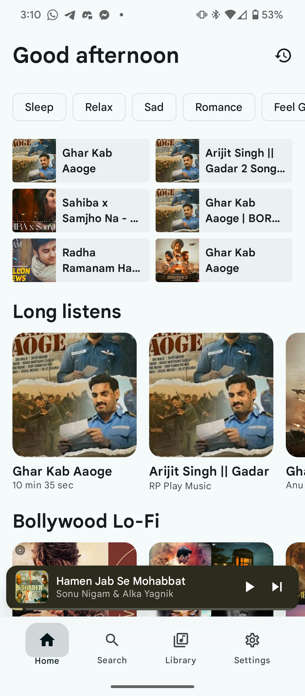
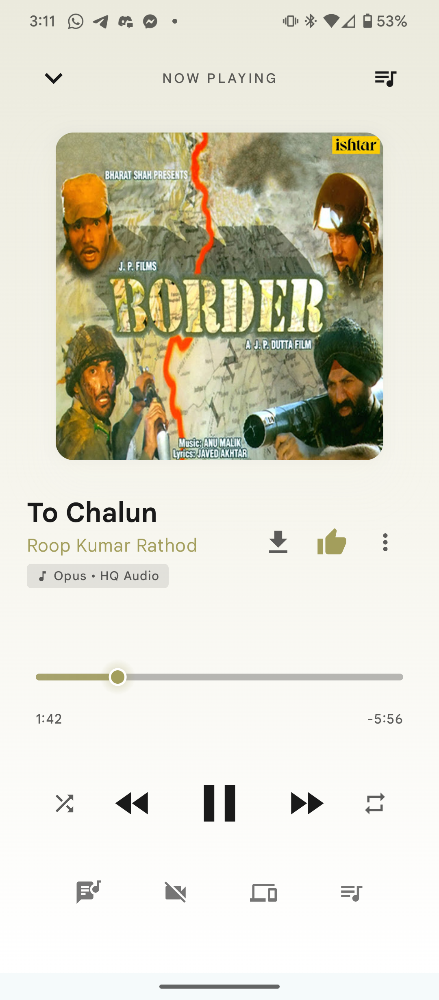
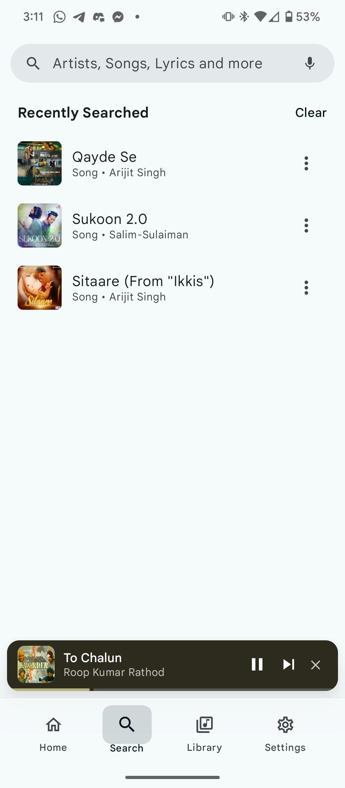
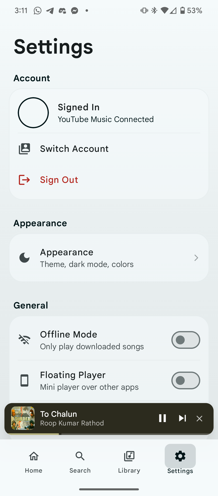
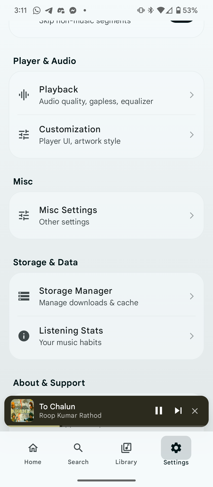
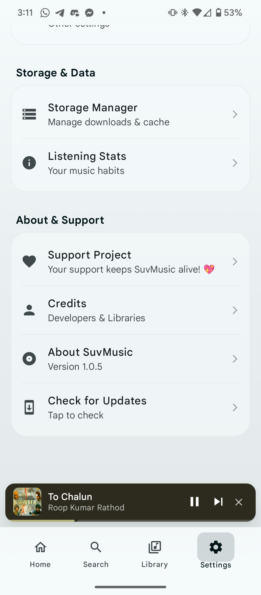

# SuvMusic

> **A focused music player for listeners who care about sound, control, and a calm interface.**

[](https://github.com/suvojeet-sengupta/SuvMusic/releases/latest)
[](https://developer.android.com/about/versions/oreo)
[](LICENSE)
[](https://kotlinlang.org/)
[](https://developer.android.com/compose)

SuvMusic is an open-source Android music application developed by **Suvojeet Sengupta**. It brings streaming, local playback, synchronized lyrics, downloads, personalization, and detailed audio controls into one thoughtful listening experience. The project combines a modern Compose interface with a native C++ audio layer, while keeping the application modular enough to evolve across Android and desktop targets.

The default visual identity is the **Pulse** logo. It is used consistently in the Android splash screen, launcher icon, and in-app branding, while the Appearance settings still let users choose from the available SuvMusic logo variants.

## Why SuvMusic

SuvMusic is designed around a simple idea: music software should give listeners useful control without making the listening experience feel complicated. The app keeps playback close at hand, treats local and streamed music as part of the same library, and exposes advanced tools only when they are useful.

| Area | What SuvMusic provides |
| --- | --- |
| Listening | Stream music, play local files, manage queues, and continue playback in the background. |
| Sound | High-quality playback, volume normalization, parametric equalization, spatial processing, and pitch or speed controls. |
| Discovery | Home sections, search, recommendations, mood and genre discovery, and smart queue support. |
| Personal library | Playlists, downloads, listening history, backups, and imported Spotify collections. |
| Lyrics | Synchronized lyrics with multiple providers and configurable presentation options. |
| Social playback | Listen Together rooms with synchronized playback and shared queue coordination. |
| Personalization | Dynamic themes, album-art colors, player styles, logo variants, and adaptive layouts. |

## Highlights

### Playback and audio

- Media3-based background playback with a persistent media service.
- High-quality audio sources, local file playback, and configurable playback behavior.
- Native C++ DSP through JNI for low-latency audio processing.
- Parametric equalization, spatial audio, bass enhancement, crossfeed, limiter processing, and pitch or speed adjustment.
- Queue management, gapless playback support, sleep timers, output-device handling, and Picture-in-Picture support.

### Interface and accessibility

- Material 3 and Jetpack Compose UI with responsive layouts for phones, tablets, foldables, Android TV, and desktop targets.
- Dynamic album-art color theming, dark mode, pure-black mode, and configurable player presentation.
- Gesture-aware video playback with seek, volume, brightness, and zoom controls.
- Adaptive navigation and focused loading states for a smoother experience on different screen sizes.

### Library and discovery

- Home, search, albums, artists, playlists, library, downloads, and listening-history screens.
- Smart recommendations, personalized sections, genre discovery, and a radio-style queue.
- Synchronized lyrics from multiple providers, including local lyrics support.
- Background downloads, caching, backup and restore, and playlist import workflows.

### Connectivity and integrations

- YouTube and other configured audio sources through repository-based integrations.
- Last.fm scrobbling and Discord Rich Presence support.
- Android media controls, widgets, deep links, and external audio-file handling.
- Listen Together functionality with a dedicated synchronization protocol.

## Screenshots

| Home | Player | Lyrics |
| --- | --- | --- |
|  |  |  |

| Library | Settings | Search |
| --- | --- | --- |
|  |  |  |

## Installation

The easiest way to install SuvMusic is to download the latest stable APK from the [GitHub Releases](https://github.com/suvojeet-sengupta/SuvMusic/releases) page.

1. Open the latest release.
2. Download the APK that matches your device architecture.
3. Allow installation from the selected source if Android requests permission.
4. Install the APK and open SuvMusic.

SuvMusic targets Android 37 and supports Android 8.0 and newer. Release builds are optimized with code shrinking and resource shrinking enabled. APK availability may vary by release channel and device architecture.

## Build from source

### Requirements

| Requirement | Version or note |
| --- | --- |
| Android Studio | A current stable version with Android SDK support for API 37 |
| JDK | Java 21 |
| Android SDK | Compile and target SDK 37 |
| NDK | 27.0.12077973 for the native audio module |
| CMake | 3.22.1 |
| Git | Required for cloning the repository and submodules |

Clone the repository and enter the project directory:

```bash
git clone https://github.com/suvojeet-sengupta/SuvMusic.git
cd SuvMusic
```

Create a `local.properties` file when you need optional service credentials that are not supplied through environment variables. Do not commit this file or any secret value.

Build the debug APK with the Gradle wrapper:

```bash
./gradlew :app:assembleDebug
```

Run the unit tests with:

```bash
./gradlew :app:testDebugUnitTest
```

The generated debug APK is placed under `app/build/outputs/apk/debug/`. For a release build, provide the signing and optional service values through the environment and run:

```bash
./gradlew :app:assembleRelease
```

## Project structure

SuvMusic uses a modular architecture so platform concerns, data access, domain logic, and user interface code can evolve independently.

| Module or area | Responsibility |
| --- | --- |
| `app` | Android application entry point, services, Android resources, launcher aliases, and platform integration. |
| `composeApp` | Shared Compose UI used by Android and desktop targets. |
| `core:model` | Shared domain models and enums, including logo variants and playback state. |
| `core:data` | Data access, persistence, and repository support. |
| `core:domain` | Application-level use cases and business rules. |
| `core:db` | Database definitions and local persistence. |
| `media-source` | Media-source and streaming integration support. |
| `extractor` | Metadata and stream extraction helpers. |
| `lyric-*` | Lyrics provider implementations. |
| `scrobbler` | Scrobbling integrations and listening history support. |
| `updater` | Update-checking and release-update workflows. |

The Android application follows a Compose-oriented MVVM structure, uses Kotlin coroutines and Flow for reactive state, and combines Hilt and Koin during the current modular migration. Media3 manages playback, Coil handles image loading, Room and DataStore support local state, and the native audio engine is connected through JNI and CMake.

## Performance and stability

Performance work in SuvMusic focuses on reducing unnecessary UI work while preserving playback responsiveness. The application keeps rapidly changing playback position state close to the components that need it, uses lifecycle-aware Flow collection for screen state, provides stable list keys and content types, and reuses cached image and audio resources where possible. Native processing is used for the time-sensitive audio path, while lower-priority discovery work is staged to avoid concentrating network and memory load during startup.

Recent UI improvements also consolidate duplicate state collection in the Home screen, use lifecycle-aware collection in branding and Appearance surfaces, and keep the default logo and splash selection synchronized across fresh installs and user-selected variants.

For the deeper design notes, see [Performance Optimization](docs/Performance%20Optimization.md) and [Security and Stability Audit](docs/SECURITY_AND_STABILITY_AUDIT.md).

## Documentation

The repository contains focused documentation for contributors and maintainers.

| Topic | Guide |
| --- | --- |
| Getting started | [Getting Started](docs/Getting%20Started.md) |
| Project orientation | [Project Overview](docs/Project%20Overview.md) |
| Development conventions | [Developer Guidelines](docs/Developer%20Guidelines.md) |
| Architecture | [Clean Architecture](docs/Application%20Architecture/Clean%20Architecture%20Implementation.md), [MVVM with Compose](docs/Application%20Architecture/MVVM%20Pattern%20with%20Jetpack%20Compose.md), and [Modular Architecture](docs/Application%20Architecture/Modular%20Architecture%20Design.md) |
| Playback | [Music Playback System](docs/Music%20Playback%20System/Music%20Playback%20System.md) and [Media3 Integration](docs/Music%20Playback%20System/Media3%20ExoPlayer%20Integration.md) |
| Audio engine | [Audio Processing Engine](docs/Audio%20Processing%20Engine/Audio%20Processing%20Engine.md) and [Native Integration](docs/Native%20Integration/Native%20Integration.md) |
| Lyrics | [Lyrics System](docs/Lyrics%20System/Lyrics%20System.md) |
| Downloads | [Download Management](docs/Download%20Management/Download%20Management.md) |
| Listen Together | [Listen Together](docs/Social%20Features/Listen%20Together/Listen%20Together.md) |
| Testing | [Testing Strategy](docs/Testing%20Strategy.md) |
| Build and releases | [Build and Deployment](docs/Build%20and%20Deployment.md) |
| Security | [Security Considerations](docs/Security%20Considerations.md) |

## Privacy and third-party services

SuvMusic is transparent about the services it uses. Depending on the feature and the user's configuration, the application may communicate with third-party services such as YouTube, Last.fm, Discord, lyrics providers, and configured audio or metadata sources. These services have their own availability, privacy policies, and terms of use.

Crash diagnostics are provided through ACRA to help identify stability issues. Review the project's [Security Considerations](docs/Security%20Considerations.md) and the linked [privacy policy](https://suvojeet-sengupta.github.io/SuvMusic-Website/suvmusic-privacy.html) before enabling services that transmit data outside the device.

Users should only access, download, and share content in accordance with applicable law and the terms of the services they use.

## Contributing

Contributions are welcome when they improve the product for listeners and keep the codebase maintainable. Before opening a pull request, read the [Developer Guidelines](docs/Developer%20Guidelines.md), explain the motivation for the change, and include focused verification steps. For UI changes, screenshots or a short screen recording are helpful; for playback and native-audio changes, describe the device and audio path used for testing.

Please keep pull requests focused, avoid committing credentials or generated build output, and update the relevant documentation when behavior or setup changes.

## Support and project links

| Resource | Link |
| --- | --- |
| Releases | [Download the latest release](https://github.com/suvojeet-sengupta/SuvMusic/releases) |
| Issue tracker | [Report a bug or request an improvement](https://github.com/suvojeet-sengupta/SuvMusic/issues) |
| Official website | [SuvMusic website](https://suvojeet-sengupta.github.io/SuvMusic-Website/) |
| Privacy policy | [Read the privacy policy](https://suvojeet-sengupta.github.io/SuvMusic-Website/suvmusic-privacy.html) |
| Developer | [Suvojeet Sengupta](https://suvojeet-sengupta.github.io/) |
| Telegram community | [Join the community](https://t.me/TechToli) |

## Acknowledgements

SuvMusic builds on the work of open-source projects and contributors, including [NewPipe Extractor](https://github.com/TeamNewPipe/NewPipeExtractor), [SimpMusic](https://github.com/maxrave-dev/SimpMusic), and the maintainers of the libraries listed in the Gradle version catalog. Their work makes reliable media extraction, playback, lyrics, networking, and platform integration possible.

## License

SuvMusic is distributed under the [GNU General Public License v3.0](LICENSE).

Copyright © 2026 **Suvojeet Sengupta**.

Developed by **Suvojeet Sengupta** with a focus on thoughtful Android engineering, capable audio systems, and an approachable open-source codebase.
