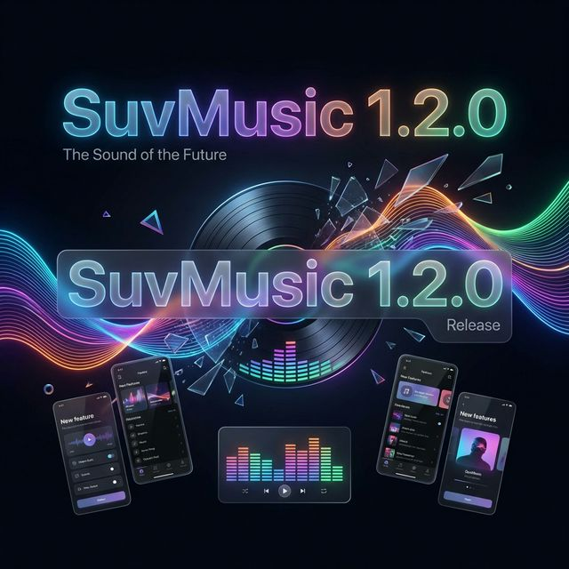

# SuvMusic 1.2.0: The Native Audio Architecture Update

## Executive Summary

The release of SuvMusic version 1.2.0 marks the most significant architectural overhaul in the application's history. Moving beyond simple UI adjustments or rudimentary feature additions, this release fundamentally reconstructs the core audio playback and processing pipeline from the ground up. Over the course of the previous development cycle, our engineering team identified that the limits of standard high-level audio APIs were restricting our ability to deliver true audiophile-grade sound manipulation with zero latency. 

To break through these barriers, SuvMusic 1.2.0 introduces a custom, high-performance native audio engine authored entirely in C23 using the latest Native Development Kit (NDK 28). By moving critical DSP (Digital Signal Processing) operations to the JNI (Java Native Interface) layer, we have unlocked unprecedented control over the audio buffer. This update introduces professional-grade Spatial Audio with HRTF (Head-Related Transfer Function), a zero-latency 10-Band Parametric Equalizer, advanced algorithmic mastering tools including a Look-ahead Limiter and Analog Soft Clipping, and a sophisticated Headphone Crossfeed matrix.

Simultaneously, we have applied the same level of rigorous engineering to the presentation layer. The user interface has been significantly refined to reflect the premium nature of the underlying audio engine. Complex, physics-based animations have been introduced for player transitions, interaction paradigms have been optimized for speed and ergonomics, and internal state management has been heavily refactored for absolute stability. 

This document serves as a comprehensive technical overview of the new capabilities, optimizations, and structural changes introduced in SuvMusic 1.2.0.

---

## The Native Audio Processing Architecture

The centerpiece of SuvMusic 1.2.0 is the complete migration of our Digital Signal Processing stack to a robust, thread-safe C++ architecture. This transition was necessitated by the need for microsecond-level control over the audio stream, a requirement for implementing advanced acoustic algorithms without introducing unacceptable levels of latency or draining device battery life.

### Professional Spatial Audio Engine with HRTF Integration

Perhaps the most mathematically complex addition to this release is the bespoke Spatial Audio Engine. Standard stereo playback often results in a synthetic "in-the-head" localization when listening through headphones. To counteract this, we have implemented an HRTF processing pipeline. 

The HRTF mathematically models how sound waves interact with the human head, pinna (outer ear), and torso before reaching the eardrum. By applying these complex convolution filters to the audio stream in real-time within the native layer, SuvMusic simulates the experience of listening to audio emanating from physical speakers in an acoustically treated room. 

Critical improvements to this system include:
- **Universal PCM Format Support:** The engine has been refactored to dynamically handle all Pulse-Code Modulation (PCM) structures, ranging from standard 16-bit audio to high-resolution floating-point formats, ensuring bit-perfect processing regardless of the source file.
- **Accurate ITD Mapping:** Interaural Time Difference (ITD) is crucial for low-frequency sound localization. Previous iterations suffered from minor phase alignment issues during delay mapping. The C++ engine corrects these ITD phase discrepancies, resulting in a razor-sharp, stable holographic stereo image.

### Zero-Latency 10-Band Parametric Equalizer

SuvMusic 1.2.0 replaces standard, restrictive graphic equalizers with a genuine 10-Band Parametric Equalizer. Written natively, this EQ utilizes cascading biquad filters to allow for surgical precision in frequency response shaping without introducing phase distortion or processing delay.

The user interface for the Equalizer has been entirely redesigned. It now features a high-contrast, visually articulate spectrum analyzer that responds fluidly to parameter adjustments. Furthermore, we have implemented an "Atomic Reset" mechanism. This ensures that when a user resets the equalizer state, the configuration is instantly and safely swept across the persistent data layer and the active native player layer without any race conditions or audio artifacts.

### Advanced Algorithmic Mastering Suite

To ensure that the audio output remains pristine even under extreme equalization or volume boosting, we have integrated a suite of DSP mastering tools running directly on the native audio thread.

- **C++ Look-ahead Limiter and Dynamic Range Control (DRC):** When pushing volume levels or heavily boosting bass frequencies, digital clipping (where the waveform exceeds 0 dBFS) can cause harsh, unpleasant distortion. Our new Look-ahead Limiter analyzes the audio buffer milliseconds before it is sent to the DAC (Digital-to-Analog Converter). If it detects a peak that would cause clipping, it transparently applies a perfectly calibrated gain reduction curve. This allows for significant volume boosting while strictly preserving the integrity of the dynamic range.
- **Analog Soft Clipping:** In instances where the audio signal is inherently clipped or driven hard, the system employs an Analog Soft Clipping algorithm. Unlike hard digital clipping, which produces odd-order harmonics that sound highly abrasive, our algorithm utilizes nonlinear mathematical transfer functions (resembling tubed amplification saturation) to round off the peaks. This results in a warmer, more musically pleasing harmonic distortion when the signal is pushed to its limits.
- **Headphone Crossfeed Matrix with Smart Bypass:** Prolonged headphone listening to early stereo recordings (where instruments were hard-panned entirely to one channel) can cause severe auditory fatigue. The new Crossfeed filter continuously blends controlled amounts of the left channel into the right, and vice versa, applying appropriate frequency-dependent delays. This simulates the natural acoustic cross-bleed that occurs when listening to physical stereo monitor speakers. To preserve the intent of modern spatial mixes, we have integrated Smart Bypass logic that constantly evaluates the hardware routing and audio metadata, automatically disabling crossfeed when it is structurally unnecessary.

### Native Thread Safety and Waveform Rendering

Audio playback is fiercely intolerant of CPU blocking. A delay of merely ten milliseconds on the audio thread results in audible buffer underruns (stuttering or crackling). 

- **Thread Concurrency:** We have enforced strict, lock-free concurrency models across the native boundaries. Inter-thread communication between the UI layer, the Kotlin-based player service, and the C++ DSP engine utilizes strictly non-blocking queues and atomic variables, guaranteeing that the audio rendering loop is never preempted by UI operations.
- **Mmap-Based Extraction:** For rendering the intricate waveform visualizers on the player screen, we have migrated to a Memory-Mapped (mmap) file access architecture. Instead of sequentially reading file blocks into RAM, the native code maps the audio file directly into the application's virtual address space. This provides instantaneous, zero-copy access to the audio data for waveform calculation, drastically reducing I/O overhead and memory consumption.
- **Volume Normalization Gain Smoothing:** We isolated and resolved an edge-case audio distortion anomaly occurring during target-level volume normalization. The fix implements an exponential gain smoothing animation. When a track changes, the gain multiplier does not jump abruptly; instead, it ramps fluidly, completely eliminating any transient crackling or popping artifacts between songs.

---

## User Interface and Experience Overhaul

The complexity and power of the new audio engine mandated a user interface that feels equally sophisticated, responsive, and robust. SuvMusic 1.2.0 introduces a meticulously refined presentation layer built upon modern declarative UI principles.

### Fluid Navigation and Physics-Based Transitions

The transition from the minimized application state to the full-screen playback view is one of the most frequently executed interactions. We have completely rewritten this navigation flow.

- **Non-Linear Zoom Transition:** We have implemented a fluid, physics-based zoom and expansion transition, heavily inspired by premium streaming applications. When the mini-player is tapped, the album art and surrounding UI components expand outward with a carefully tuned cubic-bezier easing curve. 
- **Mini-Player Positional Stability:** A pervasive edge-case bug involving the mini-player's spatial positioning jumping erratically during rapid back-press gestures has been definitively resolved. The player sheets now rigorously respect predictive back gestures and edge-to-edge frame insets, ensuring a continuously stable visual hierarchy.

### Optimized Interaction Paradigms

Interaction design in SuvMusic 1.2.0 focuses on reducing cognitive load and shortening the time required to execute common tasks.

- **Redesigned Horizontal Action Sheets:** We analyzed user interaction heatmaps and determined that deep vertical scrolling within action menus was inefficient. The song contextual action sheets have been completely redesigned. Primary and frequently used actions (Play Next, Add to Queue, Add to Playlist) have been elevated into a touch-optimized, persistently visible top horizontal row.
- **Non-Intrusive State Confirmations:** To provide immediate user feedback without interrupting the navigation flow, we have deployed custom Toast-style notifications. These provide transient, visually integrated confirmation when actions such as "Play Next" and "Add to Queue" are successfully triggered.
- **Quick Picks Velocity:** We have added a localized "Play All" execution node directly within the Quick Picks carousel, allowing users to immediately initiate bulk playback algorithms without navigating into a secondary playlist context.

### Visual Refinements and Spatial Harmony

Significant attention has been directed toward the micro-aesthetics of the application.

- **Seekbar Ergonomics:** The primary player seekbar has undergone a structural redesign. The touch target area has been mathematically expanded to prevent missed interactions, while the visual thickness and track coloring have been refined to improve contrast against dynamic album art backgrounds.
- **Artwork Responsiveness:** The caching and rendering pipeline for high-resolution album art has been optimized to ensure that artwork responds instantly and scales beautifully without pixelation or aspect ratio distortion, regardless of the device's screen dimensions.

### Granular Storage Management Capacity Limits

Power users demand absolute control over the application's footprint on their device.

- **Component-Level Cache Exposure:** The Storage Settings module has been entirely rebuilt. It no longer presents a monolithic "Clear Cache" operation. Instead, the UI provides granular metrics and explicit clearing controls for the Player Cache, the Image Cache, and the generated Thumbnails. Users can now surgically manage storage without destroying their pre-loaded song buffers.
- **Massive List Expansion:** Based on direct user requests, the pagination and memory-management algorithms handling Mixes and Supermixes have been vastly improved. The theoretical upper limit for these automated continuous playback lists has been expanded to 500 tracks. The underlying database queries and lazy-loading systems have been optimized to ensure that loading a 500-track list incurs no noticeable UI framing drops.

---

## Core Architectural and Stability Enhancements

Beyond the visible features, the foundation of SuvMusic has been heavily reinforced. We have addressed deep structural bugs and technical debt to ensure long-term maintainability.

### Dependency Injection Pipeline Integrity

The application utilizes Dagger/Hilt for Dependency Injection (DI). Over time, scope bleed and redundant provision bindings can impact startup performance and cause memory leaks.

- **Binding Resolution:** We performed a comprehensive audit of the Dagger/Hilt graph. Severe issues regarding duplicate bindings for internal Database access and specific Data Access Objects (DAOs) were identified and resolved. 
- **Contextual Strictness:** We enforced rigorous `@ApplicationContext` qualifiers across the application architecture. This ensures that long-lived components, particularly the newly integrated `SpatialAudioProcessor` and the core `MusicPlayer` service, receive the correct context reference, eliminating the risk of memory leaks associated with retaining Activity contexts.

### Strict State Management and Concurrency Fixes

- **Coroutine Context Scoping:** Multiple instances of unstable coroutine dispatching were corrected. Operations requiring background I/O or accessing specific platform APIs (such as clipboard access or local lyrics loading) are now strictly bound to appropriate `CoroutineScope` lifecycles, guaranteeing that background tasks are correctly cancelled when the user navigates away from the active screen.
- **Audio Pipeline Formats:** We isolated and resolved an edge-case bug where the audio pipeline could become infinitely stuck at the 0:00 timestamp. This was traced to an anomalous interaction between the extractor and specific decoder formats. We have implemented a strict fallback policy that forcibly enforces 16-bit PCM output when the primary floating-point decoder encounters a critical format mismatch, guaranteeing uninterrupted playback.

### Toolchain and Build System Modernization

Maintaining a modern toolchain is essential for security, performance, and future scalability.

- **Compiler Advancements:** The application's native components have been upgraded to strictly adhere to the C++23 standard, and the build targets have been updated to utilize Android NDK 28. (Note: Specific CI environments have been bound to NDK 27 strictly for verified continuous integration license compatibility constraints).
- **Gradle and Plugin Alignment:** We addressed sophisticated build-time conflicts associated with the upgrade to Android Gradle Plugin (AGP) 9.0. Due to specific incompatibilities between AGP 9.0's built-in Kotlin integration and the Kotlin Symbol Processing (KSP) architecture used for our database DAOs, we implemented specialized gradle configurations to disable the built-in Kotlin plugin in favor of strictly version-managed external compiler plugins.

## Conclusion

SuvMusic 1.2.0 is the culmination of rigorous software engineering aimed at creating an uncompromising audiophile tool. By migrating critical DSP operations to a bespoke, mathematically precise C++ layer, and pairing it with a deeply refined, highly responsive user interface, we have set a new benchmark for local audio playback on the Android platform. We remain committed to continuous architectural improvement and delivering the definitive listening experience.
