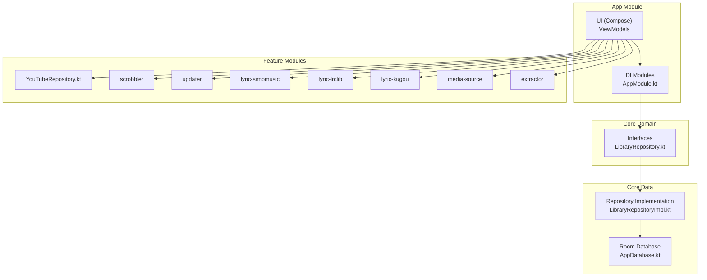
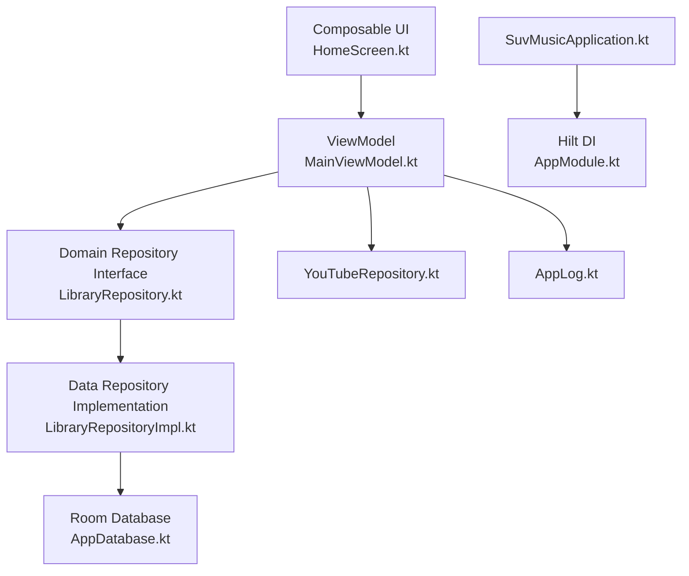
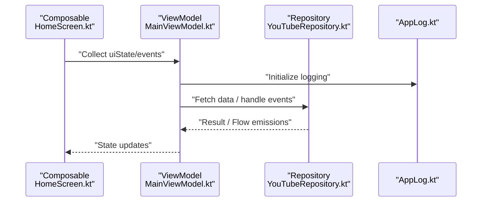
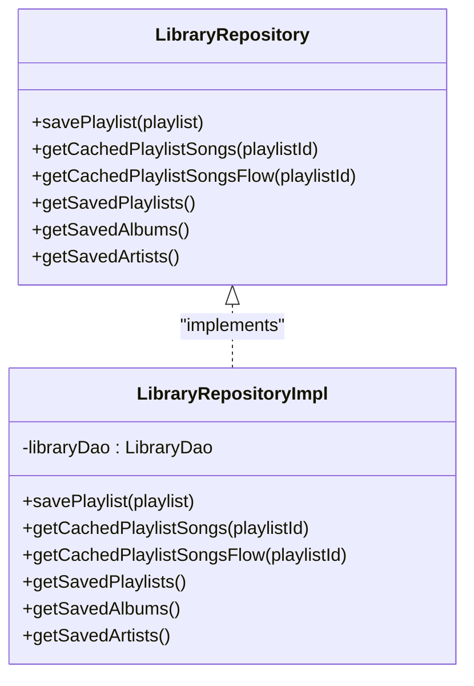
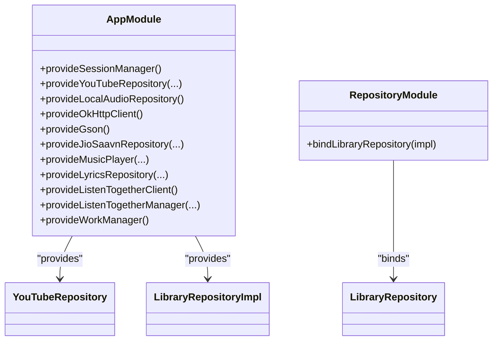
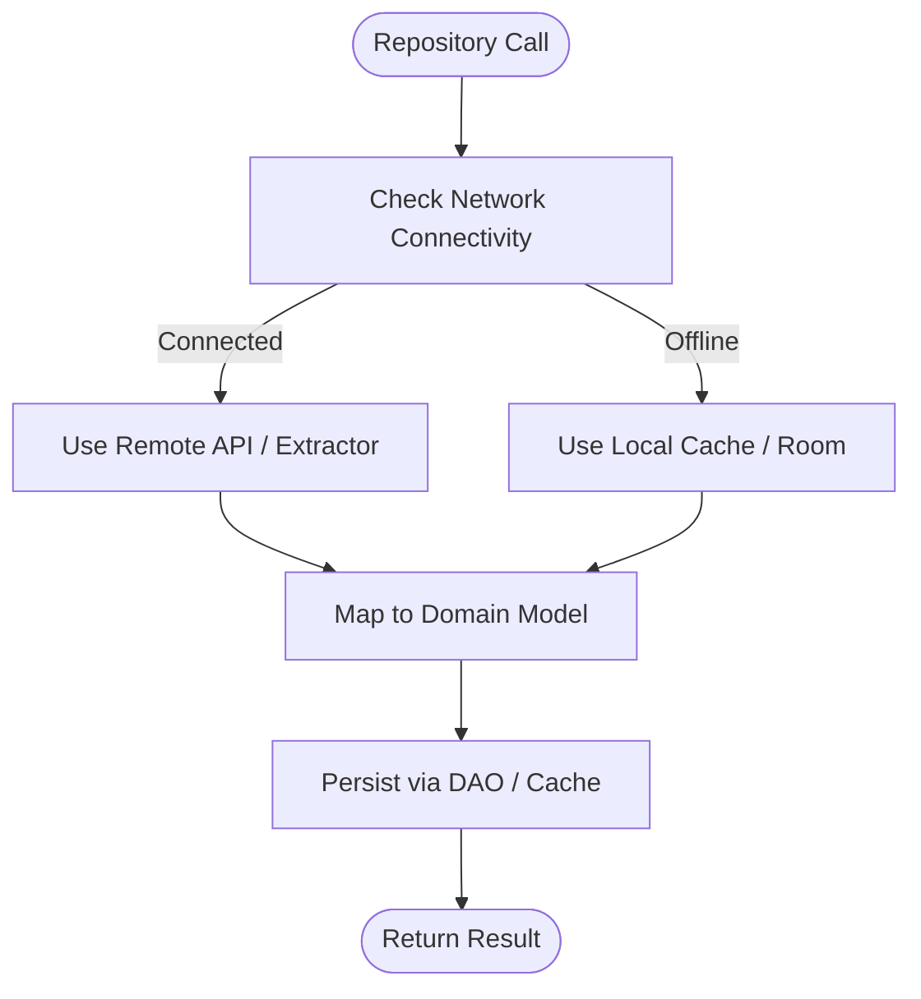
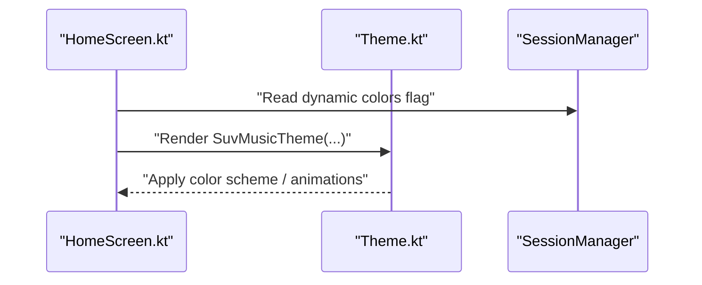
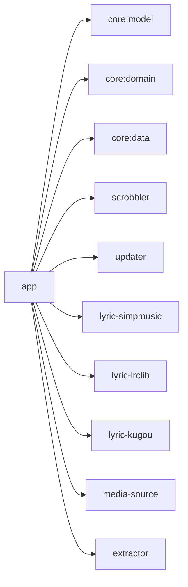
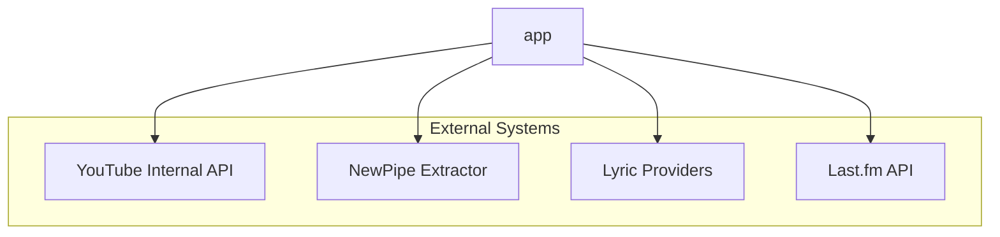

# Application Architecture

<cite>
**Referenced Files in This Document**
- [SuvMusicApplication.kt](file://app/src/main/java/com/suvojeet/suvmusic/SuvMusicApplication.kt)
- [AppModule.kt](file://app/src/main/java/com/suvojeet/suvmusic/di/AppModule.kt)
- [RepositoryModule.kt](file://core/data/src/main/java/com/suvojeet/suvmusic/core/data/di/RepositoryModule.kt)
- [LibraryRepository.kt](file://core/domain/src/main/java/com/suvojeet/suvmusic/core/domain/repository/LibraryRepository.kt)
- [LibraryRepositoryImpl.kt](file://core/data/src/main/java/com/suvojeet/suvmusic/core/data/repository/LibraryRepositoryImpl.kt)
- [YouTubeRepository.kt](file://app/src/main/java/com/suvojeet/suvmusic/data/repository/YouTubeRepository.kt)
- [MainViewModel.kt](file://app/src/main/java/com/suvojeet/suvmusic/ui/viewmodel/MainViewModel.kt)
- [HomeScreen.kt](file://app/src/main/java/com/suvojeet/suvmusic/ui/screens/HomeScreen.kt)
- [Theme.kt](file://app/src/main/java/com/suvojeet/suvmusic/ui/theme/Theme.kt)
- [Song.kt](file://core/model/src/main/java/com/suvojeet/suvmusic/core/model/Song.kt)
- [AppLog.kt](file://app/src/main/java/com/suvojeet/suvmusic/util/AppLog.kt)
- [AppDatabase.kt](file://core/data/src/main/java/com/suvojeet/suvmusic/core/data/local/AppDatabase.kt)
- [build.gradle.kts](file://app/build.gradle.kts)
- [settings.gradle.kts](file://settings.gradle.kts)
</cite>

## Table of Contents
1. [Introduction](#introduction)
2. [Project Structure](#project-structure)
3. [Core Components](#core-components)
4. [Architecture Overview](#architecture-overview)
5. [Detailed Component Analysis](#detailed-component-analysis)
6. [Dependency Analysis](#dependency-analysis)
7. [Performance Considerations](#performance-considerations)
8. [Troubleshooting Guide](#troubleshooting-guide)
9. [Conclusion](#conclusion)
10. [Appendices](#appendices)

## Introduction
This document describes the clean architecture implementation of SuvMusic, focusing on MVVM with Jetpack Compose, the repository pattern for data access, and dependency injection with Hilt. It explains how the application separates presentation, domain, and data layers, how modules integrate, and how cross-cutting concerns such as logging, error handling, and performance are addressed. The goal is to provide a clear understanding of the system’s design, data flows, and integration points for both technical and non-technical readers.

## Project Structure
SuvMusic follows a multi-module Gradle structure with a clear separation of concerns:
- app: The Android application module containing UI (Jetpack Compose), ViewModels, services, workers, and DI configuration.
- core modules:
  - core:model: Shared domain models and enums.
  - core:domain: Domain interfaces and abstractions (e.g., repositories).
  - core:data: Data implementations, Room database, DAOs, and repository implementations.
- Feature modules:
  - scrobbler: Last.fm scrobbling integration.
  - updater: Update checking and downloading.
  - media-source: Shared lyrics provider interfaces.
  - lyric-*: Concrete lyrics providers.
  - extractor: NewPipe extraction integration.

**Diagram sources**
- [settings.gradle.kts:18-30](file://settings.gradle.kts#L18-L30)
- [build.gradle.kts:254-265](file://app/build.gradle.kts#L254-L265)
- [AppModule.kt:21-167](file://app/src/main/java/com/suvojeet/suvmusic/di/AppModule.kt#L21-L167)
- [RepositoryModule.kt:10-18](file://core/data/src/main/java/com/suvojeet/suvmusic/core/data/di/RepositoryModule.kt#L10-L18)
- [LibraryRepository.kt:11-36](file://core/domain/src/main/java/com/suvojeet/suvmusic/core/domain/repository/LibraryRepository.kt#L11-L36)
- [LibraryRepositoryImpl.kt:19-252](file://core/data/src/main/java/com/suvojeet/suvmusic/core/data/repository/LibraryRepositoryImpl.kt#L19-L252)
- [AppDatabase.kt:16-36](file://core/data/src/main/java/com/suvojeet/suvmusic/core/data/local/AppDatabase.kt#L16-L36)
- [YouTubeRepository.kt:47-90](file://app/src/main/java/com/suvojeet/suvmusic/data/repository/YouTubeRepository.kt#L47-L90)

**Section sources**
- [settings.gradle.kts:18-30](file://settings.gradle.kts#L18-L30)
- [build.gradle.kts:14-110](file://app/build.gradle.kts#L14-L110)

## Core Components
- Presentation Layer (MVVM with Jetpack Compose):
  - ViewModels manage UI state and orchestrate interactions with repositories and services.
  - Composables consume StateFlow/SharedFlow from ViewModels and render UI.
- Domain Layer:
  - Defines repository interfaces and domain models.
- Data Layer:
  - Implements repositories and provides data sources (network, local Room DB, external libraries).
- DI with Hilt:
  - Centralized provision of singletons and scoped instances across modules.
- Cross-Cutting Concerns:
  - Logging via AppLog, crash reporting via ACRA, caching and image loading via Coil, and WorkManager for background tasks.

**Section sources**
- [MainViewModel.kt:35-149](file://app/src/main/java/com/suvojeet/suvmusic/ui/viewmodel/MainViewModel.kt#L35-L149)
- [HomeScreen.kt:84-637](file://app/src/main/java/com/suvojeet/suvmusic/ui/screens/HomeScreen.kt#L84-L637)
- [LibraryRepository.kt:11-36](file://core/domain/src/main/java/com/suvojeet/suvmusic/core/domain/repository/LibraryRepository.kt#L11-L36)
- [LibraryRepositoryImpl.kt:19-252](file://core/data/src/main/java/com/suvojeet/suvmusic/core/data/repository/LibraryRepositoryImpl.kt#L19-L252)
- [YouTubeRepository.kt:47-90](file://app/src/main/java/com/suvojeet/suvmusic/data/repository/YouTubeRepository.kt#L47-L90)
- [AppLog.kt:17-113](file://app/src/main/java/com/suvojeet/suvmusic/util/AppLog.kt#L17-L113)
- [SuvMusicApplication.kt:31-129](file://app/src/main/java/com/suvojeet/suvmusic/SuvMusicApplication.kt#L31-L129)

## Architecture Overview
SuvMusic implements a layered clean architecture:
- Presentation: Composables and ViewModels expose StateFlow/SharedFlow to UI and react to events.
- Domain: Interfaces define capabilities (e.g., LibraryRepository).
- Data: Implementations provide concrete behavior (e.g., LibraryRepositoryImpl) and coordinate network/local sources.
- Infrastructure: Hilt provides DI, Room persists data, OkHttp handles networking, Coil manages images, WorkManager schedules tasks.

**Diagram sources**
- [HomeScreen.kt:84-150](file://app/src/main/java/com/suvojeet/suvmusic/ui/screens/HomeScreen.kt#L84-L150)
- [MainViewModel.kt:35-77](file://app/src/main/java/com/suvojeet/suvmusic/ui/viewmodel/MainViewModel.kt#L35-L77)
- [LibraryRepository.kt:11-36](file://core/domain/src/main/java/com/suvojeet/suvmusic/core/domain/repository/LibraryRepository.kt#L11-L36)
- [LibraryRepositoryImpl.kt:19-252](file://core/data/src/main/java/com/suvojeet/suvmusic/core/data/repository/LibraryRepositoryImpl.kt#L19-L252)
- [AppDatabase.kt:16-36](file://core/data/src/main/java/com/suvojeet/suvmusic/core/data/local/AppDatabase.kt#L16-L36)
- [YouTubeRepository.kt:47-90](file://app/src/main/java/com/suvojeet/suvmusic/data/repository/YouTubeRepository.kt#L47-L90)
- [AppLog.kt:17-113](file://app/src/main/java/com/suvojeet/suvmusic/util/AppLog.kt#L17-L113)
- [SuvMusicApplication.kt:31-129](file://app/src/main/java/com/suvojeet/suvmusic/SuvMusicApplication.kt#L31-L129)
- [AppModule.kt:21-167](file://app/src/main/java/com/suvojeet/suvmusic/di/AppModule.kt#L21-L167)

## Detailed Component Analysis

### MVVM with Jetpack Compose
- ViewModels encapsulate UI state and side effects, exposing StateFlow and SharedFlow to Compose.
- Composables observe state and collect events, reacting to user actions and repository updates.
- Example: MainViewModel initializes cache cleanup and exposes events for deep links and audio intents.

**Diagram sources**
- [HomeScreen.kt:84-150](file://app/src/main/java/com/suvojeet/suvmusic/ui/screens/HomeScreen.kt#L84-L150)
- [MainViewModel.kt:35-149](file://app/src/main/java/com/suvojeet/suvmusic/ui/viewmodel/MainViewModel.kt#L35-L149)
- [YouTubeRepository.kt:239-242](file://app/src/main/java/com/suvojeet/suvmusic/data/repository/YouTubeRepository.kt#L239-L242)
- [AppLog.kt:28-41](file://app/src/main/java/com/suvojeet/suvmusic/util/AppLog.kt#L28-L41)

**Section sources**
- [MainViewModel.kt:35-149](file://app/src/main/java/com/suvojeet/suvmusic/ui/viewmodel/MainViewModel.kt#L35-L149)
- [HomeScreen.kt:84-150](file://app/src/main/java/com/suvojeet/suvmusic/ui/screens/HomeScreen.kt#L84-L150)

### Repository Pattern
- Domain interface defines library operations (e.g., playlist CRUD, saved items).
- Data implementation performs mapping between domain models and entities, coordinates DAOs, and applies transformations.
- Example: LibraryRepositoryImpl maps PlaylistSongEntity to Song and vice versa, exposes Flow-based queries, and persists data via Room.

**Diagram sources**
- [LibraryRepository.kt:11-36](file://core/domain/src/main/java/com/suvojeet/suvmusic/core/domain/repository/LibraryRepository.kt#L11-L36)
- [LibraryRepositoryImpl.kt:19-252](file://core/data/src/main/java/com/suvojeet/suvmusic/core/data/repository/LibraryRepositoryImpl.kt#L19-L252)

**Section sources**
- [LibraryRepository.kt:11-36](file://core/domain/src/main/java/com/suvojeet/suvmusic/core/domain/repository/LibraryRepository.kt#L11-L36)
- [LibraryRepositoryImpl.kt:19-252](file://core/data/src/main/java/com/suvojeet/suvmusic/core/data/repository/LibraryRepositoryImpl.kt#L19-L252)

### Dependency Injection with Hilt
- Hilt provides singletons and scoped instances across modules.
- AppModule wires repositories, OkHttp clients, Gson, MusicPlayer, and other services.
- RepositoryModule binds the concrete implementation to the domain interface.

**Diagram sources**
- [AppModule.kt:21-167](file://app/src/main/java/com/suvojeet/suvmusic/di/AppModule.kt#L21-L167)
- [RepositoryModule.kt:10-18](file://core/data/src/main/java/com/suvojeet/suvmusic/core/data/di/RepositoryModule.kt#L10-L18)

**Section sources**
- [AppModule.kt:21-167](file://app/src/main/java/com/suvojeet/suvmusic/di/AppModule.kt#L21-L167)
- [RepositoryModule.kt:10-18](file://core/data/src/main/java/com/suvojeet/suvmusic/core/data/di/RepositoryModule.kt#L10-L18)

### Data Access and Domain Models
- Domain model Song encapsulates fields for YouTube, local, and JioSaavn sources.
- YouTubeRepository orchestrates search, streaming, and browsing using NewPipe and internal APIs.
- AppDatabase defines Room entities and DAOs for library, history, genres, and dislikes.

**Diagram sources**
- [YouTubeRepository.kt:239-242](file://app/src/main/java/com/suvojeet/suvmusic/data/repository/YouTubeRepository.kt#L239-L242)
- [Song.kt:9-117](file://core/model/src/main/java/com/suvojeet/suvmusic/core/model/Song.kt#L9-L117)
- [AppDatabase.kt:16-36](file://core/data/src/main/java/com/suvojeet/suvmusic/core/data/local/AppDatabase.kt#L16-L36)

**Section sources**
- [Song.kt:9-117](file://core/model/src/main/java/com/suvojeet/suvmusic/core/model/Song.kt#L9-L117)
- [YouTubeRepository.kt:239-242](file://app/src/main/java/com/suvojeet/suvmusic/data/repository/YouTubeRepository.kt#L239-L242)
- [AppDatabase.kt:16-36](file://core/data/src/main/java/com/suvojeet/suvmusic/core/data/local/AppDatabase.kt#L16-L36)

### UI Theming and Composition
- Theme.kt defines color schemes, animations, and dynamic color integration.
- Composables observe session-managed flows to adapt UI behavior (e.g., animated backgrounds).

**Diagram sources**
- [HomeScreen.kt:151-167](file://app/src/main/java/com/suvojeet/suvmusic/ui/screens/HomeScreen.kt#L151-L167)
- [Theme.kt:207-306](file://app/src/main/java/com/suvojeet/suvmusic/ui/theme/Theme.kt#L207-L306)

**Section sources**
- [Theme.kt:207-306](file://app/src/main/java/com/suvojeet/suvmusic/ui/theme/Theme.kt#L207-L306)
- [HomeScreen.kt:151-167](file://app/src/main/java/com/suvojeet/suvmusic/ui/screens/HomeScreen.kt#L151-L167)

## Dependency Analysis
- Module dependencies:
  - app depends on core modules and feature modules via implementation(project(...)).
  - DI modules are centralized in app and bind core interfaces to implementations.
- External dependencies:
  - Compose, Media3, Room, Hilt, Coil, WorkManager, OkHttp, Retrofit, Ktor, Jsoup, Protobuf, and more.

**Diagram sources**
- [build.gradle.kts:254-265](file://app/build.gradle.kts#L254-L265)
- [settings.gradle.kts:18-30](file://settings.gradle.kts#L18-L30)

**Section sources**
- [build.gradle.kts:140-265](file://app/build.gradle.kts#L140-L265)
- [settings.gradle.kts:18-30](file://settings.gradle.kts#L18-L30)

## Performance Considerations
- Image caching and memory tuning:
  - Coil configured with memory and disk caches, crossfade, and debug logging in debug builds.
- Network timeouts and connection pooling:
  - OkHttp clients configured with explicit timeouts and pooled connections.
- Background scheduling:
  - WorkManager periodic work with constraints for connectivity.
- UI responsiveness:
  - Compose animations and state hoisting minimize recompositions.
- Resource optimization:
  - ABI filters and resource configurations limit APK size.

**Section sources**
- [SuvMusicApplication.kt:89-109](file://app/src/main/java/com/suvojeet/suvmusic/SuvMusicApplication.kt#L89-L109)
- [AppModule.kt:59-66](file://app/src/main/java/com/suvojeet/suvmusic/di/AppModule.kt#L59-L66)
- [SuvMusicApplication.kt:111-127](file://app/src/main/java/com/suvojeet/suvmusic/SuvMusicApplication.kt#L111-L127)
- [build.gradle.kts:27-34](file://app/build.gradle.kts#L27-L34)

## Troubleshooting Guide
- Logging:
  - AppLog supports runtime toggling and writes to a persistent file when enabled.
- Crash reporting:
  - ACRA initialized in Application with notification and logcat capture.
- Error handling patterns:
  - ViewModels collect events and emit UI-visible messages.
  - Repository methods return empty lists or null when offline or on exceptions.

**Section sources**
- [AppLog.kt:28-113](file://app/src/main/java/com/suvojeet/suvmusic/util/AppLog.kt#L28-L113)
- [SuvMusicApplication.kt:40-61](file://app/src/main/java/com/suvojeet/suvmusic/SuvMusicApplication.kt#L40-L61)
- [MainViewModel.kt:79-118](file://app/src/main/java/com/suvojeet/suvmusic/ui/viewmodel/MainViewModel.kt#L79-L118)
- [YouTubeRepository.kt:133-175](file://app/src/main/java/com/suvojeet/suvmusic/data/repository/YouTubeRepository.kt#L133-L175)

## Conclusion
SuvMusic’s architecture cleanly separates concerns across presentation, domain, and data layers, with DI via Hilt ensuring modularity and testability. The MVVM + Jetpack Compose UI is reactive and efficient, while the repository pattern centralizes data access and enables pluggable providers. Cross-cutting concerns like logging, crash reporting, and caching are integrated thoughtfully. The modular Gradle setup and Room persistence provide scalability and maintainability.

## Appendices

### System Context and Module Relationships
- System boundary: app module orchestrates UI, DI, and integrations; core modules define shared contracts and implementations; feature modules encapsulate domain-specific integrations.
- Integration patterns:
  - YouTubeRepository integrates NewPipe and internal APIs.
  - Lyric providers are pluggable modules.
  - Scrobbler and Updater are separate modules wired via DI.

[No sources needed since this diagram shows conceptual relationships]