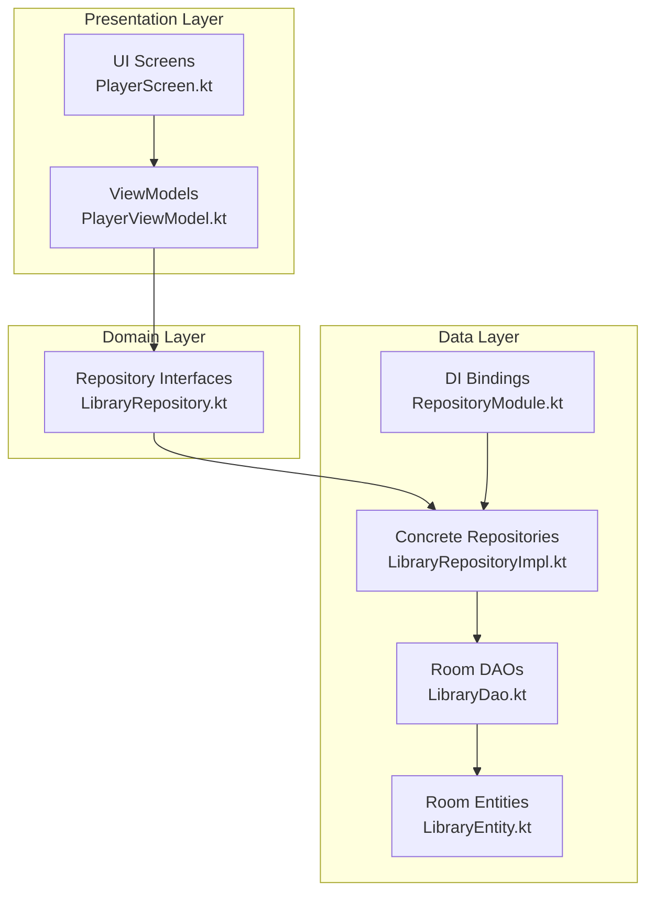
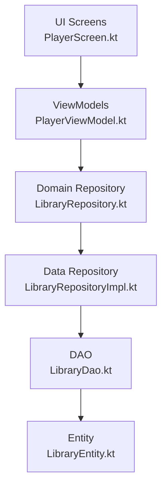
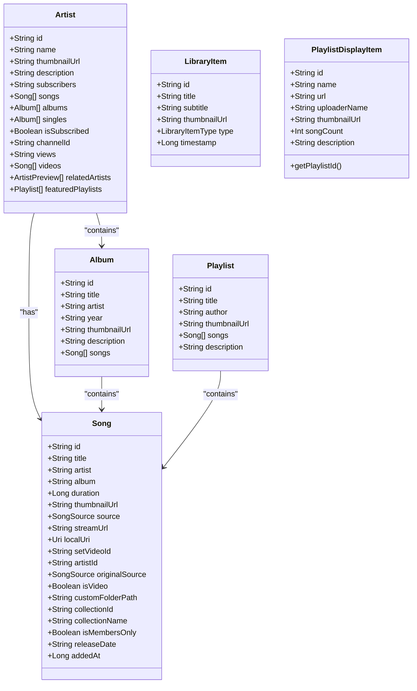
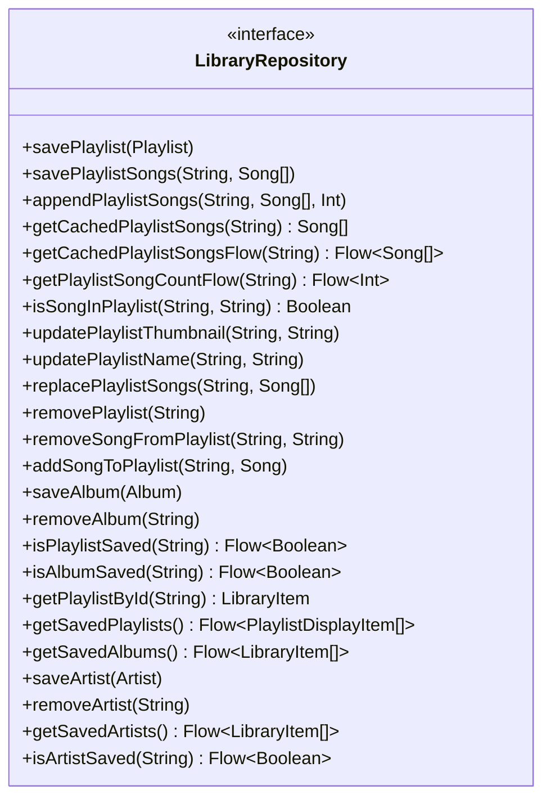
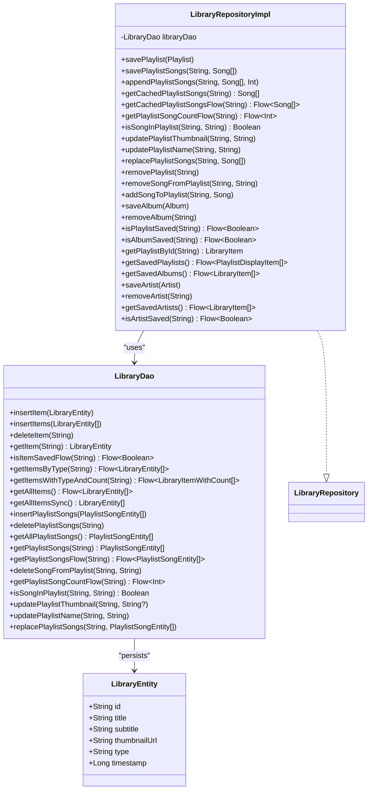
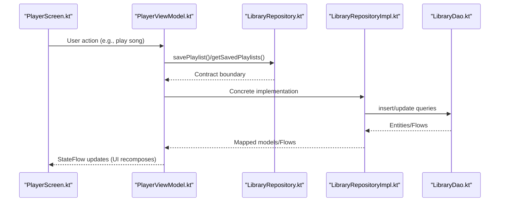
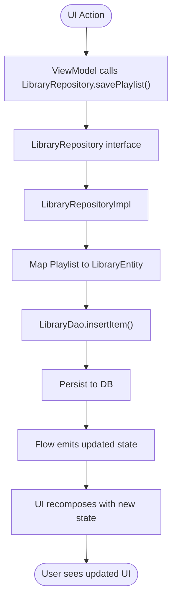
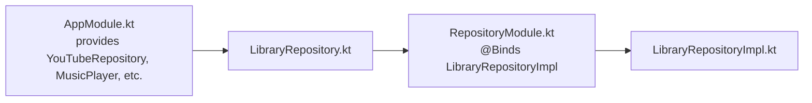

# Clean Architecture Implementation

<cite>
**Referenced Files in This Document**
- [Song.kt](file://core/model/src/main/java/com/suvojeet/suvmusic/core/model/Song.kt)
- [Artist.kt](file://core/model/src/main/java/com/suvojeet/suvmusic/core/model/Artist.kt)
- [Album.kt](file://core/model/src/main/java/com/suvojeet/suvmusic/core/model/Album.kt)
- [Playlist.kt](file://core/model/src/main/java/com/suvojeet/suvmusic/core/model/Playlist.kt)
- [LibraryItem.kt](file://core/model/src/main/java/com/suvojeet/suvmusic/core/model/LibraryItem.kt)
- [PlaylistDisplayItem.kt](file://core/model/src/main/java/com/suvojeet/suvmusic/core/model/PlaylistDisplayItem.kt)
- [LibraryRepository.kt](file://core/domain/src/main/java/com/suvojeet/suvmusic/core/domain/repository/LibraryRepository.kt)
- [LibraryRepositoryImpl.kt](file://core/data/src/main/java/com/suvojeet/suvmusic/core/data/repository/LibraryRepositoryImpl.kt)
- [LibraryEntity.kt](file://core/data/src/main/java/com/suvojeet/suvmusic/core/data/local/entity/LibraryEntity.kt)
- [LibraryDao.kt](file://core/data/src/main/java/com/suvojeet/suvmusic/core/data/local/dao/LibraryDao.kt)
- [RepositoryModule.kt](file://core/data/src/main/java/com/suvojeet/suvmusic/core/data/di/RepositoryModule.kt)
- [PlayerViewModel.kt](file://app/src/main/java/com/suvojeet/suvmusic/ui/viewmodel/PlayerViewModel.kt)
- [PlayerScreen.kt](file://app/src/main/java/com/suvojeet/suvmusic/ui/screens/player/PlayerScreen.kt)
- [AppModule.kt](file://app/src/main/java/com/suvojeet/suvmusic/di/AppModule.kt)
</cite>

## Table of Contents
1. [Introduction](#introduction)
2. [Project Structure](#project-structure)
3. [Core Components](#core-components)
4. [Architecture Overview](#architecture-overview)
5. [Detailed Component Analysis](#detailed-component-analysis)
6. [Dependency Analysis](#dependency-analysis)
7. [Performance Considerations](#performance-considerations)
8. [Troubleshooting Guide](#troubleshooting-guide)
9. [Conclusion](#conclusion)

## Introduction
This document explains how SuvMusic implements Clean Architecture with three distinct layers:
- Presentation: UI screens and ViewModels that expose state and handle user interactions.
- Domain: Interfaces and use-case boundaries that define business logic and dependencies.
- Data: Concrete implementations that handle persistence and external integrations.

The model layer defines immutable core entities (Song, Artist, Album, Playlist, LibraryItem, PlaylistDisplayItem) that are shared across layers. The domain layer enforces dependency inversion via repository interfaces. The data layer implements repositories and persists data locally, while the presentation layer orchestrates flows from UI to repositories and back.

## Project Structure
SuvMusic organizes code by layer and feature:
- core/model: Immutable domain models used across the app.
- core/domain: Repository interfaces and domain contracts.
- core/data: Concrete repositories, Room DAOs/entities, and DI bindings.
- app: UI screens, ViewModels, DI modules, and platform-specific code.

**Diagram sources**
- [PlayerScreen.kt:200-496](file://app/src/main/java/com/suvojeet/suvmusic/ui/screens/player/PlayerScreen.kt#L200-L496)
- [PlayerViewModel.kt:58-75](file://app/src/main/java/com/suvojeet/suvmusic/ui/viewmodel/PlayerViewModel.kt#L58-L75)
- [LibraryRepository.kt:11-36](file://core/domain/src/main/java/com/suvojeet/suvmusic/core/domain/repository/LibraryRepository.kt#L11-L36)
- [LibraryRepositoryImpl.kt:19-22](file://core/data/src/main/java/com/suvojeet/suvmusic/core/data/repository/LibraryRepositoryImpl.kt#L19-L22)
- [LibraryDao.kt:14-89](file://core/data/src/main/java/com/suvojeet/suvmusic/core/data/local/dao/LibraryDao.kt#L14-L89)
- [LibraryEntity.kt:7-14](file://core/data/src/main/java/com/suvojeet/suvmusic/core/data/local/entity/LibraryEntity.kt#L7-L14)
- [RepositoryModule.kt:14-17](file://core/data/src/main/java/com/suvojeet/suvmusic/core/data/di/RepositoryModule.kt#L14-L17)

**Section sources**
- [Song.kt:9-29](file://core/model/src/main/java/com/suvojeet/suvmusic/core/model/Song.kt#L9-L29)
- [Artist.kt:3-18](file://core/model/src/main/java/com/suvojeet/suvmusic/core/model/Artist.kt#L3-L18)
- [Album.kt:3-11](file://core/model/src/main/java/com/suvojeet/suvmusic/core/model/Album.kt#L3-L11)
- [Playlist.kt:3-10](file://core/model/src/main/java/com/suvojeet/suvmusic/core/model/Playlist.kt#L3-L10)
- [LibraryItem.kt:3-10](file://core/model/src/main/java/com/suvojeet/suvmusic/core/model/LibraryItem.kt#L3-L10)
- [PlaylistDisplayItem.kt:7-23](file://core/model/src/main/java/com/suvojeet/suvmusic/core/model/PlaylistDisplayItem.kt#L7-L23)

## Core Components
- Model layer: Immutable data classes representing core domain concepts.
  - Song: Encapsulates playback metadata and source-specific attributes.
  - Artist and ArtistPreview: Artist profiles and previews.
  - Album: Album metadata and associated songs.
  - Playlist: Playlist metadata and contained songs.
  - LibraryItem and PlaylistDisplayItem: Persistent library items and UI-friendly playlist summaries.
- Domain layer: Repository interface isolating business logic from data sources.
- Data layer: Concrete repository implementing persistence and mapping to/from models.

Benefits:
- Testability: Business logic depends on abstractions; tests can mock repositories.
- Maintainability: Clear separation of concerns; changes in data sources do not affect domain logic.
- Scalability: New repositories or data sources can be introduced without changing ViewModels.

**Section sources**
- [Song.kt:9-129](file://core/model/src/main/java/com/suvojeet/suvmusic/core/model/Song.kt#L9-L129)
- [Artist.kt:3-26](file://core/model/src/main/java/com/suvojeet/suvmusic/core/model/Artist.kt#L3-L26)
- [Album.kt:3-12](file://core/model/src/main/java/com/suvojeet/suvmusic/core/model/Album.kt#L3-L12)
- [Playlist.kt:3-11](file://core/model/src/main/java/com/suvojeet/suvmusic/core/model/Playlist.kt#L3-L11)
- [LibraryItem.kt:3-18](file://core/model/src/main/java/com/suvojeet/suvmusic/core/model/LibraryItem.kt#L3-L18)
- [PlaylistDisplayItem.kt:7-23](file://core/model/src/main/java/com/suvojeet/suvmusic/core/model/PlaylistDisplayItem.kt#L7-L23)
- [LibraryRepository.kt:11-36](file://core/domain/src/main/java/com/suvojeet/suvmusic/core/domain/repository/LibraryRepository.kt#L11-L36)

## Architecture Overview
Clean Architecture separates concerns into layers:
- Presentation: UI screens and ViewModels collect user actions and expose state streams.
- Domain: Repository interfaces define capabilities without specifying implementations.
- Data: Concrete repositories implement domain contracts, persist data, and coordinate external services.

**Diagram sources**
- [PlayerScreen.kt:200-496](file://app/src/main/java/com/suvojeet/suvmusic/ui/screens/player/PlayerScreen.kt#L200-L496)
- [PlayerViewModel.kt:58-75](file://app/src/main/java/com/suvojeet/suvmusic/ui/viewmodel/PlayerViewModel.kt#L58-L75)
- [LibraryRepository.kt:11-36](file://core/domain/src/main/java/com/suvojeet/suvmusic/core/domain/repository/LibraryRepository.kt#L11-L36)
- [LibraryRepositoryImpl.kt:19-22](file://core/data/src/main/java/com/suvojeet/suvmusic/core/data/repository/LibraryRepositoryImpl.kt#L19-L22)
- [LibraryDao.kt:14-89](file://core/data/src/main/java/com/suvojeet/suvmusic/core/data/local/dao/LibraryDao.kt#L14-L89)
- [LibraryEntity.kt:7-14](file://core/data/src/main/java/com/suvojeet/suvmusic/core/data/local/entity/LibraryEntity.kt#L7-L14)

## Detailed Component Analysis

### Model Layer: Immutable Entities
- Song encapsulates playback metadata and source-specific fields, with factory helpers to construct instances from various sources.
- Artist and Album represent aggregated entities with optional metadata and collections.
- Playlist aggregates songs and metadata for UI and persistence.
- LibraryItem and PlaylistDisplayItem bridge persistence and UI rendering.

**Diagram sources**
- [Song.kt:9-129](file://core/model/src/main/java/com/suvojeet/suvmusic/core/model/Song.kt#L9-L129)
- [Artist.kt:3-26](file://core/model/src/main/java/com/suvojeet/suvmusic/core/model/Artist.kt#L3-L26)
- [Album.kt:3-12](file://core/model/src/main/java/com/suvojeet/suvmusic/core/model/Album.kt#L3-L12)
- [Playlist.kt:3-11](file://core/model/src/main/java/com/suvojeet/suvmusic/core/model/Playlist.kt#L3-L11)
- [LibraryItem.kt:3-18](file://core/model/src/main/java/com/suvojeet/suvmusic/core/model/LibraryItem.kt#L3-L18)
- [PlaylistDisplayItem.kt:7-23](file://core/model/src/main/java/com/suvojeet/suvmusic/core/model/PlaylistDisplayItem.kt#L7-L23)

**Section sources**
- [Song.kt:9-129](file://core/model/src/main/java/com/suvojeet/suvmusic/core/model/Song.kt#L9-L129)
- [Artist.kt:3-26](file://core/model/src/main/java/com/suvojeet/suvmusic/core/model/Artist.kt#L3-L26)
- [Album.kt:3-12](file://core/model/src/main/java/com/suvojeet/suvmusic/core/model/Album.kt#L3-L12)
- [Playlist.kt:3-11](file://core/model/src/main/java/com/suvojeet/suvmusic/core/model/Playlist.kt#L3-L11)
- [LibraryItem.kt:3-18](file://core/model/src/main/java/com/suvojeet/suvmusic/core/model/LibraryItem.kt#L3-L18)
- [PlaylistDisplayItem.kt:7-23](file://core/model/src/main/java/com/suvojeet/suvmusic/core/model/PlaylistDisplayItem.kt#L7-L23)

### Domain Layer: Repository Interfaces and Dependency Inversion
- LibraryRepository defines operations for playlists, albums, and artists, exposing both suspending functions and reactive Flow streams.
- This interface decouples ViewModels and use-cases from concrete data implementations.

**Diagram sources**
- [LibraryRepository.kt:11-36](file://core/domain/src/main/java/com/suvojeet/suvmusic/core/domain/repository/LibraryRepository.kt#L11-L36)

**Section sources**
- [LibraryRepository.kt:11-36](file://core/domain/src/main/java/com/suvojeet/suvmusic/core/domain/repository/LibraryRepository.kt#L11-L36)

### Data Layer: Concrete Repositories, DAOs, and Entities
- LibraryRepositoryImpl implements the domain contract, mapping between models and database entities, and exposing reactive streams.
- LibraryDao defines Room queries for library items and playlist-song caching.
- LibraryEntity stores persisted library items.

**Diagram sources**
- [LibraryRepositoryImpl.kt:19-252](file://core/data/src/main/java/com/suvojeet/suvmusic/core/data/repository/LibraryRepositoryImpl.kt#L19-L252)
- [LibraryDao.kt:14-89](file://core/data/src/main/java/com/suvojeet/suvmusic/core/data/local/dao/LibraryDao.kt#L14-L89)
- [LibraryEntity.kt:7-24](file://core/data/src/main/java/com/suvojeet/suvmusic/core/data/local/entity/LibraryEntity.kt#L7-L24)

**Section sources**
- [LibraryRepositoryImpl.kt:19-252](file://core/data/src/main/java/com/suvojeet/suvmusic/core/data/repository/LibraryRepositoryImpl.kt#L19-L252)
- [LibraryDao.kt:14-89](file://core/data/src/main/java/com/suvojeet/suvmusic/core/data/local/dao/LibraryDao.kt#L14-L89)
- [LibraryEntity.kt:7-24](file://core/data/src/main/java/com/suvojeet/suvmusic/core/data/local/entity/LibraryEntity.kt#L7-L24)

### Presentation Layer: UI and ViewModels
- PlayerViewModel depends on multiple repositories and services, exposes StateFlow streams, and orchestrates data fetching and UI actions.
- PlayerScreen composes UI elements, collects ViewModel state, and triggers actions.

**Diagram sources**
- [PlayerScreen.kt:200-496](file://app/src/main/java/com/suvojeet/suvmusic/ui/screens/player/PlayerScreen.kt#L200-L496)
- [PlayerViewModel.kt:58-75](file://app/src/main/java/com/suvojeet/suvmusic/ui/viewmodel/PlayerViewModel.kt#L58-L75)
- [LibraryRepository.kt:11-36](file://core/domain/src/main/java/com/suvojeet/suvmusic/core/domain/repository/LibraryRepository.kt#L11-L36)
- [LibraryRepositoryImpl.kt:19-252](file://core/data/src/main/java/com/suvojeet/suvmusic/core/data/repository/LibraryRepositoryImpl.kt#L19-L252)
- [LibraryDao.kt:14-89](file://core/data/src/main/java/com/suvojeet/suvmusic/core/data/local/dao/LibraryDao.kt#L14-L89)

**Section sources**
- [PlayerViewModel.kt:58-75](file://app/src/main/java/com/suvojeet/suvmusic/ui/viewmodel/PlayerViewModel.kt#L58-L75)
- [PlayerScreen.kt:200-496](file://app/src/main/java/com/suvojeet/suvmusic/ui/screens/player/PlayerScreen.kt#L200-L496)

### Practical Data Flow Example: Save Playlist
- UI triggers a save action.
- ViewModel calls the repository interface.
- Concrete repository maps models to entities and persists via DAO.
- Reactive streams propagate changes back to UI.

**Diagram sources**
- [PlayerViewModel.kt:608-646](file://app/src/main/java/com/suvojeet/suvmusic/ui/viewmodel/PlayerViewModel.kt#L608-L646)
- [LibraryRepository.kt:12-12](file://core/domain/src/main/java/com/suvojeet/suvmusic/core/domain/repository/LibraryRepository.kt#L12-L12)
- [LibraryRepositoryImpl.kt:24-37](file://core/data/src/main/java/com/suvojeet/suvmusic/core/data/repository/LibraryRepositoryImpl.kt#L24-L37)
- [LibraryDao.kt:15-16](file://core/data/src/main/java/com/suvojeet/suvmusic/core/data/local/dao/LibraryDao.kt#L15-L16)
- [LibraryEntity.kt:7-14](file://core/data/src/main/java/com/suvojeet/suvmusic/core/data/local/entity/LibraryEntity.kt#L7-L14)

## Dependency Analysis
- DI binds the concrete repository to the domain interface at runtime.
- AppModule provides higher-level services and passes the LibraryRepository to consumers.
- RepositoryModule ensures the binding occurs in the Singleton component.

**Diagram sources**
- [AppModule.kt:35-47](file://app/src/main/java/com/suvojeet/suvmusic/di/AppModule.kt#L35-L47)
- [RepositoryModule.kt:14-17](file://core/data/src/main/java/com/suvojeet/suvmusic/core/data/di/RepositoryModule.kt#L14-L17)
- [LibraryRepository.kt:11-36](file://core/domain/src/main/java/com/suvojeet/suvmusic/core/domain/repository/LibraryRepository.kt#L11-L36)
- [LibraryRepositoryImpl.kt:19-22](file://core/data/src/main/java/com/suvojeet/suvmusic/core/data/repository/LibraryRepositoryImpl.kt#L19-L22)

**Section sources**
- [AppModule.kt:35-47](file://app/src/main/java/com/suvojeet/suvmusic/di/AppModule.kt#L35-L47)
- [RepositoryModule.kt:14-17](file://core/data/src/main/java/com/suvojeet/suvmusic/core/data/di/RepositoryModule.kt#L14-L17)

## Performance Considerations
- Reactive streams (Flow) minimize unnecessary recompositions and enable efficient UI updates.
- Mapping between models and entities is performed in repository implementations to keep UI lean.
- Batch operations (e.g., replacing playlist songs) reduce repeated writes to the database.

## Troubleshooting Guide
- Repository binding issues: Verify that RepositoryModule binds the concrete implementation to the interface.
- State not updating: Ensure ViewModel collects and exposes the correct StateFlow/Flow streams.
- Persistence anomalies: Confirm DAO queries and entity mappings align with repository logic.

**Section sources**
- [RepositoryModule.kt:14-17](file://core/data/src/main/java/com/suvojeet/suvmusic/core/data/di/RepositoryModule.kt#L14-L17)
- [LibraryRepositoryImpl.kt:98-115](file://core/data/src/main/java/com/suvojeet/suvmusic/core/data/repository/LibraryRepositoryImpl.kt#L98-L115)
- [LibraryDao.kt:63-76](file://core/data/src/main/java/com/suvojeet/suvmusic/core/data/local/dao/LibraryDao.kt#L63-L76)

## Conclusion
SuvMusic’s Clean Architecture cleanly separates presentation, domain, and data concerns. Immutable models unify the domain, repository interfaces enforce dependency inversion, and concrete implementations manage persistence and external integrations. This structure improves testability, maintainability, and scalability, enabling confident evolution of features and data sources.