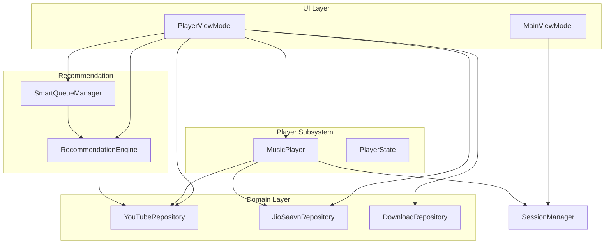
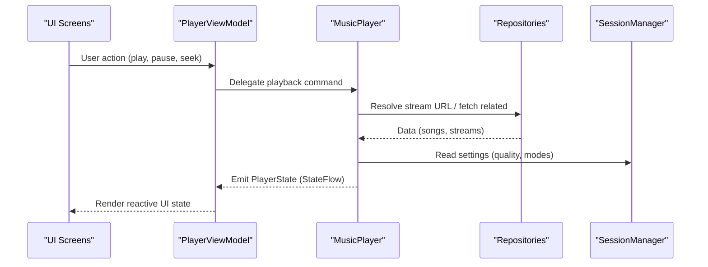
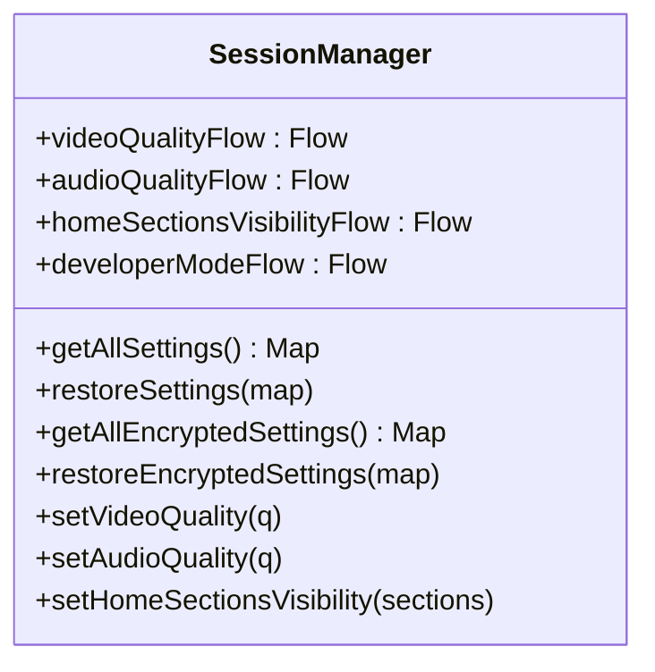
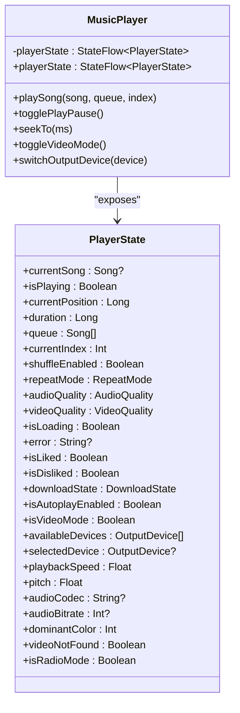
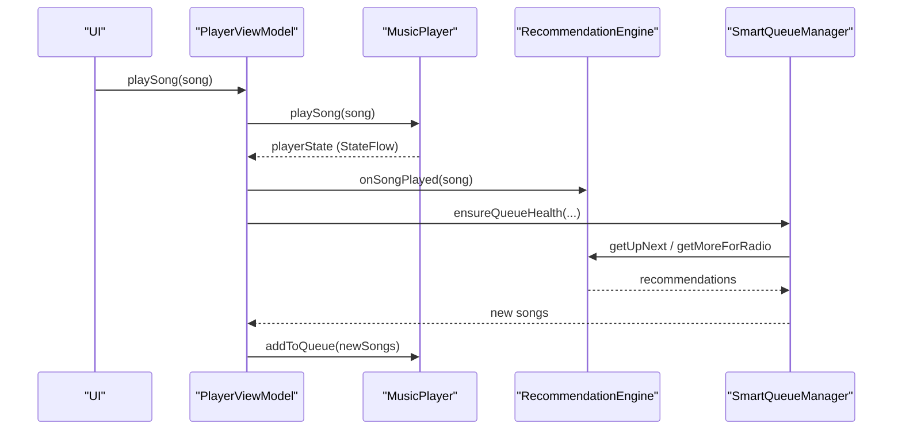
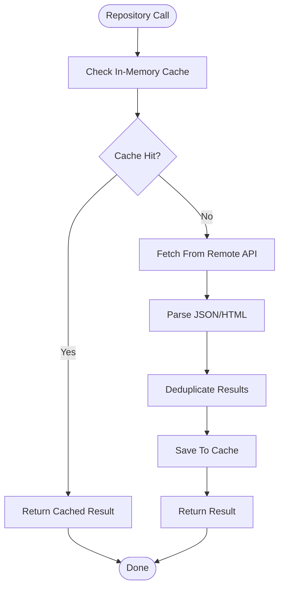
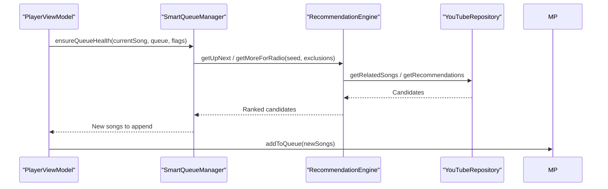
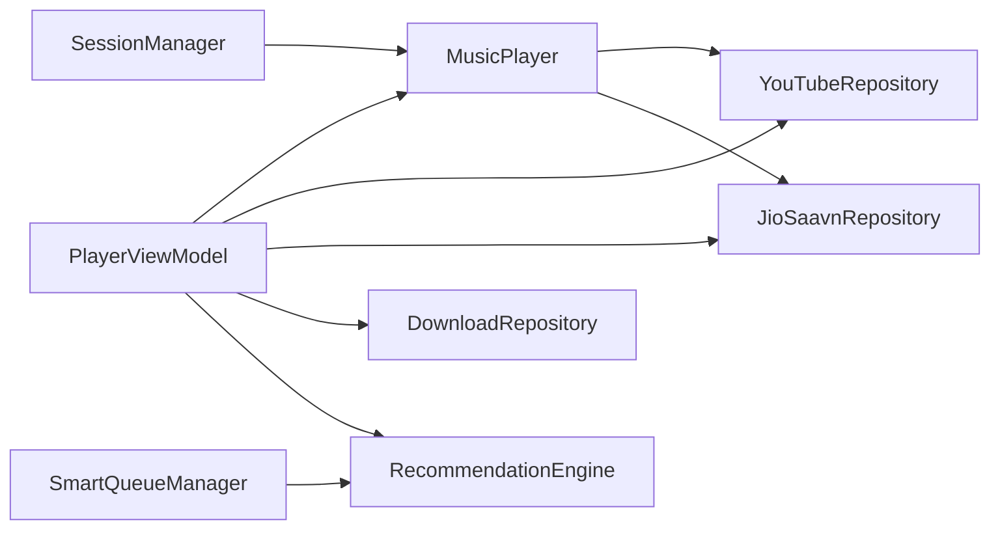

# Data Flow and State Management

<cite>
**Referenced Files in This Document**
- [SessionManager.kt](file://app/src/main/java/com/suvojeet/suvmusic/data/SessionManager.kt)
- [MainViewModel.kt](file://app/src/main/java/com/suvojeet/suvmusic/ui/viewmodel/MainViewModel.kt)
- [MusicPlayer.kt](file://app/src/main/java/com/suvojeet/suvmusic/player/MusicPlayer.kt)
- [PlayerViewModel.kt](file://app/src/main/java/com/suvojeet/suvmusic/ui/viewmodel/PlayerViewModel.kt)
- [PlayerState.kt](file://app/src/main/java/com/suvojeet/suvmusic/data/model/PlayerState.kt)
- [YouTubeRepository.kt](file://app/src/main/java/com/suvojeet/suvmusic/data/repository/YouTubeRepository.kt)
- [JioSaavnRepository.kt](file://app/src/main/java/com/suvojeet/suvmusic/data/repository/JioSaavnRepository.kt)
- [DownloadRepository.kt](file://app/src/main/java/com/suvojeet/suvmusic/data/repository/DownloadRepository.kt)
- [RecommendationEngine.kt](file://app/src/main/java/com/suvojeet/suvmusic/recommendation/RecommendationEngine.kt)
- [SmartQueueManager.kt](file://app/src/main/java/com/suvojeet/suvmusic/recommendation/SmartQueueManager.kt)
</cite>

## Table of Contents
1. [Introduction](#introduction)
2. [Project Structure](#project-structure)
3. [Core Components](#core-components)
4. [Architecture Overview](#architecture-overview)
5. [Detailed Component Analysis](#detailed-component-analysis)
6. [Dependency Analysis](#dependency-analysis)
7. [Performance Considerations](#performance-considerations)
8. [Troubleshooting Guide](#troubleshooting-guide)
9. [Conclusion](#conclusion)

## Introduction
This document explains the unidirectional data flow and reactive state management in SuvMusic. It traces how user interactions in the UI propagate through ViewModels to repositories and back, how SessionManager coordinates application-wide state, and how Kotlin Flows and StateFlow power real-time updates. It also covers complex flows such as music playback state, recommendation engine updates, and download progress tracking, along with caching strategies, data synchronization, error propagation, and performance considerations.

## Project Structure
SuvMusic follows a layered architecture:
- UI layer: Jetpack Compose screens and ViewModel classes
- Domain layer: Repositories encapsulating data sources (YouTube, JioSaavn, local)
- Player subsystem: MusicPlayer orchestrating playback and state
- Recommendation subsystem: RecommendationEngine and SmartQueueManager
- Session management: SessionManager coordinating persistent settings and state

**Diagram sources**
- [MainViewModel.kt:35-75](file://app/src/main/java/com/suvojeet/suvmusic/ui/viewmodel/MainViewModel.kt#L35-L75)
- [PlayerViewModel.kt:57-75](file://app/src/main/java/com/suvojeet/suvmusic/ui/viewmodel/PlayerViewModel.kt#L57-L75)
- [MusicPlayer.kt:58-72](file://app/src/main/java/com/suvojeet/suvmusic/player/MusicPlayer.kt#L58-L72)
- [YouTubeRepository.kt:52-62](file://app/src/main/java/com/suvojeet/suvmusic/data/repository/YouTubeRepository.kt#L52-L62)
- [JioSaavnRepository.kt:31-34](file://app/src/main/java/com/suvojeet/suvmusic/data/repository/JioSaavnRepository.kt#L31-L34)
- [DownloadRepository.kt:40-46](file://app/src/main/java/com/suvojeet/suvmusic/data/repository/DownloadRepository.kt#L40-L46)
- [RecommendationEngine.kt:41-49](file://app/src/main/java/com/suvojeet/suvmusic/recommendation/RecommendationEngine.kt#L41-L49)
- [SmartQueueManager.kt:23-25](file://app/src/main/java/com/suvojeet/suvmusic/recommendation/SmartQueueManager.kt#L23-L25)
- [SessionManager.kt:63-72](file://app/src/main/java/com/suvojeet/suvmusic/data/SessionManager.kt#L63-L72)

**Section sources**
- [MainViewModel.kt:35-75](file://app/src/main/java/com/suvojeet/suvmusic/ui/viewmodel/MainViewModel.kt#L35-L75)
- [PlayerViewModel.kt:57-75](file://app/src/main/java/com/suvojeet/suvmusic/ui/viewmodel/PlayerViewModel.kt#L57-L75)
- [MusicPlayer.kt:58-72](file://app/src/main/java/com/suvojeet/suvmusic/player/MusicPlayer.kt#L58-L72)
- [YouTubeRepository.kt:52-62](file://app/src/main/java/com/suvojeet/suvmusic/data/repository/YouTubeRepository.kt#L52-L62)
- [JioSaavnRepository.kt:31-34](file://app/src/main/java/com/suvojeet/suvmusic/data/repository/JioSaavnRepository.kt#L31-L34)
- [DownloadRepository.kt:40-46](file://app/src/main/java/com/suvojeet/suvmusic/data/repository/DownloadRepository.kt#L40-L46)
- [RecommendationEngine.kt:41-49](file://app/src/main/java/com/suvojeet/suvmusic/recommendation/RecommendationEngine.kt#L41-L49)
- [SmartQueueManager.kt:23-25](file://app/src/main/java/com/suvojeet/suvmusic/recommendation/SmartQueueManager.kt#L23-L25)
- [SessionManager.kt:63-72](file://app/src/main/java/com/suvojeet/suvmusic/data/SessionManager.kt#L63-L72)

## Core Components
- SessionManager: Central coordinator for persistent settings and reactive state (DataStore-backed). Exposes Flows for UI to observe and react to changes.
- MusicPlayer: Reactive playback state container using StateFlow. Bridges UI and the media session service.
- PlayerViewModel: Orchestrates UI actions, observes MusicPlayer state, and coordinates repositories for lyrics, comments, related songs, downloads, and recommendations.
- YouTubeRepository and JioSaavnRepository: Encapsulate remote data sources with caching and pagination.
- DownloadRepository: Tracks download progress and state using StateFlow and mutex-controlled concurrency.
- RecommendationEngine and SmartQueueManager: Provide intelligent queue management and recommendation updates.

**Section sources**
- [SessionManager.kt:231-243](file://app/src/main/java/com/suvojeet/suvmusic/data/SessionManager.kt#L231-L243)
- [MusicPlayer.kt:83-84](file://app/src/main/java/com/suvojeet/suvmusic/player/MusicPlayer.kt#L83-L84)
- [PlayerViewModel.kt:77-83](file://app/src/main/java/com/suvojeet/suvmusic/ui/viewmodel/PlayerViewModel.kt#L77-L83)
- [YouTubeRepository.kt:239-242](file://app/src/main/java/com/suvojeet/suvmusic/data/repository/YouTubeRepository.kt#L239-L242)
- [JioSaavnRepository.kt:59-87](file://app/src/main/java/com/suvojeet/suvmusic/data/repository/JioSaavnRepository.kt#L59-L87)
- [DownloadRepository.kt:60-68](file://app/src/main/java/com/suvojeet/suvmusic/data/repository/DownloadRepository.kt#L60-L68)
- [RecommendationEngine.kt:509-581](file://app/src/main/java/com/suvojeet/suvmusic/recommendation/RecommendationEngine.kt#L509-L581)
- [SmartQueueManager.kt:54-105](file://app/src/main/java/com/suvojeet/suvmusic/recommendation/SmartQueueManager.kt#L54-L105)

## Architecture Overview
The system enforces unidirectional data flow:
- UI emits commands to ViewModels
- ViewModels transform commands into repository calls and state updates
- Repositories fetch data from remote/local sources and cache results
- MusicPlayer maintains playback state and reacts to settings/state changes
- SessionManager persists and exposes reactive settings across components

**Diagram sources**
- [PlayerViewModel.kt:474-513](file://app/src/main/java/com/suvojeet/suvmusic/ui/viewmodel/PlayerViewModel.kt#L474-L513)
- [MusicPlayer.kt:501-598](file://app/src/main/java/com/suvojeet/suvmusic/player/MusicPlayer.kt#L501-L598)
- [YouTubeRepository.kt:264-273](file://app/src/main/java/com/suvojeet/suvmusic/data/repository/YouTubeRepository.kt#L264-L273)
- [SessionManager.kt:152-153](file://app/src/main/java/com/suvojeet/suvmusic/data/SessionManager.kt#L152-L153)

## Detailed Component Analysis

### SessionManager: Application-wide State Coordination
SessionManager centralizes persistent settings and exposes reactive Flows for UI consumption. It uses DataStore for type-safe preferences and EncryptedSharedPreferences for sensitive data.

Key responsibilities:
- Exposes Flow-based getters for settings (e.g., theme, audio quality, video quality, home sections visibility)
- Persists user preferences and encrypted tokens
- Provides helpers to restore settings from maps and manage developer mode

**Diagram sources**
- [SessionManager.kt:231-243](file://app/src/main/java/com/suvojeet/suvmusic/data/SessionManager.kt#L231-L243)
- [SessionManager.kt:453-474](file://app/src/main/java/com/suvojeet/suvmusic/data/SessionManager.kt#L453-L474)
- [SessionManager.kt:524-526](file://app/src/main/java/com/suvojeet/suvmusic/data/SessionManager.kt#L524-L526)

**Section sources**
- [SessionManager.kt:248-303](file://app/src/main/java/com/suvojeet/suvmusic/data/SessionManager.kt#L248-L303)
- [SessionManager.kt:403-414](file://app/src/main/java/com/suvojeet/suvmusic/data/SessionManager.kt#L403-L414)
- [SessionManager.kt:524-526](file://app/src/main/java/com/suvojeet/suvmusic/data/SessionManager.kt#L524-L526)

### MusicPlayer: Reactive Playback State
MusicPlayer wraps the media controller and exposes a StateFlow<PlayerState> representing the current playback state. It reacts to settings changes and updates widgets accordingly.

Highlights:
- PlayerState includes current song, queue, position, buffering, audio/video quality, and device list
- Reacts to settings via collected Flows (e.g., video quality, preloading)
- Emits significant state changes to update widgets efficiently

**Diagram sources**
- [MusicPlayer.kt:83-84](file://app/src/main/java/com/suvojeet/suvmusic/player/MusicPlayer.kt#L83-L84)
- [PlayerState.kt:7-52](file://app/src/main/java/com/suvojeet/suvmusic/data/model/PlayerState.kt#L7-L52)

**Section sources**
- [MusicPlayer.kt:150-197](file://app/src/main/java/com/suvojeet/suvmusic/player/MusicPlayer.kt#L150-L197)
- [PlayerState.kt:7-52](file://app/src/main/java/com/suvojeet/suvmusic/data/model/PlayerState.kt#L7-L52)

### PlayerViewModel: Orchestrating Playback and Recommendations
PlayerViewModel bridges UI actions with MusicPlayer and repositories. It:
- Exposes derived state (history/up next) and UI preferences (artwork shape, seekbar style)
- Observes MusicPlayer state and triggers repository calls for lyrics, comments, related songs
- Coordinates download state and radio mode
- Integrates with RecommendationEngine and SmartQueueManager for intelligent queue management

**Diagram sources**
- [PlayerViewModel.kt:474-485](file://app/src/main/java/com/suvojeet/suvmusic/ui/viewmodel/PlayerViewModel.kt#L474-L485)
- [PlayerViewModel.kt:330-375](file://app/src/main/java/com/suvojeet/suvmusic/ui/viewmodel/PlayerViewModel.kt#L330-L375)
- [RecommendationEngine.kt:589-645](file://app/src/main/java/com/suvojeet/suvmusic/recommendation/RecommendationEngine.kt#L589-L645)
- [SmartQueueManager.kt:54-105](file://app/src/main/java/com/suvojeet/suvmusic/recommendation/SmartQueueManager.kt#L54-L105)

**Section sources**
- [PlayerViewModel.kt:77-83](file://app/src/main/java/com/suvojeet/suvmusic/ui/viewmodel/PlayerViewModel.kt#L77-L83)
- [PlayerViewModel.kt:330-375](file://app/src/main/java/com/suvojeet/suvmusic/ui/viewmodel/PlayerViewModel.kt#L330-L375)
- [PlayerViewModel.kt:767-782](file://app/src/main/java/com/suvojeet/suvmusic/ui/viewmodel/PlayerViewModel.kt#L767-L782)

### YouTubeRepository and JioSaavnRepository: Data Sources
Repositories encapsulate remote APIs and caching:
- YouTubeRepository: Uses NewPipe for extraction and internal API for browsing/home sections. Implements pagination and deduplication.
- JioSaavnRepository: Provides caching for search, details, stream URLs, and playlists.

**Diagram sources**
- [YouTubeRepository.kt:284-309](file://app/src/main/java/com/suvojeet/suvmusic/data/repository/YouTubeRepository.kt#L284-L309)
- [JioSaavnRepository.kt:59-87](file://app/src/main/java/com/suvojeet/suvmusic/data/repository/JioSaavnRepository.kt#L59-L87)

**Section sources**
- [YouTubeRepository.kt:239-242](file://app/src/main/java/com/suvojeet/suvmusic/data/repository/YouTubeRepository.kt#L239-L242)
- [YouTubeRepository.kt:284-309](file://app/src/main/java/com/suvojeet/suvmusic/data/repository/YouTubeRepository.kt#L284-L309)
- [JioSaavnRepository.kt:59-87](file://app/src/main/java/com/suvojeet/suvmusic/data/repository/JioSaavnRepository.kt#L59-L87)

### DownloadRepository: Download Progress and State
DownloadRepository manages download queues, progress tracking, and file persistence. It uses StateFlow for:
- downloadedSongs: list of downloaded songs
- downloadingIds: set of currently downloading song IDs
- downloadProgress: map of progress per song
- queueState and batchProgress: queue management

Concurrency control uses a Mutex and active job tracking to prevent duplicate downloads.

**Section sources**
- [DownloadRepository.kt:60-87](file://app/src/main/java/com/suvojeet/suvmusic/data/repository/DownloadRepository.kt#L60-L87)
- [DownloadRepository.kt:771-800](file://app/src/main/java/com/suvojeet/suvmusic/data/repository/DownloadRepository.kt#L771-L800)

### RecommendationEngine and SmartQueueManager: Intelligent Recommendations
RecommendationEngine blends YouTube Music signals with local taste profiles to generate:
- Personalized recommendations
- Up next suggestions
- Radio-style continuous playback

SmartQueueManager ensures queue health by pre-fetching songs and adapting to radio/autoplay modes.

**Diagram sources**
- [SmartQueueManager.kt:54-105](file://app/src/main/java/com/suvojeet/suvmusic/recommendation/SmartQueueManager.kt#L54-L105)
- [RecommendationEngine.kt:589-645](file://app/src/main/java/com/suvojeet/suvmusic/recommendation/RecommendationEngine.kt#L589-L645)
- [YouTubeRepository.kt:284-309](file://app/src/main/java/com/suvojeet/suvmusic/data/repository/YouTubeRepository.kt#L284-L309)

**Section sources**
- [RecommendationEngine.kt:509-581](file://app/src/main/java/com/suvojeet/suvmusic/recommendation/RecommendationEngine.kt#L509-L581)
- [SmartQueueManager.kt:115-133](file://app/src/main/java/com/suvojeet/suvmusic/recommendation/SmartQueueManager.kt#L115-L133)

### MainViewModel: App-wide Initialization and Deep Link Handling
MainViewModel initializes cache cleanup and handles deep links and audio intents. It uses SessionManager to configure player cache behavior and communicates events to the UI.

**Section sources**
- [MainViewModel.kt:49-77](file://app/src/main/java/com/suvojeet/suvmusic/ui/viewmodel/MainViewModel.kt#L49-L77)
- [MainViewModel.kt:79-111](file://app/src/main/java/com/suvojeet/suvmusic/ui/viewmodel/MainViewModel.kt#L79-L111)

## Dependency Analysis
The following diagram shows key dependencies among major components:

**Diagram sources**
- [SessionManager.kt:63-72](file://app/src/main/java/com/suvojeet/suvmusic/data/SessionManager.kt#L63-L72)
- [MusicPlayer.kt:58-72](file://app/src/main/java/com/suvojeet/suvmusic/player/MusicPlayer.kt#L58-L72)
- [PlayerViewModel.kt:58-74](file://app/src/main/java/com/suvojeet/suvmusic/ui/viewmodel/PlayerViewModel.kt#L58-L74)
- [YouTubeRepository.kt:52-62](file://app/src/main/java/com/suvojeet/suvmusic/data/repository/YouTubeRepository.kt#L52-L62)
- [JioSaavnRepository.kt:31-34](file://app/src/main/java/com/suvojeet/suvmusic/data/repository/JioSaavnRepository.kt#L31-L34)
- [DownloadRepository.kt:40-46](file://app/src/main/java/com/suvojeet/suvmusic/data/repository/DownloadRepository.kt#L40-L46)
- [RecommendationEngine.kt:41-49](file://app/src/main/java/com/suvojeet/suvmusic/recommendation/RecommendationEngine.kt#L41-L49)
- [SmartQueueManager.kt:23-25](file://app/src/main/java/com/suvojeet/suvmusic/recommendation/SmartQueueManager.kt#L23-L25)

**Section sources**
- [MusicPlayer.kt:58-72](file://app/src/main/java/com/suvojeet/suvmusic/player/MusicPlayer.kt#L58-L72)
- [PlayerViewModel.kt:58-74](file://app/src/main/java/com/suvojeet/suvmusic/ui/viewmodel/PlayerViewModel.kt#L58-L74)
- [YouTubeRepository.kt:52-62](file://app/src/main/java/com/suvojeet/suvmusic/data/repository/YouTubeRepository.kt#L52-L62)
- [JioSaavnRepository.kt:31-34](file://app/src/main/java/com/suvojeet/suvmusic/data/repository/JioSaavnRepository.kt#L31-L34)
- [DownloadRepository.kt:40-46](file://app/src/main/java/com/suvojeet/suvmusic/data/repository/DownloadRepository.kt#L40-L46)
- [RecommendationEngine.kt:41-49](file://app/src/main/java/com/suvojeet/suvmusic/recommendation/RecommendationEngine.kt#L41-L49)
- [SmartQueueManager.kt:23-25](file://app/src/main/java/com/suvojeet/suvmusic/recommendation/SmartQueueManager.kt#L23-L25)

## Performance Considerations
- Reactive UI updates: PlayerViewModel uses StateFlow and map/distinctUntilChanged to minimize recompositions and avoid unnecessary UI churn.
- Queue lookahead: SmartQueueManager keeps a minimum lookahead to prevent stalls in autoplay/radio modes.
- Caching: YouTubeRepository and JioSaavnRepository implement in-memory caches to reduce network requests and parsing overhead.
- Concurrency control: DownloadRepository uses a Mutex and active job tracking to avoid duplicate downloads and resource contention.
- DataStore and EncryptedSharedPreferences: Efficient, type-safe persistence with minimal serialization overhead.
- Widget updates: MusicPlayer filters frequent progress updates to reduce widget update frequency.

[No sources needed since this section provides general guidance]

## Troubleshooting Guide
Common issues and their propagation:
- Playback errors: PlayerState.error is cleared on READY and set on buffering/failure. MusicPlayer listener updates state and logs errors.
- Network connectivity: Repositories check connectivity before remote calls; YouTubeRepository falls back to local cached liked songs.
- Download failures: DownloadRepository tracks FAILED state and cleans up UI state; PlayerViewModel switches download state accordingly.
- Settings drift: SessionManager’s Flows ensure UI reflects changes instantly; PlayerViewModel subscribes to settings to adjust behavior.

**Section sources**
- [MusicPlayer.kt:516-524](file://app/src/main/java/com/suvojeet/suvmusic/player/MusicPlayer.kt#L516-L524)
- [YouTubeRepository.kt:747-761](file://app/src/main/java/com/suvojeet/suvmusic/data/repository/YouTubeRepository.kt#L747-L761)
- [DownloadRepository.kt:799-800](file://app/src/main/java/com/suvojeet/suvmusic/data/repository/DownloadRepository.kt#L799-L800)
- [SessionManager.kt:231-243](file://app/src/main/java/com/suvojeet/suvmusic/data/SessionManager.kt#L231-L243)

## Conclusion
SuvMusic implements a robust unidirectional data flow with reactive state management. SessionManager centralizes persistent state, MusicPlayer exposes a cohesive playback state, and PlayerViewModel orchestrates UI actions and repository integrations. RecommendationEngine and SmartQueueManager provide intelligent queue management, while repositories implement caching and pagination. The system balances responsiveness with performance through careful use of Flows, caching, and concurrency controls.