# Dependency Injection with Hilt

<cite>
**Referenced Files in This Document**
- [AppModule.kt](file://app/src/main/java/com/suvojeet/suvmusic/di/AppModule.kt)
- [CacheModule.kt](file://app/src/main/java/com/suvojeet/suvmusic/di/CacheModule.kt)
- [CoroutineScopesModule.kt](file://app/src/main/java/com/suvojeet/suvmusic/di/CoroutineScopesModule.kt)
- [Qualifiers.kt](file://app/src/main/java/com/suvojeet/suvmusic/di/Qualifiers.kt)
- [SuvMusicApplication.kt](file://app/src/main/java/com/suvojeet/suvmusic/SuvMusicApplication.kt)
- [MainActivity.kt](file://app/src/main/java/com/suvojeet/suvmusic/MainActivity.kt)
- [MusicPlayerService.kt](file://app/src/main/java/com/suvojeet/suvmusic/service/MusicPlayerService.kt)
- [LikedSongsSyncWorker.kt](file://app/src/main/java/com/suvojeet/suvmusic/data/worker/LikedSongsSyncWorker.kt)
- [MainViewModel.kt](file://app/src/main/java/com/suvojeet/suvmusic/ui/viewmodel/MainViewModel.kt)
- [PlayerViewModel.kt](file://app/src/main/java/com/suvojeet/suvmusic/ui/viewmodel/PlayerViewModel.kt)
- [app/build.gradle.kts](file://app/build.gradle.kts)
- [settings.gradle.kts](file://settings.gradle.kts)
</cite>

## Table of Contents
1. [Introduction](#introduction)
2. [Project Structure](#project-structure)
3. [Core Components](#core-components)
4. [Architecture Overview](#architecture-overview)
5. [Detailed Component Analysis](#detailed-component-analysis)
6. [Dependency Analysis](#dependency-analysis)
7. [Performance Considerations](#performance-considerations)
8. [Troubleshooting Guide](#troubleshooting-guide)
9. [Conclusion](#conclusion)

## Introduction
This document explains how SuvMusic implements dependency injection using Hilt. It focuses on compile-time generation, module definitions, qualifier annotations, injection patterns, and integration with Android components such as Activities, Services, and WorkManager. It also highlights testing benefits and how DI simplifies unit testing.

## Project Structure
Hilt is configured at the application level and modules are organized under a dedicated DI package. The application’s DI setup spans:
- Application-level module for cross-cutting services and repositories
- Cache module for media caching and data source factories
- Coroutine scopes module for typed coroutine scopes
- Qualifiers for disambiguating multiple implementations of the same type
- Android components annotated to receive injected dependencies
- ViewModels using constructor injection via Hilt

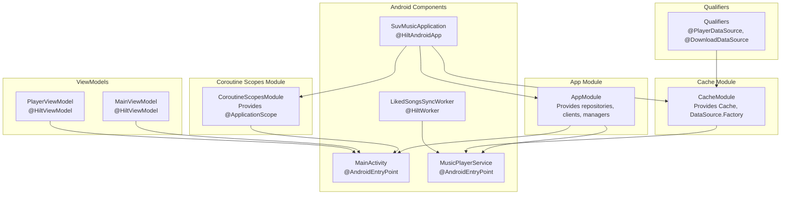

**Diagram sources**
- [SuvMusicApplication.kt](file://app/src/main/java/com/suvojeet/suvmusic/SuvMusicApplication.kt)
- [MainActivity.kt](file://app/src/main/java/com/suvojeet/suvmusic/MainActivity.kt)
- [MusicPlayerService.kt](file://app/src/main/java/com/suvojeet/suvmusic/service/MusicPlayerService.kt)
- [LikedSongsSyncWorker.kt](file://app/src/main/java/com/suvojeet/suvmusic/data/worker/LikedSongsSyncWorker.kt)
- [MainViewModel.kt](file://app/src/main/java/com/suvojeet/suvmusic/ui/viewmodel/MainViewModel.kt)
- [PlayerViewModel.kt](file://app/src/main/java/com/suvojeet/suvmusic/ui/viewmodel/PlayerViewModel.kt)
- [AppModule.kt](file://app/src/main/java/com/suvojeet/suvmusic/di/AppModule.kt)
- [CacheModule.kt](file://app/src/main/java/com/suvojeet/suvmusic/di/CacheModule.kt)
- [CoroutineScopesModule.kt](file://app/src/main/java/com/suvojeet/suvmusic/di/CoroutineScopesModule.kt)
- [Qualifiers.kt](file://app/src/main/java/com/suvojeet/suvmusic/di/Qualifiers.kt)

**Section sources**
- [settings.gradle.kts](file://settings.gradle.kts)
- [app/build.gradle.kts](file://app/build.gradle.kts)

## Core Components
- Application-level module (AppModule)
  - Provides repositories, managers, and shared services with singleton scope
  - Demonstrates constructor injection of multiple dependencies
- Cache module (CacheModule)
  - Provides a media cache and DataSource.Factory instances for player and download
  - Uses qualifiers to distinguish between player and download data sources
- Coroutine scopes module (CoroutineScopesModule)
  - Provides a typed application-scoped CoroutineScope
- Qualifiers (Qualifiers)
  - Defines @PlayerDataSource and @DownloadDataSource to disambiguate multiple DataSource.Factory bindings

**Section sources**
- [AppModule.kt](file://app/src/main/java/com/suvojeet/suvmusic/di/AppModule.kt)
- [CacheModule.kt](file://app/src/main/java/com/suvojeet/suvmusic/di/CacheModule.kt)
- [CoroutineScopesModule.kt](file://app/src/main/java/com/suvojeet/suvmusic/di/CoroutineScopesModule.kt)
- [Qualifiers.kt](file://app/src/main/java/com/suvojeet/suvmusic/di/Qualifiers.kt)

## Architecture Overview
Hilt compiles DI bindings at build time, generating a complete dependency graph. At runtime, Android components and ViewModels receive their dependencies through generated code, ensuring predictable construction and lifecycle-aware scoping.

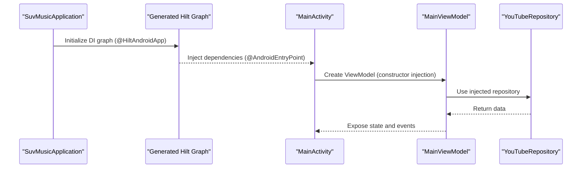

**Diagram sources**
- [SuvMusicApplication.kt](file://app/src/main/java/com/suvojeet/suvmusic/SuvMusicApplication.kt)
- [MainActivity.kt](file://app/src/main/java/com/suvojeet/suvmusic/MainActivity.kt)
- [MainViewModel.kt](file://app/src/main/java/com/suvojeet/suvmusic/ui/viewmodel/MainViewModel.kt)
- [AppModule.kt](file://app/src/main/java/com/suvojeet/suvmusic/di/AppModule.kt)

## Detailed Component Analysis

### Application-Level Module (AppModule)
- Purpose: Centralizes provisioning of repositories, clients, managers, and shared services
- Key bindings:
  - SessionManager, YouTubeRepository, LocalAudioRepository, OkHttpClient, Gson
  - JioSaavnRepository, MusicHapticsManager, MusicPlayer, LyricsRepository
  - ListenTogetherClient, ListenTogetherManager, WorkManager
- Injection pattern: Constructor injection via @Provides methods with @Singleton scope

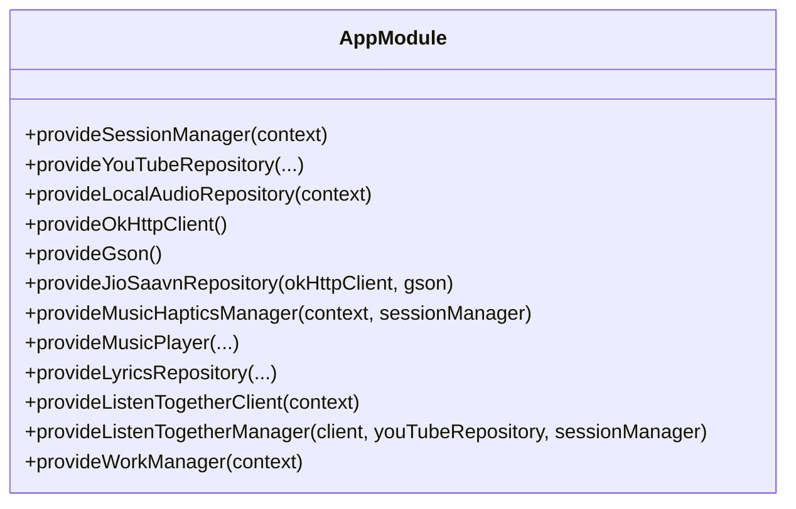

**Diagram sources**
- [AppModule.kt](file://app/src/main/java/com/suvojeet/suvmusic/di/AppModule.kt)

**Section sources**
- [AppModule.kt](file://app/src/main/java/com/suvojeet/suvmusic/di/AppModule.kt)

### Cache Module (CacheModule)
- Purpose: Configure media caching and DataSource.Factory providers
- Key bindings:
  - DatabaseProvider, Cache (configured from user preferences)
  - @PlayerDataSource DataSource.Factory for player
  - @DownloadDataSource DataSource.Factory for downloads
- Integration: Used by MusicPlayerService and other components requiring network-backed caching

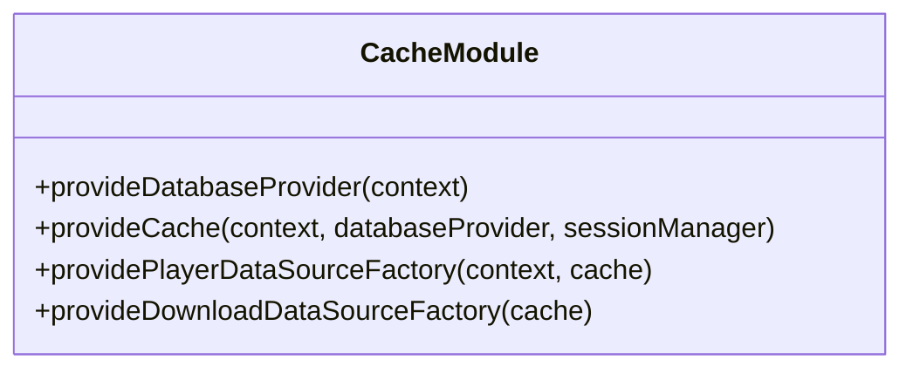

**Diagram sources**
- [CacheModule.kt](file://app/src/main/java/com/suvojeet/suvmusic/di/CacheModule.kt)

**Section sources**
- [CacheModule.kt](file://app/src/main/java/com/suvojeet/suvmusic/di/CacheModule.kt)

### Coroutine Scopes Module (CoroutineScopesModule)
- Purpose: Provide a typed application-scoped CoroutineScope
- Qualifier: @ApplicationScope distinguishes this scope from others
- Usage: Injected into AppModule to construct higher-level services

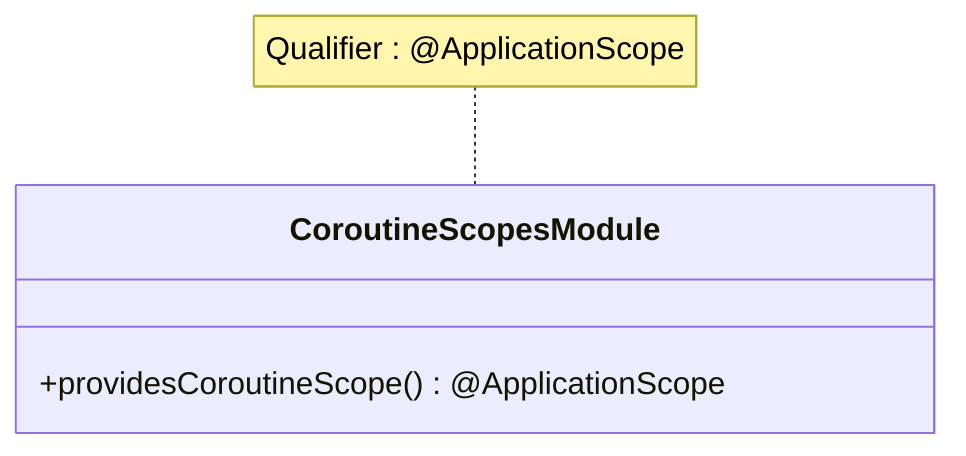

**Diagram sources**
- [CoroutineScopesModule.kt](file://app/src/main/java/com/suvojeet/suvmusic/di/CoroutineScopesModule.kt)

**Section sources**
- [CoroutineScopesModule.kt](file://app/src/main/java/com/suvojeet/suvmusic/di/CoroutineScopesModule.kt)

### Qualifiers (Qualifiers)
- Purpose: Disambiguate multiple bindings for the same type
- Definitions:
  - @PlayerDataSource for player DataSource.Factory
  - @DownloadDataSource for download DataSource.Factory

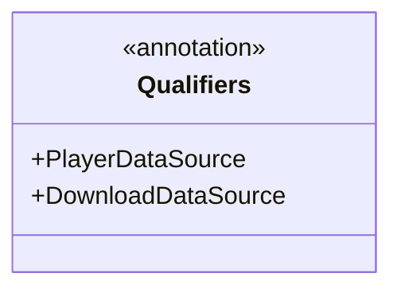

**Diagram sources**
- [Qualifiers.kt](file://app/src/main/java/com/suvojeet/suvmusic/di/Qualifiers.kt)

**Section sources**
- [Qualifiers.kt](file://app/src/main/java/com/suvojeet/suvmusic/di/Qualifiers.kt)

### Android Integration Patterns

#### Activities
- MainActivity receives injected dependencies via field injection and constructor-injected ViewModels
- Field injection: @Inject for NetworkMonitor, SessionManager, YouTubeRepository, DownloadRepository, MusicPlayer, PipHelper
- Constructor injection: ViewModels via viewModels() and hiltViewModel()

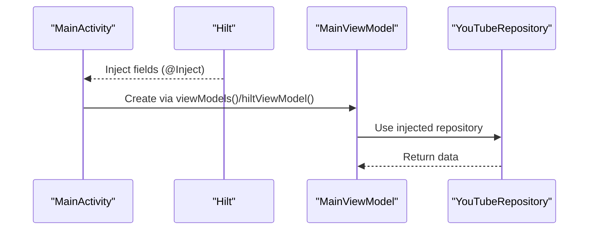

**Diagram sources**
- [MainActivity.kt](file://app/src/main/java/com/suvojeet/suvmusic/MainActivity.kt)
- [MainViewModel.kt](file://app/src/main/java/com/suvojeet/suvmusic/ui/viewmodel/MainViewModel.kt)

**Section sources**
- [MainActivity.kt](file://app/src/main/java/com/suvojeet/suvmusic/MainActivity.kt)
- [MainViewModel.kt](file://app/src/main/java/com/suvojeet/suvmusic/ui/viewmodel/MainViewModel.kt)

#### Services
- MusicPlayerService receives injected dependencies via field injection
- Uses @PlayerDataSource qualifier for DataSource.Factory
- Demonstrates constructor injection of repositories and managers

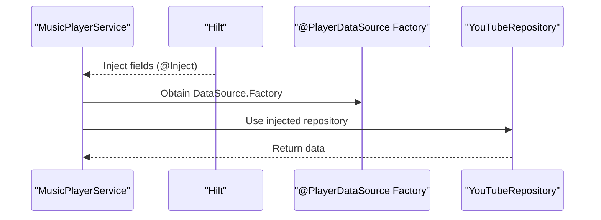

**Diagram sources**
- [MusicPlayerService.kt](file://app/src/main/java/com/suvojeet/suvmusic/service/MusicPlayerService.kt)

**Section sources**
- [MusicPlayerService.kt](file://app/src/main/java/com/suvojeet/suvmusic/service/MusicPlayerService.kt)

#### WorkManager
- LikedSongsSyncWorker uses @HiltWorker and constructor injection
- Demonstrates AssistedInject for WorkerParameters and assisted context

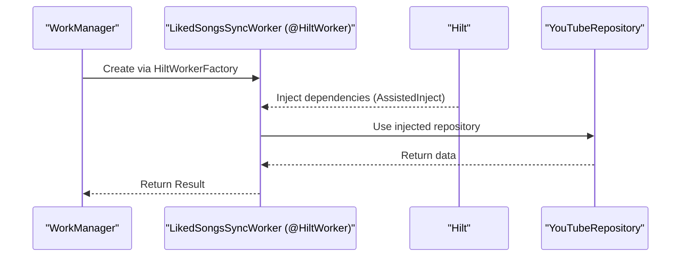

**Diagram sources**
- [LikedSongsSyncWorker.kt](file://app/src/main/java/com/suvojeet/suvmusic/data/worker/LikedSongsSyncWorker.kt)
- [SuvMusicApplication.kt](file://app/src/main/java/com/suvojeet/suvmusic/SuvMusicApplication.kt)

**Section sources**
- [LikedSongsSyncWorker.kt](file://app/src/main/java/com/suvojeet/suvmusic/data/worker/LikedSongsSyncWorker.kt)
- [SuvMusicApplication.kt](file://app/src/main/java/com/suvojeet/suvmusic/SuvMusicApplication.kt)

### ViewModel Injection Patterns
- MainViewModel and PlayerViewModel use constructor injection via @HiltViewModel
- Demonstrates @ApplicationContext, @param: qualifier, and dagger.Lazy for deferred retrieval

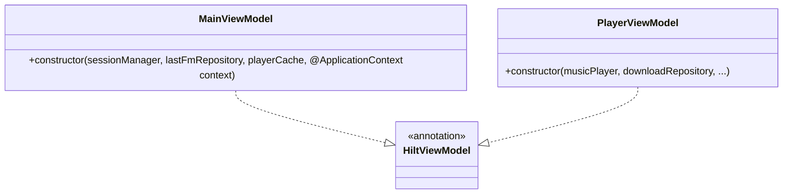

**Diagram sources**
- [MainViewModel.kt](file://app/src/main/java/com/suvojeet/suvmusic/ui/viewmodel/MainViewModel.kt)
- [PlayerViewModel.kt](file://app/src/main/java/com/suvojeet/suvmusic/ui/viewmodel/PlayerViewModel.kt)

**Section sources**
- [MainViewModel.kt](file://app/src/main/java/com/suvojeet/suvmusic/ui/viewmodel/MainViewModel.kt)
- [PlayerViewModel.kt](file://app/src/main/java/com/suvojeet/suvmusic/ui/viewmodel/PlayerViewModel.kt)

## Dependency Analysis
- Modules and scopes:
  - AppModule and CacheModule are installed in SingletonComponent
  - CoroutineScopesModule provides a scoped CoroutineScope
  - Qualifiers disambiguate DataSource.Factory bindings
- Coupling and cohesion:
  - High cohesion within modules; low coupling between modules via @Provides
  - Typed scopes and qualifiers reduce ambiguity and improve testability
- External dependencies:
  - Hilt runtime and compiler via Gradle plugins and dependencies
  - WorkManager integration via androidx.hilt.work

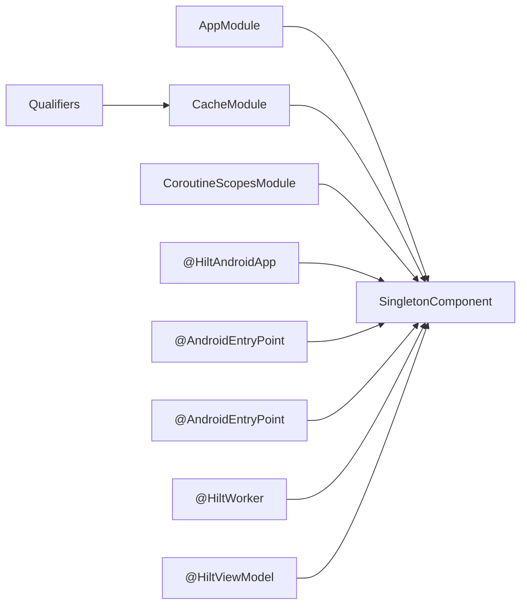

**Diagram sources**
- [AppModule.kt](file://app/src/main/java/com/suvojeet/suvmusic/di/AppModule.kt)
- [CacheModule.kt](file://app/src/main/java/com/suvojeet/suvmusic/di/CacheModule.kt)
- [CoroutineScopesModule.kt](file://app/src/main/java/com/suvojeet/suvmusic/di/CoroutineScopesModule.kt)
- [Qualifiers.kt](file://app/src/main/java/com/suvojeet/suvmusic/di/Qualifiers.kt)
- [SuvMusicApplication.kt](file://app/src/main/java/com/suvojeet/suvmusic/SuvMusicApplication.kt)
- [MainActivity.kt](file://app/src/main/java/com/suvojeet/suvmusic/MainActivity.kt)
- [MusicPlayerService.kt](file://app/src/main/java/com/suvojeet/suvmusic/service/MusicPlayerService.kt)
- [LikedSongsSyncWorker.kt](file://app/src/main/java/com/suvojeet/suvmusic/data/worker/LikedSongsSyncWorker.kt)
- [MainViewModel.kt](file://app/src/main/java/com/suvojeet/suvmusic/ui/viewmodel/MainViewModel.kt)
- [PlayerViewModel.kt](file://app/src/main/java/com/suvojeet/suvmusic/ui/viewmodel/PlayerViewModel.kt)

**Section sources**
- [app/build.gradle.kts](file://app/build.gradle.kts)

## Performance Considerations
- Compile-time DI graph reduces runtime overhead and avoids reflection
- Singleton scope minimizes repeated allocations for heavy services
- Typed scopes and qualifiers prevent accidental binding mismatches
- Deferred retrieval via dagger.Lazy avoids eager initialization in ViewModels

## Troubleshooting Guide
- Duplicate or conflicting bindings
  - Verify unique qualifiers and scopes; ensure modules are installed in the correct component
- Missing @HiltAndroidApp or @AndroidEntryPoint
  - Ensure the Application class and Android components are annotated to participate in DI
- Qualifier mismatch
  - Confirm the correct qualifier is applied when multiple implementations exist for the same type
- WorkManager integration
  - Ensure HiltWorkerFactory is configured in Application and @AssistedInject is used for WorkerParameters

**Section sources**
- [SuvMusicApplication.kt](file://app/src/main/java/com/suvojeet/suvmusic/SuvMusicApplication.kt)
- [MainActivity.kt](file://app/src/main/java/com/suvojeet/suvmusic/MainActivity.kt)
- [MusicPlayerService.kt](file://app/src/main/java/com/suvojeet/suvmusic/service/MusicPlayerService.kt)
- [LikedSongsSyncWorker.kt](file://app/src/main/java/com/suvojeet/suvmusic/data/worker/LikedSongsSyncWorker.kt)

## Conclusion
SuvMusic leverages Hilt to deliver a robust, maintainable dependency graph with compile-time guarantees. Modules encapsulate concerns, qualifiers eliminate ambiguity, and typed scopes align lifecycles with Android components. Constructor injection in ViewModels and Services, combined with WorkManager integration, enables clean separation of concerns and simplifies unit testing by allowing mock implementations to be supplied through DI.