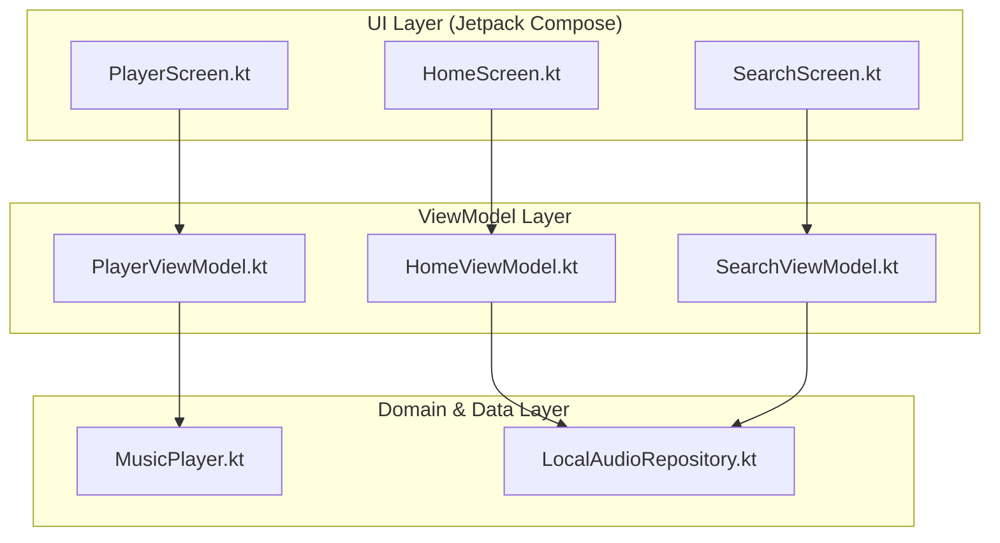
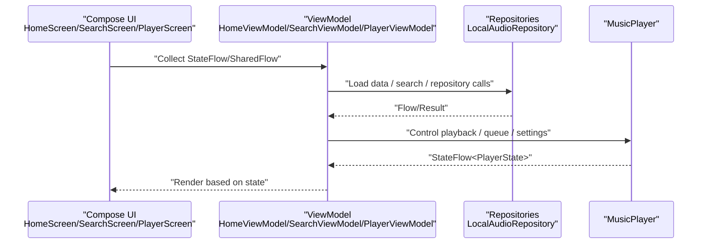
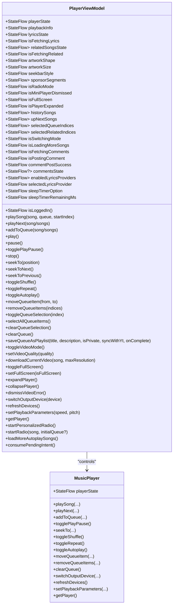
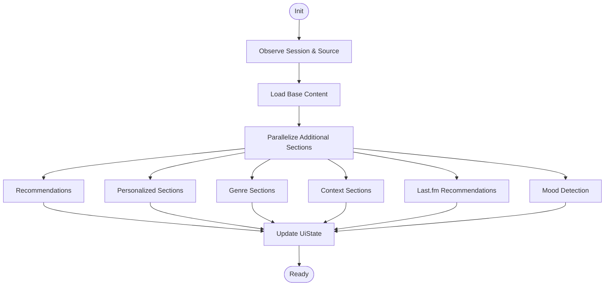
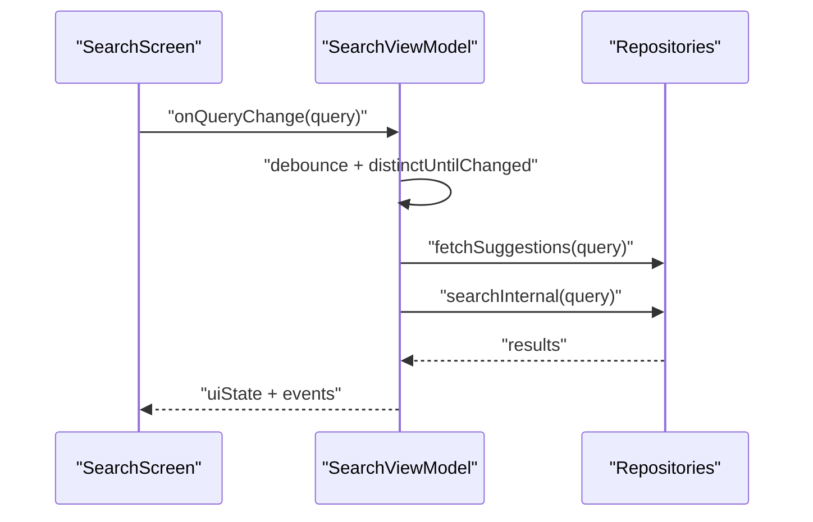
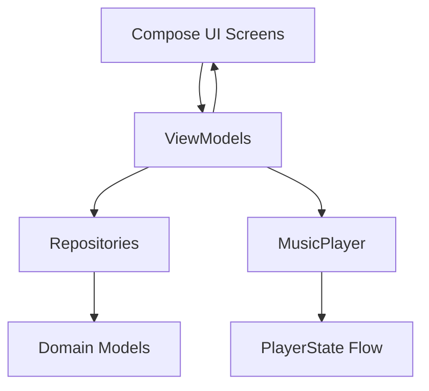

# MVVM Pattern with Jetpack Compose

<cite>
**Referenced Files in This Document**
- [PlayerViewModel.kt](file://app/src/main/java/com/suvojeet/suvmusic/ui/viewmodel/PlayerViewModel.kt)
- [HomeViewModel.kt](file://app/src/main/java/com/suvojeet/suvmusic/ui/viewmodel/HomeViewModel.kt)
- [SearchViewModel.kt](file://app/src/main/java/com/suvojeet/suvmusic/ui/viewmodel/SearchViewModel.kt)
- [MusicPlayer.kt](file://app/src/main/java/com/suvojeet/suvmusic/player/MusicPlayer.kt)
- [HomeScreen.kt](file://app/src/main/java/com/suvojeet/suvmusic/ui/screens/HomeScreen.kt)
- [SearchScreen.kt](file://app/src/main/java/com/suvojeet/suvmusic/ui/screens/SearchScreen.kt)
- [PlayerScreen.kt](file://app/src/main/java/com/suvojeet/suvmusic/ui/screens/player/PlayerScreen.kt)
- [LocalAudioRepository.kt](file://app/src/main/java/com/suvojeet/suvmusic/data/repository/LocalAudioRepository.kt)
</cite>

## Table of Contents
1. [Introduction](#introduction)
2. [Project Structure](#project-structure)
3. [Core Components](#core-components)
4. [Architecture Overview](#architecture-overview)
5. [Detailed Component Analysis](#detailed-component-analysis)
6. [Dependency Analysis](#dependency-analysis)
7. [Performance Considerations](#performance-considerations)
8. [Troubleshooting Guide](#troubleshooting-guide)
9. [Conclusion](#conclusion)

## Introduction
This document explains how SuvMusic implements the Model-View-ViewModel (MVVM) pattern with Jetpack Compose. It focuses on how ViewModels manage UI-related data and business logic, maintain state across configuration changes, and integrate reactive streams using StateFlow, MutableStateFlow, and SharedFlow. It also covers how Compose UI components consume ViewModel state and handle user interactions through callbacks. Examples from PlayerViewModel, HomeViewModel, and SearchViewModel illustrate different state management patterns, and the document highlights benefits for testability, separation of concerns, and declarative UI development. Lifecycle-aware components and memory leak prevention strategies are addressed.

## Project Structure
SuvMusic organizes MVVM components by feature:
- ViewModels reside under app/src/main/java/.../ui/viewmodel and app/src/main/java/.../ui/screens/viewmodel
- UI screens (Compose) live under app/src/main/java/.../ui/screens and app/src/main/java/.../ui/screens/player
- Business logic and repositories are located under app/src/main/java/.../data/repository and app/src/main/java/.../core

**Diagram sources**
- [HomeScreen.kt:98-137](file://app/src/main/java/com/suvojeet/suvmusic/ui/screens/HomeScreen.kt#L98-L137)
- [SearchScreen.kt:86-142](file://app/src/main/java/com/suvojeet/suvmusic/ui/screens/SearchScreen.kt#L86-L142)
- [PlayerScreen.kt:215-260](file://app/src/main/java/com/suvojeet/suvmusic/ui/screens/player/PlayerScreen.kt#L215-L260)
- [HomeViewModel.kt:83-87](file://app/src/main/java/com/suvojeet/suvmusic/ui/viewmodel/HomeViewModel.kt#L83-L87)
- [SearchViewModel.kt:98-102](file://app/src/main/java/com/suvojeet/suvmusic/ui/viewmodel/SearchViewModel.kt#L98-L102)
- [PlayerViewModel.kt:77-86](file://app/src/main/java/com/suvojeet/suvmusic/ui/viewmodel/PlayerViewModel.kt#L77-L86)
- [MusicPlayer.kt:83-84](file://app/src/main/java/com/suvojeet/suvmusic/player/MusicPlayer.kt#L83-L84)
- [LocalAudioRepository.kt:21-23](file://app/src/main/java/com/suvojeet/suvmusic/data/repository/LocalAudioRepository.kt#L21-L23)

**Section sources**
- [HomeScreen.kt:98-137](file://app/src/main/java/com/suvojeet/suvmusic/ui/screens/HomeScreen.kt#L98-L137)
- [SearchScreen.kt:86-142](file://app/src/main/java/com/suvojeet/suvmusic/ui/screens/SearchScreen.kt#L86-L142)
- [PlayerScreen.kt:215-260](file://app/src/main/java/com/suvojeet/suvmusic/ui/screens/player/PlayerScreen.kt#L215-L260)
- [HomeViewModel.kt:83-87](file://app/src/main/java/com/suvojeet/suvmusic/ui/viewmodel/HomeViewModel.kt#L83-L87)
- [SearchViewModel.kt:98-102](file://app/src/main/java/com/suvojeet/suvmusic/ui/viewmodel/SearchViewModel.kt#L98-L102)
- [PlayerViewModel.kt:77-86](file://app/src/main/java/com/suvojeet/suvmusic/ui/viewmodel/PlayerViewModel.kt#L77-L86)
- [MusicPlayer.kt:83-84](file://app/src/main/java/com/suvojeet/suvmusic/player/MusicPlayer.kt#L83-L84)
- [LocalAudioRepository.kt:21-23](file://app/src/main/java/com/suvojeet/suvmusic/data/repository/LocalAudioRepository.kt#L21-L23)

## Core Components
- ViewModels expose StateFlow for immutable UI state and SharedFlow for events. They orchestrate business logic, repository calls, and player interactions.
- Compose screens collect StateFlow via collectAsState or collectAsStateWithLifecycle and reactively render UI.
- Reactive streams (combine, map, distinctUntilChanged, stateIn) derive computed state and optimize UI updates.

Key patterns demonstrated:
- PlayerViewModel: exposes playerState, derived queue slices, and UI preferences as StateFlow; manages complex reactive flows and timers.
- HomeViewModel: aggregates multiple data sources, parallelizes loads, and exposes UiState and events.
- SearchViewModel: debounces queries, orchestrates multi-source search, and coordinates tabs and filters.

Benefits:
- Separation of concerns: UI is declarative and state-driven; business logic is encapsulated in ViewModels.
- Testability: ViewModels can be unit tested with mocked repositories and flows.
- Lifecycle safety: viewModelScope and collectAsStateWithLifecycle prevent leaks and ensure cleanup.

**Section sources**
- [PlayerViewModel.kt:77-167](file://app/src/main/java/com/suvojeet/suvmusic/ui/viewmodel/PlayerViewModel.kt#L77-L167)
- [HomeViewModel.kt:83-87](file://app/src/main/java/com/suvojeet/suvmusic/ui/viewmodel/HomeViewModel.kt#L83-L87)
- [SearchViewModel.kt:98-102](file://app/src/main/java/com/suvojeet/suvmusic/ui/viewmodel/SearchViewModel.kt#L98-L102)

## Architecture Overview
The MVVM architecture integrates Compose UI with reactive state management:

**Diagram sources**
- [HomeScreen.kt:98-137](file://app/src/main/java/com/suvojeet/suvmusic/ui/screens/HomeScreen.kt#L98-L137)
- [SearchScreen.kt:86-142](file://app/src/main/java/com/suvojeet/suvmusic/ui/screens/SearchScreen.kt#L86-L142)
- [PlayerScreen.kt:215-260](file://app/src/main/java/com/suvojeet/suvmusic/ui/screens/player/PlayerScreen.kt#L215-L260)
- [HomeViewModel.kt:112-127](file://app/src/main/java/com/suvojeet/suvmusic/ui/viewmodel/HomeViewModel.kt#L112-L127)
- [SearchViewModel.kt:330-447](file://app/src/main/java/com/suvojeet/suvmusic/ui/viewmodel/SearchViewModel.kt#L330-L447)
- [PlayerViewModel.kt:474-513](file://app/src/main/java/com/suvojeet/suvmusic/ui/viewmodel/PlayerViewModel.kt#L474-L513)
- [LocalAudioRepository.kt:368-430](file://app/src/main/java/com/suvojeet/suvmusic/data/repository/LocalAudioRepository.kt#L368-L430)
- [MusicPlayer.kt:83-84](file://app/src/main/java/com/suvojeet/suvmusic/player/MusicPlayer.kt#L83-L84)

## Detailed Component Analysis

### PlayerViewModel Analysis
PlayerViewModel centralizes playback state and UI-related state for the player:
- Exposes playerState as StateFlow and derived playbackInfo to avoid frequent recompositions.
- Manages lyrics, comments, related songs, and UI preferences (artwork shape/size/seekbar style) via StateFlow.
- Orchestrates reactive flows combining player state, session settings, and repository results.
- Implements complex flows: autoplay/radio queue building, Discord presence updates, download state synchronization, and history sync.

**Diagram sources**
- [PlayerViewModel.kt:77-167](file://app/src/main/java/com/suvojeet/suvmusic/ui/viewmodel/PlayerViewModel.kt#L77-L167)
- [PlayerViewModel.kt:474-513](file://app/src/main/java/com/suvojeet/suvmusic/ui/viewmodel/PlayerViewModel.kt#L474-L513)
- [PlayerViewModel.kt:713-761](file://app/src/main/java/com/suvojeet/suvmusic/ui/viewmodel/PlayerViewModel.kt#L713-L761)
- [PlayerViewModel.kt:789-806](file://app/src/main/java/com/suvojeet/suvmusic/ui/viewmodel/PlayerViewModel.kt#L789-L806)
- [MusicPlayer.kt:83-84](file://app/src/main/java/com/suvojeet/suvmusic/player/MusicPlayer.kt#L83-L84)

Key reactive patterns:
- Derived state: historySongs and upNextSongs computed from playerState with distinctUntilChanged and stateIn.
- Combine flows: lyrics provider settings, download states, and session settings combined to produce derived UI state.
- Timers and periodic work: ticker loop for history sync and sleep timer updates.

UI consumption:
- PlayerScreen collects playerState, playbackInfo, and UI preference flows via collectAsStateWithLifecycle.
- Actions are passed as lambdas to PlayerScreen, which invokes ViewModel methods.

**Section sources**
- [PlayerViewModel.kt:77-167](file://app/src/main/java/com/suvojeet/suvmusic/ui/viewmodel/PlayerViewModel.kt#L77-L167)
- [PlayerViewModel.kt:207-217](file://app/src/main/java/com/suvojeet/suvmusic/ui/viewmodel/PlayerViewModel.kt#L207-L217)
- [PlayerViewModel.kt:301-327](file://app/src/main/java/com/suvojeet/suvmusic/ui/viewmodel/PlayerViewModel.kt#L301-L327)
- [PlayerViewModel.kt:387-399](file://app/src/main/java/com/suvojeet/suvmusic/ui/viewmodel/PlayerViewModel.kt#L387-L399)
- [PlayerViewModel.kt:419-454](file://app/src/main/java/com/suvojeet/suvmusic/ui/viewmodel/PlayerViewModel.kt#L419-L454)
- [PlayerViewModel.kt:713-761](file://app/src/main/java/com/suvojeet/suvmusic/ui/viewmodel/PlayerViewModel.kt#L713-L761)
- [PlayerViewModel.kt:789-806](file://app/src/main/java/com/suvojeet/suvmusic/ui/viewmodel/PlayerViewModel.kt#L789-L806)
- [PlayerScreen.kt:215-260](file://app/src/main/java/com/suvojeet/suvmusic/ui/screens/player/PlayerScreen.kt#L215-L260)

### HomeViewModel Analysis
HomeViewModel coordinates home feed generation:
- Maintains a UiState with lists of sections, recommendations, and flags for loading and errors.
- Observes session settings and music source changes to adapt content.
- Loads base content and parallelizes additional sections (recommendations, genres, context, Last.fm).
- Supports infinite scroll with loadMore and deduplication of section titles.

**Diagram sources**
- [HomeViewModel.kt:89-98](file://app/src/main/java/com/suvojeet/suvmusic/ui/viewmodel/HomeViewModel.kt#L89-L98)
- [HomeViewModel.kt:112-127](file://app/src/main/java/com/suvojeet/suvmusic/ui/viewmodel/HomeViewModel.kt#L112-L127)
- [HomeViewModel.kt:347-376](file://app/src/main/java/com/suvojeet/suvmusic/ui/viewmodel/HomeViewModel.kt#L347-L376)
- [HomeViewModel.kt:443-451](file://app/src/main/java/com/suvojeet/suvmusic/ui/viewmodel/HomeViewModel.kt#L443-L451)
- [HomeViewModel.kt:461-469](file://app/src/main/java/com/suvojeet/suvmusic/ui/viewmodel/HomeViewModel.kt#L461-L469)

UI consumption:
- HomeScreen collects uiState and events, renders sections, and handles infinite scroll triggers.

**Section sources**
- [HomeViewModel.kt:83-87](file://app/src/main/java/com/suvojeet/suvmusic/ui/viewmodel/HomeViewModel.kt#L83-L87)
- [HomeViewModel.kt:112-127](file://app/src/main/java/com/suvojeet/suvmusic/ui/viewmodel/HomeViewModel.kt#L112-L127)
- [HomeViewModel.kt:347-376](file://app/src/main/java/com/suvojeet/suvmusic/ui/viewmodel/HomeViewModel.kt#L347-L376)
- [HomeViewModel.kt:443-451](file://app/src/main/java/com/suvojeet/suvmusic/ui/viewmodel/HomeViewModel.kt#L443-L451)
- [HomeViewModel.kt:461-469](file://app/src/main/java/com/suvojeet/suvmusic/ui/viewmodel/HomeViewModel.kt#L461-L469)
- [HomeScreen.kt:199-212](file://app/src/main/java/com/suvojeet/suvmusic/ui/screens/HomeScreen.kt#L199-L212)

### SearchViewModel Analysis
SearchViewModel manages search UX:
- Debounces query changes and auto-searches while typing.
- Supports tabs (YouTube Music, Local Library) and result filters.
- Orchestrates multi-source search and category browsing.
- Emits events (e.g., ShowAddToPlaylistSheet) to coordinate with playlist management.

**Diagram sources**
- [SearchViewModel.kt:124-134](file://app/src/main/java/com/suvojeet/suvmusic/ui/viewmodel/SearchViewModel.kt#L124-L134)
- [SearchViewModel.kt:259-275](file://app/src/main/java/com/suvojeet/suvmusic/ui/viewmodel/SearchViewModel.kt#L259-L275)
- [SearchViewModel.kt:330-447](file://app/src/main/java/com/suvojeet/suvmusic/ui/viewmodel/SearchViewModel.kt#L330-L447)

UI consumption:
- SearchScreen collects uiState and events, renders suggestions, recent searches, and results grids.

**Section sources**
- [SearchViewModel.kt:98-102](file://app/src/main/java/com/suvojeet/suvmusic/ui/viewmodel/SearchViewModel.kt#L98-L102)
- [SearchViewModel.kt:124-134](file://app/src/main/java/com/suvojeet/suvmusic/ui/viewmodel/SearchViewModel.kt#L124-L134)
- [SearchViewModel.kt:330-447](file://app/src/main/java/com/suvojeet/suvmusic/ui/viewmodel/SearchViewModel.kt#L330-L447)
- [SearchScreen.kt:86-142](file://app/src/main/java/com/suvojeet/suvmusic/ui/screens/SearchScreen.kt#L86-L142)

### Conceptual Overview
The MVVM pattern in SuvMusic emphasizes:
- Declarative UI: Compose renders based on collected StateFlow.
- Reactive state: combine, map, stateIn, and distinctUntilChanged derive optimized state.
- Lifecycle-aware: viewModelScope and collectAsStateWithLifecycle ensure safe resource usage.
- Separation of concerns: ViewModels encapsulate business logic; repositories provide data; Compose renders UI.

[No sources needed since this diagram shows conceptual workflow, not actual code structure]

## Dependency Analysis
- HomeViewModel depends on YouTube/JioSaavn repositories, session manager, recommendation engine, Last.fm, and download repository.
- SearchViewModel depends on YouTube/JioSaavn, local audio repository, session manager, and download repository.
- PlayerViewModel depends on MusicPlayer, repositories, session manager, recommendation engine, smart queue manager, and Discord manager.

```mermaid
graph TB
HVM["HomeViewModel"] --> YTR["YouTubeRepository"]
HVM --> JSR["JioSaavnRepository"]
HVM --> SM["SessionManager"]
HVM --> RE["RecommendationEngine"]
HVM --> LFR["LastFmRepository"]
HVM --> DR["DownloadRepository"]
SVM["SearchViewModel"] --> YTR
SVM --> JSR
SVM --> LAR["LocalAudioRepository"]
SVM --> SM
SVM --> DR
PVM["PlayerViewModel"] --> MP["MusicPlayer"]
PVM --> YTR
PVM --> JSR
PVM --> LR["LyricsRepository"]
PVM --> SB["SponsorBlockRepository"]
PVM --> SM
PVM --> RE
PVM --> SQM["SmartQueueManager"]
PVM --> LHR["ListeningHistoryRepository"]
PVM --> DM["DiscordManager"]
```

- MusicPlayer exposes a StateFlow<PlayerState> that ViewModels observe and transform.

**Diagram sources**
- [HomeViewModel.kt:74-81](file://app/src/main/java/com/suvojeet/suvmusic/ui/viewmodel/HomeViewModel.kt#L74-L81)
- [SearchViewModel.kt:90-96](file://app/src/main/java/com/suvojeet/suvmusic/ui/viewmodel/SearchViewModel.kt#L90-L96)
- [PlayerViewModel.kt:58-75](file://app/src/main/java/com/suvojeet/suvmusic/ui/viewmodel/PlayerViewModel.kt#L58-L75)
- [LocalAudioRepository.kt:21-23](file://app/src/main/java/com/suvojeet/suvmusic/data/repository/LocalAudioRepository.kt#L21-L23)

**Section sources**
- [HomeViewModel.kt:74-81](file://app/src/main/java/com/suvojeet/suvmusic/ui/viewmodel/HomeViewModel.kt#L74-L81)
- [SearchViewModel.kt:90-96](file://app/src/main/java/com/suvojeet/suvmusic/ui/viewmodel/SearchViewModel.kt#L90-L96)
- [PlayerViewModel.kt:58-75](file://app/src/main/java/com/suvojeet/suvmusic/ui/viewmodel/PlayerViewModel.kt#L58-L75)
- [LocalAudioRepository.kt:21-23](file://app/src/main/java/com/suvojeet/suvmusic/data/repository/LocalAudioRepository.kt#L21-L23)

## Performance Considerations
- State optimization: PlayerViewModel uses a derived playbackInfo with reset progress fields to minimize recompositions.
- Derived state: historySongs and upNextSongs leverage distinctUntilChanged and stateIn to avoid unnecessary emissions.
- Debouncing: SearchViewModel debounces query changes to reduce network calls.
- Parallelism: HomeViewModel launches multiple coroutines to parallelize content loading.
- Lifecycle safety: viewModelScope and collectAsStateWithLifecycle prevent leaks and ensure cleanup.

[No sources needed since this section provides general guidance]

## Troubleshooting Guide
Common issues and mitigations:
- Stale UI state: Ensure StateFlow emissions are distinct and use distinctUntilChanged when deriving state.
- Memory leaks: Use viewModelScope for coroutines and collectAsStateWithLifecycle in Compose to tie lifecycle to ViewModel.
- Excessive recompositions: Prefer derived StateFlow and avoid creating new lambdas per recomposition; use remember for stable callbacks.
- Player state inconsistencies: MusicPlayer updates playerState atomically; ViewModel observes and reacts to changes.

**Section sources**
- [PlayerViewModel.kt:80-83](file://app/src/main/java/com/suvojeet/suvmusic/ui/viewmodel/PlayerViewModel.kt#L80-L83)
- [PlayerViewModel.kt:207-217](file://app/src/main/java/com/suvojeet/suvmusic/ui/viewmodel/PlayerViewModel.kt#L207-L217)
- [PlayerViewModel.kt:301-327](file://app/src/main/java/com/suvojeet/suvmusic/ui/viewmodel/PlayerViewModel.kt#L301-L327)
- [PlayerScreen.kt:215-260](file://app/src/main/java/com/suvojeet/suvmusic/ui/screens/player/PlayerScreen.kt#L215-L260)
- [MusicPlayer.kt:83-84](file://app/src/main/java/com/suvojeet/suvmusic/player/MusicPlayer.kt#L83-L84)

## Conclusion
SuvMusic’s MVVM with Jetpack Compose demonstrates robust state management using StateFlow, MutableStateFlow, and SharedFlow. ViewModels encapsulate business logic, orchestrate repositories, and expose reactive state to Compose UI. PlayerViewModel, HomeViewModel, and SearchViewModel showcase different patterns: derived state computation, parallel data loading, and reactive query handling. The approach improves testability, separation of concerns, and declarative UI development while ensuring lifecycle safety and performance.