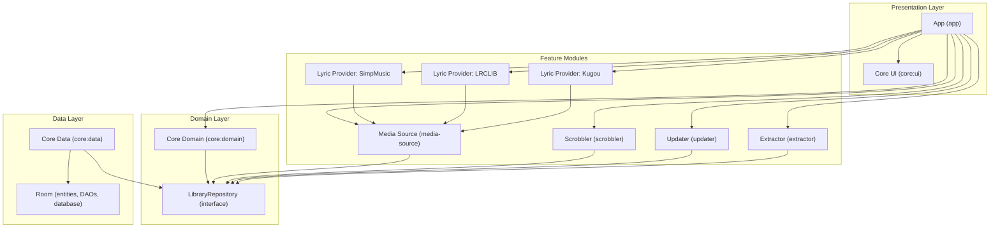
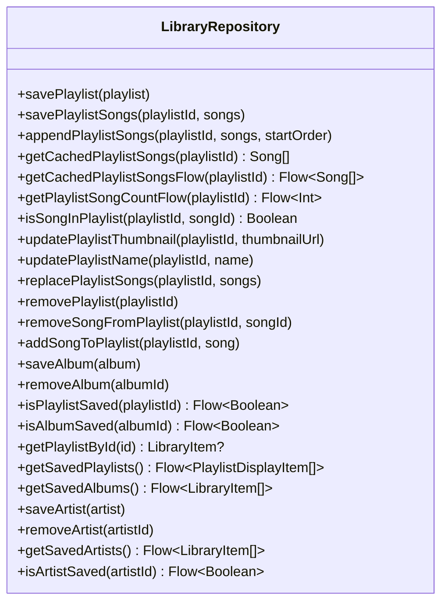
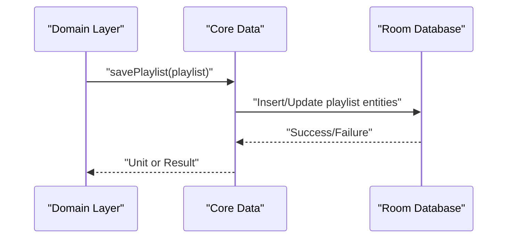
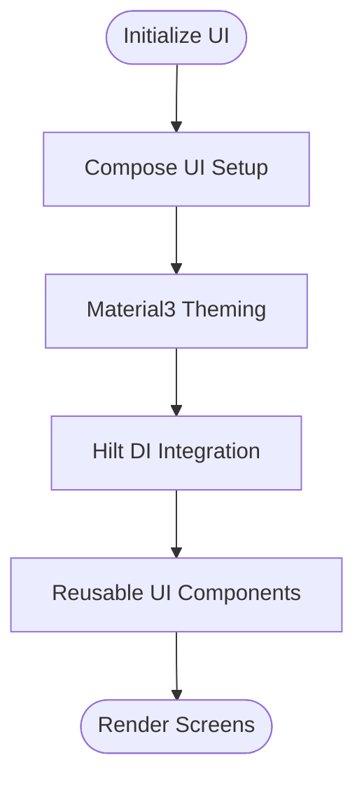
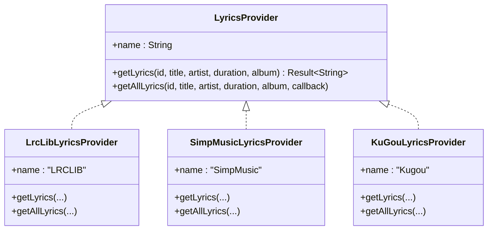
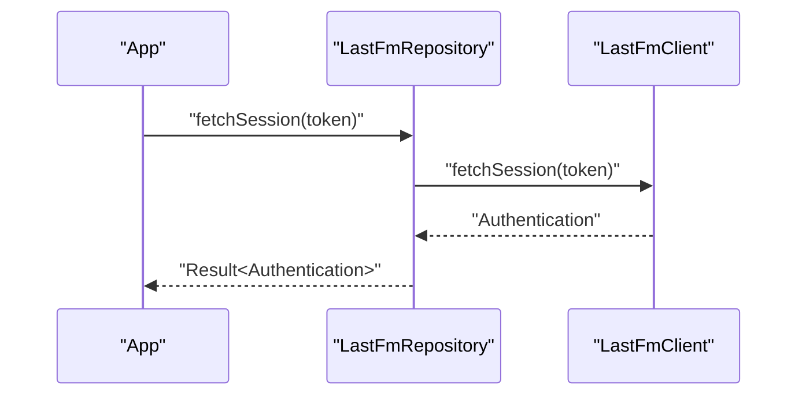
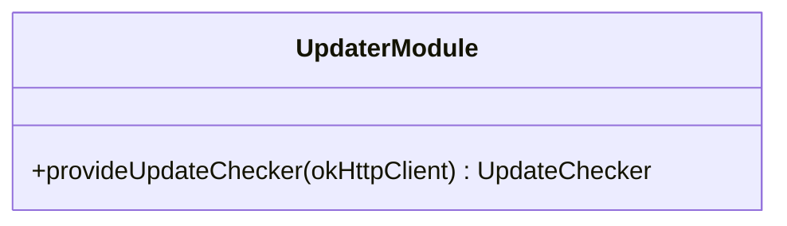
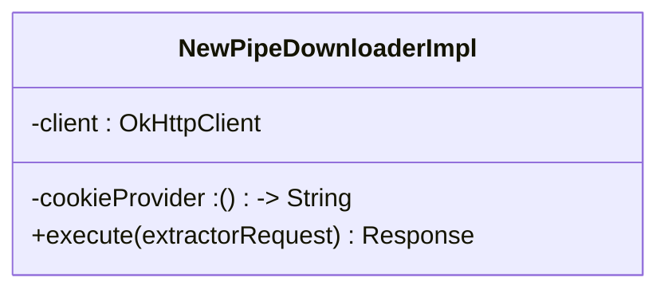
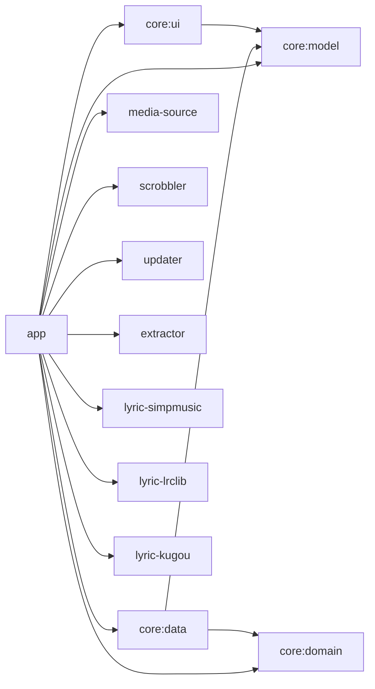

# Modular Architecture Design

<cite>
**Referenced Files in This Document**
- [settings.gradle.kts](file://settings.gradle.kts)
- [build.gradle.kts](file://build.gradle.kts)
- [gradle/libs.versions.toml](file://gradle/libs.versions.toml)
- [app/build.gradle.kts](file://app/build.gradle.kts)
- [core/model/build.gradle.kts](file://core/model/build.gradle.kts)
- [core/data/build.gradle.kts](file://core/data/build.gradle.kts)
- [core/domain/build.gradle.kts](file://core/domain/build.gradle.kts)
- [core/ui/build.gradle.kts](file://core/ui/build.gradle.kts)
- [core/domain/src/main/java/com/suvojeet/suvmusic/core/domain/repository/LibraryRepository.kt](file://core/domain/src/main/java/com/suvojeet/suvmusic/core/domain/repository/LibraryRepository.kt)
- [media-source/src/main/java/com/suvojeet/suvmusic/providers/lyrics/LyricsProvider.kt](file://media-source/src/main/java/com/suvojeet/suvmusic/providers/lyrics/LyricsProvider.kt)
- [scrobbler/src/main/java/com/suvojeet/suvmusic/lastfm/LastFmRepository.kt](file://scrobbler/src/main/java/com/suvojeet/suvmusic/lastfm/LastFmRepository.kt)
- [updater/src/main/kotlin/com/suvojeet/suvmusic/updater/UpdaterModule.kt](file://updater/src/main/kotlin/com/suvojeet/suvmusic/updater/UpdaterModule.kt)
- [lyric-simpmusic/src/main/java/com/suvojeet/suvmusic/simpmusic/SimpMusicLyricsProvider.kt](file://lyric-simpmusic/src/main/java/com/suvojeet/suvmusic/simpmusic/SimpMusicLyricsProvider.kt)
- [lyric-lrclib/src/main/java/com/suvojeet/suvmusic/lrclib/LrcLibLyricsProvider.kt](file://lyric-lrclib/src/main/java/com/suvojeet/suvmusic/lrclib/LrcLibLyricsProvider.kt)
- [lyric-kugou/src/main/java/com/suvojeet/suvmusic/kugou/KuGouLyricsProvider.kt](file://lyric-kugou/src/main/java/com/suvojeet/suvmusic/kugou/KuGouLyricsProvider.kt)
- [extractor/src/main/java/com/suvojeet/suvmusic/newpipe/NewPipeDownloaderImpl.kt](file://extractor/src/main/java/com/suvojeet/suvmusic/newpipe/NewPipeDownloaderImpl.kt)
</cite>

## Table of Contents
1. [Introduction](#introduction)
2. [Project Structure](#project-structure)
3. [Core Components](#core-components)
4. [Architecture Overview](#architecture-overview)
5. [Detailed Component Analysis](#detailed-component-analysis)
6. [Dependency Analysis](#dependency-analysis)
7. [Performance Considerations](#performance-considerations)
8. [Troubleshooting Guide](#troubleshooting-guide)
9. [Conclusion](#conclusion)
10. [Appendices](#appendices)

## Introduction
This document explains SuvMusic’s modular architecture designed around a multi-module Gradle structure. The app is organized into:
- Core modules: model, data, domain, ui
- Feature modules: media-source (lyrics providers), scrobbler (Last.fm), updater, extractor (NewPipe), and lyric-* modules for specific lyrics providers

The design emphasizes separation of concerns, testability, and independent development. Modules communicate via well-defined interfaces and dependency injection, enabling teams to work on features in isolation while maintaining a cohesive product.

## Project Structure
The project uses a hierarchical Gradle setup with a root build script and per-module build scripts. Module inclusion is centralized in settings, and shared dependency versions are managed in libs.versions.toml.

```mermaid
graph TB
Root["Root Build Script<br/>build.gradle.kts"]
Settings["Settings Script<br/>settings.gradle.kts"]
Versions["Versions Catalog<br/>gradle/libs.versions.toml"]
App["App Module<br/>app/build.gradle.kts"]
CoreModel["Core Model<br/>core:model/build.gradle.kts"]
CoreData["Core Data<br/>core:data/build.gradle.kts"]
CoreDomain["Core Domain<br/>core:domain/build.gradle.kts"]
CoreUI["Core UI<br/>core:ui/build.gradle.kts"]
MediaSource["Media Source<br/>media-source/build.gradle.kts"]
Scrobbler["Scrobbler<br/>scrobbler/build.gradle.kts"]
Updater["Updater<br/>updater/build.gradle.kts"]
Extractor["Extractor<br/>extractor/build.gradle.kts"]
LyricSimp["Lyric Provider: SimpMusic<br/>lyric-simpmusic/build.gradle.kts"]
LyricLrcLib["Lyric Provider: LRCLIB<br/>lyric-lrclib/build.gradle.kts"]
LyricKugou["Lyric Provider: Kugou<br/>lyric-kugou/build.gradle.kts"]
Settings --> App
Settings --> CoreModel
Settings --> CoreData
Settings --> CoreDomain
Settings --> CoreUI
Settings --> MediaSource
Settings --> Scrobbler
Settings --> Updater
Settings --> Extractor
Settings --> LyricSimp
Settings --> LyricLrcLib
Settings --> LyricKugou
Root --> App
Root --> CoreModel
Root --> CoreData
Root --> CoreDomain
Root --> CoreUI
Root --> MediaSource
Root --> Scrobbler
Root --> Updater
Root --> Extractor
Root --> LyricSimp
Root --> LyricLrcLib
Root --> LyricKugou
Versions --> App
Versions --> CoreModel
Versions --> CoreData
Versions --> CoreDomain
Versions --> CoreUI
Versions --> MediaSource
Versions --> Scrobbler
Versions --> Updater
Versions --> Extractor
Versions --> LyricSimp
Versions --> LyricLrcLib
Versions --> LyricKugou
```

**Diagram sources**
- [settings.gradle.kts:18-30](file://settings.gradle.kts#L18-L30)
- [build.gradle.kts:1-10](file://build.gradle.kts#L1-L10)
- [gradle/libs.versions.toml:1-162](file://gradle/libs.versions.toml#L1-L162)
- [app/build.gradle.kts:254-265](file://app/build.gradle.kts#L254-L265)

**Section sources**
- [settings.gradle.kts:18-30](file://settings.gradle.kts#L18-L30)
- [build.gradle.kts:1-10](file://build.gradle.kts#L1-L10)
- [gradle/libs.versions.toml:1-162](file://gradle/libs.versions.toml#L1-L162)

## Core Components
The core modules form the foundation of the app:
- Core Model: Defines immutable data types used across the app (e.g., Song, Album, Playlist).
- Core Domain: Exposes business interfaces (e.g., Repository contracts) consumed by higher layers.
- Core Data: Implements repositories and persistence using Room, with DI support.
- Core UI: Provides reusable UI components and Compose infrastructure.

These modules are intentionally thin and free of platform-specific UI or networking code, ensuring reuse and testability.

**Section sources**
- [core/model/build.gradle.kts:1-40](file://core/model/build.gradle.kts#L1-L40)
- [core/domain/build.gradle.kts:1-30](file://core/domain/build.gradle.kts#L1-L30)
- [core/data/build.gradle.kts:1-44](file://core/data/build.gradle.kts#L1-L44)
- [core/ui/build.gradle.kts:1-43](file://core/ui/build.gradle.kts#L1-L43)

## Architecture Overview
SuvMusic follows a layered architecture:
- Presentation layer (app) consumes UI components from core:ui and orchestrates features.
- Domain layer defines contracts (repositories) used by presentation and features.
- Data layer implements repositories and persists data using Room.
- Feature modules encapsulate cross-cutting concerns (e.g., lyrics providers, scrobbling, updates, extraction).

**Diagram sources**
- [app/build.gradle.kts:254-265](file://app/build.gradle.kts#L254-L265)
- [core/domain/src/main/java/com/suvojeet/suvmusic/core/domain/repository/LibraryRepository.kt:11-36](file://core/domain/src/main/java/com/suvojeet/suvmusic/core/domain/repository/LibraryRepository.kt#L11-L36)
- [media-source/src/main/java/com/suvojeet/suvmusic/providers/lyrics/LyricsProvider.kt:7-49](file://media-source/src/main/java/com/suvojeet/suvmusic/providers/lyrics/LyricsProvider.kt#L7-L49)
- [scrobbler/src/main/java/com/suvojeet/suvmusic/lastfm/LastFmRepository.kt:8-42](file://scrobbler/src/main/java/com/suvojeet/suvmusic/lastfm/LastFmRepository.kt#L8-L42)
- [updater/src/main/kotlin/com/suvojeet/suvmusic/updater/UpdaterModule.kt:10-19](file://updater/src/main/kotlin/com/suvojeet/suvmusic/updater/UpdaterModule.kt#L10-L19)
- [extractor/src/main/java/com/suvojeet/suvmusic/newpipe/NewPipeDownloaderImpl.kt:16-19](file://extractor/src/main/java/com/suvojeet/suvmusic/newpipe/NewPipeDownloaderImpl.kt#L16-L19)

## Detailed Component Analysis

### Core Domain: Repository Contracts
The domain layer defines contracts that encapsulate business logic. The LibraryRepository interface demonstrates a typical contract for library operations (playlists, albums, artists), exposing both suspend functions and reactive Flow streams.

**Diagram sources**
- [core/domain/src/main/java/com/suvojeet/suvmusic/core/domain/repository/LibraryRepository.kt:11-36](file://core/domain/src/main/java/com/suvojeet/suvmusic/core/domain/repository/LibraryRepository.kt#L11-L36)

**Section sources**
- [core/domain/src/main/java/com/suvojeet/suvmusic/core/domain/repository/LibraryRepository.kt:11-36](file://core/domain/src/main/java/com/suvojeet/suvmusic/core/domain/repository/LibraryRepository.kt#L11-L36)

### Core Data: Repository Implementation and Persistence
The data layer implements domain contracts and manages persistence. It depends on core:model and core:domain, integrates Room for database operations, and uses Hilt for DI.

**Diagram sources**
- [core/data/build.gradle.kts:32-43](file://core/data/build.gradle.kts#L32-L43)

**Section sources**
- [core/data/build.gradle.kts:32-43](file://core/data/build.gradle.kts#L32-L43)

### Core UI: Compose Infrastructure
The UI module depends on core:model and integrates Compose, Material3, and Hilt. It provides reusable UI building blocks and Compose-specific infrastructure.

**Diagram sources**
- [core/ui/build.gradle.kts:31-42](file://core/ui/build.gradle.kts#L31-L42)

**Section sources**
- [core/ui/build.gradle.kts:31-42](file://core/ui/build.gradle.kts#L31-L42)

### Feature Module: Lyrics Providers (media-source and lyric-*)
The media-source module defines a generic LyricsProvider interface. Specific providers (LRCLIB, SimpMusic, Kugou) implement this interface, enabling pluggable lyrics fetching.

**Diagram sources**
- [media-source/src/main/java/com/suvojeet/suvmusic/providers/lyrics/LyricsProvider.kt:7-49](file://media-source/src/main/java/com/suvojeet/suvmusic/providers/lyrics/LyricsProvider.kt#L7-L49)
- [lyric-lrclib/src/main/java/com/suvojeet/suvmusic/lrclib/LrcLibLyricsProvider.kt:13-15](file://lyric-lrclib/src/main/java/com/suvojeet/suvmusic/lrclib/LrcLibLyricsProvider.kt#L13-L15)
- [lyric-simpmusic/src/main/java/com/suvojeet/suvmusic/simpmusic/SimpMusicLyricsProvider.kt:10-20](file://lyric-simpmusic/src/main/java/com/suvojeet/suvmusic/simpmusic/SimpMusicLyricsProvider.kt#L10-L20)
- [lyric-kugou/src/main/java/com/suvojeet/suvmusic/kugou/KuGouLyricsProvider.kt:10-22](file://lyric-kugou/src/main/java/com/suvojeet/suvmusic/kugou/KuGouLyricsProvider.kt#L10-L22)

**Section sources**
- [media-source/src/main/java/com/suvojeet/suvmusic/providers/lyrics/LyricsProvider.kt:7-49](file://media-source/src/main/java/com/suvojeet/suvmusic/providers/lyrics/LyricsProvider.kt#L7-L49)
- [lyric-lrclib/src/main/java/com/suvojeet/suvmusic/lrclib/LrcLibLyricsProvider.kt:13-15](file://lyric-lrclib/src/main/java/com/suvojeet/suvmusic/lrclib/LrcLibLyricsProvider.kt#L13-L15)
- [lyric-simpmusic/src/main/java/com/suvojeet/suvmusic/simpmusic/SimpMusicLyricsProvider.kt:10-20](file://lyric-simpmusic/src/main/java/com/suvojeet/suvmusic/simpmusic/SimpMusicLyricsProvider.kt#L10-L20)
- [lyric-kugou/src/main/java/com/suvojeet/suvmusic/kugou/KuGouLyricsProvider.kt:10-22](file://lyric-kugou/src/main/java/com/suvojeet/suvmusic/kugou/KuGouLyricsProvider.kt#L10-L22)

### Feature Module: Scrobbler (Last.fm)
The scrobbler module encapsulates Last.fm integration. It exposes a repository that delegates to a network client, handles authentication, and provides scrobbling operations.

**Diagram sources**
- [scrobbler/src/main/java/com/suvojeet/suvmusic/lastfm/LastFmRepository.kt:8-42](file://scrobbler/src/main/java/com/suvojeet/suvmusic/lastfm/LastFmRepository.kt#L8-L42)

**Section sources**
- [scrobbler/src/main/java/com/suvojeet/suvmusic/lastfm/LastFmRepository.kt:8-42](file://scrobbler/src/main/java/com/suvojeet/suvmusic/lastfm/LastFmRepository.kt#L8-L42)

### Feature Module: Updater
The updater module provides update checking capabilities and integrates with Hilt for dependency injection.

**Diagram sources**
- [updater/src/main/kotlin/com/suvojeet/suvmusic/updater/UpdaterModule.kt:10-19](file://updater/src/main/kotlin/com/suvojeet/suvmusic/updater/UpdaterModule.kt#L10-L19)

**Section sources**
- [updater/src/main/kotlin/com/suvojeet/suvmusic/updater/UpdaterModule.kt:10-19](file://updater/src/main/kotlin/com/suvojeet/suvmusic/updater/UpdaterModule.kt#L10-L19)

### Feature Module: Extractor (NewPipe)
The extractor module adapts OkHttp to NewPipe’s Downloader interface, enabling authenticated requests and robust header handling.

**Diagram sources**
- [extractor/src/main/java/com/suvojeet/suvmusic/newpipe/NewPipeDownloaderImpl.kt:16-19](file://extractor/src/main/java/com/suvojeet/suvmusic/newpipe/NewPipeDownloaderImpl.kt#L16-L19)

**Section sources**
- [extractor/src/main/java/com/suvojeet/suvmusic/newpipe/NewPipeDownloaderImpl.kt:16-19](file://extractor/src/main/java/com/suvojeet/suvmusic/newpipe/NewPipeDownloaderImpl.kt#L16-L19)

## Dependency Analysis
Module dependencies are declared centrally in the app module and enforced by Gradle. The app depends on core modules and feature modules, while core modules depend on each other in a unidirectional manner.

**Diagram sources**
- [app/build.gradle.kts:254-265](file://app/build.gradle.kts#L254-L265)
- [core/data/build.gradle.kts:32-33](file://core/data/build.gradle.kts#L32-L33)
- [core/ui/build.gradle.kts:32](file://core/ui/build.gradle.kts#L32)

**Section sources**
- [app/build.gradle.kts:254-265](file://app/build.gradle.kts#L254-L265)
- [core/data/build.gradle.kts:32-33](file://core/data/build.gradle.kts#L32-L33)
- [core/ui/build.gradle.kts:32](file://core/ui/build.gradle.kts#L32)

## Performance Considerations
- Build speed: Modularization allows parallel builds and incremental compilation. Team members can focus on isolated modules, reducing merge conflicts and enabling faster CI cycles.
- Testability: Interfaces in core:domain and feature modules enable mocking and unit testing without launching the full app.
- Resource optimization: The app restricts supported ABIs and locales to reduce APK size and improve cold start performance.
- Network efficiency: Feature modules (e.g., lyric providers) encapsulate network logic, minimizing cross-feature coupling and enabling targeted caching strategies.

## Troubleshooting Guide
- Dependency resolution failures: Verify module inclusion in settings and ensure libs.versions.toml entries align with module build scripts.
- DI binding errors: Confirm Hilt modules are installed in the appropriate component and that qualifiers are consistent across modules.
- Feature module not compiling: Check that feature modules declare dependencies on core:model and core:domain when needed.
- Network-related issues: Review extractor’s Downloader implementation and OkHttp configurations used by feature modules.

**Section sources**
- [settings.gradle.kts:18-30](file://settings.gradle.kts#L18-L30)
- [gradle/libs.versions.toml:1-162](file://gradle/libs.versions.toml#L1-162)
- [extractor/src/main/java/com/suvojeet/suvmusic/newpipe/NewPipeDownloaderImpl.kt:16-19](file://extractor/src/main/java/com/suvojeet/suvmusic/newpipe/NewPipeDownloaderImpl.kt#L16-L19)

## Conclusion
SuvMusic’s modular architecture cleanly separates concerns across core and feature modules. Well-defined interfaces and dependency injection enable independent development, testing, and deployment. The design scales with new features—each can be introduced as a separate module, integrated via DI, and validated independently, supporting long-term maintainability and team productivity.

## Appendices
- Module versioning and dependency management are handled centrally via libs.versions.toml, ensuring consistent versions across modules and simplifying updates.
- Adding a new feature: Create a new module, define its public interfaces in core or a dedicated module, implement functionality, and wire it into the app via DI and module dependencies.