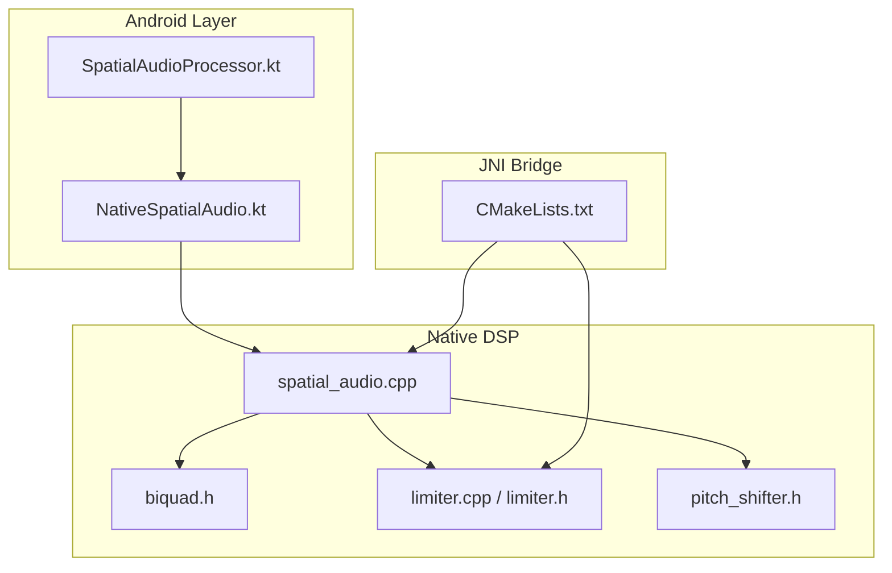
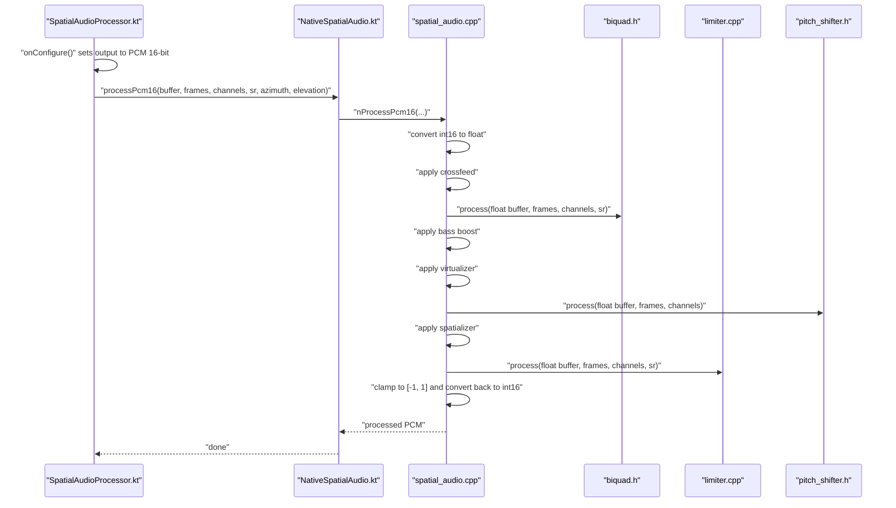
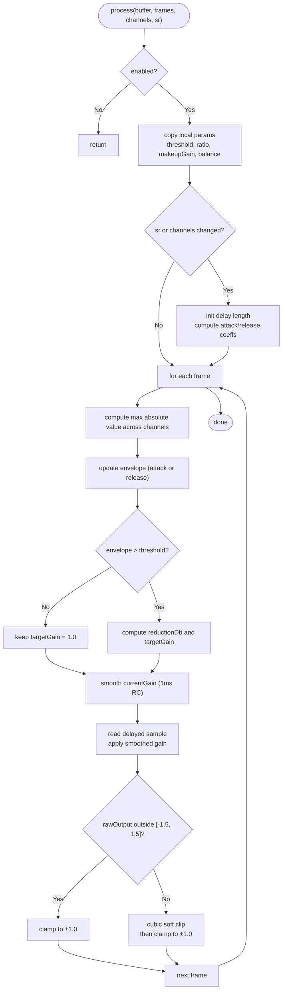
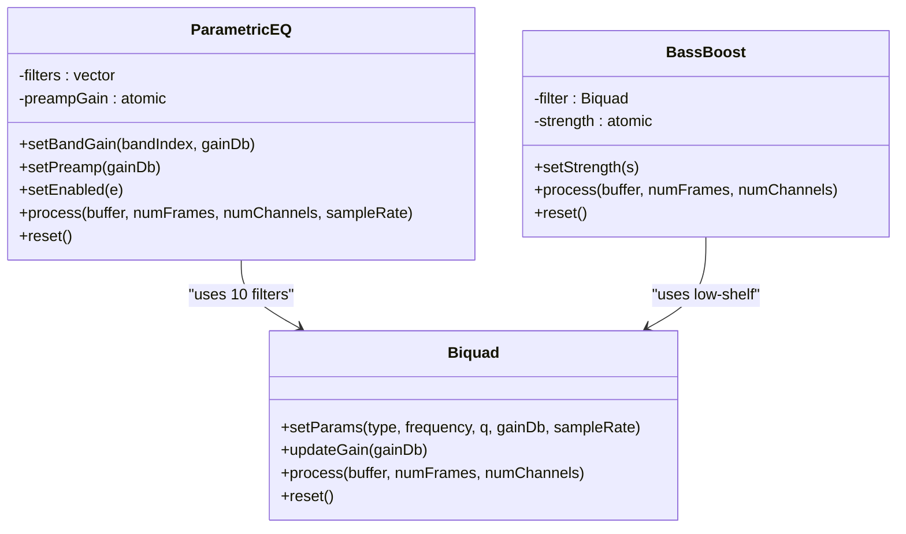
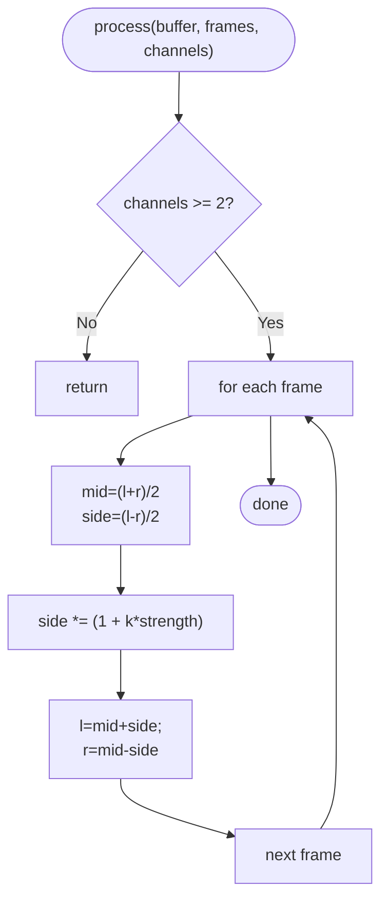
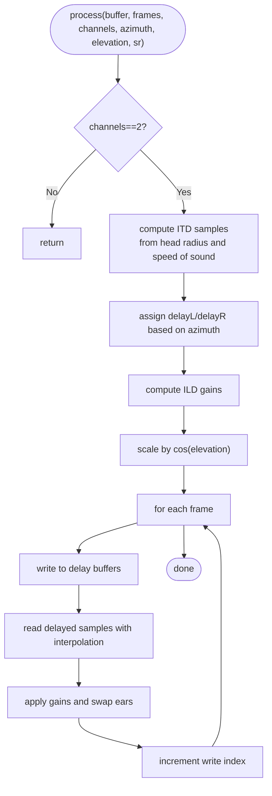
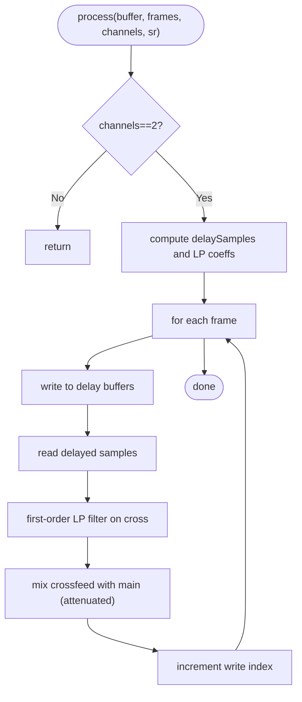
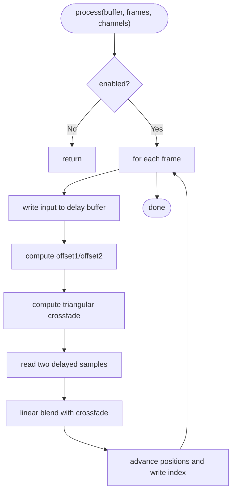
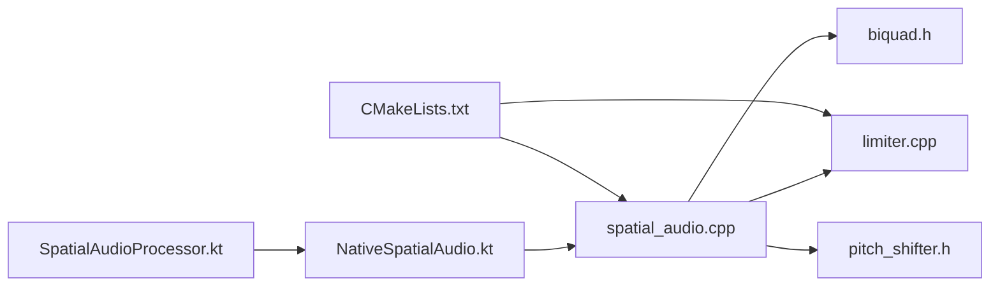

# Audio Enhancement

<cite>
**Referenced Files in This Document**
- [limiter.cpp](file://app/src/main/cpp/limiter.cpp)
- [limiter.h](file://app/src/main/cpp/limiter.h)
- [spatial_audio.cpp](file://app/src/main/cpp/spatial_audio.cpp)
- [biquad.h](file://app/src/main/cpp/biquad.h)
- [pitch_shifter.h](file://app/src/main/cpp/pitch_shifter.h)
- [CMakeLists.txt](file://app/src/main/cpp/CMakeLists.txt)
- [NativeSpatialAudio.kt](file://app/src/main/java/com/suvojeet/suvmusic/player/NativeSpatialAudio.kt)
- [SpatialAudioProcessor.kt](file://app/src/main/java/com/suvojeet/suvmusic/player/SpatialAudioProcessor.kt)
- [README.md](file://README.md)
</cite>

## Table of Contents
1. [Introduction](#introduction)
2. [Project Structure](#project-structure)
3. [Core Components](#core-components)
4. [Architecture Overview](#architecture-overview)
5. [Detailed Component Analysis](#detailed-component-analysis)
6. [Dependency Analysis](#dependency-analysis)
7. [Performance Considerations](#performance-considerations)
8. [Troubleshooting Guide](#troubleshooting-guide)
9. [Conclusion](#conclusion)

## Introduction
This document explains the audio enhancement features implemented in the project’s native audio engine, focusing on:
- Bass boost using low-frequency shelf filtering
- Virtualizer for stereo widening and spatial enhancement
- Limiter with look-ahead detection, attack/release shaping, and soft limiting
- Supporting components: parametric EQ, crossfeed, spatializer, and pitch shifter
- Integration via JNI from the Android audio pipeline

The goal is to provide a clear understanding of algorithms, processing order, threading, and performance characteristics for developers and integrators.

## Project Structure
The audio enhancement engine is implemented in C++ and exposed to Android through JNI. The Kotlin audio processor converts buffers, manages effect state, and routes PCM through the native chain.

**Diagram sources**
- [CMakeLists.txt:1-23](file://app/src/main/cpp/CMakeLists.txt#L1-L23)
- [spatial_audio.cpp:1-475](file://app/src/main/cpp/spatial_audio.cpp#L1-L475)
- [limiter.cpp:1-163](file://app/src/main/cpp/limiter.cpp#L1-L163)
- [limiter.h:1-51](file://app/src/main/cpp/limiter.h#L1-L51)
- [biquad.h:1-125](file://app/src/main/cpp/biquad.h#L1-L125)
- [pitch_shifter.h:1-109](file://app/src/main/cpp/pitch_shifter.h#L1-L109)
- [NativeSpatialAudio.kt:1-158](file://app/src/main/java/com/suvojeet/suvmusic/player/NativeSpatialAudio.kt#L1-L158)
- [SpatialAudioProcessor.kt:1-243](file://app/src/main/java/com/suvojeet/suvmusic/player/SpatialAudioProcessor.kt#L1-L243)

**Section sources**
- [README.md:44-49](file://README.md#L44-L49)
- [CMakeLists.txt:8-19](file://app/src/main/cpp/CMakeLists.txt#L8-L19)
- [SpatialAudioProcessor.kt:113-125](file://app/src/main/java/com/suvojeet/suvmusic/player/SpatialAudioProcessor.kt#L113-L125)

## Core Components
- Limiter: Look-ahead detection, envelope follower, smooth gain, soft limiting, and makeup gain
- Parametric EQ: 10-band ISO filter bank with preamp and per-band gain
- Bass Boost: Low-shelf filter with atomic strength control
- Virtualizer: Stereo widening via mid-side processing
- Spatializer: ITD/ILD-based 3D positioning with delay buffers
- Crossfeed: Headphone crossfeed with LP filtering and delay
- Pitch Shifter: Dual-delay-line with triangular crossfade for pitch/time modification

**Section sources**
- [limiter.cpp:25-144](file://app/src/main/cpp/limiter.cpp#L25-L144)
- [limiter.h:10-51](file://app/src/main/cpp/limiter.h#L10-L51)
- [spatial_audio.cpp:206-270](file://app/src/main/cpp/spatial_audio.cpp#L206-L270)
- [spatial_audio.cpp:272-297](file://app/src/main/cpp/spatial_audio.cpp#L272-L297)
- [spatial_audio.cpp:299-333](file://app/src/main/cpp/spatial_audio.cpp#L299-L333)
- [spatial_audio.cpp:16-104](file://app/src/main/cpp/spatial_audio.cpp#L16-L104)
- [spatial_audio.cpp:106-204](file://app/src/main/cpp/spatial_audio.cpp#L106-L204)
- [pitch_shifter.h:14-109](file://app/src/main/cpp/pitch_shifter.h#L14-L109)

## Architecture Overview
The audio pipeline converts input PCM to float, applies effects in a fixed order, and writes back to 16-bit PCM. The Kotlin processor configures effects and coordinates with the native engine.

**Diagram sources**
- [SpatialAudioProcessor.kt:113-125](file://app/src/main/java/com/suvojeet/suvmusic/player/SpatialAudioProcessor.kt#L113-L125)
- [SpatialAudioProcessor.kt:226-227](file://app/src/main/java/com/suvojeet/suvmusic/player/SpatialAudioProcessor.kt#L226-L227)
- [NativeSpatialAudio.kt:28-34](file://app/src/main/java/com/suvojeet/suvmusic/player/NativeSpatialAudio.kt#L28-L34)
- [spatial_audio.cpp:347-393](file://app/src/main/cpp/spatial_audio.cpp#L347-L393)
- [biquad.h:38-57](file://app/src/main/cpp/biquad.h#L38-L57)
- [limiter.cpp:25-144](file://app/src/main/cpp/limiter.cpp#L25-L144)
- [pitch_shifter.h:28-72](file://app/src/main/cpp/pitch_shifter.h#L28-L72)

## Detailed Component Analysis

### Limiter
Implements a look-ahead limiter with:
- Threshold detection in linear amplitude
- Envelope follower with separate attack and release coefficients
- Smoothed gain to avoid zipper noise
- Soft limiting via cubic shaping with hard clamping
- Makeup gain and stereo balance control

**Diagram sources**
- [limiter.cpp:25-144](file://app/src/main/cpp/limiter.cpp#L25-L144)
- [limiter.h:40](file://app/src/main/cpp/limiter.h#L40)

Key implementation notes:
- Look-ahead of 5 ms uses a circular delay buffer sized by sample rate
- Attack/Release coefficients computed from ms values and sample rate
- Balance applies per-channel attenuation for stereo
- Soft limiting uses a cubic transfer function followed by hard clamp

**Section sources**
- [limiter.cpp:3-8](file://app/src/main/cpp/limiter.cpp#L3-L8)
- [limiter.cpp:10-18](file://app/src/main/cpp/limiter.cpp#L10-L18)
- [limiter.cpp:25-57](file://app/src/main/cpp/limiter.cpp#L25-L57)
- [limiter.cpp:69-110](file://app/src/main/cpp/limiter.cpp#L69-L110)
- [limiter.cpp:112-143](file://app/src/main/cpp/limiter.cpp#L112-L143)
- [limiter.h:10-51](file://app/src/main/cpp/limiter.h#L10-L51)

### Parametric EQ and Bass Boost
- Parametric EQ: 10-band ISO standard (low/high shelves at edges, peaking in between) with preamp and per-band gain
- Bass Boost: Low-shelf filter applied at 80 Hz with strength mapped to 0–12 dB boost

**Diagram sources**
- [biquad.h:17-125](file://app/src/main/cpp/biquad.h#L17-L125)
- [spatial_audio.cpp:206-270](file://app/src/main/cpp/spatial_audio.cpp#L206-L270)
- [spatial_audio.cpp:272-297](file://app/src/main/cpp/spatial_audio.cpp#L272-L297)

Processing order in native:
- Crossfeed → EQ → Bass Boost → Virtualizer → Pitch Shifter → Spatializer → Limiter

**Section sources**
- [spatial_audio.cpp:381-387](file://app/src/main/cpp/spatial_audio.cpp#L381-L387)
- [biquad.h:38-57](file://app/src/main/cpp/biquad.h#L38-L57)
- [spatial_audio.cpp:206-270](file://app/src/main/cpp/spatial_audio.cpp#L206-L270)
- [spatial_audio.cpp:272-297](file://app/src/main/cpp/spatial_audio.cpp#L272-L297)

### Virtualizer (Stereo Widening)
- Mid/Side processing: splits channels, increases side content proportionally to strength, recombines
- Requires stereo input; strength clamped to non-negative values

**Diagram sources**
- [spatial_audio.cpp:299-333](file://app/src/main/cpp/spatial_audio.cpp#L299-L333)

**Section sources**
- [spatial_audio.cpp:307-325](file://app/src/main/cpp/spatial_audio.cpp#L307-L325)

### Spatializer (3D Positioning)
- ITD (Interaural Time Difference) and ILD (Interaural Level Difference) modeling
- Uses head-related parameters and cosine elevation scaling
- Circular delay buffers with fractional read interpolation

**Diagram sources**
- [spatial_audio.cpp:16-104](file://app/src/main/cpp/spatial_audio.cpp#L16-L104)

**Section sources**
- [spatial_audio.cpp:23-71](file://app/src/main/cpp/spatial_audio.cpp#L23-L71)

### Crossfeed (Headphone Comfort)
- Applies small delay (~300 µs) and low-pass filtering to cross signals
- Mixes crossfeed with main signal to preserve perceived level

**Diagram sources**
- [spatial_audio.cpp:106-204](file://app/src/main/cpp/spatial_audio.cpp#L106-L204)

**Section sources**
- [spatial_audio.cpp:121-167](file://app/src/main/cpp/spatial_audio.cpp#L121-L167)

### Pitch Shifter
- Dual delay-line technique with triangular crossfade window
- Maintains quality across pitch ratios with readable delay indices

**Diagram sources**
- [pitch_shifter.h:28-72](file://app/src/main/cpp/pitch_shifter.h#L28-L72)

**Section sources**
- [pitch_shifter.h:21-26](file://app/src/main/cpp/pitch_shifter.h#L21-L26)
- [pitch_shifter.h:39-71](file://app/src/main/cpp/pitch_shifter.h#L39-L71)

## Dependency Analysis
- JNI exposure: NativeSpatialAudio.kt exposes setters and processing entry points
- Pipeline orchestration: SpatialAudioProcessor.kt configures formats, conversions, and effect state
- Build linkage: CMake compiles spatial_audio.cpp, limiter.cpp, and links logs/android

**Diagram sources**
- [SpatialAudioProcessor.kt:113-125](file://app/src/main/java/com/suvojeet/suvmusic/player/SpatialAudioProcessor.kt#L113-L125)
- [NativeSpatialAudio.kt:28-34](file://app/src/main/java/com/suvojeet/suvmusic/player/NativeSpatialAudio.kt#L28-L34)
- [spatial_audio.cpp:347-393](file://app/src/main/cpp/spatial_audio.cpp#L347-L393)
- [CMakeLists.txt:8-19](file://app/src/main/cpp/CMakeLists.txt#L8-L19)

**Section sources**
- [CMakeLists.txt:8-19](file://app/src/main/cpp/CMakeLists.txt#L8-L19)
- [NativeSpatialAudio.kt:10-158](file://app/src/main/java/com/suvojeet/suvmusic/player/NativeSpatialAudio.kt#L10-L158)
- [SpatialAudioProcessor.kt:173-241](file://app/src/main/java/com/suvojeet/suvmusic/player/SpatialAudioProcessor.kt#L173-L241)

## Performance Considerations
- Latency
  - Look-ahead limiter adds 5 ms latency; minimal for real-time playback
  - Spatializer and crossfeed use modest delay buffers; interpolation is linear
- Throughput
  - Fixed-size arrays in loops (e.g., per-frame input frame buffer) reduce heap churn
  - Atomic and mutex-protected parameters copied locally during processing to minimize lock contention
- Memory
  - Circular buffers sized by sample rate; resets clear states on format changes
- Compatibility
  - Output is forced to PCM 16-bit for broad device compatibility
  - Accepts PCM 16-bit or PCM float input; converts to float internally for processing
- Build optimizations
  - 16 KB page size linker option enabled for Android 15+

**Section sources**
- [limiter.h:40](file://app/src/main/cpp/limiter.h#L40)
- [limiter.cpp:72](file://app/src/main/cpp/limiter.cpp#L72)
- [spatial_audio.cpp:345](file://app/src/main/cpp/spatial_audio.cpp#L345)
- [SpatialAudioProcessor.kt:123-125](file://app/src/main/java/com/suvojeet/suvmusic/player/SpatialAudioProcessor.kt#L123-L125)
- [CMakeLists.txt:21-23](file://app/src/main/cpp/CMakeLists.txt#L21-L23)

## Troubleshooting Guide
- No audio or silence
  - Verify input format is PCM 16-bit or PCM float; unknown encodings are passed through
  - Ensure effectsActive condition is met before JNI call
- Clicking or zipper noise
  - Caused by rapid gain changes; smoothing coefficient and makeup gain help mitigate
- Distorted output
  - Confirm limiter is enabled and properly configured; soft limiting reduces hard clipping
- Incorrect spatialization
  - Azimuth/elevation values must be set; spatializer requires stereo input
- Crossfeed artifacts
  - Adjust strength; LP filtering and delay are tuned for headphone comfort

**Section sources**
- [SpatialAudioProcessor.kt:144-150](file://app/src/main/java/com/suvojeet/suvmusic/player/SpatialAudioProcessor.kt#L144-L150)
- [SpatialAudioProcessor.kt:194-199](file://app/src/main/java/com/suvojeet/suvmusic/player/SpatialAudioProcessor.kt#L194-L199)
- [limiter.cpp:108-110](file://app/src/main/cpp/limiter.cpp#L108-L110)
- [spatial_audio.cpp:23-26](file://app/src/main/cpp/spatial_audio.cpp#L23-L26)
- [spatial_audio.cpp:121-124](file://app/src/main/cpp/spatial_audio.cpp#L121-L124)

## Conclusion
The native audio engine delivers a cohesive set of enhancements:
- Bass boost and EQ shape the low/mid spectrum
- Virtualizer enhances stereo width
- Limiter protects against clipping with look-ahead and soft limiting
- Spatializer and crossfeed improve localization and comfort
- Pitch shifter enables time/pitch manipulation

The Kotlin processor integrates these effects cleanly, ensuring compatibility and predictable latency across devices.