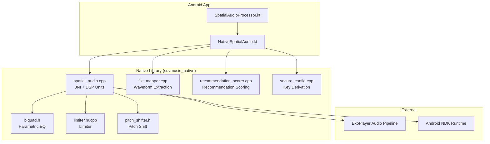
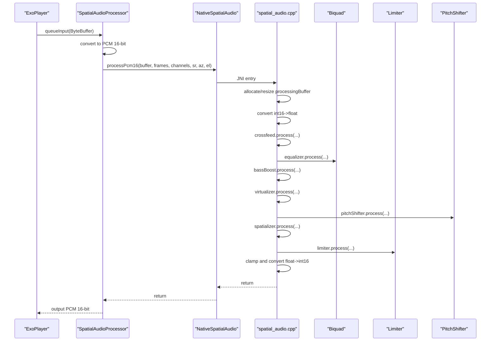
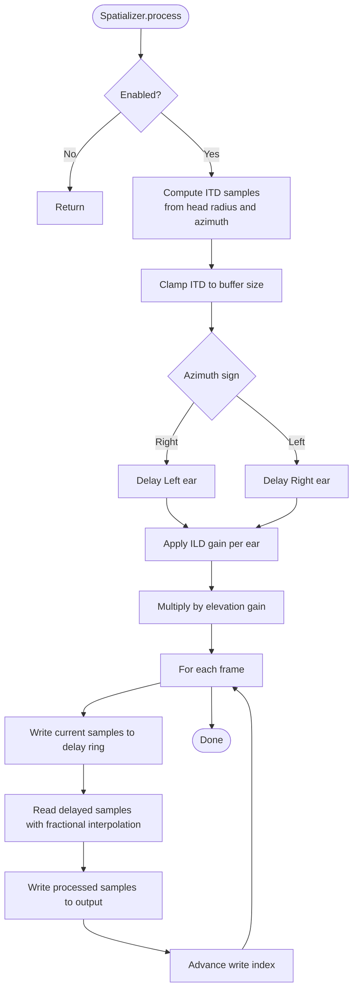
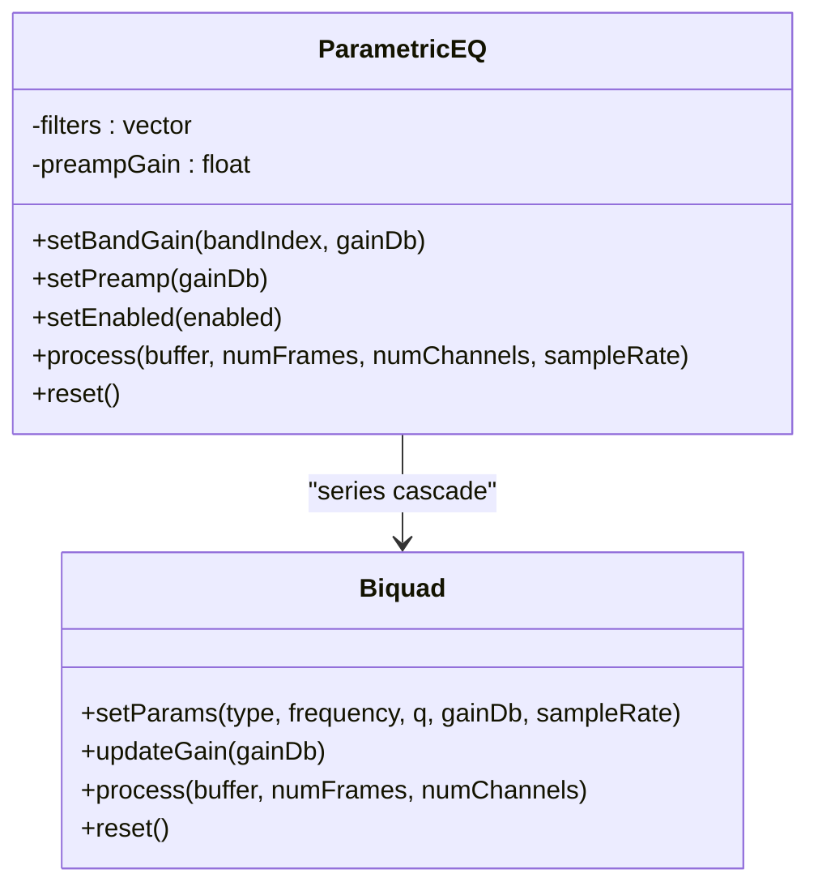
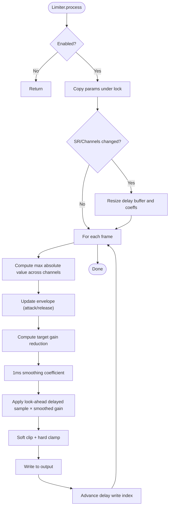
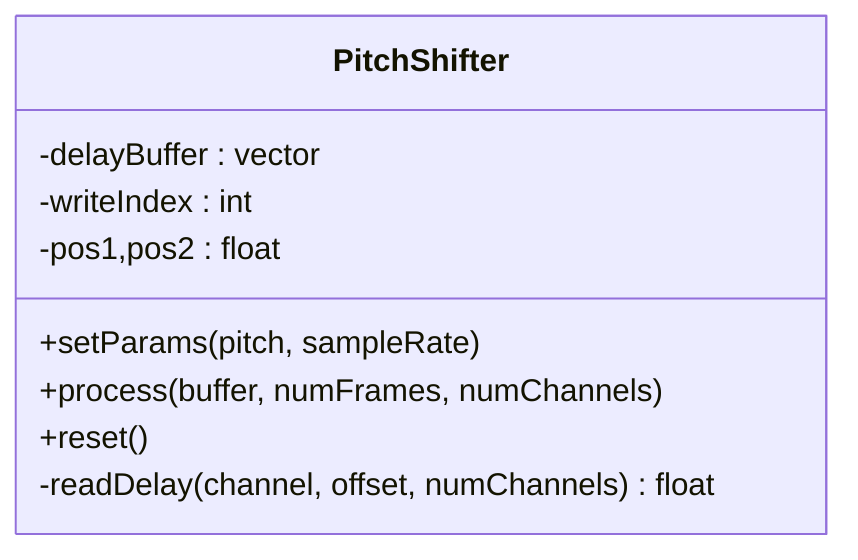
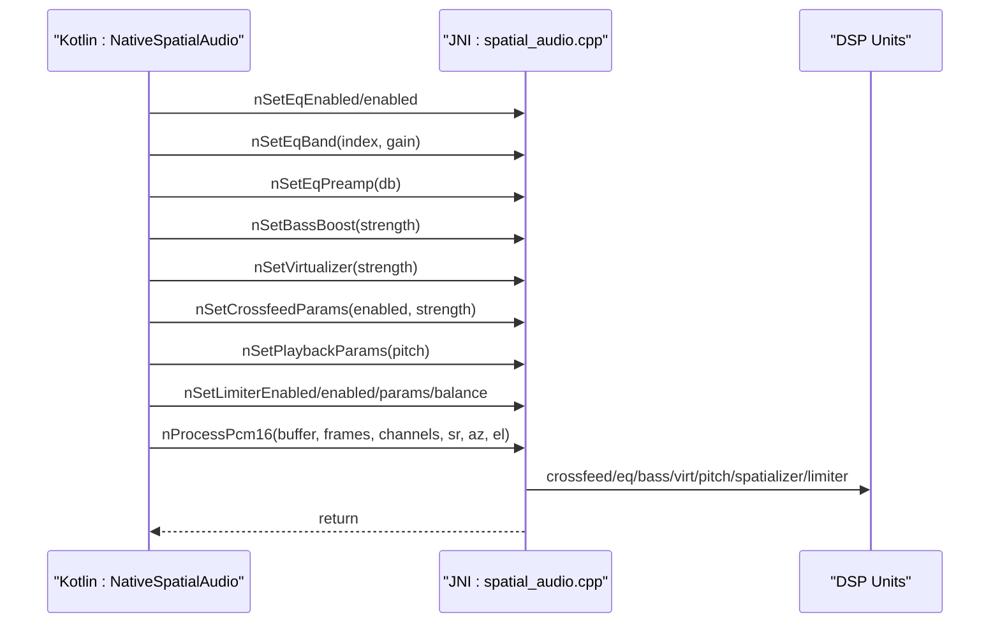
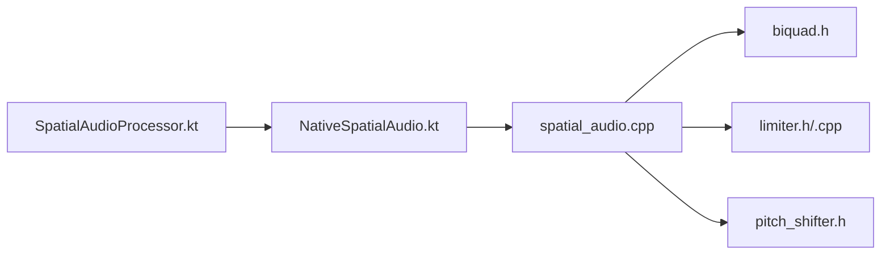

# Audio Processing Engine

<cite>
**Referenced Files in This Document**
- [CMakeLists.txt](file://app/src/main/cpp/CMakeLists.txt)
- [biquad.h](file://app/src/main/cpp/biquad.h)
- [limiter.h](file://app/src/main/cpp/limiter.h)
- [limiter.cpp](file://app/src/main/cpp/limiter.cpp)
- [spatial_audio.cpp](file://app/src/main/cpp/spatial_audio.cpp)
- [pitch_shifter.h](file://app/src/main/cpp/pitch_shifter.h)
- [file_mapper.cpp](file://app/src/main/cpp/file_mapper.cpp)
- [recommendation_scorer.cpp](file://app/src/main/cpp/recommendation_scorer.cpp)
- [secure_config.cpp](file://app/src/main/cpp/secure_config.cpp)
- [NativeSpatialAudio.kt](file://app/src/main/java/com/suvojeet/suvmusic/player/NativeSpatialAudio.kt)
- [SpatialAudioProcessor.kt](file://app/src/main/java/com/suvojeet/suvmusic/player/SpatialAudioProcessor.kt)
- [build.gradle.kts](file://app/build.gradle.kts)
</cite>

## Table of Contents
1. [Introduction](#introduction)
2. [Project Structure](#project-structure)
3. [Core Components](#core-components)
4. [Architecture Overview](#architecture-overview)
5. [Detailed Component Analysis](#detailed-component-analysis)
6. [Dependency Analysis](#dependency-analysis)
7. [Performance Considerations](#performance-considerations)
8. [Troubleshooting Guide](#troubleshooting-guide)
9. [Conclusion](#conclusion)

## Introduction
This document describes SuvMusic’s native audio processing engine responsible for real-time audio manipulation and enhancement. It covers the custom C++ DSP implementations for spatial audio, parametric equalization, bass boost, virtual stereo widening, pitch shifting, and limiting. It also documents the JNI bridge that connects Kotlin/Java to native C++, the audio processing pipeline inside ExoPlayer, and performance optimizations including threading, buffer management, and latency minimization.

## Project Structure
The native audio engine resides under app/src/main/cpp and is built as a shared library named suvmusic_native. The primary native module integrates several DSP units and exposes JNI entry points consumed by Kotlin components. The Kotlin side plugs into ExoPlayer’s audio pipeline via a custom BaseAudioProcessor.

**Diagram sources**
- [CMakeLists.txt:8-13](file://app/src/main/cpp/CMakeLists.txt#L8-L13)
- [spatial_audio.cpp:347-475](file://app/src/main/cpp/spatial_audio.cpp#L347-L475)
- [NativeSpatialAudio.kt:1-158](file://app/src/main/java/com/suvojeet/suvmusic/player/NativeSpatialAudio.kt#L1-L158)
- [SpatialAudioProcessor.kt:1-243](file://app/src/main/java/com/suvojeet/suvmusic/player/SpatialAudioProcessor.kt#L1-L243)

**Section sources**
- [CMakeLists.txt:1-23](file://app/src/main/cpp/CMakeLists.txt#L1-L23)
- [build.gradle.kts:102-110](file://app/build.gradle.kts#L102-L110)

## Core Components
- Spatializer: Implements interaural time difference (ITD) and interaural level difference (ILD) modeling with delay buffers and linear interpolation for 3D spatial placement.
- Parametric EQ: 10-band biquad cascade with preamp and band gain controls.
- Bass Boost: Low-shelf filter controlled by a normalized strength parameter.
- Virtualizer: Mid-side widening for perceived stereo width.
- Pitch Shifter: Dual-delay-line pitch shifter with triangular crossfade for smooth pitch transposition.
- Limiter: Look-ahead peak limiter with stereo balance, makeup gain, and soft clipping.
- JNI Bridge: Single-entry JNI function to process PCM frames, plus setters for all effects.
- Kotlin/ExoPlayer Integration: A BaseAudioProcessor that converts input to PCM, prepares direct buffers, and invokes native processing.

**Section sources**
- [spatial_audio.cpp:16-104](file://app/src/main/cpp/spatial_audio.cpp#L16-L104)
- [spatial_audio.cpp:206-270](file://app/src/main/cpp/spatial_audio.cpp#L206-L270)
- [spatial_audio.cpp:272-297](file://app/src/main/cpp/spatial_audio.cpp#L272-L297)
- [spatial_audio.cpp:299-333](file://app/src/main/cpp/spatial_audio.cpp#L299-L333)
- [pitch_shifter.h:14-106](file://app/src/main/cpp/pitch_shifter.h#L14-L106)
- [limiter.h:10-49](file://app/src/main/cpp/limiter.h#L10-L49)
- [limiter.cpp:25-163](file://app/src/main/cpp/limiter.cpp#L25-L163)
- [spatial_audio.cpp:347-475](file://app/src/main/cpp/spatial_audio.cpp#L347-L475)
- [SpatialAudioProcessor.kt:13-243](file://app/src/main/java/com/suvojeet/suvmusic/player/SpatialAudioProcessor.kt#L13-L243)
- [NativeSpatialAudio.kt:8-158](file://app/src/main/java/com/suvojeet/suvmusic/player/NativeSpatialAudio.kt#L8-L158)

## Architecture Overview
The audio processing pipeline is integrated into ExoPlayer’s BaseAudioProcessor. The Kotlin processor:
- Validates input format and converts to PCM 16-bit if needed.
- Allocates a direct ByteBuffer for JNI.
- Invokes the native entry point to apply spatialization, EQ, bass boost, virtualizer, pitch shift, spatialization, and limiting.
- Copies processed data back to the output buffer.

**Diagram sources**
- [SpatialAudioProcessor.kt:127-241](file://app/src/main/java/com/suvojeet/suvmusic/player/SpatialAudioProcessor.kt#L127-L241)
- [NativeSpatialAudio.kt:28-34](file://app/src/main/java/com/suvojeet/suvmusic/player/NativeSpatialAudio.kt#L28-L34)
- [spatial_audio.cpp:347-393](file://app/src/main/cpp/spatial_audio.cpp#L347-L393)

## Detailed Component Analysis

### Spatial Audio Implementation (ITD/ILD + 3D Positioning)
- ITD model uses a corrected Woodworth formulation with head radius and speed of sound, mapped to fractional delay samples.
- ILD applies sinusoidal attenuation based on azimuth.
- Elevation gain modulates both ears’ gains.
- Fractional delay read/write with wrap-around and linear interpolation.
- Thread-safe via mutex and atomic enable flag.

**Diagram sources**
- [spatial_audio.cpp:23-71](file://app/src/main/cpp/spatial_audio.cpp#L23-L71)
- [spatial_audio.cpp:91-103](file://app/src/main/cpp/spatial_audio.cpp#L91-L103)

**Section sources**
- [spatial_audio.cpp:16-104](file://app/src/main/cpp/spatial_audio.cpp#L16-L104)

### Parametric Equalization (10-Band Biquad Cascade)
- 10-band ISO frequencies with shelf/peaking types.
- Preamp gain and per-band gain updates applied in series.
- Robust gain clamping and thread-safe updates.

**Diagram sources**
- [biquad.h:17-125](file://app/src/main/cpp/biquad.h#L17-L125)
- [spatial_audio.cpp:206-270](file://app/src/main/cpp/spatial_audio.cpp#L206-L270)

**Section sources**
- [biquad.h:17-125](file://app/src/main/cpp/biquad.h#L17-L125)
- [spatial_audio.cpp:206-270](file://app/src/main/cpp/spatial_audio.cpp#L206-L270)

### Limiter (Look-Ahead Peak Detection + Soft Clipping)
- Look-ahead delay line sized for 5 ms at the current sample rate.
- Stereo balance control with per-channel attenuation.
- Peak envelope detection with separate attack/release time constants.
- Smooth gain transitions to avoid zipper noise.
- Soft clipping with cubic shaping plus hard limit for safety.

**Diagram sources**
- [limiter.cpp:25-163](file://app/src/main/cpp/limiter.cpp#L25-L163)
- [limiter.h:10-49](file://app/src/main/cpp/limiter.h#L10-L49)

**Section sources**
- [limiter.h:10-49](file://app/src/main/cpp/limiter.h#L10-L49)
- [limiter.cpp:25-163](file://app/src/main/cpp/limiter.cpp#L25-L163)

### Pitch Shifter (Dual Delay-Line with Crossfade)
- Dual delay lines with phase offset for pitch scaling.
- Triangular window crossfade to avoid discontinuities.
- Fractional read interpolation and ring-buffer indexing.

**Diagram sources**
- [pitch_shifter.h:14-106](file://app/src/main/cpp/pitch_shifter.h#L14-L106)

**Section sources**
- [pitch_shifter.h:14-106](file://app/src/main/cpp/pitch_shifter.h#L14-L106)

### Virtualizer and Bass Boost
- Virtualizer: Mid-side separation with side signal boost for perceived width.
- Bass Boost: Low-shelf filter with normalized strength-to-gain mapping.

**Section sources**
- [spatial_audio.cpp:272-333](file://app/src/main/cpp/spatial_audio.cpp#L272-L333)

### JNI Bridge and Kotlin Integration
- NativeSpatialAudio loads the library asynchronously and exposes setters/getters for all effects.
- SpatialAudioProcessor integrates with ExoPlayer:
  - Validates input formats (PCM 16-bit or Float).
  - Converts to PCM 16-bit and uses a direct ByteBuffer for JNI.
  - Computes azimuth/elevation from stereo balance when spatial mode is active.
  - Applies limiter balance when not in spatial mode.

**Diagram sources**
- [NativeSpatialAudio.kt:28-157](file://app/src/main/java/com/suvojeet/suvmusic/player/NativeSpatialAudio.kt#L28-L157)
- [spatial_audio.cpp:347-475](file://app/src/main/cpp/spatial_audio.cpp#L347-L475)

**Section sources**
- [NativeSpatialAudio.kt:8-158](file://app/src/main/java/com/suvojeet/suvmusic/player/NativeSpatialAudio.kt#L8-L158)
- [SpatialAudioProcessor.kt:13-243](file://app/src/main/java/com/suvojeet/suvmusic/player/SpatialAudioProcessor.kt#L13-L243)
- [spatial_audio.cpp:347-475](file://app/src/main/cpp/spatial_audio.cpp#L347-L475)

### Additional Native Modules
- Waveform Extraction: Uses memory-mapped IO to scan PCM files and produce peak amplitude envelopes.
- Recommendation Scoring: SIMD-accelerated weighted scoring with NEON/SSE fallbacks and top-K selection.
- Secure Config: Obfuscated key derivation moved to native code.

**Section sources**
- [file_mapper.cpp:12-124](file://app/src/main/cpp/file_mapper.cpp#L12-L124)
- [recommendation_scorer.cpp:1-503](file://app/src/main/cpp/recommendation_scorer.cpp#L1-L503)
- [secure_config.cpp:1-61](file://app/src/main/cpp/secure_config.cpp#L1-L61)

## Dependency Analysis
- Build system compiles spatial_audio.cpp, limiter.cpp, biquad.h, pitch_shifter.h, file_mapper.cpp, recommendation_scorer.cpp, secure_config.cpp into suvmusic_native.
- The Kotlin processor depends on ExoPlayer’s BaseAudioProcessor and Android NDK runtime.
- Internal dependencies among DSP units are encapsulated within spatial_audio.cpp.

**Diagram sources**
- [CMakeLists.txt:8-13](file://app/src/main/cpp/CMakeLists.txt#L8-L13)
- [spatial_audio.cpp:347-475](file://app/src/main/cpp/spatial_audio.cpp#L347-L475)

**Section sources**
- [CMakeLists.txt:1-23](file://app/src/main/cpp/CMakeLists.txt#L1-L23)
- [spatial_audio.cpp:347-475](file://app/src/main/cpp/spatial_audio.cpp#L347-L475)

## Performance Considerations
- Real-time constraints:
  - All DSP units operate in-place on interleaved PCM data.
  - Fixed-size buffers and preallocated state minimize allocations during processing.
- Latency optimization:
  - Look-ahead limiter uses a fixed 5 ms delay line sized per SR/CH.
  - Spatializer and crossfeed use modest delay buffers with fractional interpolation.
  - Pitch shifter maintains dual delay lines with minimal overhead.
- Threading:
  - DSP units use mutexes around parameter updates; processing locks only the minimal critical sections.
  - Atomic flags guard enable/disable to avoid frequent locking in hot paths.
- Buffer management:
  - Kotlin processor reuses a direct ByteBuffer and resizes only when needed.
  - Native processingBuffer is reused and resized conservatively.
- SIMD acceleration:
  - Recommendation scorer uses NEON/SSE intrinsics for vectorized scoring and cosine similarity.
- Platform tuning:
  - CMake links with a large page size option for Android 15+ targets.

**Section sources**
- [limiter.cpp:41-57](file://app/src/main/cpp/limiter.cpp#L41-L57)
- [spatial_audio.cpp:370-375](file://app/src/main/cpp/spatial_audio.cpp#L370-L375)
- [SpatialAudioProcessor.kt:213-233](file://app/src/main/java/com/suvojeet/suvmusic/player/SpatialAudioProcessor.kt#L213-L233)
- [recommendation_scorer.cpp:34-39](file://app/src/main/cpp/recommendation_scorer.cpp#L34-L39)
- [CMakeLists.txt:21-23](file://app/src/main/cpp/CMakeLists.txt#L21-L23)

## Troubleshooting Guide
- JNI buffer errors:
  - Ensure the ByteBuffer is direct; the Kotlin wrapper enforces this and throws if not.
  - Verify frame/channel/sample rate are valid; processors return early on invalid inputs.
- Silence or artifacts:
  - Confirm effects are enabled only when needed; the processor avoids processing when inactive.
  - Check limiter balance vs. spatial balance routing; spatial mode routes balance to spatializer while non-spatial routes to limiter.
- Parameter updates:
  - EQ bands and preamp updates are clamped and applied atomically; verify ranges and call frequency.
  - Limiter parameters are recalculated on SR/CH changes; ensure consistent sample rates.
- Recommendations:
  - For heavy workloads, prefer NEON/SSE-capable devices; fallback paths remain functional.

**Section sources**
- [NativeSpatialAudio.kt:28-34](file://app/src/main/java/com/suvojeet/suvmusic/player/NativeSpatialAudio.kt#L28-L34)
- [SpatialAudioProcessor.kt:144-150](file://app/src/main/java/com/suvojeet/suvmusic/player/SpatialAudioProcessor.kt#L144-L150)
- [spatial_audio.cpp:395-475](file://app/src/main/cpp/spatial_audio.cpp#L395-L475)

## Conclusion
SuvMusic’s native audio engine delivers a cohesive, real-time audio processing pipeline integrating spatial audio, parametric EQ, bass boost, virtualization, pitch shifting, and limiting. The JNI bridge cleanly exposes controls to Kotlin while the ExoPlayer integration ensures compatibility and low-latency operation. Performance is optimized through fixed buffers, atomic flags, minimal allocations, and SIMD acceleration where applicable.