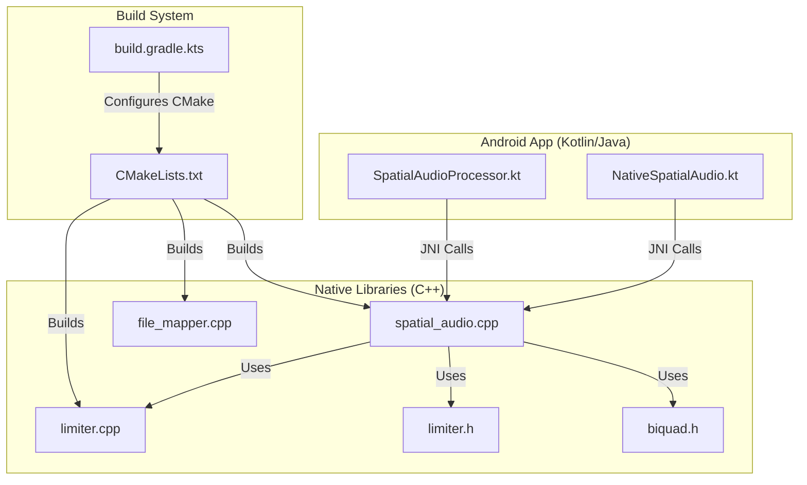
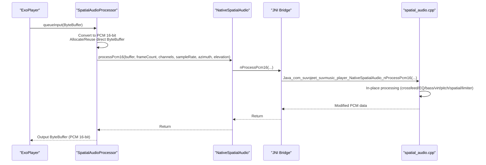
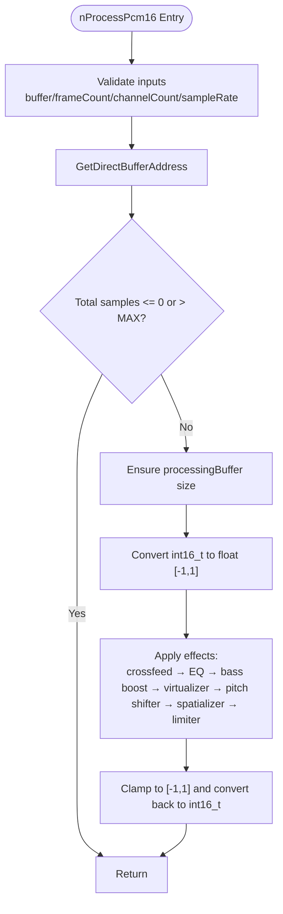
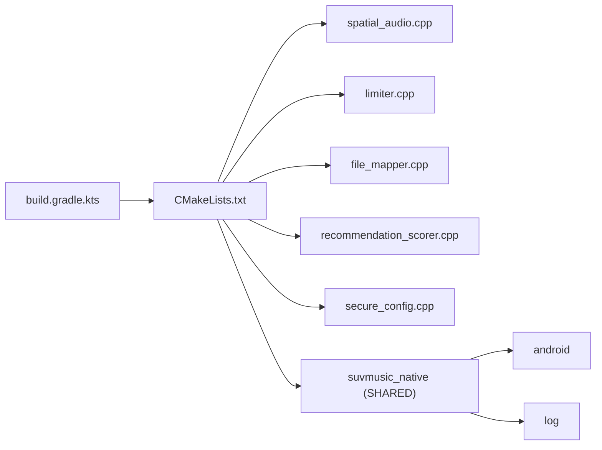

# JNI Bridge Implementation

<cite>
**Referenced Files in This Document**
- [NativeSpatialAudio.kt](file://app/src/main/java/com/suvojeet/suvmusic/player/NativeSpatialAudio.kt)
- [SpatialAudioProcessor.kt](file://app/src/main/java/com/suvojeet/suvmusic/player/SpatialAudioProcessor.kt)
- [spatial_audio.cpp](file://app/src/main/cpp/spatial_audio.cpp)
- [file_mapper.cpp](file://app/src/main/cpp/file_mapper.cpp)
- [limiter.cpp](file://app/src/main/cpp/limiter.cpp)
- [limiter.h](file://app/src/main/cpp/limiter.h)
- [biquad.h](file://app/src/main/cpp/biquad.h)
- [CMakeLists.txt](file://app/src/main/cpp/CMakeLists.txt)
- [build.gradle.kts](file://app/build.gradle.kts)
</cite>

## Table of Contents
1. [Introduction](#introduction)
2. [Project Structure](#project-structure)
3. [Core Components](#core-components)
4. [Architecture Overview](#architecture-overview)
5. [Detailed Component Analysis](#detailed-component-analysis)
6. [Dependency Analysis](#dependency-analysis)
7. [Performance Considerations](#performance-considerations)
8. [Troubleshooting Guide](#troubleshooting-guide)
9. [Conclusion](#conclusion)

## Introduction
This document describes the JNI (Java Native Interface) bridge that connects Kotlin/Java audio processing code to native C++ components in an Android music application. It covers native method declarations, data type conversions between Java and C++, memory management for direct ByteBuffers, thread safety, build configuration, platform-specific optimizations, audio buffer management, real-time processing constraints, and error handling across the JNI boundary. Practical examples are provided via file references and diagrams mapped to actual source code.

## Project Structure
The JNI bridge spans three primary areas:
- Java/Kotlin side: exposes native methods and manages direct buffers and threading.
- Native C++ side: implements audio processing effects and utility functions.
- Build system: compiles shared libraries and links required Android libraries.

**Diagram sources**
- [NativeSpatialAudio.kt:1-158](file://app/src/main/java/com/suvojeet/suvmusic/player/NativeSpatialAudio.kt#L1-L158)
- [SpatialAudioProcessor.kt:1-243](file://app/src/main/java/com/suvojeet/suvmusic/player/SpatialAudioProcessor.kt#L1-L243)
- [spatial_audio.cpp:1-475](file://app/src/main/cpp/spatial_audio.cpp#L1-L475)
- [limiter.cpp:1-163](file://app/src/main/cpp/limiter.cpp#L1-L163)
- [limiter.h:1-51](file://app/src/main/cpp/limiter.h#L1-L51)
- [biquad.h:1-125](file://app/src/main/cpp/biquad.h#L1-L125)
- [CMakeLists.txt:1-23](file://app/src/main/cpp/CMakeLists.txt#L1-L23)
- [build.gradle.kts:102-110](file://app/build.gradle.kts#L102-L110)

**Section sources**
- [build.gradle.kts:102-110](file://app/build.gradle.kts#L102-L110)
- [CMakeLists.txt:1-23](file://app/src/main/cpp/CMakeLists.txt#L1-L23)

## Core Components
- NativeSpatialAudio: Java/Kotlin facade exposing native methods for audio processing and waveform extraction. It loads the native library asynchronously and validates direct ByteBuffer inputs for JNI calls.
- SpatialAudioProcessor: ExoPlayer-compatible audio processor that converts input audio to PCM 16-bit, optionally applies native processing via JNI, and ensures output compatibility.
- spatial_audio.cpp: Implements the core audio processing pipeline (crossfeed, EQ, bass boost, virtualizer, pitch shifter, spatializer, limiter) and exposes JNI entry points for processing and configuration.
- limiter.cpp/.h: Provides a thread-safe limiter with lookahead delay, envelope detection, and soft clipping.
- biquad.h: Implements configurable biquad filters (low/high shelf, peaking) used by the parametric EQ.
- file_mapper.cpp: JNI utility to extract waveform data from files using memory-mapped I/O.

Key JNI entry points:
- Processing: Java_com_suvojeet_suvmusic_player_NativeSpatialAudio_nProcessPcm16
- Configuration: Java_com_suvojeet_suvmusic_player_NativeSpatialAudio_nSetLimiterParams, Java_com_suvojeet_suvmusic_player_NativeSpatialAudio_nSetSpatializerEnabled, etc.
- Utility: Java_com_suvojeet_suvmusic_player_NativeSpatialAudio_nExtractWaveform

**Section sources**
- [NativeSpatialAudio.kt:28-43](file://app/src/main/java/com/suvojeet/suvmusic/player/NativeSpatialAudio.kt#L28-L43)
- [NativeSpatialAudio.kt:150-156](file://app/src/main/java/com/suvojeet/suvmusic/player/NativeSpatialAudio.kt#L150-L156)
- [spatial_audio.cpp:347-474](file://app/src/main/cpp/spatial_audio.cpp#L347-L474)
- [file_mapper.cpp:12-123](file://app/src/main/cpp/file_mapper.cpp#L12-L123)

## Architecture Overview
The audio pipeline integrates Java/Kotlin processing with native audio effects through JNI. ExoPlayer feeds PCM frames to SpatialAudioProcessor, which converts to PCM 16-bit and, when effects are active, passes a direct ByteBuffer to the native processing routine. The native side performs in-place processing and returns the modified PCM data.

**Diagram sources**
- [SpatialAudioProcessor.kt:127-241](file://app/src/main/java/com/suvojeet/suvmusic/player/SpatialAudioProcessor.kt#L127-L241)
- [NativeSpatialAudio.kt:28-43](file://app/src/main/java/com/suvojeet/suvmusic/player/NativeSpatialAudio.kt#L28-L43)
- [spatial_audio.cpp:347-393](file://app/src/main/cpp/spatial_audio.cpp#L347-L393)

## Detailed Component Analysis

### Java/Kotlin JNI Facade: NativeSpatialAudio
Responsibilities:
- Asynchronous library loading with error logging.
- Validation of direct ByteBuffer inputs for processing.
- Delegation of configuration calls to native methods.
- Optional waveform extraction via mmap-based utility.

Thread safety:
- Library load guarded by a coroutine on Dispatchers.IO.
- Native method invocations guarded by a loaded flag.

Memory management:
- Requires direct ByteBuffer for processing to avoid extra copies.

Examples of native method declarations:
- [NativeSpatialAudio.kt:36-43](file://app/src/main/java/com/suvojeet/suvmusic/player/NativeSpatialAudio.kt#L36-L43)
- [NativeSpatialAudio.kt:150-156](file://app/src/main/java/com/suvojeet/suvmusic/player/NativeSpatialAudio.kt#L150-L156)

**Section sources**
- [NativeSpatialAudio.kt:1-23](file://app/src/main/java/com/suvojeet/suvmusic/player/NativeSpatialAudio.kt#L1-L23)
- [NativeSpatialAudio.kt:28-43](file://app/src/main/java/com/suvojeet/suvmusic/player/NativeSpatialAudio.kt#L28-L43)
- [NativeSpatialAudio.kt:150-156](file://app/src/main/java/com/suvojeet/suvmusic/player/NativeSpatialAudio.kt#L150-L156)

### Audio Processor: SpatialAudioProcessor
Responsibilities:
- Converts input audio (PCM 16-bit or Float) to PCM 16-bit.
- Manages a reusable direct ByteBuffer for JNI.
- Applies spatial positioning and limiter balance based on runtime state.
- Delegates to native processing when effects are active.

Real-time constraints:
- Uses replaceOutputBuffer to reuse backing arrays.
- Avoids allocations inside the hot path by reusing buffers.

Error handling:
- Logs conversion errors and continues with passthrough data.
- On JNI exceptions, logs and returns unprocessed data to avoid silence.

Buffer allocation pattern:
- Allocate direct ByteBuffer sized for PCM 16-bit output frames.
- Reuse if capacity is sufficient.

**Section sources**
- [SpatialAudioProcessor.kt:127-241](file://app/src/main/java/com/suvojeet/suvmusic/player/SpatialAudioProcessor.kt#L127-L241)

### Native Processing Pipeline: spatial_audio.cpp
Responsibilities:
- Implements audio processing chain: crossfeed → EQ → bass boost → virtualizer → pitch shifter → spatializer → limiter.
- Processes in-place on a direct ByteBuffer supplied by Java.
- Uses a shared processing buffer sized to the number of samples.

Thread safety:
- Uses mutex-protected processing and atomic toggles for effect parameters.
- Guards shared state during processing.

Real-time constraints:
- Enforces maximum total samples to bound memory usage.
- Operates on interleaved PCM 16-bit samples.

Data type conversions:
- Converts int16_t samples to float [-1, 1] internally, then clamps and converts back.

JNI entry points:
- [spatial_audio.cpp:347-393](file://app/src/main/cpp/spatial_audio.cpp#L347-L393) for processing.
- [spatial_audio.cpp:395-474](file://app/src/main/cpp/spatial_audio.cpp#L395-L474) for configuration.

**Diagram sources**
- [spatial_audio.cpp:347-393](file://app/src/main/cpp/spatial_audio.cpp#L347-L393)

**Section sources**
- [spatial_audio.cpp:16-104](file://app/src/main/cpp/spatial_audio.cpp#L16-L104)
- [spatial_audio.cpp:106-204](file://app/src/main/cpp/spatial_audio.cpp#L106-L204)
- [spatial_audio.cpp:206-270](file://app/src/main/cpp/spatial_audio.cpp#L206-L270)
- [spatial_audio.cpp:272-297](file://app/src/main/cpp/spatial_audio.cpp#L272-L297)
- [spatial_audio.cpp:299-333](file://app/src/main/cpp/spatial_audio.cpp#L299-L333)
- [spatial_audio.cpp:347-393](file://app/src/main/cpp/spatial_audio.cpp#L347-L393)

### Limiter Implementation: limiter.cpp/.h
Responsibilities:
- Implements lookahead-based limiting with smooth gain transitions.
- Supports stereo balance adjustment and makeup gain.
- Thread-safe with mutex-protected parameter updates.

Real-time characteristics:
- Precomputes coefficients based on sample rate and frame count.
- Uses small fixed-size arrays to avoid heap allocations in the loop.

**Section sources**
- [limiter.cpp:1-163](file://app/src/main/cpp/limiter.cpp#L1-L163)
- [limiter.h:1-51](file://app/src/main/cpp/limiter.h#L1-L51)

### Biquad Filters: biquad.h
Responsibilities:
- Implements low/high shelves and peaking filters using direct-form I biquad equations.
- Clamps channel processing to a safe upper bound.

**Section sources**
- [biquad.h:1-125](file://app/src/main/cpp/biquad.h#L1-L125)

### File Mapper Utility: file_mapper.cpp
Responsibilities:
- Extracts waveform data from files using memory-mapped I/O.
- Detects compressed formats and returns empty arrays for unsupported types.
- Returns a jfloatArray to Java.

JNI entry point:
- [file_mapper.cpp:12-123](file://app/src/main/cpp/file_mapper.cpp#L12-L123)

**Section sources**
- [file_mapper.cpp:12-123](file://app/src/main/cpp/file_mapper.cpp#L12-L123)

## Dependency Analysis
The native library depends on Android and log libraries. The build system configures ABI filters and enables large page size support for newer Android versions.

**Diagram sources**
- [CMakeLists.txt:8-19](file://app/src/main/cpp/CMakeLists.txt#L8-L19)
- [build.gradle.kts:102-110](file://app/build.gradle.kts#L102-L110)

**Section sources**
- [CMakeLists.txt:1-23](file://app/src/main/cpp/CMakeLists.txt#L1-L23)
- [build.gradle.kts:27-30](file://app/build.gradle.kts#L27-L30)
- [build.gradle.kts:102-110](file://app/build.gradle.kts#L102-L110)

## Performance Considerations
- Direct ByteBuffer usage: Both Java and native sides rely on direct buffers to avoid copying data across the JNI boundary.
- Buffer reuse: SpatialAudioProcessor reuses a direct ByteBuffer sized for the current frame count to minimize allocations.
- In-place processing: The native side modifies PCM data in place, reducing memory overhead.
- Mutex contention: Effect processors use fine-grained locking around parameter updates and minimal critical sections during processing.
- Platform optimizations: Large page size support is enabled for Android 15+ and 16+ to improve TLB performance.
- ABI filtering: Only relevant ABIs are included to reduce APK size and improve performance on target devices.

[No sources needed since this section provides general guidance]

## Troubleshooting Guide
Common issues and resolutions:
- Direct ByteBuffer requirement: Ensure the ByteBuffer passed to the native processing method is direct; otherwise, an exception is thrown.
- Library load failures: If the native library fails to load, the facade logs an error; verify the library name and ABI availability.
- Unsupported file formats: The waveform extractor returns an empty array for compressed formats; ensure raw PCM or handle empty results gracefully.
- JNI exceptions: On native processing errors, the processor logs and returns the original data to avoid silence.
- Parameter bounds: Native processors clamp parameters to safe ranges; verify inputs to avoid unexpected behavior.

**Section sources**
- [NativeSpatialAudio.kt:30-32](file://app/src/main/java/com/suvojeet/suvmusic/player/NativeSpatialAudio.kt#L30-L32)
- [file_mapper.cpp:66-73](file://app/src/main/cpp/file_mapper.cpp#L66-L73)
- [SpatialAudioProcessor.kt:234-240](file://app/src/main/java/com/suvojeet/suvmusic/player/SpatialAudioProcessor.kt#L234-L240)

## Conclusion
The JNI bridge cleanly separates audio processing concerns between Java/Kotlin and native C++. It leverages direct buffers, in-place processing, and careful thread safety to meet real-time constraints. The build configuration targets relevant ABIs and enables platform-specific optimizations. Together, these components deliver a robust, high-performance audio pipeline suitable for production use.