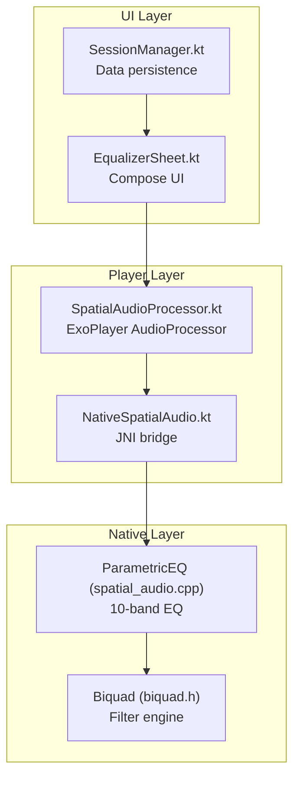
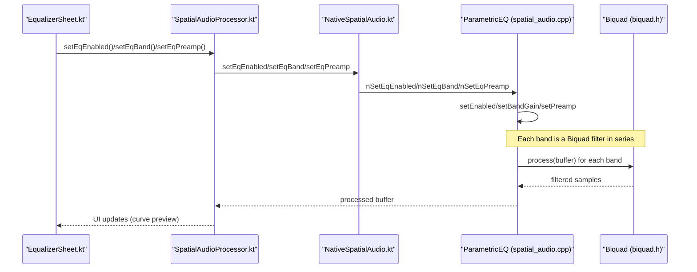
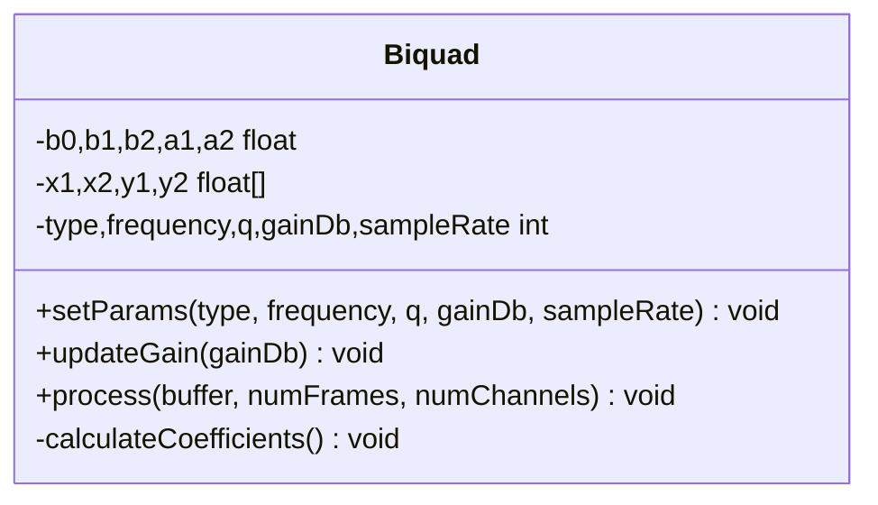
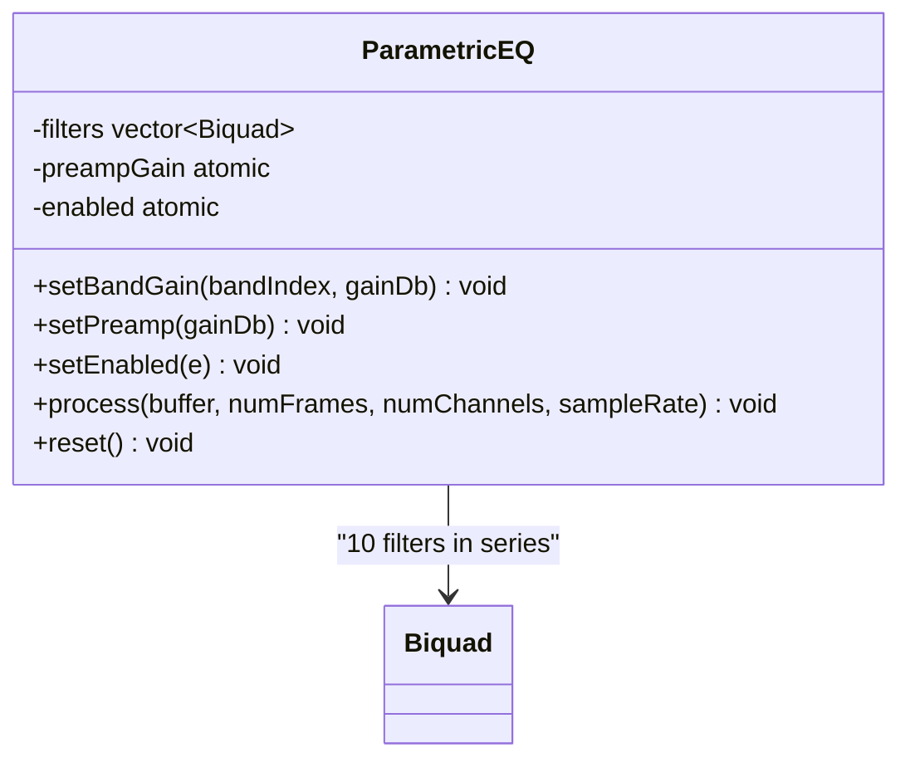
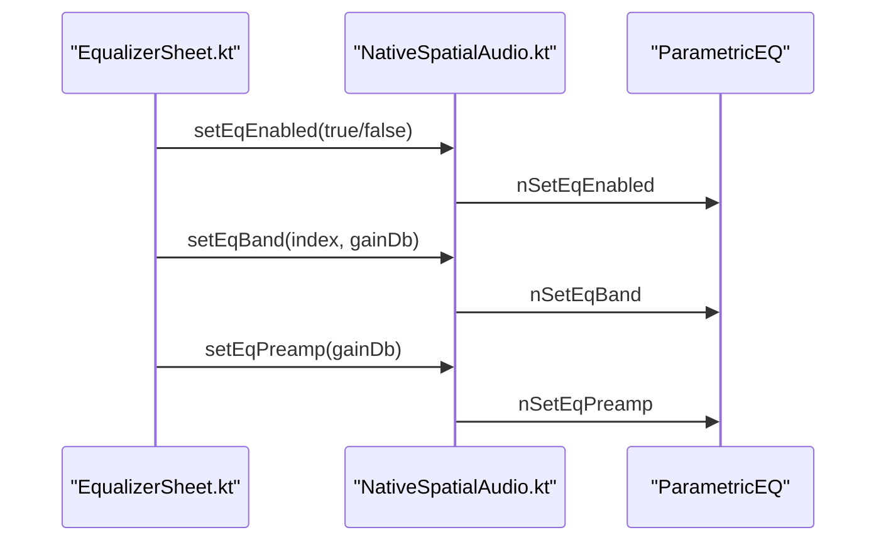
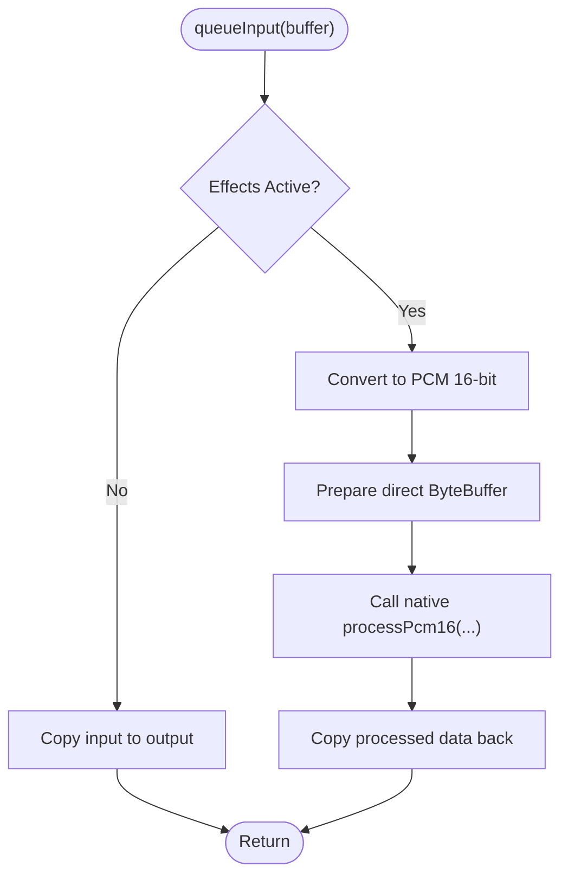
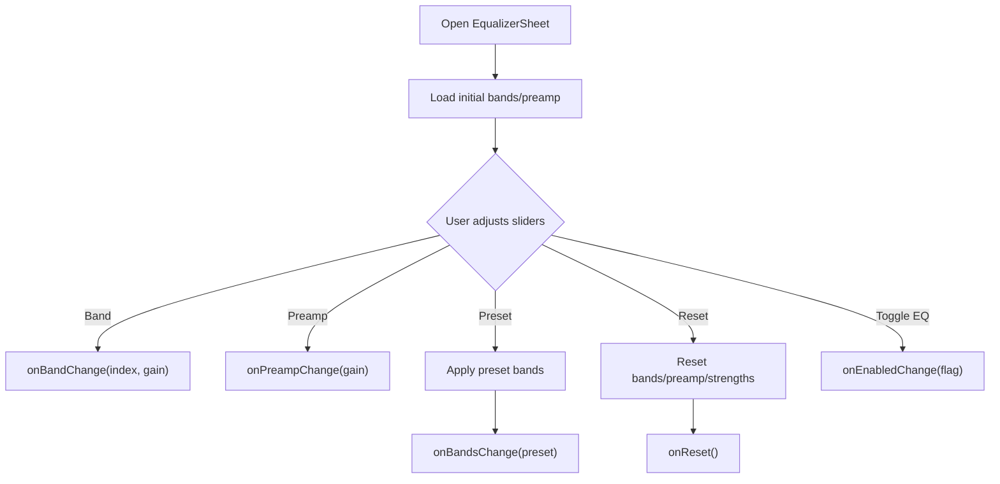
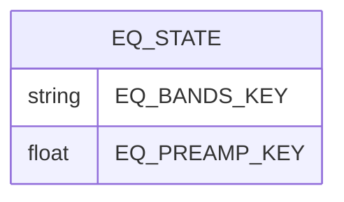
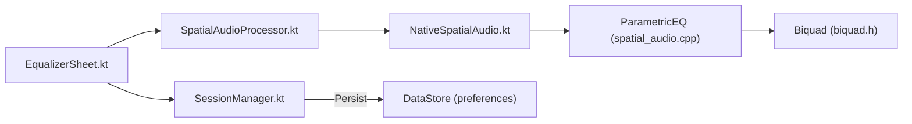

# Parametric Equalization

<cite>
**Referenced Files in This Document**
- [biquad.h](file://app/src/main/cpp/biquad.h)
- [spatial_audio.cpp](file://app/src/main/cpp/spatial_audio.cpp)
- [NativeSpatialAudio.kt](file://app/src/main/java/com/suvojeet/suvmusic/player/NativeSpatialAudio.kt)
- [SpatialAudioProcessor.kt](file://app/src/main/java/com/suvojeet/suvmusic/player/SpatialAudioProcessor.kt)
- [EqualizerSheet.kt](file://app/src/main/java/com/suvojeet/suvmusic/ui/components/EqualizerSheet.kt)
- [SessionManager.kt](file://app/src/main/java/com/suvojeet/suvmusic/data/SessionManager.kt)
</cite>

## Table of Contents
1. [Introduction](#introduction)
2. [Project Structure](#project-structure)
3. [Core Components](#core-components)
4. [Architecture Overview](#architecture-overview)
5. [Detailed Component Analysis](#detailed-component-analysis)
6. [Dependency Analysis](#dependency-analysis)
7. [Performance Considerations](#performance-considerations)
8. [Troubleshooting Guide](#troubleshooting-guide)
9. [Conclusion](#conclusion)
10. [Appendices](#appendices)

## Introduction
This document describes the parametric equalization system implemented in the SuvMusic project. It covers the 10-band parametric EQ with adjustable frequency bands, Q-factors, and gain controls, the underlying biquad filter design and coefficient calculations, real-time parameter adjustment, EQ presets, individual band control mechanisms, and EQ bypass functionality. It also documents filter stability, phase response considerations, and audio quality preservation during EQ processing, along with examples of EQ curve visualization, preset management, and UI integration for EQ controls.

## Project Structure
The EQ system spans native C++ for efficient audio processing, Kotlin/Android for UI and persistence, and ExoPlayer integration for seamless audio pipeline insertion.

**Diagram sources**
- [EqualizerSheet.kt:126-661](file://app/src/main/java/com/suvojeet/suvmusic/ui/components/EqualizerSheet.kt#L126-L661)
- [SessionManager.kt:1262-1313](file://app/src/main/java/com/suvojeet/suvmusic/data/SessionManager.kt#L1262-L1313)
- [SpatialAudioProcessor.kt:13-243](file://app/src/main/java/com/suvojeet/suvmusic/player/SpatialAudioProcessor.kt#L13-L243)
- [NativeSpatialAudio.kt:9-158](file://app/src/main/java/com/suvojeet/suvmusic/player/NativeSpatialAudio.kt#L9-L158)
- [spatial_audio.cpp:206-270](file://app/src/main/cpp/spatial_audio.cpp#L206-L270)
- [biquad.h:17-125](file://app/src/main/cpp/biquad.h#L17-L125)

**Section sources**
- [EqualizerSheet.kt:126-661](file://app/src/main/java/com/suvojeet/suvmusic/ui/components/EqualizerSheet.kt#L126-L661)
- [SessionManager.kt:1262-1313](file://app/src/main/java/com/suvojeet/suvmusic/data/SessionManager.kt#L1262-L1313)
- [SpatialAudioProcessor.kt:13-243](file://app/src/main/java/com/suvojeet/suvmusic/player/SpatialAudioProcessor.kt#L13-L243)
- [NativeSpatialAudio.kt:9-158](file://app/src/main/java/com/suvojeet/suvmusic/player/NativeSpatialAudio.kt#L9-L158)
- [spatial_audio.cpp:206-270](file://app/src/main/cpp/spatial_audio.cpp#L206-L270)
- [biquad.h:17-125](file://app/src/main/cpp/biquad.h#L17-L125)

## Core Components
- Biquad filter engine: Implements low-shelf, peaking, and high-shelf filters with Direct Form I processing and normalized coefficients.
- ParametricEQ: Manages 10 biquad filters arranged as a cascade chain with preamp and enable control.
- NativeSpatialAudio: Provides JNI methods to control EQ and other audio effects.
- SpatialAudioProcessor: Integrates the native effects into ExoPlayer’s audio pipeline.
- EqualizerSheet: Compose UI for EQ controls, presets, and real-time curve visualization.
- SessionManager: Persists EQ bands and preamp settings.

**Section sources**
- [biquad.h:17-125](file://app/src/main/cpp/biquad.h#L17-L125)
- [spatial_audio.cpp:206-270](file://app/src/main/cpp/spatial_audio.cpp#L206-L270)
- [NativeSpatialAudio.kt:96-118](file://app/src/main/java/com/suvojeet/suvmusic/player/NativeSpatialAudio.kt#L96-L118)
- [SpatialAudioProcessor.kt:49-73](file://app/src/main/java/com/suvojeet/suvmusic/player/SpatialAudioProcessor.kt#L49-L73)
- [EqualizerSheet.kt:112-122](file://app/src/main/java/com/suvojeet/suvmusic/ui/components/EqualizerSheet.kt#L112-L122)
- [SessionManager.kt:1272-1313](file://app/src/main/java/com/suvojeet/suvmusic/data/SessionManager.kt#L1272-L1313)

## Architecture Overview
The EQ system operates as follows:
- UI updates trigger calls to the native layer via JNI.
- Native processing applies EQ in series across 10 bands, then bass boost, virtualizer, and spatialization.
- The processed PCM is returned to the ExoPlayer pipeline.

**Diagram sources**
- [EqualizerSheet.kt:126-661](file://app/src/main/java/com/suvojeet/suvmusic/ui/components/EqualizerSheet.kt#L126-L661)
- [SpatialAudioProcessor.kt:49-73](file://app/src/main/java/com/suvojeet/suvmusic/player/SpatialAudioProcessor.kt#L49-L73)
- [NativeSpatialAudio.kt:96-118](file://app/src/main/java/com/suvojeet/suvmusic/player/NativeSpatialAudio.kt#L96-L118)
- [spatial_audio.cpp:206-270](file://app/src/main/cpp/spatial_audio.cpp#L206-L270)
- [biquad.h:17-125](file://app/src/main/cpp/biquad.h#L17-L125)

## Detailed Component Analysis

### Biquad Filter Engine
- Filter types: LOW_SHELF, PEAKING, HIGH_SHELF.
- Processing: Direct Form I biquad difference equation with state variables for each channel.
- Coefficient calculation: Uses standard biquad formulas with normalization to ensure stable transfer function.
- Gain updates: Efficiently recalculates coefficients when gain changes, avoiding unnecessary recomputation when unchanged.

**Diagram sources**
- [biquad.h:17-125](file://app/src/main/cpp/biquad.h#L17-L125)

**Section sources**
- [biquad.h:17-125](file://app/src/main/cpp/biquad.h#L17-L125)

### ParametricEQ Implementation
- Bands: 10 biquad filters with ISO-standard center frequencies.
- Types: First band is LOW_SHELF, last is HIGH_SHELF; middle nine are PEAKING.
- Q-factor: Fixed Butterworth Q (~1.41) for each band.
- Gain control: Per-band gain with clamping to [-15, 15] dB.
- Preamp: Global multiplicative gain applied before band processing.
- Enable: Atomic flag to bypass EQ processing.

**Diagram sources**
- [spatial_audio.cpp:206-270](file://app/src/main/cpp/spatial_audio.cpp#L206-L270)
- [biquad.h:17-125](file://app/src/main/cpp/biquad.h#L17-L125)

**Section sources**
- [spatial_audio.cpp:206-270](file://app/src/main/cpp/spatial_audio.cpp#L206-L270)

### Native JNI Bridge
- Methods exposed to Kotlin:
  - Enable/disable EQ
  - Set per-band gain
  - Set preamp gain
  - Reset EQ state
- Thread safety: Uses mutexes in native code for concurrent access.

**Diagram sources**
- [NativeSpatialAudio.kt:96-118](file://app/src/main/java/com/suvojeet/suvmusic/player/NativeSpatialAudio.kt#L96-L118)
- [spatial_audio.cpp:395-411](file://app/src/main/cpp/spatial_audio.cpp#L395-L411)

**Section sources**
- [NativeSpatialAudio.kt:96-118](file://app/src/main/java/com/suvojeet/suvmusic/player/NativeSpatialAudio.kt#L96-L118)
- [spatial_audio.cpp:395-411](file://app/src/main/cpp/spatial_audio.cpp#L395-L411)

### ExoPlayer Integration
- SpatialAudioProcessor integrates native effects into the audio pipeline.
- Converts input buffers to PCM 16-bit, applies native processing, and returns processed data.
- Supports spatialization, crossfeed, bass boost, virtualizer, and EQ in a single pass.

**Diagram sources**
- [SpatialAudioProcessor.kt:127-241](file://app/src/main/java/com/suvojeet/suvmusic/player/SpatialAudioProcessor.kt#L127-L241)
- [spatial_audio.cpp:347-393](file://app/src/main/cpp/spatial_audio.cpp#L347-L393)

**Section sources**
- [SpatialAudioProcessor.kt:127-241](file://app/src/main/java/com/suvojeet/suvmusic/player/SpatialAudioProcessor.kt#L127-L241)
- [spatial_audio.cpp:347-393](file://app/src/main/cpp/spatial_audio.cpp#L347-L393)

### UI Controls and Presets
- EqualizerSheet provides:
  - 10 vertical sliders for band gains with dB markings.
  - Preamp slider.
  - Preset chips (Flat, Bass Boost, Treble Boost, Rock, Pop, Jazz, Classical, Vocal, Electronic).
  - Real-time EQ curve preview using cubic Bézier interpolation.
  - Reset button to restore defaults and disable effects.
  - Enable/disable switch for EQ bypass.
- Double-tap on a band resets that band to 0 dB.

**Diagram sources**
- [EqualizerSheet.kt:126-661](file://app/src/main/java/com/suvojeet/suvmusic/ui/components/EqualizerSheet.kt#L126-L661)

**Section sources**
- [EqualizerSheet.kt:112-122](file://app/src/main/java/com/suvojeet/suvmusic/ui/components/EqualizerSheet.kt#L112-L122)
- [EqualizerSheet.kt:126-661](file://app/src/main/java/com/suvojeet/suvmusic/ui/components/EqualizerSheet.kt#L126-L661)

### Preset Management and Persistence
- Presets are defined as named arrays of 10 gains.
- Band and preamp values are persisted to DataStore under keys:
  - EQ_BANDS_KEY: comma-separated Float values.
  - EQ_PREAMP_KEY: Float value.
- SessionManager exposes flows and setters to manage EQ state.

**Diagram sources**
- [SessionManager.kt:195-196](file://app/src/main/java/com/suvojeet/suvmusic/data/SessionManager.kt#L195-L196)

**Section sources**
- [SessionManager.kt:1272-1313](file://app/src/main/java/com/suvojeet/suvmusic/data/SessionManager.kt#L1272-L1313)

## Dependency Analysis
- UI depends on SpatialAudioProcessor via NativeSpatialAudio.
- NativeSpatialAudio bridges to ParametricEQ and Biquad.
- SpatialAudioProcessor depends on ExoPlayer’s AudioProcessor framework.
- Data persistence is handled by SessionManager using DataStore.

**Diagram sources**
- [EqualizerSheet.kt:126-661](file://app/src/main/java/com/suvojeet/suvmusic/ui/components/EqualizerSheet.kt#L126-L661)
- [SpatialAudioProcessor.kt:13-243](file://app/src/main/java/com/suvojeet/suvmusic/player/SpatialAudioProcessor.kt#L13-L243)
- [NativeSpatialAudio.kt:9-158](file://app/src/main/java/com/suvojeet/suvmusic/player/NativeSpatialAudio.kt#L9-L158)
- [spatial_audio.cpp:206-270](file://app/src/main/cpp/spatial_audio.cpp#L206-L270)
- [biquad.h:17-125](file://app/src/main/cpp/biquad.h#L17-L125)
- [SessionManager.kt:1272-1313](file://app/src/main/java/com/suvojeet/suvmusic/data/SessionManager.kt#L1272-L1313)

**Section sources**
- [SpatialAudioProcessor.kt:13-243](file://app/src/main/java/com/suvojeet/suvmusic/player/SpatialAudioProcessor.kt#L13-L243)
- [NativeSpatialAudio.kt:9-158](file://app/src/main/java/com/suvojeet/suvmusic/player/NativeSpatialAudio.kt#L9-L158)
- [spatial_audio.cpp:206-270](file://app/src/main/cpp/spatial_audio.cpp#L206-L270)
- [biquad.h:17-125](file://app/src/main/cpp/biquad.h#L17-L125)
- [SessionManager.kt:1272-1313](file://app/src/main/java/com/suvojeet/suvmusic/data/SessionManager.kt#L1272-L1313)

## Performance Considerations
- Processing cost: 10 biquad stages in series with per-frame state updates scales linearly with frames and channels.
- Memory: Direct ByteBuffers minimize GC pressure; state variables stored per-channel.
- Stability: Normalized coefficients and Butterworth Q improve numerical stability.
- Latency: Minimal additional latency beyond native processing overhead; buffering is bounded.
- Quality: Direct Form I avoids numerical accumulation issues; preamp applied once reduces repeated multiplications.

[No sources needed since this section provides general guidance]

## Troubleshooting Guide
- No EQ effect:
  - Verify EQ is enabled in UI and that the native library is loaded.
  - Confirm SpatialAudioProcessor is active and receiving audio frames.
- Clicking or distortion:
  - Ensure input encoding is PCM 16-bit or float; conversion handles clamping.
  - Check that sample rate and channel count are valid.
- Preset not applying:
  - Confirm bands are sent via onBandsChange and persisted via SessionManager.
- UI not updating:
  - Ensure callbacks update local state and re-composition occurs.

**Section sources**
- [SpatialAudioProcessor.kt:113-125](file://app/src/main/java/com/suvojeet/suvmusic/player/SpatialAudioProcessor.kt#L113-L125)
- [NativeSpatialAudio.kt:13-23](file://app/src/main/java/com/suvojeet/suvmusic/player/NativeSpatialAudio.kt#L13-L23)
- [SessionManager.kt:1272-1313](file://app/src/main/java/com/suvojeet/suvmusic/data/SessionManager.kt#L1272-L1313)

## Conclusion
The SuvMusic parametric EQ system combines a robust biquad-based filter engine with a responsive UI and seamless ExoPlayer integration. It offers precise 10-band control with presets, real-time visualization, and safe, stable processing suitable for live audio playback.

[No sources needed since this section summarizes without analyzing specific files]

## Appendices

### EQ Parameter Reference
- Bands: 10 (ISO frequencies)
- Gain range: [-12, 12] dB per band (UI) with internal clamping to [-15, 15] dB
- Q-factor: ~1.41 (Butterworth) for all bands
- Preamp: [-15, 15] dB global gain
- Enable: Bypass toggle

**Section sources**
- [spatial_audio.cpp:206-270](file://app/src/main/cpp/spatial_audio.cpp#L206-L270)
- [EqualizerSheet.kt:516-621](file://app/src/main/java/com/suvojeet/suvmusic/ui/components/EqualizerSheet.kt#L516-L621)

### EQ Curve Visualization Details
- The preview draws a smooth cubic Bézier curve across 10 points mapped from band gains.
- Center line indicates 0 dB; gradient fill emphasizes the curve area.
- Disabled state visually de-emphasizes the curve.

**Section sources**
- [EqualizerSheet.kt:305-378](file://app/src/main/java/com/suvojeet/suvmusic/ui/components/EqualizerSheet.kt#L305-L378)

### Preset Definitions
- Flat, Bass Boost, Treble Boost, Rock, Pop, Jazz, Classical, Vocal, Electronic
- Each preset defines 10 gains for the 10 bands.

**Section sources**
- [EqualizerSheet.kt:112-122](file://app/src/main/java/com/suvojeet/suvmusic/ui/components/EqualizerSheet.kt#L112-L122)