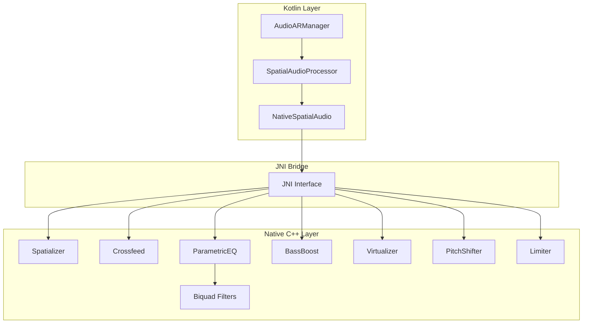
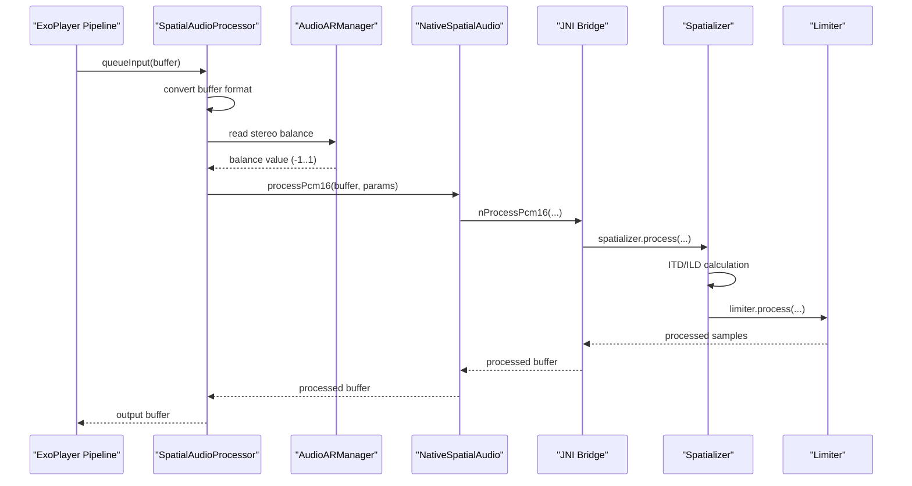
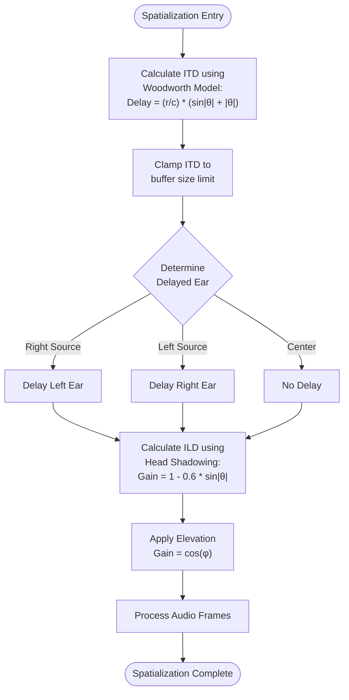
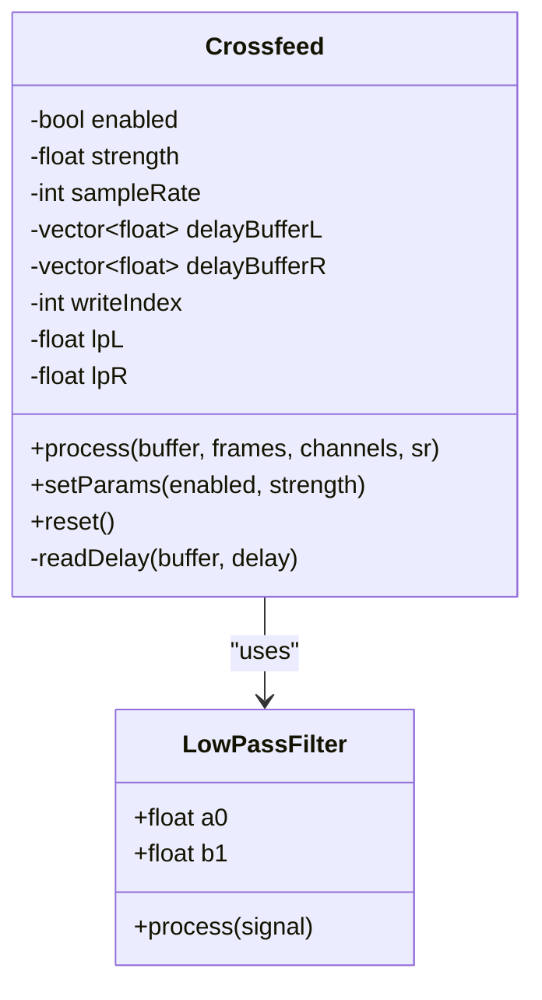
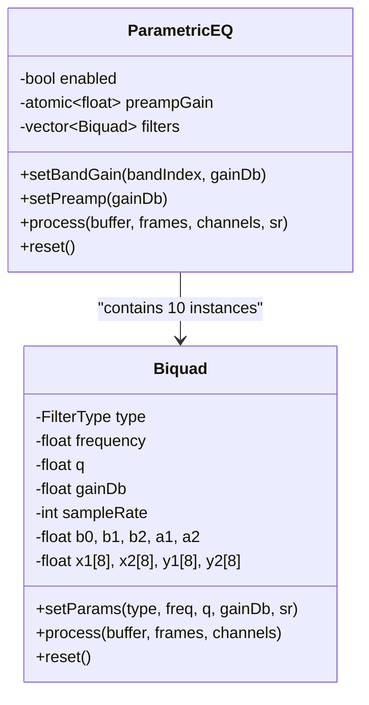
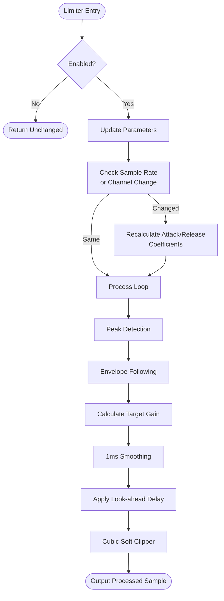
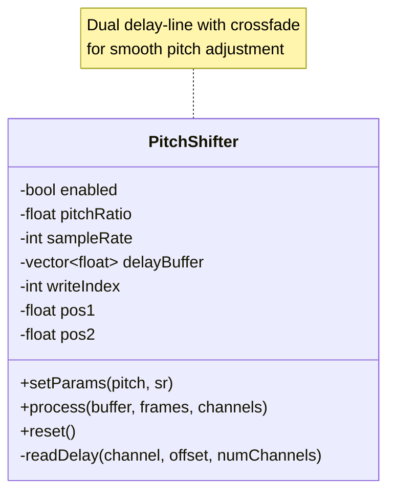
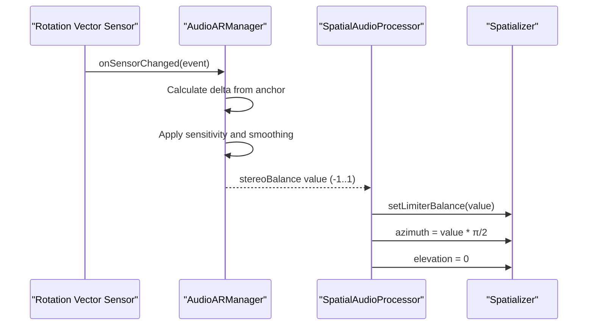
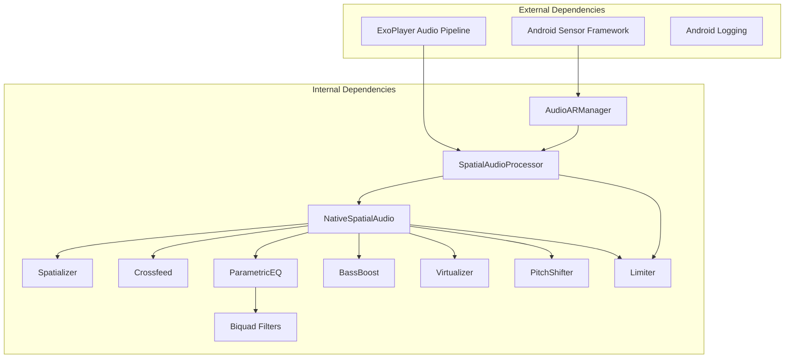

# Spatial Audio Processing

<cite>
**Referenced Files in This Document**
- [spatial_audio.cpp](file://app/src/main/cpp/spatial_audio.cpp)
- [SpatialAudioProcessor.kt](file://app/src/main/java/com/suvojeet/suvmusic/player/SpatialAudioProcessor.kt)
- [NativeSpatialAudio.kt](file://app/src/main/java/com/suvojeet/suvmusic/player/NativeSpatialAudio.kt)
- [AudioARManager.kt](file://app/src/main/java/com/suvojeet/suvmusic/player/AudioARManager.kt)
- [biquad.h](file://app/src/main/cpp/biquad.h)
- [limiter.h](file://app/src/main/cpp/limiter.h)
- [limiter.cpp](file://app/src/main/cpp/limiter.cpp)
- [pitch_shifter.h](file://app/src/main/cpp/pitch_shifter.h)
- [CMakeLists.txt](file://app/src/main/cpp/CMakeLists.txt)
</cite>

## Table of Contents
1. [Introduction](#introduction)
2. [Project Structure](#project-structure)
3. [Core Components](#core-components)
4. [Architecture Overview](#architecture-overview)
5. [Detailed Component Analysis](#detailed-component-analysis)
6. [Dependency Analysis](#dependency-analysis)
7. [Performance Considerations](#performance-considerations)
8. [Troubleshooting Guide](#troubleshooting-guide)
9. [Conclusion](#conclusion)

## Introduction
This document provides comprehensive technical documentation for the spatial audio processing subsystem in SuvMusic. The system implements real-time 3D audio positioning using interaural time differences (ITD) and interaural level differences (ILD) models, combined with advanced audio processing effects including parametric equalization, bass boost, crossfeed filtering, virtualization, pitch shifting, and limiting. The architecture features a clean separation between Kotlin-based audio pipeline management and high-performance native C++ processing through JNI.

The spatial audio system integrates with Android's sensor framework to provide head-tracked audio positioning, enabling users to experience directional audio cues through their headphones. The implementation emphasizes computational efficiency, thread safety, and compatibility across diverse Android devices and audio hardware configurations.

## Project Structure
The spatial audio processing system spans both Kotlin and C++ layers within the Android application:

**Diagram sources**
- [SpatialAudioProcessor.kt:13-243](file://app/src/main/java/com/suvojeet/suvmusic/player/SpatialAudioProcessor.kt#L13-L243)
- [NativeSpatialAudio.kt:9-158](file://app/src/main/java/com/suvojeet/suvmusic/player/NativeSpatialAudio.kt#L9-L158)
- [spatial_audio.cpp:335-475](file://app/src/main/cpp/spatial_audio.cpp#L335-L475)

**Section sources**
- [CMakeLists.txt:1-23](file://app/src/main/cpp/CMakeLists.txt#L1-L23)
- [SpatialAudioProcessor.kt:1-243](file://app/src/main/java/com/suvojeet/suvmusic/player/SpatialAudioProcessor.kt#L1-L243)
- [NativeSpatialAudio.kt:1-158](file://app/src/main/java/com/suvojeet/suvmusic/player/NativeSpatialAudio.kt#L1-L158)

## Core Components

### Spatial Audio Processor (Kotlin)
The SpatialAudioProcessor serves as the primary interface between the ExoPlayer audio pipeline and the native spatial audio engine. It manages buffer conversion, effect state coordination, and real-time parameter updates.

Key responsibilities include:
- Buffer format conversion between PCM 16-bit and PCM float
- Real-time parameter management for spatial positioning and effects
- Integration with the AudioARManager for head-tracked positioning
- Thread-safe operation within the audio processing pipeline

### Native Spatial Audio Engine (C++)
The native engine implements the core spatial audio algorithms and audio processing effects. It provides high-performance processing through carefully optimized C++ implementations.

Core processing pipeline:
1. Crossfeed filtering for headphone listening comfort
2. Parametric equalization with 10-band configurable EQ
3. Bass boost enhancement
4. Virtualization widening effect
5. Pitch shifting for playback tempo modification
6. Spatialization using ITD/ILD models
7. Limiter for audio protection and loudness control

### Audio AR Manager (Kotlin)
The AudioARManager integrates with Android's sensor framework to provide head-tracked audio positioning. It processes rotation vector sensor data to calculate stereo balance values that simulate 3D audio positioning.

**Section sources**
- [SpatialAudioProcessor.kt:13-243](file://app/src/main/java/com/suvojeet/suvmusic/player/SpatialAudioProcessor.kt#L13-L243)
- [spatial_audio.cpp:16-104](file://app/src/main/cpp/spatial_audio.cpp#L16-L104)
- [AudioARManager.kt:24-191](file://app/src/main/java/com/suvojeet/suvmusic/player/AudioARManager.kt#L24-L191)

## Architecture Overview

**Diagram sources**
- [SpatialAudioProcessor.kt:127-241](file://app/src/main/java/com/suvojeet/suvmusic/player/SpatialAudioProcessor.kt#L127-L241)
- [NativeSpatialAudio.kt:28-52](file://app/src/main/java/com/suvojeet/suvmusic/player/NativeSpatialAudio.kt#L28-L52)
- [spatial_audio.cpp:347-393](file://app/src/main/cpp/spatial_audio.cpp#L347-L393)

The architecture follows a layered approach with clear separation of concerns:
- **Presentation Layer**: Kotlin processors handle Android-specific concerns
- **Bridge Layer**: JNI interface manages data marshaling between Java and C++
- **Processing Layer**: Native C++ implements high-performance audio algorithms
- **Sensor Integration**: Real-time head tracking for spatial positioning

## Detailed Component Analysis

### Spatialization Engine (ITD/ILD Implementation)

The spatialization engine implements a sophisticated 3D audio positioning system using two primary mechanisms:

#### Interaural Time Difference (ITD) Calculation
The system calculates precise timing differences between ears based on the source azimuth:

**Diagram sources**
- [spatial_audio.cpp:30-69](file://app/src/main/cpp/spatial_audio.cpp#L30-L69)

#### Interaural Level Difference (ILD) Modeling
The system simulates head shadowing effects using trigonometric functions to create realistic amplitude differences between ears based on source azimuth.

#### Elevation Processing
Vertical positioning is handled through cosine-based attenuation, providing natural elevation cues without requiring complex 3D coordinate systems.

**Section sources**
- [spatial_audio.cpp:16-104](file://app/src/main/cpp/spatial_audio.cpp#L16-L104)

### Crossfeed Filtering System

Crossfeed filtering addresses the "empty-head" problem in headphone listening by mixing signals between ears:

**Diagram sources**
- [spatial_audio.cpp:106-204](file://app/src/main/cpp/spatial_audio.cpp#L106-L204)

The crossfeed system implements:
- **300-microsecond delay**: Standard for crossfeed applications
- **First-order low-pass filtering**: ~700Hz cutoff for natural sound
- **Adaptive strength control**: 0-1 range with safety clamping
- **Stereo-to-stereo processing**: Maintains compatibility with existing stereo streams

**Section sources**
- [spatial_audio.cpp:106-204](file://app/src/main/cpp/spatial_audio.cpp#L106-L204)

### Parametric Equalization System

The system provides professional-grade 10-band parametric equalization:

**Diagram sources**
- [spatial_audio.cpp:206-270](file://app/src/main/cpp/spatial_audio.cpp#L206-L270)
- [biquad.h:17-125](file://app/src/main/cpp/biquad.h#L17-L125)

Frequency bands follow ISO standards: 31Hz, 62Hz, 125Hz, 250Hz, 500Hz, 1kHz, 2kHz, 4kHz, 8kHz, 16kHz with Butterworth Q-factors.

**Section sources**
- [spatial_audio.cpp:206-270](file://app/src/main/cpp/spatial_audio.cpp#L206-L270)
- [biquad.h:17-125](file://app/src/main/cpp/biquad.h#L17-L125)

### Limiter System

The limiter provides comprehensive audio protection with advanced features:

**Diagram sources**
- [limiter.cpp:25-144](file://app/src/main/cpp/limiter.cpp#L25-L144)

Advanced features include:
- **Look-ahead processing**: 5ms delay for smooth transient handling
- **Adaptive attack/release**: Automatic coefficient calculation based on sample rate
- **Stereo balance integration**: Dynamic gain adjustment based on spatial positioning
- **Soft limiting**: Cubic polynomial shaping for transparent limiting
- **Thread-safe atomic operations**: Safe parameter updates during processing

**Section sources**
- [limiter.h:10-51](file://app/src/main/cpp/limiter.h#L10-L51)
- [limiter.cpp:1-163](file://app/src/main/cpp/limiter.cpp#L1-L163)

### Pitch Shifting System

The pitch shifter implements a dual-delay-line technique with triangular crossfading:

**Diagram sources**
- [pitch_shifter.h:14-109](file://app/src/main/cpp/pitch_shifter.h#L14-L109)

**Section sources**
- [pitch_shifter.h:14-109](file://app/src/main/cpp/pitch_shifter.h#L14-L109)

### AudioARManager Integration

The AudioARManager coordinates with the spatial audio system through real-time sensor data:

**Diagram sources**
- [AudioARManager.kt:134-185](file://app/src/main/java/com/suvojeet/suvmusic/player/AudioARManager.kt#L134-L185)
- [SpatialAudioProcessor.kt:202-211](file://app/src/main/java/com/suvojeet/suvmusic/player/SpatialAudioProcessor.kt#L202-L211)

**Section sources**
- [AudioARManager.kt:24-191](file://app/src/main/java/com/suvojeet/suvmusic/player/AudioARManager.kt#L24-L191)
- [SpatialAudioProcessor.kt:13-243](file://app/src/main/java/com/suvojeet/suvmusic/player/SpatialAudioProcessor.kt#L13-L243)

## Dependency Analysis

**Diagram sources**
- [SpatialAudioProcessor.kt:13-243](file://app/src/main/java/com/suvojeet/suvmusic/player/SpatialAudioProcessor.kt#L13-L243)
- [NativeSpatialAudio.kt:9-158](file://app/src/main/java/com/suvojeet/suvmusic/player/NativeSpatialAudio.kt#L9-L158)
- [AudioARManager.kt:29-191](file://app/src/main/java/com/suvojeet/suvmusic/player/AudioARManager.kt#L29-L191)

The dependency graph reveals a clean separation where:
- **Kotlin components** handle Android-specific concerns and pipeline integration
- **Native components** focus on computationally intensive audio processing
- **Sensor integration** provides real-time positioning data
- **No circular dependencies** exist between major subsystems

**Section sources**
- [spatial_audio.cpp:335-475](file://app/src/main/cpp/spatial_audio.cpp#L335-L475)
- [CMakeLists.txt:8-19](file://app/src/main/cpp/CMakeLists.txt#L8-L19)

## Performance Considerations

### Memory Management
The system employs several strategies to minimize memory allocations during real-time processing:

- **Pre-allocated buffers**: All processing buffers are allocated once and reused
- **Direct ByteBuffer usage**: JNI calls use direct buffers to avoid extra copying
- **Atomic operations**: Parameter updates use atomic types to avoid locks
- **Fixed-size arrays**: Critical loops use fixed-size arrays to prevent heap allocation

### Computational Efficiency
- **SIMD-friendly layouts**: Audio data is processed in interleaved formats for optimal cache usage
- **Early termination**: Disabled effects return immediately without processing overhead
- **Parameter caching**: Frequently accessed parameters are cached locally during processing
- **Optimized algorithms**: All mathematical operations use efficient approximations where safe

### Thread Safety
- **Mutex protection**: Critical sections use fine-grained mutexes for parameter updates
- **Atomic state**: Effect enable/disable states use atomic operations
- **Lock-free design**: Most parameter updates avoid locks using atomic types
- **Pipeline safety**: ExoPlayer ensures single-threaded processing within the audio pipeline

### Hardware Compatibility
- **Sample rate adaptation**: All filters and algorithms adapt to runtime sample rates
- **Channel count flexibility**: Processing handles mono, stereo, and up to 8-channel inputs
- **Memory-mapped I/O**: File processing uses efficient memory mapping for large files
- **Android 15+ optimization**: Linker options enable 16KB page size support for newer Android versions

**Section sources**
- [spatial_audio.cpp:342-346](file://app/src/main/cpp/spatial_audio.cpp#L342-L346)
- [SpatialAudioProcessor.kt:174-191](file://app/src/main/java/com/suvojeet/suvmusic/player/SpatialAudioProcessor.kt#L174-L191)
- [CMakeLists.txt:21-22](file://app/src/main/cpp/CMakeLists.txt#L21-L22)

## Troubleshooting Guide

### Common Issues and Solutions

#### JNI Library Loading Failures
**Symptoms**: Audio processing appears disabled or produces no output
**Causes**: Native library not loaded or incompatible architecture
**Solutions**:
- Verify library name matches compiled artifact
- Check device architecture compatibility
- Ensure proper initialization order

#### Buffer Format Errors
**Symptoms**: Audio artifacts or silence during processing
**Causes**: Unsupported audio encodings or invalid buffer parameters
**Solutions**:
- Verify input buffer contains valid PCM data
- Check channel count matches expected stereo format
- Ensure sample rate is within supported range

#### Sensor Integration Problems
**Symptoms**: Spatial positioning not responding to head movement
**Causes**: Sensor permissions, device compatibility, or processing errors
**Solutions**:
- Verify sensor availability on target device
- Check sensor permissions in manifest
- Monitor sensor accuracy callbacks

#### Performance Degradation
**Symptoms**: Audio dropouts or increased latency
**Causes**: Excessive effect processing or memory pressure
**Solutions**:
- Disable unused effects
- Reduce processing quality settings
- Monitor system resource usage

### Debugging Techniques

#### Log Analysis
The system provides comprehensive logging for troubleshooting:
- JNI boundary errors
- Buffer conversion failures  
- Sensor processing exceptions
- Parameter update conflicts

#### Performance Monitoring
- Track processing time per frame
- Monitor buffer utilization
- Observe effect bypass rates
- Analyze memory allocation patterns

**Section sources**
- [NativeSpatialAudio.kt:13-23](file://app/src/main/java/com/suvojeet/suvmusic/player/NativeSpatialAudio.kt#L13-L23)
- [SpatialAudioProcessor.kt:186-189](file://app/src/main/java/com/suvojeet/suvmusic/player/SpatialAudioProcessor.kt#L186-L189)
- [AudioARManager.kt:187-189](file://app/src/main/java/com/suvojeet/suvmusic/player/AudioARManager.kt#L187-L189)

## Conclusion

The SuvMusic spatial audio processing subsystem demonstrates a sophisticated approach to real-time 3D audio reproduction on mobile platforms. The system successfully combines mathematical precision in ITD/ILD modeling with robust audio processing capabilities, all while maintaining excellent performance characteristics suitable for mobile devices.

Key achievements include:
- **Mathematical Accuracy**: Implementation of the Woodworth ITD model with proper head-related transfer function considerations
- **Professional Features**: Comprehensive audio processing suite including parametric EQ, crossfeed, bass boost, and limiting
- **Real-time Performance**: Optimized C++ implementations with careful memory management and thread safety
- **User Experience**: Seamless integration with Android sensors for intuitive head-tracked positioning
- **Hardware Compatibility**: Broad support for various Android devices and audio configurations

The modular architecture enables easy extension and maintenance, while the clear separation between Kotlin and native layers provides flexibility for future enhancements. The system serves as a solid foundation for advanced audio applications on Android, balancing computational efficiency with audio quality.