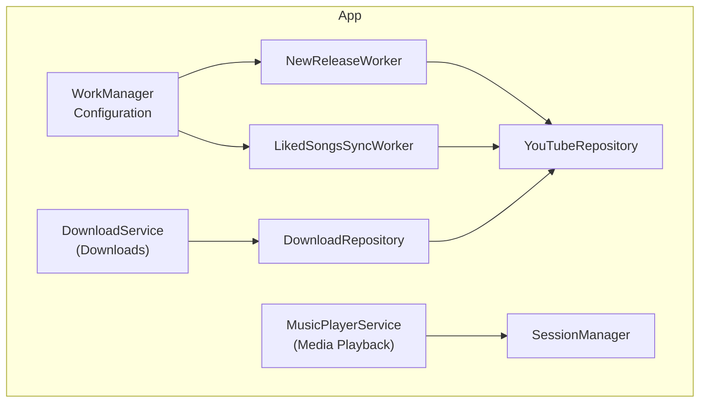
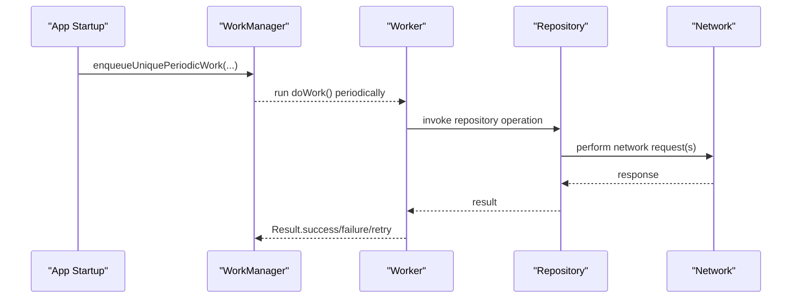
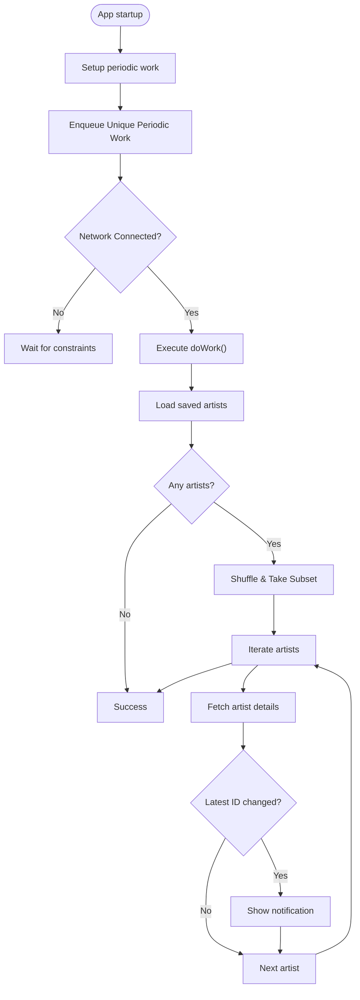
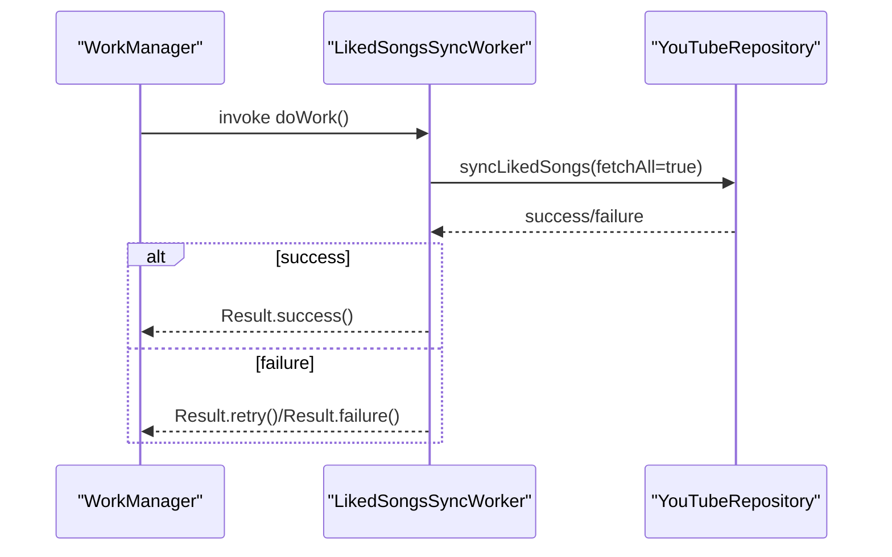
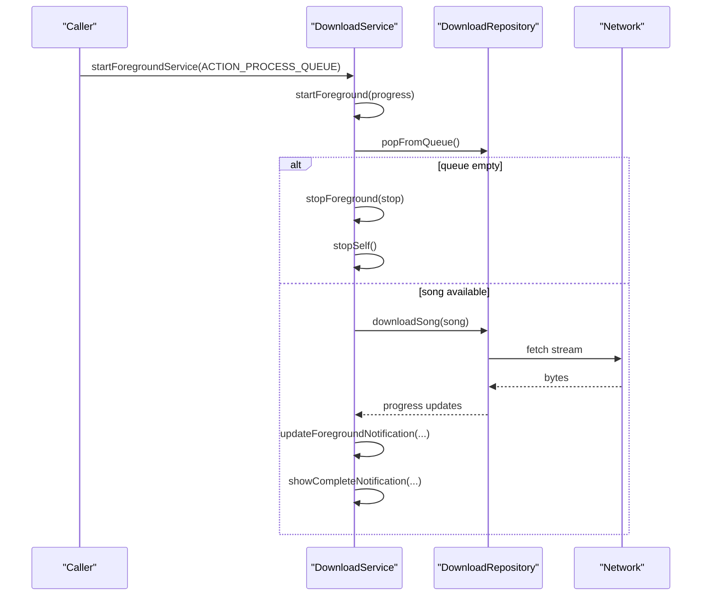
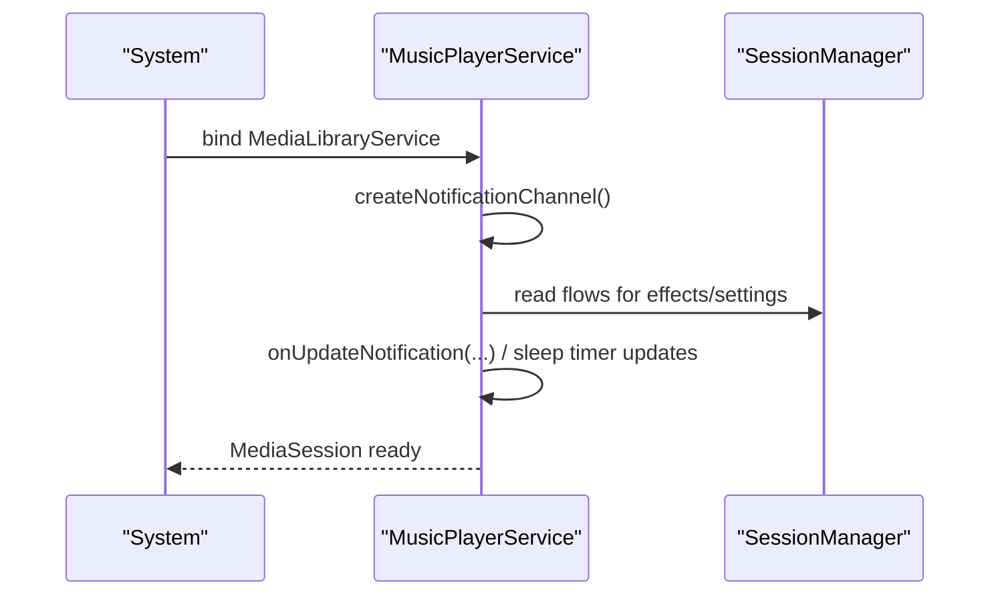
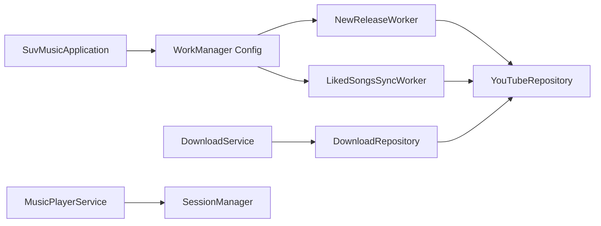

# Background Processing

<cite>
**Referenced Files in This Document**
- [SuvMusicApplication.kt](file://app/src/main/java/com/suvojeet/suvmusic/SuvMusicApplication.kt)
- [NewReleaseWorker.kt](file://app/src/main/java/com/suvojeet/suvmusic/workers/NewReleaseWorker.kt)
- [LikedSongsSyncWorker.kt](file://app/src/main/java/com/suvojeet/suvmusic/data/worker/LikedSongsSyncWorker.kt)
- [DownloadService.kt](file://app/src/main/java/com/suvojeet/suvmusic/service/DownloadService.kt)
- [MusicPlayerService.kt](file://app/src/main/java/com/suvojeet/suvmusic/service/MusicPlayerService.kt)
- [DownloadRepository.kt](file://app/src/main/java/com/suvojeet/suvmusic/data/repository/DownloadRepository.kt)
- [YouTubeRepository.kt](file://app/src/main/java/com/suvojeet/suvmusic/data/repository/YouTubeRepository.kt)
- [AndroidManifest.xml](file://app/src/main/AndroidManifest.xml)
- [SessionManager.kt](file://app/src/main/java/com/suvojeet/suvmusic/data/SessionManager.kt)
</cite>

## Table of Contents
1. [Introduction](#introduction)
2. [Project Structure](#project-structure)
3. [Core Components](#core-components)
4. [Architecture Overview](#architecture-overview)
5. [Detailed Component Analysis](#detailed-component-analysis)
6. [Dependency Analysis](#dependency-analysis)
7. [Performance Considerations](#performance-considerations)
8. [Troubleshooting Guide](#troubleshooting-guide)
9. [Conclusion](#conclusion)

## Introduction
This document explains SuvMusic’s background processing architecture with a focus on WorkManager-based periodic tasks and foreground services for long-running operations. It covers:
- Periodic tasks for new release notifications
- Data synchronization for liked songs
- Background downloads with user-visible progress and completion notifications
- Foreground service integration with Android’s background execution limits and battery optimization features
- Task scheduling, retry, and failure handling strategies
- Resource management and user control over background activities

## Project Structure
SuvMusic organizes background capabilities across:
- Application-level WorkManager configuration and periodic work scheduling
- Workers for periodic tasks and data synchronization
- Foreground services for media playback and downloads
- Repositories coordinating network requests and persistence
- Manifest declarations enabling foreground services and permissions

**Diagram sources**
- [SuvMusicApplication.kt:84-87](file://app/src/main/java/com/suvojeet/suvmusic/SuvMusicApplication.kt#L84-L87)
- [NewReleaseWorker.kt:21-27](file://app/src/main/java/com/suvojeet/suvmusic/workers/NewReleaseWorker.kt#L21-L27)
- [LikedSongsSyncWorker.kt:11-16](file://app/src/main/java/com/suvojeet/suvmusic/data/worker/LikedSongsSyncWorker.kt#L11-L16)
- [DownloadService.kt:32-94](file://app/src/main/java/com/suvojeet/suvmusic/service/DownloadService.kt#L32-L94)
- [MusicPlayerService.kt:50-90](file://app/src/main/java/com/suvojeet/suvmusic/service/MusicPlayerService.kt#L50-L90)
- [DownloadRepository.kt:40-46](file://app/src/main/java/com/suvojeet/suvmusic/data/repository/DownloadRepository.kt#L40-L46)
- [YouTubeRepository.kt:52-62](file://app/src/main/java/com/suvojeet/suvmusic/data/repository/YouTubeRepository.kt#L52-L62)
- [SessionManager.kt:63-65](file://app/src/main/java/com/suvojeet/suvmusic/data/SessionManager.kt#L63-L65)

**Section sources**
- [SuvMusicApplication.kt:111-127](file://app/src/main/java/com/suvojeet/suvmusic/SuvMusicApplication.kt#L111-L127)
- [AndroidManifest.xml:157-179](file://app/src/main/AndroidManifest.xml#L157-L179)

## Core Components
- WorkManager configuration and periodic work scheduling
- NewReleaseWorker: periodic check for new albums/singles for followed artists
- LikedSongsSyncWorker: sync liked songs with YouTube Music
- DownloadService: foreground service for batch downloads with progress and completion notifications
- MusicPlayerService: foreground service for media playback with ongoing notifications
- DownloadRepository and YouTubeRepository: orchestrate network calls and persistence
- SessionManager: stores user preferences affecting background behavior

**Section sources**
- [SuvMusicApplication.kt:84-87](file://app/src/main/java/com/suvojeet/suvmusic/SuvMusicApplication.kt#L84-L87)
- [NewReleaseWorker.kt:29-78](file://app/src/main/java/com/suvojeet/suvmusic/workers/NewReleaseWorker.kt#L29-L78)
- [LikedSongsSyncWorker.kt:18-33](file://app/src/main/java/com/suvojeet/suvmusic/data/worker/LikedSongsSyncWorker.kt#L18-L33)
- [DownloadService.kt:164-211](file://app/src/main/java/com/suvojeet/suvmusic/service/DownloadService.kt#L164-L211)
- [MusicPlayerService.kt:187-191](file://app/src/main/java/com/suvojeet/suvmusic/service/MusicPlayerService.kt#L187-L191)
- [DownloadRepository.kt:771-800](file://app/src/main/java/com/suvojeet/suvmusic/data/repository/DownloadRepository.kt#L771-L800)
- [YouTubeRepository.kt:763-800](file://app/src/main/java/com/suvojeet/suvmusic/data/repository/YouTubeRepository.kt#L763-L800)
- [SessionManager.kt:418-430](file://app/src/main/java/com/suvojeet/suvmusic/data/SessionManager.kt#L418-L430)

## Architecture Overview
SuvMusic uses WorkManager for periodic tasks and foreground services for long-running operations. WorkManager enqueues periodic work with constraints (e.g., connected network). Foreground services are declared in the manifest with appropriate foregroundServiceType attributes and start with a persistent notification.

**Diagram sources**
- [SuvMusicApplication.kt:111-127](file://app/src/main/java/com/suvojeet/suvmusic/SuvMusicApplication.kt#L111-L127)
- [NewReleaseWorker.kt:29-78](file://app/src/main/java/com/suvojeet/suvmusic/workers/NewReleaseWorker.kt#L29-L78)
- [LikedSongsSyncWorker.kt:18-33](file://app/src/main/java/com/suvojeet/suvmusic/data/worker/LikedSongsSyncWorker.kt#L18-L33)
- [YouTubeRepository.kt:763-800](file://app/src/main/java/com/suvojeet/suvmusic/data/repository/YouTubeRepository.kt#L763-L800)

## Detailed Component Analysis

### WorkManager Configuration and Periodic Tasks
- WorkManager is configured at the application level with a Hilt WorkerFactory.
- A periodic work named “NewReleaseCheck” runs every 12 hours with a network constraint.
- The worker queries followed artists, shuffles a subset, and compares latest album IDs to detect new releases, notifying the user when changes are found.

**Diagram sources**
- [SuvMusicApplication.kt:111-127](file://app/src/main/java/com/suvojeet/suvmusic/SuvMusicApplication.kt#L111-L127)
- [NewReleaseWorker.kt:29-78](file://app/src/main/java/com/suvojeet/suvmusic/workers/NewReleaseWorker.kt#L29-L78)

**Section sources**
- [SuvMusicApplication.kt:84-87](file://app/src/main/java/com/suvojeet/suvmusic/SuvMusicApplication.kt#L84-L87)
- [SuvMusicApplication.kt:111-127](file://app/src/main/java/com/suvojeet/suvmusic/SuvMusicApplication.kt#L111-L127)
- [NewReleaseWorker.kt:29-78](file://app/src/main/java/com/suvojeet/suvmusic/workers/NewReleaseWorker.kt#L29-L78)

### Liked Songs Sync Worker
- A CoroutineWorker performs a full sync of liked songs when triggered.
- Returns success on completion, retry on transient failures, and failure for unrecoverable errors.

**Diagram sources**
- [LikedSongsSyncWorker.kt:18-33](file://app/src/main/java/com/suvojeet/suvmusic/data/worker/LikedSongsSyncWorker.kt#L18-L33)
- [YouTubeRepository.kt:763-800](file://app/src/main/java/com/suvojeet/suvmusic/data/repository/YouTubeRepository.kt#L763-L800)

**Section sources**
- [LikedSongsSyncWorker.kt:18-33](file://app/src/main/java/com/suvojeet/suvmusic/data/worker/LikedSongsSyncWorker.kt#L18-L33)
- [YouTubeRepository.kt:763-800](file://app/src/main/java/com/suvojeet/suvmusic/data/repository/YouTubeRepository.kt#L763-L800)

### Download Service (Foreground)
- Foreground service for batch downloads with immediate startForeground to satisfy Android 12+ restrictions.
- Observes repository progress and updates a foreground notification with current song, progress, and batch totals.
- On completion, posts a separate notification indicating success or failure.
- Supports cancel per song via repository.

**Diagram sources**
- [DownloadService.kt:118-144](file://app/src/main/java/com/suvojeet/suvmusic/service/DownloadService.kt#L118-L144)
- [DownloadService.kt:164-211](file://app/src/main/java/com/suvojeet/suvmusic/service/DownloadService.kt#L164-L211)
- [DownloadService.kt:236-261](file://app/src/main/java/com/suvojeet/suvmusic/service/DownloadService.kt#L236-L261)
- [DownloadService.kt:276-297](file://app/src/main/java/com/suvojeet/suvmusic/service/DownloadService.kt#L276-L297)
- [DownloadRepository.kt:771-800](file://app/src/main/java/com/suvojeet/suvmusic/data/repository/DownloadRepository.kt#L771-L800)

**Section sources**
- [DownloadService.kt:118-144](file://app/src/main/java/com/suvojeet/suvmusic/service/DownloadService.kt#L118-L144)
- [DownloadService.kt:164-211](file://app/src/main/java/com/suvojeet/suvmusic/service/DownloadService.kt#L164-L211)
- [DownloadService.kt:236-261](file://app/src/main/java/com/suvojeet/suvmusic/service/DownloadService.kt#L236-L261)
- [DownloadService.kt:276-297](file://app/src/main/java/com/suvojeet/suvmusic/service/DownloadService.kt#L276-L297)
- [DownloadRepository.kt:771-800](file://app/src/main/java/com/suvojeet/suvmusic/data/repository/DownloadRepository.kt#L771-L800)

### Music Player Service (Foreground)
- Declared in the manifest with foregroundServiceType mediaPlayback.
- Creates a low-importance notification channel and updates ongoing playback notifications.
- Includes a sleep timer notification managed via a dedicated channel and flow.

**Diagram sources**
- [AndroidManifest.xml:157-167](file://app/src/main/AndroidManifest.xml#L157-L167)
- [MusicPlayerService.kt:187-191](file://app/src/main/java/com/suvojeet/suvmusic/service/MusicPlayerService.kt#L187-L191)
- [MusicPlayerService.kt:1575-1598](file://app/src/main/java/com/suvojeet/suvmusic/service/MusicPlayerService.kt#L1575-L1598)
- [SessionManager.kt:63-65](file://app/src/main/java/com/suvojeet/suvmusic/data/SessionManager.kt#L63-L65)

**Section sources**
- [AndroidManifest.xml:157-167](file://app/src/main/AndroidManifest.xml#L157-L167)
- [MusicPlayerService.kt:187-191](file://app/src/main/java/com/suvojeet/suvmusic/service/MusicPlayerService.kt#L187-L191)
- [MusicPlayerService.kt:1575-1598](file://app/src/main/java/com/suvojeet/suvmusic/service/MusicPlayerService.kt#L1575-L1598)
- [SessionManager.kt:63-65](file://app/src/main/java/com/suvojeet/suvmusic/data/SessionManager.kt#L63-L65)

## Dependency Analysis
- Application-level WorkManager configuration delegates worker instantiation to Hilt.
- Workers depend on repositories for network operations.
- DownloadService depends on DownloadRepository for queue management and progress.
- MusicPlayerService depends on SessionManager for runtime settings and on repositories for playback-related data.

**Diagram sources**
- [SuvMusicApplication.kt:84-87](file://app/src/main/java/com/suvojeet/suvmusic/SuvMusicApplication.kt#L84-L87)
- [NewReleaseWorker.kt:25-26](file://app/src/main/java/com/suvojeet/suvmusic/workers/NewReleaseWorker.kt#L25-L26)
- [LikedSongsSyncWorker.kt:15](file://app/src/main/java/com/suvojeet/suvmusic/data/worker/LikedSongsSyncWorker.kt#L15)
- [DownloadService.kt:96-97](file://app/src/main/java/com/suvojeet/suvmusic/service/DownloadService.kt#L96-L97)
- [DownloadRepository.kt:40-46](file://app/src/main/java/com/suvojeet/suvmusic/data/repository/DownloadRepository.kt#L40-L46)
- [MusicPlayerService.kt:53-88](file://app/src/main/java/com/suvojeet/suvmusic/service/MusicPlayerService.kt#L53-L88)
- [SessionManager.kt:63-65](file://app/src/main/java/com/suvojeet/suvmusic/data/SessionManager.kt#L63-L65)

**Section sources**
- [SuvMusicApplication.kt:84-87](file://app/src/main/java/com/suvojeet/suvmusic/SuvMusicApplication.kt#L84-L87)
- [NewReleaseWorker.kt:25-26](file://app/src/main/java/com/suvojeet/suvmusic/workers/NewReleaseWorker.kt#L25-L26)
- [LikedSongsSyncWorker.kt:15](file://app/src/main/java/com/suvojeet/suvmusic/data/worker/LikedSongsSyncWorker.kt#L15)
- [DownloadService.kt:96-97](file://app/src/main/java/com/suvojeet/suvmusic/service/DownloadService.kt#L96-L97)
- [DownloadRepository.kt:40-46](file://app/src/main/java/com/suvojeet/suvmusic/data/repository/DownloadRepository.kt#L40-L46)
- [MusicPlayerService.kt:53-88](file://app/src/main/java/com/suvojeet/suvmusic/service/MusicPlayerService.kt#L53-L88)
- [SessionManager.kt:63-65](file://app/src/main/java/com/suvojeet/suvmusic/data/SessionManager.kt#L63-L65)

## Performance Considerations
- Network timeouts and retries are configured in repositories to balance reliability and responsiveness.
- Foreground services update notifications efficiently using progress bars and ongoing flags to minimize overhead.
- Media playback service applies audio effects and settings dynamically via flows, adjusting processor usage accordingly.
- Download batching tracks progress and updates notifications incrementally to reflect real-time status.

[No sources needed since this section provides general guidance]

## Troubleshooting Guide
- Foreground service did not start in time (Android 12+): DownloadService immediately calls startForeground upon receiving the start command to satisfy platform restrictions.
- Download cancellation: Cancel per song delegated to DownloadRepository to ensure proper job tracking and cleanup.
- Worker failures: NewReleaseWorker and LikedSongsSyncWorker return failure for unrecoverable errors and retry for transient failures; review logs for exceptions.
- Notifications not appearing: Verify notification channels are created and permissions granted; ensure the service remains in the foreground during operations.

**Section sources**
- [DownloadService.kt:118-121](file://app/src/main/java/com/suvojeet/suvmusic/service/DownloadService.kt#L118-L121)
- [DownloadService.kt:231-234](file://app/src/main/java/com/suvojeet/suvmusic/service/DownloadService.kt#L231-L234)
- [NewReleaseWorker.kt:74-77](file://app/src/main/java/com/suvojeet/suvmusic/workers/NewReleaseWorker.kt#L74-L77)
- [LikedSongsSyncWorker.kt:29-32](file://app/src/main/java/com/suvojeet/suvmusic/data/worker/LikedSongsSyncWorker.kt#L29-L32)

## Conclusion
SuvMusic’s background processing combines WorkManager for periodic tasks and foreground services for long-running downloads and media playback. Workers are constrained appropriately and return explicit results for success, retry, or failure. Foreground services maintain user visibility with progress and completion notifications, while repositories encapsulate network concerns and state. Users retain control via SessionManager preferences that influence background behavior, and the manifest declares the necessary foreground service types for compliance with Android’s background execution policies.