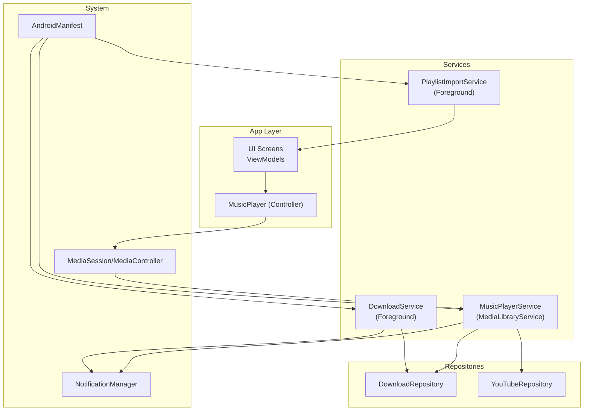
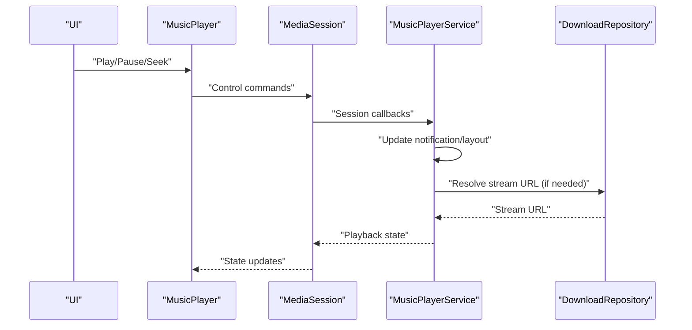
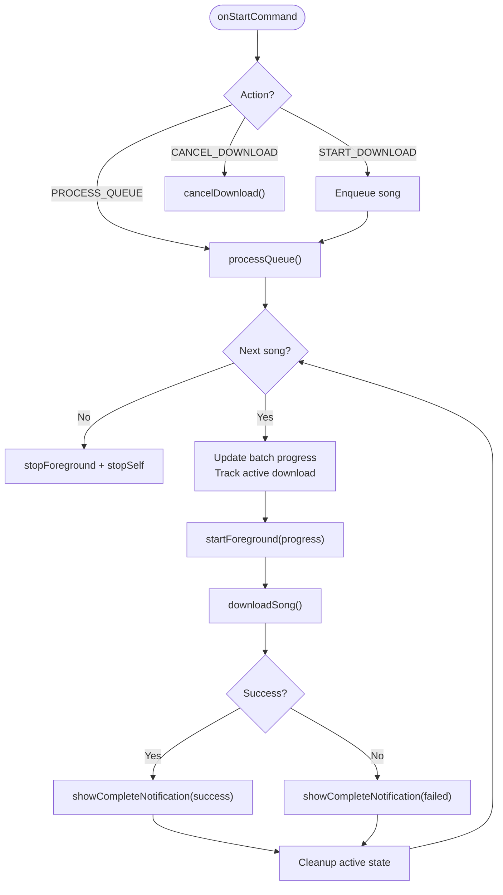
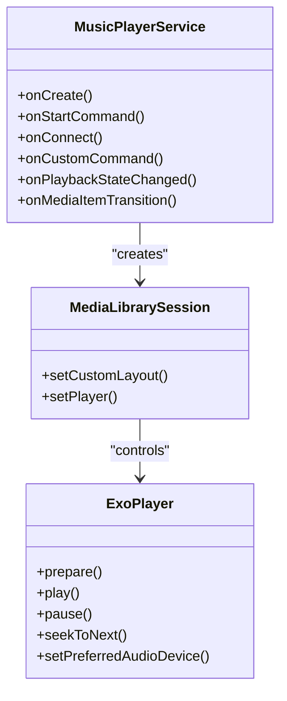
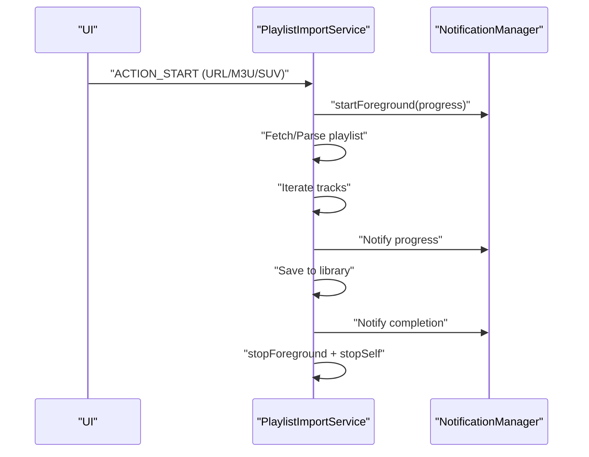
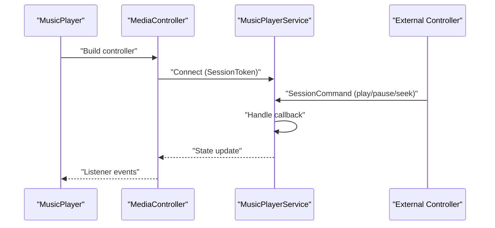
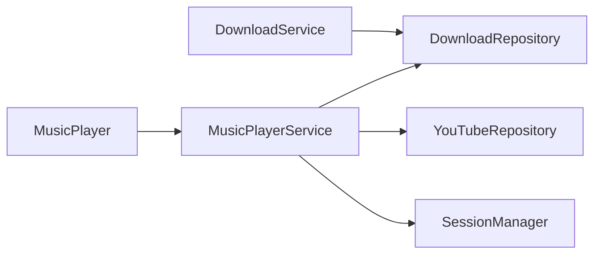

# Foreground Services

<cite>
**Referenced Files in This Document**
- [DownloadService.kt](file://app/src/main/java/com/suvojeet/suvmusic/service/DownloadService.kt)
- [MusicPlayerService.kt](file://app/src/main/java/com/suvojeet/suvmusic/service/MusicPlayerService.kt)
- [PlaylistImportService.kt](file://app/src/main/java/com/suvojeet/suvmusic/service/PlaylistImportService.kt)
- [DownloadRepository.kt](file://app/src/main/java/com/suvojeet/suvmusic/data/repository/DownloadRepository.kt)
- [YouTubeRepository.kt](file://app/src/main/java/com/suvojeet/suvmusic/data/repository/YouTubeRepository.kt)
- [MusicPlayer.kt](file://app/src/main/java/com/suvojeet/suvmusic/player/MusicPlayer.kt)
- [SessionManager.kt](file://app/src/main/java/com/suvojeet/suvmusic/data/SessionManager.kt)
- [AndroidManifest.xml](file://app/src/main/AndroidManifest.xml)
</cite>

## Table of Contents
1. [Introduction](#introduction)
2. [Project Structure](#project-structure)
3. [Core Components](#core-components)
4. [Architecture Overview](#architecture-overview)
5. [Detailed Component Analysis](#detailed-component-analysis)
6. [Dependency Analysis](#dependency-analysis)
7. [Performance Considerations](#performance-considerations)
8. [Troubleshooting Guide](#troubleshooting-guide)
9. [Conclusion](#conclusion)

## Introduction
This document explains SuvMusic’s foreground services implementation with a focus on:
- Long-running operations and user-visible notifications
- DownloadService architecture for managing download queues, progress tracking, and completion handling
- MusicPlayerService implementation for continuous playback, media session management, and system integration
- Service lifecycle management, notification creation and updates, and Android background execution limits compliance
- Inter-process communication, binding strategies, and service-to-UI communication patterns
- Performance considerations, battery optimization impact, and user control mechanisms

## Project Structure
The foreground services are implemented as Android Services with Media3 integration for playback and robust coroutine-driven orchestration for downloads. Key files:
- app/src/main/java/com/suvojeet/suvmusic/service/DownloadService.kt
- app/src/main/java/com/suvojeet/suvmusic/service/MusicPlayerService.kt
- app/src/main/java/com/suvojeet/suvmusic/service/PlaylistImportService.kt
- app/src/main/java/com/suvojeet/suvmusic/data/repository/DownloadRepository.kt
- app/src/main/java/com/suvojeet/suvmusic/data/repository/YouTubeRepository.kt
- app/src/main/java/com/suvojeet/suvmusic/player/MusicPlayer.kt
- app/src/main/java/com/suvojeet/suvmusic/data/SessionManager.kt
- app/src/main/AndroidManifest.xml

**Diagram sources**
- [MusicPlayerService.kt:50-160](file://app/src/main/java/com/suvojeet/suvmusic/service/MusicPlayerService.kt#L50-L160)
- [DownloadService.kt:32-120](file://app/src/main/java/com/suvojeet/suvmusic/service/DownloadService.kt#L32-L120)
- [PlaylistImportService.kt:41-90](file://app/src/main/java/com/suvojeet/suvmusic/service/PlaylistImportService.kt#L41-L90)
- [DownloadRepository.kt:39-97](file://app/src/main/java/com/suvojeet/suvmusic/data/repository/DownloadRepository.kt#L39-L97)
- [YouTubeRepository.kt:51-128](file://app/src/main/java/com/suvojeet/suvmusic/data/repository/YouTubeRepository.kt#L51-L128)
- [MusicPlayer.kt:478-500](file://app/src/main/java/com/suvojeet/suvmusic/player/MusicPlayer.kt#L478-L500)
- [AndroidManifest.xml:157-179](file://app/src/main/AndroidManifest.xml#L157-L179)

**Section sources**
- [AndroidManifest.xml:157-179](file://app/src/main/AndroidManifest.xml#L157-L179)

## Core Components
- DownloadService: Foreground service that manages a persistent download queue, emits progress notifications, and posts completion notifications. It delegates actual download work to DownloadRepository and uses coroutines for concurrency.
- MusicPlayerService: Media3 MediaLibraryService that exposes a MediaSession to the system, manages playback, integrates with Android Auto/External Controllers, and provides a custom notification provider.
- PlaylistImportService: Foreground service for importing playlists with progress and completion notifications.

Key responsibilities:
- Foreground service lifecycle and notification channels
- Queue processing and progress reporting
- Media session callbacks and command handling
- Background execution limits compliance
- Inter-process communication via Media3 sessions and explicit intents

**Section sources**
- [DownloadService.kt:32-120](file://app/src/main/java/com/suvojeet/suvmusic/service/DownloadService.kt#L32-L120)
- [MusicPlayerService.kt:50-160](file://app/src/main/java/com/suvojeet/suvmusic/service/MusicPlayerService.kt#L50-L160)
- [PlaylistImportService.kt:41-90](file://app/src/main/java/com/suvojeet/suvmusic/service/PlaylistImportService.kt#L41-L90)

## Architecture Overview
The services integrate with repositories and UI through reactive flows and Media3 sessions. MusicPlayerService builds an ExoPlayer with custom renderers and audio processors, and exposes commands for like/repeat/shuffle/radio and output device routing. DownloadService orchestrates batch downloads and updates notifications in real time.

**Diagram sources**
- [MusicPlayer.kt:478-500](file://app/src/main/java/com/suvojeet/suvmusic/player/MusicPlayer.kt#L478-L500)
- [MusicPlayerService.kt:629-720](file://app/src/main/java/com/suvojeet/suvmusic/service/MusicPlayerService.kt#L629-L720)
- [DownloadRepository.kt:771-800](file://app/src/main/java/com/suvojeet/suvmusic/data/repository/DownloadRepository.kt#L771-L800)

## Detailed Component Analysis

### DownloadService
- Purpose: Foreground service for background downloads with real-time progress and completion notifications.
- Lifecycle:
  - Creates a notification channel on startup
  - Immediately calls startForeground on onStartCommand to satisfy Android 12+ timing requirements
  - Processes a concurrent queue of songs, updating progress and completion notifications
- Queue Management:
  - Uses DownloadRepository to enqueue and dequeue songs
  - Tracks batch progress and per-song progress via flows
- Notifications:
  - Progress notification while downloading
  - Completion notification on finish (success/failure)
- Cancellation:
  - Delegates cancellation to DownloadRepository

**Diagram sources**
- [DownloadService.kt:118-211](file://app/src/main/java/com/suvojeet/suvmusic/service/DownloadService.kt#L118-L211)
- [DownloadService.kt:236-297](file://app/src/main/java/com/suvojeet/suvmusic/service/DownloadService.kt#L236-L297)
- [DownloadRepository.kt:79-97](file://app/src/main/java/com/suvojeet/suvmusic/data/repository/DownloadRepository.kt#L79-L97)

**Section sources**
- [DownloadService.kt:32-120](file://app/src/main/java/com/suvojeet/suvmusic/service/DownloadService.kt#L32-L120)
- [DownloadService.kt:164-211](file://app/src/main/java/com/suvojeet/suvmusic/service/DownloadService.kt#L164-L211)
- [DownloadService.kt:236-297](file://app/src/main/java/com/suvojeet/suvmusic/service/DownloadService.kt#L236-L297)
- [DownloadRepository.kt:79-97](file://app/src/main/java/com/suvojeet/suvmusic/data/repository/DownloadRepository.kt#L79-L97)

### MusicPlayerService
- Purpose: Media3 MediaLibraryService providing continuous playback, media session integration, and system-wide controls.
- MediaSession:
  - Provides custom commands (like/repeat/shuffle/start/stop radio)
  - Grants broad player/session commands to external controllers for Android Auto compatibility
  - Accepts SET_OUTPUT_DEVICE to route audio to Bluetooth/headphones/speaker
- Playback:
  - ExoPlayer with custom RenderersFactory and AudioSink
  - Dual-stream merging for video-only + audio-only sources
  - Gapless playback and fade-in on first ready
  - SponsorBlock monitoring and skip logic
- Notifications:
  - Custom MediaNotification provider
  - Channel created at service startup
- Audio routing:
  - Switches output device via Media3 custom command
  - Resets audio system mode and forces buffer flush for stability
  - Multi-step volume nudging for Bluetooth devices

**Diagram sources**
- [MusicPlayerService.kt:50-160](file://app/src/main/java/com/suvojeet/suvmusic/service/MusicPlayerService.kt#L50-L160)
- [MusicPlayerService.kt:629-720](file://app/src/main/java/com/suvojeet/suvmusic/service/MusicPlayerService.kt#L629-L720)
- [MusicPlayerService.kt:708-788](file://app/src/main/java/com/suvojeet/suvmusic/service/MusicPlayerService.kt#L708-L788)

**Section sources**
- [MusicPlayerService.kt:50-160](file://app/src/main/java/com/suvojeet/suvmusic/service/MusicPlayerService.kt#L50-L160)
- [MusicPlayerService.kt:629-720](file://app/src/main/java/com/suvojeet/suvmusic/service/MusicPlayerService.kt#L629-L720)
- [MusicPlayerService.kt:708-788](file://app/src/main/java/com/suvojeet/suvmusic/service/MusicPlayerService.kt#L708-L788)

### PlaylistImportService
- Purpose: Foreground service for importing playlists from URLs or files with progress and completion notifications.
- Lifecycle:
  - startForeground on import start
  - Updates ongoing progress notifications
  - Posts completion notification summarizing results
- Cancellation:
  - Supports cancel action to stop import gracefully

**Diagram sources**
- [PlaylistImportService.kt:68-87](file://app/src/main/java/com/suvojeet/suvmusic/service/PlaylistImportService.kt#L68-L87)
- [PlaylistImportService.kt:89-221](file://app/src/main/java/com/suvojeet/suvmusic/service/PlaylistImportService.kt#L89-L221)
- [PlaylistImportService.kt:230-270](file://app/src/main/java/com/suvojeet/suvmusic/service/PlaylistImportService.kt#L230-L270)

**Section sources**
- [PlaylistImportService.kt:41-90](file://app/src/main/java/com/suvojeet/suvmusic/service/PlaylistImportService.kt#L41-L90)
- [PlaylistImportService.kt:89-221](file://app/src/main/java/com/suvojeet/suvmusic/service/PlaylistImportService.kt#L89-L221)
- [PlaylistImportService.kt:230-270](file://app/src/main/java/com/suvojeet/suvmusic/service/PlaylistImportService.kt#L230-L270)

### Inter-Process Communication and Binding
- Media3 Integration:
  - MusicPlayerService extends MediaLibraryService and exposes a MediaSession
  - MusicPlayer constructs a MediaController bound to MusicPlayerService via SessionToken
  - External controllers (e.g., Android Auto, Wear OS) communicate via MediaSession commands
- Explicit Intents:
  - DownloadService and PlaylistImportService are started via explicit intents with actions and extras
- Commands:
  - Custom commands for like/repeat/shuffle/radio and output device routing
  - Media3 commands for standard playback controls

**Diagram sources**
- [MusicPlayer.kt:478-500](file://app/src/main/java/com/suvojeet/suvmusic/player/MusicPlayer.kt#L478-L500)
- [MusicPlayerService.kt:629-673](file://app/src/main/java/com/suvojeet/suvmusic/service/MusicPlayerService.kt#L629-L673)

**Section sources**
- [MusicPlayer.kt:478-500](file://app/src/main/java/com/suvojeet/suvmusic/player/MusicPlayer.kt#L478-L500)
- [MusicPlayerService.kt:629-673](file://app/src/main/java/com/suvojeet/suvmusic/service/MusicPlayerService.kt#L629-L673)

### Service-to-UI Communication Patterns
- Reactive Flows:
  - DownloadRepository exposes StateFlows for progress, queue state, and batch progress
  - MusicPlayerService updates MediaSession state; MusicPlayer listens via Player.Listener
- Notifications:
  - DownloadService and PlaylistImportService post ongoing notifications with progress
  - MusicPlayerService uses a custom MediaNotification provider for rich notifications

**Section sources**
- [DownloadRepository.kt:60-97](file://app/src/main/java/com/suvojeet/suvmusic/data/repository/DownloadRepository.kt#L60-L97)
- [MusicPlayer.kt:501-598](file://app/src/main/java/com/suvojeet/suvmusic/player/MusicPlayer.kt#L501-L598)
- [MusicPlayerService.kt:192-194](file://app/src/main/java/com/suvojeet/suvmusic/service/MusicPlayerService.kt#L192-L194)

## Dependency Analysis
- DownloadService depends on DownloadRepository for queue and progress flows, and uses coroutines for concurrency.
- MusicPlayerService depends on multiple repositories (YouTubeRepository, DownloadRepository) and SessionManager for runtime settings.
- MusicPlayer acts as a controller over Media3, translating UI actions into MediaSession commands.

**Diagram sources**
- [DownloadService.kt:96-100](file://app/src/main/java/com/suvojeet/suvmusic/service/DownloadService.kt#L96-L100)
- [MusicPlayerService.kt:53-89](file://app/src/main/java/com/suvojeet/suvmusic/service/MusicPlayerService.kt#L53-L89)
- [MusicPlayer.kt:58-72](file://app/src/main/java/com/suvojeet/suvmusic/player/MusicPlayer.kt#L58-L72)

**Section sources**
- [DownloadService.kt:96-100](file://app/src/main/java/com/suvojeet/suvmusic/service/DownloadService.kt#L96-L100)
- [MusicPlayerService.kt:53-89](file://app/src/main/java/com/suvojeet/suvmusic/service/MusicPlayerService.kt#L53-L89)
- [MusicPlayer.kt:58-72](file://app/src/main/java/com/suvojeet/suvmusic/player/MusicPlayer.kt#L58-L72)

## Performance Considerations
- Download throughput and reliability:
  - Uses OkHttp client with timeouts and redirects
  - Progress reporting via buffered copy with periodic updates
  - Mutex-based download gating prevents duplicate downloads
- Playback performance:
  - Audio offload disabled when spatial/audio effects are active to ensure processor usage
  - Fade-in on first ready mitigates “silent handshake” on audio sinks
  - Buffer tuning and back buffer size adjustments for seeking and gapless playback
- Battery and background execution:
  - Foreground services with appropriate foregroundServiceType
  - Wake locks used for network-based playback
  - Notifications keep services in foreground state to reduce termination risk

[No sources needed since this section provides general guidance]

## Troubleshooting Guide
- Foreground service start timing (Android 12+):
  - DownloadService immediately calls startForeground on onStartCommand to avoid ForegroundServiceDidNotStartInTimeException
- Audio routing issues:
  - MusicPlayerService resets audio mode to normal and clears preferred device before switching
  - Multi-step volume nudging and brief pause/play cycle to recover from routing glitches
- Playback errors:
  - Specific handling for AudioSink initialization/write failures with automatic recovery
  - On playback errors, skips to next item unless it is a placeholder URI (handled by resolution)
- Download failures:
  - Completion notifications indicate success/failure
  - Cancellation delegated to DownloadRepository

**Section sources**
- [DownloadService.kt:118-121](file://app/src/main/java/com/suvojeet/suvmusic/service/DownloadService.kt#L118-L121)
- [MusicPlayerService.kt:442-457](file://app/src/main/java/com/suvojeet/suvmusic/service/MusicPlayerService.kt#L442-L457)
- [MusicPlayerService.kt:708-788](file://app/src/main/java/com/suvojeet/suvmusic/service/MusicPlayerService.kt#L708-L788)
- [DownloadService.kt:276-297](file://app/src/main/java/com/suvojeet/suvmusic/service/DownloadService.kt#L276-L297)

## Conclusion
SuvMusic’s foreground services are built for reliability and user visibility:
- DownloadService provides robust queue management with real-time progress and completion feedback.
- MusicPlayerService delivers a polished, system-integrated playback experience with extensive customization and error resilience.
- PlaylistImportService supports large-scale playlist migrations with clear user feedback.
- The architecture leverages Media3, reactive flows, and careful foreground service lifecycle management to comply with Android background execution limits while maintaining excellent user experience.