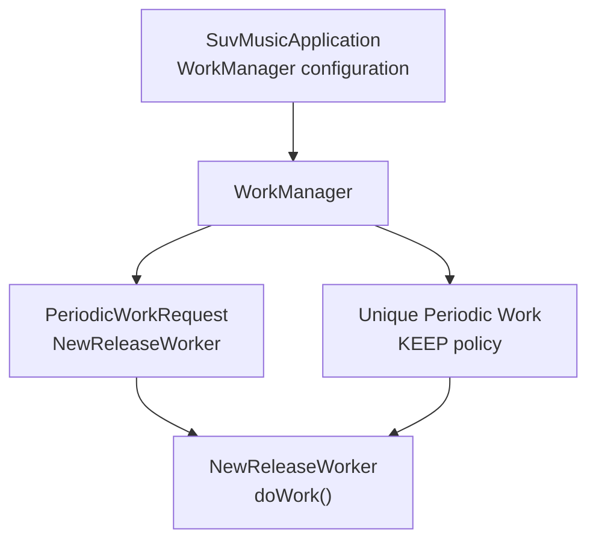
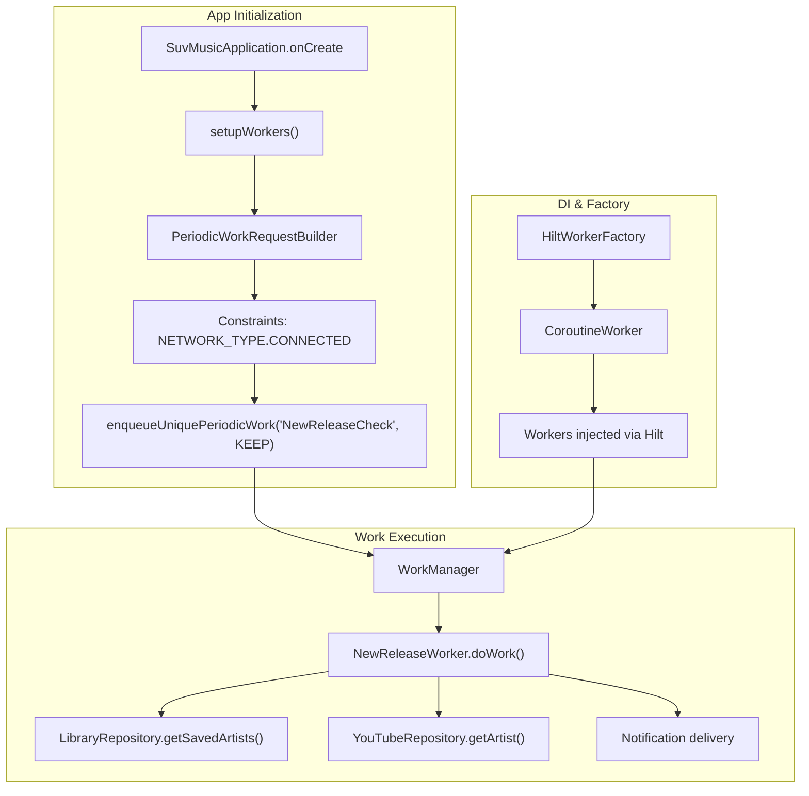
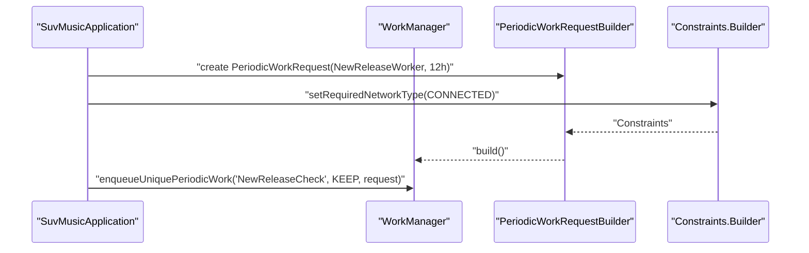
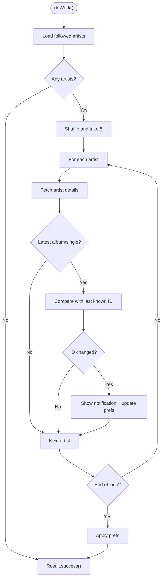
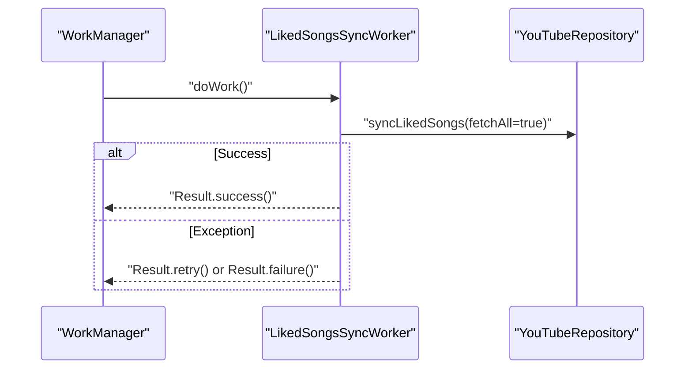
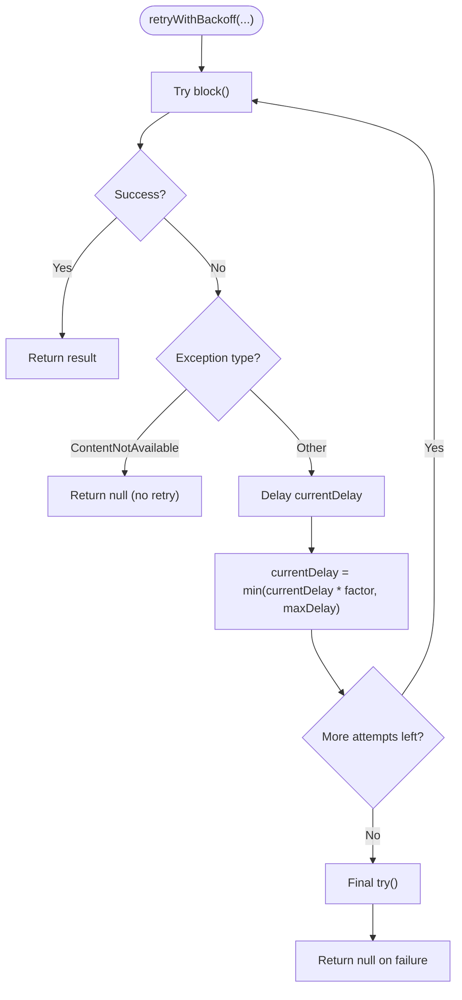
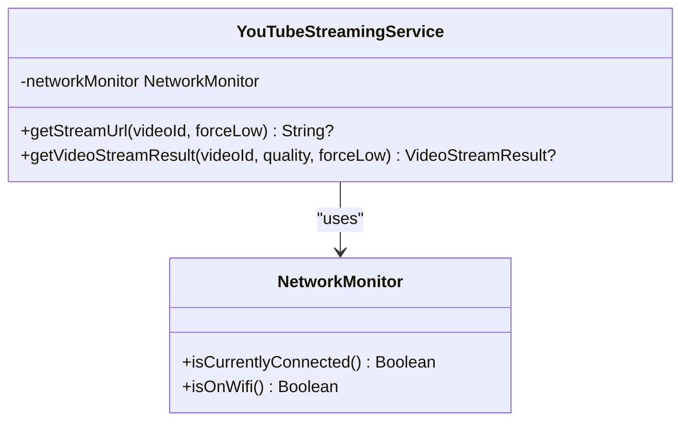
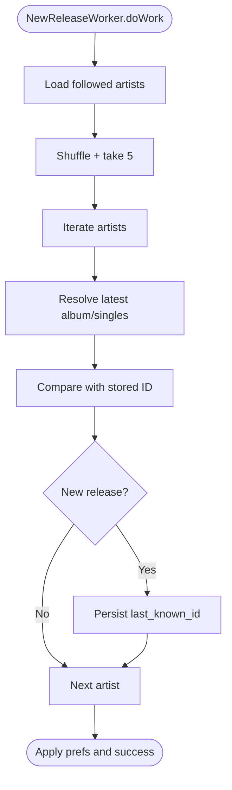
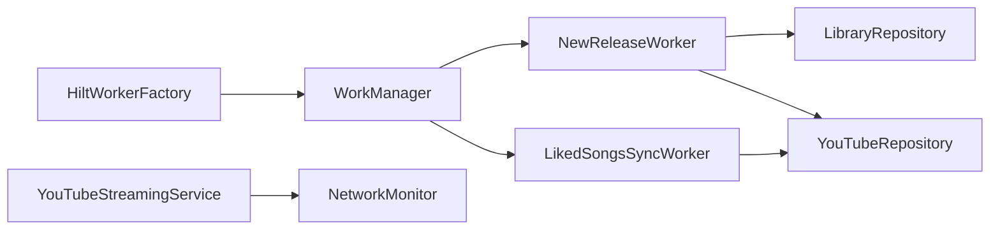

# Task Scheduling and Execution

<cite>
**Referenced Files in This Document**
- [SuvMusicApplication.kt](file://app/src/main/java/com/suvojeet/suvmusic/SuvMusicApplication.kt)
- [NewReleaseWorker.kt](file://app/src/main/java/com/suvojeet/suvmusic/workers/NewReleaseWorker.kt)
- [LikedSongsSyncWorker.kt](file://app/src/main/java/com/suvojeet/suvmusic/data/worker/LikedSongsSyncWorker.kt)
- [YouTubeStreamingService.kt](file://app/src/main/java/com/suvojeet/suvmusic/data/repository/youtube/streaming/YouTubeStreamingService.kt)
- [NetworkMonitor.kt](file://app/src/main/java/com/suvojeet/suvmusic/util/NetworkMonitor.kt)
- [AppModule.kt](file://app/src/main/java/com/suvojeet/suvmusic/di/AppModule.kt)
- [DownloadService.kt](file://app/src/main/java/com/suvojeet/suvmusic/service/DownloadService.kt)
- [UpdateDownloader.kt](file://updater/src/main/kotlin/com/zuvojeet/suvmusic/updater/UpdateDownloader.kt)
</cite>

## Table of Contents
1. [Introduction](#introduction)
2. [Project Structure](#project-structure)
3. [Core Components](#core-components)
4. [Architecture Overview](#architecture-overview)
5. [Detailed Component Analysis](#detailed-component-analysis)
6. [Dependency Analysis](#dependency-analysis)
7. [Performance Considerations](#performance-considerations)
8. [Troubleshooting Guide](#troubleshooting-guide)
9. [Conclusion](#conclusion)
10. [Appendices](#appendices)

## Introduction
This document explains SuvMusic’s task scheduling and execution model with a focus on WorkManager configuration, constraints, and execution strategies. It covers:
- Periodic tasks, one-time jobs, and maintenance work
- Retry mechanisms and exponential backoff
- Constraint types (network, charging, idle)
- Task prioritization, batching, and resource management
- Configuration examples, debugging, and monitoring approaches

## Project Structure
SuvMusic configures WorkManager at the application level and registers two workers:
- A periodic worker that checks for new releases from followed artists
- A worker that synchronizes liked songs from YouTube

**Diagram sources**
- [SuvMusicApplication.kt:111-127](file://app/src/main/java/com/suvojeet/suvmusic/SuvMusicApplication.kt#L111-L127)
- [NewReleaseWorker.kt:29-78](file://app/src/main/java/com/suvojeet/suvmusic/workers/NewReleaseWorker.kt#L29-L78)

**Section sources**
- [SuvMusicApplication.kt:84-87](file://app/src/main/java/com/suvojeet/suvmusic/SuvMusicApplication.kt#L84-L87)
- [SuvMusicApplication.kt:111-127](file://app/src/main/java/com/suvojeet/suvmusic/SuvMusicApplication.kt#L111-L127)

## Core Components
- WorkManager configuration provider in the application class
- Periodic work registration with constraints
- Worker implementations for release checks and liked songs sync
- Retry/backoff utilities for streaming operations
- Network monitoring for adaptive behavior

Key responsibilities:
- Application-level WorkManager setup and DI wiring
- Periodic maintenance work scheduling with network constraints
- Background work execution via Coroutines and Hilt
- Robust retry logic for network-dependent operations

**Section sources**
- [SuvMusicApplication.kt:32-87](file://app/src/main/java/com/suvojeet/suvmusic/SuvMusicApplication.kt#L32-L87)
- [AppModule.kt:160-165](file://app/src/main/java/com/suvojeet/suvmusic/di/AppModule.kt#L160-L165)
- [NewReleaseWorker.kt:22-27](file://app/src/main/java/com/suvojeet/suvmusic/workers/NewReleaseWorker.kt#L22-L27)
- [LikedSongsSyncWorker.kt:12-16](file://app/src/main/java/com/suvojeet/suvmusic/data/worker/LikedSongsSyncWorker.kt#L12-L16)

## Architecture Overview
The scheduling architecture centers around WorkManager with a Hilt-provided worker factory. Periodic maintenance runs under network constraints, while workers use Result.success/failure/retry semantics to manage outcomes.

**Diagram sources**
- [SuvMusicApplication.kt:111-127](file://app/src/main/java/com/suvojeet/suvmusic/SuvMusicApplication.kt#L111-L127)
- [NewReleaseWorker.kt:29-78](file://app/src/main/java/com/suvojeet/suvmusic/workers/NewReleaseWorker.kt#L29-L78)
- [SuvMusicApplication.kt:34-35](file://app/src/main/java/com/suvojeet/suvmusic/SuvMusicApplication.kt#L34-L35)

## Detailed Component Analysis

### WorkManager Configuration and Registration
- WorkManager is configured with a Hilt-based worker factory.
- A periodic work request schedules NewReleaseWorker every 12 hours with a network requirement.
- Unique periodic work is enqueued with KEEP policy to avoid duplication.

**Diagram sources**
- [SuvMusicApplication.kt:111-127](file://app/src/main/java/com/suvojeet/suvmusic/SuvMusicApplication.kt#L111-L127)

**Section sources**
- [SuvMusicApplication.kt:84-87](file://app/src/main/java/com/suvojeet/suvmusic/SuvMusicApplication.kt#L84-L87)
- [SuvMusicApplication.kt:111-127](file://app/src/main/java/com/suvojeet/suvmusic/SuvMusicApplication.kt#L111-L127)

### NewReleaseWorker: Periodic Maintenance
Responsibilities:
- Fetches followed artists and checks for new albums/singles.
- Uses a small random subset per cycle to limit bandwidth.
- Persists last-known release IDs and notifies on changes.
- Respects network constraints enforced by WorkManager.

**Diagram sources**
- [NewReleaseWorker.kt:29-78](file://app/src/main/java/com/suvojeet/suvmusic/workers/NewReleaseWorker.kt#L29-L78)

**Section sources**
- [NewReleaseWorker.kt:29-78](file://app/src/main/java/com/suvojeet/suvmusic/workers/NewReleaseWorker.kt#L29-L78)

### LikedSongsSyncWorker: One-time Job Pattern
Responsibilities:
- Performs a full sync of liked songs from YouTube.
- Returns success on completion, retry on transient failures, and failure on unrecoverable errors.

**Diagram sources**
- [LikedSongsSyncWorker.kt:18-33](file://app/src/main/java/com/suvojeet/suvmusic/data/worker/LikedSongsSyncWorker.kt#L18-L33)

**Section sources**
- [LikedSongsSyncWorker.kt:18-33](file://app/src/main/java/com/suvojeet/suvmusic/data/worker/LikedSongsSyncWorker.kt#L18-L33)

### Retry Mechanisms and Exponential Backoff
The streaming service implements a generic retry helper with exponential backoff and early exit conditions for unavailable content. This pattern is reused across multiple retrieval methods.

**Diagram sources**
- [YouTubeStreamingService.kt:37-64](file://app/src/main/java/com/suvojeet/suvmusic/data/repository/youtube/streaming/YouTubeStreamingService.kt#L37-L64)

**Section sources**
- [YouTubeStreamingService.kt:37-64](file://app/src/main/java/com/suvojeet/suvmusic/data/repository/youtube/streaming/YouTubeStreamingService.kt#L37-L64)

### Constraint Management
- Network availability: Periodic work requires a connected network.
- Charging and idle constraints: Not explicitly set in the provided code; defaults apply.
- Network monitoring: Used to adapt quality selection based on Wi-Fi availability.

**Diagram sources**
- [NetworkMonitor.kt:81-97](file://app/src/main/java/com/suvojeet/suvmusic/util/NetworkMonitor.kt#L81-L97)
- [YouTubeStreamingService.kt:20-27](file://app/src/main/java/com/suvojeet/suvmusic/data/repository/youtube/streaming/YouTubeStreamingService.kt#L20-L27)

**Section sources**
- [SuvMusicApplication.kt:115-119](file://app/src/main/java/com/suvojeet/suvmusic/SuvMusicApplication.kt#L115-L119)
- [NetworkMonitor.kt:81-97](file://app/src/main/java/com/suvojeet/suvmusic/util/NetworkMonitor.kt#L81-L97)
- [YouTubeStreamingService.kt:102-108](file://app/src/main/java/com/suvojeet/suvmusic/data/repository/youtube/streaming/YouTubeStreamingService.kt#L102-L108)

### Task Prioritization, Batch Processing, and Resource Management
- WorkManager prioritizes tasks based on constraints and system policies; explicit priority is not set in the provided code.
- Batch processing: NewReleaseWorker shuffles followed artists and limits checks to a small subset per run to reduce load.
- Resource management: Streaming service caches resolved URLs and adapts quality based on network conditions.

**Diagram sources**
- [NewReleaseWorker.kt:37-70](file://app/src/main/java/com/suvojeet/suvmusic/workers/NewReleaseWorker.kt#L37-L70)

**Section sources**
- [NewReleaseWorker.kt:37-70](file://app/src/main/java/com/suvojeet/suvmusic/workers/NewReleaseWorker.kt#L37-L70)
- [YouTubeStreamingService.kt:29-32](file://app/src/main/java/com/suvojeet/suvmusic/data/repository/youtube/streaming/YouTubeStreamingService.kt#L29-L32)

### Configuration Examples
- Periodic work with network constraint:
  - See [SuvMusicApplication.kt:111-127](file://app/src/main/java/com/suvojeet/suvmusic/SuvMusicApplication.kt#L111-L127)
- Unique periodic work policy:
  - See [SuvMusicApplication.kt:122-126](file://app/src/main/java/com/suvojeet/suvmusic/SuvMusicApplication.kt#L122-L126)
- Worker factory injection:
  - See [SuvMusicApplication.kt:34-35](file://app/src/main/java/com/suvojeet/suvmusic/SuvMusicApplication.kt#L34-L35)
- WorkManager DI provider:
  - See [AppModule.kt:160-165](file://app/src/main/java/com/suvojeet/suvmusic/di/AppModule.kt#L160-L165)

### Debugging and Monitoring Approaches
- Logging: Workers log warnings and errors; application initializes logging early.
- Notifications: NewReleaseWorker posts notifications for new releases.
- Network callbacks: NetworkMonitor exposes reactive connectivity state.
- Download service notifications: Demonstrates notification patterns for background tasks.

**Section sources**
- [NewReleaseWorker.kt:67-76](file://app/src/main/java/com/suvojeet/suvmusic/workers/NewReleaseWorker.kt#L67-L76)
- [SuvMusicApplication.kt:68-75](file://app/src/main/java/com/suvojeet/suvmusic/SuvMusicApplication.kt#L68-L75)
- [NetworkMonitor.kt:36-76](file://app/src/main/java/com/suvojeet/suvmusic/util/NetworkMonitor.kt#L36-L76)
- [DownloadService.kt:289-296](file://app/src/main/java/com/suvojeet/suvmusic/service/DownloadService.kt#L289-L296)

## Dependency Analysis
WorkManager depends on a Hilt worker factory and uses injected repositories inside workers. The streaming service uses network monitoring to adapt behavior.

**Diagram sources**
- [SuvMusicApplication.kt:34-35](file://app/src/main/java/com/suvojeet/suvmusic/SuvMusicApplication.kt#L34-L35)
- [NewReleaseWorker.kt:25-26](file://app/src/main/java/com/suvojeet/suvmusic/workers/NewReleaseWorker.kt#L25-L26)
- [LikedSongsSyncWorker.kt:15](file://app/src/main/java/com/suvojeet/suvmusic/data/worker/LikedSongsSyncWorker.kt#L15)
- [YouTubeStreamingService.kt:20-27](file://app/src/main/java/com/suvojeet/suvmusic/data/repository/youtube/streaming/YouTubeStreamingService.kt#L20-L27)

**Section sources**
- [SuvMusicApplication.kt:34-35](file://app/src/main/java/com/suvojeet/suvmusic/SuvMusicApplication.kt#L34-L35)
- [AppModule.kt:160-165](file://app/src/main/java/com/suvojeet/suvmusic/di/AppModule.kt#L160-L165)

## Performance Considerations
- Limit batch sizes: NewReleaseWorker checks a small random subset to reduce bandwidth and CPU usage.
- Cache results: Streaming service caches resolved URLs to avoid repeated extraction.
- Adaptive quality: Quality selection adapts to network conditions to balance throughput and battery life.
- Retry backoff: Limits retry frequency and aborts on non-recoverable content errors.

[No sources needed since this section provides general guidance]

## Troubleshooting Guide
Common issues and remedies:
- Periodic work not running:
  - Verify network constraint and unique work policy in [SuvMusicApplication.kt:111-127](file://app/src/main/java/com/suvojeet/suvmusic/SuvMusicApplication.kt#L111-L127)
- Worker exceptions:
  - Inspect logs in [NewReleaseWorker.kt:67-76](file://app/src/main/java/com/suvojeet/suvmusic/workers/NewReleaseWorker.kt#L67-L76) and [LikedSongsSyncWorker.kt:29-31](file://app/src/main/java/com/suvojeet/suvmusic/data/worker/LikedSongsSyncWorker.kt#L29-L31)
- Connectivity problems:
  - Confirm Wi-Fi detection via [NetworkMonitor.kt:92-97](file://app/src/main/java/com/suvojeet/suvmusic/util/NetworkMonitor.kt#L92-L97)
- Retry loops:
  - Review exponential backoff behavior in [YouTubeStreamingService.kt:37-64](file://app/src/main/java/com/suvojeet/suvmusic/data/repository/youtube/streaming/YouTubeStreamingService.kt#L37-L64)

**Section sources**
- [SuvMusicApplication.kt:111-127](file://app/src/main/java/com/suvojeet/suvmusic/SuvMusicApplication.kt#L111-L127)
- [NewReleaseWorker.kt:67-76](file://app/src/main/java/com/suvojeet/suvmusic/workers/NewReleaseWorker.kt#L67-L76)
- [LikedSongsSyncWorker.kt:29-31](file://app/src/main/java/com/suvojeet/suvmusic/data/worker/LikedSongsSyncWorker.kt#L29-L31)
- [NetworkMonitor.kt:92-97](file://app/src/main/java/com/suvojeet/suvmusic/util/NetworkMonitor.kt#L92-L97)
- [YouTubeStreamingService.kt:37-64](file://app/src/main/java/com/suvojeet/suvmusic/data/repository/youtube/streaming/YouTubeStreamingService.kt#L37-L64)

## Conclusion
SuvMusic’s scheduling system leverages WorkManager with a Hilt worker factory, periodic maintenance under network constraints, and robust retry/backoff logic for network-dependent operations. Workers are scoped to specific tasks (releases and liked songs sync), with batching and caching to minimize resource usage. Constraints such as network availability are explicitly applied, while charging and idle requirements are not configured in the analyzed code.

[No sources needed since this section summarizes without analyzing specific files]

## Appendices

### Appendix A: Constraint Types and Availability
- Network availability: Explicitly required for periodic work in [SuvMusicApplication.kt:115-119](file://app/src/main/java/com/suvojeet/suvmusic/SuvMusicApplication.kt#L115-L119)
- Charging and idle: Not configured in the analyzed code; defaults apply
- Wi-Fi detection: Provided by [NetworkMonitor.kt:92-97](file://app/src/main/java/com/suvojeet/suvmusic/util/NetworkMonitor.kt#L92-L97)

**Section sources**
- [SuvMusicApplication.kt:115-119](file://app/src/main/java/com/suvojeet/suvmusic/SuvMusicApplication.kt#L115-L119)
- [NetworkMonitor.kt:92-97](file://app/src/main/java/com/suvojeet/suvmusic/util/NetworkMonitor.kt#L92-L97)

### Appendix B: Related Background Task Patterns
- Download service notification pattern: Demonstrates notification construction and posting in [DownloadService.kt:289-296](file://app/src/main/java/com/suvojeet/suvmusic/service/DownloadService.kt#L289-L296)
- Update downloader request flags: Shows requiresCharging and requiresDeviceIdle flags in [UpdateDownloader.kt:35-36](file://updater/src/main/kotlin/com/zuvojeet/suvmusic/updater/UpdateDownloader.kt#L35-L36)

**Section sources**
- [DownloadService.kt:289-296](file://app/src/main/java/com/suvojeet/suvmusic/service/DownloadService.kt#L289-L296)
- [UpdateDownloader.kt:35-36](file://updater/src/main/kotlin/com/zuvojeet/suvmusic/updater/UpdateDownloader.kt#L35-L36)