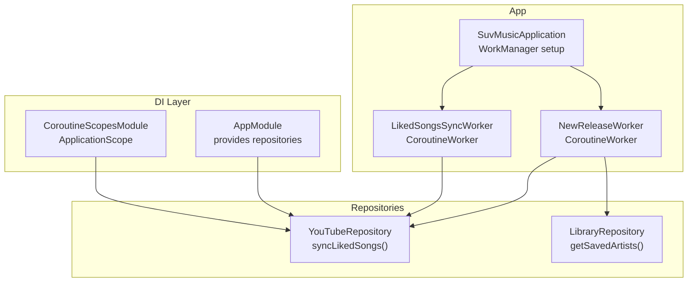
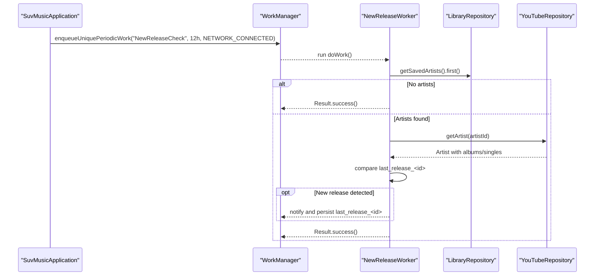
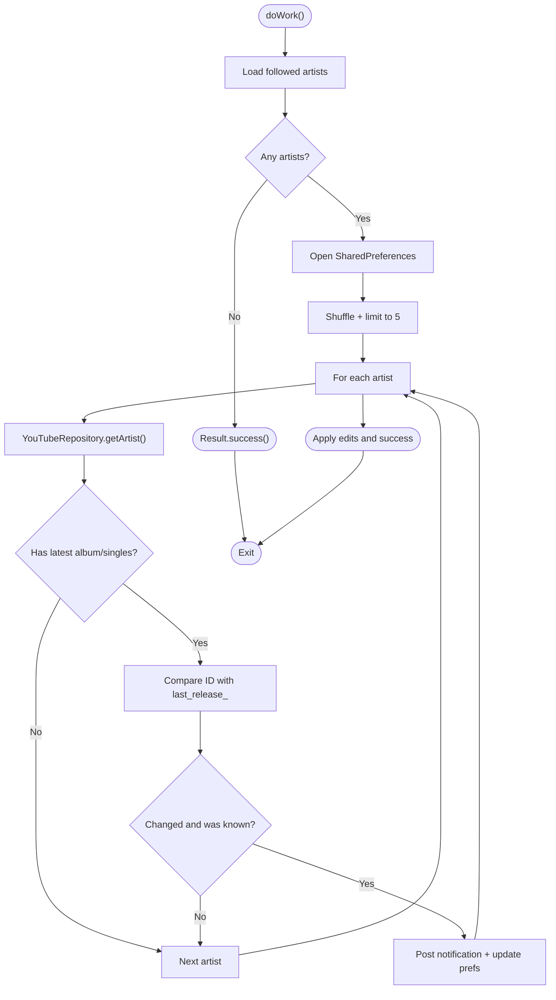
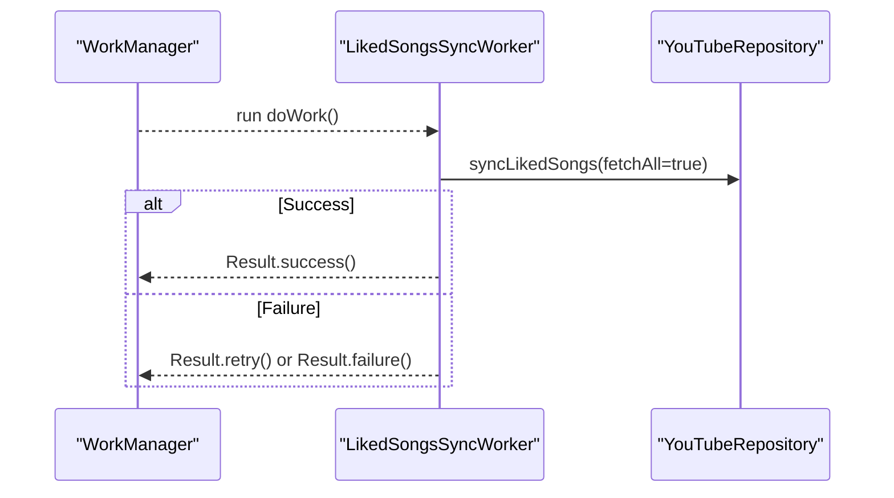
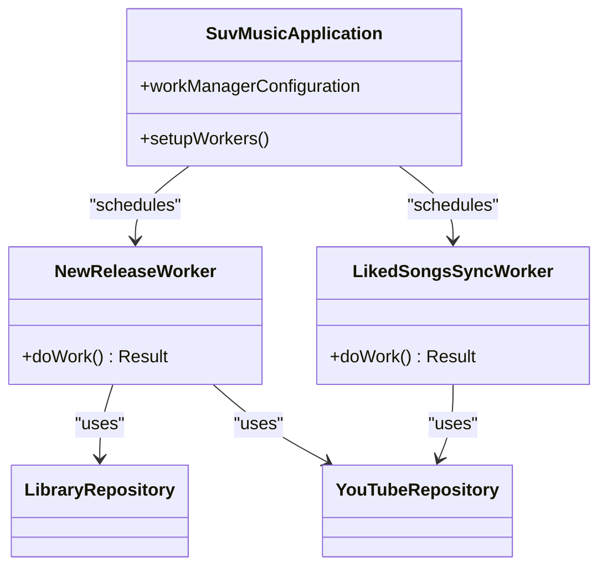
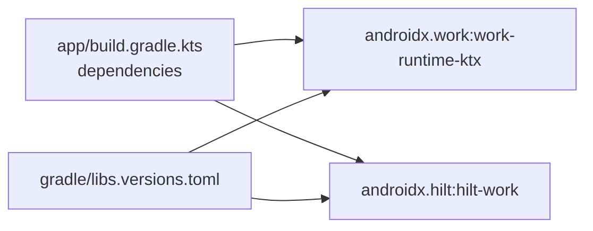

# WorkManager Workers

<cite>
**Referenced Files in This Document**
- [SuvMusicApplication.kt](file://app/src/main/java/com/suvojeet/suvmusic/SuvMusicApplication.kt)
- [NewReleaseWorker.kt](file://app/src/main/java/com/suvojeet/suvmusic/workers/NewReleaseWorker.kt)
- [LikedSongsSyncWorker.kt](file://app/src/main/java/com/suvojeet/suvmusic/data/worker/LikedSongsSyncWorker.kt)
- [YouTubeRepository.kt](file://app/src/main/java/com/suvojeet/suvmusic/data/repository/YouTubeRepository.kt)
- [LibraryRepository.kt](file://core/domain/src/main/java/com/suvojeet/suvmusic/core/domain/repository/LibraryRepository.kt)
- [LibraryRepositoryImpl.kt](file://core/data/src/main/java/com/suvojeet/suvmusic/core/data/repository/LibraryRepositoryImpl.kt)
- [AppModule.kt](file://app/src/main/java/com/suvojeet/suvmusic/di/AppModule.kt)
- [CoroutineScopesModule.kt](file://app/src/main/java/com/suvojeet/suvmusic/di/CoroutineScopesModule.kt)
- [AppLog.kt](file://app/src/main/java/com/suvojeet/suvmusic/util/AppLog.kt)
- [app/build.gradle.kts](file://app/build.gradle.kts)
- [libs.versions.toml](file://gradle/libs.versions.toml)
</cite>

## Table of Contents
1. [Introduction](#introduction)
2. [Project Structure](#project-structure)
3. [Core Components](#core-components)
4. [Architecture Overview](#architecture-overview)
5. [Detailed Component Analysis](#detailed-component-analysis)
6. [Dependency Analysis](#dependency-analysis)
7. [Performance Considerations](#performance-considerations)
8. [Troubleshooting Guide](#troubleshooting-guide)
9. [Conclusion](#conclusion)

## Introduction
This document explains SuvMusic’s WorkManager-based background task system with a focus on:
- Periodic tasks and background job scheduling
- Worker architecture and lifecycle management
- Retry policies and constraint handling
- Data persistence strategies
- Integration with dependency injection via Hilt
- Error handling and logging
- Performance optimization for background tasks

It covers two primary workers:
- NewReleaseWorker: periodically checks for new artist releases and posts notifications
- LikedSongsSyncWorker: synchronizes liked songs across devices

## Project Structure
WorkManager workers live under dedicated packages:
- workers: periodic tasks such as NewReleaseWorker
- data/worker: on-demand or scheduled sync tasks such as LikedSongsSyncWorker

Key integration points:
- Application-level WorkManager configuration and scheduling
- Hilt-based dependency injection for workers
- Repository abstractions for YouTube and Library data
- Logging utilities for diagnostics

**Diagram sources**
- [SuvMusicApplication.kt:111-127](file://app/src/main/java/com/suvojeet/suvmusic/SuvMusicApplication.kt#L111-L127)
- [NewReleaseWorker.kt:21-27](file://app/src/main/java/com/suvojeet/suvmusic/workers/NewReleaseWorker.kt#L21-L27)
- [LikedSongsSyncWorker.kt:11-16](file://app/src/main/java/com/suvojeet/suvmusic/data/worker/LikedSongsSyncWorker.kt#L11-L16)
- [YouTubeRepository.kt:770-830](file://app/src/main/java/com/suvojeet/suvmusic/data/repository/YouTubeRepository.kt#L770-L830)
- [LibraryRepository.kt](file://core/domain/src/main/java/com/suvojeet/suvmusic/core/domain/repository/LibraryRepository.kt#L34)
- [AppModule.kt:35-47](file://app/src/main/java/com/suvojeet/suvmusic/di/AppModule.kt#L35-L47)
- [CoroutineScopesModule.kt:20-24](file://app/src/main/java/com/suvojeet/suvmusic/di/CoroutineScopesModule.kt#L20-L24)

**Section sources**
- [SuvMusicApplication.kt:111-127](file://app/src/main/java/com/suvojeet/suvmusic/SuvMusicApplication.kt#L111-L127)
- [NewReleaseWorker.kt:21-27](file://app/src/main/java/com/suvojeet/suvmusic/workers/NewReleaseWorker.kt#L21-L27)
- [LikedSongsSyncWorker.kt:11-16](file://app/src/main/java/com/suvojeet/suvmusic/data/worker/LikedSongsSyncWorker.kt#L11-L16)
- [YouTubeRepository.kt:770-830](file://app/src/main/java/com/suvojeet/suvmusic/data/repository/YouTubeRepository.kt#L770-L830)
- [LibraryRepository.kt](file://core/domain/src/main/java/com/suvojeet/suvmusic/core/domain/repository/LibraryRepository.kt#L34)
- [AppModule.kt:35-47](file://app/src/main/java/com/suvojeet/suvmusic/di/AppModule.kt#L35-L47)
- [CoroutineScopesModule.kt:20-24](file://app/src/main/java/com/suvojeet/suvmusic/di/CoroutineScopesModule.kt#L20-L24)

## Core Components
- NewReleaseWorker: Periodic worker that discovers followed artists, queries YouTube for artist content, compares against stored “last release” identifiers, and posts notifications for new albums or singles.
- LikedSongsSyncWorker: Worker that triggers a full synchronization of liked songs via YouTubeRepository and returns success/failure/retry outcomes.
- SuvMusicApplication: Initializes WorkManager with HiltWorkerFactory and enqueues the periodic work with network constraints.
- YouTubeRepository: Implements liked songs retrieval and pagination, including continuation token handling and atomic replacement of cached playlists.
- LibraryRepository: Provides Flow-based access to saved artists for discovery.
- AppModule and CoroutineScopesModule: Supply repositories and scopes to workers via Hilt.

**Section sources**
- [NewReleaseWorker.kt:29-78](file://app/src/main/java/com/suvojeet/suvmusic/workers/NewReleaseWorker.kt#L29-L78)
- [LikedSongsSyncWorker.kt:18-33](file://app/src/main/java/com/suvojeet/suvmusic/data/worker/LikedSongsSyncWorker.kt#L18-L33)
- [SuvMusicApplication.kt:111-127](file://app/src/main/java/com/suvojeet/suvmusic/SuvMusicApplication.kt#L111-L127)
- [YouTubeRepository.kt:770-830](file://app/src/main/java/com/suvojeet/suvmusic/data/repository/YouTubeRepository.kt#L770-L830)
- [LibraryRepository.kt](file://core/domain/src/main/java/com/suvojeet/suvmusic/core/domain/repository/LibraryRepository.kt#L34)
- [AppModule.kt:35-47](file://app/src/main/java/com/suvojeet/suvmusic/di/AppModule.kt#L35-L47)
- [CoroutineScopesModule.kt:20-24](file://app/src/main/java/com/suvojeet/suvmusic/di/CoroutineScopesModule.kt#L20-L24)

## Architecture Overview
The system uses WorkManager for scheduling and Hilt for injecting repositories into workers. Workers operate independently of UI lifecycles and rely on repositories to abstract network and storage concerns.

**Diagram sources**
- [SuvMusicApplication.kt:111-127](file://app/src/main/java/com/suvojeet/suvmusic/SuvMusicApplication.kt#L111-L127)
- [NewReleaseWorker.kt:29-78](file://app/src/main/java/com/suvojeet/suvmusic/workers/NewReleaseWorker.kt#L29-L78)
- [LibraryRepository.kt](file://core/domain/src/main/java/com/suvojeet/suvmusic/core/domain/repository/LibraryRepository.kt#L34)
- [YouTubeRepository.kt:1156-1169](file://app/src/main/java/com/suvojeet/suvmusic/data/repository/YouTubeRepository.kt#L1156-L1169)

## Detailed Component Analysis

### NewReleaseWorker
Purpose:
- Periodically check followed artists for new releases and notify users.

Key behaviors:
- Discovers followed artists via LibraryRepository
- Shuffles and limits checks per run to balance accuracy and bandwidth
- Queries YouTubeRepository.getArtist for artist content
- Compares latest album/single ID against persisted “last release” records
- Posts notifications with navigation intent to the album
- Uses SharedPreferences to persist last release IDs per artist

Retry and failure:
- Outer try/catch logs failures and returns failure result
- Inner try/catch around individual artist processing avoids aborting the whole run

Constraints and scheduling:
- Enqueued as periodic with 12-hour interval and network-connected constraint
- Unique periodic work policy ensures only one instance runs

**Diagram sources**
- [NewReleaseWorker.kt:29-78](file://app/src/main/java/com/suvojeet/suvmusic/workers/NewReleaseWorker.kt#L29-L78)
- [LibraryRepository.kt](file://core/domain/src/main/java/com/suvojeet/suvmusic/core/domain/repository/LibraryRepository.kt#L34)
- [YouTubeRepository.kt:1156-1169](file://app/src/main/java/com/suvojeet/suvmusic/data/repository/YouTubeRepository.kt#L1156-L1169)

**Section sources**
- [NewReleaseWorker.kt:29-78](file://app/src/main/java/com/suvojeet/suvmusic/workers/NewReleaseWorker.kt#L29-L78)
- [SuvMusicApplication.kt:111-127](file://app/src/main/java/com/suvojeet/suvmusic/SuvMusicApplication.kt#L111-L127)

### LikedSongsSyncWorker
Purpose:
- Synchronize liked songs across devices by fetching and replacing the cached playlist.

Key behaviors:
- Calls YouTubeRepository.syncLikedSongs with fetchAll=true
- Returns success on completion, retry on transient failure, and failure on permanent errors

**Diagram sources**
- [LikedSongsSyncWorker.kt:18-33](file://app/src/main/java/com/suvojeet/suvmusic/data/worker/LikedSongsSyncWorker.kt#L18-L33)
- [YouTubeRepository.kt:770-830](file://app/src/main/java/com/suvojeet/suvmusic/data/repository/YouTubeRepository.kt#L770-L830)

**Section sources**
- [LikedSongsSyncWorker.kt:18-33](file://app/src/main/java/com/suvojeet/suvmusic/data/worker/LikedSongsSyncWorker.kt#L18-L33)
- [YouTubeRepository.kt:770-830](file://app/src/main/java/com/suvojeet/suvmusic/data/repository/YouTubeRepository.kt#L770-L830)

### Worker Lifecycle Management and Retry Policies
- NewReleaseWorker:
  - Uses Result.success() to mark completion after processing
  - Uses Result.failure() for unrecoverable errors
  - Inner exceptions are caught to avoid aborting the entire run
- LikedSongsSyncWorker:
  - Returns Result.retry() when sync indicates transient failure
  - Returns Result.failure() for permanent errors

Constraints:
- NewReleaseWorker is scheduled with network connectivity requirement to ensure reliable YouTube API access.

Scheduling pattern:
- PeriodicWorkRequestBuilder with 12-hour interval and ExistingPeriodicWorkPolicy.KEEP to avoid duplicates.

**Section sources**
- [NewReleaseWorker.kt:29-78](file://app/src/main/java/com/suvojeet/suvmusic/workers/NewReleaseWorker.kt#L29-L78)
- [LikedSongsSyncWorker.kt:18-33](file://app/src/main/java/com/suvojeet/suvmusic/data/worker/LikedSongsSyncWorker.kt#L18-L33)
- [SuvMusicApplication.kt:111-127](file://app/src/main/java/com/suvojeet/suvmusic/SuvMusicApplication.kt#L111-L127)

### Data Persistence Strategies
- NewReleaseWorker:
  - SharedPreferences keyed by “last_release_<artistId>” to track the last known release ID
  - Applies edits atomically per-run to avoid partial writes
- YouTubeRepository:
  - Saves playlist metadata and replaces playlist songs atomically
  - Limits pagination depth to manage performance and data volume

**Section sources**
- [NewReleaseWorker.kt:34-72](file://app/src/main/java/com/suvojeet/suvmusic/workers/NewReleaseWorker.kt#L34-L72)
- [YouTubeRepository.kt:810-825](file://app/src/main/java/com/suvojeet/suvmusic/data/repository/YouTubeRepository.kt#L810-L825)

### Integration with Dependency Injection (Hilt)
- SuvMusicApplication provides a WorkManager configuration that injects HiltWorkerFactory
- Workers are annotated with @HiltWorker and receive injected dependencies via @AssistedInject
- AppModule supplies YouTubeRepository and other singletons
- CoroutineScopesModule provides ApplicationScope for long-running tasks

**Diagram sources**
- [SuvMusicApplication.kt:84-87](file://app/src/main/java/com/suvojeet/suvmusic/SuvMusicApplication.kt#L84-L87)
- [NewReleaseWorker.kt:21-27](file://app/src/main/java/com/suvojeet/suvmusic/workers/NewReleaseWorker.kt#L21-L27)
- [LikedSongsSyncWorker.kt:11-16](file://app/src/main/java/com/suvojeet/suvmusic/data/worker/LikedSongsSyncWorker.kt#L11-L16)
- [YouTubeRepository.kt:770-830](file://app/src/main/java/com/suvojeet/suvmusic/data/repository/YouTubeRepository.kt#L770-L830)
- [LibraryRepository.kt](file://core/domain/src/main/java/com/suvojeet/suvmusic/core/domain/repository/LibraryRepository.kt#L34)

**Section sources**
- [SuvMusicApplication.kt:34-38](file://app/src/main/java/com/suvojeet/suvmusic/SuvMusicApplication.kt#L34-L38)
- [NewReleaseWorker.kt:21-27](file://app/src/main/java/com/suvojeet/suvmusic/workers/NewReleaseWorker.kt#L21-L27)
- [LikedSongsSyncWorker.kt:11-16](file://app/src/main/java/com/suvojeet/suvmusic/data/worker/LikedSongsSyncWorker.kt#L11-L16)
- [AppModule.kt:35-47](file://app/src/main/java/com/suvojeet/suvmusic/di/AppModule.kt#L35-L47)
- [CoroutineScopesModule.kt:20-24](file://app/src/main/java/com/suvojeet/suvmusic/di/CoroutineScopesModule.kt#L20-L24)

## Dependency Analysis
External libraries and versions relevant to WorkManager:
- work-runtime-ktx and hilt-work are declared in Gradle and libs.versions.toml
- Hilt DI is configured across the app module

**Diagram sources**
- [app/build.gradle.kts:214-217](file://app/build.gradle.kts#L214-L217)
- [libs.versions.toml:126-129](file://gradle/libs.versions.toml#L126-L129)

**Section sources**
- [app/build.gradle.kts:214-217](file://app/build.gradle.kts#L214-L217)
- [libs.versions.toml:126-129](file://gradle/libs.versions.toml#L126-L129)

## Performance Considerations
- Bandwidth and rate limiting:
  - NewReleaseWorker shuffles followed artists and limits checks to five per run to reduce API load
- Pagination control:
  - YouTubeRepository limits continuation loops to cap data volume during liked songs sync
- Atomic updates:
  - Replaces playlist songs in a single transaction to minimize partial states
- Caching:
  - Image loader configuration emphasizes aggressive caching for smoother offline experiences

Recommendations:
- Consider adaptive scheduling (e.g., staggered start delays) to avoid thundering herd
- Monitor network conditions and adjust constraints dynamically
- Add exponential backoff for retry policies in workers that depend on external APIs

**Section sources**
- [NewReleaseWorker.kt:37-38](file://app/src/main/java/com/suvojeet/suvmusic/workers/NewReleaseWorker.kt#L37-L38)
- [YouTubeRepository.kt:783-807](file://app/src/main/java/com/suvojeet/suvmusic/data/repository/YouTubeRepository.kt#L783-L807)
- [YouTubeRepository.kt:810-825](file://app/src/main/java/com/suvojeet/suvmusic/data/repository/YouTubeRepository.kt#L810-L825)
- [SuvMusicApplication.kt:89-109](file://app/src/main/java/com/suvojeet/suvmusic/SuvMusicApplication.kt#L89-L109)

## Troubleshooting Guide
Common issues and resolutions:
- Notifications not appearing:
  - Verify notification channel creation and permissions
  - Ensure network connectivity constraint is met for NewReleaseWorker
- Frequent retries:
  - LikedSongsSyncWorker returns retry on transient failures; confirm underlying API stability
- No artists detected:
  - NewReleaseWorker exits early if no followed artists are found
- Logging and diagnostics:
  - Use AppLog to capture runtime logs and exceptions for both workers

Error handling patterns:
- NewReleaseWorker wraps artist processing in inner try/catch to avoid aborting the whole run
- Both workers log exceptions and return appropriate Result states

**Section sources**
- [NewReleaseWorker.kt:67-76](file://app/src/main/java/com/suvojeet/suvmusic/workers/NewReleaseWorker.kt#L67-L76)
- [LikedSongsSyncWorker.kt:29-32](file://app/src/main/java/com/suvojeet/suvmusic/data/worker/LikedSongsSyncWorker.kt#L29-L32)
- [AppLog.kt:63-100](file://app/src/main/java/com/suvojeet/suvmusic/util/AppLog.kt#L63-L100)

## Conclusion
SuvMusic’s WorkManager implementation provides robust, configurable background processing:
- NewReleaseWorker efficiently monitors artist releases with bounded checks and persistent state
- LikedSongsSyncWorker reliably synchronizes liked songs with retry semantics
- Hilt integration ensures clean dependency management and testability
- Constraints and scheduling align with device and network conditions
- Logging and atomic persistence improve reliability and observability