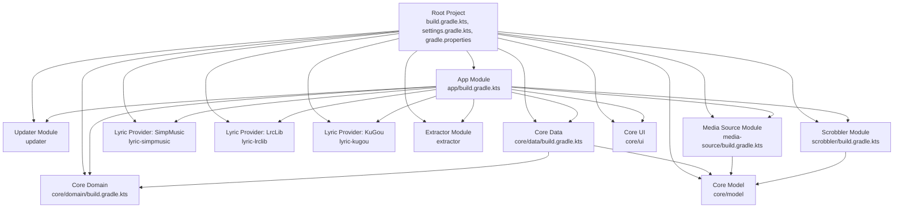
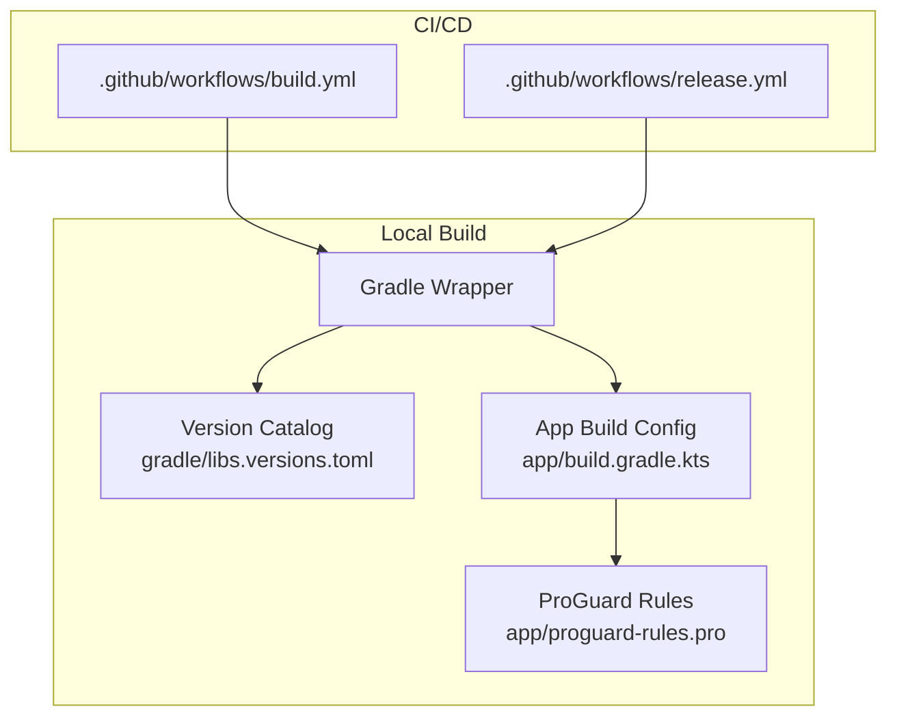
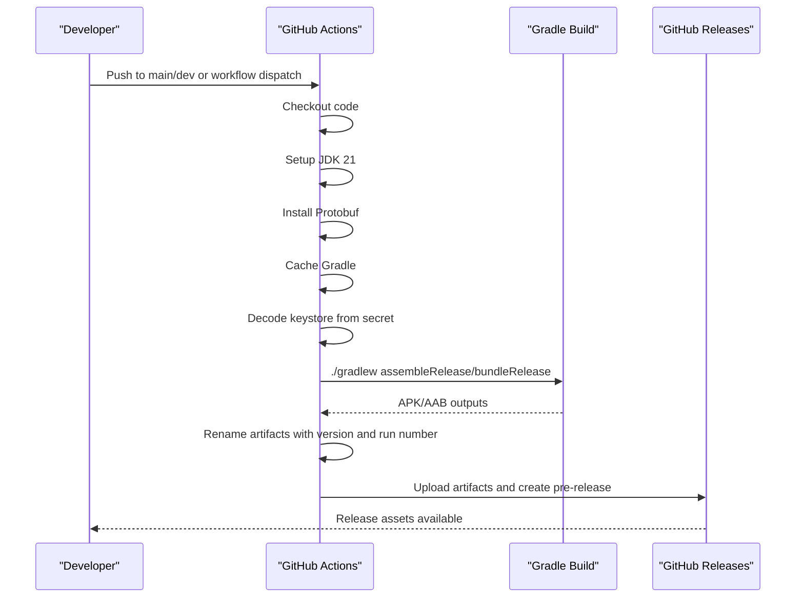
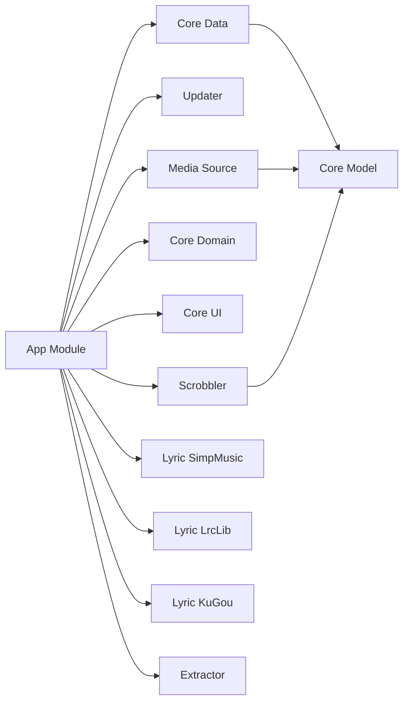

# Build and Deployment

<cite>
**Referenced Files in This Document**
- [build.gradle.kts](file://build.gradle.kts)
- [settings.gradle.kts](file://settings.gradle.kts)
- [gradle.properties](file://gradle.properties)
- [gradle/libs.versions.toml](file://gradle/libs.versions.toml)
- [app/build.gradle.kts](file://app/build.gradle.kts)
- [app/proguard-rules.pro](file://app/proguard-rules.pro)
- [.github/workflows/build.yml](file://.github/workflows/build.yml)
- [.github/workflows/release.yml](file://.github/workflows/release.yml)
- [core/data/build.gradle.kts](file://core/data/build.gradle.kts)
- [core/domain/build.gradle.kts](file://core/domain/build.gradle.kts)
- [media-source/build.gradle.kts](file://media-source/build.gradle.kts)
- [scrobbler/build.gradle.kts](file://scrobbler/build.gradle.kts)
- [com.suvojeet.suvmusic.yml](file://com.suvojeet.suvmusic.yml)
</cite>

## Table of Contents
1. [Introduction](#introduction)
2. [Project Structure](#project-structure)
3. [Core Components](#core-components)
4. [Architecture Overview](#architecture-overview)
5. [Detailed Component Analysis](#detailed-component-analysis)
6. [Dependency Analysis](#dependency-analysis)
7. [Performance Considerations](#performance-considerations)
8. [Troubleshooting Guide](#troubleshooting-guide)
9. [Conclusion](#conclusion)
10. [Appendices](#appendices)

## Introduction
This document explains how SuvMusic is built and deployed. It covers the multi-module Gradle configuration, dependency management via Gradle Version Catalogs, signing and release builds, ProGuard optimization, CI/CD with GitHub Actions, and the current state of Fastlane metadata. It also outlines build variants, flavor configurations, and release channel management, along with troubleshooting tips and optimization techniques.

## Project Structure
SuvMusic is a multi-module Android project with a shared top-level Gradle configuration and per-module build scripts. Modules are organized by feature and core layers, including the main app module, updater, media source providers, scrobbler, lyric providers, extractor, and core libraries (model, data, domain, ui).

**Diagram sources**
- [settings.gradle.kts](file://settings.gradle.kts)
- [app/build.gradle.kts](file://app/build.gradle.kts)
- [core/data/build.gradle.kts](file://core/data/build.gradle.kts)
- [core/domain/build.gradle.kts](file://core/domain/build.gradle.kts)
- [media-source/build.gradle.kts](file://media-source/build.gradle.kts)
- [scrobbler/build.gradle.kts](file://scrobbler/build.gradle.kts)

**Section sources**
- [settings.gradle.kts](file://settings.gradle.kts)
- [build.gradle.kts](file://build.gradle.kts)
- [gradle.properties](file://gradle.properties)

## Core Components
- Multi-module Gradle build with shared plugin aliases and version catalog.
- Centralized dependency versions via Gradle Version Catalogs.
- App module with release signing, minification, resource filtering, and native CMake integration.
- Core modules for model, data, domain, and UI layered architecture.
- Media source and scrobbler modules with Last.fm credentials injected via environment or local properties.
- CI/CD workflows for automated builds and releases.

**Section sources**
- [build.gradle.kts](file://build.gradle.kts)
- [gradle/libs.versions.toml](file://gradle/libs.versions.toml)
- [app/build.gradle.kts](file://app/build.gradle.kts)
- [core/data/build.gradle.kts](file://core/data/build.gradle.kts)
- [core/domain/build.gradle.kts](file://core/domain/build.gradle.kts)
- [media-source/build.gradle.kts](file://media-source/build.gradle.kts)
- [scrobbler/build.gradle.kts](file://scrobbler/build.gradle.kts)

## Architecture Overview
The build system relies on:
- Top-level plugin management and plugin aliasing.
- Version catalogs for consistent dependency versions across modules.
- App module configuration for ABI filters, resource splits, desugaring, and native build integration.
- CI/CD workflows orchestrating signing, building, artifact renaming, and GitHub Releases.

**Diagram sources**
- [gradle/libs.versions.toml](file://gradle/libs.versions.toml)
- [app/build.gradle.kts](file://app/build.gradle.kts)
- [app/proguard-rules.pro](file://app/proguard-rules.pro)
- [.github/workflows/build.yml](file://.github/workflows/build.yml)
- [.github/workflows/release.yml](file://.github/workflows/release.yml)

## Detailed Component Analysis

### Gradle Build Configuration and Version Catalogs
- Plugin aliasing is centralized in the root build script, enabling consistent plugin usage across modules.
- Version Catalogs define versions and library coordinates, ensuring uniform dependency versions and simplifying updates.
- Global Gradle properties enable AndroidX, non-transitive R classes, legacy DSL opt-out for compatibility, and JVM tuning.

Key behaviors:
- Plugins applied at root level with apply false to avoid applying to all subprojects.
- Version catalog provides libraries and plugins for consistent dependency resolution.

**Section sources**
- [build.gradle.kts](file://build.gradle.kts)
- [gradle/libs.versions.toml](file://gradle/libs.versions.toml)
- [gradle.properties](file://gradle.properties)

### Multi-Module Project Structure
Modules included:
- App: main application module.
- Updater: update checking and download UI.
- Media source provider: common media source abstractions.
- Scrobbler: Last.fm scrobbling logic.
- Lyric providers: SimpMusic, LrcLib, KuGou.
- Extractor: NewPipe extractor integration.
- Core: model, data, domain, ui.

Each module defines its own Android configuration and dependencies, with the app module aggregating them.

**Section sources**
- [settings.gradle.kts](file://settings.gradle.kts)
- [core/data/build.gradle.kts](file://core/data/build.gradle.kts)
- [core/domain/build.gradle.kts](file://core/domain/build.gradle.kts)
- [media-source/build.gradle.kts](file://media-source/build.gradle.kts)
- [scrobbler/build.gradle.kts](file://scrobbler/build.gradle.kts)

### App Module Build Configuration
Highlights:
- Compile and target SDK set to 36; minSdk 26.
- ABI filters limit native artifacts to arm64-v8a and armeabi-v7a.
- Resource configurations limit supported locales to reduce APK size.
- Desugaring enabled for Java 8+ APIs on older Android versions.
- Native CMake integration with a specific NDK version.
- BuildConfig fields for Last.fm credentials loaded from environment or local.properties.
- Signing configuration reads keystore path and credentials from environment variables.
- Release build type enables minification and resource shrinking with custom ProGuard rules.
- Compose and buildConfig features enabled.
- Protobuf plugin configured with lite generation for Java/Kotlin.

**Section sources**
- [app/build.gradle.kts](file://app/build.gradle.kts)
- [app/proguard-rules.pro](file://app/proguard-rules.pro)

### ProGuard Optimization Rules
Rules preserve:
- NewPipe Extractor and its Rhino dependency.
- OkHttp and Gson.
- Hilt DI classes.
- Jetpack Compose runtime.
- Media3 ExoPlayer classes.
- Coil image loading.
- Ktor client and kotlinx serialization.
- JAudioTagger.
- Protobuf and Listen Together protobuf messages.

Warnings are suppressed for Android-specific missing classes and logging frameworks.

**Section sources**
- [app/proguard-rules.pro](file://app/proguard-rules.pro)

### CI/CD Pipeline with GitHub Actions
Automated builds:
- Build workflow:
  - Checks out code, sets up JDK 21, installs Protobuf compiler.
  - Caches Gradle wrapper and dependencies.
  - Decodes keystore from secret and builds release APK/AAB with environment variables.
  - Renames artifacts with version and build number.
  - Uploads artifacts and creates a pre-release on GitHub.

- Release workflow:
  - Manual trigger to produce production releases.
  - Builds APK/AAB with keystore decoded from secrets.
  - Generates release notes from updater changelog JSON.
  - Extracts artifacts and publishes a GitHub Release as non-prerelease.

Both workflows pass Last.fm credentials via environment variables and use the same keystore decoding pattern.

**Diagram sources**
- [.github/workflows/build.yml](file://.github/workflows/build.yml)
- [.github/workflows/release.yml](file://.github/workflows/release.yml)

**Section sources**
- [.github/workflows/build.yml](file://.github/workflows/build.yml)
- [.github/workflows/release.yml](file://.github/workflows/release.yml)

### Fastlane Integration
Fastlane metadata exists under fastlane/metadata/android/en-US with changelog, full description, and short description. Screenshots are present under screenshots/. However, the Fastfile is not found in the repository snapshot. As a result, automated store publishing and screenshot uploads are not configured in this repository snapshot.

Recommendation:
- Add a Fastfile to automate store metadata updates and screenshot uploads.
- Integrate Fastlane with CI/CD for streamlined release distribution.

**Section sources**
- [com.suvojeet.suvmusic.yml](file://com.suvojeet.suvmusic.yml)

### Build Variants and Flavor Configurations
- Current configuration defines debug and release build types in the app module.
- No product flavors are defined in the provided build scripts.
- Debug variant suffixes the application ID and disables minification.
- Release variant enables minification and resource shrinking with ProGuard rules.

To add flavors:
- Define flavor dimensions and product flavors in the app module.
- Configure signingConfigs per flavor and manage secrets accordingly.
- Use flavor-specific res/values and manifest placeholders.

**Section sources**
- [app/build.gradle.kts](file://app/build.gradle.kts)

### Release Channel Management
- GitHub Releases are used to publish artifacts.
- Build workflow marks releases as prerelease.
- Release workflow publishes stable releases and sets as latest.

For Play Console:
- Consider integrating Play App Bundle consumption and internal/test/production tracks.
- Automate release tracks via internal APIs or Fastlane with Play Developer API.

**Section sources**
- [.github/workflows/build.yml](file://.github/workflows/build.yml)
- [.github/workflows/release.yml](file://.github/workflows/release.yml)

## Dependency Analysis
The app module aggregates numerous libraries for UI, networking, media, DI, persistence, and more. Dependencies are grouped by category and resolved via the version catalog.

**Diagram sources**
- [app/build.gradle.kts](file://app/build.gradle.kts)
- [core/data/build.gradle.kts](file://core/data/build.gradle.kts)
- [core/domain/build.gradle.kts](file://core/domain/build.gradle.kts)
- [media-source/build.gradle.kts](file://media-source/build.gradle.kts)
- [scrobbler/build.gradle.kts](file://scrobbler/build.gradle.kts)

**Section sources**
- [app/build.gradle.kts](file://app/build.gradle.kts)
- [core/data/build.gradle.kts](file://core/data/build.gradle.kts)
- [core/domain/build.gradle.kts](file://core/domain/build.gradle.kts)
- [media-source/build.gradle.kts](file://media-source/build.gradle.kts)
- [scrobbler/build.gradle.kts](file://scrobbler/build.gradle.kts)

## Performance Considerations
- ABI filters and resource splits reduce APK size and improve install/download performance.
- Minification and resource shrinking in release builds reduce binary size.
- Desugaring allows modern Java APIs on older Android versions without bloating multidex.
- Protobuf lite reduces serialization overhead.
- Compose BOM ensures consistent UI toolkit versions.
- Caching Gradle wrapper and dependencies accelerates CI builds.

[No sources needed since this section provides general guidance]

## Troubleshooting Guide
Common issues and resolutions:
- Missing keystore secrets in CI:
  - Ensure environment variables are set in GitHub Secrets and passed to Gradle tasks.
  - Verify keystore decoding step succeeds and paths match the signingConfig.

- ProGuard errors after dependency updates:
  - Review keep/dontwarn rules for updated libraries.
  - Re-run with verbose ProGuard logs to identify missing keep rules.

- Native build failures:
  - Confirm NDK version matches the configured version and CMakeLists path is correct.
  - Ensure Protobuf compiler is installed in CI runners.

- Desugaring conflicts:
  - Align Java language level and desugaring settings across modules.
  - Ensure consistent JVM target settings.

- Last.fm credentials not applied:
  - Confirm environment variables or local.properties contain the keys.
  - Verify BuildConfig fields are generated and accessible.

**Section sources**
- [.github/workflows/build.yml](file://.github/workflows/build.yml)
- [app/build.gradle.kts](file://app/build.gradle.kts)
- [app/proguard-rules.pro](file://app/proguard-rules.pro)

## Conclusion
SuvMusic employs a robust multi-module Gradle setup with centralized version catalogs, optimized release builds, and automated CI/CD pipelines. The app module integrates native components, Compose UI, and extensive libraries while maintaining a lean footprint through ABI/resource filters and minification. CI workflows produce APKs and AABs, and GitHub Releases streamline distribution. While Fastlane metadata exists, the Fastfile is not present in this snapshot; adding it would further automate store publishing. For future enhancements, consider adding product flavors, Play Console automation, and expanded Fastlane tasks.

[No sources needed since this section summarizes without analyzing specific files]

## Appendices

### Appendix A: Key Build Properties and Flags
- AndroidX enabled globally.
- Non-transitive R classes enabled to reduce R class size.
- Legacy DSL disabled for KSP compatibility.
- JVM arguments tuned for Gradle daemon memory.

**Section sources**
- [gradle.properties](file://gradle.properties)

### Appendix B: Version Catalog Highlights
- Android Gradle Plugin and Kotlin versions pinned centrally.
- Jetpack Compose BOM, Media3, Hilt, Room, WorkManager, OkHttp, Retrofit, Coil, Ktor, Protobuf, and more defined in one place.

**Section sources**
- [gradle/libs.versions.toml](file://gradle/libs.versions.toml)