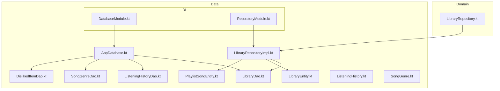
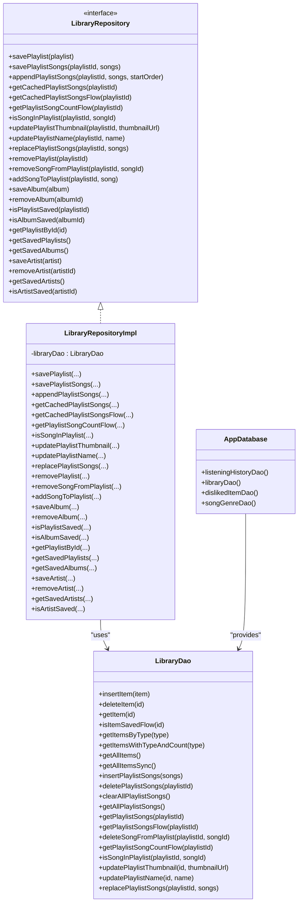
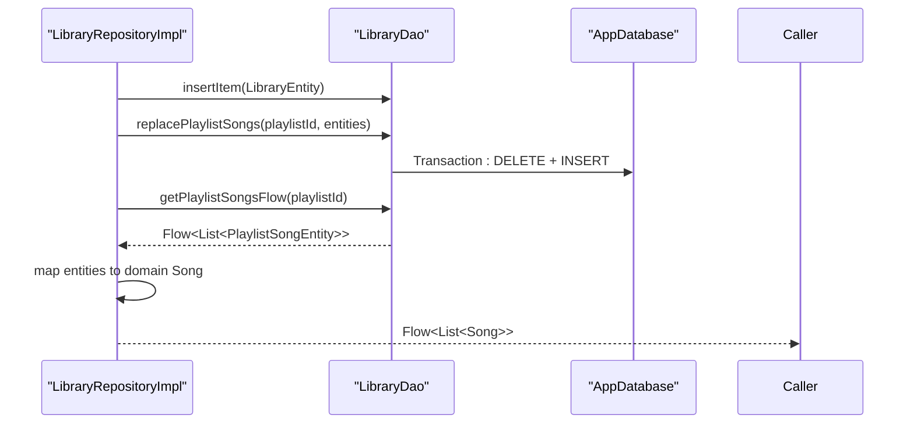
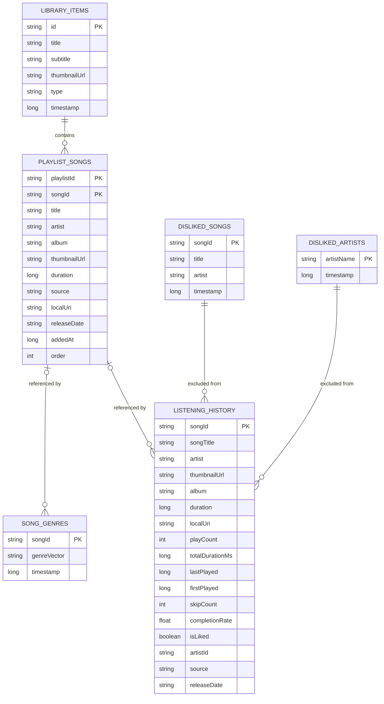
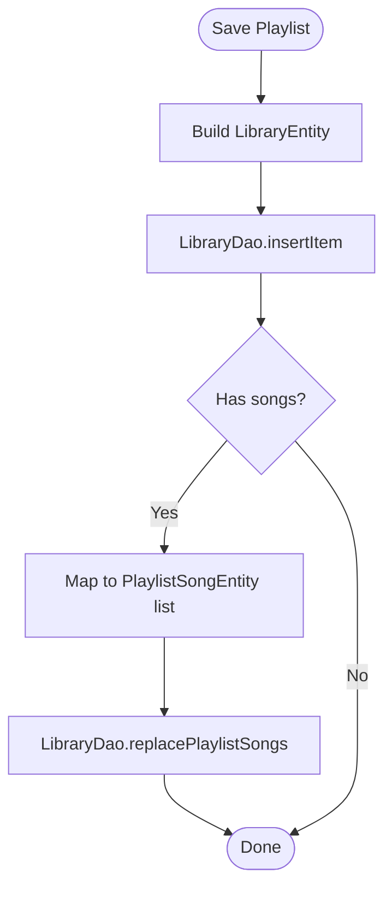
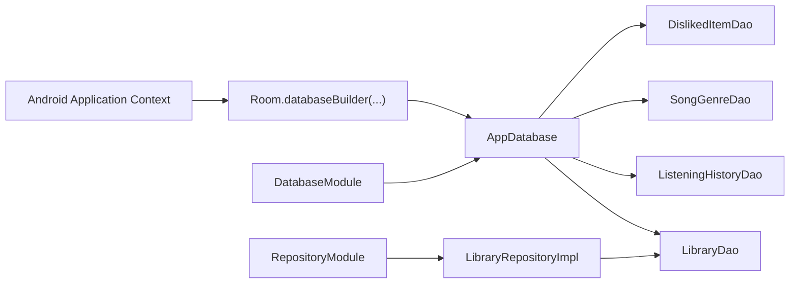

# Core Data

<cite>
**Referenced Files in This Document**
- [LibraryRepositoryImpl.kt](file://core/data/src/main/java/com/suvojeet/suvmusic/core/data/repository/LibraryRepositoryImpl.kt)
- [LibraryRepository.kt](file://core/domain/src/main/java/com/suvojeet/suvmusic/core/domain/repository/LibraryRepository.kt)
- [AppDatabase.kt](file://core/data/src/main/java/com/suvojeet/suvmusic/core/data/local/AppDatabase.kt)
- [LibraryDao.kt](file://core/data/src/main/java/com/suvojeet/suvmusic/core/data/local/dao/LibraryDao.kt)
- [ListeningHistoryDao.kt](file://core/data/src/main/java/com/suvojeet/suvmusic/core/data/local/dao/ListeningHistoryDao.kt)
- [SongGenreDao.kt](file://core/data/src/main/java/com/suvojeet/suvmusic/core/data/local/dao/SongGenreDao.kt)
- [DislikedItemDao.kt](file://core/data/src/main/java/com/suvojeet/suvmusic/core/data/local/dao/DislikedItemDao.kt)
- [LibraryEntity.kt](file://core/data/src/main/java/com/suvojeet/suvmusic/core/data/local/entity/LibraryEntity.kt)
- [PlaylistSongEntity.kt](file://core/data/src/main/java/com/suvojeet/suvmusic/core/data/local/entity/PlaylistSongEntity.kt)
- [ListeningHistory.kt](file://core/data/src/main/java/com/suvojeet/suvmusic/core/data/local/entity/ListeningHistory.kt)
- [SongGenre.kt](file://core/data/src/main/java/com/suvojeet/suvmusic/core/data/local/entity/SongGenre.kt)
- [DislikedItem.kt](file://core/data/src/main/java/com/suvojeet/suvmusic/core/data/local/entity/DislikedItem.kt)
- [DatabaseModule.kt](file://core/data/src/main/java/com/suvojeet/suvmusic/core/data/di/DatabaseModule.kt)
- [RepositoryModule.kt](file://core/data/src/main/java/com/suvojeet/suvmusic/core/data/di/RepositoryModule.kt)
</cite>

## Table of Contents
1. [Introduction](#introduction)
2. [Project Structure](#project-structure)
3. [Core Components](#core-components)
4. [Architecture Overview](#architecture-overview)
5. [Detailed Component Analysis](#detailed-component-analysis)
6. [Dependency Analysis](#dependency-analysis)
7. [Performance Considerations](#performance-considerations)
8. [Troubleshooting Guide](#troubleshooting-guide)
9. [Conclusion](#conclusion)

## Introduction
This document describes the Core Data module responsible for data persistence, repository implementations, and database management. It focuses on:
- The LibraryRepositoryImpl implementation of the LibraryRepository interface
- Room database schema, entities, DAOs, and relationships
- Migration strategies, indexing, and performance optimizations
- Data access patterns, transactions, and reactive streams
- Dependency injection integration via Hilt
- Testing strategies for data-layer components

## Project Structure
The Core Data module is organized by layers:
- Domain: repository interfaces consumed by higher layers
- Data: Room database, DAOs, entities, and repository implementations
- DI: Hilt modules providing database and repository bindings

**Diagram sources**
- [LibraryRepository.kt:1-37](file://core/domain/src/main/java/com/suvojeet/suvmusic/core/domain/repository/LibraryRepository.kt#L1-L37)
- [LibraryRepositoryImpl.kt:1-252](file://core/data/src/main/java/com/suvojeet/suvmusic/core/data/repository/LibraryRepositoryImpl.kt#L1-L252)
- [AppDatabase.kt:1-37](file://core/data/src/main/java/com/suvojeet/suvmusic/core/data/local/AppDatabase.kt#L1-L37)
- [LibraryDao.kt:1-90](file://core/data/src/main/java/com/suvojeet/suvmusic/core/data/local/dao/LibraryDao.kt#L1-L90)
- [ListeningHistoryDao.kt:1-99](file://core/data/src/main/java/com/suvojeet/suvmusic/core/data/local/dao/ListeningHistoryDao.kt#L1-L99)
- [SongGenreDao.kt:1-43](file://core/data/src/main/java/com/suvojeet/suvmusic/core/data/local/dao/SongGenreDao.kt#L1-L43)
- [DislikedItemDao.kt:1-53](file://core/data/src/main/java/com/suvojeet/suvmusic/core/data/local/dao/DislikedItemDao.kt#L1-L53)
- [LibraryEntity.kt:1-25](file://core/data/src/main/java/com/suvojeet/suvmusic/core/data/local/entity/LibraryEntity.kt#L1-L25)
- [PlaylistSongEntity.kt:1-25](file://core/data/src/main/java/com/suvojeet/suvmusic/core/data/local/entity/PlaylistSongEntity.kt#L1-L25)
- [ListeningHistory.kt:1-40](file://core/data/src/main/java/com/suvojeet/suvmusic/core/data/local/entity/ListeningHistory.kt#L1-L40)
- [SongGenre.kt:1-45](file://core/data/src/main/java/com/suvojeet/suvmusic/core/data/local/entity/SongGenre.kt#L1-L45)
- [DislikedItem.kt:1-29](file://core/data/src/main/java/com/suvojeet/suvmusic/core/data/local/entity/DislikedItem.kt#L1-L29)
- [DatabaseModule.kt:1-53](file://core/data/src/main/java/com/suvojeet/suvmusic/core/data/di/DatabaseModule.kt#L1-L53)
- [RepositoryModule.kt:1-19](file://core/data/src/main/java/com/suvojeet/suvmusic/core/data/di/RepositoryModule.kt#L1-L19)

**Section sources**
- [LibraryRepositoryImpl.kt:1-252](file://core/data/src/main/java/com/suvojeet/suvmusic/core/data/repository/LibraryRepositoryImpl.kt#L1-L252)
- [AppDatabase.kt:1-37](file://core/data/src/main/java/com/suvojeet/suvmusic/core/data/local/AppDatabase.kt#L1-L37)
- [DatabaseModule.kt:1-53](file://core/data/src/main/java/com/suvojeet/suvmusic/core/data/di/DatabaseModule.kt#L1-L53)
- [RepositoryModule.kt:1-19](file://core/data/src/main/java/com/suvojeet/suvmusic/core/data/di/RepositoryModule.kt#L1-L19)

## Core Components
- AppDatabase: Declares Room entities and DAOs, version 11, with schema export enabled.
- DAOs:
  - LibraryDao: Manages library items and cached playlist songs, including transactional replacement.
  - ListeningHistoryDao: Upserts and queries playback statistics with reactive streams.
  - SongGenreDao: Caches genre vectors for songs.
  - DislikedItemDao: Stores user-disliked songs and artists.
- Entities:
  - LibraryEntity: Library item metadata with type discriminator and timestamp.
  - PlaylistSongEntity: Playlist-song mapping with composite primary key and index.
  - ListeningHistory: Aggregated playback stats keyed by songId.
  - SongGenre: Cached genre vectors stored as serialized strings.
  - DislikedItem entities: Explicit user dislikes persisted for filtering.
- Repository:
  - LibraryRepositoryImpl: Implements LibraryRepository, orchestrates DAOs, transforms entities to domain models, and exposes reactive flows.

Key implementation highlights:
- LibraryRepositoryImpl performs data transformations between entities and domain models, including safe parsing of enums and URI conversion.
- Uses Room’s @Transaction for atomic playlist replacement and @Upsert for efficient history updates.
- Reactive streams are exposed via Kotlin Flow for real-time UI updates.

**Section sources**
- [AppDatabase.kt:16-36](file://core/data/src/main/java/com/suvojeet/suvmusic/core/data/local/AppDatabase.kt#L16-L36)
- [LibraryDao.kt:13-89](file://core/data/src/main/java/com/suvojeet/suvmusic/core/data/local/dao/LibraryDao.kt#L13-L89)
- [ListeningHistoryDao.kt:10-90](file://core/data/src/main/java/com/suvojeet/suvmusic/core/data/local/dao/ListeningHistoryDao.kt#L10-L90)
- [SongGenreDao.kt:13-42](file://core/data/src/main/java/com/suvojeet/suvmusic/core/data/local/dao/SongGenreDao.kt#L13-L42)
- [DislikedItemDao.kt:13-52](file://core/data/src/main/java/com/suvojeet/suvmusic/core/data/local/dao/DislikedItemDao.kt#L13-L52)
- [LibraryEntity.kt:6-14](file://core/data/src/main/java/com/suvojeet/suvmusic/core/data/local/entity/LibraryEntity.kt#L6-L14)
- [PlaylistSongEntity.kt:6-24](file://core/data/src/main/java/com/suvojeet/suvmusic/core/data/local/entity/PlaylistSongEntity.kt#L6-L24)
- [ListeningHistory.kt:10-39](file://core/data/src/main/java/com/suvojeet/suvmusic/core/data/local/entity/ListeningHistory.kt#L10-L39)
- [SongGenre.kt:11-44](file://core/data/src/main/java/com/suvojeet/suvmusic/core/data/local/entity/SongGenre.kt#L11-L44)
- [DislikedItem.kt:10-28](file://core/data/src/main/java/com/suvojeet/suvmusic/core/data/local/entity/DislikedItem.kt#L10-L28)
- [LibraryRepositoryImpl.kt:19-251](file://core/data/src/main/java/com/suvojeet/suvmusic/core/data/repository/LibraryRepositoryImpl.kt#L19-L251)
- [LibraryRepository.kt:11-36](file://core/domain/src/main/java/com/suvojeet/suvmusic/core/domain/repository/LibraryRepository.kt#L11-L36)

## Architecture Overview
The data layer follows a clean architecture pattern:
- Domain defines repository interfaces.
- Data implements repositories and DAOs backed by Room.
- DI modules wire database instances and repository bindings.

**Diagram sources**
- [LibraryRepository.kt:11-36](file://core/domain/src/main/java/com/suvojeet/suvmusic/core/domain/repository/LibraryRepository.kt#L11-L36)
- [LibraryRepositoryImpl.kt:19-251](file://core/data/src/main/java/com/suvojeet/suvmusic/core/data/repository/LibraryRepositoryImpl.kt#L19-L251)
- [AppDatabase.kt:31-35](file://core/data/src/main/java/com/suvojeet/suvmusic/core/data/local/AppDatabase.kt#L31-L35)
- [LibraryDao.kt:13-89](file://core/data/src/main/java/com/suvojeet/suvmusic/core/data/local/dao/LibraryDao.kt#L13-L89)

## Detailed Component Analysis

### LibraryRepositoryImpl
Responsibilities:
- Save playlists and albums/artists as library items
- Manage cached playlist songs with ordering and timestamps
- Provide reactive flows for UI updates
- Transform between entities and domain models

Key operations:
- Playlist creation and replacement
- Append songs with computed order
- Retrieve and stream playlist songs
- Update playlist metadata
- Check existence and counts via DAOs

**Diagram sources**
- [LibraryRepositoryImpl.kt:24-58](file://core/data/src/main/java/com/suvojeet/suvmusic/core/data/repository/LibraryRepositoryImpl.kt#L24-L58)
- [LibraryRepositoryImpl.kt:98-115](file://core/data/src/main/java/com/suvojeet/suvmusic/core/data/repository/LibraryRepositoryImpl.kt#L98-L115)
- [LibraryDao.kt:84-88](file://core/data/src/main/java/com/suvojeet/suvmusic/core/data/local/dao/LibraryDao.kt#L84-L88)

**Section sources**
- [LibraryRepositoryImpl.kt:19-251](file://core/data/src/main/java/com/suvojeet/suvmusic/core/data/repository/LibraryRepositoryImpl.kt#L19-L251)
- [LibraryRepository.kt:11-36](file://core/domain/src/main/java/com/suvojeet/suvmusic/core/domain/repository/LibraryRepository.kt#L11-L36)

### Room Schema and Relationships
Entities and indices:
- library_items: LibraryEntity with type discriminator and timestamp
- playlist_songs: PlaylistSongEntity with composite primary key and index on playlistId
- listening_history: ListeningHistory keyed by songId
- song_genres: SongGenre keyed by songId
- disliked_songs and disliked_artists: DislikedItem entities

**Diagram sources**
- [LibraryEntity.kt:6-14](file://core/data/src/main/java/com/suvojeet/suvmusic/core/data/local/entity/LibraryEntity.kt#L6-L14)
- [PlaylistSongEntity.kt:6-24](file://core/data/src/main/java/com/suvojeet/suvmusic/core/data/local/entity/PlaylistSongEntity.kt#L6-L24)
- [ListeningHistory.kt:10-39](file://core/data/src/main/java/com/suvojeet/suvmusic/core/data/local/entity/ListeningHistory.kt#L10-L39)
- [SongGenre.kt:11-21](file://core/data/src/main/java/com/suvojeet/suvmusic/core/data/local/entity/SongGenre.kt#L11-L21)
- [DislikedItem.kt:10-28](file://core/data/src/main/java/com/suvojeet/suvmusic/core/data/local/entity/DislikedItem.kt#L10-L28)

**Section sources**
- [AppDatabase.kt:19-35](file://core/data/src/main/java/com/suvojeet/suvmusic/core/data/local/AppDatabase.kt#L19-L35)
- [LibraryEntity.kt:6-24](file://core/data/src/main/java/com/suvojeet/suvmusic/core/data/local/entity/LibraryEntity.kt#L6-L24)
- [PlaylistSongEntity.kt:6-24](file://core/data/src/main/java/com/suvojeet/suvmusic/core/data/local/entity/PlaylistSongEntity.kt#L6-L24)
- [ListeningHistory.kt:10-39](file://core/data/src/main/java/com/suvojeet/suvmusic/core/data/local/entity/ListeningHistory.kt#L10-L39)
- [SongGenre.kt:11-44](file://core/data/src/main/java/com/suvojeet/suvmusic/core/data/local/entity/SongGenre.kt#L11-L44)
- [DislikedItem.kt:10-28](file://core/data/src/main/java/com/suvojeet/suvmusic/core/data/local/entity/DislikedItem.kt#L10-L28)

### DAOs and Queries
- LibraryDao:
  - CRUD for library items
  - Cached playlist songs with REPLACE strategy and transactional replacement
  - Reactive queries for counts and saved-state checks
- ListeningHistoryDao:
  - Upsert for efficient updates
  - Range queries for top songs, recent plays, and artist aggregates
- SongGenreDao:
  - Cached genre vectors with bulk insert and count
- DislikedItemDao:
  - CRUD for disliked songs and artists

**Diagram sources**
- [LibraryRepositoryImpl.kt:24-37](file://core/data/src/main/java/com/suvojeet/suvmusic/core/data/repository/LibraryRepositoryImpl.kt#L24-L37)
- [LibraryDao.kt:84-88](file://core/data/src/main/java/com/suvojeet/suvmusic/core/data/local/dao/LibraryDao.kt#L84-L88)

**Section sources**
- [LibraryDao.kt:13-89](file://core/data/src/main/java/com/suvojeet/suvmusic/core/data/local/dao/LibraryDao.kt#L13-L89)
- [ListeningHistoryDao.kt:10-90](file://core/data/src/main/java/com/suvojeet/suvmusic/core/data/local/dao/ListeningHistoryDao.kt#L10-L90)
- [SongGenreDao.kt:13-42](file://core/data/src/main/java/com/suvojeet/suvmusic/core/data/local/dao/SongGenreDao.kt#L13-L42)
- [DislikedItemDao.kt:13-52](file://core/data/src/main/java/com/suvojeet/suvmusic/core/data/local/dao/DislikedItemDao.kt#L13-L52)

### Transactions and Reactive Streams
- Transactional replacement:
  - LibraryDao.replacePlaylistSongs deletes existing entries and inserts new ones atomically.
- Reactive flows:
  - LibraryDao.getPlaylistSongsFlow emits ordered cached songs.
  - LibraryDao.getPlaylistSongCountFlow tracks song counts reactively.
  - LibraryDao.isItemSavedFlow indicates presence of library items.
  - ListeningHistoryDao exposes top songs, recent plays, and artist aggregates as Flow.

**Section sources**
- [LibraryDao.kt:84-88](file://core/data/src/main/java/com/suvojeet/suvmusic/core/data/local/dao/LibraryDao.kt#L84-L88)
- [LibraryDao.kt:66-76](file://core/data/src/main/java/com/suvojeet/suvmusic/core/data/local/dao/LibraryDao.kt#L66-L76)
- [ListeningHistoryDao.kt:34-53](file://core/data/src/main/java/com/suvojeet/suvmusic/core/data/local/dao/ListeningHistoryDao.kt#L34-L53)

## Dependency Analysis
Hilt modules provide:
- AppDatabase singleton with destructive fallback migration
- DAO providers for injection into repositories
- Repository binding from implementation to interface

**Diagram sources**
- [DatabaseModule.kt:21-31](file://core/data/src/main/java/com/suvojeet/suvmusic/core/data/di/DatabaseModule.kt#L21-L31)
- [DatabaseModule.kt:33-51](file://core/data/src/main/java/com/suvojeet/suvmusic/core/data/di/DatabaseModule.kt#L33-L51)
- [RepositoryModule.kt:14-17](file://core/data/src/main/java/com/suvojeet/suvmusic/core/data/di/RepositoryModule.kt#L14-L17)

**Section sources**
- [DatabaseModule.kt:17-52](file://core/data/src/main/java/com/suvojeet/suvmusic/core/data/di/DatabaseModule.kt#L17-L52)
- [RepositoryModule.kt:10-18](file://core/data/src/main/java/com/suvojeet/suvmusic/core/data/di/RepositoryModule.kt#L10-L18)

## Performance Considerations
- Indexing:
  - PlaylistSongEntity is indexed on playlistId to optimize playlist queries.
- Batch operations:
  - REPLACE strategy in DAOs reduces conflict handling overhead.
  - Bulk insert for genres and playlist songs minimizes round-trips.
- Reactive updates:
  - Flow-based queries enable efficient UI updates without polling.
- Migration strategy:
  - Destructive fallback migration is configured; future migrations should preserve data where possible.
- Query efficiency:
  - Aggregated queries (counts, top songs) leverage SQL grouping and limits.

[No sources needed since this section provides general guidance]

## Troubleshooting Guide
Common issues and remedies:
- Migration failures:
  - Current setup uses destructive fallback migration. For production, implement proper migrations and retain schema exports.
- Playlist replacement anomalies:
  - Verify transaction boundaries in replacePlaylistSongs and ensure no concurrent writes corrupt ordering.
- Flow emissions:
  - Confirm upstream DAO queries emit on the appropriate dispatcher and that consumers collect on main thread for UI.
- Genre cache invalidation:
  - Clear cached genres when taxonomy changes to prevent stale vectors.
- Disliked items filtering:
  - Ensure downstream recommendation logic excludes disliked songs and penalizes disliked artists.

**Section sources**
- [DatabaseModule.kt:29](file://core/data/src/main/java/com/suvojeet/suvmusic/core/data/di/DatabaseModule.kt#L29)
- [LibraryDao.kt:84-88](file://core/data/src/main/java/com/suvojeet/suvmusic/core/data/local/dao/LibraryDao.kt#L84-L88)
- [SongGenreDao.kt:35-41](file://core/data/src/main/java/com/suvojeet/suvmusic/core/data/local/dao/SongGenreDao.kt#L35-L41)

## Conclusion
The Core Data module implements a robust, reactive persistence layer centered around Room. LibraryRepositoryImpl encapsulates complex data transformations and caching, while DAOs expose efficient queries and transactions. Hilt wiring ensures clean separation of concerns and testability. Future enhancements should focus on structured migrations, deeper indexing, and comprehensive unit/integration tests for DAOs and repositories.