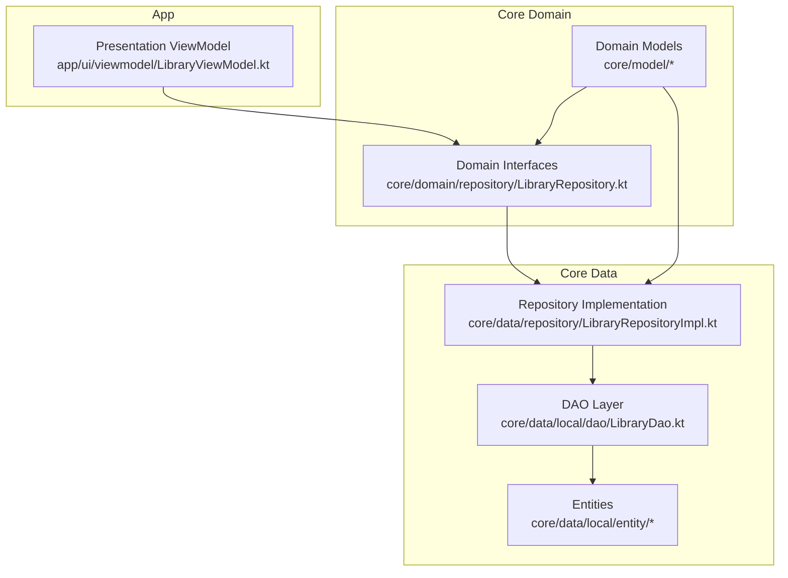
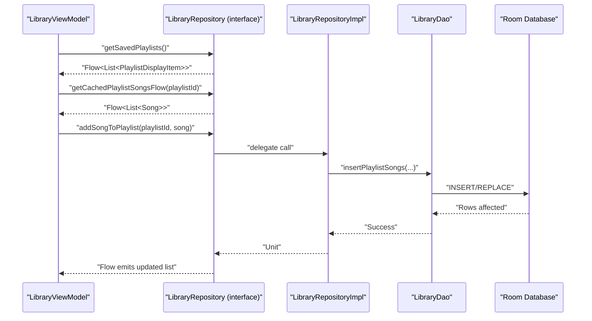
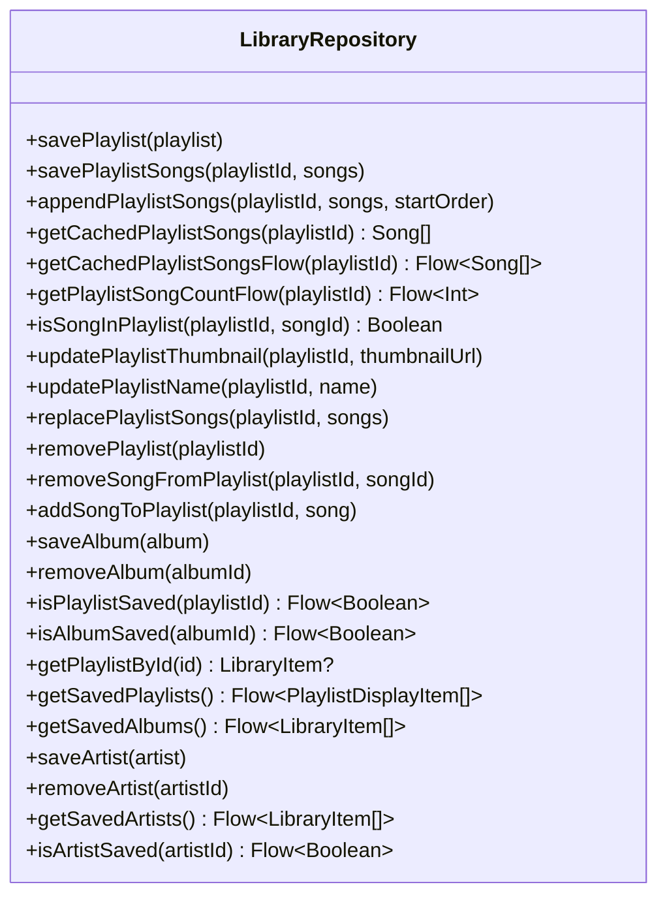
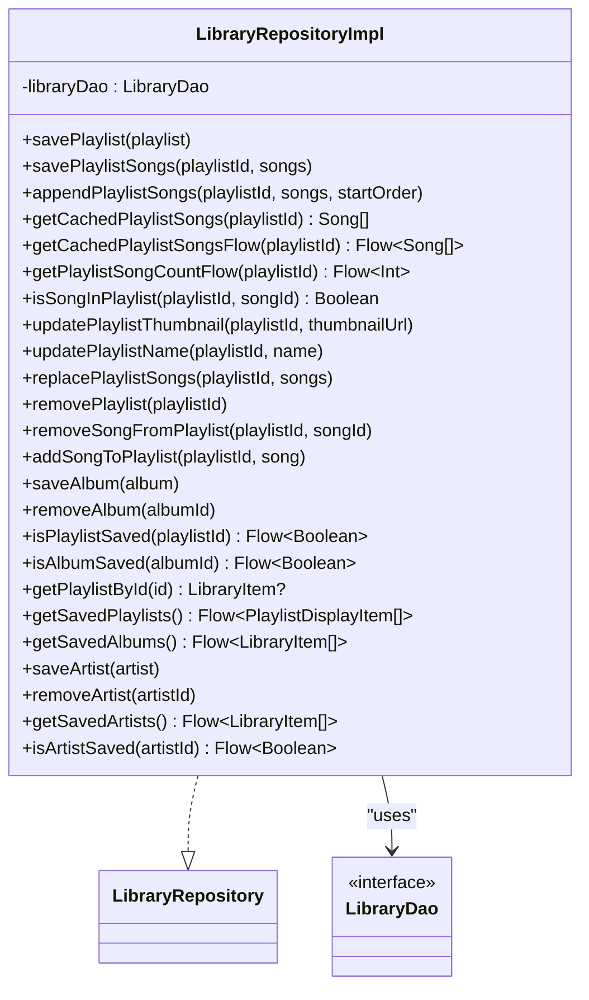
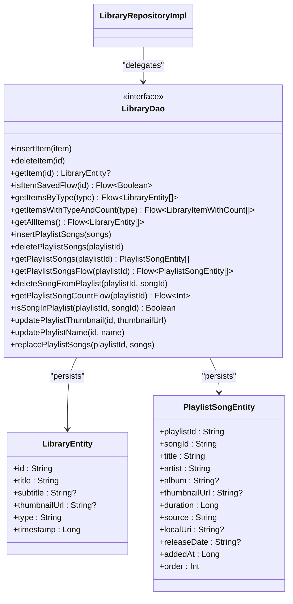
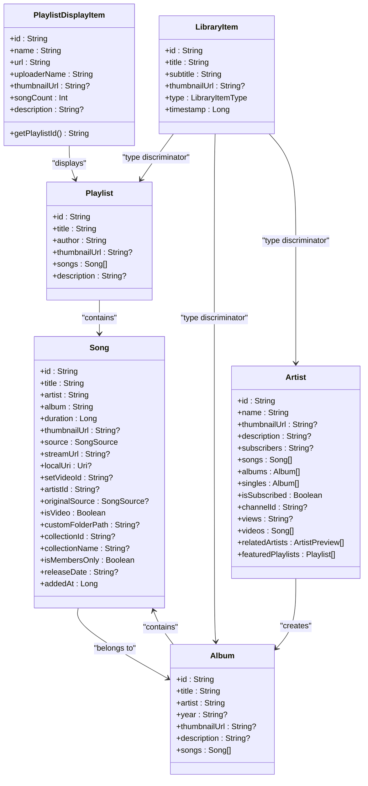
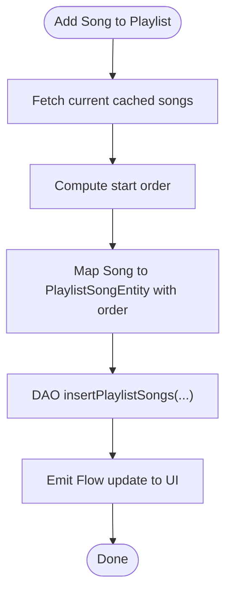
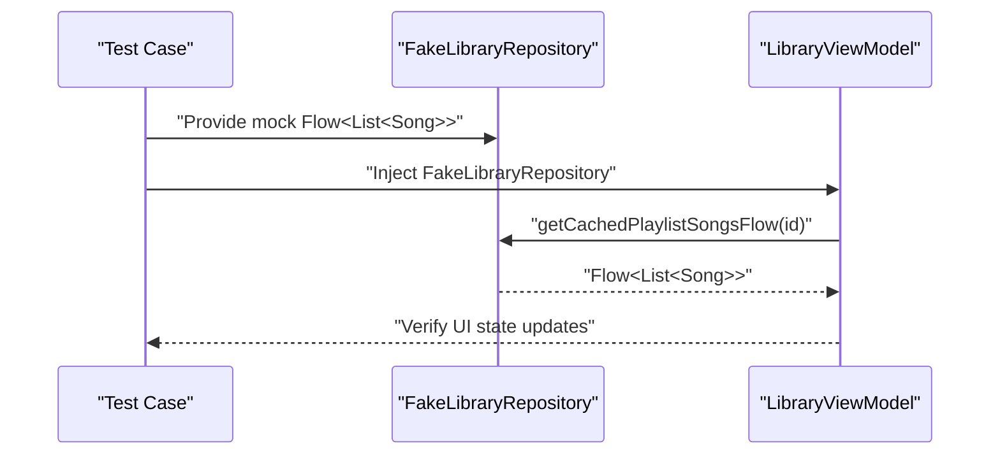
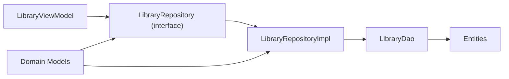

# Core Domain

<cite>
**Referenced Files in This Document**
- [LibraryRepository.kt](file://core/domain/src/main/java/com/suvojeet/suvmusic/core/domain/repository/LibraryRepository.kt)
- [LibraryRepositoryImpl.kt](file://core/data/src/main/java/com/suvojeet/suvmusic/core/data/repository/LibraryRepositoryImpl.kt)
- [LibraryDao.kt](file://core/data/src/main/java/com/suvojeet/suvmusic/core/data/local/dao/LibraryDao.kt)
- [LibraryEntity.kt](file://core/data/src/main/java/com/suvojeet/suvmusic/core/data/local/entity/LibraryEntity.kt)
- [PlaylistSongEntity.kt](file://core/data/src/main/java/com/suvojeet/suvmusic/core/data/local/entity/PlaylistSongEntity.kt)
- [LibraryItem.kt](file://core/model/src/main/java/com/suvojeet/suvmusic/core/model/LibraryItem.kt)
- [Song.kt](file://core/model/src/main/java/com/suvojeet/suvmusic/core/model/Song.kt)
- [Album.kt](file://core/model/src/main/java/com/suvojeet/suvmusic/core/model/Album.kt)
- [Artist.kt](file://core/model/src/main/java/com/suvojeet/suvmusic/core/model/Artist.kt)
- [Playlist.kt](file://core/model/src/main/java/com/suvojeet/suvmusic/core/model/Playlist.kt)
- [PlaylistDisplayItem.kt](file://core/model/src/main/java/com/suvojeet/suvmusic/core/model/PlaylistDisplayItem.kt)
- [RepositoryModule.kt](file://core/data/src/main/java/com/suvojeet/suvmusic/core/data/di/RepositoryModule.kt)
- [LibraryViewModel.kt](file://app/src/main/java/com/suvojeet/suvmusic/ui/viewmodel/LibraryViewModel.kt)
</cite>

## Table of Contents
1. [Introduction](#introduction)
2. [Project Structure](#project-structure)
3. [Core Components](#core-components)
4. [Architecture Overview](#architecture-overview)
5. [Detailed Component Analysis](#detailed-component-analysis)
6. [Dependency Analysis](#dependency-analysis)
7. [Performance Considerations](#performance-considerations)
8. [Troubleshooting Guide](#troubleshooting-guide)
9. [Conclusion](#conclusion)

## Introduction
This document describes the Core Domain module that defines business logic contracts and domain-level abstractions for the music library domain. It focuses on the LibraryRepository interface and its role as a data access contract without implementation details, how domain interfaces act as abstraction boundaries between presentation and data layers, and how use cases and domain services are structured around these contracts. It also explains how domain contracts enable testability, mock implementations, and dependency inversion, while maintaining separation of concerns so that domain logic remains independent of external frameworks and technologies.

## Project Structure
The Core Domain module is organized into three layers:
- Domain: Defines contracts (interfaces) for repositories and domain models.
- Model: Provides immutable domain models used across layers.
- Data: Implements repository contracts and integrates with persistence (Room DAOs).

**Diagram sources**
- [LibraryRepository.kt:11-36](file://core/domain/src/main/java/com/suvojeet/suvmusic/core/domain/repository/LibraryRepository.kt#L11-L36)
- [LibraryRepositoryImpl.kt:19-22](file://core/data/src/main/java/com/suvojeet/suvmusic/core/data/repository/LibraryRepositoryImpl.kt#L19-L22)
- [LibraryDao.kt:13-89](file://core/data/src/main/java/com/suvojeet/suvmusic/core/data/local/dao/LibraryDao.kt#L13-L89)
- [LibraryEntity.kt:6-14](file://core/data/src/main/java/com/suvojeet/suvmusic/core/data/local/entity/LibraryEntity.kt#L6-L14)
- [PlaylistSongEntity.kt:6-24](file://core/data/src/main/java/com/suvojeet/suvmusic/core/data/local/entity/PlaylistSongEntity.kt#L6-L24)
- [LibraryViewModel.kt:101-134](file://app/src/main/java/com/suvojeet/suvmusic/ui/viewmodel/LibraryViewModel.kt#L101-L134)

**Section sources**
- [LibraryRepository.kt:11-36](file://core/domain/src/main/java/com/suvojeet/suvmusic/core/domain/repository/LibraryRepository.kt#L11-L36)
- [LibraryRepositoryImpl.kt:19-22](file://core/data/src/main/java/com/suvojeet/suvmusic/core/data/repository/LibraryRepositoryImpl.kt#L19-L22)
- [LibraryDao.kt:13-89](file://core/data/src/main/java/com/suvojeet/suvmusic/core/data/local/dao/LibraryDao.kt#L13-L89)
- [LibraryViewModel.kt:101-134](file://app/src/main/java/com/suvojeet/suvmusic/ui/viewmodel/LibraryViewModel.kt#L101-L134)

## Core Components
- Domain repository interface: Defines the contract for library operations (playlists, albums, artists) and exposes reactive streams for UI observation.
- Domain models: Immutable data classes representing songs, albums, artists, playlists, and library items.
- Data repository implementation: Implements the domain contract using Room DAOs and entities.
- DAO layer: Encapsulates database queries and reactive streams for caching and real-time updates.
- DI binding: Binds the implementation to the domain interface via Dagger/Hilt.

Key responsibilities:
- Domain interface: Establishes abstraction boundaries and enforces business rule boundaries (e.g., playlist song ordering, caching semantics).
- Data implementation: Translates between domain models and persistence entities, handles data transformations, and orchestrates DAO operations.
- DAO: Provides typed, reactive access to Room tables and exposes Flow-based APIs for UI.

**Section sources**
- [LibraryRepository.kt:11-36](file://core/domain/src/main/java/com/suvojeet/suvmusic/core/domain/repository/LibraryRepository.kt#L11-L36)
- [LibraryRepositoryImpl.kt:24-239](file://core/data/src/main/java/com/suvojeet/suvmusic/core/data/repository/LibraryRepositoryImpl.kt#L24-L239)
- [LibraryDao.kt:13-89](file://core/data/src/main/java/com/suvojeet/suvmusic/core/data/local/dao/LibraryDao.kt#L13-L89)
- [LibraryItem.kt:3-17](file://core/model/src/main/java/com/suvojeet/suvmusic/core/model/LibraryItem.kt#L3-L17)
- [Song.kt:9-29](file://core/model/src/main/java/com/suvojeet/suvmusic/core/model/Song.kt#L9-L29)
- [Album.kt:3-11](file://core/model/src/main/java/com/suvojeet/suvmusic/core/model/Album.kt#L3-L11)
- [Artist.kt:3-18](file://core/model/src/main/java/com/suvojeet/suvmusic/core/model/Artist.kt#L3-L18)
- [Playlist.kt:3-10](file://core/model/src/main/java/com/suvojeet/suvmusic/core/model/Playlist.kt#L3-L10)
- [PlaylistDisplayItem.kt:7-23](file://core/model/src/main/java/com/suvojeet/suvmusic/core/model/PlaylistDisplayItem.kt#L7-L23)

## Architecture Overview
The architecture follows Clean Architecture principles:
- Presentation depends on domain interfaces (dependency inversion).
- Domain does not depend on data or framework specifics.
- Data implements domain interfaces and depends on persistence (Room).
- Reactive streams flow from DAO to UI via the repository.

**Diagram sources**
- [LibraryViewModel.kt:119-131](file://app/src/main/java/com/suvojeet/suvmusic/ui/viewmodel/LibraryViewModel.kt#L119-L131)
- [LibraryRepository.kt:11-36](file://core/domain/src/main/java/com/suvojeet/suvmusic/core/domain/repository/LibraryRepository.kt#L11-L36)
- [LibraryRepositoryImpl.kt:163-166](file://core/data/src/main/java/com/suvojeet/suvmusic/core/data/repository/LibraryRepositoryImpl.kt#L163-L166)
- [LibraryDao.kt:51-88](file://core/data/src/main/java/com/suvojeet/suvmusic/core/data/local/dao/LibraryDao.kt#L51-L88)

## Detailed Component Analysis

### LibraryRepository Interface
The LibraryRepository interface defines the contract for library operations:
- Playlist management: saving, replacing, appending songs, removing playlists, checking membership, updating metadata.
- Album and artist management: saving/removing and observing saved items.
- Reactive queries: cached lists and counts as Flow streams for UI observation.
- Domain-focused operations: no framework-specific types (e.g., no Room entities) leak into the interface.

**Diagram sources**
- [LibraryRepository.kt:11-36](file://core/domain/src/main/java/com/suvojeet/suvmusic/core/domain/repository/LibraryRepository.kt#L11-L36)

**Section sources**
- [LibraryRepository.kt:11-36](file://core/domain/src/main/java/com/suvojeet/suvmusic/core/domain/repository/LibraryRepository.kt#L11-L36)

### LibraryRepositoryImpl Implementation
The implementation translates domain models to persistence entities and delegates to DAOs:
- Converts domain models (Song, Album, Artist, Playlist) to entities (LibraryEntity, PlaylistSongEntity).
- Uses DAO methods for inserts, deletes, updates, and queries.
- Exposes Flow-based APIs for UI observation and reactive updates.
- Maintains business rules such as ordering during append operations and default timestamps.

**Diagram sources**
- [LibraryRepositoryImpl.kt:19-22](file://core/data/src/main/java/com/suvojeet/suvmusic/core/data/repository/LibraryRepositoryImpl.kt#L19-L22)
- [LibraryRepositoryImpl.kt:24-239](file://core/data/src/main/java/com/suvojeet/suvmusic/core/data/repository/LibraryRepositoryImpl.kt#L24-L239)
- [LibraryDao.kt:13-89](file://core/data/src/main/java/com/suvojeet/suvmusic/core/data/local/dao/LibraryDao.kt#L13-L89)

**Section sources**
- [LibraryRepositoryImpl.kt:24-239](file://core/data/src/main/java/com/suvojeet/suvmusic/core/data/repository/LibraryRepositoryImpl.kt#L24-L239)

### DAO and Entities
The DAO layer encapsulates Room operations and exposes reactive streams:
- CRUD operations for library items and playlist-song mappings.
- Aggregated queries returning counts for playlist listings.
- Transactional replacement of playlist songs to maintain consistency.

**Diagram sources**
- [LibraryDao.kt:13-89](file://core/data/src/main/java/com/suvojeet/suvmusic/core/data/local/dao/LibraryDao.kt#L13-L89)
- [LibraryEntity.kt:6-14](file://core/data/src/main/java/com/suvojeet/suvmusic/core/data/local/entity/LibraryEntity.kt#L6-L14)
- [PlaylistSongEntity.kt:6-24](file://core/data/src/main/java/com/suvojeet/suvmusic/core/data/local/entity/PlaylistSongEntity.kt#L6-L24)

**Section sources**
- [LibraryDao.kt:13-89](file://core/data/src/main/java/com/suvojeet/suvmusic/core/data/local/dao/LibraryDao.kt#L13-L89)
- [LibraryEntity.kt:6-14](file://core/data/src/main/java/com/suvojeet/suvmusic/core/data/local/entity/LibraryEntity.kt#L6-L14)
- [PlaylistSongEntity.kt:6-24](file://core/data/src/main/java/com/suvojeet/suvmusic/core/data/local/entity/PlaylistSongEntity.kt#L6-L24)

### Domain Models
Immutable models define the business entities:
- Song: supports multiple sources (YouTube, YouTube Music, Local, JioSaavn) and optional local URIs.
- Album and Artist: aggregates and metadata for discovery and navigation.
- Playlist and PlaylistDisplayItem: playlist content and UI-friendly display representation.
- LibraryItem: generic library item with type discriminator.

**Diagram sources**
- [Song.kt:9-29](file://core/model/src/main/java/com/suvojeet/suvmusic/core/model/Song.kt#L9-L29)
- [Album.kt:3-11](file://core/model/src/main/java/com/suvojeet/suvmusic/core/model/Album.kt#L3-L11)
- [Artist.kt:3-18](file://core/model/src/main/java/com/suvojeet/suvmusic/core/model/Artist.kt#L3-L18)
- [Playlist.kt:3-10](file://core/model/src/main/java/com/suvojeet/suvmusic/core/model/Playlist.kt#L3-L10)
- [PlaylistDisplayItem.kt:7-23](file://core/model/src/main/java/com/suvojeet/suvmusic/core/model/PlaylistDisplayItem.kt#L7-L23)
- [LibraryItem.kt:3-17](file://core/model/src/main/java/com/suvojeet/suvmusic/core/model/LibraryItem.kt#L3-L17)

**Section sources**
- [Song.kt:9-29](file://core/model/src/main/java/com/suvojeet/suvmusic/core/model/Song.kt#L9-L29)
- [Album.kt:3-11](file://core/model/src/main/java/com/suvojeet/suvmusic/core/model/Album.kt#L3-L11)
- [Artist.kt:3-18](file://core/model/src/main/java/com/suvojeet/suvmusic/core/model/Artist.kt#L3-L18)
- [Playlist.kt:3-10](file://core/model/src/main/java/com/suvojeet/suvmusic/core/model/Playlist.kt#L3-L10)
- [PlaylistDisplayItem.kt:7-23](file://core/model/src/main/java/com/suvojeet/suvmusic/core/model/PlaylistDisplayItem.kt#L7-L23)
- [LibraryItem.kt:3-17](file://core/model/src/main/java/com/suvojeet/suvmusic/core/model/LibraryItem.kt#L3-L17)

### Use Case Patterns and Business Rule Enforcement
- Reactive UI updates: ViewModels collect Flow streams from the repository to render library lists and counts without blocking threads.
- Business rules:
  - Playlist song ordering preserved during append operations.
  - Default timestamps applied when missing to ensure deterministic ordering.
  - Replacement of playlist songs is transactional to avoid partial updates.
- Domain service definitions:
  - The repository acts as a domain service boundary, exposing only domain models and Flow streams.
  - No Room-specific types leak into the domain; conversion happens in the data layer.

**Diagram sources**
- [LibraryRepositoryImpl.kt:163-166](file://core/data/src/main/java/com/suvojeet/suvmusic/core/data/repository/LibraryRepositoryImpl.kt#L163-L166)
- [LibraryDao.kt:51-58](file://core/data/src/main/java/com/suvojeet/suvmusic/core/data/local/dao/LibraryDao.kt#L51-L58)

**Section sources**
- [LibraryRepositoryImpl.kt:163-166](file://core/data/src/main/java/com/suvojeet/suvmusic/core/data/repository/LibraryRepositoryImpl.kt#L163-L166)
- [LibraryDao.kt:51-58](file://core/data/src/main/java/com/suvojeet/suvmusic/core/data/local/dao/LibraryDao.kt#L51-L58)

### Testability, Mock Implementations, and Dependency Inversion
- Dependency inversion: Presentation (ViewModel) depends on the LibraryRepository interface, not the implementation.
- Mocking: Tests can inject a fake implementation of LibraryRepository to simulate reactive streams and repository responses.
- Isolation: Domain logic remains independent of Room, Hilt, or Android platform specifics.

**Diagram sources**
- [LibraryViewModel.kt:119-131](file://app/src/main/java/com/suvojeet/suvmusic/ui/viewmodel/LibraryViewModel.kt#L119-L131)
- [LibraryRepository.kt:11-36](file://core/domain/src/main/java/com/suvojeet/suvmusic/core/domain/repository/LibraryRepository.kt#L11-L36)

**Section sources**
- [LibraryViewModel.kt:119-131](file://app/src/main/java/com/suvojeet/suvmusic/ui/viewmodel/LibraryViewModel.kt#L119-L131)
- [LibraryRepository.kt:11-36](file://core/domain/src/main/java/com/suvojeet/suvmusic/core/domain/repository/LibraryRepository.kt#L11-L36)

## Dependency Analysis
- DI binding: RepositoryModule binds LibraryRepository to LibraryRepositoryImpl at the Singleton scope.
- Coupling: Presentation depends on the domain interface; data depends on the domain interface and persistence; domain is decoupled from both.
- Cohesion: Each layer has a single responsibility—presentation observes, domain defines contracts, data implements and persists.

**Diagram sources**
- [RepositoryModule.kt:10-18](file://core/data/src/main/java/com/suvojeet/suvmusic/core/data/di/RepositoryModule.kt#L10-L18)
- [LibraryRepository.kt:11-36](file://core/domain/src/main/java/com/suvojeet/suvmusic/core/domain/repository/LibraryRepository.kt#L11-L36)
- [LibraryRepositoryImpl.kt:19-22](file://core/data/src/main/java/com/suvojeet/suvmusic/core/data/repository/LibraryRepositoryImpl.kt#L19-L22)
- [LibraryDao.kt:13-89](file://core/data/src/main/java/com/suvojeet/suvmusic/core/data/local/dao/LibraryDao.kt#L13-L89)

**Section sources**
- [RepositoryModule.kt:10-18](file://core/data/src/main/java/com/suvojeet/suvmusic/core/data/di/RepositoryModule.kt#L10-L18)
- [LibraryRepository.kt:11-36](file://core/domain/src/main/java/com/suvojeet/suvmusic/core/domain/repository/LibraryRepository.kt#L11-L36)
- [LibraryRepositoryImpl.kt:19-22](file://core/data/src/main/java/com/suvojeet/suvmusic/core/data/repository/LibraryRepositoryImpl.kt#L19-L22)
- [LibraryDao.kt:13-89](file://core/data/src/main/java/com/suvojeet/suvmusic/core/data/local/dao/LibraryDao.kt#L13-L89)

## Performance Considerations
- Reactive streams: Using Flow avoids blocking and enables efficient UI updates.
- Batch operations: Replacing playlist songs in a transaction reduces overhead.
- Minimal projections: DAO queries return only required fields (e.g., counts) to reduce payload sizes.
- Ordering guarantees: Deterministic ordering via explicit order fields prevents UI flicker and improves predictability.

## Troubleshooting Guide
Common issues and resolutions:
- Flow not emitting: Verify that the repository method returns a Flow and that the ViewModel collects it on the appropriate scope.
- Empty playlist after replacement: Ensure the transactional replace operation completes and that the UI observes the correct playlistId.
- Incorrect ordering: Confirm that startOrder is computed from the current cached song count and that entities are mapped with correct order values.
- Type conversion errors: Validate enum conversions (e.g., SongSource, LibraryItemType) and handle defaults gracefully.

**Section sources**
- [LibraryRepositoryImpl.kt:98-114](file://core/data/src/main/java/com/suvojeet/suvmusic/core/data/repository/LibraryRepositoryImpl.kt#L98-L114)
- [LibraryRepositoryImpl.kt:133-151](file://core/data/src/main/java/com/suvojeet/suvmusic/core/data/repository/LibraryRepositoryImpl.kt#L133-L151)
- [LibraryRepositoryImpl.kt:163-166](file://core/data/src/main/java/com/suvojeet/suvmusic/core/data/repository/LibraryRepositoryImpl.kt#L163-L166)
- [LibraryEntity.kt:241-250](file://core/data/src/main/java/com/suvojeet/suvmusic/core/data/local/entity/LibraryEntity.kt#L241-L250)

## Conclusion
The Core Domain module establishes robust abstraction boundaries:
- LibraryRepository defines a clean, framework-independent contract for library operations.
- The implementation encapsulates persistence concerns while preserving domain models and reactive streams.
- DI ensures dependency inversion, enabling testability and flexibility.
- Business rules are enforced at the data layer, while domain logic remains agnostic of external technologies, supporting separation of concerns and long-term maintainability.