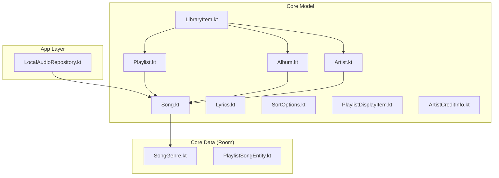
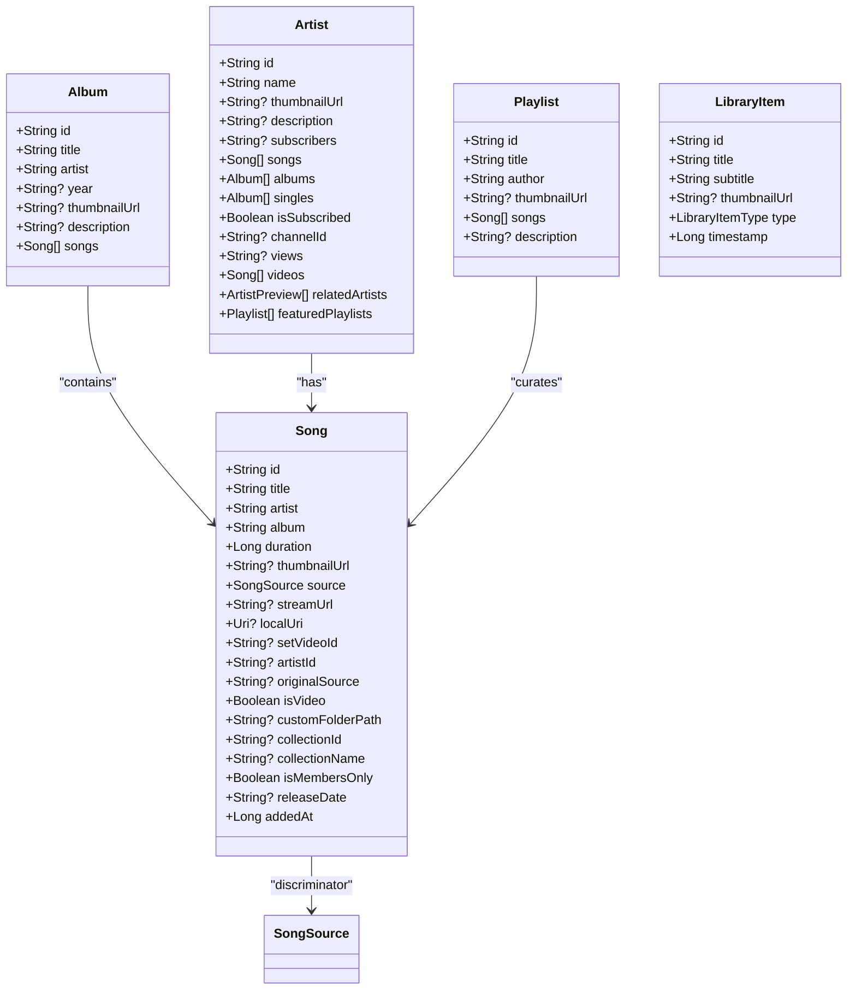
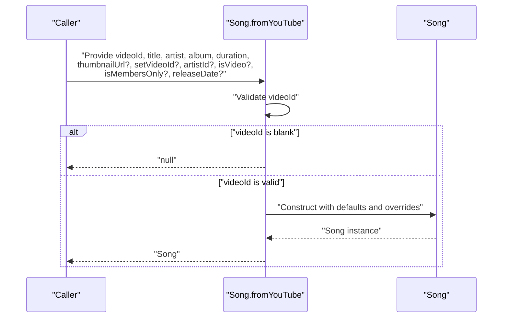
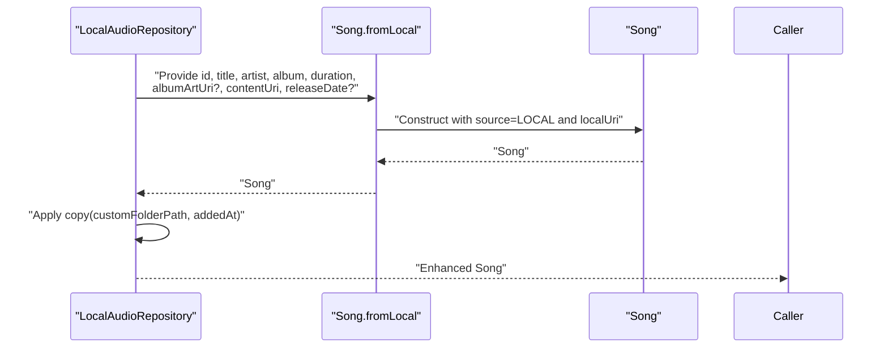
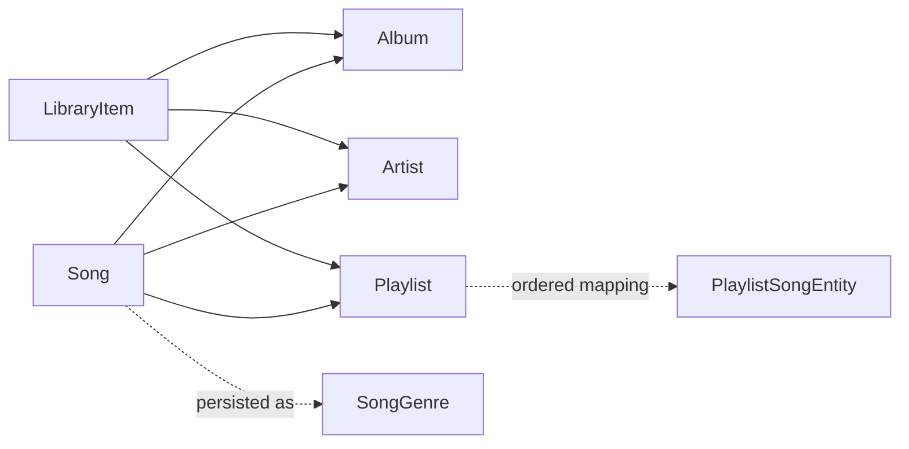

# Core Model

<cite>
**Referenced Files in This Document**
- [Song.kt](file://core/model/src/main/java/com/suvojeet/suvmusic/core/model/Song.kt)
- [Album.kt](file://core/model/src/main/java/com/suvojeet/suvmusic/core/model/Album.kt)
- [Artist.kt](file://core/model/src/main/java/com/suvojeet/suvmusic/core/model/Artist.kt)
- [Playlist.kt](file://core/model/src/main/java/com/suvojeet/suvmusic/core/model/Playlist.kt)
- [LibraryItem.kt](file://core/model/src/main/java/com/suvojeet/suvmusic/core/model/LibraryItem.kt)
- [Lyrics.kt](file://core/model/src/main/java/com/suvojeet/suvmusic/core/model/Lyrics.kt)
- [SortOptions.kt](file://core/model/src/main/java/com/suvojeet/suvmusic/core/model/SortOptions.kt)
- [PlaylistDisplayItem.kt](file://core/model/src/main/java/com/suvojeet/suvmusic/core/model/PlaylistDisplayItem.kt)
- [ArtistCreditInfo.kt](file://core/model/src/main/java/com/suvojeet/suvmusic/core/model/ArtistCreditInfo.kt)
- [LocalAudioRepository.kt](file://app/src/main/java/com/suvojeet/suvmusic/data/repository/LocalAudioRepository.kt)
- [SongGenre.kt](file://core/data/src/main/java/com/suvojeet/suvmusic/core/data/local/entity/SongGenre.kt)
- [PlaylistSongEntity.kt](file://core/data/src/main/java/com/suvojeet/suvmusic/core/data/local/entity/PlaylistSongEntity.kt)
</cite>

## Table of Contents
1. [Introduction](#introduction)
2. [Project Structure](#project-structure)
3. [Core Components](#core-components)
4. [Architecture Overview](#architecture-overview)
5. [Detailed Component Analysis](#detailed-component-analysis)
6. [Dependency Analysis](#dependency-analysis)
7. [Performance Considerations](#performance-considerations)
8. [Troubleshooting Guide](#troubleshooting-guide)
9. [Conclusion](#conclusion)
10. [Appendices](#appendices)

## Introduction
This document describes the Core Model module that defines the fundamental data structures and entities used across SuvMusic. It focuses on the Song data class and its factory methods for YouTube, JioSaavn, and local files, along with related entities such as Album, Artist, Playlist, and LibraryItem. It also covers validation rules, immutability guarantees via Kotlin data classes, serialization considerations, and usage patterns that maintain type safety across the application.

## Project Structure
The Core Model resides in the core module under core/model. It is complemented by:
- Local repository code that constructs Song instances from Android’s MediaStore (local audio).
- Room entity definitions that persist Song-related metadata and relationships.
- Supporting models for lyrics, sort options, and display items.

**Diagram sources**
- [Song.kt:1-129](file://core/model/src/main/java/com/suvojeet/suvmusic/core/model/Song.kt#L1-L129)
- [Album.kt:1-12](file://core/model/src/main/java/com/suvojeet/suvmusic/core/model/Album.kt#L1-L12)
- [Artist.kt:1-26](file://core/model/src/main/java/com/suvojeet/suvmusic/core/model/Artist.kt#L1-L26)
- [Playlist.kt:1-11](file://core/model/src/main/java/com/suvojeet/suvmusic/core/model/Playlist.kt#L1-L11)
- [LibraryItem.kt:1-18](file://core/model/src/main/java/com/suvojeet/suvmusic/core/model/LibraryItem.kt#L1-L18)
- [Lyrics.kt:1-34](file://core/model/src/main/java/com/suvojeet/suvmusic/core/model/Lyrics.kt#L1-L34)
- [SortOptions.kt:1-16](file://core/model/src/main/java/com/suvojeet/suvmusic/core/model/SortOptions.kt#L1-L16)
- [PlaylistDisplayItem.kt:1-24](file://core/model/src/main/java/com/suvojeet/suvmusic/core/model/PlaylistDisplayItem.kt#L1-L24)
- [ArtistCreditInfo.kt:1-12](file://core/model/src/main/java/com/suvojeet/suvmusic/core/model/ArtistCreditInfo.kt#L1-L12)
- [LocalAudioRepository.kt:1-432](file://app/src/main/java/com/suvojeet/suvmusic/data/repository/LocalAudioRepository.kt#L1-L432)
- [SongGenre.kt:1-45](file://core/data/src/main/java/com/suvojeet/suvmusic/core/data/local/entity/SongGenre.kt#L1-L45)
- [PlaylistSongEntity.kt:1-25](file://core/data/src/main/java/com/suvojeet/suvmusic/core/data/local/entity/PlaylistSongEntity.kt#L1-L25)

**Section sources**
- [Song.kt:1-129](file://core/model/src/main/java/com/suvojeet/suvmusic/core/model/Song.kt#L1-L129)
- [LocalAudioRepository.kt:1-432](file://app/src/main/java/com/suvojeet/suvmusic/data/repository/LocalAudioRepository.kt#L1-L432)

## Core Components
This section documents the primary entities and their roles.

- Song: A unified representation of a track supporting YouTube, YouTube Music, JioSaavn, and local files. Factory methods ensure validated construction and consistent defaults.
- Album: Represents a music album with optional metadata and a list of associated songs.
- Artist: Represents an artist with optional metadata, lists of songs, albums, and related entities.
- Playlist: Represents a curated list of songs with optional metadata.
- LibraryItem: A generic library entry wrapper for playlists, albums, artists, and unknown types.
- Lyrics: Defines lyrics data structures and provider types.
- SortOptions: Enumerations for sort types and orders.
- PlaylistDisplayItem: UI-focused representation of a playlist with helpers to extract identifiers.
- ArtistCreditInfo: Minimal artist credit info with optional identifiers.

**Section sources**
- [Song.kt:1-129](file://core/model/src/main/java/com/suvojeet/suvmusic/core/model/Song.kt#L1-L129)
- [Album.kt:1-12](file://core/model/src/main/java/com/suvojeet/suvmusic/core/model/Album.kt#L1-L12)
- [Artist.kt:1-26](file://core/model/src/main/java/com/suvojeet/suvmusic/core/model/Artist.kt#L1-L26)
- [Playlist.kt:1-11](file://core/model/src/main/java/com/suvojeet/suvmusic/core/model/Playlist.kt#L1-L11)
- [LibraryItem.kt:1-18](file://core/model/src/main/java/com/suvojeet/suvmusic/core/model/LibraryItem.kt#L1-L18)
- [Lyrics.kt:1-34](file://core/model/src/main/java/com/suvojeet/suvmusic/core/model/Lyrics.kt#L1-L34)
- [SortOptions.kt:1-16](file://core/model/src/main/java/com/suvojeet/suvmusic/core/model/SortOptions.kt#L1-L16)
- [PlaylistDisplayItem.kt:1-24](file://core/model/src/main/java/com/suvojeet/suvmusic/core/model/PlaylistDisplayItem.kt#L1-L24)
- [ArtistCreditInfo.kt:1-12](file://core/model/src/main/java/com/suvojeet/suvmusic/core/model/ArtistCreditInfo.kt#L1-L12)

## Architecture Overview
The Core Model enforces type safety and cross-source compatibility by:
- Using a single Song interface for all sources with a source discriminator.
- Providing factory methods that validate inputs and apply defaults.
- Keeping higher-level entities (Album, Artist, Playlist) as pure data carriers.
- Persisting normalized forms via Room entities that mirror Song semantics.

**Diagram sources**
- [Song.kt:1-129](file://core/model/src/main/java/com/suvojeet/suvmusic/core/model/Song.kt#L1-L129)
- [Album.kt:1-12](file://core/model/src/main/java/com/suvojeet/suvmusic/core/model/Album.kt#L1-L12)
- [Artist.kt:1-26](file://core/model/src/main/java/com/suvojeet/suvmusic/core/model/Artist.kt#L1-L26)
- [Playlist.kt:1-11](file://core/model/src/main/java/com/suvojeet/suvmusic/core/model/Playlist.kt#L1-L11)
- [LibraryItem.kt:1-18](file://core/model/src/main/java/com/suvojeet/suvmusic/core/model/LibraryItem.kt#L1-L18)

## Detailed Component Analysis

### Song: Unified Track Representation
Song is a data class that encapsulates a playable track across multiple sources. It includes:
- Identity and metadata: id, title, artist, album, duration, thumbnailUrl.
- Source-specific fields: streamUrl (YouTube/JioSaavn), localUri (Android Uri for local files), setVideoId (playlist instance identifier), artistId (navigation).
- Quality and access flags: isVideo, isMembersOnly.
- Collections and provenance: collectionId, collectionName, originalSource.
- Timestamps and release info: releaseDate, addedAt.

Factory methods:
- fromYouTube: Validates videoId and sets default thumbnail if missing.
- fromLocal: Converts Android MediaStore fields into a Song with localUri and optional album art.
- fromJioSaavn: Validates songId and sets source to JIOOSAAVN.

Validation and defaults:
- Blank identifiers return null for YouTube/JioSaavn factories.
- Default thumbnail for YouTube uses a standard URL pattern when none provided.
- Defaults for booleans and nullable fields ensure safe rendering.

Immutability and equality:
- Kotlin data class semantics provide structural equality and copy operations.

Serialization considerations:
- Companion object factory methods imply that external systems may serialize/deserialize SongSource and related fields. Ensure enums are handled consistently during JSON conversion.

Usage patterns:
- LocalAudioRepository constructs Song instances from MediaStore cursors and enriches with filesystem path and added timestamps.
- Recommendation pipeline consumes Song for scoring and filtering.

Examples (described):
- Creating a YouTube-backed Song: call the YouTube factory with a non-blank videoId and basic metadata; receive a validated Song or null.
- Creating a local Song: call the local factory with MediaStore-provided id, title, artist, album, duration, albumArtUri, and contentUri; Song is guaranteed non-null.
- Creating a JioSaavn Song: call the JioSaavn factory with a non-blank songId; receive a validated Song or null.

Comparison operations:
- Structural equality via data class equals/hashCode.
- Copy operations to derive transformed variants (e.g., adding metadata).

**Section sources**
- [Song.kt:1-129](file://core/model/src/main/java/com/suvojeet/suvmusic/core/model/Song.kt#L1-L129)
- [LocalAudioRepository.kt:104-117](file://app/src/main/java/com/suvojeet/suvmusic/data/repository/LocalAudioRepository.kt#L104-L117)

#### Song Creation Flow (YouTube)

**Diagram sources**
- [Song.kt:34-62](file://core/model/src/main/java/com/suvojeet/suvmusic/core/model/Song.kt#L34-L62)

#### Song Creation Flow (Local)

**Diagram sources**
- [LocalAudioRepository.kt:104-117](file://app/src/main/java/com/suvojeet/suvmusic/data/repository/LocalAudioRepository.kt#L104-L117)
- [Song.kt:67-88](file://core/model/src/main/java/com/suvojeet/suvmusic/core/model/Song.kt#L67-L88)

### SongSource Enumeration
SongSource enumerates supported origins:
- YOUTUBE, YOUTUBE_MUSIC, LOCAL, DOWNLOADED, JIOSAAVN.

Usage:
- Discriminator field in Song determines runtime behavior (streaming vs local playback).
- UI and persistence layers rely on this enum to render and store source-specific metadata.

**Section sources**
- [Song.kt:122-128](file://core/model/src/main/java/com/suvojeet/suvmusic/core/model/Song.kt#L122-L128)

### Album
Represents an album with optional year, description, and a list of associated songs. Useful for browsing and grouping.

**Section sources**
- [Album.kt:1-12](file://core/model/src/main/java/com/suvojeet/suvmusic/core/model/Album.kt#L1-L12)

### Artist
Represents an artist with optional metadata and collections of songs, albums, singles, videos, and related artists. Supports subscription and channel information.

**Section sources**
- [Artist.kt:1-26](file://core/model/src/main/java/com/suvojeet/suvmusic/core/model/Artist.kt#L1-L26)

### Playlist
Represents a curated list of songs with optional description and metadata.

**Section sources**
- [Playlist.kt:1-11](file://core/model/src/main/java/com/suvojeet/suvmusic/core/model/Playlist.kt#L1-L11)

### LibraryItem
Generic library entry wrapper for playlists, albums, artists, and unknown types, with a timestamp for ordering.

**Section sources**
- [LibraryItem.kt:1-18](file://core/model/src/main/java/com/suvojeet/suvmusic/core/model/LibraryItem.kt#L1-L18)

### Lyrics
Defines lyrics structures and provider types:
- Lyrics: container for lines, sync flag, provider type, and optional credit.
- LyricsLine: text with timing and optional word-level breakdown.
- LyricsWord: individual word timing.
- LyricsProviderType: enumeration of providers including Auto, LRCLIB, JioSaavn, YouTube captions, Better Lyrics, SimpMusic, Kugou, and Local.

**Section sources**
- [Lyrics.kt:1-34](file://core/model/src/main/java/com/suvojeet/suvmusic/core/model/Lyrics.kt#L1-L34)

### SortOptions
Enumerations for sort type and order used across browsing and library views.

**Section sources**
- [SortOptions.kt:1-16](file://core/model/src/main/java/com/suvojeet/suvmusic/core/model/SortOptions.kt#L1-L16)

### PlaylistDisplayItem
UI-focused playlist representation with helper to extract playlist ID from URL.

**Section sources**
- [PlaylistDisplayItem.kt:1-24](file://core/model/src/main/java/com/suvojeet/suvmusic/core/model/PlaylistDisplayItem.kt#L1-L24)

### ArtistCreditInfo
Minimal artist credit info with optional thumbnail and identifier.

**Section sources**
- [ArtistCreditInfo.kt:1-12](file://core/model/src/main/java/com/suvojeet/suvmusic/core/model/ArtistCreditInfo.kt#L1-L12)

## Dependency Analysis
Core Model entities form a cohesive hierarchy:
- Song is consumed by Album, Artist, and Playlist.
- LibraryItem wraps higher-level entities for unified UI handling.
- Persistence entities mirror Song semantics for caching and ordering.

**Diagram sources**
- [Song.kt:1-129](file://core/model/src/main/java/com/suvojeet/suvmusic/core/model/Song.kt#L1-L129)
- [Album.kt:1-12](file://core/model/src/main/java/com/suvojeet/suvmusic/core/model/Album.kt#L1-L12)
- [Artist.kt:1-26](file://core/model/src/main/java/com/suvojeet/suvmusic/core/model/Artist.kt#L1-L26)
- [Playlist.kt:1-11](file://core/model/src/main/java/com/suvojeet/suvmusic/core/model/Playlist.kt#L1-L11)
- [LibraryItem.kt:1-18](file://core/model/src/main/java/com/suvojeet/suvmusic/core/model/LibraryItem.kt#L1-L18)
- [SongGenre.kt:1-45](file://core/data/src/main/java/com/suvojeet/suvmusic/core/data/local/entity/SongGenre.kt#L1-L45)
- [PlaylistSongEntity.kt:1-25](file://core/data/src/main/java/com/suvojeet/suvmusic/core/data/local/entity/PlaylistSongEntity.kt#L1-L25)

## Performance Considerations
- Prefer factory methods for Song construction to centralize validation and reduce branching errors.
- Use immutable data classes to avoid defensive copying and enable efficient equality checks.
- For large libraries, leverage Room entities (e.g., PlaylistSongEntity) to store ordered, denormalized views of Song metadata to minimize joins during playback queue operations.
- When serializing SongSource and other enums, ensure consistent string representations across platforms to prevent deserialization failures.

## Troubleshooting Guide
Common issues and resolutions:
- Null returned from YouTube/JioSaavn factories: occurs when identifiers are blank. Validate inputs before calling factories.
- Local playback failures: confirm localUri is a valid MediaStore content URI and accessible to the app.
- Thumbnail resolution: YouTube thumbnails are defaulted when absent; ensure network availability for dynamic URLs.
- Sorting inconsistencies: align UI sort selections with SortOptions enumerations to avoid unexpected ordering.

**Section sources**
- [Song.kt:47-47](file://core/model/src/main/java/com/suvojeet/suvmusic/core/model/Song.kt#L47-L47)
- [Song.kt:103-103](file://core/model/src/main/java/com/suvojeet/suvmusic/core/model/Song.kt#L103-L103)
- [LocalAudioRepository.kt:94-102](file://app/src/main/java/com/suvojeet/suvmusic/data/repository/LocalAudioRepository.kt#L94-L102)

## Conclusion
The Core Model establishes a robust, type-safe foundation for SuvMusic by unifying diverse media sources under a single Song abstraction, enforcing validation via factory methods, and structuring higher-level entities for predictable composition. Together with Room-backed persistence and UI-focused display models, the Core Model ensures consistent behavior across playback, discovery, and library management.

## Appendices

### Data Validation Rules
- YouTube/JioSaavn factories reject blank identifiers and return null.
- Default thumbnail URL generation for YouTube when none provided.
- Local Song construction requires a valid content URI and album art URI.

**Section sources**
- [Song.kt:47-61](file://core/model/src/main/java/com/suvojeet/suvmusic/core/model/Song.kt#L47-L61)
- [Song.kt:103-115](file://core/model/src/main/java/com/suvojeet/suvmusic/core/model/Song.kt#L103-L115)
- [LocalAudioRepository.kt:104-117](file://app/src/main/java/com/suvojeet/suvmusic/data/repository/LocalAudioRepository.kt#L104-L117)

### Immutability and Equality Guarantees
- Kotlin data classes provide structural equality and copy semantics.
- Recommended practice: treat instances as immutable after construction; use copy for transformations.

**Section sources**
- [Song.kt:9-29](file://core/model/src/main/java/com/suvojeet/suvmusic/core/model/Song.kt#L9-L29)

### Serialization Considerations
- SongSource and related enums must be serialized consistently across JSON boundaries.
- Provider types in Lyrics should be represented as strings matching enum display names for interoperability.

**Section sources**
- [Song.kt:122-128](file://core/model/src/main/java/com/suvojeet/suvmusic/core/model/Song.kt#L122-L128)
- [Lyrics.kt:10-19](file://core/model/src/main/java/com/suvojeet/suvmusic/core/model/Lyrics.kt#L10-L19)