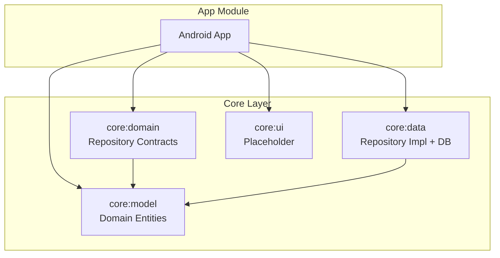
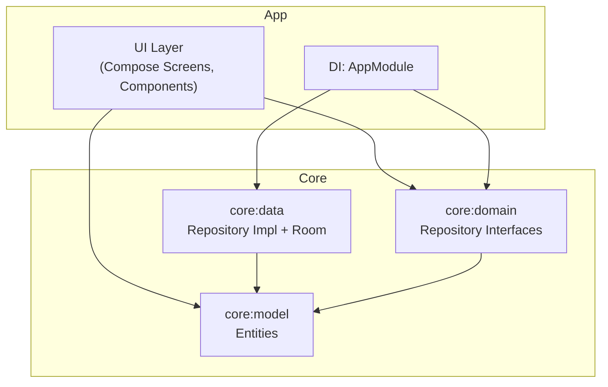
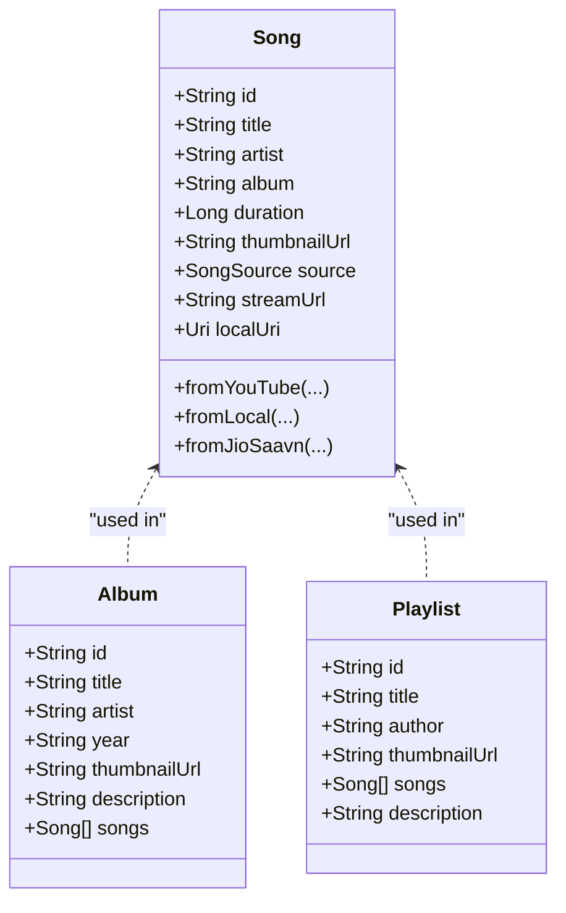
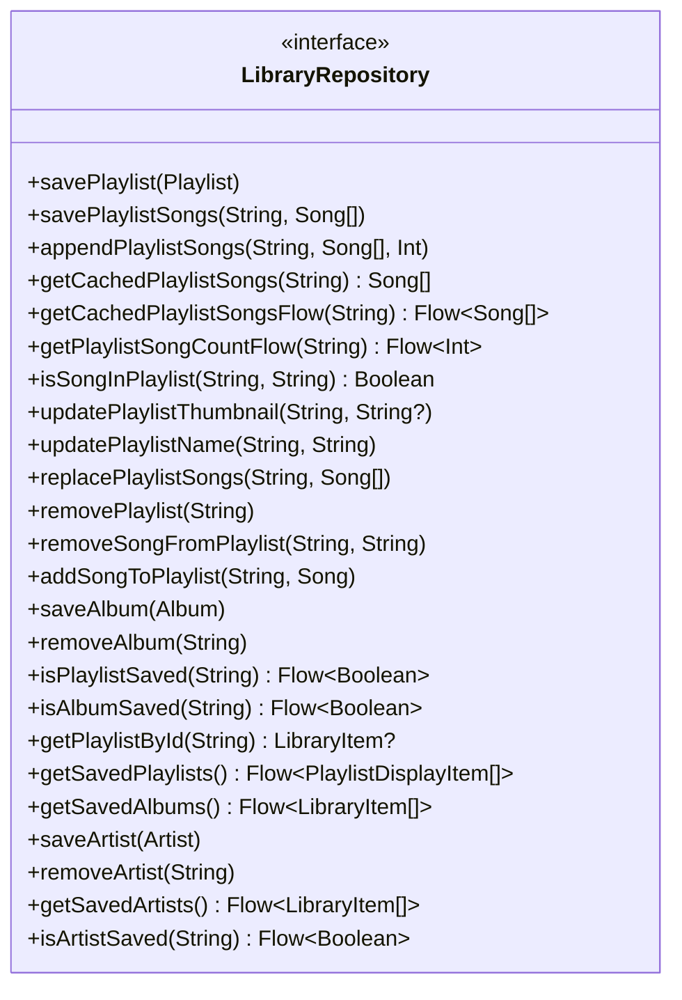
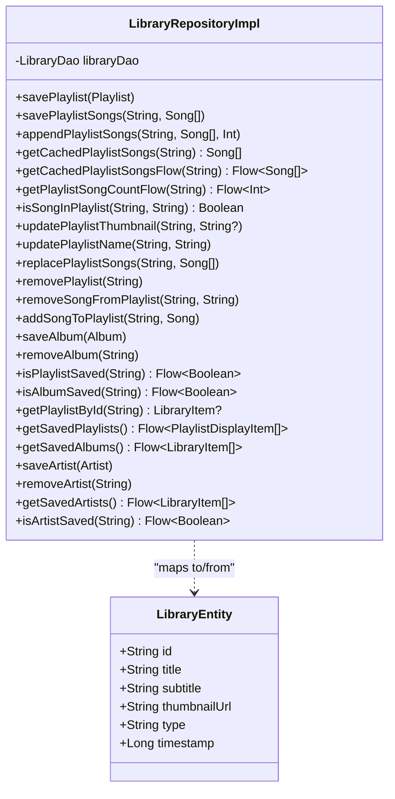
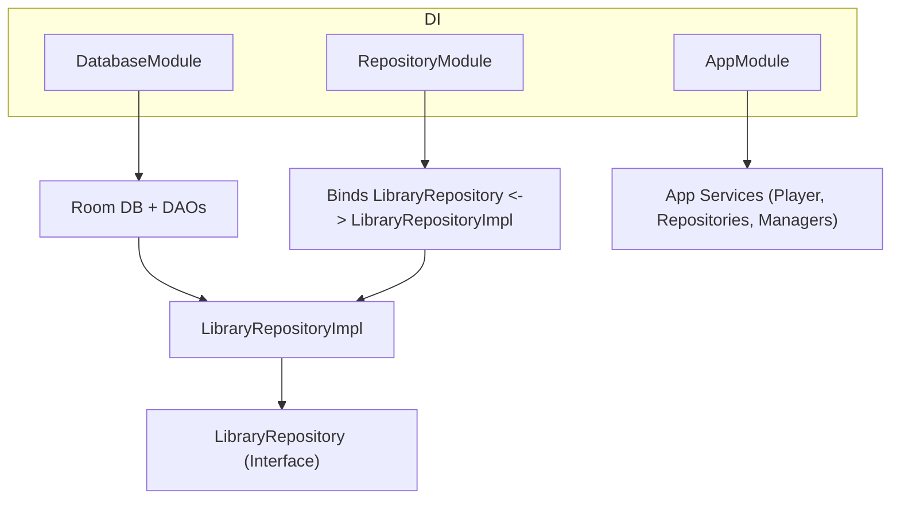
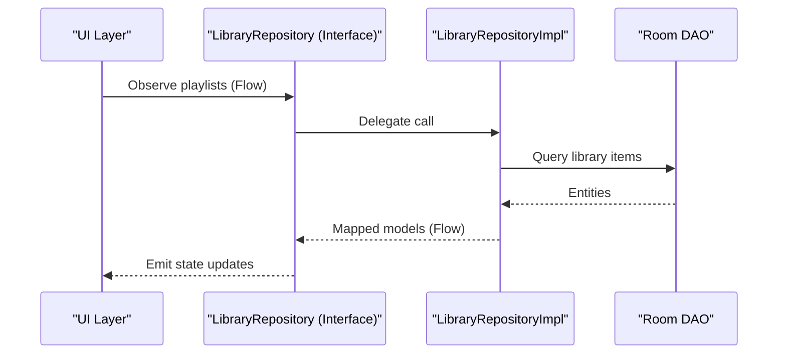
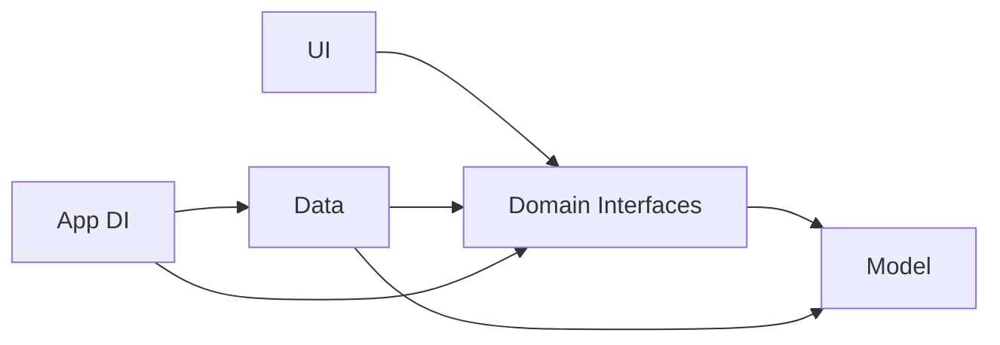

# Core Modules

<cite>
**Referenced Files in This Document**
- [README.md](file://README.md)
- [settings.gradle.kts](file://settings.gradle.kts)
- [build.gradle.kts](file://build.gradle.kts)
- [Song.kt](file://core/model/src/main/java/com/suvojeet/suvmusic/core/model/Song.kt)
- [Album.kt](file://core/model/src/main/java/com/suvojeet/suvmusic/core/model/Album.kt)
- [Playlist.kt](file://core/model/src/main/java/com/suvojeet/suvmusic/core/model/Playlist.kt)
- [LibraryRepository.kt](file://core/domain/src/main/java/com/suvojeet/suvmusic/core/domain/repository/LibraryRepository.kt)
- [LibraryRepositoryImpl.kt](file://core/data/src/main/java/com/suvojeet/suvmusic/core/data/repository/LibraryRepositoryImpl.kt)
- [LibraryEntity.kt](file://core/data/src/main/java/com/suvojeet/suvmusic/core/data/local/entity/LibraryEntity.kt)
- [DatabaseModule.kt](file://core/data/src/main/java/com/suvojeet/suvmusic/core/data/di/DatabaseModule.kt)
- [RepositoryModule.kt](file://core/data/src/main/java/com/suvojeet/suvmusic/core/data/di/RepositoryModule.kt)
- [Theme.kt](file://app/src/main/java/com/suvojeet/luvmusic/ui/theme/Theme.kt)
- [AppModule.kt](file://app/src/main/java/com/suvojeet/suvmusic/di/AppModule.kt)
</cite>

## Table of Contents
1. [Introduction](#introduction)
2. [Project Structure](#project-structure)
3. [Core Components](#core-components)
4. [Architecture Overview](#architecture-overview)
5. [Detailed Component Analysis](#detailed-component-analysis)
6. [Dependency Analysis](#dependency-analysis)
7. [Performance Considerations](#performance-considerations)
8. [Troubleshooting Guide](#troubleshooting-guide)
9. [Conclusion](#conclusion)

## Introduction
This document explains SuvMusic’s core modules following Clean Architecture principles. The application is organized into four layers:
- Core Model: Shared domain data structures used across the app.
- Core Domain: Business logic contracts (repositories) that define capabilities without exposing implementation details.
- Core Data: Implementation of domain contracts backed by local persistence and infrastructure.
- UI: Presentation layer (Jetpack Compose) that depends on domain interfaces and orchestrates user interactions.

Clean Architecture enforces:
- Independence of modules: Domain and Model are free from framework and UI concerns.
- Testability: Domain interfaces can be mocked; Data implementations can be unit-tested with in-memory databases.
- Feature isolation: Each module encapsulates responsibilities and exposes minimal public contracts.

## Project Structure
The project uses a multi-module Gradle setup with explicit module boundaries:
- app: Android application module containing UI, DI, services, and platform integrations.
- core:model: Pure Kotlin data classes representing domain entities.
- core:domain: Interfaces defining business capabilities.
- core:data: Room-based persistence and repository implementations.
- Other feature modules (e.g., updater, media-source, scrobbler, lyric-*): Optional features integrated via DI.

**Diagram sources**
- [settings.gradle.kts:27-30](file://settings.gradle.kts#L27-L30)
- [build.gradle.kts:1-10](file://build.gradle.kts#L1-L10)

**Section sources**
- [README.md:94-104](file://README.md#L94-L104)
- [settings.gradle.kts:18-30](file://settings.gradle.kts#L18-L30)
- [build.gradle.kts:1-10](file://build.gradle.kts#L1-L10)

## Core Components
This section documents the responsibilities and interfaces of each core module.

- Core Model
  - Purpose: Define immutable, framework-agnostic data structures used throughout the app.
  - Examples: Song, Album, Playlist, and related enumerations.
  - Responsibilities:
    - Encapsulate entity shape and construction helpers (e.g., Song.fromYouTube, Song.fromLocal).
    - Provide stable identifiers and metadata for UI and persistence.
  - Benefits:
    - UI and Data layers consume these models without depending on each other.
    - Facilitates testing by allowing deterministic model creation.

- Core Domain
  - Purpose: Define business contracts (repository interfaces) that abstract capabilities.
  - Example: LibraryRepository defines playlist/album/artist persistence and queries.
  - Responsibilities:
    - Expose typed operations (save, load, observe) via coroutines and Flow.
    - Keep implementation details hidden behind interfaces.
  - Benefits:
    - Enables mocking in UI tests.
    - Allows swapping implementations (e.g., cloud sync) without affecting UI.

- Core Data
  - Purpose: Implement domain contracts using local persistence and infrastructure.
  - Example: LibraryRepositoryImpl implements LibraryRepository using Room DAOs and entities.
  - Responsibilities:
    - Map between domain models and local entities.
    - Provide transaction-safe writes and efficient reads.
    - Expose reactive streams via Flow.
  - Benefits:
    - Centralizes persistence logic.
    - Supports testability with in-memory databases.

- Core UI
  - Purpose: Present data and accept user actions; depend on domain interfaces.
  - Example: Themes, components, and screens consume domain models and repository interfaces.
  - Responsibilities:
    - Render UI, handle gestures, and orchestrate navigation.
    - Observe repository flows to reflect state changes.
  - Benefits:
    - UI remains agnostic to persistence and networking.
    - Simplifies testing with fake repositories.

**Section sources**
- [Song.kt:1-129](file://core/model/src/main/java/com/suvojeet/suvmusic/core/model/Song.kt#L1-L129)
- [Album.kt:1-12](file://core/model/src/main/java/com/suvojeet/suvmusic/core/model/Album.kt#L1-L12)
- [Playlist.kt:1-11](file://core/model/src/main/java/com/suvojeet/suvmusic/core/model/Playlist.kt#L1-L11)
- [LibraryRepository.kt:1-37](file://core/domain/src/main/java/com/suvojeet/suvmusic/core/domain/repository/LibraryRepository.kt#L1-L37)
- [LibraryRepositoryImpl.kt:1-252](file://core/data/src/main/java/com/suvojeet/suvmusic/core/data/repository/LibraryRepositoryImpl.kt#L1-L252)
- [LibraryEntity.kt:1-25](file://core/data/src/main/java/com/suvojeet/suvmusic/core/data/local/entity/LibraryEntity.kt#L1-L25)

## Architecture Overview
Clean Architecture separates concerns into distinct layers. The diagram below maps actual modules and their relationships.

**Diagram sources**
- [AppModule.kt:1-167](file://app/src/main/java/com/suvojeet/suvmusic/di/AppModule.kt#L1-L167)
- [LibraryRepository.kt:1-37](file://core/domain/src/main/java/com/suvojeet/suvmusic/core/domain/repository/LibraryRepository.kt#L1-L37)
- [LibraryRepositoryImpl.kt:1-252](file://core/data/src/main/java/com/suvojeet/suvmusic/core/data/repository/LibraryRepositoryImpl.kt#L1-L252)
- [Song.kt:1-129](file://core/model/src/main/java/com/suvojeet/suvmusic/core/model/Song.kt#L1-L129)

## Detailed Component Analysis

### Core Model: Entities and Factories
- Song
  - Purpose: Unified representation of playable items from multiple sources.
  - Key attributes: identifiers, metadata, source, and optional local URI.
  - Factories: fromYouTube, fromLocal, fromJioSaavn encapsulate creation logic and validation.
- Album and Playlist
  - Purpose: Aggregate entities for library management and UI presentation.
- Implications:
  - UI components render these models uniformly regardless of origin.
  - Data layer persists and retrieves these models consistently.

**Diagram sources**
- [Song.kt:1-129](file://core/model/src/main/java/com/suvojeet/suvmusic/core/model/Song.kt#L1-L129)
- [Album.kt:1-12](file://core/model/src/main/java/com/suvojeet/suvmusic/core/model/Album.kt#L1-L12)
- [Playlist.kt:1-11](file://core/model/src/main/java/com/suvojeet/suvmusic/core/model/Playlist.kt#L1-L11)

**Section sources**
- [Song.kt:1-129](file://core/model/src/main/java/com/suvojeet/suvmusic/core/model/Song.kt#L1-L129)
- [Album.kt:1-12](file://core/model/src/main/java/com/suvojeet/suvmusic/core/model/Album.kt#L1-L12)
- [Playlist.kt:1-11](file://core/model/src/main/java/com/suvojeet/suvmusic/core/model/Playlist.kt#L1-L11)

### Core Domain: Repository Contracts
- LibraryRepository
  - Purpose: Define library operations (playlists, albums, artists) with reactive streams.
  - Capabilities: Save/remove items, query counts, check membership, observe changes.
  - Design: Returns Flow for state observation; suspending functions for mutations.

**Diagram sources**
- [LibraryRepository.kt:1-37](file://core/domain/src/main/java/com/suvojeet/suvmusic/core/domain/repository/LibraryRepository.kt#L1-L37)

**Section sources**
- [LibraryRepository.kt:1-37](file://core/domain/src/main/java/com/suvojeet/suvmusic/core/domain/repository/LibraryRepository.kt#L1-L37)

### Core Data: Repository Implementation and Persistence
- LibraryRepositoryImpl
  - Purpose: Implements LibraryRepository using Room DAOs and entities.
  - Mapping: Converts between domain models and local entities.
  - Streams: Exposes Flow-based queries for reactive UI updates.
- Room Entities and DAOs
  - LibraryEntity stores library items (PLAYLIST, ALBUM, ARTIST) with counts and timestamps.
  - DAOs provide CRUD and aggregation queries.

**Diagram sources**
- [LibraryRepositoryImpl.kt:1-252](file://core/data/src/main/java/com/suvojeet/suvmusic/core/data/repository/LibraryRepositoryImpl.kt#L1-L252)
- [LibraryEntity.kt:1-25](file://core/data/src/main/java/com/suvojeet/suvmusic/core/data/local/entity/LibraryEntity.kt#L1-L25)

**Section sources**
- [LibraryRepositoryImpl.kt:1-252](file://core/data/src/main/java/com/suvojeet/suvmusic/core/data/repository/LibraryRepositoryImpl.kt#L1-L252)
- [LibraryEntity.kt:1-25](file://core/data/src/main/java/com/suvojeet/suvmusic/core/data/local/entity/LibraryEntity.kt#L1-L25)

### Dependency Injection and Integration
- Hilt Modules
  - DatabaseModule: Provides Room database and DAOs.
  - RepositoryModule: Binds LibraryRepository to LibraryRepositoryImpl.
  - AppModule: Provides app-level dependencies (network, player, managers) and composes higher-level services.
- Integration Pattern
  - UI observes repository Flow streams.
  - Services (e.g., MusicPlayer) depend on repositories and other infrastructure via DI.

**Diagram sources**
- [DatabaseModule.kt:1-53](file://core/data/src/main/java/com/suvojeet/suvmusic/core/data/di/DatabaseModule.kt#L1-L53)
- [RepositoryModule.kt:1-19](file://core/data/src/main/java/com/suvojeet/suvmusic/core/data/di/RepositoryModule.kt#L1-L19)
- [AppModule.kt:1-167](file://app/src/main/java/com/suvojeet/suvmusic/di/AppModule.kt#L1-L167)

**Section sources**
- [DatabaseModule.kt:1-53](file://core/data/src/main/java/com/suvojeet/suvmusic/core/data/di/DatabaseModule.kt#L1-L53)
- [RepositoryModule.kt:1-19](file://core/data/src/main/java/com/suvojeet/suvmusic/core/data/di/RepositoryModule.kt#L1-L19)
- [AppModule.kt:1-167](file://app/src/main/java/com/suvojeet/suvmusic/di/AppModule.kt#L1-L167)

### UI Abstractions and Theming
- Theme and Composition
  - SuvMusicTheme demonstrates dynamic theming based on dominant colors and system preferences.
  - UI composes screens and components using Material3 and expressive animations.
- UI Dependencies
  - UI consumes domain models and repository interfaces; it does not depend on Room or network internals.
  - Reactive updates come from Flow emissions exposed by repositories.

**Diagram sources**
- [LibraryRepository.kt:1-37](file://core/domain/src/main/java/com/suvojeet/suvmusic/core/domain/repository/LibraryRepository.kt#L1-L37)
- [LibraryRepositoryImpl.kt:1-252](file://core/data/src/main/java/com/suvojeet/suvmusic/core/data/repository/LibraryRepositoryImpl.kt#L1-L252)

**Section sources**
- [Theme.kt:1-306](file://app/src/main/java/com/suvojeet/suvmusic/ui/theme/Theme.kt#L1-L306)

## Dependency Analysis
Clean Architecture minimizes cross-layer coupling:
- UI depends on Domain interfaces only.
- Domain depends on Model only.
- Data depends on Domain (contracts) and Model.
- App module wires DI and composes services.

**Diagram sources**
- [LibraryRepository.kt:1-37](file://core/domain/src/main/java/com/suvojeet/suvmusic/core/domain/repository/LibraryRepository.kt#L1-L37)
- [LibraryRepositoryImpl.kt:1-252](file://core/data/src/main/java/com/suvojeet/suvmusic/core/data/repository/LibraryRepositoryImpl.kt#L1-L252)
- [Song.kt:1-129](file://core/model/src/main/java/com/suvojeet/suvmusic/core/model/Song.kt#L1-L129)
- [AppModule.kt:1-167](file://app/src/main/java/com/suvojeet/suvmusic/di/AppModule.kt#L1-L167)

**Section sources**
- [settings.gradle.kts:18-30](file://settings.gradle.kts#L18-L30)
- [build.gradle.kts:1-10](file://build.gradle.kts#L1-L10)

## Performance Considerations
- Reactive Streams: Using Flow for UI updates avoids unnecessary recompositions and supports backpressure-friendly pipelines.
- Entity Mapping: Efficient mapping between domain models and Room entities reduces overhead.
- DI Scope: Singleton providers minimize object churn for repositories and services.
- Testing: Mocking domain interfaces and substituting in-memory databases improves test performance.

## Troubleshooting Guide
- UI not updating
  - Verify repository Flow emissions and that UI collects them properly.
  - Confirm DI wiring binds the interface to the implementation.
- Data inconsistencies
  - Ensure repository mutations are performed inside transactions or supported batch operations.
  - Validate entity mapping correctness for nullable fields and enums.
- Theme anomalies
  - Confirm dominant color extraction and theme recomposition triggers.
  - Check dynamic color availability on the device.

**Section sources**
- [LibraryRepository.kt:1-37](file://core/domain/src/main/java/com/suvojeet/suvmusic/core/domain/repository/LibraryRepository.kt#L1-L37)
- [LibraryRepositoryImpl.kt:1-252](file://core/data/src/main/java/com/suvojeet/suvmusic/core/data/repository/LibraryRepositoryImpl.kt#L1-L252)
- [Theme.kt:1-306](file://app/src/main/java/com/suvojeet/suvmusic/ui/theme/Theme.kt#L1-L306)

## Conclusion
SuvMusic’s core modules embody Clean Architecture:
- Core Model defines stable, framework-agnostic entities.
- Core Domain isolates business contracts behind interfaces.
- Core Data implements those contracts with persistence and mapping.
- UI remains presentation-focused, dependent only on domain interfaces.
This structure ensures feature isolation, testability, and maintainability while enabling clear extension points (e.g., adding new repository implementations or UI themes).