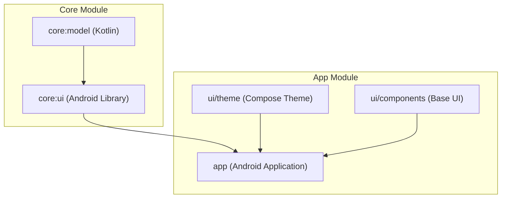
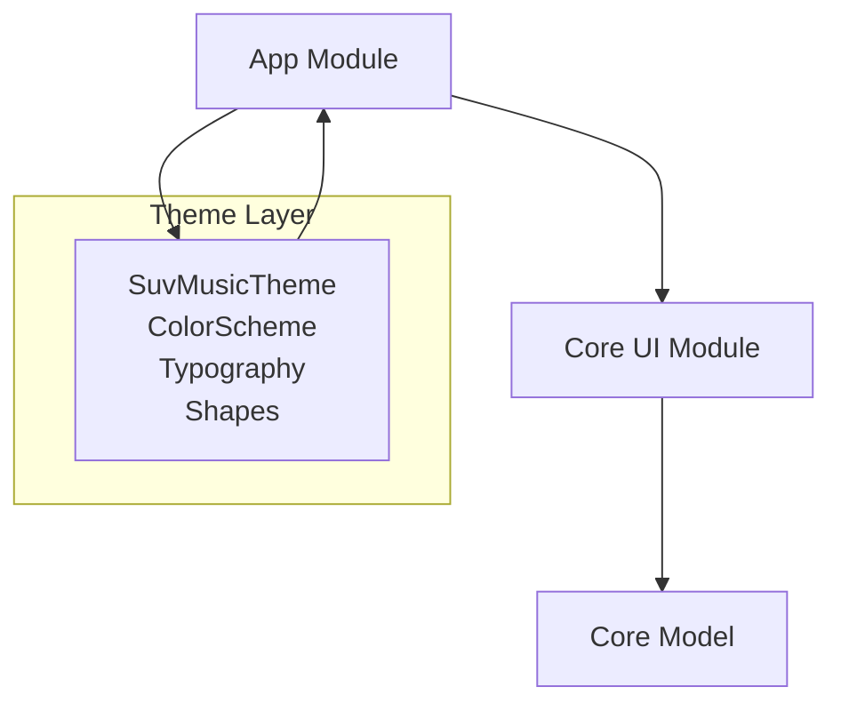
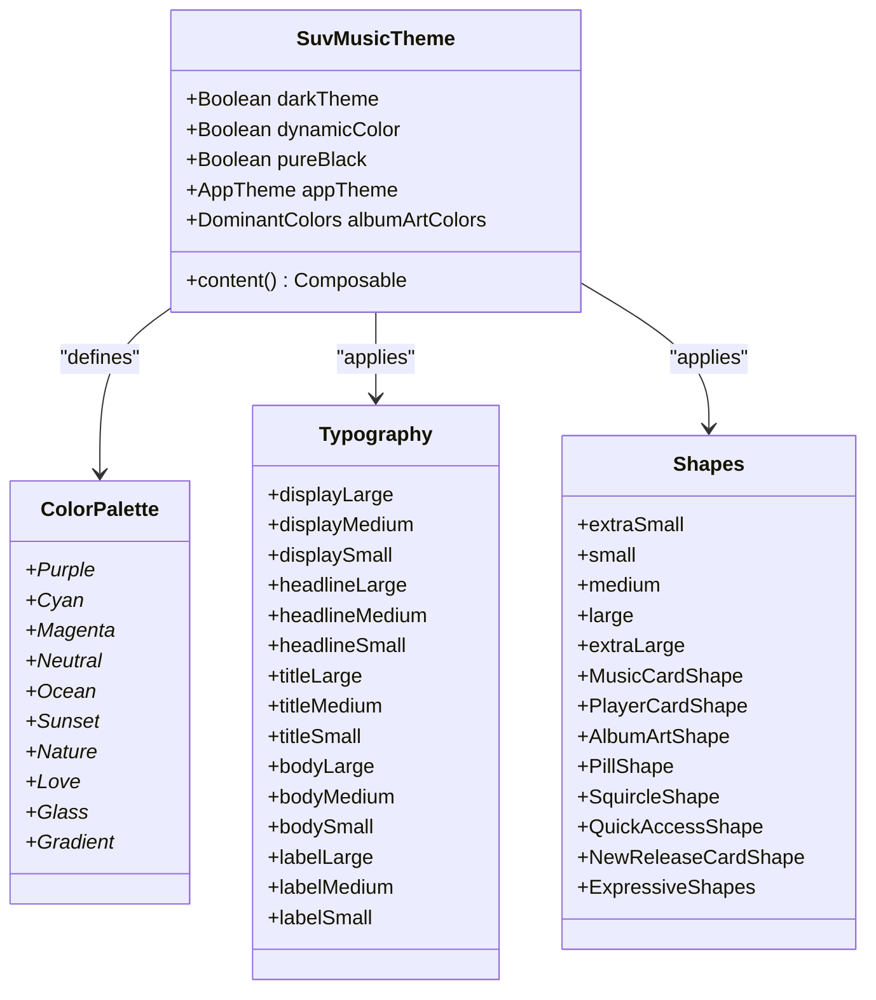
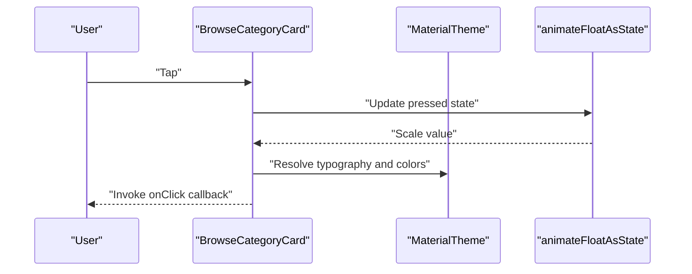
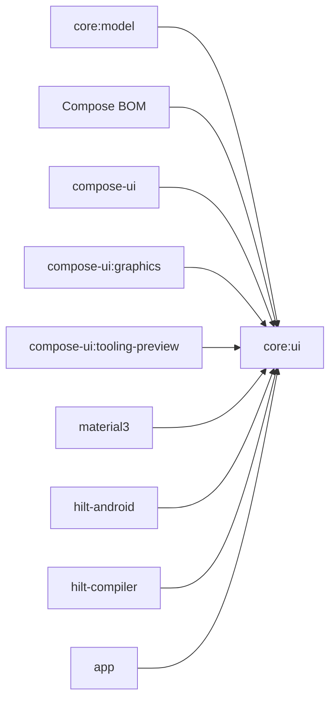

# Core UI

<cite>
**Referenced Files in This Document**
- [AndroidManifest.xml](file://core/ui/src/main/AndroidManifest.xml)
- [build.gradle.kts](file://core/ui/build.gradle.kts)
- [Theme.kt](file://app/src/main/java/com/suvojeet/suvmusic/ui/theme/Theme.kt)
- [Color.kt](file://app/src/main/java/com/suvojeet/suvmusic/ui/theme/Color.kt)
- [Shapes.kt](file://app/src/main/java/com/suvojeet/suvmusic/ui/theme/Shapes.kt)
- [Type.kt](file://app/src/main/java/com/suvojeet/suvmusic/ui/theme/Type.kt)
- [BrowseCategoryCard.kt](file://app/src/main/java/com/suvojeet/suvmusic/ui/components/BrowseCategoryCard.kt)
- [build.gradle.kts](file://app/build.gradle.kts)
</cite>

## Table of Contents
1. [Introduction](#introduction)
2. [Project Structure](#project-structure)
3. [Core Components](#core-components)
4. [Architecture Overview](#architecture-overview)
5. [Detailed Component Analysis](#detailed-component-analysis)
6. [Dependency Analysis](#dependency-analysis)
7. [Performance Considerations](#performance-considerations)
8. [Troubleshooting Guide](#troubleshooting-guide)
9. [Conclusion](#conclusion)

## Introduction
This document describes the Core UI module and its role in defining foundational UI abstractions, base components, and utility functions shared across the application. The Core UI module establishes a cohesive design system grounded in Material 3 and Material 3 Expressive, with theming, typography, shapes, and reusable components that support UI consistency, reusability, and maintainability across feature modules. It also documents component composition patterns and accessibility considerations, and explains how the module contributes to the overall UI system cohesion with a minimal footprint.

## Project Structure
The Core UI module is defined as an Android library module with Jetpack Compose enabled and integrates with the broader application via dependency injection and shared theme definitions. The module itself declares minimal Android manifest content and depends on core model artifacts and Compose libraries. The application module consumes the Core UI module and augments it with feature-specific screens, components, and utilities.

**Diagram sources**
- [build.gradle.kts:31-42](file://core/ui/build.gradle.kts#L31-L42)
- [build.gradle.kts:254-265](file://app/build.gradle.kts#L254-L265)

**Section sources**
- [AndroidManifest.xml:1-3](file://core/ui/src/main/AndroidManifest.xml#L1-L3)
- [build.gradle.kts:1-43](file://core/ui/build.gradle.kts#L1-L43)
- [build.gradle.kts:1-266](file://app/build.gradle.kts#L1-L266)

## Core Components
The Core UI module’s foundational elements are composed of:
- Theming foundation: color palettes, dynamic color support, expressive animations, and shape systems
- Typography system: consistent text styles aligned with Material 3
- Base UI components: reusable primitives that demonstrate composition patterns and accessibility best practices
- Shared utilities: helpers for dominant color extraction and theme-aware rendering

These components collectively enable feature modules to render consistent UI while remaining flexible and maintainable.

**Section sources**
- [Theme.kt:1-306](file://app/src/main/java/com/suvojeet/suvmusic/ui/theme/Theme.kt#L1-L306)
- [Color.kt:1-154](file://app/src/main/java/com/suvojeet/suvmusic/ui/theme/Color.kt#L1-L154)
- [Shapes.kt:1-74](file://app/src/main/java/com/suvojeet/suvmusic/ui/theme/Shapes.kt#L1-L74)
- [Type.kt:1-129](file://app/src/main/java/com/suvojeet/suvmusic/ui/theme/Type.kt#L1-L129)
- [BrowseCategoryCard.kt:1-121](file://app/src/main/java/com/suvojeet/suvmusic/ui/components/BrowseCategoryCard.kt#L1-L121)

## Architecture Overview
The Core UI module participates in a layered architecture:
- Presentation layer: Compose UI and screens
- Theming layer: centralized theme definitions and expressive color/shape/typography systems
- Components layer: base UI components and utility composables
- Domain/data layer: shared models and repositories (via core modules)

The app module consumes the Core UI module and extends it with feature-specific screens and components. The theme system is the central integration point, ensuring consistent rendering across modules.

**Diagram sources**
- [build.gradle.kts:31-42](file://core/ui/build.gradle.kts#L31-L42)
- [build.gradle.kts:254-265](file://app/build.gradle.kts#L254-L265)
- [Theme.kt:207-306](file://app/src/main/java/com/suvojeet/suvmusic/ui/theme/Theme.kt#L207-L306)

## Detailed Component Analysis

### Theming Foundations
The theme system defines:
- Color palettes: predefined schemes (default and thematic variants), dynamic color support, and dominant color extraction
- Expressive animations: smooth transitions for color changes
- Shapes: standard rounded corners and expressive shapes from Material 3 Expressive
- Typography: consistent text styles across display, headline, title, body, and label categories

**Diagram sources**
- [Theme.kt:30-306](file://app/src/main/java/com/suvojeet/suvmusic/ui/theme/Theme.kt#L30-L306)
- [Color.kt:1-154](file://app/src/main/java/com/suvojeet/suvmusic/ui/theme/Color.kt#L1-L154)
- [Type.kt:14-129](file://app/src/main/java/com/suvojeet/suvmusic/ui/theme/Type.kt#L14-L129)
- [Shapes.kt:13-74](file://app/src/main/java/com/suvojeet/suvmusic/ui/theme/Shapes.kt#L13-L74)

**Section sources**
- [Theme.kt:207-306](file://app/src/main/java/com/suvojeet/suvmusic/ui/theme/Theme.kt#L207-L306)
- [Color.kt:1-154](file://app/src/main/java/com/suvojeet/suvmusic/ui/theme/Color.kt#L1-L154)
- [Type.kt:1-129](file://app/src/main/java/com/suvojeet/suvmusic/ui/theme/Type.kt#L1-L129)
- [Shapes.kt:1-74](file://app/src/main/java/com/suvojeet/suvmusic/ui/theme/Shapes.kt#L1-L74)

### Base Component Composition Pattern: BrowseCategoryCard
The BrowseCategoryCard demonstrates a reusable pattern for themed cards:
- Interaction handling with press-state scaling
- Gradient backgrounds derived from category color or a predefined palette
- Overlay for improved text readability
- Accessible click targets and typography alignment

**Diagram sources**
- [BrowseCategoryCard.kt:51-121](file://app/src/main/java/com/suvojeet/suvmusic/ui/components/BrowseCategoryCard.kt#L51-L121)
- [Theme.kt:207-306](file://app/src/main/java/com/suvojeet/suvmusic/ui/theme/Theme.kt#L207-L306)

**Section sources**
- [BrowseCategoryCard.kt:1-121](file://app/src/main/java/com/suvojeet/suvmusic/ui/components/BrowseCategoryCard.kt#L1-L121)

### Accessibility Considerations
Accessibility is addressed through:
- Semantic text styles and contrast-appropriate overlays
- Clear focus and interaction feedback (press-scale animations)
- Dynamic color adaptation for system themes
- Expressive shapes that improve affordance without sacrificing usability

**Section sources**
- [BrowseCategoryCard.kt:61-91](file://app/src/main/java/com/suvojeet/suvmusic/ui/components/BrowseCategoryCard.kt#L61-L91)
- [Theme.kt:253-271](file://app/src/main/java/com/suvojeet/suvmusic/ui/theme/Theme.kt#L253-L271)

## Dependency Analysis
The Core UI module maintains a minimal footprint by depending only on core model artifacts and Compose libraries. The app module integrates Core UI and extends it with feature-specific screens and components, ensuring separation of concerns and reusability.

**Diagram sources**
- [build.gradle.kts:31-42](file://core/ui/build.gradle.kts#L31-L42)
- [build.gradle.kts:254-265](file://app/build.gradle.kts#L254-L265)

**Section sources**
- [build.gradle.kts:31-42](file://core/ui/build.gradle.kts#L31-L42)
- [build.gradle.kts:254-265](file://app/build.gradle.kts#L254-L265)

## Performance Considerations
- Use of animated color transitions is scoped to theme updates and avoids heavy recompositions during normal interactions.
- Shape and typography definitions are centralized to minimize duplication and recomposition overhead.
- Base components leverage precomputed brushes and scales to keep UI updates efficient.
- Dynamic color and expressive shapes are gated behind theme flags to preserve performance when disabled.

[No sources needed since this section provides general guidance]

## Troubleshooting Guide
Common issues and resolutions:
- Theme inconsistencies: Verify that SuvMusicTheme is applied at the root of the app and that dynamicColor flags align with device capabilities.
- Color contrast problems: Ensure overlays and backgrounds meet accessibility contrast ratios; adjust gradient overlays or text colors accordingly.
- Excessive recomposition: Keep state scopes narrow within components and avoid passing large lambdas; prefer precomputing brushes and shapes.
- Shape misuse: Prefer standard rounded corners for most components; reserve expressive shapes for specific UI affordances.

**Section sources**
- [Theme.kt:207-306](file://app/src/main/java/com/suvojeet/suvmusic/ui/theme/Theme.kt#L207-L306)
- [BrowseCategoryCard.kt:79-119](file://app/src/main/java/com/suvojeet/suvmusic/ui/components/BrowseCategoryCard.kt#L79-L119)

## Conclusion
The Core UI module provides a focused, cohesive foundation for the application’s UI system. By centralizing theming, typography, shapes, and base components, it enables consistent, accessible, and maintainable UI across feature modules. Its minimal dependencies and clear integration points ensure scalability and ease of extension, while expressive design choices enhance user engagement without compromising performance or accessibility.