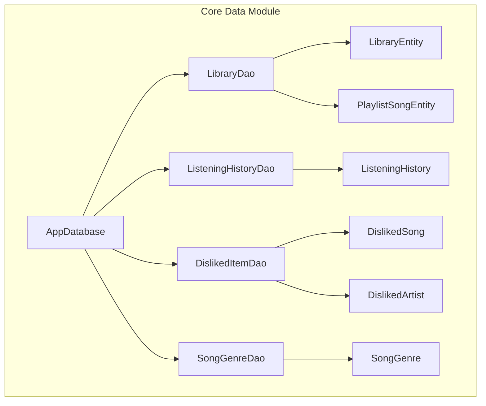
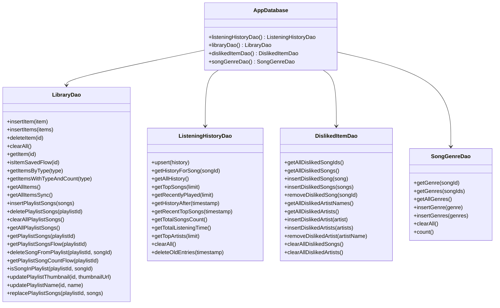
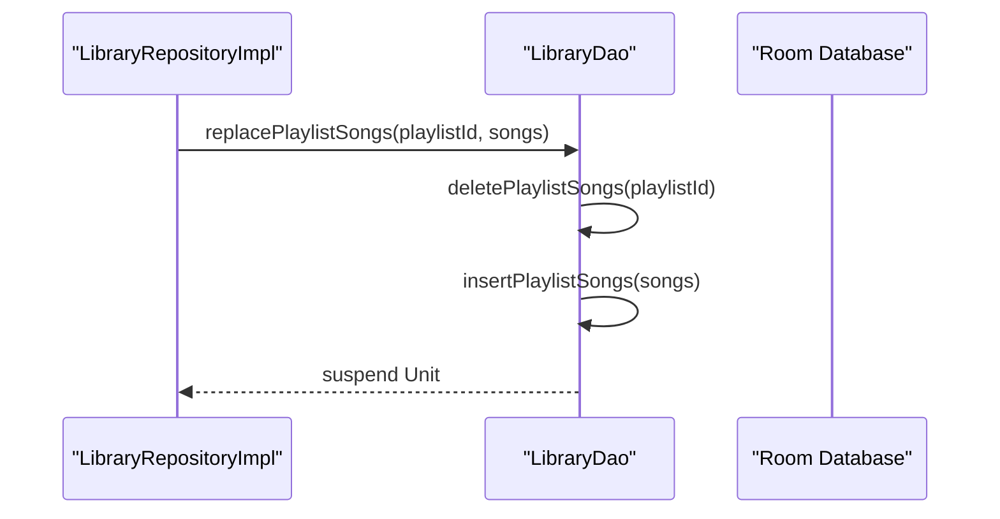
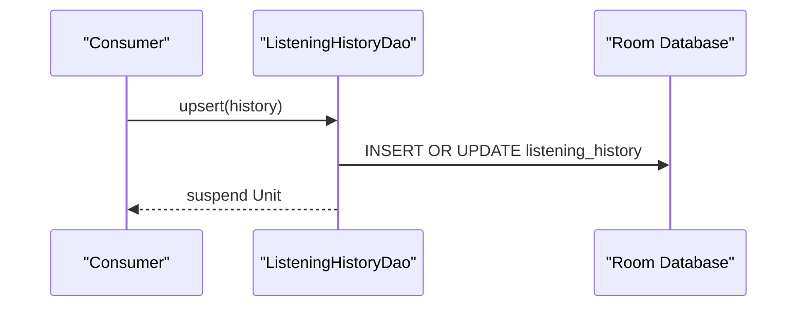
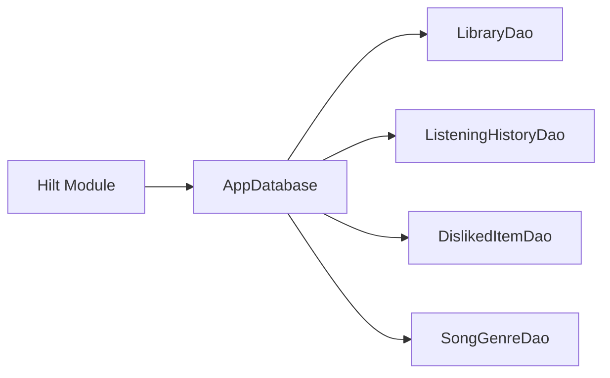

# DAO Implementations

<cite>
**Referenced Files in This Document**
- [LibraryDao.kt](file://core/data/src/main/java/com/suvojeet/suvmusic/core/data/local/dao/LibraryDao.kt)
- [ListeningHistoryDao.kt](file://core/data/src/main/java/com/suvojeet/suvmusic/core/data/local/dao/ListeningHistoryDao.kt)
- [DislikedItemDao.kt](file://core/data/src/main/java/com/suvojeet/suvmusic/core/data/local/dao/DislikedItemDao.kt)
- [SongGenreDao.kt](file://core/data/src/main/java/com/suvojeet/suvmusic/core/data/local/dao/SongGenreDao.kt)
- [AppDatabase.kt](file://core/data/src/main/java/com/suvojeet/suvmusic/core/data/local/AppDatabase.kt)
- [LibraryEntity.kt](file://core/data/src/main/java/com/suvojeet/suvmusic/core/data/local/entity/LibraryEntity.kt)
- [ListeningHistory.kt](file://core/data/src/main/java/com/suvojeet/suvmusic/core/data/local/entity/ListeningHistory.kt)
- [DislikedItem.kt](file://core/data/src/main/java/com/suvojeet/suvmusic/core/data/local/entity/DislikedItem.kt)
- [SongGenre.kt](file://core/data/src/main/java/com/suvojeet/suvmusic/core/data/local/entity/SongGenre.kt)
- [PlaylistSongEntity.kt](file://core/data/src/main/java/com/suvojeet/suvmusic/core/data/local/entity/PlaylistSongEntity.kt)
- [DatabaseModule.kt](file://core/data/src/main/java/com/suvojeet/suvmusic/core/data/di/DatabaseModule.kt)
- [LibraryRepositoryImpl.kt](file://core/data/src/main/java/com/suvojeet/suvmusic/core/data/repository/LibraryRepositoryImpl.kt)
</cite>

## Table of Contents
1. [Introduction](#introduction)
2. [Project Structure](#project-structure)
3. [Core Components](#core-components)
4. [Architecture Overview](#architecture-overview)
5. [Detailed Component Analysis](#detailed-component-analysis)
6. [Dependency Analysis](#dependency-analysis)
7. [Performance Considerations](#performance-considerations)
8. [Troubleshooting Guide](#troubleshooting-guide)
9. [Conclusion](#conclusion)

## Introduction
This document provides comprehensive documentation for SuvMusic’s Data Access Object (DAO) implementations. It focuses on four DAO interfaces: LibraryDao, ListeningHistoryDao, DislikedItemDao, and SongGenreDao. For each DAO, we explain query methods, SQL operations, transaction handling, CRUD operations, complex queries with joins, and batch operations. We also document method signatures, parameter types, return values, exception handling, Room annotations, query optimization techniques, and performance considerations. Examples of common database operations and the rationale behind query design choices are included to aid understanding and maintenance.

## Project Structure
The DAOs reside in the core data module under the local package hierarchy. They interface with Room entities and are exposed via the AppDatabase abstraction. Dependency injection is handled by Hilt through a dedicated database module.

**Diagram sources**
- [AppDatabase.kt:19-36](file://core/data/src/main/java/com/suvojeet/suvmusic/core/data/local/AppDatabase.kt#L19-L36)
- [LibraryDao.kt:13-89](file://core/data/src/main/java/com/suvojeet/suvmusic/core/data/local/dao/LibraryDao.kt#L13-L89)
- [ListeningHistoryDao.kt:10-90](file://core/data/src/main/java/com/suvojeet/suvmusic/core/data/local/dao/ListeningHistoryDao.kt#L10-L90)
- [DislikedItemDao.kt:13-52](file://core/data/src/main/java/com/suvojeet/suvmusic/core/data/local/dao/DislikedItemDao.kt#L13-L52)
- [SongGenreDao.kt:13-42](file://core/data/src/main/java/com/suvojeet/suvmusic/core/data/local/dao/SongGenreDao.kt#L13-L42)

**Section sources**
- [AppDatabase.kt:19-36](file://core/data/src/main/java/com/suvojeet/suvmusic/core/data/local/AppDatabase.kt#L19-L36)
- [DatabaseModule.kt:17-52](file://core/data/src/main/java/com/suvojeet/suvmusic/core/data/di/DatabaseModule.kt#L17-L52)

## Core Components
This section summarizes the responsibilities and capabilities of each DAO.

- LibraryDao
  - Manages library items (PLAYLIST, ALBUM, ARTIST) and playlist-song caching.
  - Supports CRUD operations, existence checks, and playlist management.
  - Provides Flow-based reactive queries and a transactional replacement operation for playlist songs.

- ListeningHistoryDao
  - Tracks user listening behavior with aggregated statistics.
  - Offers upsert semantics, time-bound queries, top lists, and summary aggregations.
  - Includes cleanup and retention controls.

- DislikedItemDao
  - Persists explicit user dislikes for songs and artists.
  - Provides bulk insert/remove/clear operations for both entities.

- SongGenreDao
  - Caches precomputed genre vectors for songs to avoid repeated inference.
  - Supports single and bulk retrieval, insertion, clearing, and counting.

**Section sources**
- [LibraryDao.kt:13-89](file://core/data/src/main/java/com/suvojeet/suvmusic/core/data/local/dao/LibraryDao.kt#L13-L89)
- [ListeningHistoryDao.kt:10-90](file://core/data/src/main/java/com/suvojeet/suvmusic/core/data/local/dao/ListeningHistoryDao.kt#L10-L90)
- [DislikedItemDao.kt:13-52](file://core/data/src/main/java/com/suvojeet/suvmusic/core/data/local/dao/DislikedItemDao.kt#L13-L52)
- [SongGenreDao.kt:13-42](file://core/data/src/main/java/com/suvojeet/suvmusic/core/data/local/dao/SongGenreDao.kt#L13-L42)

## Architecture Overview
The DAOs are part of a layered architecture:
- Entities define the persistent schema.
- DAOs encapsulate SQL operations and expose typed APIs.
- AppDatabase aggregates DAOs and exposes them to the rest of the app.
- Hilt provides database instances and DAOs to consumers.

**Diagram sources**
- [AppDatabase.kt:19-36](file://core/data/src/main/java/com/suvojeet/suvmusic/core/data/local/AppDatabase.kt#L19-L36)
- [LibraryDao.kt:13-89](file://core/data/src/main/java/com/suvojeet/suvmusic/core/data/local/dao/LibraryDao.kt#L13-L89)
- [ListeningHistoryDao.kt:10-90](file://core/data/src/main/java/com/suvojeet/suvmusic/core/data/local/dao/ListeningHistoryDao.kt#L10-L90)
- [DislikedItemDao.kt:13-52](file://core/data/src/main/java/com/suvojeet/suvmusic/core/data/local/dao/DislikedItemDao.kt#L13-L52)
- [SongGenreDao.kt:13-42](file://core/data/src/main/java/com/suvojeet/suvmusic/core/data/local/dao/SongGenreDao.kt#L13-L42)

## Detailed Component Analysis

### LibraryDao
LibraryDao manages library items and playlist-song caching. It supports:
- CRUD for library items (insert, delete, clear, select by id).
- Existence checks returning reactive booleans.
- Reactive queries for items grouped by type and with computed counts.
- Playlist-song caching with batch insert, delete, and retrieval.
- Transactional replacement of playlist songs to atomically refresh playlist contents.

Key methods and annotations:
- Insert with conflict resolution for single and batch operations.
- Queries for filtering by type, ordering by timestamp, and computed counts via subqueries.
- Flow-returning queries for real-time updates.
- Transactional method to replace playlist songs safely.

Common operations:
- Save a playlist with associated songs.
- Replace playlist songs atomically.
- Retrieve playlist songs reactively.
- Update playlist metadata (name and thumbnail).

Rationale:
- Using REPLACE on conflict ensures idempotent writes and avoids duplicates.
- Subqueries compute derived counts efficiently at query time.
- Transactions guarantee atomicity when refreshing playlist contents.

**Section sources**
- [LibraryDao.kt:13-89](file://core/data/src/main/java/com/suvojeet/suvmusic/core/data/local/dao/LibraryDao.kt#L13-L89)
- [LibraryEntity.kt:6-24](file://core/data/src/main/java/com/suvojeet/suvmusic/core/data/local/entity/LibraryEntity.kt#L6-L24)
- [PlaylistSongEntity.kt:6-24](file://core/data/src/main/java/com/suvojeet/suvmusic/core/data/local/entity/PlaylistSongEntity.kt#L6-L24)

#### Sequence: Replace Playlist Songs Atomically

**Diagram sources**
- [LibraryDao.kt:84-88](file://core/data/src/main/java/com/suvojeet/suvmusic/core/data/local/dao/LibraryDao.kt#L84-L88)
- [LibraryRepositoryImpl.kt:39-58](file://core/data/src/main/java/com/suvojeet/suvmusic/core/data/repository/LibraryRepositoryImpl.kt#L39-L58)

### ListeningHistoryDao
ListeningHistoryDao tracks listening behavior and statistics:
- Upsert for efficient song history updates.
- Queries for song-specific history, recent/top lists, and filtered history by time windows.
- Aggregations for total counts, total listening time, and top artists by play count.
- Cleanup operations to clear all or prune old entries.

Key methods and annotations:
- Upsert annotation for combined insert/update.
- Flow-returning queries for reactive UI updates.
- Aggregate queries using SUM, GROUP BY, and LIMIT.

Common operations:
- Record a playback event (upsert).
- Fetch top played songs or recently played.
- Compute top artists by summing play counts.
- Prune old entries to control database growth.

Rationale:
- Upsert prevents duplication and simplifies update logic.
- Flow-returning queries enable reactive UI without manual observers.
- Aggregations offload computation to the database for efficiency.

**Section sources**
- [ListeningHistoryDao.kt:10-90](file://core/data/src/main/java/com/suvojeet/suvmusic/core/data/local/dao/ListeningHistoryDao.kt#L10-L90)
- [ListeningHistory.kt:10-39](file://core/data/src/main/java/com/suvojeet/suvmusic/core/data/local/entity/ListeningHistory.kt#L10-L39)

#### Sequence: Upsert Listening History

**Diagram sources**
- [ListeningHistoryDao.kt:16-17](file://core/data/src/main/java/com/suvojeet/suvmusic/core/data/local/dao/ListeningHistoryDao.kt#L16-L17)

### DislikedItemDao
DislikedItemDao persists explicit user dislikes for songs and artists:
- Retrieve all disliked song IDs and artist names.
- Insert single and batch disliked items.
- Remove specific items or clear entire collections.

Key methods and annotations:
- Queries for retrieving all records and specific fields.
- Insert with conflict resolution for idempotency.

Common operations:
- Add a disliked song or artist.
- Bulk import of disliked items.
- Remove a specific dislike or clear all.

Rationale:
- REPLACE on insert ensures idempotency and simplifies deduplication.
- Separate tables for songs and artists isolate concerns and simplify queries.

**Section sources**
- [DislikedItemDao.kt:13-52](file://core/data/src/main/java/com/suvojeet/suvmusic/core/data/local/dao/DislikedItemDao.kt#L13-L52)
- [DislikedItem.kt:10-28](file://core/data/src/main/java/com/suvojeet/suvmusic/core/data/local/entity/DislikedItem.kt#L10-L28)

### SongGenreDao
SongGenreDao caches precomputed genre vectors:
- Retrieve a single genre vector or bulk fetch by IDs.
- Insert single and batch genre vectors.
- Clear cache and count entries for diagnostics.

Key methods and annotations:
- Queries for selective retrieval and full enumeration.
- Insert with conflict resolution for updates.

Common operations:
- Cache a genre vector after inference.
- Batch load vectors for recommendation scoring.
- Periodically clear cache when taxonomy changes.

Rationale:
- Storing vectors as serialized strings reduces schema complexity while enabling bulk operations.
- REPLACE ensures updates overwrite outdated vectors.

**Section sources**
- [SongGenreDao.kt:13-42](file://core/data/src/main/java/com/suvojeet/suvmusic/core/data/local/dao/SongGenreDao.kt#L13-L42)
- [SongGenre.kt:11-44](file://core/data/src/main/java/com/suvojeet/suvmusic/core/data/local/entity/SongGenre.kt#L11-L44)

## Dependency Analysis
The DAOs depend on Room annotations and entities. AppDatabase aggregates DAOs and exposes them to consumers. Hilt provides database instances and DAOs via dependency injection.

**Diagram sources**
- [DatabaseModule.kt:17-52](file://core/data/src/main/java/com/suvojeet/suvmusic/core/data/di/DatabaseModule.kt#L17-L52)
- [AppDatabase.kt:19-36](file://core/data/src/main/java/com/suvojeet/suvmusic/core/data/local/AppDatabase.kt#L19-L36)

**Section sources**
- [DatabaseModule.kt:17-52](file://core/data/src/main/java/com/suvojeet/suvmusic/core/data/di/DatabaseModule.kt#L17-L52)
- [AppDatabase.kt:19-36](file://core/data/src/main/java/com/suvojeet/suvmusic/core/data/local/AppDatabase.kt#L19-L36)

## Performance Considerations
- Use Flow-returning queries for reactive UI updates to minimize unnecessary recompositions.
- Prefer batch operations (insertItems, insertGenres, insertDislikedSongs, insertPlaylistSongs) to reduce transaction overhead.
- Use REPLACE on conflict to avoid duplicate rows and maintain idempotency.
- Keep queries selective (filter by IDs or timestamps) to limit result sets.
- Use LIMIT clauses for top lists and recent items to cap memory usage.
- Consider indexing strategies: PlaylistSongEntity defines an index on playlistId to speed up playlist queries.
- Avoid heavy computations in Kotlin; leverage SQL aggregations (SUM, GROUP BY) for statistics.
- Use transactions for multi-step operations (e.g., replacePlaylistSongs) to ensure atomicity and consistency.

[No sources needed since this section provides general guidance]

## Troubleshooting Guide
- Upsert failures: Ensure primary keys are correctly set in entities to allow Room to distinguish insert vs. update scenarios.
- Query performance issues: Verify indices exist on frequently-filtered columns (e.g., playlistId in playlist_songs).
- Transaction anomalies: Wrap multi-step playlist updates in transactional DAO methods to prevent partial states.
- Serialization errors: For SongGenre vectors, handle parsing exceptions gracefully and fall back to default arrays when deserialization fails.
- Reactive UI not updating: Confirm Flow-returning DAO methods are collected in appropriate scopes and lifecycle-aware components.

**Section sources**
- [SongGenre.kt:25-31](file://core/data/src/main/java/com/suvojeet/suvmusic/core/data/local/entity/SongGenre.kt#L25-L31)
- [LibraryDao.kt:84-88](file://core/data/src/main/java/com/suvojeet/suvmusic/core/data/local/dao/LibraryDao.kt#L84-L88)

## Conclusion
The DAO implementations in SuvMusic provide a robust foundation for library management, listening history tracking, user preference curation, and genre vector caching. By leveraging Room annotations, reactive Flow queries, and transactional operations, the DAOs balance performance, maintainability, and correctness. Following the recommended practices and understanding the rationale behind query designs will help sustain and extend the data layer effectively.