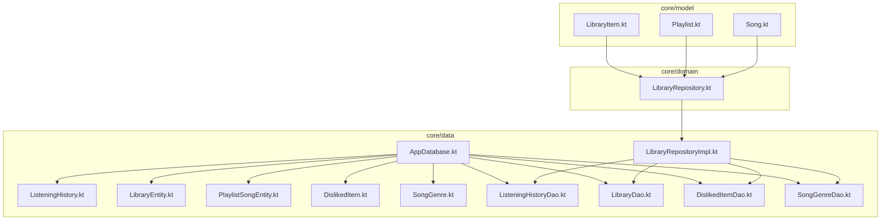
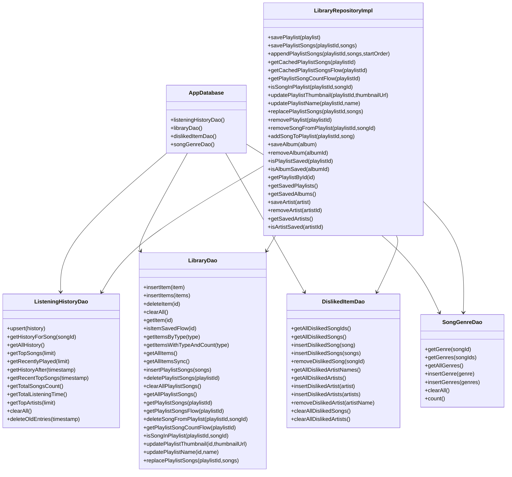
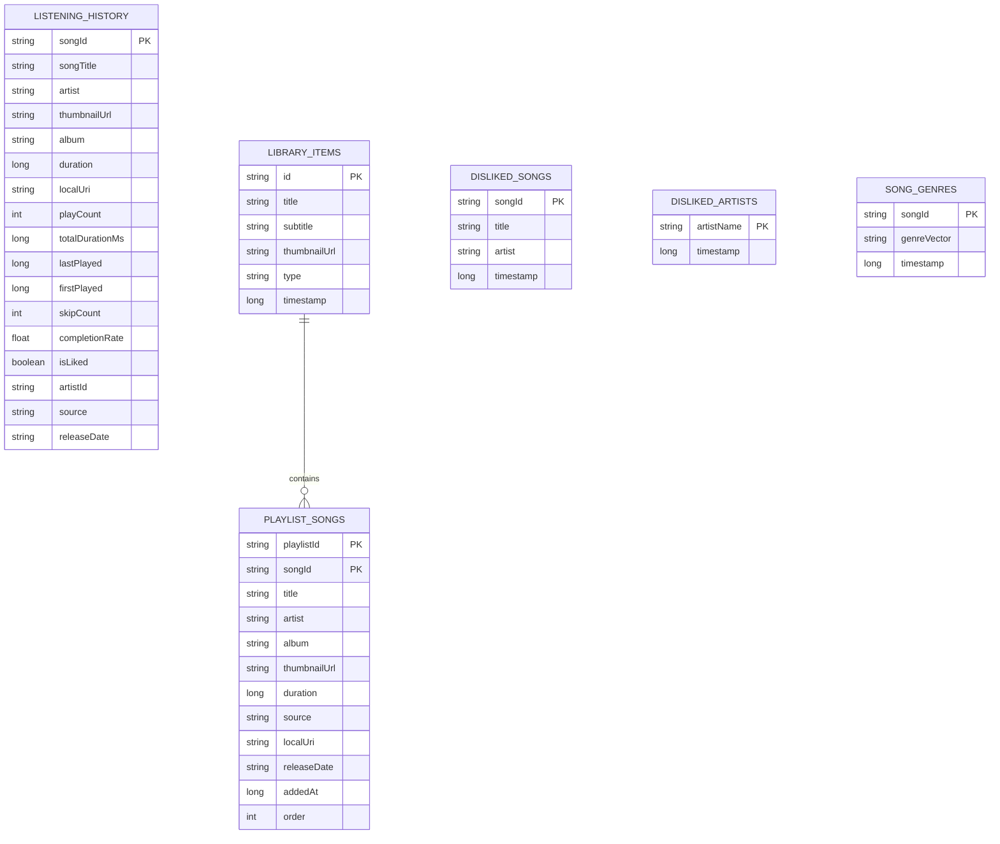
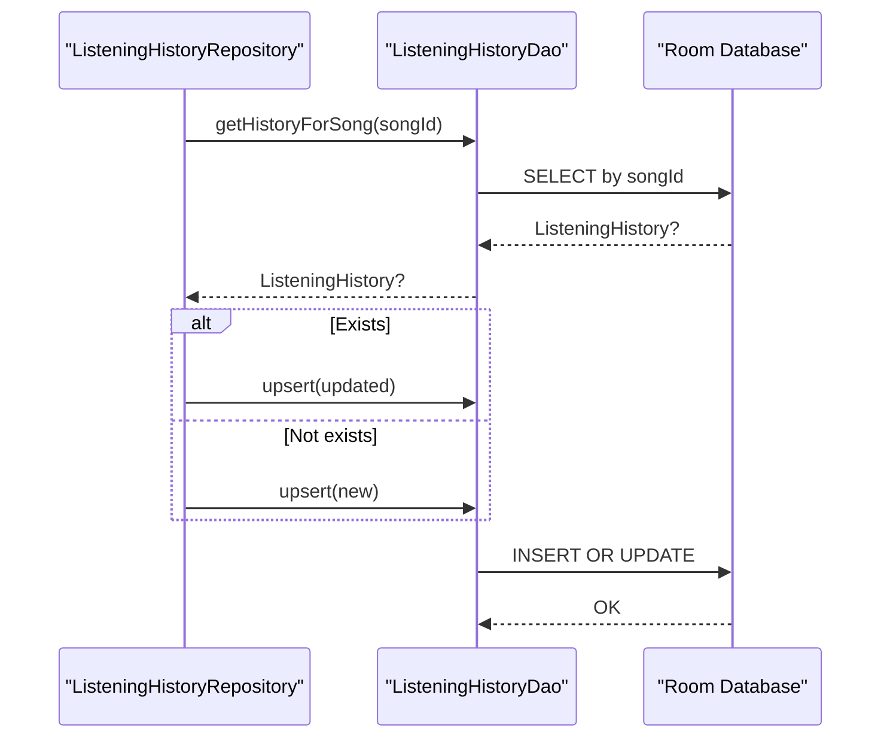
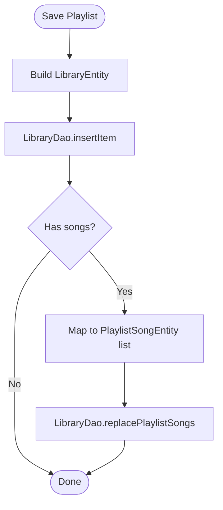
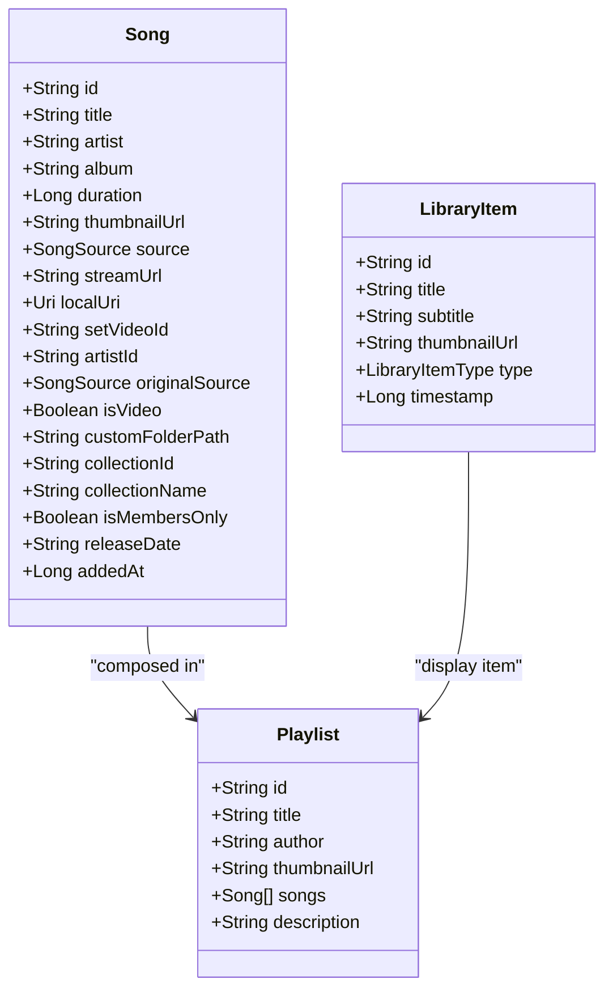
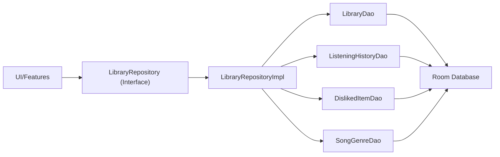

# Data Management

<cite>
**Referenced Files in This Document**
- [AppDatabase.kt](file://core/data/src/main/java/com/suvojeet/suvmusic/core/data/local/AppDatabase.kt)
- [LibraryEntity.kt](file://core/data/src/main/java/com/suvojeet/suvmusic/core/data/local/entity/LibraryEntity.kt)
- [ListeningHistory.kt](file://core/data/src/main/java/com/suvojeet/suvmusic/core/data/local/entity/ListeningHistory.kt)
- [DislikedItem.kt](file://core/data/src/main/java/com/suvojeet/suvmusic/core/data/local/entity/DislikedItem.kt)
- [SongGenre.kt](file://core/data/src/main/java/com/suvojeet/suvmusic/core/data/local/entity/SongGenre.kt)
- [PlaylistSongEntity.kt](file://core/data/src/main/java/com/suvojeet/suvmusic/core/data/local/entity/PlaylistSongEntity.kt)
- [ListeningHistoryDao.kt](file://core/data/src/main/java/com/suvojeet/suvmusic/core/data/local/dao/ListeningHistoryDao.kt)
- [LibraryDao.kt](file://core/data/src/main/java/com/suvojeet/suvmusic/core/data/local/dao/LibraryDao.kt)
- [DislikedItemDao.kt](file://core/data/src/main/java/com/suvojeet/suvmusic/core/data/local/dao/DislikedItemDao.kt)
- [SongGenreDao.kt](file://core/data/src/main/java/com/suvojeet/suvmusic/core/data/local/dao/SongGenreDao.kt)
- [LibraryRepositoryImpl.kt](file://core/data/src/main/java/com/suvojeet/suvmusic/core/data/repository/LibraryRepositoryImpl.kt)
- [LibraryRepository.kt](file://core/domain/src/main/java/com/suvojeet/suvmusic/core/domain/repository/LibraryRepository.kt)
- [LibraryItem.kt](file://core/model/src/main/java/com/suvojeet/suvmusic/core/model/LibraryItem.kt)
- [Playlist.kt](file://core/model/src/main/java/com/suvojeet/suvmusic/core/model/Playlist.kt)
- [Song.kt](file://core/model/src/main/java/com/suvojeet/suvmusic/core/model/Song.kt)
- [ListeningHistoryRepository.kt](file://app/src/main/java/com/suvojeet/suvmusic/data/repository/ListeningHistoryRepository.kt)
</cite>

## Table of Contents
1. [Introduction](#introduction)
2. [Project Structure](#project-structure)
3. [Core Components](#core-components)
4. [Architecture Overview](#architecture-overview)
5. [Detailed Component Analysis](#detailed-component-analysis)
6. [Dependency Analysis](#dependency-analysis)
7. [Performance Considerations](#performance-considerations)
8. [Troubleshooting Guide](#troubleshooting-guide)
9. [Conclusion](#conclusion)
10. [Appendices](#appendices)

## Introduction
This document describes SuvMusic’s data management system with a focus on the Room database schema, entity relationships, DAOs, repositories, and data access patterns. It covers local music library storage, listening history tracking, user preferences (explicit dislikes), and genre metadata caching. It also explains caching strategies, performance optimizations, data lifecycle management, and privacy considerations for user data.

## Project Structure
The data layer is organized into three modules:
- core/model: Domain models shared across the app (e.g., Song, Playlist, LibraryItem).
- core/domain: Domain repository interfaces consumed by UI and features.
- core/data: Room database, DAOs, entities, and the concrete repository implementation.

**Diagram sources**
- [AppDatabase.kt:19-36](file://core/data/src/main/java/com/suvojeet/suvmusic/core/data/local/AppDatabase.kt#L19-L36)
- [LibraryRepository.kt:11-36](file://core/domain/src/main/java/com/suvojeet/suvmusic/core/domain/repository/LibraryRepository.kt#L11-L36)
- [LibraryRepositoryImpl.kt:20-251](file://core/data/src/main/java/com/suvojeet/suvmusic/core/data/repository/LibraryRepositoryImpl.kt#L20-L251)

**Section sources**
- [AppDatabase.kt:19-36](file://core/data/src/main/java/com/suvojeet/suvmusic/core/data/local/AppDatabase.kt#L19-L36)
- [LibraryRepository.kt:11-36](file://core/domain/src/main/java/com/suvojeet/suvmusic/core/domain/repository/LibraryRepository.kt#L11-L36)
- [LibraryRepositoryImpl.kt:20-251](file://core/data/src/main/java/com/suvojeet/suvmusic/core/data/repository/LibraryRepositoryImpl.kt#L20-L251)

## Core Components
- Room Database: Declares entities and exposes DAOs for access.
- Entities: Represent persisted data shapes for library items, listening history, disliked items, playlist-song relations, and cached genre vectors.
- DAOs: Define typed queries and operations for each entity.
- Repository: Implements domain-level APIs for library and playlist management, mapping between models and entities.
- Domain Models: Immutable data classes used across the app boundary.

Key responsibilities:
- Local music library storage: Save playlists, albums, artists; manage playlist-song cache.
- Listening history tracking: Upsert records, compute stats, and expose recent/top lists.
- User preferences: Persist explicit dislikes for songs/artists to influence recommendations.
- Genre metadata caching: Store precomputed genre vectors to avoid repeated inference.

**Section sources**
- [AppDatabase.kt:19-36](file://core/data/src/main/java/com/suvojeet/suvmusic/core/data/local/AppDatabase.kt#L19-L36)
- [LibraryEntity.kt:6-14](file://core/data/src/main/java/com/suvojeet/suvmusic/core/data/local/entity/LibraryEntity.kt#L6-L14)
- [ListeningHistory.kt:10-39](file://core/data/src/main/java/com/suvojeet/suvmusic/core/data/local/entity/ListeningHistory.kt#L10-L39)
- [DislikedItem.kt:10-28](file://core/data/src/main/java/com/suvojeet/suvmusic/core/data/local/entity/DislikedItem.kt#L10-L28)
- [SongGenre.kt:11-44](file://core/data/src/main/java/com/suvojeet/suvmusic/core/data/local/entity/SongGenre.kt#L11-L44)
- [PlaylistSongEntity.kt:6-24](file://core/data/src/main/java/com/suvojeet/suvmusic/core/data/local/entity/PlaylistSongEntity.kt#L6-L24)
- [LibraryRepositoryImpl.kt:20-251](file://core/data/src/main/java/com/suvojeet/suvmusic/core/data/repository/LibraryRepositoryImpl.kt#L20-L251)

## Architecture Overview
The data architecture follows a layered pattern:
- UI and features depend on domain repository interfaces.
- The concrete repository implementation orchestrates DAOs and maps to/from domain models.
- Room encapsulates persistence and exposes typed queries via DAOs.

**Diagram sources**
- [AppDatabase.kt:31-36](file://core/data/src/main/java/com/suvojeet/suvmusic/core/data/local/AppDatabase.kt#L31-L36)
- [ListeningHistoryDao.kt:10-90](file://core/data/src/main/java/com/suvojeet/suvmusic/core/data/local/dao/ListeningHistoryDao.kt#L10-L90)
- [LibraryDao.kt:13-89](file://core/data/src/main/java/com/suvojeet/suvmusic/core/data/local/dao/LibraryDao.kt#L13-L89)
- [DislikedItemDao.kt:13-52](file://core/data/src/main/java/com/suvojeet/suvmusic/core/data/local/dao/DislikedItemDao.kt#L13-L52)
- [SongGenreDao.kt:13-42](file://core/data/src/main/java/com/suvojeet/suvmusic/core/data/local/dao/SongGenreDao.kt#L13-L42)
- [LibraryRepositoryImpl.kt:20-251](file://core/data/src/main/java/com/suvojeet/suvmusic/core/data/repository/LibraryRepositoryImpl.kt#L20-L251)

## Detailed Component Analysis

### Room Database Schema and Entities
- AppDatabase declares six entities and exposes four DAOs. Version is set to 11 with schema export enabled.
- Entities:
  - ListeningHistory: Aggregated listening stats per song.
  - LibraryEntity: Playlists, albums, and artists saved by the user.
  - PlaylistSongEntity: Many-to-many bridge for playlists and songs with ordering and metadata.
  - DislikedSong and DislikedArtist: Explicit user preferences to exclude or penalize content.
  - SongGenre: Cached genre vectors for recommendation scoring.

**Diagram sources**
- [ListeningHistory.kt:10-39](file://core/data/src/main/java/com/suvojeet/suvmusic/core/data/local/entity/ListeningHistory.kt#L10-L39)
- [LibraryEntity.kt:6-14](file://core/data/src/main/java/com/suvojeet/suvmusic/core/data/local/entity/LibraryEntity.kt#L6-L14)
- [PlaylistSongEntity.kt:6-24](file://core/data/src/main/java/com/suvojeet/suvmusic/core/data/local/entity/PlaylistSongEntity.kt#L6-L24)
- [DislikedItem.kt:10-28](file://core/data/src/main/java/com/suvojeet/suvmusic/core/data/local/entity/DislikedItem.kt#L10-L28)
- [SongGenre.kt:11-44](file://core/data/src/main/java/com/suvojeet/suvmusic/core/data/local/entity/SongGenre.kt#L11-L44)

**Section sources**
- [AppDatabase.kt:19-36](file://core/data/src/main/java/com/suvojeet/suvmusic/core/data/local/AppDatabase.kt#L19-L36)
- [ListeningHistory.kt:10-39](file://core/data/src/main/java/com/suvojeet/suvmusic/core/data/local/entity/ListeningHistory.kt#L10-L39)
- [LibraryEntity.kt:6-14](file://core/data/src/main/java/com/suvojeet/suvmusic/core/data/local/entity/LibraryEntity.kt#L6-L14)
- [PlaylistSongEntity.kt:6-24](file://core/data/src/main/java/com/suvojeet/suvmusic/core/data/local/entity/PlaylistSongEntity.kt#L6-L24)
- [DislikedItem.kt:10-28](file://core/data/src/main/java/com/suvojeet/suvmusic/core/data/local/entity/DislikedItem.kt#L10-L28)
- [SongGenre.kt:11-44](file://core/data/src/main/java/com/suvojeet/suvmusic/core/data/local/entity/SongGenre.kt#L11-L44)

### DAO Implementations and Queries
- ListeningHistoryDao:
  - Upserts records and aggregates stats (play count, total duration, last played, skip count, completion rate).
  - Provides top songs, recently played, filtered by time windows, and artist totals.
  - Supports clearing and pruning old entries.
- LibraryDao:
  - Manages library items (playlists, albums, artists) and playlist-song cache.
  - Offers transactional replacement of playlist songs and reactive flows for UI updates.
- DislikedItemDao:
  - Persists explicit user dislikes for songs and artists.
  - Supports bulk operations and clearing.
- SongGenreDao:
  - Caches genre vectors as comma-separated strings with timestamp.
  - Provides bulk fetch and insert, count, and clear operations.

**Diagram sources**
- [ListeningHistoryRepository.kt:24-95](file://app/src/main/java/com/suvojeet/suvmusic/data/repository/ListeningHistoryRepository.kt#L24-L95)
- [ListeningHistoryDao.kt:16-17](file://core/data/src/main/java/com/suvojeet/suvmusic/core/data/local/dao/ListeningHistoryDao.kt#L16-L17)

**Section sources**
- [ListeningHistoryDao.kt:10-90](file://core/data/src/main/java/com/suvojeet/suvmusic/core/data/local/dao/ListeningHistoryDao.kt#L10-L90)
- [LibraryDao.kt:13-89](file://core/data/src/main/java/com/suvojeet/suvmusic/core/data/local/dao/LibraryDao.kt#L13-L89)
- [DislikedItemDao.kt:13-52](file://core/data/src/main/java/com/suvojeet/suvmusic/core/data/local/dao/DislikedItemDao.kt#L13-L52)
- [SongGenreDao.kt:13-42](file://core/data/src/main/java/com/suvojeet/suvmusic/core/data/local/dao/SongGenreDao.kt#L13-L42)

### Repository Layer and Data Access Patterns
- LibraryRepositoryImpl:
  - Converts domain models (Playlist, Song, Album, Artist) to entities and persists them.
  - Maintains playlist-song cache with deterministic ordering and reactive flows for UI binding.
  - Exposes convenience APIs for saving, updating, and removing playlists and their contents.
- Domain contract:
  - LibraryRepository defines the interface for UI and features to interact with library data.

**Diagram sources**
- [LibraryRepositoryImpl.kt:24-58](file://core/data/src/main/java/com/suvojeet/suvmusic/core/data/repository/LibraryRepositoryImpl.kt#L24-L58)
- [LibraryDao.kt:84-88](file://core/data/src/main/java/com/suvojeet/suvmusic/core/data/local/dao/LibraryDao.kt#L84-L88)

**Section sources**
- [LibraryRepositoryImpl.kt:20-251](file://core/data/src/main/java/com/suvojeet/suvmusic/core/data/repository/LibraryRepositoryImpl.kt#L20-L251)
- [LibraryRepository.kt:11-36](file://core/domain/src/main/java/com/suvojeet/suvmusic/core/domain/repository/LibraryRepository.kt#L11-L36)

### Domain Models and Mappings
- Song: Encapsulates playback metadata and source (YouTube, YouTube Music, JioSaavn, Local, Downloaded).
- Playlist: Contains a list of songs and metadata.
- LibraryItem: Lightweight representation of saved items (PLAYLIST, ALBUM, ARTIST).

**Diagram sources**
- [Song.kt:9-129](file://core/model/src/main/java/com/suvojeet/suvmusic/core/model/Song.kt#L9-L129)
- [Playlist.kt:3-11](file://core/model/src/main/java/com/suvojeet/suvmusic/core/model/Playlist.kt#L3-L11)
- [LibraryItem.kt:3-18](file://core/model/src/main/java/com/suvojeet/suvmusic/core/model/LibraryItem.kt#L3-L18)

**Section sources**
- [Song.kt:9-129](file://core/model/src/main/java/com/suvojeet/suvmusic/core/model/Song.kt#L9-L129)
- [Playlist.kt:3-11](file://core/model/src/main/java/com/suvojeet/suvmusic/core/model/Playlist.kt#L3-L11)
- [LibraryItem.kt:3-18](file://core/model/src/main/java/com/suvojeet/suvmusic/core/model/LibraryItem.kt#L3-L18)

## Dependency Analysis
- Coupling:
  - UI and features depend on LibraryRepository interface, reducing coupling to implementation.
  - LibraryRepositoryImpl depends on DAOs and maps to domain models.
- Cohesion:
  - DAOs encapsulate SQL concerns; repositories orchestrate higher-level operations.
- External dependencies:
  - Room runtime and coroutines flows power persistence and reactive updates.

**Diagram sources**
- [LibraryRepository.kt:11-36](file://core/domain/src/main/java/com/suvojeet/suvmusic/core/domain/repository/LibraryRepository.kt#L11-L36)
- [LibraryRepositoryImpl.kt:20-251](file://core/data/src/main/java/com/suvojeet/suvmusic/core/data/repository/LibraryRepositoryImpl.kt#L20-L251)
- [AppDatabase.kt:31-36](file://core/data/src/main/java/com/suvojeet/suvmusic/core/data/local/AppDatabase.kt#L31-L36)

**Section sources**
- [LibraryRepository.kt:11-36](file://core/domain/src/main/java/com/suvojeet/suvmusic/core/domain/repository/LibraryRepository.kt#L11-L36)
- [LibraryRepositoryImpl.kt:20-251](file://core/data/src/main/java/com/suvojeet/suvmusic/core/data/repository/LibraryRepositoryImpl.kt#L20-L251)

## Performance Considerations
- Reactive flows:
  - LibraryDao exposes Flow-returning queries for playlist songs and counts, enabling efficient UI updates without manual polling.
- Upserts and batch operations:
  - ListeningHistoryDao uses upsert to minimize branching logic and reduce write conflicts.
  - LibraryDao supports bulk insert and replace operations for playlist-song cache.
- Indexing:
  - Composite primary key on PlaylistSongEntity ensures uniqueness and efficient joins.
- Caching:
  - SongGenreDao caches genre vectors to avoid recomputation.
- Query optimization:
  - Top lists and recents use indexed ordering and limits to constrain result sets.
- Privacy-aware writes:
  - ListeningHistoryRepository checks privacy mode before recording plays.

[No sources needed since this section provides general guidance]

## Troubleshooting Guide
- No data shown in library:
  - Verify LibraryDao queries return expected items and that playlist-song cache is populated.
  - Check playlist order and existence via DAO methods.
- Incorrect top songs or recents:
  - Confirm ListeningHistoryDao queries use correct ordering and limits.
  - Validate timestamps and completion rate calculations.
- Disliked items not affecting recommendations:
  - Ensure DislikedItemDao stores and retrieves items correctly.
  - Confirm repository logic excludes disliked songs/artists during scoring.
- Genre cache issues:
  - Use SongGenreDao.getAllGenres and count to diagnose cache state.
  - Clear cache if taxonomy changes are expected.
- Privacy mode prevents history updates:
  - ListeningHistoryRepository skips recording when privacy mode is enabled.

**Section sources**
- [LibraryDao.kt:13-89](file://core/data/src/main/java/com/suvojeet/suvmusic/core/data/local/dao/LibraryDao.kt#L13-L89)
- [ListeningHistoryDao.kt:10-90](file://core/data/src/main/java/com/suvojeet/suvmusic/core/data/local/dao/ListeningHistoryDao.kt#L10-L90)
- [DislikedItemDao.kt:13-52](file://core/data/src/main/java/com/suvojeet/suvmusic/core/data/local/dao/DislikedItemDao.kt#L13-L52)
- [SongGenreDao.kt:13-42](file://core/data/src/main/java/com/suvojeet/suvmusic/core/data/local/dao/SongGenreDao.kt#L13-L42)
- [ListeningHistoryRepository.kt:29-95](file://app/src/main/java/com/suvojeet/suvmusic/data/repository/ListeningHistoryRepository.kt#L29-L95)

## Conclusion
SuvMusic’s data layer cleanly separates persistence, domain logic, and UI concerns. Room entities and DAOs provide robust, reactive access to library, history, preferences, and genre metadata. Repositories translate between models and entities while exposing high-level APIs. Privacy controls and lifecycle management (cleanup) are integrated into the listening history workflow. Together, these components form a maintainable and extensible foundation for data management.

[No sources needed since this section summarizes without analyzing specific files]

## Appendices

### Data Lifecycle and Cleanup Policies
- Listening history cleanup:
  - Old entries older than a configured threshold are pruned periodically.
- Genre cache:
  - Clear cache when taxonomy changes; rely on DAO count for diagnostics.
- Playlist cache:
  - Replace or append songs as needed; clear playlist songs when removing a playlist.

**Section sources**
- [ListeningHistoryRepository.kt:166-169](file://app/src/main/java/com/suvojeet/suvmusic/data/repository/ListeningHistoryRepository.kt#L166-L169)
- [SongGenreDao.kt:35-41](file://core/data/src/main/java/com/suvojeet/suvmusic/core/data/local/dao/SongGenreDao.kt#L35-L41)
- [LibraryDao.kt:54-58](file://core/data/src/main/java/com/suvojeet/suvmusic/core/data/local/dao/LibraryDao.kt#L54-L58)

### Privacy Considerations
- History recording respects privacy mode; no writes occur when enabled.
- Explicit dislike preferences are stored locally and used to filter recommendations.

**Section sources**
- [ListeningHistoryRepository.kt:29-29](file://app/src/main/java/com/suvojeet/suvmusic/data/repository/ListeningHistoryRepository.kt#L29-L29)
- [DislikedItemDao.kt:13-52](file://core/data/src/main/java/com/suvojeet/suvmusic/core/data/local/dao/DislikedItemDao.kt#L13-L52)