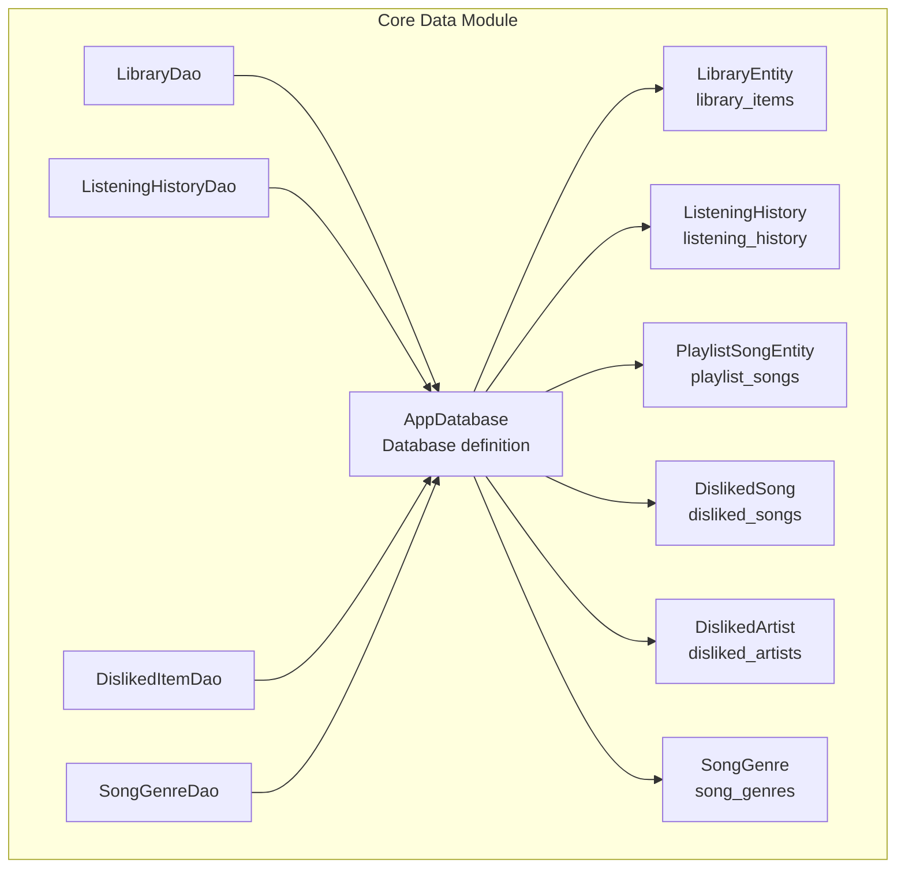
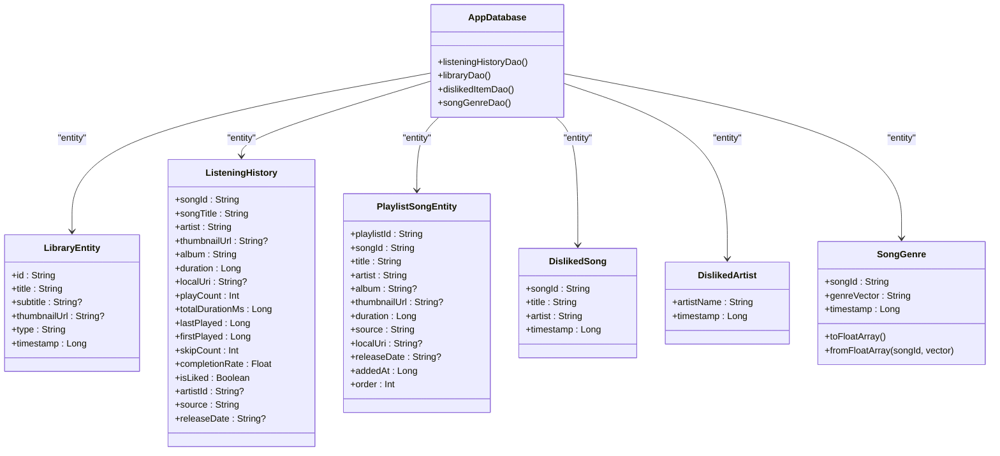
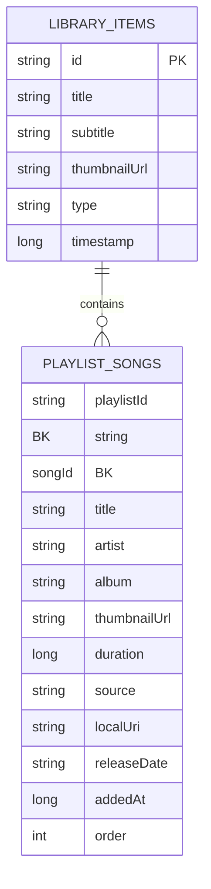
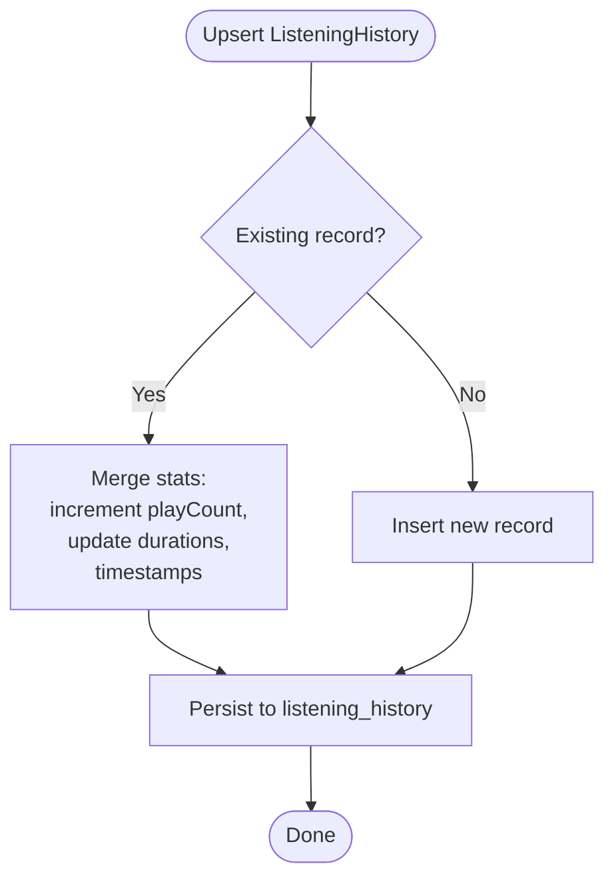
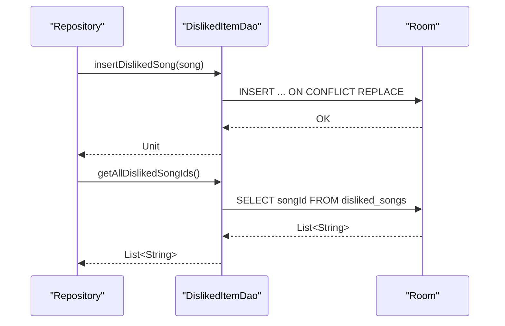
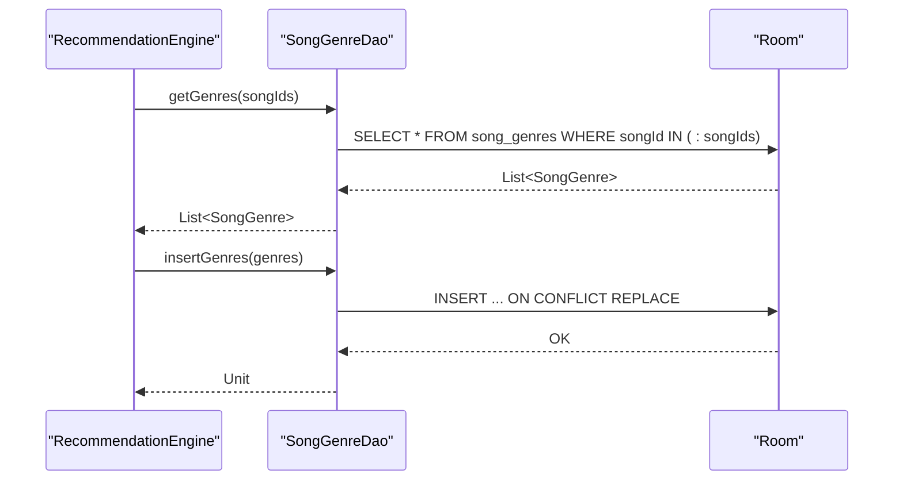
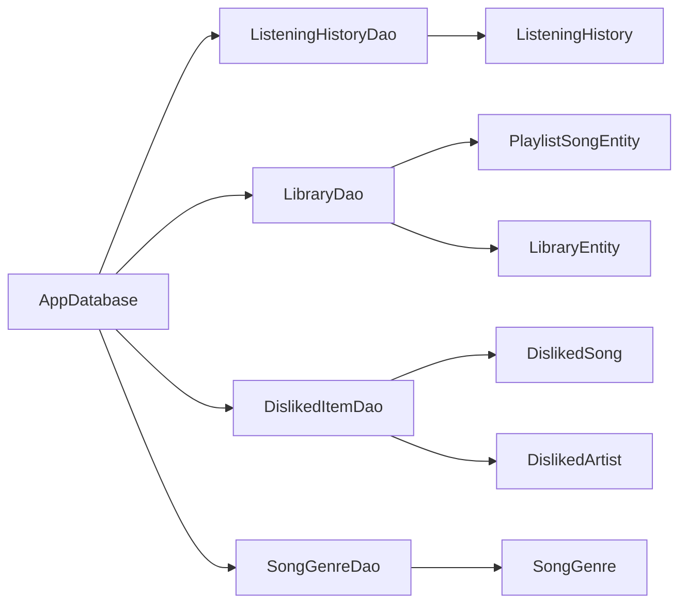

# Database Schema

<cite>
**Referenced Files in This Document**
- [AppDatabase.kt](file://core/data/src/main/java/com/suvojeet/suvmusic/core/data/local/AppDatabase.kt)
- [LibraryEntity.kt](file://core/data/src/main/java/com/suvojeet/suvmusic/core/data/local/entity/LibraryEntity.kt)
- [ListeningHistory.kt](file://core/data/src/main/java/com/suvojeet/suvmusic/core/data/local/entity/ListeningHistory.kt)
- [PlaylistSongEntity.kt](file://core/data/src/main/java/com/suvojeet/suvmusic/core/data/local/entity/PlaylistSongEntity.kt)
- [DislikedItem.kt](file://core/data/src/main/java/com/suvojeet/suvmusic/core/data/local/entity/DislikedItem.kt)
- [SongGenre.kt](file://core/data/src/main/java/com/suvojeet/suvmusic/core/data/local/entity/SongGenre.kt)
- [ListeningHistoryDao.kt](file://core/data/src/main/java/com/suvojeet/suvmusic/core/data/local/dao/ListeningHistoryDao.kt)
- [LibraryDao.kt](file://core/data/src/main/java/com/suvojeet/suvmusic/core/data/local/dao/LibraryDao.kt)
- [DislikedItemDao.kt](file://core/data/src/main/java/com/suvojeet/suvmusic/core/data/local/dao/DislikedItemDao.kt)
- [SongGenreDao.kt](file://core/data/src/main/java/com/suvojeet/suvmusic/core/data/local/dao/SongGenreDao.kt)
- [DatabaseModule.kt](file://core/data/src/main/java/com/suvojeet/suvmusic/core/data/di/DatabaseModule.kt)
</cite>

## Table of Contents
1. [Introduction](#introduction)
2. [Project Structure](#project-structure)
3. [Core Components](#core-components)
4. [Architecture Overview](#architecture-overview)
5. [Detailed Component Analysis](#detailed-component-analysis)
6. [Dependency Analysis](#dependency-analysis)
7. [Performance Considerations](#performance-considerations)
8. [Troubleshooting Guide](#troubleshooting-guide)
9. [Conclusion](#conclusion)

## Introduction
This document describes the Room database schema used by SuvMusic’s core data module. It covers entity definitions, relationships, indexing strategies, and the database versioning and migration approach. It also explains how DAOs operate against the schema and how the database is initialized in the application.

## Project Structure
The Room database is defined in a dedicated module under core/data. The schema consists of six entities backed by four DAOs and initialized via a Hilt-provided singleton database instance.

**Diagram sources**
- [AppDatabase.kt:19-36](file://core/data/src/main/java/com/suvojeet/suvmusic/core/data/local/AppDatabase.kt#L19-L36)
- [LibraryEntity.kt:6-14](file://core/data/src/main/java/com/suvojeet/suvmusic/core/data/local/entity/LibraryEntity.kt#L6-L14)
- [ListeningHistory.kt:10-39](file://core/data/src/main/java/com/suvojeet/suvmusic/core/data/local/entity/ListeningHistory.kt#L10-L39)
- [PlaylistSongEntity.kt:6-24](file://core/data/src/main/java/com/suvojeet/suvmusic/core/data/local/entity/PlaylistSongEntity.kt#L6-L24)
- [DislikedItem.kt:10-28](file://core/data/src/main/java/com/suvojeet/suvmusic/core/data/local/entity/DislikedItem.kt#L10-L28)
- [SongGenre.kt:11-21](file://core/data/src/main/java/com/suvojeet/suvmusic/core/data/local/entity/SongGenre.kt#L11-L21)
- [LibraryDao.kt:13-89](file://core/data/src/main/java/com/suvojeet/suvmusic/core/data/local/dao/LibraryDao.kt#L13-L89)
- [ListeningHistoryDao.kt:10-90](file://core/data/src/main/java/com/suvojeet/suvmusic/core/data/local/dao/ListeningHistoryDao.kt#L10-L90)
- [DislikedItemDao.kt:13-52](file://core/data/src/main/java/com/suvojeet/suvmusic/core/data/local/dao/DislikedItemDao.kt#L13-L52)
- [SongGenreDao.kt:13-42](file://core/data/src/main/java/com/suvojeet/suvmusic/core/data/local/dao/SongGenreDao.kt#L13-L42)

**Section sources**
- [AppDatabase.kt:19-36](file://core/data/src/main/java/com/suvojeet/suvmusic/core/data/local/AppDatabase.kt#L19-L36)
- [DatabaseModule.kt:21-31](file://core/data/src/main/java/com/suvojeet/suvmusic/core/data/di/DatabaseModule.kt#L21-L31)

## Core Components
This section documents each entity, its fields, data types, constraints, and relationships.

- LibraryEntity
  - Table: library_items
  - Primary key: id (String)
  - Fields: id, title (String), subtitle (String?), thumbnailUrl (String?), type (String), timestamp (Long)
  - Notes: Used to represent saved items (PLAYLIST, ALBUM, ARTIST). Includes a convenience projection LibraryItemWithCount for playlist counts.

- ListeningHistory
  - Table: listening_history
  - Primary key: songId (String)
  - Fields: songId, songTitle (String), artist (String), thumbnailUrl (String?), album (String), duration (Long), localUri (String?), playCount (Int), totalDurationMs (Long), lastPlayed (Long), firstPlayed (Long), skipCount (Int), completionRate (Float), isLiked (Boolean), artistId (String?), source (String), releaseDate (String?)
  - Notes: Aggregated playback stats per song; defaults initialize timestamps and counters.

- PlaylistSongEntity
  - Table: playlist_songs
  - Composite primary key: (playlistId, songId)
  - Index: playlistId (single-column index)
  - Fields: playlistId (String), songId (String), title (String), artist (String), album (String?), thumbnailUrl (String?), duration (Long), source (String), localUri (String?), releaseDate (String?), addedAt (Long), order (Int)
  - Notes: Many-to-many bridge between playlists and songs; supports ordering and metadata per song in a playlist.

- DislikedItem
  - DislikedSong
    - Table: disliked_songs
    - Primary key: songId (String)
    - Fields: songId, title (String), artist (String), timestamp (Long)
  - DislikedArtist
    - Table: disliked_artists
    - Primary key: artistName (String)
    - Fields: artistName (String), timestamp (Long)
  - Notes: Explicit user dislikes to influence recommendations.

- SongGenre
  - Table: song_genres
  - Primary key: songId (String)
  - Fields: songId, genreVector (String), timestamp (Long)
  - Methods: toFloatArray(), companion object fromFloatArray()
  - Notes: Caches genre vectors as a comma-separated string of floats (20 dimensions) to avoid recomputation.

**Section sources**
- [LibraryEntity.kt:6-24](file://core/data/src/main/java/com/suvojeet/suvmusic/core/data/local/entity/LibraryEntity.kt#L6-L24)
- [ListeningHistory.kt:10-39](file://core/data/src/main/java/com/suvojeet/suvmusic/core/data/local/entity/ListeningHistory.kt#L10-L39)
- [PlaylistSongEntity.kt:6-24](file://core/data/src/main/java/com/suvojeet/suvmusic/core/data/local/entity/PlaylistSongEntity.kt#L6-L24)
- [DislikedItem.kt:10-28](file://core/data/src/main/java/com/suvojeet/suvmusic/core/data/local/entity/DislikedItem.kt#L10-L28)
- [SongGenre.kt:11-44](file://core/data/src/main/java/com/suvojeet/suvmusic/core/data/local/entity/SongGenre.kt#L11-L44)

## Architecture Overview
The Room database is configured as a singleton and built at runtime. It exposes DAOs for all entities. The schema design emphasizes:
- Lightweight, denormalized listening stats for analytics and recommendations
- Efficient playlist-song caching with composite keys and indices
- Explicit user preference tables to bias recommendation scoring
- Genre vector caching for ML-based features

**Diagram sources**
- [AppDatabase.kt:19-36](file://core/data/src/main/java/com/suvojeet/suvmusic/core/data/local/AppDatabase.kt#L19-L36)
- [LibraryEntity.kt:6-14](file://core/data/src/main/java/com/suvojeet/suvmusic/core/data/local/entity/LibraryEntity.kt#L6-L14)
- [ListeningHistory.kt:10-39](file://core/data/src/main/java/com/suvojeet/suvmusic/core/data/local/entity/ListeningHistory.kt#L10-L39)
- [PlaylistSongEntity.kt:6-24](file://core/data/src/main/java/com/suvojeet/suvmusic/core/data/local/entity/PlaylistSongEntity.kt#L6-L24)
- [DislikedItem.kt:10-28](file://core/data/src/main/java/com/suvojeet/suvmusic/core/data/local/entity/DislikedItem.kt#L10-L28)
- [SongGenre.kt:11-44](file://core/data/src/main/java/com/suvojeet/suvmusic/core/data/local/entity/SongGenre.kt#L11-L44)

## Detailed Component Analysis

### AppDatabase and Initialization
- Database name: suvmusic_database
- Version: 11
- Entities included: ListeningHistory, LibraryEntity, PlaylistSongEntity, DislikedSong, DislikedArtist, SongGenre
- Migration strategy: fallbackToDestructiveMigration() is enabled during construction
- DAO providers: Hilt-provided singletons for each DAO

**Section sources**
- [AppDatabase.kt:19-36](file://core/data/src/main/java/com/suvojeet/suvmusic/core/data/local/AppDatabase.kt#L19-L36)
- [DatabaseModule.kt:21-31](file://core/data/src/main/java/com/suvojeet/suvmusic/core/data/di/DatabaseModule.kt#L21-L31)

### LibraryEntity and PlaylistSongEntity
- LibraryEntity stores saved items with type discriminator and timestamp.
- PlaylistSongEntity forms a many-to-many relationship with playlists and songs.
- Composite primary key ensures uniqueness per playlist-song pair.
- Index on playlistId accelerates playlist queries.

**Diagram sources**
- [LibraryEntity.kt:6-14](file://core/data/src/main/java/com/suvojeet/suvmusic/core/data/local/entity/LibraryEntity.kt#L6-L14)
- [PlaylistSongEntity.kt:6-24](file://core/data/src/main/java/com/suvojeet/suvmusic/core/data/local/entity/PlaylistSongEntity.kt#L6-L24)

**Section sources**
- [LibraryEntity.kt:6-14](file://core/data/src/main/java/com/suvojeet/suvmusic/core/data/local/entity/LibraryEntity.kt#L6-L14)
- [PlaylistSongEntity.kt:6-24](file://core/data/src/main/java/com/suvojeet/suvmusic/core/data/local/entity/PlaylistSongEntity.kt#L6-L24)
- [LibraryDao.kt:51-88](file://core/data/src/main/java/com/suvojeet/suvmusic/core/data/local/dao/LibraryDao.kt#L51-L88)

### ListeningHistory
- Tracks per-song playback metrics and user behavior signals.
- Upserts handled via DAO to merge new listens with existing stats.
- Queries support top songs, recent plays, and artist aggregation.

**Diagram sources**
- [ListeningHistoryDao.kt:16-17](file://core/data/src/main/java/com/suvojeet/suvmusic/core/data/local/dao/ListeningHistoryDao.kt#L16-L17)
- [ListeningHistory.kt:10-39](file://core/data/src/main/java/com/suvojeet/suvmusic/core/data/local/entity/ListeningHistory.kt#L10-L39)

**Section sources**
- [ListeningHistory.kt:10-39](file://core/data/src/main/java/com/suvojeet/suvmusic/core/data/local/entity/ListeningHistory.kt#L10-L39)
- [ListeningHistoryDao.kt:16-89](file://core/data/src/main/java/com/suvojeet/suvmusic/core/data/local/dao/ListeningHistoryDao.kt#L16-L89)

### DislikedItem
- Two tables: disliked_songs and disliked_artists.
- DislikedSong keyed by songId; DislikedArtist keyed by normalized artistName.
- DAO provides bulk insert/remove and clearing operations.

**Diagram sources**
- [DislikedItemDao.kt:16-29](file://core/data/src/main/java/com/suvojeet/suvmusic/core/data/local/dao/DislikedItemDao.kt#L16-L29)
- [DislikedItem.kt:10-17](file://core/data/src/main/java/com/suvojeet/suvmusic/core/data/local/entity/DislikedItem.kt#L10-L17)

**Section sources**
- [DislikedItem.kt:10-28](file://core/data/src/main/java/com/suvojeet/suvmusic/core/data/local/entity/DislikedItem.kt#L10-L28)
- [DislikedItemDao.kt:13-52](file://core/data/src/main/java/com/suvojeet/suvmusic/core/data/local/dao/DislikedItemDao.kt#L13-L52)

### SongGenre
- Caches precomputed genre vectors as a comma-separated string.
- Provides conversion helpers to parse/store Float arrays.
- DAO supports batch retrieval and replacement.

**Diagram sources**
- [SongGenreDao.kt:21-33](file://core/data/src/main/java/com/suvojeet/suvmusic/core/data/local/dao/SongGenreDao.kt#L21-L33)
- [SongGenre.kt:25-43](file://core/data/src/main/java/com/suvojeet/suvmusic/core/data/local/entity/SongGenre.kt#L25-L43)

**Section sources**
- [SongGenre.kt:11-44](file://core/data/src/main/java/com/suvojeet/suvmusic/core/data/local/entity/SongGenre.kt#L11-L44)
- [SongGenreDao.kt:13-42](file://core/data/src/main/java/com/suvojeet/suvmusic/core/data/local/dao/SongGenreDao.kt#L13-L42)

## Dependency Analysis
- AppDatabase aggregates all entities and exposes DAOs.
- DAOs depend on Room annotations and queries; they do not declare foreign keys because Room does not enforce referential integrity for these entities.
- LibraryDao orchestrates playlist-song caching alongside library item persistence.

**Diagram sources**
- [AppDatabase.kt:19-36](file://core/data/src/main/java/com/suvojeet/suvmusic/core/data/local/AppDatabase.kt#L19-L36)
- [LibraryDao.kt:51-88](file://core/data/src/main/java/com/suvojeet/suvmusic/core/data/local/dao/LibraryDao.kt#L51-L88)
- [ListeningHistoryDao.kt:16-89](file://core/data/src/main/java/com/suvojeet/suvmusic/core/data/local/dao/ListeningHistoryDao.kt#L16-L89)
- [DislikedItemDao.kt:13-52](file://core/data/src/main/java/com/suvojeet/suvmusic/core/data/local/dao/DislikedItemDao.kt#L13-L52)
- [SongGenreDao.kt:13-42](file://core/data/src/main/java/com/suvojeet/suvmusic/core/data/local/dao/SongGenreDao.kt#L13-L42)

**Section sources**
- [AppDatabase.kt:19-36](file://core/data/src/main/java/com/suvojeet/suvmusic/core/data/local/AppDatabase.kt#L19-L36)
- [LibraryDao.kt:51-88](file://core/data/src/main/java/com/suvojeet/suvmusic/core/data/local/dao/LibraryDao.kt#L51-L88)

## Performance Considerations
- Composite primary key on playlist_songs ensures efficient lookup by playlistId and uniqueness of entries.
- Single-column index on playlistId further optimizes playlist queries.
- Upserts in ListeningHistoryDao reduce write amplification by merging updates.
- SongGenreDao supports batch operations to minimize round-trips when caching vectors.
- Room’s fallbackToDestructiveMigration() simplifies development but erases data on schema changes; production deployments should implement proper migrations.

[No sources needed since this section provides general guidance]

## Troubleshooting Guide
- If queries fail due to schema mismatches, confirm the database version and migration strategy. The current setup uses destructive fallback.
- For playlist-song caching issues, verify that composite keys are correctly formed and that playlistId index is effective.
- When working with genre vectors, ensure the string format matches expectations and handle parsing errors gracefully.

**Section sources**
- [DatabaseModule.kt:29](file://core/data/src/main/java/com/suvojeet/suvmusic/core/data/di/DatabaseModule.kt#L29)
- [PlaylistSongEntity.kt:8-9](file://core/data/src/main/java/com/suvojeet/suvmusic/core/data/local/entity/PlaylistSongEntity.kt#L8-L9)
- [SongGenre.kt:25-31](file://core/data/src/main/java/com/suvojeet/suvmusic/core/data/local/entity/SongGenre.kt#L25-L31)

## Conclusion
The Room schema for SuvMusic centers on lightweight, user-centric data: saved library items, per-song listening analytics, playlist-song associations, explicit user dislikes, and cached genre vectors. The design leverages composite keys, targeted indices, and upsert semantics to balance simplicity and performance. The current initialization uses destructive fallback for migrations, which is suitable for development but should be replaced with versioned migrations in production.