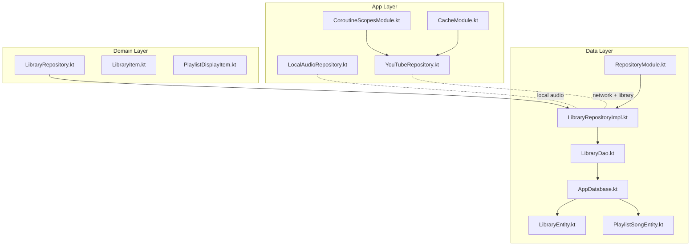
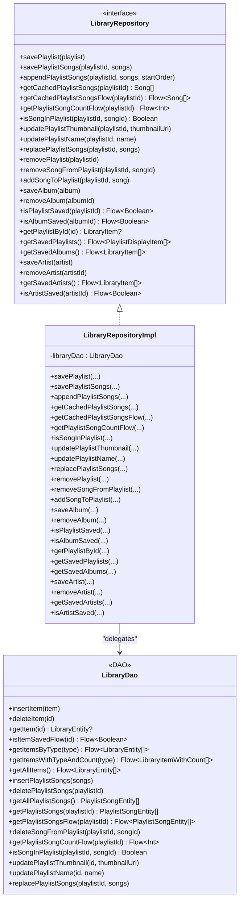
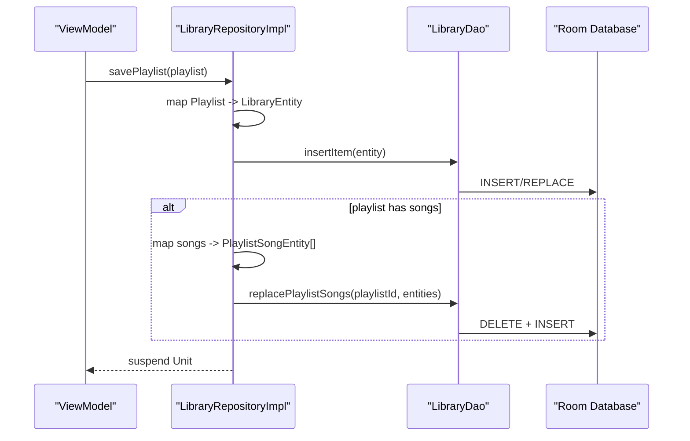
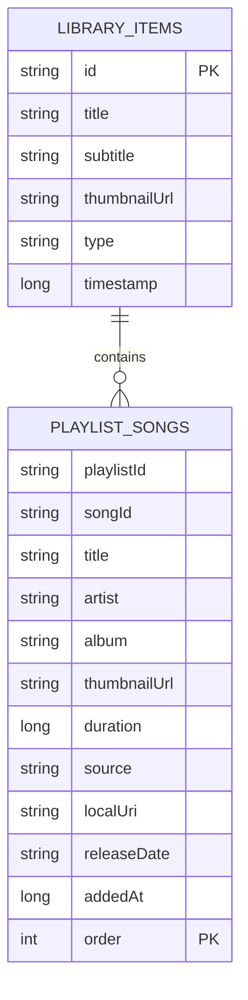
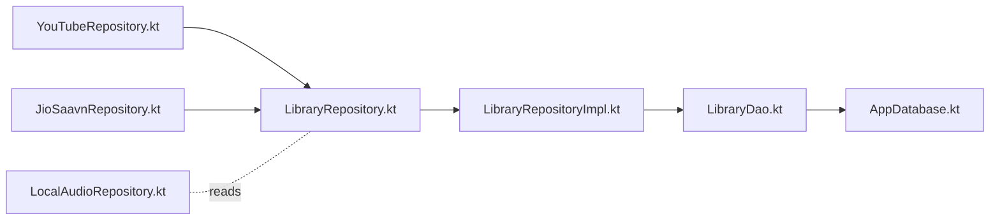
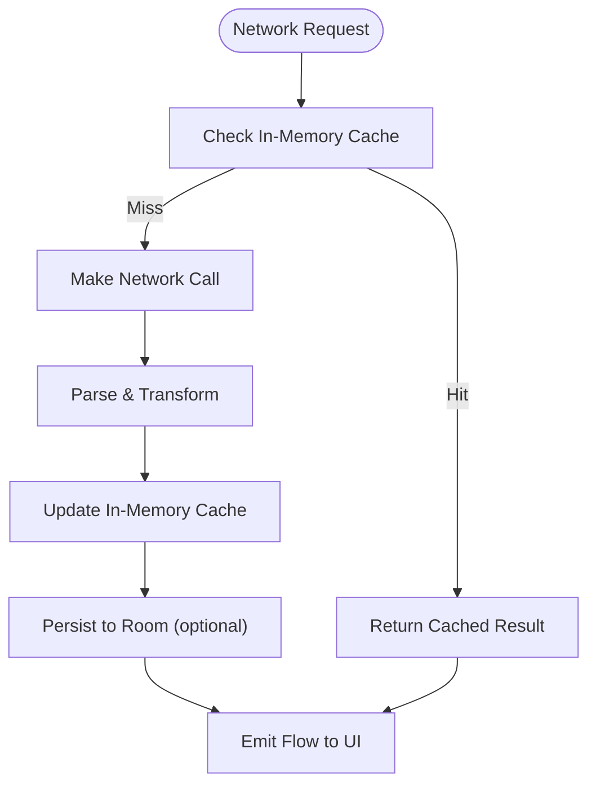
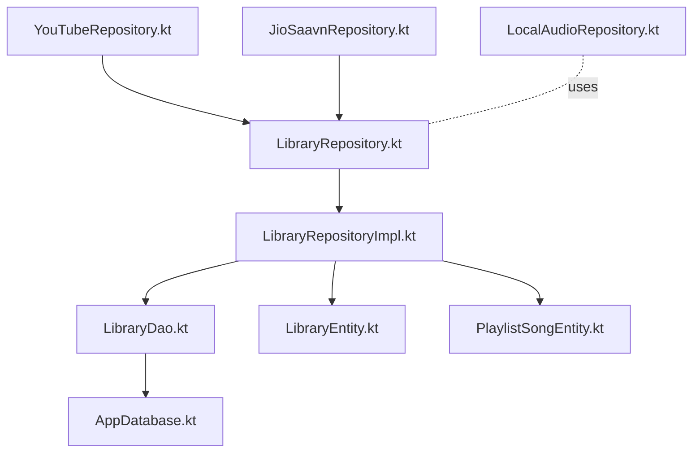

# Repository Pattern Implementation

<cite>
**Referenced Files in This Document**
- [LibraryRepository.kt](file://core/domain/src/main/java/com/suvojeet/suvmusic/core/domain/repository/LibraryRepository.kt)
- [LibraryRepositoryImpl.kt](file://core/data/src/main/java/com/suvojeet/suvmusic/core/data/repository/LibraryRepositoryImpl.kt)
- [LibraryDao.kt](file://core/data/src/main/java/com/suvojeet/suvmusic/core/data/local/dao/LibraryDao.kt)
- [AppDatabase.kt](file://core/data/src/main/java/com/suvojeet/suvmusic/core/data/local/AppDatabase.kt)
- [LibraryEntity.kt](file://core/data/src/main/java/com/suvojeet/suvmusic/core/data/local/entity/LibraryEntity.kt)
- [PlaylistSongEntity.kt](file://core/data/src/main/java/com/suvojeet/suvmusic/core/data/local/entity/PlaylistSongEntity.kt)
- [LibraryItem.kt](file://core/model/src/main/java/com/suvojeet/suvmusic/core/model/LibraryItem.kt)
- [PlaylistDisplayItem.kt](file://core/model/src/main/java/com/suvojeet/suvmusic/core/model/PlaylistDisplayItem.kt)
- [RepositoryModule.kt](file://core/data/src/main/java/com/suvojeet/suvmusic/core/data/di/RepositoryModule.kt)
- [LocalAudioRepository.kt](file://app/src/main/java/com/suvojeet/suvmusic/data/repository/LocalAudioRepository.kt)
- [YouTubeRepository.kt](file://app/src/main/java/com/suvojeet/suvmusic/data/repository/YouTubeRepository.kt)
- [CoroutineScopesModule.kt](file://app/src/main/java/com/suvojeet/suvmusic/di/CoroutineScopesModule.kt)
- [CacheModule.kt](file://app/src/main/java/com/suvojeet/suvmusic/di/CacheModule.kt)
</cite>

## Table of Contents
1. [Introduction](#introduction)
2. [Project Structure](#project-structure)
3. [Core Components](#core-components)
4. [Architecture Overview](#architecture-overview)
5. [Detailed Component Analysis](#detailed-component-analysis)
6. [Dependency Analysis](#dependency-analysis)
7. [Performance Considerations](#performance-considerations)
8. [Troubleshooting Guide](#troubleshooting-guide)
9. [Conclusion](#conclusion)

## Introduction
This document explains the repository pattern implementation in SuvMusic with a focus on the LibraryRepository abstraction and its Room-backed implementation. It details how the repository layer isolates data sources from business logic, integrates Room persistence, orchestrates network repositories, and maintains clean architecture. It also covers caching strategies, error handling patterns, thread safety, and testing facilitation.

## Project Structure
The repository pattern spans three layers:
- Domain: Defines the LibraryRepository interface and domain models.
- Data: Implements the repository using Room DAOs and entities.
- App: Integrates network repositories (YouTube, JioSaavn) and provides DI bindings.

**Diagram sources**
- [LibraryRepository.kt:11-36](file://core/domain/src/main/java/com/suvojeet/suvmusic/core/domain/repository/LibraryRepository.kt#L11-L36)
- [LibraryRepositoryImpl.kt:19-252](file://core/data/src/main/java/com/suvojeet/suvmusic/core/data/repository/LibraryRepositoryImpl.kt#L19-L252)
- [LibraryDao.kt:13-89](file://core/data/src/main/java/com/suvojeet/suvmusic/core/data/local/dao/LibraryDao.kt#L13-L89)
- [AppDatabase.kt:16-36](file://core/data/src/main/java/com/suvojeet/suvmusic/core/data/local/AppDatabase.kt#L16-L36)
- [LibraryEntity.kt:6-14](file://core/data/src/main/java/com/suvojeet/suvmusic/core/data/local/entity/LibraryEntity.kt#L6-L14)
- [PlaylistSongEntity.kt:6-24](file://core/data/src/main/java/com/suvojeet/suvmusic/core/data/local/entity/PlaylistSongEntity.kt#L6-L24)
- [RepositoryModule.kt:10-18](file://core/data/src/main/java/com/suvojeet/suvmusic/core/data/di/RepositoryModule.kt#L10-L18)
- [LocalAudioRepository.kt:17-52](file://app/src/main/java/com/suvojeet/suvmusic/data/repository/LocalAudioRepository.kt#L17-L52)
- [YouTubeRepository.kt:47-62](file://app/src/main/java/com/suvojeet/suvmusic/data/repository/YouTubeRepository.kt#L47-L62)
- [CoroutineScopesModule.kt:17-24](file://app/src/main/java/com/suvojeet/suvmusic/di/CoroutineScopesModule.kt#L17-L24)
- [CacheModule.kt:70-94](file://app/src/main/java/com/suvojeet/suvmusic/di/CacheModule.kt#L70-L94)

**Section sources**
- [LibraryRepository.kt:11-36](file://core/domain/src/main/java/com/suvojeet/suvmusic/core/domain/repository/LibraryRepository.kt#L11-L36)
- [LibraryRepositoryImpl.kt:19-252](file://core/data/src/main/java/com/suvojeet/suvmusic/core/data/repository/LibraryRepositoryImpl.kt#L19-L252)
- [LibraryDao.kt:13-89](file://core/data/src/main/java/com/suvojeet/suvmusic/core/data/local/dao/LibraryDao.kt#L13-L89)
- [AppDatabase.kt:16-36](file://core/data/src/main/java/com/suvojeet/suvmusic/core/data/local/AppDatabase.kt#L16-L36)
- [RepositoryModule.kt:10-18](file://core/data/src/main/java/com/suvojeet/suvmusic/core/data/di/RepositoryModule.kt#L10-L18)

## Core Components
- LibraryRepository: Declares the contract for library operations (playlists, albums, artists) and exposes reactive streams for cached data.
- LibraryRepositoryImpl: Concrete implementation that maps between domain models and Room entities, performs transformations, and delegates to DAOs.
- Room integration: AppDatabase defines entities and DAOs; LibraryDao encapsulates SQL queries and transactions.
- DI binding: RepositoryModule binds the interface to the implementation for Hilt.

Key responsibilities:
- Abstraction: Business logic depends on LibraryRepository, not on Room or network specifics.
- Data mapping: Converts between domain models and entities (e.g., LibraryEntity, PlaylistSongEntity).
- Reactive streams: Exposes Flow-based APIs for UI state updates.
- Transactions: Uses Room @Transaction to maintain atomicity for playlist operations.

**Section sources**
- [LibraryRepository.kt:11-36](file://core/domain/src/main/java/com/suvojeet/suvmusic/core/domain/repository/LibraryRepository.kt#L11-L36)
- [LibraryRepositoryImpl.kt:24-252](file://core/data/src/main/java/com/suvojeet/suvmusic/core/data/repository/LibraryRepositoryImpl.kt#L24-L252)
- [LibraryDao.kt:13-89](file://core/data/src/main/java/com/suvojeet/suvmusic/core/data/local/dao/LibraryDao.kt#L13-L89)
- [AppDatabase.kt:16-36](file://core/data/src/main/java/com/suvojeet/suvmusic/core/data/local/AppDatabase.kt#L16-L36)
- [RepositoryModule.kt:10-18](file://core/data/src/main/java/com/suvojeet/suvmusic/core/data/di/RepositoryModule.kt#L10-L18)

## Architecture Overview
The repository pattern enforces separation of concerns:
- Domain: Pure Kotlin interfaces and models.
- Data: Room-backed implementation plus DI wiring.
- App: Network repositories (YouTube, JioSaavn) consume the library repository for persistence and expose higher-level features.

**Diagram sources**
- [LibraryRepository.kt:11-36](file://core/domain/src/main/java/com/suvojeet/suvmusic/core/domain/repository/LibraryRepository.kt#L11-L36)
- [LibraryRepositoryImpl.kt:19-252](file://core/data/src/main/java/com/suvojeet/suvmusic/core/data/repository/LibraryRepositoryImpl.kt#L19-L252)
- [LibraryDao.kt:13-89](file://core/data/src/main/java/com/suvojeet/suvmusic/core/data/local/dao/LibraryDao.kt#L13-L89)

## Detailed Component Analysis

### LibraryRepository and LibraryRepositoryImpl
- Abstraction: LibraryRepository defines a stable API for playlist, album, and artist management, plus reactive flows for UI binding.
- Implementation: LibraryRepositoryImpl translates domain models to entities and vice versa, handles ordering and timestamps, and uses DAOs for persistence.
- Data transformation: Converts PlaylistSongEntity to Song and LibraryEntity to LibraryItem, with safe parsing of enums and URIs.
- Thread safety: Methods are suspend functions; Room DAOs are inherently thread-safe; Flow emissions occur on appropriate dispatcher boundaries.

**Diagram sources**
- [LibraryRepositoryImpl.kt:24-58](file://core/data/src/main/java/com/suvojeet/suvmusic/core/data/repository/LibraryRepositoryImpl.kt#L24-L58)
- [LibraryDao.kt:15-88](file://core/data/src/main/java/com/suvojeet/suvmusic/core/data/local/dao/LibraryDao.kt#L15-L88)
- [AppDatabase.kt:16-36](file://core/data/src/main/java/com/suvojeet/suvmusic/core/data/local/AppDatabase.kt#L16-L36)

**Section sources**
- [LibraryRepository.kt:11-36](file://core/domain/src/main/java/com/suvojeet/suvmusic/core/domain/repository/LibraryRepository.kt#L11-L36)
- [LibraryRepositoryImpl.kt:24-152](file://core/data/src/main/java/com/suvojeet/suvmusic/core/data/repository/LibraryRepositoryImpl.kt#L24-L152)
- [LibraryDao.kt:15-88](file://core/data/src/main/java/com/suvojeet/suvmusic/core/data/local/dao/LibraryDao.kt#L15-L88)

### Room Database and DAOs
- Entities: LibraryEntity stores library items (PLAYLIST, ALBUM, ARTIST); PlaylistSongEntity stores per-playlist songs with ordering and metadata.
- DAO: Provides CRUD, queries, and a @Transaction replacePlaylistSongs to atomically update playlist contents.
- Database: AppDatabase registers entities and exposes DAOs.

**Diagram sources**
- [LibraryEntity.kt:6-24](file://core/data/src/main/java/com/suvojeet/suvmusic/core/data/local/entity/LibraryEntity.kt#L6-L24)
- [PlaylistSongEntity.kt:6-24](file://core/data/src/main/java/com/suvojeet/suvmusic/core/data/local/entity/PlaylistSongEntity.kt#L6-L24)
- [AppDatabase.kt:16-36](file://core/data/src/main/java/com/suvojeet/suvmusic/core/data/local/AppDatabase.kt#L16-L36)

**Section sources**
- [LibraryEntity.kt:6-24](file://core/data/src/main/java/com/suvojeet/suvmusic/core/data/local/entity/LibraryEntity.kt#L6-L24)
- [PlaylistSongEntity.kt:6-24](file://core/data/src/main/java/com/suvojeet/suvmusic/core/data/local/entity/PlaylistSongEntity.kt#L6-L24)
- [LibraryDao.kt:13-89](file://core/data/src/main/java/com/suvojeet/suvmusic/core/data/local/dao/LibraryDao.kt#L13-L89)
- [AppDatabase.kt:16-36](file://core/data/src/main/java/com/suvojeet/suvmusic/core/data/local/AppDatabase.kt#L16-L36)

### Data Source Integration
- Local storage: Room persists library items and playlist songs.
- Network repositories: YouTubeRepository and JioSaavnRepository fetch remote data and can persist results via LibraryRepository for offline-first experiences.
- Local audio: LocalAudioRepository reads from MediaStore and converts to domain models for UI consumption.

**Diagram sources**
- [YouTubeRepository.kt:47-62](file://app/src/main/java/com/suvojeet/suvmusic/data/repository/YouTubeRepository.kt#L47-L62)
- [LocalAudioRepository.kt:17-52](file://app/src/main/java/com/suvojeet/suvmusic/data/repository/LocalAudioRepository.kt#L17-L52)
- [LibraryRepository.kt:11-36](file://core/domain/src/main/java/com/suvojeet/suvmusic/core/domain/repository/LibraryRepository.kt#L11-L36)
- [LibraryRepositoryImpl.kt:19-252](file://core/data/src/main/java/com/suvojeet/suvmusic/core/data/repository/LibraryRepositoryImpl.kt#L19-L252)
- [LibraryDao.kt:13-89](file://core/data/src/main/java/com/suvojeet/suvmusic/core/data/local/dao/LibraryDao.kt#L13-L89)
- [AppDatabase.kt:16-36](file://core/data/src/main/java/com/suvojeet/suvmusic/core/data/local/AppDatabase.kt#L16-L36)

**Section sources**
- [YouTubeRepository.kt:47-62](file://app/src/main/java/com/suvojeet/suvmusic/data/repository/YouTubeRepository.kt#L47-L62)
- [LocalAudioRepository.kt:17-52](file://app/src/main/java/com/suvojeet/suvmusic/data/repository/LocalAudioRepository.kt#L17-L52)
- [LibraryRepositoryImpl.kt:19-252](file://core/data/src/main/java/com/suvojeet/suvmusic/core/data/repository/LibraryRepositoryImpl.kt#L19-L252)

### Data Caching Strategies
- In-memory caches: JioSaavnRepository maintains in-memory caches for search results, song details, stream URLs, and playlists to reduce network load.
- Database caching: Room stores library items and playlist songs; Flow-based APIs propagate changes reactively to UI.
- Network caching: CacheModule configures OkHttp/ExoPlayer cache for downloads and streaming to improve reliability and performance.

**Diagram sources**
- [JioSaavnRepository.kt:35-40](file://app/src/main/java/com/suvojeet/suvmusic/data/repository/JioSaavnRepository.kt#L35-L40)
- [CacheModule.kt:70-94](file://app/src/main/java/com/suvojeet/suvmusic/di/CacheModule.kt#L70-L94)

**Section sources**
- [JioSaavnRepository.kt:35-40](file://app/src/main/java/com/suvojeet/suvmusic/data/repository/JioSaavnRepository.kt#L35-L40)
- [CacheModule.kt:70-94](file://app/src/main/java/com/suvojeet/suvmusic/di/CacheModule.kt#L70-L94)

### Error Handling Patterns
- Graceful degradation: Network repositories return empty lists or null when connectivity is unavailable.
- Defensive parsing: LibraryRepositoryImpl safely parses enums and URIs, falling back to defaults on errors.
- UI resilience: Flow emissions avoid blocking the main thread; coroutines are scoped appropriately.

**Section sources**
- [LibraryRepositoryImpl.kt:90-111](file://core/data/src/main/java/com/suvojeet/suvmusic/core/data/repository/LibraryRepositoryImpl.kt#L90-L111)
- [YouTubeRepository.kt:133-175](file://app/src/main/java/com/suvojeet/suvmusic/data/repository/YouTubeRepository.kt#L133-L175)

### Asynchronous Operation Handling
- Suspend functions: All repository operations are suspend to integrate with coroutines.
- Dispatcher usage: Local IO operations (e.g., MediaStore) use Dispatchers.IO; Room DAOs are safe to call from any thread.
- Scope management: CoroutineScopesModule provides a singleton application scope for long-running tasks.

**Section sources**
- [LocalAudioRepository.kt:57-122](file://app/src/main/java/com/suvojeet/suvmusic/data/repository/LocalAudioRepository.kt#L57-L122)
- [CoroutineScopesModule.kt:20-24](file://app/src/main/java/com/suvojeet/suvmusic/di/CoroutineScopesModule.kt#L20-L24)

### Thread Safety Considerations
- Room DAOs: Safe to call from any thread; Room manages thread confinement internally.
- Flow emissions: Occur on the dispatcher backing the source Flow (e.g., Room’s background threads).
- Mutations: @Transaction ensures atomic replacement of playlist songs.

**Section sources**
- [LibraryDao.kt:84-88](file://core/data/src/main/java/com/suvojeet/suvmusic/core/data/local/dao/LibraryDao.kt#L84-L88)

### Examples of Repository Method Implementations
- Save playlist with songs: [LibraryRepositoryImpl.kt:24-37](file://core/data/src/main/java/com/suvojeet/suvmusic/core/data/repository/LibraryRepositoryImpl.kt#L24-L37)
- Append songs with ordering: [LibraryRepositoryImpl.kt:60-79](file://core/data/src/main/java/com/suvojeet/suvmusic/core/data/repository/LibraryRepositoryImpl.kt#L60-L79)
- Replace playlist songs atomically: [LibraryRepositoryImpl.kt:133-152](file://core/data/src/main/java/com/suvojeet/suvmusic/core/data/repository/LibraryRepositoryImpl.kt#L133-L152), [LibraryDao.kt:84-88](file://core/data/src/main/java/com/suvojeet/suvmusic/core/data/local/dao/LibraryDao.kt#L84-L88)
- Reactive playlist count: [LibraryRepositoryImpl.kt:117-119](file://core/data/src/main/java/com/suvojeet/suvmusic/core/data/repository/LibraryRepositoryImpl.kt#L117-L119), [LibraryDao.kt:72-73](file://core/data/src/main/java/com/suvojeet/suvmusic/core/data/local/dao/LibraryDao.kt#L72-L73)

### Data Transformation Logic
- Entity to domain: LibraryEntity mapped to LibraryItem; PlaylistSongEntity mapped to Song with safe enum/URI parsing.
- UI-friendly models: PlaylistDisplayItem derived from library items with computed metadata.

**Section sources**
- [LibraryRepositoryImpl.kt:81-114](file://core/data/src/main/java/com/suvojeet/suvmusic/core/data/repository/LibraryRepositoryImpl.kt#L81-L114)
- [LibraryRepositoryImpl.kt:191-214](file://core/data/src/main/java/com/suvojeet/suvmusic/core/data/repository/LibraryRepositoryImpl.kt#L191-L214)
- [LibraryItem.kt:3-10](file://core/model/src/main/java/com/suvojeet/suvmusic/core/model/LibraryItem.kt#L3-L10)
- [PlaylistDisplayItem.kt:7-15](file://core/model/src/main/java/com/suvojeet/suvmusic/core/model/PlaylistDisplayItem.kt#L7-L15)

### Role in Clean Architecture and Testing
- Clean architecture: Business logic depends on LibraryRepository; tests can mock the interface and inject test doubles.
- DI: RepositoryModule binds the interface to the implementation, enabling easy substitution for tests or feature toggles.

**Section sources**
- [RepositoryModule.kt:10-18](file://core/data/src/main/java/com/suvojeet/suvmusic/core/data/di/RepositoryModule.kt#L10-L18)
- [LibraryRepository.kt:11-36](file://core/domain/src/main/java/com/suvojeet/suvmusic/core/domain/repository/LibraryRepository.kt#L11-L36)

## Dependency Analysis

**Diagram sources**
- [LibraryRepository.kt:11-36](file://core/domain/src/main/java/com/suvojeet/suvmusic/core/domain/repository/LibraryRepository.kt#L11-L36)
- [LibraryRepositoryImpl.kt:19-252](file://core/data/src/main/java/com/suvojeet/suvmusic/core/data/repository/LibraryRepositoryImpl.kt#L19-L252)
- [LibraryDao.kt:13-89](file://core/data/src/main/java/com/suvojeet/suvmusic/core/data/local/dao/LibraryDao.kt#L13-L89)
- [AppDatabase.kt:16-36](file://core/data/src/main/java/com/suvojeet/suvmusic/core/data/local/AppDatabase.kt#L16-L36)
- [LibraryEntity.kt:6-24](file://core/data/src/main/java/com/suvojeet/suvmusic/core/data/local/entity/LibraryEntity.kt#L6-L24)
- [PlaylistSongEntity.kt:6-24](file://core/data/src/main/java/com/suvojeet/suvmusic/core/data/local/entity/PlaylistSongEntity.kt#L6-L24)
- [YouTubeRepository.kt:47-62](file://app/src/main/java/com/suvojeet/suvmusic/data/repository/YouTubeRepository.kt#L47-L62)
- [LocalAudioRepository.kt:17-52](file://app/src/main/java/com/suvojeet/suvmusic/data/repository/LocalAudioRepository.kt#L17-L52)

**Section sources**
- [RepositoryModule.kt:10-18](file://core/data/src/main/java/com/suvojeet/suvmusic/core/data/di/RepositoryModule.kt#L10-L18)

## Performance Considerations
- Prefer Flow-based reactive streams for UI to minimize redundant recompositions.
- Use Room transactions (@Transaction) to batch writes and avoid intermediate UI flicker.
- Cache frequently accessed data in-memory (e.g., JioSaavnRepository caches) to reduce network latency.
- Offload IO-bound operations to Dispatchers.IO and avoid blocking the main thread.

## Troubleshooting Guide
- Empty or stale library data: Verify Room migrations and DAO queries; ensure Flow subscriptions are active.
- Parsing errors: Confirm enum and URI parsing fallbacks in LibraryRepositoryImpl.
- Network failures: Check connectivity checks and return paths in network repositories; ensure graceful fallbacks.
- Concurrency issues: Confirm DAO calls are not performed on the main thread; use appropriate scopes.

**Section sources**
- [LibraryRepositoryImpl.kt:90-111](file://core/data/src/main/java/com/suvojeet/suvmusic/core/data/repository/LibraryRepositoryImpl.kt#L90-L111)
- [YouTubeRepository.kt:133-175](file://app/src/main/java/com/suvojeet/suvmusic/data/repository/YouTubeRepository.kt#L133-L175)

## Conclusion
SuvMusic’s repository pattern cleanly separates domain logic from data sources. The LibraryRepository interface defines a stable contract, while LibraryRepositoryImpl encapsulates Room persistence and data transformations. Network repositories integrate with the library repository to support offline-first experiences, and DI wiring enables testability and flexibility. The combination of Room transactions, Flow emissions, and in-memory caching yields a responsive and robust data layer aligned with clean architecture principles.