# Storage Management

<cite>
**Referenced Files in This Document**
- [BackupManager.kt](file://app/src/main/java/com/suvojeet/suvmusic/data/BackupManager.kt)
- [BackupData.kt](file://app/src/main/java/com/suvojeet/suvmusic/data/model/BackupData.kt)
- [BackupViewModel.kt](file://app/src/main/java/com/suvojeet/suvmusic/ui/viewmodel/BackupViewModel.kt)
- [StorageScreen.kt](file://app/src/main/java/com/suvojeet/suvmusic/ui/screens/StorageScreen.kt)
- [DownloadRepository.kt](file://app/src/main/java/com/suvojeet/suvmusic/data/repository/DownloadRepository.kt)
- [LocalAudioRepository.kt](file://app/src/main/java/com/suvojeet/suvmusic/data/repository/LocalAudioRepository.kt)
- [DownloadService.kt](file://app/src/main/java/com/suvojeet/suvmusic/service/DownloadService.kt)
- [PlaylistExportHelper.kt](file://app/src/main/java/com/suvojeet/suvmusic/util/PlaylistExportHelper.kt)
- [PlaylistImportHelper.kt](file://app/src/main/java/com/suvojeet/suvmusic/util/PlaylistImportHelper.kt)
- [SecureConfig.kt](file://app/src/main/java/com/suvojeet/suvmusic/util/SecureConfig.kt)
- [AESUtil.kt](file://app/src/main/java/com/suvojeet/suvmusic/util/AESUtil.kt)
- [secure_config.cpp](file://app/src/main/cpp/secure_config.cpp)
- [file_paths.xml](file://app/src/main/res/xml/file_paths.xml)
- [AppDatabase.kt](file://core/data/src/main/java/com/suvojeet/suvmusic/core/data/local/AppDatabase.kt)
- [shareplay.proto](file://app/src/main/proto/shareplay.proto)
</cite>

## Table of Contents
1. [Introduction](#introduction)
2. [Project Structure](#project-structure)
3. [Core Components](#core-components)
4. [Architecture Overview](#architecture-overview)
5. [Detailed Component Analysis](#detailed-component-analysis)
6. [Dependency Analysis](#dependency-analysis)
7. [Performance Considerations](#performance-considerations)
8. [Troubleshooting Guide](#troubleshooting-guide)
9. [Conclusion](#conclusion)
10. [Appendices](#appendices)

## Introduction
This document explains SuvMusic’s storage management system comprehensively. It covers local database storage, file system organization, cache management, backup and restore, data export/import, secure configuration storage, and storage optimization strategies. It also documents user controls for storage preferences, cleanup policies, and recovery procedures.

## Project Structure
SuvMusic organizes storage-related logic across several modules:
- Data layer: Room database, repositories, and backup manager
- UI layer: Screens for storage management and backup UI state
- Utilities: Encryption helpers, tagging utilities, and playlist import/export
- Services: Foreground download service for persistent downloads
- Native: Secure key derivation for sensitive configuration

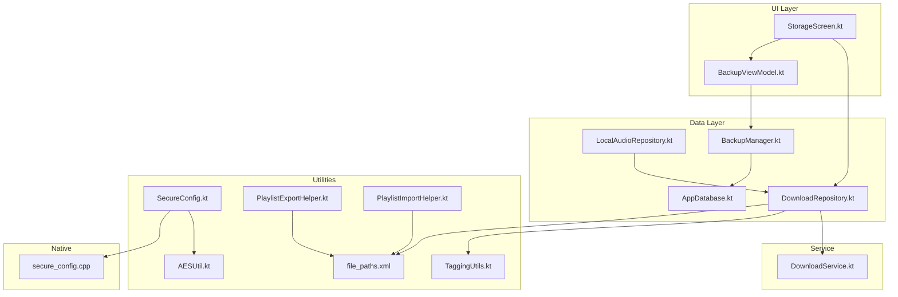

**Diagram sources**
- [StorageScreen.kt:1-496](file://app/src/main/java/com/suvojeet/suvmusic/ui/screens/StorageScreen.kt#L1-L496)
- [BackupViewModel.kt:1-79](file://app/src/main/java/com/suvojeet/suvmusic/ui/viewmodel/BackupViewModel.kt#L1-L79)
- [DownloadRepository.kt:1-800](file://app/src/main/java/com/suvojeet/suvmusic/data/repository/DownloadRepository.kt#L1-L800)
- [LocalAudioRepository.kt:1-432](file://app/src/main/java/com/suvojeet/suvmusic/data/repository/LocalAudioRepository.kt#L1-L432)
- [BackupManager.kt:1-117](file://app/src/main/java/com/suvojeet/suvmusic/data/BackupManager.kt#L1-L117)
- [AppDatabase.kt:1-37](file://core/data/src/main/java/com/suvojeet/suvmusic/core/data/local/AppDatabase.kt#L1-L37)
- [AESUtil.kt:1-62](file://app/src/main/java/com/suvojeet/suvmusic/util/AESUtil.kt#L1-L62)
- [SecureConfig.kt:1-61](file://app/src/main/java/com/suvojeet/suvmusic/util/SecureConfig.kt#L1-L61)
- [PlaylistExportHelper.kt:1-116](file://app/src/main/java/com/suvojeet/suvmusic/util/PlaylistExportHelper.kt#L1-L116)
- [PlaylistImportHelper.kt:1-234](file://app/src/main/java/com/suvojeet/suvmusic/util/PlaylistImportHelper.kt#L1-L234)
- [TaggingUtils.kt:1-60](file://app/src/main/java/com/suvojeet/suvmusic/util/TaggingUtils.kt#L1-L60)
- [file_paths.xml:1-14](file://app/src/main/res/xml/file_paths.xml#L1-L14)
- [DownloadService.kt:1-305](file://app/src/main/java/com/suvojeet/suvmusic/service/DownloadService.kt#L1-L305)
- [secure_config.cpp:1-61](file://app/src/main/cpp/secure_config.cpp#L1-L61)

**Section sources**
- [StorageScreen.kt:1-496](file://app/src/main/java/com/suvojeet/suvmusic/ui/screens/StorageScreen.kt#L1-L496)
- [DownloadRepository.kt:1-800](file://app/src/main/java/com/suvojeet/suvmusic/data/repository/DownloadRepository.kt#L1-L800)
- [BackupManager.kt:1-117](file://app/src/main/java/com/suvojeet/suvmusic/data/BackupManager.kt#L1-L117)
- [AppDatabase.kt:1-37](file://core/data/src/main/java/com/suvojeet/suvmusic/core/data/local/AppDatabase.kt#L1-L37)

## Core Components
- Local database: Room database storing library, history, genres, and dislikes
- File system: Downloads organized under public Music directory with optional custom location; thumbnails and image cache stored in app cache
- Backup/restore: Complete app data backed up to a compressed JSON file and restored atomically
- Export/import: Playlists exported to M3U or proprietary SUV format; imports from URLs or files
- Secure configuration: Sensitive endpoints and credentials protected by AES with native-derived keys
- Cache management: Progressive cache for streaming, image cache, and thumbnail cache with explicit clearing actions
- Storage UI: Centralized storage screen with disk usage overview, actions, and user preferences

**Section sources**
- [AppDatabase.kt:1-37](file://core/data/src/main/java/com/suvojeet/suvmusic/core/data/local/AppDatabase.kt#L1-L37)
- [DownloadRepository.kt:1-800](file://app/src/main/java/com/suvojeet/suvmusic/data/repository/DownloadRepository.kt#L1-L800)
- [BackupManager.kt:1-117](file://app/src/main/java/com/suvojeet/suvmusic/data/BackupManager.kt#L1-L117)
- [PlaylistExportHelper.kt:1-116](file://app/src/main/java/com/suvojeet/suvmusic/util/PlaylistExportHelper.kt#L1-L116)
- [PlaylistImportHelper.kt:1-234](file://app/src/main/java/com/suvojeet/suvmusic/util/PlaylistImportHelper.kt#L1-L234)
- [SecureConfig.kt:1-61](file://app/src/main/java/com/suvojeet/suvmusic/util/SecureConfig.kt#L1-L61)
- [StorageScreen.kt:1-496](file://app/src/main/java/com/suvojeet/suvmusic/ui/screens/StorageScreen.kt#L1-L496)

## Architecture Overview
The storage subsystem integrates UI, repositories, services, and utilities to manage local data, file system storage, and backups.

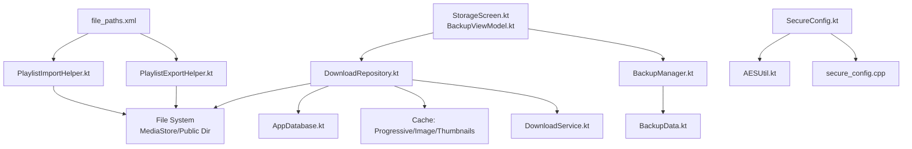

**Diagram sources**
- [StorageScreen.kt:1-496](file://app/src/main/java/com/suvojeet/suvmusic/ui/screens/StorageScreen.kt#L1-L496)
- [BackupViewModel.kt:1-79](file://app/src/main/java/com/suvojeet/suvmusic/ui/viewmodel/BackupViewModel.kt#L1-L79)
- [DownloadRepository.kt:1-800](file://app/src/main/java/com/suvojeet/suvmusic/data/repository/DownloadRepository.kt#L1-L800)
- [BackupManager.kt:1-117](file://app/src/main/java/com/suvojeet/suvmusic/data/BackupManager.kt#L1-L117)
- [BackupData.kt:1-34](file://app/src/main/java/com/suvojeet/suvmusic/data/model/BackupData.kt#L1-L34)
- [DownloadService.kt:1-305](file://app/src/main/java/com/suvojeet/suvmusic/service/DownloadService.kt#L1-L305)
- [PlaylistExportHelper.kt:1-116](file://app/src/main/java/com/suvojeet/suvmusic/util/PlaylistExportHelper.kt#L1-L116)
- [PlaylistImportHelper.kt:1-234](file://app/src/main/java/com/suvojeet/suvmusic/util/PlaylistImportHelper.kt#L1-L234)
- [SecureConfig.kt:1-61](file://app/src/main/java/com/suvojeet/suvmusic/util/SecureConfig.kt#L1-L61)
- [AESUtil.kt:1-62](file://app/src/main/java/com/suvojeet/suvmusic/util/AESUtil.kt#L1-L62)
- [secure_config.cpp:1-61](file://app/src/main/cpp/secure_config.cpp#L1-L61)
- [file_paths.xml:1-14](file://app/src/main/res/xml/file_paths.xml#L1-L14)

## Detailed Component Analysis

### Local Database Storage
- Entities: Library items, playlist-song associations, listening history, disliked songs/artists, and song genres
- DAOs: CRUD operations for each entity
- Transactions: Backup restores use Room transactions to ensure atomicity across collections

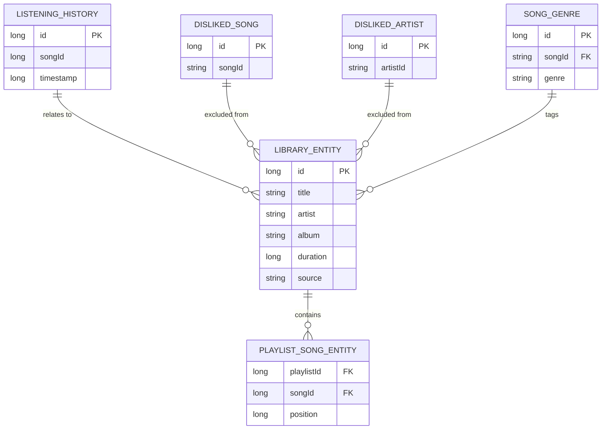

**Diagram sources**
- [AppDatabase.kt:1-37](file://core/data/src/main/java/com/suvojeet/suvmusic/core/data/local/AppDatabase.kt#L1-L37)

**Section sources**
- [AppDatabase.kt:1-37](file://core/data/src/main/java/com/suvojeet/suvmusic/core/data/local/AppDatabase.kt#L1-L37)
- [BackupManager.kt:75-107](file://app/src/main/java/com/suvojeet/suvmusic/data/BackupManager.kt#L75-L107)

### File System Organization
- Default downloads location: Public Music directory under a dedicated app folder
- Legacy migration: Old internal storage downloads are migrated to the public Music directory
- Custom location: Users can select a storage tree URI; downloads are saved under sanitized subfolders
- MediaStore integration: On modern Android, files are registered via MediaStore to be indexed by the system
- Cache directories: Images, crash logs, updates, and exported playlists are stored under app cache with FileProvider exposure

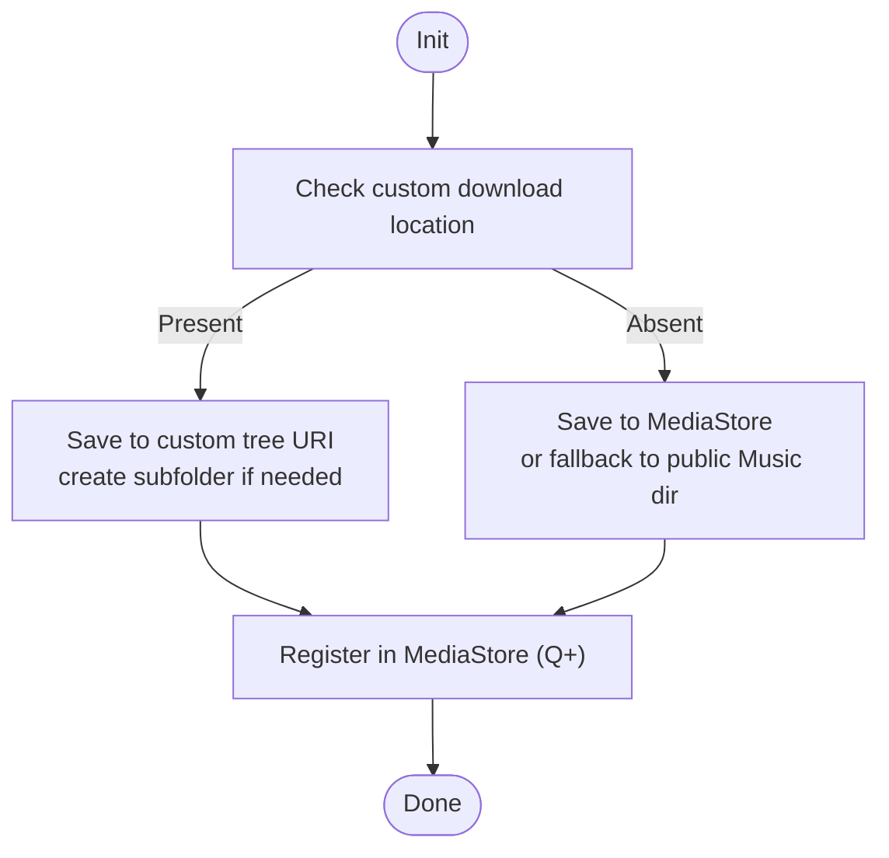

**Diagram sources**
- [DownloadRepository.kt:375-476](file://app/src/main/java/com/suvojeet/suvmusic/data/repository/DownloadRepository.kt#L375-L476)
- [DownloadRepository.kt:478-612](file://app/src/main/java/com/suvojeet/suvmusic/data/repository/DownloadRepository.kt#L478-L612)
- [DownloadRepository.kt:225-261](file://app/src/main/java/com/suvojeet/suvmusic/data/repository/DownloadRepository.kt#L225-L261)
- [file_paths.xml:1-14](file://app/src/main/res/xml/file_paths.xml#L1-L14)

**Section sources**
- [DownloadRepository.kt:211-261](file://app/src/main/java/com/suvojeet/suvmusic/data/repository/DownloadRepository.kt#L211-L261)
- [DownloadRepository.kt:375-476](file://app/src/main/java/com/suvojeet/suvmusic/data/repository/DownloadRepository.kt#L375-L476)
- [DownloadRepository.kt:478-612](file://app/src/main/java/com/suvojeet/suvmusic/data/repository/DownloadRepository.kt#L478-L612)
- [file_paths.xml:1-14](file://app/src/main/res/xml/file_paths.xml#L1-L14)

### Cache Management Strategies
- Progressive cache: Streaming progress tracked per song; UI receives progress updates
- Image cache: Temporary images cached under cache directories; can be cleared from storage screen
- Thumbnails: Album artwork downloaded and stored; can be cleared independently
- Player cache: Dedicated section in storage screen for streamed content

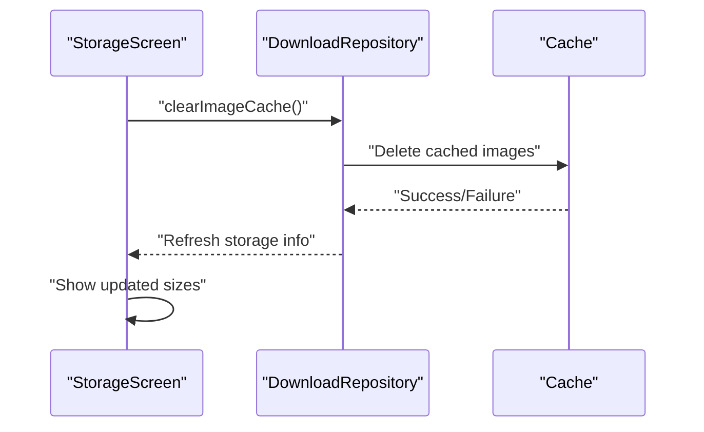

**Diagram sources**
- [StorageScreen.kt:333-361](file://app/src/main/java/com/suvojeet/suvmusic/ui/screens/StorageScreen.kt#L333-L361)
- [DownloadRepository.kt:684-767](file://app/src/main/java/com/suvojeet/suvmusic/data/repository/DownloadRepository.kt#L684-L767)

**Section sources**
- [StorageScreen.kt:227-248](file://app/src/main/java/com/suvojeet/suvmusic/ui/screens/StorageScreen.kt#L227-L248)
- [StorageScreen.kt:333-361](file://app/src/main/java/com/suvojeet/suvmusic/ui/screens/StorageScreen.kt#L333-L361)

### Backup and Restore Mechanisms
- Backup: Serializes settings, encrypted settings, library, playlists, history, dislikes, and genres into a JSON object, compresses with GZIP, and writes to an output stream
- Restore: Reads and inflates the backup, restores settings, clears and reinserts database content atomically, and logs completion

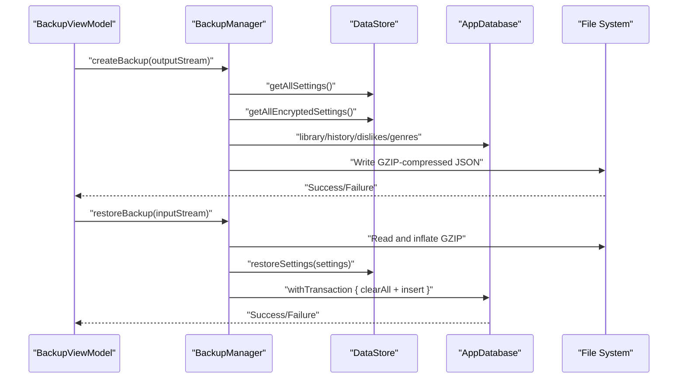

**Diagram sources**
- [BackupViewModel.kt:33-73](file://app/src/main/java/com/suvojeet/suvmusic/ui/viewmodel/BackupViewModel.kt#L33-L73)
- [BackupManager.kt:30-56](file://app/src/main/java/com/suvojeet/suvmusic/data/BackupManager.kt#L30-L56)
- [BackupManager.kt:62-115](file://app/src/main/java/com/suvojeet/suvmusic/data/BackupManager.kt#L62-L115)
- [BackupData.kt:14-33](file://app/src/main/java/com/suvojeet/suvmusic/data/model/BackupData.kt#L14-L33)

**Section sources**
- [BackupManager.kt:30-115](file://app/src/main/java/com/suvojeet/suvmusic/data/BackupManager.kt#L30-L115)
- [BackupViewModel.kt:33-73](file://app/src/main/java/com/suvojeet/suvmusic/ui/viewmodel/BackupViewModel.kt#L33-L73)
- [BackupData.kt:14-33](file://app/src/main/java/com/suvojeet/suvmusic/data/model/BackupData.kt#L14-L33)

### Data Export/Import Functionality
- Export: Playlists exported as M3U or proprietary SUV format; files written to cache and shared via FileProvider
- Import: Parses M3U and SUV files; supports YouTube playlist URLs and Spotify links via helper utilities

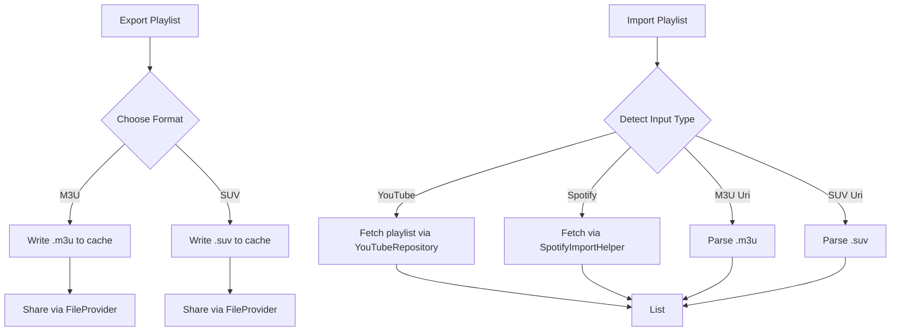

**Diagram sources**
- [PlaylistExportHelper.kt:12-114](file://app/src/main/java/com/suvojeet/suvmusic/util/PlaylistExportHelper.kt#L12-L114)
- [PlaylistImportHelper.kt:39-136](file://app/src/main/java/com/suvojeet/suvmusic/util/PlaylistImportHelper.kt#L39-L136)
- [PlaylistImportHelper.kt:141-232](file://app/src/main/java/com/suvojeet/suvmusic/util/PlaylistImportHelper.kt#L141-L232)
- [file_paths.xml:9](file://app/src/main/res/xml/file_paths.xml#L9)

**Section sources**
- [PlaylistExportHelper.kt:12-114](file://app/src/main/java/com/suvojeet/suvmusic/util/PlaylistExportHelper.kt#L12-L114)
- [PlaylistImportHelper.kt:39-136](file://app/src/main/java/com/suvojeet/suvmusic/util/PlaylistImportHelper.kt#L39-L136)
- [PlaylistImportHelper.kt:141-232](file://app/src/main/java/com/suvojeet/suvmusic/util/PlaylistImportHelper.kt#L141-L232)
- [file_paths.xml:9](file://app/src/main/res/xml/file_paths.xml#L9)

### Secure Configuration Storage and Encrypted Preferences
- Sensitive endpoints and developer credentials are AES-encrypted strings
- Keys derived in native code to reduce reverse-engineering risk
- Runtime decryption performed when needed

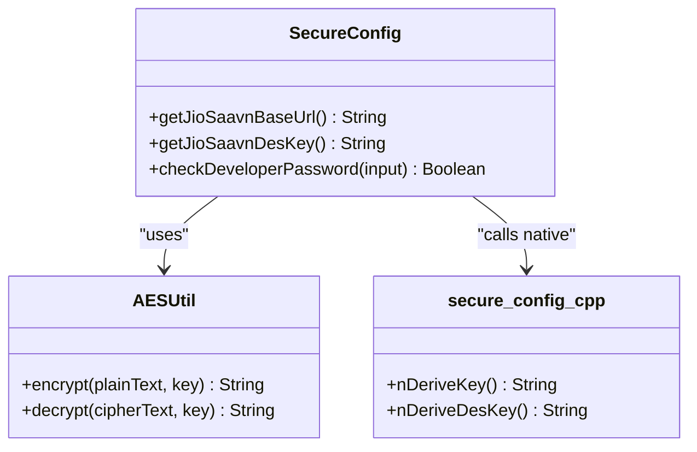

**Diagram sources**
- [SecureConfig.kt:10-60](file://app/src/main/java/com/suvojeet/suvmusic/util/SecureConfig.kt#L10-L60)
- [AESUtil.kt:12-61](file://app/src/main/java/com/suvojeet/suvmusic/util/AESUtil.kt#L12-L61)
- [secure_config.cpp:17-46](file://app/src/main/cpp/secure_config.cpp#L17-L46)

**Section sources**
- [SecureConfig.kt:10-60](file://app/src/main/java/com/suvojeet/suvmusic/util/SecureConfig.kt#L10-L60)
- [AESUtil.kt:12-61](file://app/src/main/java/com/suvojeet/suvmusic/util/AESUtil.kt#L12-L61)
- [secure_config.cpp:17-46](file://app/src/main/cpp/secure_config.cpp#L17-L46)

### Storage Cleanup Policies and User Controls
- Delete all downloads: Removes all offline files and refreshes storage metrics
- Clear image cache and thumbnails: Deletes cached images and album artwork respectively
- Set custom download location: Persists a tree URI and grants persistable permissions
- Automatic cleanup triggers: Not implemented; users initiate actions via the storage screen

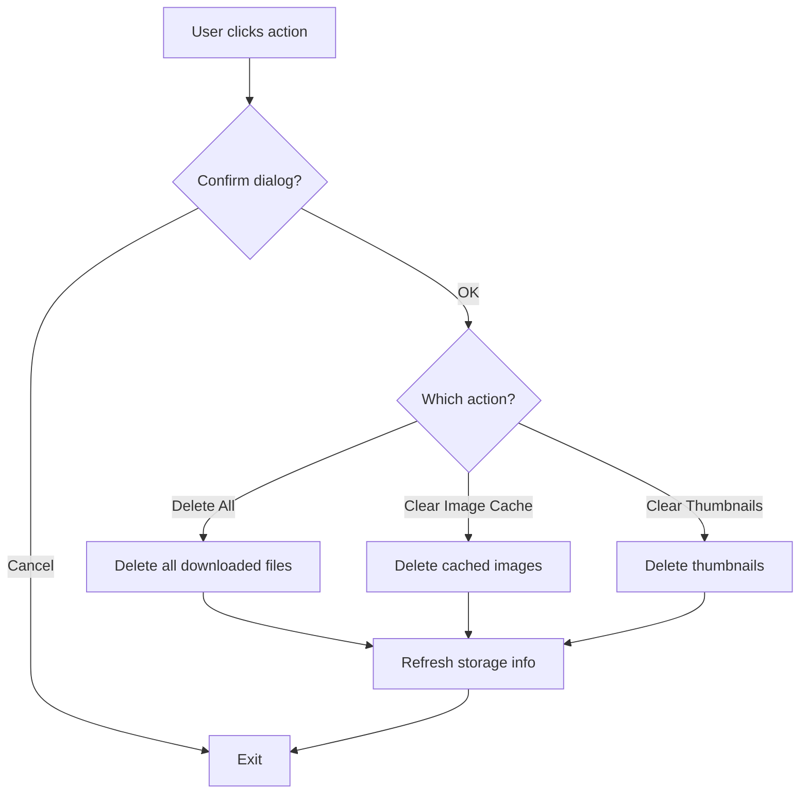

**Diagram sources**
- [StorageScreen.kt:302-391](file://app/src/main/java/com/suvojeet/suvmusic/ui/screens/StorageScreen.kt#L302-L391)
- [DownloadRepository.kt:263-330](file://app/src/main/java/com/suvojeet/suvmusic/data/repository/DownloadRepository.kt#L263-L330)
- [DownloadRepository.kt:684-767](file://app/src/main/java/com/suvojeet/suvmusic/data/repository/DownloadRepository.kt#L684-L767)

**Section sources**
- [StorageScreen.kt:256-391](file://app/src/main/java/com/suvojeet/suvmusic/ui/screens/StorageScreen.kt#L256-L391)
- [DownloadRepository.kt:263-330](file://app/src/main/java/com/suvojeet/suvmusic/data/repository/DownloadRepository.kt#L263-L330)
- [DownloadRepository.kt:684-767](file://app/src/main/java/com/suvojeet/suvmusic/data/repository/DownloadRepository.kt#L684-L767)

### Download Pipeline and Background Persistence
- Foreground service ensures downloads continue when the app is closed
- Queue-based processing with progress notifications
- Metadata embedding and album art tagging supported

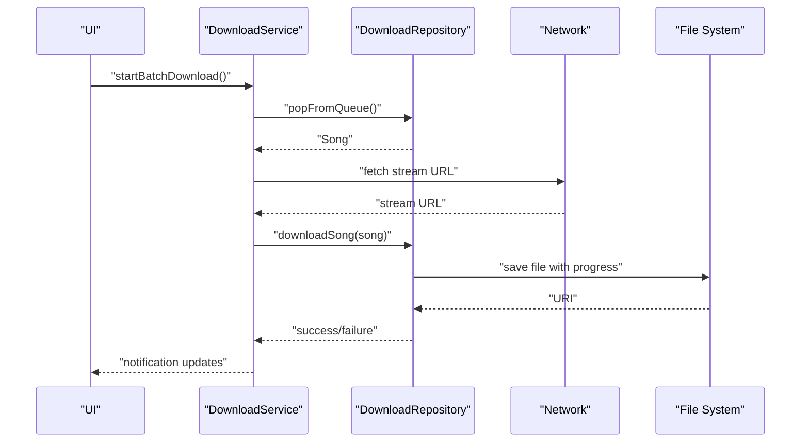

**Diagram sources**
- [DownloadService.kt:164-211](file://app/src/main/java/com/suvojeet/suvmusic/service/DownloadService.kt#L164-L211)
- [DownloadRepository.kt:771-800](file://app/src/main/java/com/suvojeet/suvmusic/data/repository/DownloadRepository.kt#L771-L800)
- [DownloadRepository.kt:478-612](file://app/src/main/java/com/suvojeet/suvmusic/data/repository/DownloadRepository.kt#L478-L612)
- [TaggingUtils.kt:20-58](file://app/src/main/java/com/suvojeet/suvmusic/util/TaggingUtils.kt#L20-L58)

**Section sources**
- [DownloadService.kt:164-211](file://app/src/main/java/com/suvojeet/suvmusic/service/DownloadService.kt#L164-L211)
- [DownloadRepository.kt:478-612](file://app/src/main/java/com/suvojeet/suvmusic/data/repository/DownloadRepository.kt#L478-L612)
- [TaggingUtils.kt:20-58](file://app/src/main/java/com/suvojeet/suvmusic/util/TaggingUtils.kt#L20-L58)

### Storage Optimization and Disk Monitoring
- Atomic saves and loads for downloads metadata using atomic file writes
- Deduplication and resolution of local files by title/artist heuristics
- Scanning and migration of legacy folders to optimize storage layout
- Progressively updated UI metrics for total used space and component sizes

**Section sources**
- [DownloadRepository.kt:684-767](file://app/src/main/java/com/suvojeet/suvmusic/data/repository/DownloadRepository.kt#L684-L767)
- [DownloadRepository.kt:137-162](file://app/src/main/java/com/suvojeet/suvmusic/data/repository/DownloadRepository.kt#L137-L162)
- [DownloadRepository.kt:225-261](file://app/src/main/java/com/suvojeet/suvmusic/data/repository/DownloadRepository.kt#L225-L261)
- [StorageScreen.kt:172-178](file://app/src/main/java/com/suvojeet/suvmusic/ui/screens/StorageScreen.kt#L172-L178)

### Additional Notes on Data Integrity and Recovery
- Backup includes serialized settings and encrypted settings for a complete restoration
- Restore uses Room transactions to maintain referential integrity across tables
- Local audio repository queries MediaStore to reconcile library with device storage

**Section sources**
- [BackupManager.kt:75-107](file://app/src/main/java/com/suvojeet/suvmusic/data/BackupManager.kt#L75-L107)
- [LocalAudioRepository.kt:57-122](file://app/src/main/java/com/suvojeet/suvmusic/data/repository/LocalAudioRepository.kt#L57-122)

## Dependency Analysis
The following diagram highlights key dependencies among storage components:

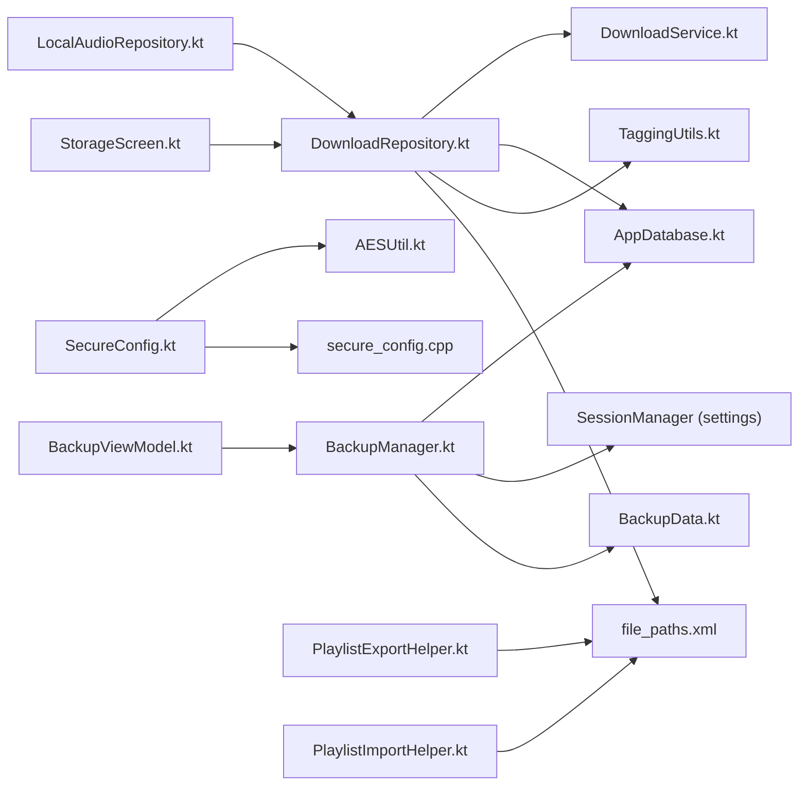

**Diagram sources**
- [BackupManager.kt:1-25](file://app/src/main/java/com/suvojeet/suvmusic/data/BackupManager.kt#L1-L25)
- [AppDatabase.kt:1-37](file://core/data/src/main/java/com/suvojeet/suvmusic/core/data/local/AppDatabase.kt#L1-L37)
- [DownloadRepository.kt:1-46](file://app/src/main/java/com/suvojeet/suvmusic/data/repository/DownloadRepository.kt#L1-L46)
- [DownloadService.kt:1-27](file://app/src/main/java/com/suvojeet/suvmusic/service/DownloadService.kt#L1-L27)
- [TaggingUtils.kt:1-60](file://app/src/main/java/com/suvojeet/suvmusic/util/TaggingUtils.kt#L1-L60)
- [file_paths.xml:1-14](file://app/src/main/res/xml/file_paths.xml#L1-L14)
- [LocalAudioRepository.kt:1-23](file://app/src/main/java/com/suvojeet/suvmusic/data/repository/LocalAudioRepository.kt#L1-L23)
- [BackupViewModel.kt:1-28](file://app/src/main/java/com/suvojeet/suvmusic/ui/viewmodel/BackupViewModel.kt#L1-L28)
- [StorageScreen.kt:1-52](file://app/src/main/java/com/suvojeet/suvmusic/ui/screens/StorageScreen.kt#L1-L52)
- [SecureConfig.kt:1-25](file://app/src/main/java/com/suvojeet/suvmusic/util/SecureConfig.kt#L1-L25)
- [AESUtil.kt:1-25](file://app/src/main/java/com/suvojeet/suvmusic/util/AESUtil.kt#L1-L25)
- [secure_config.cpp:1-20](file://app/src/main/cpp/secure_config.cpp#L1-L20)
- [PlaylistExportHelper.kt:1-25](file://app/src/main/java/com/suvojeet/suvmusic/util/PlaylistExportHelper.kt#L1-L25)
- [PlaylistImportHelper.kt:1-25](file://app/src/main/java/com/suvojeet/suvmusic/util/PlaylistImportHelper.kt#L1-L25)

**Section sources**
- [BackupManager.kt:1-25](file://app/src/main/java/com/suvojeet/suvmusic/data/BackupManager.kt#L1-L25)
- [DownloadRepository.kt:1-46](file://app/src/main/java/com/suvojeet/suvmusic/data/repository/DownloadRepository.kt#L1-L46)
- [DownloadService.kt:1-27](file://app/src/main/java/com/suvojeet/suvmusic/service/DownloadService.kt#L1-L27)
- [LocalAudioRepository.kt:1-23](file://app/src/main/java/com/suvojeet/suvmusic/data/repository/LocalAudioRepository.kt#L1-L23)
- [BackupViewModel.kt:1-28](file://app/src/main/java/com/suvojeet/suvmusic/ui/viewmodel/BackupViewModel.kt#L1-L28)
- [StorageScreen.kt:1-52](file://app/src/main/java/com/suvojeet/suvmusic/ui/screens/StorageScreen.kt#L1-L52)
- [SecureConfig.kt:1-25](file://app/src/main/java/com/suvojeet/suvmusic/util/SecureConfig.kt#L1-L25)
- [AESUtil.kt:1-25](file://app/src/main/java/com/suvojeet/suvmusic/util/AESUtil.kt#L1-L25)
- [secure_config.cpp:1-20](file://app/src/main/cpp/secure_config.cpp#L1-L20)
- [PlaylistExportHelper.kt:1-25](file://app/src/main/java/com/suvojeet/suvmusic/util/PlaylistExportHelper.kt#L1-L25)
- [PlaylistImportHelper.kt:1-25](file://app/src/main/java/com/suvojeet/suvmusic/util/PlaylistImportHelper.kt#L1-L25)

## Performance Considerations
- Use of GZIP compression reduces backup file size
- Atomic file writes prevent corruption during metadata persistence
- MediaStore registration on modern Android avoids manual indexing overhead
- Foreground service with notifications ensures reliable background downloads

[No sources needed since this section provides general guidance]

## Troubleshooting Guide
- Backup failures: Verify output stream availability and ensure sufficient storage space
- Restore failures: Confirm backup file integrity and check transaction logs
- Download errors: Inspect network timeouts and MediaStore registration
- Cache clearing: Ensure cache directories are accessible and writable
- Permissions: Confirm persisted URI permissions for custom download locations

**Section sources**
- [BackupViewModel.kt:33-73](file://app/src/main/java/com/suvojeet/suvmusic/ui/viewmodel/BackupViewModel.kt#L33-L73)
- [DownloadRepository.kt:771-800](file://app/src/main/java/com/suvojeet/suvmusic/data/repository/DownloadRepository.kt#L771-L800)
- [StorageScreen.kt:302-391](file://app/src/main/java/com/suvojeet/suvmusic/ui/screens/StorageScreen.kt#L302-L391)

## Conclusion
SuvMusic’s storage management system combines a robust Room database, flexible file system organization, comprehensive backup/restore, secure configuration handling, and user-friendly storage controls. The architecture emphasizes reliability, user agency, and extensibility for future enhancements.

[No sources needed since this section summarizes without analyzing specific files]

## Appendices
- Storage quotas and automatic cleanup triggers: Not implemented; users control cleanup actions
- Backup scheduling: Not implemented; backups are initiated manually
- Data integrity verification: Backups include a version field; restore uses atomic transactions
- Recovery procedures: Use the restore flow after backing up current settings and data

[No sources needed since this section provides general guidance]