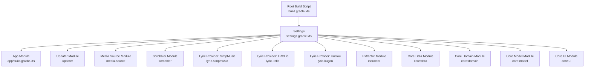
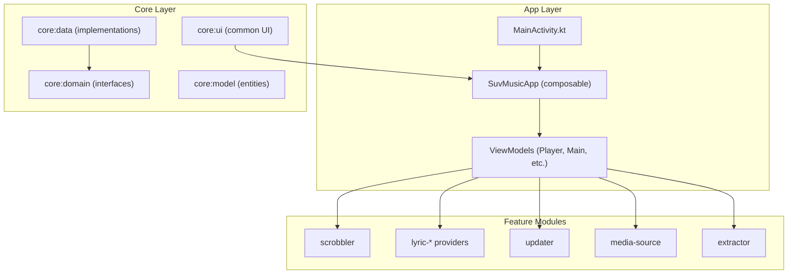
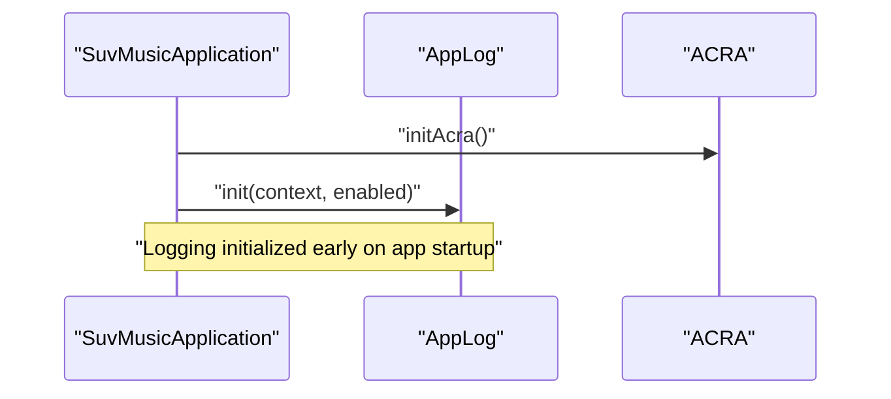
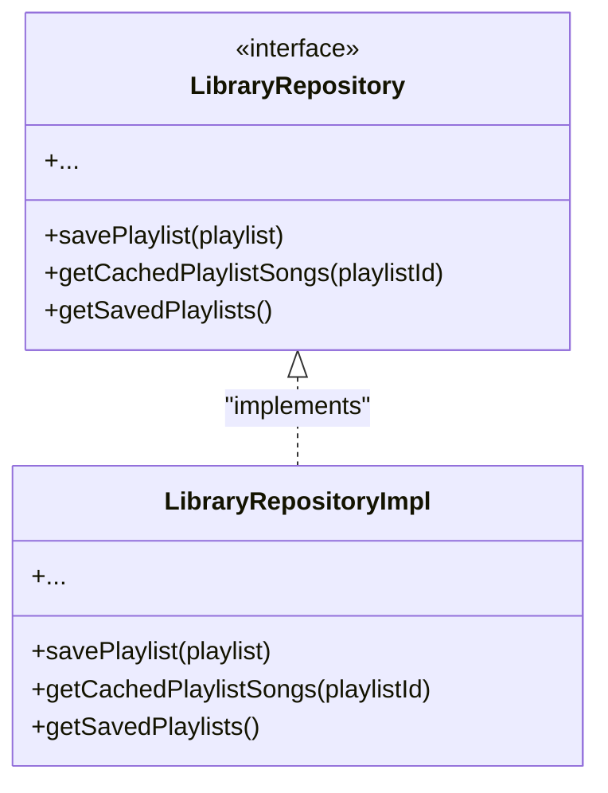
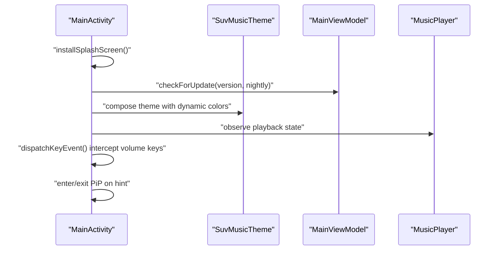
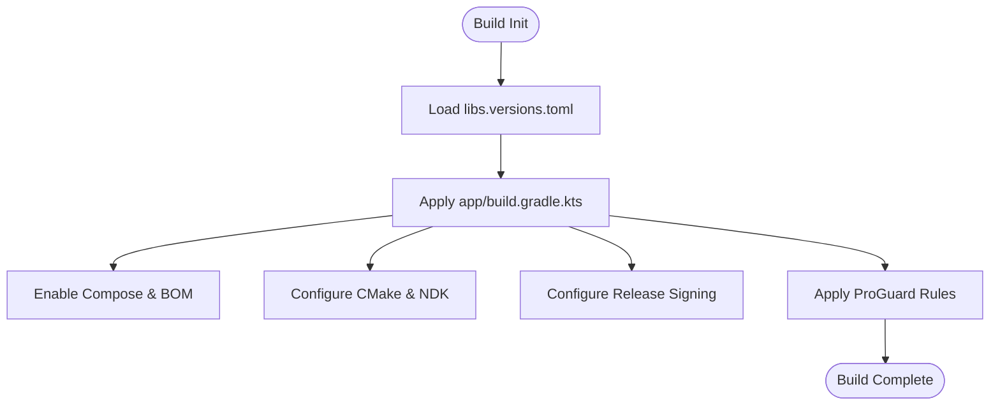
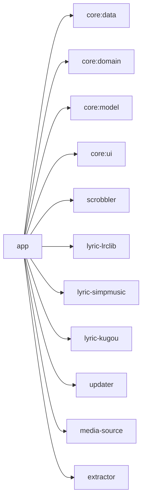

# Developer Guidelines

<cite>
**Referenced Files in This Document**
- [README.md](file://README.md)
- [settings.gradle.kts](file://settings.gradle.kts)
- [build.gradle.kts](file://build.gradle.kts)
- [gradle/libs.versions.toml](file://gradle/libs.versions.toml)
- [app/build.gradle.kts](file://app/build.gradle.kts)
- [app/src/main/java/com/suvojeet/suvmusic/MainActivity.kt](file://app/src/main/java/com/suvojeet/suvmusic/MainActivity.kt)
- [app/src/main/java/com/suvojeet/suvmusic/SuvMusicApplication.kt](file://app/src/main/java/com/suvojeet/suvmusic/SuvMusicApplication.kt)
- [app/src/main/java/com/suvojeet/suvmusic/util/AppLog.kt](file://app/src/main/java/com/suvojeet/suvmusic/util/AppLog.kt)
- [core/domain/src/main/java/com/suvojeet/suvmusic/core/domain/repository/LibraryRepository.kt](file://core/domain/src/main/java/com/suvojeet/suvmusic/core/domain/repository/LibraryRepository.kt)
- [core/data/src/main/java/com/suvojeet/suvmusic/core/data/di/RepositoryModule.kt](file://core/data/src/main/java/com/suvojeet/suvmusic/core/data/di/RepositoryModule.kt)
- [app/src/androidTest/java/com/suvojeet/suvmusic/ExampleInstrumentedTest.kt](file://app/src/androidTest/java/com/suvojeet/suvmusic/ExampleInstrumentedTest.kt)
- [app/src/test/java/com/suvojeet/suvmusic/ExampleUnitTest.kt](file://app/src/test/java/com/suvojeet/suvmusic/ExampleUnitTest.kt)
- [lyric-lrclib/build.gradle.kts](file://lyric-lrclib/build.gradle.kts)
- [scrobbler/build.gradle.kts](file://scrobbler/build.gradle.kts)
- [.gitignore](file://.gitignore)
</cite>

## Table of Contents
1. [Introduction](#introduction)
2. [Project Structure](#project-structure)
3. [Core Components](#core-components)
4. [Architecture Overview](#architecture-overview)
5. [Detailed Component Analysis](#detailed-component-analysis)
6. [Dependency Analysis](#dependency-analysis)
7. [Performance Considerations](#performance-considerations)
8. [Troubleshooting Guide](#troubleshooting-guide)
9. [Contribution Guidelines](#contribution-guidelines)
10. [Development Workflow and Branching](#development-workflow-and-branching)
11. [Testing Expectations](#testing-expectations)
12. [Documentation Requirements](#documentation-requirements)
13. [Code Review and Quality Gates](#code-review-and-quality-gates)
14. [Maintenance Responsibilities](#maintenance-responsibilities)
15. [Conclusion](#conclusion)

## Introduction
This document provides comprehensive developer guidelines for contributing to SuvMusic. It consolidates code style conventions, naming patterns, architectural principles, testing expectations, documentation requirements, development workflow, debugging and profiling practices, and community interaction standards. The goal is to ensure consistent, maintainable, and high-quality contributions across the modular Android application and its supporting libraries.

## Project Structure
SuvMusic follows a multi-module Gradle structure with a main Android application module and several feature-focused library modules. Modules are included in the settings file and organized by feature and layer (core, data, domain, ui, feature libraries).

**Diagram sources**
- [settings.gradle.kts:18-30](file://settings.gradle.kts#L18-L30)
- [build.gradle.kts:1-10](file://build.gradle.kts#L1-L10)

**Section sources**
- [settings.gradle.kts:18-30](file://settings.gradle.kts#L18-L30)
- [build.gradle.kts:1-10](file://build.gradle.kts#L1-L10)

## Core Components
- Application bootstrap and DI: The application initializes ACRA crash reporting and logging early, sets up Coil image loader with aggressive caching, and configures WorkManager with Hilt worker factory.
- Main activity orchestration: The main activity coordinates theme, network monitoring, PiP behavior, permissions, and UI composition via a composable shell.
- Logging and diagnostics: A centralized logging utility writes to file when enabled, with debug and release variants controlled by build configuration.
- Core architecture: Clean Architecture with MVVM, Hilt DI, Room, and Kotlin coroutines; repository abstractions define domain boundaries.

**Section sources**
- [app/src/main/java/com/suvojeet/suvmusic/SuvMusicApplication.kt:31-129](file://app/src/main/java/com/suvojeet/suvmusic/SuvMusicApplication.kt#L31-L129)
- [app/src/main/java/com/suvojeet/suvmusic/MainActivity.kt:96-340](file://app/src/main/java/com/suvojeet/suvmusic/MainActivity.kt#L96-L340)
- [app/src/main/java/com/suvojeet/suvmusic/util/AppLog.kt:38-79](file://app/src/main/java/com/suvojeet/suvmusic/util/AppLog.kt#L38-L79)
- [core/domain/src/main/java/com/suvojeet/suvmusic/core/domain/repository/LibraryRepository.kt:11-36](file://core/domain/src/main/java/com/suvojeet/suvmusic/core/domain/repository/LibraryRepository.kt#L11-L36)
- [core/data/src/main/java/com/suvojeet/suvmusic/core/data/di/RepositoryModule.kt:10-18](file://core/data/src/main/java/com/suvojeet/suvmusic/core/data/di/RepositoryModule.kt#L10-L18)

## Architecture Overview
SuvMusic employs Clean Architecture with MVVM and Hilt DI. Feature modules encapsulate providers and repositories, while the app module composes UI and orchestrates services.

**Diagram sources**
- [app/src/main/java/com/suvojeet/suvmusic/MainActivity.kt:96-340](file://app/src/main/java/com/suvojeet/suvmusic/MainActivity.kt#L96-L340)
- [settings.gradle.kts:19-30](file://settings.gradle.kts#L19-L30)

**Section sources**
- [app/src/main/java/com/suvojeet/suvmusic/MainActivity.kt:96-340](file://app/src/main/java/com/suvojeet/suvmusic/MainActivity.kt#L96-L340)
- [settings.gradle.kts:19-30](file://settings.gradle.kts#L19-L30)

## Detailed Component Analysis

### Logging and Diagnostics
- Centralized logging utility supports debug and file-backed logging, with asynchronous writes and optional file output.
- Application initializes logging early and ACRA crash reporting during attachBaseContext.

**Diagram sources**
- [app/src/main/java/com/suvojeet/suvmusic/SuvMusicApplication.kt:40-82](file://app/src/main/java/com/suvojeet/suvmusic/SuvMusicApplication.kt#L40-L82)
- [app/src/main/java/com/suvojeet/suvmusic/util/AppLog.kt:38-79](file://app/src/main/java/com/suvojeet/suvmusic/util/AppLog.kt#L38-L79)

**Section sources**
- [app/src/main/java/com/suvojeet/suvmusic/SuvMusicApplication.kt:40-82](file://app/src/main/java/com/suvojeet/suvmusic/SuvMusicApplication.kt#L40-L82)
- [app/src/main/java/com/suvojeet/suvmusic/util/AppLog.kt:38-79](file://app/src/main/java/com/suvojeet/suvmusic/util/AppLog.kt#L38-L79)

### Dependency Injection and Repository Pattern
- Hilt modules provide DI bindings; repository interfaces reside in core:domain and implementations in core:data.
- Binding resolution and contextual strictness are emphasized to prevent scope bleed and memory leaks.

**Diagram sources**
- [core/domain/src/main/java/com/suvojeet/suvmusic/core/domain/repository/LibraryRepository.kt:11-36](file://core/domain/src/main/java/com/suvojeet/suvmusic/core/domain/repository/LibraryRepository.kt#L11-L36)
- [core/data/src/main/java/com/suvojeet/suvmusic/core/data/di/RepositoryModule.kt:14-17](file://core/data/src/main/java/com/suvojeet/suvmusic/core/data/di/RepositoryModule.kt#L14-L17)

**Section sources**
- [core/domain/src/main/java/com/suvojeet/suvmusic/core/domain/repository/LibraryRepository.kt:11-36](file://core/domain/src/main/java/com/suvojeet/suvmusic/core/domain/repository/LibraryRepository.kt#L11-L36)
- [core/data/src/main/java/com/suvojeet/suvmusic/core/data/di/RepositoryModule.kt:10-18](file://core/data/src/main/java/com/suvojeet/suvmusic/core/data/di/RepositoryModule.kt#L10-L18)

### Main Activity Orchestration
- MainActivity initializes splash screen, theme, network monitor, permissions, and composes the app shell.
- Intercepts hardware volume keys when appropriate and manages PiP behavior and refresh rate preferences.

**Diagram sources**
- [app/src/main/java/com/suvojeet/suvmusic/MainActivity.kt:139-340](file://app/src/main/java/com/suvojeet/suvmusic/MainActivity.kt#L139-L340)

**Section sources**
- [app/src/main/java/com/suvojeet/suvmusic/MainActivity.kt:139-340](file://app/src/main/java/com/suvojeet/suvmusic/MainActivity.kt#L139-L340)

### Build Configuration and Version Catalog
- Versions are managed centrally via libs.versions.toml.
- App module defines compile/target SDK, min SDK, signing, ProGuard, Compose, and native build settings.

**Diagram sources**
- [gradle/libs.versions.toml:1-162](file://gradle/libs.versions.toml#L1-L162)
- [app/build.gradle.kts:14-120](file://app/build.gradle.kts#L14-L120)

**Section sources**
- [gradle/libs.versions.toml:1-162](file://gradle/libs.versions.toml#L1-L162)
- [app/build.gradle.kts:14-120](file://app/build.gradle.kts#L14-L120)

## Dependency Analysis
- Module dependencies are declared in settings.gradle.kts; the app module depends on core modules and feature modules.
- Feature modules (e.g., lyric-lrclib, scrobbler) configure their own compile options and dependencies aligned with the project’s JVM target and Kotlin version.

**Diagram sources**
- [settings.gradle.kts:19-30](file://settings.gradle.kts#L19-L30)
- [app/build.gradle.kts:254-265](file://app/build.gradle.kts#L254-L265)

**Section sources**
- [settings.gradle.kts:19-30](file://settings.gradle.kts#L19-L30)
- [app/build.gradle.kts:254-265](file://app/build.gradle.kts#L254-L265)

## Performance Considerations
- JVM target and desugaring: The project targets JVM 21 with desugaring enabled to support modern APIs on older Android versions.
- Image caching: Coil is configured with generous memory and disk caches for offline readiness and smooth UI.
- Native builds: CMake and NDK are configured for relevant ABIs and stable NDK version.
- WorkManager: Periodic tasks are enqueued with constraints to minimize battery impact.

**Section sources**
- [app/build.gradle.kts:91-120](file://app/build.gradle.kts#L91-L120)
- [app/src/main/java/com/suvojeet/suvmusic/SuvMusicApplication.kt:89-109](file://app/src/main/java/com/suvojeet/suvmusic/SuvMusicApplication.kt#L89-L109)
- [app/build.gradle.kts:102-110](file://app/build.gradle.kts#L102-L110)
- [app/src/main/java/com/suvojeet/suvmusic/SuvMusicApplication.kt:111-127](file://app/src/main/java/com/suvojeet/suvmusic/SuvMusicApplication.kt#L111-L127)

## Troubleshooting Guide
- Logging: Use the centralized logging utility to capture runtime information and exceptions. Ensure logging is enabled when diagnosing issues.
- Crash reporting: ACRA is initialized early to capture crash logs and notify users.
- Network diagnostics: Monitor connectivity via the network monitor and surface offline states to users.
- Volume key interception: Verify that volume key behavior is consistent with user preferences and playback state.

**Section sources**
- [app/src/main/java/com/suvojeet/suvmusic/util/AppLog.kt:38-79](file://app/src/main/java/com/suvojeet/suvmusic/util/AppLog.kt#L38-L79)
- [app/src/main/java/com/suvojeet/suvmusic/SuvMusicApplication.kt:40-61](file://app/src/main/java/com/suvojeet/suvmusic/SuvMusicApplication.kt#L40-L61)
- [app/src/main/java/com/suvojeet/suvmusic/MainActivity.kt:535-549](file://app/src/main/java/com/suvojeet/suvmusic/MainActivity.kt#L535-L549)
- [app/src/main/java/com/suvojeet/suvmusic/MainActivity.kt:241-273](file://app/src/main/java/com/suvojeet/suvmusic/MainActivity.kt#L241-L273)

## Contribution Guidelines
- Follow the established architecture: keep UI in composables, business logic in ViewModels, and data access via repositories.
- Respect Clean Architecture boundaries: domain interfaces in core:domain, implementations in core:data.
- Use Hilt for DI and ensure proper scopes to avoid memory leaks.
- Keep modules cohesive: feature modules should encapsulate providers and repositories.

**Section sources**
- [core/domain/src/main/java/com/suvojeet/suvmusic/core/domain/repository/LibraryRepository.kt:11-36](file://core/domain/src/main/java/com/suvojeet/suvmusic/core/domain/repository/LibraryRepository.kt#L11-L36)
- [core/data/src/main/java/com/suvojeet/suvmusic/core/data/di/RepositoryModule.kt:10-18](file://core/data/src/main/java/com/suvojeet/suvmusic/core/data/di/RepositoryModule.kt#L10-L18)

## Development Workflow and Branching
- Use feature branches for new work and rebase or merge frequently with the default branch.
- Keep commits small and focused; include meaningful commit messages.
- Open a pull request early to gather feedback and iterate incrementally.
- Ensure CI passes locally before pushing to remote.

[No sources needed since this section provides general guidance]

## Testing Expectations
- Unit tests: Add tests for business logic and utilities. Use JUnit and Assert for assertions.
- Instrumented tests: Use AndroidX Test for instrumentation tests.
- Feature modules: Configure test runners and instrumentations per module.

**Section sources**
- [app/src/test/java/com/suvojeet/suvmusic/ExampleUnitTest.kt:12-17](file://app/src/test/java/com/suvojeet/suvmusic/ExampleUnitTest.kt#L12-L17)
- [app/src/androidTest/java/com/suvojeet/suvmusic/ExampleInstrumentedTest.kt:16-24](file://app/src/androidTest/java/com/suvojeet/suvmusic/ExampleInstrumentedTest.kt#L16-L24)
- [lyric-lrclib/build.gradle.kts:13-16](file://lyric-lrclib/build.gradle.kts#L13-L16)
- [scrobbler/build.gradle.kts:13-16](file://scrobbler/build.gradle.kts#L13-L16)

## Documentation Requirements
- Update README.md for major feature additions or architectural changes.
- Keep module-level documentation concise and refer to the central README for high-level context.

**Section sources**
- [README.md:1-143](file://README.md#L1-L143)

## Code Review and Quality Gates
- Pull requests should include passing unit and instrumentation tests.
- Ensure DI binding correctness and avoid scope bleed.
- Verify logging and crash reporting configurations.
- Confirm build configuration compliance (JVM target, ProGuard, signing).

**Section sources**
- [app/build.gradle.kts:91-120](file://app/build.gradle.kts#L91-L120)
- [app/src/main/java/com/suvojeet/suvmusic/SuvMusicApplication.kt:40-61](file://app/src/main/java/com/suvojeet/suvmusic/SuvMusicApplication.kt#L40-L61)

## Maintenance Responsibilities
- Keep dependencies updated using the version catalog.
- Monitor and refine logging and crash reporting configurations.
- Review and optimize image caching and native build settings periodically.

**Section sources**
- [gradle/libs.versions.toml:1-162](file://gradle/libs.versions.toml#L1-L162)
- [app/src/main/java/com/suvojeet/suvmusic/SuvMusicApplication.kt:89-109](file://app/src/main/java/com/suvojeet/suvmusic/SuvMusicApplication.kt#L89-L109)

## Conclusion
These guidelines aim to streamline contributions while preserving SuvMusic’s architectural integrity, performance characteristics, and user experience. By adhering to the outlined conventions, testing expectations, and quality gates, contributors can help sustain a robust, scalable, and maintainable codebase.