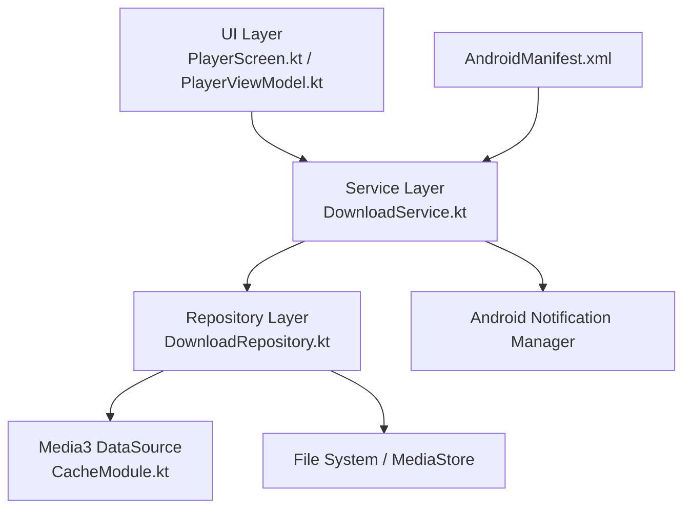
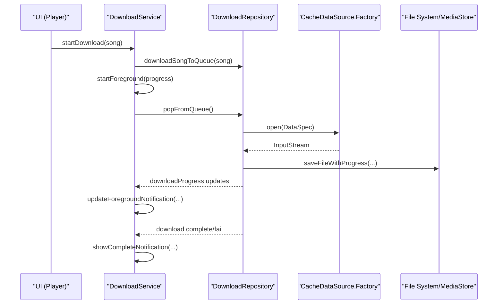
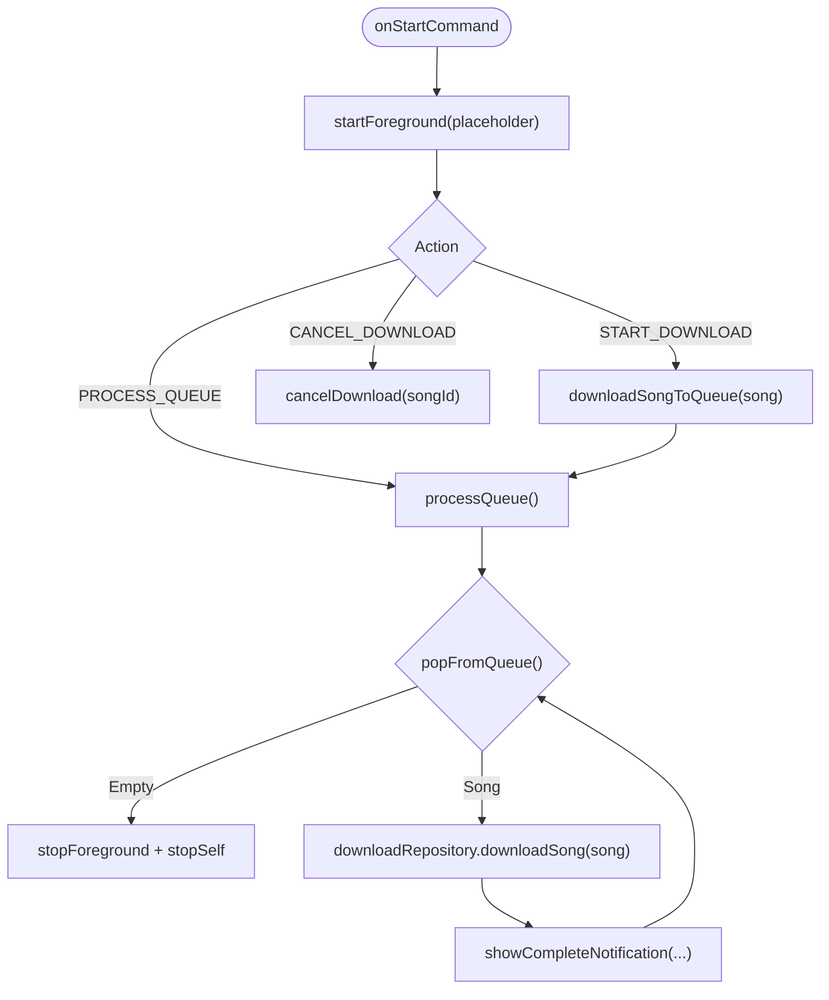
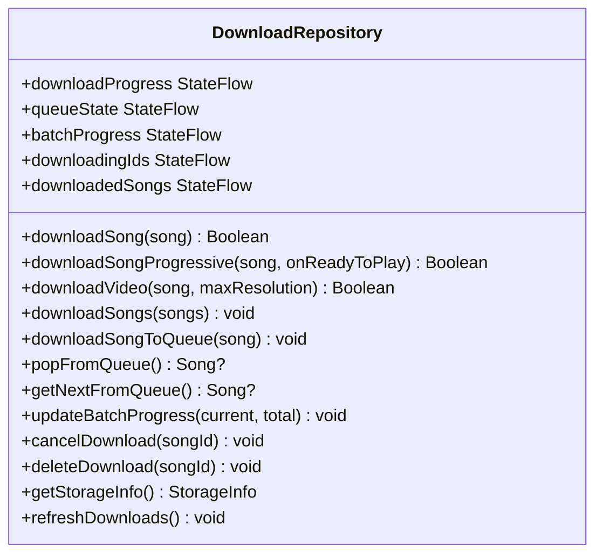
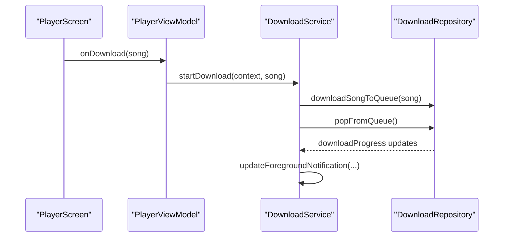
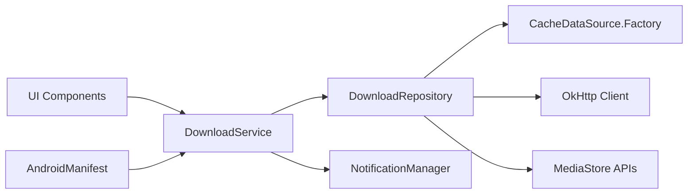

# Background Download Service

<cite>
**Referenced Files in This Document**
- [DownloadService.kt](file://app/src/main/java/com/suvojeet/suvmusic/service/DownloadService.kt)
- [DownloadRepository.kt](file://app/src/main/java/com/suvojeet/suvmusic/data/repository/DownloadRepository.kt)
- [AndroidManifest.xml](file://app/src/main/AndroidManifest.xml)
- [CacheModule.kt](file://app/src/main/java/com/suvojeet/suvmusic/di/CacheModule.kt)
- [Qualifiers.kt](file://app/src/main/java/com/suvojeet/suvmusic/di/Qualifiers.kt)
- [PlayerScreen.kt](file://app/src/main/java/com/suvojeet/suvmusic/ui/screens/player/PlayerScreen.kt)
- [PlayerViewModel.kt](file://app/src/main/java/com/suvojeet/suvmusic/ui/viewmodel/PlayerViewModel.kt)
- [AppLog.kt](file://app/src/main/java/com/suvojeet/suvmusic/util/AppLog.kt)
</cite>

## Table of Contents
1. [Introduction](#introduction)
2. [Project Structure](#project-structure)
3. [Core Components](#core-components)
4. [Architecture Overview](#architecture-overview)
5. [Detailed Component Analysis](#detailed-component-analysis)
6. [Dependency Analysis](#dependency-analysis)
7. [Performance Considerations](#performance-considerations)
8. [Troubleshooting Guide](#troubleshooting-guide)
9. [Conclusion](#conclusion)

## Introduction
This document explains the background download service implementation responsible for downloading audio content while the app is closed or in the background. It covers the foreground service architecture, notification management, service lifecycle handling, integration with DownloadRepository for actual download execution, progress reporting, error recovery, service binding patterns, completion handling, and system resource management. It also details configuration options, logging mechanisms, and debugging approaches.

## Project Structure
The background download capability spans three main areas:
- Service layer: Foreground service that orchestrates downloads and manages notifications
- Repository layer: Centralized download logic, queue management, progress tracking, and persistence
- UI layer: Triggers downloads and observes progress/state

**Diagram sources**
- [DownloadService.kt:32-305](file://app/src/main/java/com/suvojeet/suvmusic/service/DownloadService.kt#L32-L305)
- [DownloadRepository.kt:39-1301](file://app/src/main/java/com/suvojeet/suvmusic/data/repository/DownloadRepository.kt#L39-L1301)
- [AndroidManifest.xml:169-174](file://app/src/main/AndroidManifest.xml#L169-L174)
- [CacheModule.kt:70-94](file://app/src/main/java/com/suvojeet/suvmusic/di/CacheModule.kt#L70-L94)

**Section sources**
- [DownloadService.kt:32-305](file://app/src/main/java/com/suvojeet/suvmusic/service/DownloadService.kt#L32-L305)
- [DownloadRepository.kt:39-1301](file://app/src/main/java/com/suvojeet/suvmusic/data/repository/DownloadRepository.kt#L39-L1301)
- [AndroidManifest.xml:169-174](file://app/src/main/AndroidManifest.xml#L169-L174)

## Core Components
- DownloadService: Foreground service that starts/stops downloads, updates notifications, and coordinates with DownloadRepository
- DownloadRepository: Manages download queues, progress, cancellation, persistence, and actual download execution via Media3 and OkHttp
- CacheModule: Provides a shared CacheDataSource.Factory annotated as DownloadDataSource for efficient caching and retries
- UI triggers: PlayerScreen and PlayerViewModel initiate downloads and observe state

Key responsibilities:
- Foreground service lifecycle and notifications
- Queue processing and batch progress
- Real-time progress reporting via StateFlow
- Cancellation and cleanup
- Persistence and metadata tagging

**Section sources**
- [DownloadService.kt:32-305](file://app/src/main/java/com/suvojeet/suvmusic/service/DownloadService.kt#L32-L305)
- [DownloadRepository.kt:39-1301](file://app/src/main/java/com/suvojeet/suvmusic/data/repository/DownloadRepository.kt#L39-L1301)
- [CacheModule.kt:70-94](file://app/src/main/java/com/suvojeet/suvmusic/di/CacheModule.kt#L70-L94)

## Architecture Overview
The service delegates all download work to DownloadRepository, which uses a shared CacheDataSource.Factory for network requests and caching. Progress is emitted via StateFlow and observed by the service to update the foreground notification.

**Diagram sources**
- [DownloadService.kt:118-210](file://app/src/main/java/com/suvojeet/suvmusic/service/DownloadService.kt#L118-L210)
- [DownloadRepository.kt:771-881](file://app/src/main/java/com/suvojeet/suvmusic/data/repository/DownloadRepository.kt#L771-L881)
- [CacheModule.kt:70-94](file://app/src/main/java/com/suvojeet/suvmusic/di/CacheModule.kt#L70-L94)

## Detailed Component Analysis

### Foreground Service: DownloadService
- Lifecycle
  - onCreate: Creates notification channel and subscribes to progress updates
  - onStartCommand: Immediately calls startForeground with a placeholder notification to satisfy Android 12+ restrictions, then dispatches based on action
  - onDestroy: Cancels scopes and jobs to prevent leaks
- Actions
  - START_DOWNLOAD: Adds a single song to queue and processes
  - PROCESS_QUEUE: Starts/resumes queue processing
  - CANCEL_DOWNLOAD: Delegates cancellation to repository
- Notifications
  - Progress notification: ongoing, low priority, shows current/total and percentage
  - Completion notification: auto-cancel, success/failure icon
- Concurrency
  - Uses SupervisorJob + IO dispatcher
  - Prevents overlapping batch jobs via a Job reference
  - Tracks active downloads and primary notification song

**Diagram sources**
- [DownloadService.kt:118-210](file://app/src/main/java/com/suvojeet/suvmusic/service/DownloadService.kt#L118-L210)

**Section sources**
- [DownloadService.kt:112-146](file://app/src/main/java/com/suvojeet/suvmusic/service/DownloadService.kt#L112-L146)
- [DownloadService.kt:164-211](file://app/src/main/java/com/suvojeet/suvmusic/service/DownloadService.kt#L164-L211)
- [DownloadService.kt:236-297](file://app/src/main/java/com/suvojeet/suvmusic/service/DownloadService.kt#L236-L297)

### Repository: DownloadRepository
- Queue Management
  - ConcurrentLinkedDeque for thread-safe enqueue/dequeue
  - StateFlow queueState for UI observation
  - Batch progress tracking (Pair<Int, Int>)
- Download Execution
  - downloadSong: Uses Media3 DataSource with CacheDataSource.Factory, streams to temp file, tags metadata, saves to public location, persists metadata
  - downloadSongProgressive: Streams and saves progressively, signals readiness after minimum bytes for immediate playback
  - downloadVideo: Similar pattern for video downloads
- Progress Reporting
  - downloadProgress: StateFlow Map<String, Float> updated per-song
  - Observers receive updates to keep UI and notifications in sync
- Cancellation and Cleanup
  - cancelDownload: cancels active coroutine job, removes from queue, clears state
  - deleteDownload: deletes persisted files and thumbnails
- Persistence and Migration
  - Atomic JSON for downloaded songs metadata
  - Scans public and legacy folders, migrates files, deduplicates
- Storage Utilities
  - getStorageInfo: aggregates sizes across downloads, thumbnails, caches

**Diagram sources**
- [DownloadRepository.kt:39-1301](file://app/src/main/java/com/suvojeet/suvmusic/data/repository/DownloadRepository.kt#L39-L1301)

**Section sources**
- [DownloadRepository.kt:79-1301](file://app/src/main/java/com/suvojeet/suvmusic/data/repository/DownloadRepository.kt#L79-L1301)
- [DownloadRepository.kt:809-881](file://app/src/main/java/com/suvojeet/suvmusic/data/repository/DownloadRepository.kt#L809-L881)
- [DownloadRepository.kt:883-997](file://app/src/main/java/com/suvojeet/suvmusic/data/repository/DownloadRepository.kt#L883-L997)
- [DownloadRepository.kt:1057-1153](file://app/src/main/java/com/suvojeet/suvmusic/data/repository/DownloadRepository.kt#L1057-L1153)

### Service Binding Patterns and UI Integration
- Service binding: DownloadService does not expose onBind (returns null), indicating it is not designed for client binder connections
- UI triggers: PlayerViewModel and PlayerScreen call DownloadService.startDownload to enqueue and start processing
- State observation: UI observes DownloadRepository StateFlows for queue, progress, and downloading IDs

**Diagram sources**
- [PlayerScreen.kt](file://app/src/main/java/com/suvojeet/suvmusic/ui/screens/player/PlayerScreen.kt#L634)
- [PlayerViewModel.kt:995-996](file://app/src/main/java/com/suvojeet/suvmusic/ui/viewmodel/PlayerViewModel.kt#L995-L996)
- [DownloadService.kt:123-131](file://app/src/main/java/com/suvojeet/suvmusic/service/DownloadService.kt#L123-L131)
- [DownloadRepository.kt:1250-1262](file://app/src/main/java/com/suvojeet/suvmusic/data/repository/DownloadRepository.kt#L1250-L1262)

**Section sources**
- [PlayerScreen.kt](file://app/src/main/java/com/suvojeet/suvmusic/ui/screens/player/PlayerScreen.kt#L634)
- [PlayerViewModel.kt:995-996](file://app/src/main/java/com/suvojeet/suvmusic/ui/viewmodel/PlayerViewModel.kt#L995-L996)
- [DownloadService.kt](file://app/src/main/java/com/suvojeet/suvmusic/service/DownloadService.kt#L146)

### Notification Management
- Channel creation: Low importance, no badge, vibration disabled, silent
- Progress notification: ongoing, category progress, low priority, shows current/total and percentage
- Completion notification: success/failure icon, auto-cancel, opens main activity on tap
- Foreground updates: startForeground called with updated notification content

**Section sources**
- [DownloadService.kt:148-162](file://app/src/main/java/com/suvojeet/suvmusic/service/DownloadService.kt#L148-L162)
- [DownloadService.kt:236-297](file://app/src/main/java/com/suvojeet/suvmusic/service/DownloadService.kt#L236-L297)

### Service Lifecycle Handling
- Android 12+ compliance: Immediate startForeground in onStartCommand prevents ForegroundServiceDidNotStartInTimeException
- Graceful shutdown: stopForeground and stopSelf when queue is empty
- Resource cleanup: Scope cancellation and job cleanup in onDestroy

**Section sources**
- [DownloadService.kt:118-121](file://app/src/main/java/com/suvojeet/suvmusic/service/DownloadService.kt#L118-L121)
- [DownloadService.kt:173-176](file://app/src/main/java/com/suvojeet/suvmusic/service/DownloadService.kt#L173-L176)
- [DownloadService.kt:299-303](file://app/src/main/java/com/suvojeet/suvmusic/service/DownloadService.kt#L299-L303)

### Integration with DownloadRepository
- Queue orchestration: Enqueue via downloadSongToQueue, process via processQueue
- Progress propagation: downloadProgress StateFlow collected by service to update notifications
- Cancellation: cancelDownload delegates to repository to cancel active job and clean state
- Persistence: save/load metadata, tag audio files, manage thumbnails

**Section sources**
- [DownloadService.kt:164-229](file://app/src/main/java/com/suvojeet/suvmusic/service/DownloadService.kt#L164-L229)
- [DownloadRepository.kt:1246-1262](file://app/src/main/java/com/suvojeet/suvmusic/data/repository/DownloadRepository.kt#L1246-L1262)
- [DownloadRepository.kt:999-1010](file://app/src/main/java/com/suvojeet/suvmusic/data/repository/DownloadRepository.kt#L999-L1010)

### Progress Reporting Mechanisms
- Per-song progress: downloadProgress StateFlow keyed by song ID
- Batch progress: batchProgress StateFlow for current/total counts
- UI synchronization: Service collects progress and updates foreground notification

**Section sources**
- [DownloadRepository.kt:67-68](file://app/src/main/java/com/suvojeet/suvmusic/data/repository/DownloadRepository.kt#L67-L68)
- [DownloadRepository.kt:86-87](file://app/src/main/java/com/suvojeet/suvmusic/data/repository/DownloadRepository.kt#L86-L87)
- [DownloadService.kt:213-229](file://app/src/main/java/com/suvojeet/suvmusic/service/DownloadService.kt#L213-L229)

### Error Recovery Strategies
- Exception handling: Service catches exceptions during download and posts failure notification
- Repository-level recovery: Cancellation via job cancellation, removal from state, cleanup of progress
- Network resilience: OkHttp client configured with timeouts, redirects, retries
- Cache fallback: CacheDataSource.Factory ignores cache errors to improve reliability

**Section sources**
- [DownloadService.kt:200-203](file://app/src/main/java/com/suvojeet/suvmusic/service/DownloadService.kt#L200-L203)
- [DownloadRepository.kt:799-806](file://app/src/main/java/com/suvojeet/suvmusic/data/repository/DownloadRepository.kt#L799-L806)
- [DownloadRepository.kt:1000-1010](file://app/src/main/java/com/suvojeet/suvmusic/data/repository/DownloadRepository.kt#L1000-L1010)
- [CacheModule.kt:70-94](file://app/src/main/java/com/suvojeet/suvmusic/di/CacheModule.kt#L70-L94)

### Download Completion Handling
- Success path: showCompleteNotification with success icon and title
- Failure path: showCompleteNotification with error icon and title
- Cleanup: removes song from active tracking and resets primary notification ID if needed

**Section sources**
- [DownloadService.kt:195-208](file://app/src/main/java/com/suvojeet/suvmusic/service/DownloadService.kt#L195-L208)
- [DownloadService.kt:276-297](file://app/src/main/java/com/suvojeet/suvmusic/service/DownloadService.kt#L276-L297)

### System Resource Management
- Foreground service type: dataSync for background downloads
- Permissions: FOREGROUND_SERVICE, FOREGROUND_SERVICE_DATA_SYNC, POST_NOTIFICATIONS
- Storage: MediaStore API for Android Q+, public folder fallback, custom folder support via SAF
- Threading: IO dispatcher, SupervisorJob for child job supervision

**Section sources**
- [AndroidManifest.xml:17-21](file://app/src/main/AndroidManifest.xml#L17-L21)
- [AndroidManifest.xml:169-174](file://app/src/main/AndroidManifest.xml#L169-L174)
- [DownloadRepository.kt:375-476](file://app/src/main/java/com/suvojeet/suvmusic/data/repository/DownloadRepository.kt#L375-L476)

### Service Role Across Lifecycle Changes and System Optimizations
- Foreground service ensures continued operation under system optimizations
- Immediate startForeground satisfies Android 12+ timing requirements
- Queue-based processing resumes automatically when PROCESS_QUEUE is invoked
- Cancellation and cleanup prevent resource leaks across app lifecycle changes

**Section sources**
- [DownloadService.kt:118-121](file://app/src/main/java/com/suvojeet/suvmusic/service/DownloadService.kt#L118-L121)
- [DownloadService.kt:133-135](file://app/src/main/java/com/suvojeet/suvmusic/service/DownloadService.kt#L133-L135)

### Configuration Options for Service Behavior
- Foreground service type: dataSync
- Notification channel: low importance, no sound, no vibration, no badge
- Download source selection: YouTube/JioSaavn based on SongSource
- Custom download location: SAF tree URI persisted via SessionManager
- Cache behavior: CacheDataSource.Factory with flag to ignore cache errors

**Section sources**
- [AndroidManifest.xml:169-174](file://app/src/main/AndroidManifest.xml#L169-L174)
- [DownloadService.kt:148-162](file://app/src/main/java/com/suvojeet/suvmusic/service/DownloadService.kt#L148-L162)
- [DownloadRepository.kt:42-46](file://app/src/main/java/com/suvojeet/suvmusic/data/repository/DownloadRepository.kt#L42-L46)
- [CacheModule.kt:70-94](file://app/src/main/java/com/suvojeet/suvmusic/di/CacheModule.kt#L70-L94)

### Logging Mechanisms and Debugging Approaches
- Service logs: Uses Log.d/e/w in DownloadService for lifecycle and errors
- Repository logs: Extensive logging in DownloadRepository for network, file operations, and migrations
- AppLog utility: Optional persistent file logging with timestamped entries and optional rotation
- Debug flags: AppLog supports enabling/disabling persistent logs and clearing them

**Section sources**
- [DownloadService.kt:120-121](file://app/src/main/java/com/suvojeet/suvmusic/service/DownloadService.kt#L120-L121)
- [DownloadRepository.kt:48-49](file://app/src/main/java/com/suvojeet/suvmusic/data/repository/DownloadRepository.kt#L48-L49)
- [AppLog.kt:17-112](file://app/src/main/java/com/suvojeet/suvmusic/util/AppLog.kt#L17-L112)

## Dependency Analysis
- DownloadService depends on DownloadRepository (injected) and NotificationManager
- DownloadRepository depends on:
  - Media3 DataSource.Factory (provided via CacheModule)
  - OkHttp client for network requests
  - AndroidX MediaStore APIs for file persistence
  - SessionManager for user preferences (download location)
- UI components depend on DownloadService for triggering and on DownloadRepository for observing state

**Diagram sources**
- [DownloadService.kt:96-97](file://app/src/main/java/com/suvojeet/suvmusic/service/DownloadService.kt#L96-L97)
- [DownloadRepository.kt:40-46](file://app/src/main/java/com/suvojeet/suvmusic/data/repository/DownloadRepository.kt#L40-L46)
- [CacheModule.kt:70-94](file://app/src/main/java/com/suvojeet/suvmusic/di/CacheModule.kt#L70-L94)
- [AndroidManifest.xml:169-174](file://app/src/main/AndroidManifest.xml#L169-L174)

**Section sources**
- [DownloadService.kt:96-97](file://app/src/main/java/com/suvojeet/suvmusic/service/DownloadService.kt#L96-L97)
- [DownloadRepository.kt:40-46](file://app/src/main/java/com/suvojeet/suvmusic/data/repository/DownloadRepository.kt#L40-L46)
- [CacheModule.kt:70-94](file://app/src/main/java/com/suvojeet/suvmusic/di/CacheModule.kt#L70-L94)

## Performance Considerations
- Streaming with caching reduces redundant network requests and improves reliability
- Chunked writes with periodic progress updates balance responsiveness and throughput
- Minimum bytes threshold enables early playback for progressive downloads
- Concurrency control via Mutex and active job tracking prevents duplicate downloads
- Efficient progress reporting via StateFlow avoids unnecessary recompositions

## Troubleshooting Guide
Common issues and remedies:
- Foreground service start timeout on Android 12+: Ensure startForeground is called immediately in onStartCommand
- Download stuck or not progressing: Verify downloadProgress StateFlow updates and network connectivity
- Cancellation not working: Confirm cancelDownload invokes repository cancellation and removes song from queue
- Storage permission errors: Use SAF for custom locations and handle FilePermissionException appropriately
- Duplicate downloads: Check downloadMutex and downloadingIds to avoid concurrent downloads of the same song

**Section sources**
- [DownloadService.kt:118-121](file://app/src/main/java/com/suvojeet/suvmusic/service/DownloadService.kt#L118-L121)
- [DownloadRepository.kt:771-806](file://app/src/main/java/com/suvojeet/suvmusic/data/repository/DownloadRepository.kt#L771-L806)
- [DownloadRepository.kt:999-1010](file://app/src/main/java/com/suvojeet/suvmusic/data/repository/DownloadRepository.kt#L999-L1010)

## Conclusion
The background download service provides a robust, foreground-based solution for downloading audio content with real-time progress notifications. Its architecture cleanly separates concerns between service orchestration, repository-level download logic, and UI integration. With proper foreground service handling, queue management, progress reporting, and error recovery, it maintains continuity across app lifecycle changes and system optimizations while respecting user preferences for storage locations and privacy.