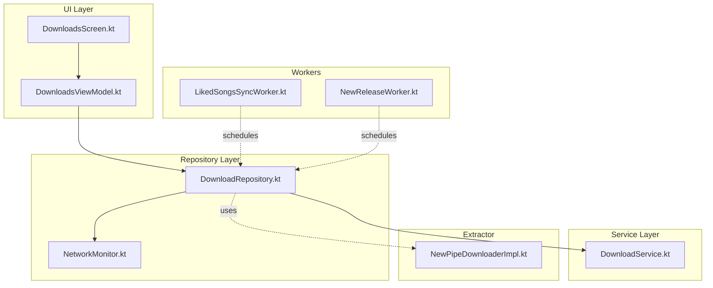
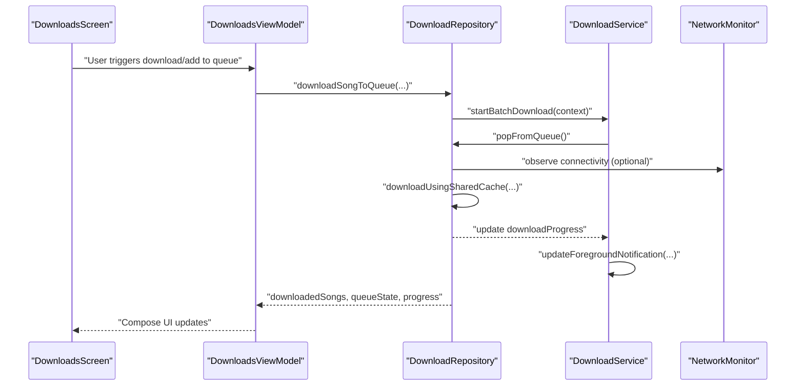
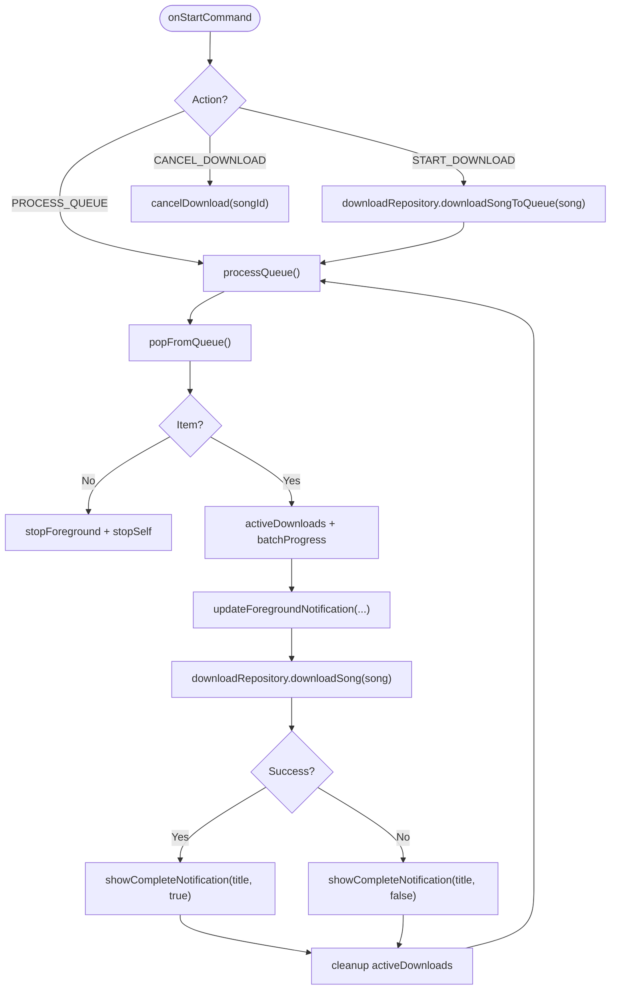
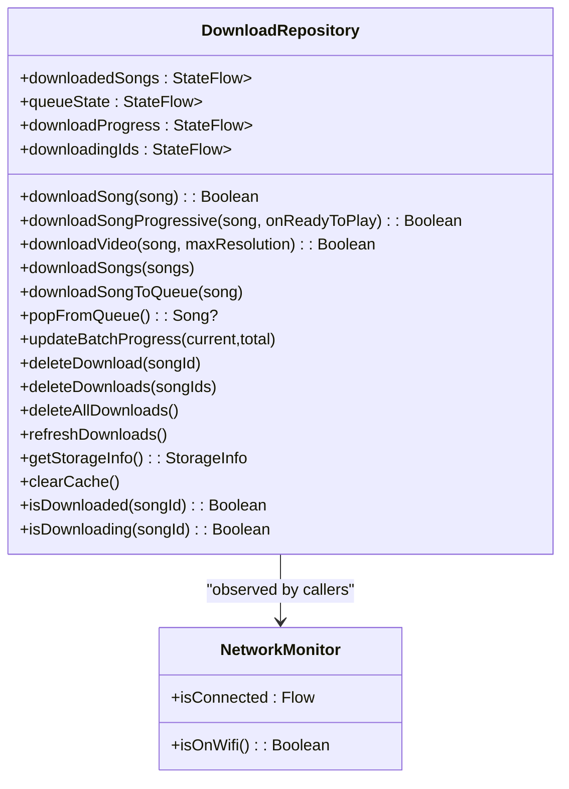
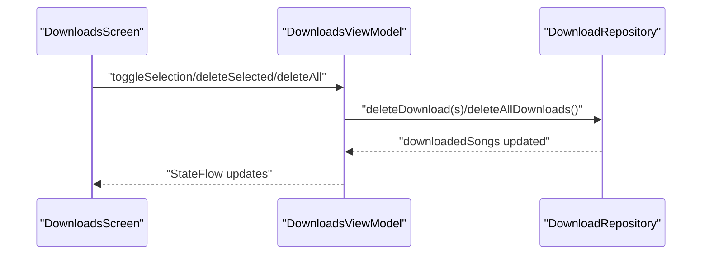
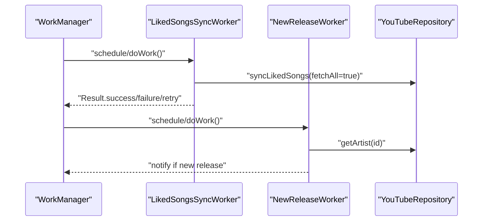
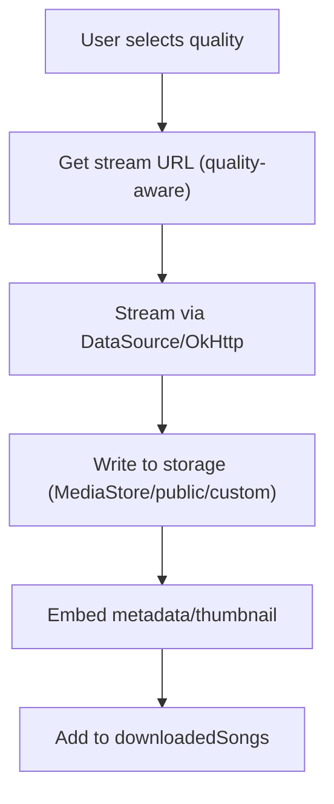
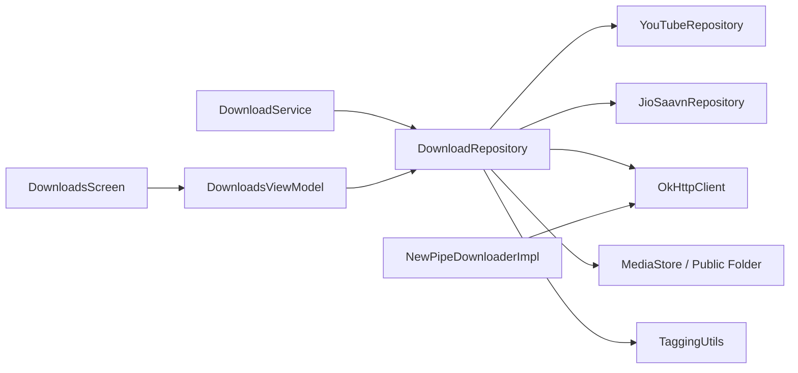

# Download Management

<cite>
**Referenced Files in This Document**
- [DownloadService.kt](file://app/src/main/java/com/suvojeet/suvmusic/service/DownloadService.kt)
- [DownloadRepository.kt](file://app/src/main/java/com/suvojeet/suvmusic/data/repository/DownloadRepository.kt)
- [DownloadQuality.kt](file://app/src/main/java/com/suvojeet/suvmusic/data/model/DownloadQuality.kt)
- [AudioQuality.kt](file://app/src/main/java/com/suvojeet/suvmusic/data/model/AudioQuality.kt)
- [DownloadsScreen.kt](file://app/src/main/java/com/suvojeet/suvmusic/ui/screens/DownloadsScreen.kt)
- [DownloadsViewModel.kt](file://app/src/main/java/com/suvojeet/suvmusic/ui/viewmodel/DownloadsViewModel.kt)
- [NetworkMonitor.kt](file://app/src/main/java/com/suvojeet/suvmusic/util/NetworkMonitor.kt)
- [NewPipeDownloaderImpl.kt](file://extractor/src/main/java/com/suvojeet/suvmusic/newpipe/NewPipeDownloaderImpl.kt)
- [LikedSongsSyncWorker.kt](file://app/src/main/java/com/suvojeet/suvmusic/data/worker/LikedSongsSyncWorker.kt)
- [NewReleaseWorker.kt](file://app/src/main/java/com/suvojeet/suvmusic/workers/NewReleaseWorker.kt)
</cite>

## Table of Contents
1. [Introduction](#introduction)
2. [Project Structure](#project-structure)
3. [Core Components](#core-components)
4. [Architecture Overview](#architecture-overview)
5. [Detailed Component Analysis](#detailed-component-analysis)
6. [Dependency Analysis](#dependency-analysis)
7. [Performance Considerations](#performance-considerations)
8. [Troubleshooting Guide](#troubleshooting-guide)
9. [Conclusion](#conclusion)
10. [Appendices](#appendices)

## Introduction
This document explains SuvMusic’s download management system with a focus on:
- Download queue architecture and background service lifecycle
- Offline playback support and storage management
- WorkManager-based scheduling for related tasks
- Network-awareness and bandwidth optimization
- Download quality selection and format handling
- Progress tracking, error recovery, caching, and cleanup
- User storage preferences and concurrent download controls

## Project Structure
The download system spans three layers:
- UI: Screens and ViewModels that present downloads, selections, and actions
- Repository: Centralized download orchestration, queue management, storage, and progress
- Service: Foreground service for continuous background downloads and notifications

**Diagram sources**
- [DownloadsScreen.kt:103-109](file://app/src/main/java/com/suvojeet/suvmusic/ui/screens/DownloadsScreen.kt#L103-L109)
- [DownloadsViewModel.kt:18-27](file://app/src/main/java/com/suvojeet/suvmusic/ui/viewmodel/DownloadsViewModel.kt#L18-L27)
- [DownloadRepository.kt:39-46](file://app/src/main/java/com/suvojeet/suvmusic/data/repository/DownloadRepository.kt#L39-L46)
- [DownloadService.kt:33-94](file://app/src/main/java/com/suvojeet/suvmusic/service/DownloadService.kt#L33-L94)
- [NetworkMonitor.kt:20-24](file://app/src/main/java/com/suvojeet/suvmusic/util/NetworkMonitor.kt#L20-L24)
- [NewPipeDownloaderImpl.kt:16-19](file://extractor/src/main/java/com/suvojeet/suvmusic/newpipe/NewPipeDownloaderImpl.kt#L16-L19)
- [LikedSongsSyncWorker.kt:12-16](file://app/src/main/java/com/suvojeet/suvmusic/data/worker/LikedSongsSyncWorker.kt#L12-L16)
- [NewReleaseWorker.kt:22-27](file://app/src/main/java/com/suvojeet/suvmusic/workers/NewReleaseWorker.kt#L22-L27)

**Section sources**
- [DownloadsScreen.kt:103-109](file://app/src/main/java/com/suvojeet/suvmusic/ui/screens/DownloadsScreen.kt#L103-L109)
- [DownloadsViewModel.kt:18-27](file://app/src/main/java/com/suvojeet/suvmusic/ui/viewmodel/DownloadsViewModel.kt#L18-L27)
- [DownloadRepository.kt:39-46](file://app/src/main/java/com/suvojeet/suvmusic/data/repository/DownloadRepository.kt#L39-L46)
- [DownloadService.kt:33-94](file://app/src/main/java/com/suvojeet/suvmusic/service/DownloadService.kt#L33-L94)
- [NetworkMonitor.kt:20-24](file://app/src/main/java/com/suvojeet/suvmusic/util/NetworkMonitor.kt#L20-L24)
- [NewPipeDownloaderImpl.kt:16-19](file://extractor/src/main/java/com/suvojeet/suvmusic/newpipe/NewPipeDownloaderImpl.kt#L16-L19)
- [LikedSongsSyncWorker.kt:12-16](file://app/src/main/java/com/suvojeet/suvmusic/data/worker/LikedSongsSyncWorker.kt#L12-L16)
- [NewReleaseWorker.kt:22-27](file://app/src/main/java/com/suvojeet/suvmusic/workers/NewReleaseWorker.kt#L22-L27)

## Core Components
- DownloadService: Foreground service that processes the download queue, updates progress notifications, and handles cancellation.
- DownloadRepository: Orchestrates downloads, manages queues, tracks progress, persists metadata, writes files to storage, and cleans up caches.
- DownloadsScreen and DownloadsViewModel: Present downloads, collections, selection, and trigger deletion and refresh actions.
- NetworkMonitor: Provides connectivity and Wi-Fi awareness for network-aware decisions.
- NewPipeDownloaderImpl: Bridges NewPipeExtractor with OkHttp for authenticated extraction and rate-limit handling.
- Workers: Scheduled tasks for syncing liked songs and notifying new releases (not direct downloads, but part of the ecosystem).

**Section sources**
- [DownloadService.kt:33-305](file://app/src/main/java/com/suvojeet/suvmusic/service/DownloadService.kt#L33-L305)
- [DownloadRepository.kt:39-1301](file://app/src/main/java/com/suvojeet/suvmusic/data/repository/DownloadRepository.kt#L39-L1301)
- [DownloadsScreen.kt:103-109](file://app/src/main/java/com/suvojeet/suvmusic/ui/screens/DownloadsScreen.kt#L103-L109)
- [DownloadsViewModel.kt:18-152](file://app/src/main/java/com/suvojeet/suvmusic/ui/viewmodel/DownloadsViewModel.kt#L18-L152)
- [NetworkMonitor.kt:20-98](file://app/src/main/java/com/suvojeet/suvmusic/util/NetworkMonitor.kt#L20-L98)
- [NewPipeDownloaderImpl.kt:16-112](file://extractor/src/main/java/com/suvojeet/suvmusic/newpipe/NewPipeDownloaderImpl.kt#L16-L112)
- [LikedSongsSyncWorker.kt:12-34](file://app/src/main/java/com/suvojeet/suvmusic/data/worker/LikedSongsSyncWorker.kt#L12-L34)
- [NewReleaseWorker.kt:22-132](file://app/src/main/java/com/suvojeet/suvmusic/workers/NewReleaseWorker.kt#L22-L132)

## Architecture Overview
The system uses a foreground service to continuously drain a concurrent queue, delegating actual download work to the repository. The repository streams data via OkHttp, writes to storage using MediaStore or public folders, embeds metadata, and maintains progress and queue state. UI observes repository state to render lists, collections, and progress.

**Diagram sources**
- [DownloadService.kt:164-211](file://app/src/main/java/com/suvojeet/suvmusic/service/DownloadService.kt#L164-L211)
- [DownloadRepository.kt:1250-1262](file://app/src/main/java/com/suvojeet/suvmusic/data/repository/DownloadRepository.kt#L1250-L1262)
- [DownloadsViewModel.kt:29-81](file://app/src/main/java/com/suvojeet/suvmusic/ui/viewmodel/DownloadsViewModel.kt#L29-L81)
- [NetworkMonitor.kt:29-76](file://app/src/main/java/com/suvojeet/suvmusic/util/NetworkMonitor.kt#L29-L76)

## Detailed Component Analysis

### DownloadService
Responsibilities:
- Foreground service lifecycle for long-running downloads
- Queue processing loop with progress notifications
- Cancellation delegation to repository
- Batch progress tracking and completion notifications

Key behaviors:
- Starts foreground early to satisfy platform restrictions
- Processes queue items sequentially, updating active tracking and notifications
- Observes repository progress flow to reflect real-time progress
- Emits completion notifications per song

**Diagram sources**
- [DownloadService.kt:118-211](file://app/src/main/java/com/suvojeet/suvmusic/service/DownloadService.kt#L118-L211)

**Section sources**
- [DownloadService.kt:33-305](file://app/src/main/java/com/suvojeet/suvmusic/service/DownloadService.kt#L33-L305)

### DownloadRepository
Responsibilities:
- Queue management (ConcurrentLinkedDeque) and batch progress
- Download orchestration: fetching stream URLs, streaming via DataSource/OkHttp, writing to storage
- Metadata embedding and thumbnail caching
- Storage scanning, migration, and cleanup
- Deletion with scoped storage permission handling
- Progressive playback support with early trigger threshold
- Video download support (MP4 muxed streams)
- Storage info and cache clearing

Concurrency and progress:
- Mutex guards duplicate downloads and ensures idempotency
- Tracks active jobs via ConcurrentHashMap for cancellation
- Exposes StateFlows for downloaded songs, queue, progress, and downloading IDs

Storage and locations:
- Public Music/SuvMusic folder (Q+) or legacy Downloads/SuvMusic migration
- Custom SAF tree location via user preference
- MediaStore integration for Q+ and fallback to public folder for older versions

**Diagram sources**
- [DownloadRepository.kt:39-1301](file://app/src/main/java/com/suvojeet/suvmusic/data/repository/DownloadRepository.kt#L39-L1301)
- [NetworkMonitor.kt:20-98](file://app/src/main/java/com/suvojeet/suvmusic/util/NetworkMonitor.kt#L20-L98)

**Section sources**
- [DownloadRepository.kt:39-1301](file://app/src/main/java/com/suvojeet/suvmusic/data/repository/DownloadRepository.kt#L39-L1301)

### UI: DownloadsScreen and DownloadsViewModel
Responsibilities:
- Render downloaded songs and videos in tabs
- Group by collections and show per-song progress
- Selection mode for bulk operations
- Trigger deletion and refresh actions
- Handle scoped storage permission intents for deletions

**Diagram sources**
- [DownloadsScreen.kt:103-109](file://app/src/main/java/com/suvojeet/suvmusic/ui/screens/DownloadsScreen.kt#L103-L109)
- [DownloadsViewModel.kt:90-151](file://app/src/main/java/com/suvojeet/suvmusic/ui/viewmodel/DownloadsViewModel.kt#L90-L151)

**Section sources**
- [DownloadsScreen.kt:103-718](file://app/src/main/java/com/suvojeet/suvmusic/ui/screens/DownloadsScreen.kt#L103-L718)
- [DownloadsViewModel.kt:18-152](file://app/src/main/java/com/suvojeet/suvmusic/ui/viewmodel/DownloadsViewModel.kt#L18-L152)

### Network Awareness and Bandwidth Optimization
- NetworkMonitor exposes a Flow<Boolean> for connectivity and Wi-Fi detection.
- While the download pipeline uses OkHttp with timeouts and retries, explicit “wait for Wi-Fi” logic is not present in the repository. Implementers can collect isConnected/isOnWifi and gate enqueueing or adjust concurrency accordingly.

**Section sources**
- [NetworkMonitor.kt:29-98](file://app/src/main/java/com/suvojeet/suvmusic/util/NetworkMonitor.kt#L29-L98)
- [DownloadRepository.kt:70-77](file://app/src/main/java/com/suvojeet/suvmusic/data/repository/DownloadRepository.kt#L70-L77)

### WorkManager Integration and Scheduling
- LikedSongsSyncWorker: Periodic synchronization of liked songs using YouTubeRepository.
- NewReleaseWorker: Periodic checks for new releases from followed artists and posts notifications.
- These workers are separate from audio/video downloads but integrate with the broader ecosystem.

**Diagram sources**
- [LikedSongsSyncWorker.kt:18-33](file://app/src/main/java/com/suvojeet/suvmusic/data/worker/LikedSongsSyncWorker.kt#L18-L33)
- [NewReleaseWorker.kt:29-78](file://app/src/main/java/com/suvojeet/suvmusic/workers/NewReleaseWorker.kt#L29-L78)

**Section sources**
- [LikedSongsSyncWorker.kt:12-34](file://app/src/main/java/com/suvojeet/suvmusic/data/worker/LikedSongsSyncWorker.kt#L12-L34)
- [NewReleaseWorker.kt:22-132](file://app/src/main/java/com/suvojeet/suvmusic/workers/NewReleaseWorker.kt#L22-L132)

### Download Quality Selection and Format Conversion
- DownloadQuality: Defines audio quality tiers for downloads (low/medium/high) with labels and max bitrate thresholds.
- AudioQuality: Streaming quality presets (auto/low/medium/high) for adaptive streaming.
- Repository selects stream URLs based on source and quality, streams via DataSource/OkHttp, and writes to storage with embedded metadata.

**Diagram sources**
- [DownloadQuality.kt:7-11](file://app/src/main/java/com/suvojeet/suvmusic/data/model/DownloadQuality.kt#L7-L11)
- [AudioQuality.kt:6-18](file://app/src/main/java/com/suvojeet/suvmusic/data/model/AudioQuality.kt#L6-L18)
- [DownloadRepository.kt:785-791](file://app/src/main/java/com/suvojeet/suvmusic/data/repository/DownloadRepository.kt#L785-L791)

**Section sources**
- [DownloadQuality.kt:7-11](file://app/src/main/java/com/suvojeet/suvmusic/data/model/DownloadQuality.kt#L7-L11)
- [AudioQuality.kt:6-18](file://app/src/main/java/com/suvojeet/suvmusic/data/model/AudioQuality.kt#L6-L18)
- [DownloadRepository.kt:785-791](file://app/src/main/java/com/suvojeet/suvmusic/data/repository/DownloadRepository.kt#L785-L791)

### Offline Playback Support
- Repository scans storage for existing files, normalizes metadata, and marks items as DOWNLOADED with local URIs.
- Progressive download mode allows early playback after a minimum byte threshold, enabling partial playback during download.

**Section sources**
- [DownloadRepository.kt:99-135](file://app/src/main/java/com/suvojeet/suvmusic/data/repository/DownloadRepository.kt#L99-L135)
- [DownloadRepository.kt:883-997](file://app/src/main/java/com/suvojeet/suvmusic/data/repository/DownloadRepository.kt#L883-L997)

### Storage Management and Cleanup
- Storage locations:
  - Public Music/SuvMusic (Q+ via MediaStore, pre-Q via public folder)
  - Legacy Downloads/SuvMusic migration
  - Custom SAF tree location via user preference
- Cleanup:
  - deleteDownload/deleteDownloads/deleteAllDownloads
  - clearProgressiveCache/clearImageCache/clearThumbnails
  - getStorageInfo aggregates sizes across categories

**Section sources**
- [DownloadRepository.kt:375-476](file://app/src/main/java/com/suvojeet/suvmusic/data/repository/DownloadRepository.kt#L375-L476)
- [DownloadRepository.kt:1198-1244](file://app/src/main/java/com/suvojeet/suvmusic/data/repository/DownloadRepository.kt#L1198-L1244)
- [DownloadRepository.kt:1264-1289](file://app/src/main/java/com/suvojeet/suvmusic/data/repository/DownloadRepository.kt#L1264-L1289)

### Download Service Lifecycle, Progress Tracking, and Error Recovery
- Lifecycle:
  - Foreground service started with immediate startForeground
  - Queue processed in a coroutine loop until empty
  - Notifications updated per song and on completion
- Progress:
  - downloadProgress StateFlow keyed by song ID
  - batchProgress tracks current/total for batch UI
- Error recovery:
  - Exceptions caught around download steps, progress cleared, and job cancelled
  - Cancellation via activeDownloadJobs map

**Section sources**
- [DownloadService.kt:118-211](file://app/src/main/java/com/suvojeet/suvmusic/service/DownloadService.kt#L118-L211)
- [DownloadRepository.kt:999-1010](file://app/src/main/java/com/suvojeet/suvmusic/data/repository/DownloadRepository.kt#L999-L1010)
- [DownloadRepository.kt:800-807](file://app/src/main/java/com/suvojeet/suvmusic/data/repository/DownloadRepository.kt#L800-L807)

### Priority Handling and Concurrent Download Limits
- Current implementation processes queue sequentially inside the foreground service loop.
- Concurrency is controlled by:
  - Mutex to prevent duplicate downloads
  - Set of active downloading IDs
  - Per-song progress map
- There is no explicit priority queue or concurrency cap enforced in the repository.

**Section sources**
- [DownloadRepository.kt:769-777](file://app/src/main/java/com/suvojeet/suvmusic/data/repository/DownloadRepository.kt#L769-L777)
- [DownloadRepository.kt:804-806](file://app/src/main/java/com/suvojeet/suvmusic/data/repository/DownloadRepository.kt#L804-L806)
- [DownloadService.kt:164-211](file://app/src/main/java/com/suvojeet/suvmusic/service/DownloadService.kt#L164-L211)

## Dependency Analysis
- DownloadService depends on DownloadRepository for queue operations and progress observation.
- DownloadRepository depends on:
  - YouTube/JioSaavn repositories for stream URLs
  - OkHttp client for network I/O
  - MediaStore/DataStore for storage persistence
  - TaggingUtils for metadata embedding
- UI depends on DownloadRepository via DownloadsViewModel for reactive state.
- NewPipeDownloaderImpl bridges NewPipeExtractor with OkHttp for authenticated extraction.

**Diagram sources**
- [DownloadService.kt:96-97](file://app/src/main/java/com/suvojeet/suvmusic/service/DownloadService.kt#L96-L97)
- [DownloadRepository.kt:40-46](file://app/src/main/java/com/suvojeet/suvmusic/data/repository/DownloadRepository.kt#L40-L46)
- [NewPipeDownloaderImpl.kt:16-19](file://extractor/src/main/java/com/suvojeet/suvmusic/newpipe/NewPipeDownloaderImpl.kt#L16-L19)

**Section sources**
- [DownloadService.kt:96-97](file://app/src/main/java/com/suvojeet/suvmusic/service/DownloadService.kt#L96-L97)
- [DownloadRepository.kt:40-46](file://app/src/main/java/com/suvojeet/suvmusic/data/repository/DownloadRepository.kt#L40-L46)
- [NewPipeDownloaderImpl.kt:16-19](file://extractor/src/main/java/com/suvojeet/suvmusic/newpipe/NewPipeDownloaderImpl.kt#L16-L19)

## Performance Considerations
- Streaming with DataSource/OkHttp and buffered writes reduces memory overhead.
- Copying with periodic progress updates avoids excessive UI churn.
- Thumbnail caching prevents repeated network fetches.
- Progressive playback threshold enables early playback for large files.
- Consider adding:
  - Optional Wi-Fi-only downloads
  - Adjustable concurrency with a bounded executor
  - Backpressure on queue additions
  - Compression/format selection to reduce storage usage

## Troubleshooting Guide
Common issues and remedies:
- Download stuck at 0%:
  - Verify connectivity and Wi-Fi availability
  - Check for rate limiting or CAPTCHA challenges handled by NewPipeDownloaderImpl
- Permission denied for deletions:
  - Scoped storage permission prompts are surfaced via pending intents; handle and retry
- Missing files after migration:
  - Repository scans and migrates legacy folders; refresh downloads if needed
- Duplicate downloads:
  - Mutex and downloadingIds prevent re-downloading the same song

**Section sources**
- [DownloadRepository.kt:999-1010](file://app/src/main/java/com/suvojeet/suvmusic/data/repository/DownloadRepository.kt#L999-L1010)
- [DownloadRepository.kt:1276-1274](file://app/src/main/java/com/suvojeet/suvmusic/data/repository/DownloadRepository.kt#L1276-L1274)
- [DownloadRepository.kt:332-373](file://app/src/main/java/com/suvojeet/suvmusic/data/repository/DownloadRepository.kt#L332-L373)
- [NewPipeDownloaderImpl.kt:72-74](file://extractor/src/main/java/com/suvojeet/suvmusic/newpipe/NewPipeDownloaderImpl.kt#L72-L74)

## Conclusion
SuvMusic’s download system centers on a robust foreground service and repository that coordinate queue processing, network streaming, storage persistence, and UI feedback. It supports offline playback, progressive streaming, and multiple storage targets, with room to enhance concurrency, Wi-Fi gating, and user-controlled quality/format preferences.

## Appendices

### API and Data Model Highlights
- DownloadQuality: audio quality tiers for downloads
- AudioQuality: streaming quality presets
- DownloadRepository StateFlows: downloadedSongs, queueState, downloadProgress, downloadingIds

**Section sources**
- [DownloadQuality.kt:7-11](file://app/src/main/java/com/suvojeet/suvmusic/data/model/DownloadQuality.kt#L7-L11)
- [AudioQuality.kt:6-18](file://app/src/main/java/com/suvojeet/suvmusic/data/model/AudioQuality.kt#L6-L18)
- [DownloadRepository.kt:60-87](file://app/src/main/java/com/suvojeet/suvmusic/data/repository/DownloadRepository.kt#L60-L87)