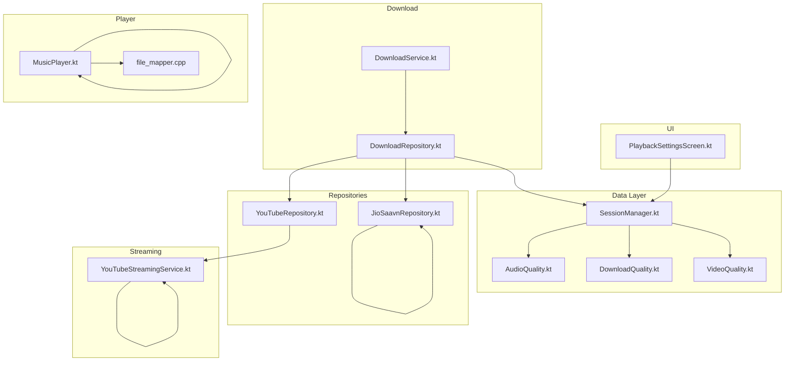
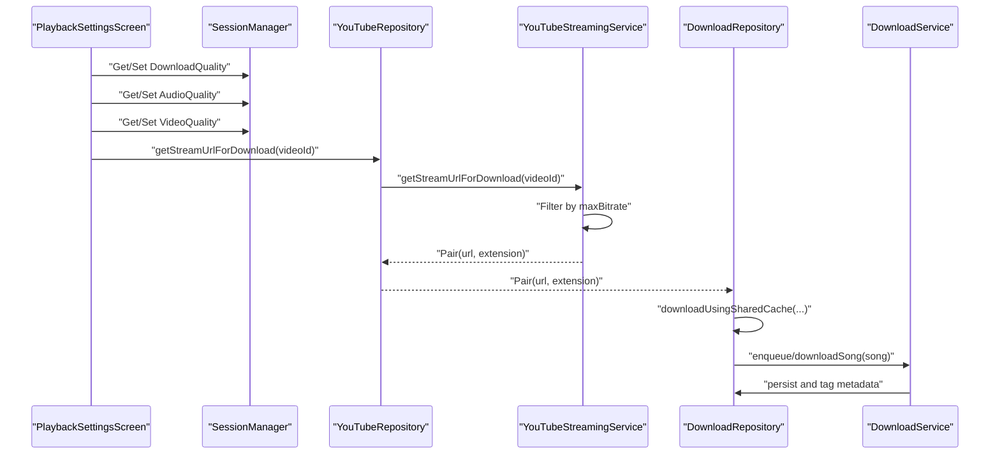
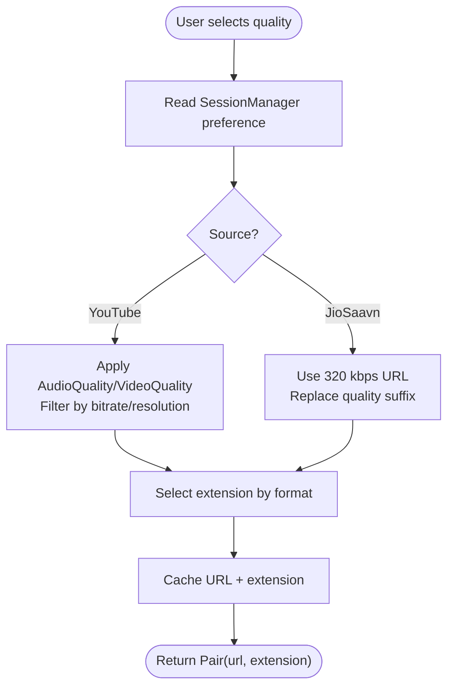
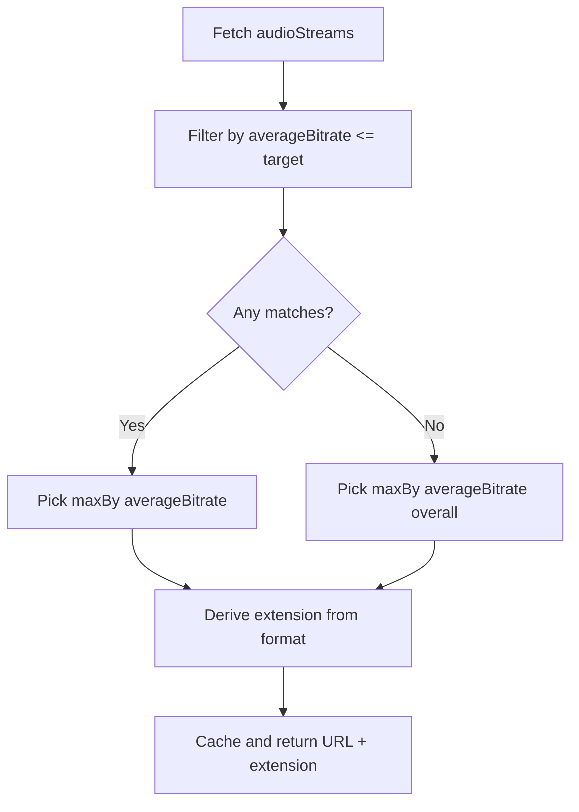
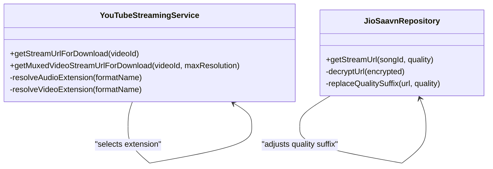
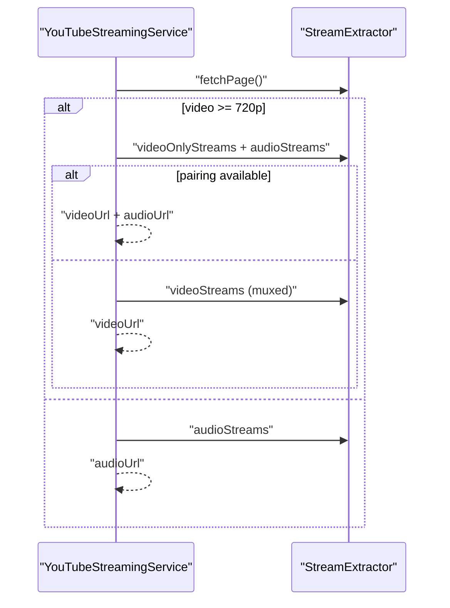
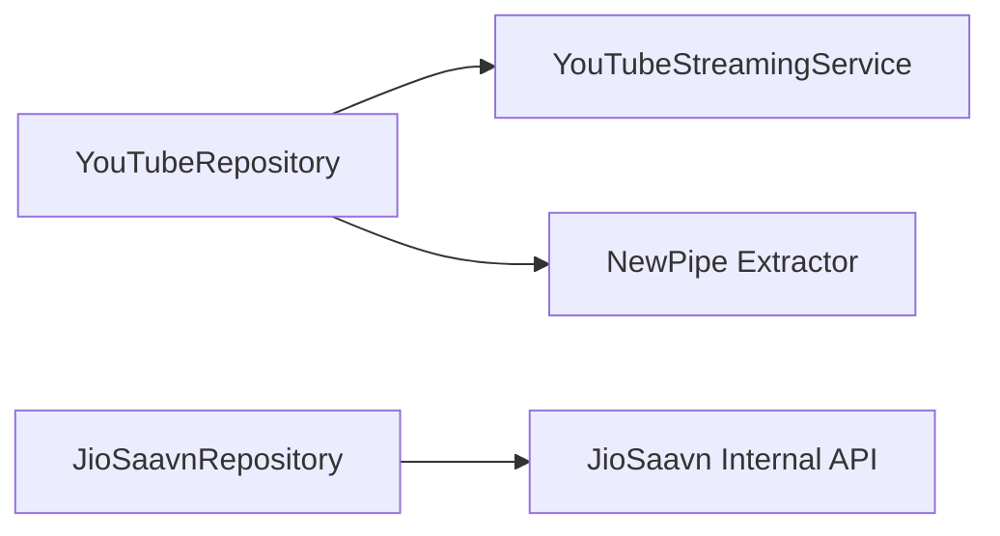
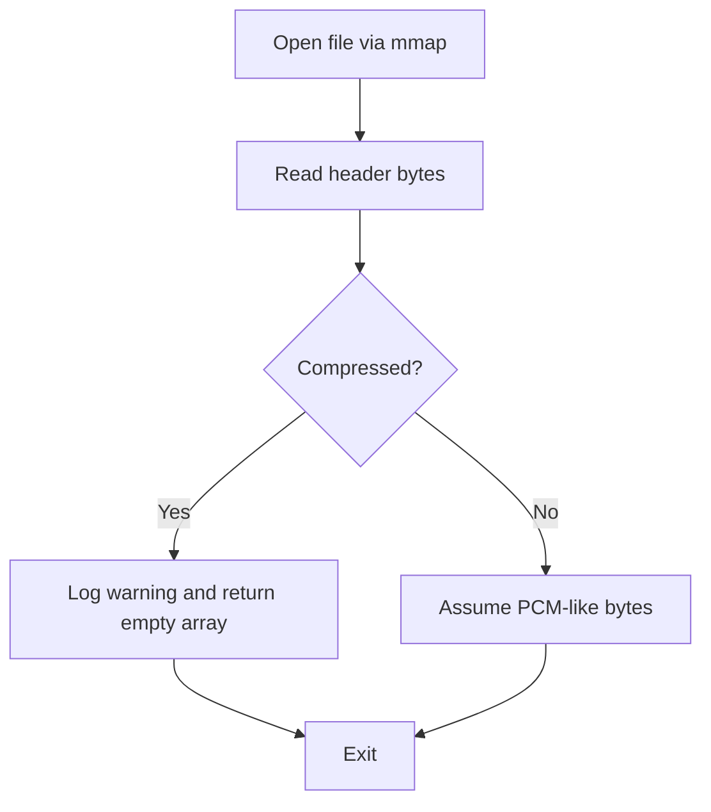
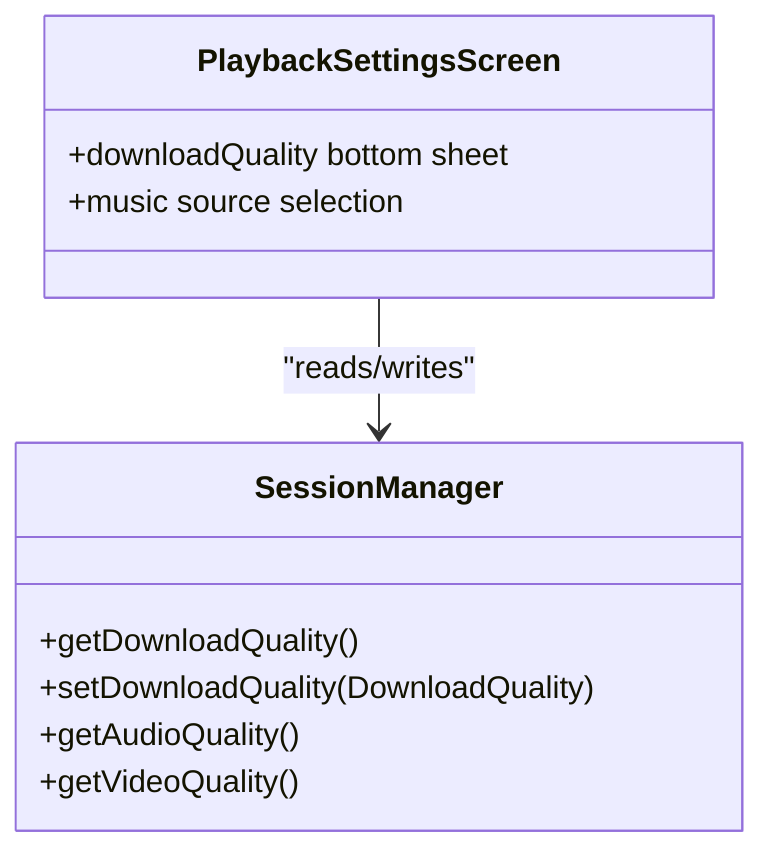
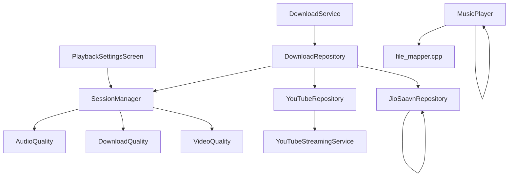

# Download Quality and Format

<cite>
**Referenced Files in This Document**
- [DownloadQuality.kt](file://app/src/main/java/com/suvojeet/suvmusic/data/model/DownloadQuality.kt)
- [AudioQuality.kt](file://app/src/main/java/com/suvojeet/suvmusic/data/model/AudioQuality.kt)
- [VideoQuality.kt](file://app/src/main/java/com/suvojeet/suvmusic/data/model/VideoQuality.kt)
- [YouTubeStreamingService.kt](file://app/src/main/java/com/suvojeet/suvmusic/data/repository/youtube/streaming/YouTubeStreamingService.kt)
- [YouTubeRepository.kt](file://app/src/main/java/com/suvojeet/suvmusic/data/repository/YouTubeRepository.kt)
- [JioSaavnRepository.kt](file://app/src/main/java/com/suvojeet/suvmusic/data/repository/JioSaavnRepository.kt)
- [DownloadRepository.kt](file://app/src/main/java/com/suvojeet/suvmusic/data/repository/DownloadRepository.kt)
- [DownloadService.kt](file://app/src/main/java/com/suvojeet/suvmusic/service/DownloadService.kt)
- [SessionManager.kt](file://app/src/main/java/com/suvojeet/suvmusic/data/SessionManager.kt)
- [MusicPlayer.kt](file://app/src/main/java/com/suvojeet/suvmusic/player/MusicPlayer.kt)
- [PlaybackSettingsScreen.kt](file://app/src/main/java/com/suvojeet/suvmusic/ui/screens/PlaybackSettingsScreen.kt)
- [file_mapper.cpp](file://app/src/main/cpp/file_mapper.cpp)
</cite>

## Table of Contents
1. [Introduction](#introduction)
2. [Project Structure](#project-structure)
3. [Core Components](#core-components)
4. [Architecture Overview](#architecture-overview)
5. [Detailed Component Analysis](#detailed-component-analysis)
6. [Dependency Analysis](#dependency-analysis)
7. [Performance Considerations](#performance-considerations)
8. [Troubleshooting Guide](#troubleshooting-guide)
9. [Conclusion](#conclusion)

## Introduction
This document explains how the application selects download quality and handles audio formats across sources. It covers:
- Quality tiers for YouTube and JioSaavn
- Bitrate selection algorithms
- Format detection and extension mapping
- Automatic fallbacks and validation
- Integration with source-specific endpoints
- User configuration options and trade-offs between quality and storage

## Project Structure
The download and quality system spans several modules:
- Data models define quality tiers and preferences
- Repositories fetch streams from YouTube and JioSaavn
- Streaming service resolves optimal streams and formats
- Download pipeline persists files with metadata
- UI exposes user controls for quality and source selection

**Diagram sources**
- [PlaybackSettingsScreen.kt:560-759](file://app/src/main/java/com/suvojeet/suvmusic/ui/screens/PlaybackSettingsScreen.kt#L560-L759)
- [SessionManager.kt:1681-1748](file://app/src/main/java/com/suvojeet/suvmusic/data/SessionManager.kt#L1681-L1748)
- [AudioQuality.kt:1-18](file://app/src/main/java/com/suvojeet/suvmusic/data/model/AudioQuality.kt#L1-L18)
- [DownloadQuality.kt:1-21](file://app/src/main/java/com/suvojeet/suvmusic/data/model/DownloadQuality.kt#L1-L21)
- [VideoQuality.kt:1-17](file://app/src/main/java/com/suvojeet/suvmusic/data/model/VideoQuality.kt#L1-L17)
- [YouTubeRepository.kt:264-281](file://app/src/main/java/com/suvojeet/suvmusic/data/repository/YouTubeRepository.kt#L264-L281)
- [YouTubeStreamingService.kt:272-301](file://app/src/main/java/com/suvojeet/suvmusic/data/repository/youtube/streaming/YouTubeStreamingService.kt#L272-L301)
- [JioSaavnRepository.kt:197-240](file://app/src/main/java/com/suvojeet/suvmusic/data/repository/JioSaavnRepository.kt#L197-L240)
- [DownloadRepository.kt:785-798](file://app/src/main/java/com/suvojeet/suvmusic/data/repository/DownloadRepository.kt#L785-L798)
- [DownloadService.kt:164-211](file://app/src/main/java/com/suvojeet/suvmusic/service/DownloadService.kt#L164-L211)
- [MusicPlayer.kt:1979-2036](file://app/src/main/java/com/suvojeet/suvmusic/player/MusicPlayer.kt#L1979-L2036)
- [file_mapper.cpp:45-75](file://app/src/main/cpp/file_mapper.cpp#L45-L75)

**Section sources**
- [PlaybackSettingsScreen.kt:560-759](file://app/src/main/java/com/suvojeet/suvmusic/ui/screens/PlaybackSettingsScreen.kt#L560-L759)
- [SessionManager.kt:1681-1748](file://app/src/main/java/com/suvojeet/suvmusic/data/SessionManager.kt#L1681-L1748)

## Core Components
- Quality models:
  - AudioQuality: streaming quality tiers with bitrate ranges
  - DownloadQuality: download bitrate caps
  - VideoQuality: maximum resolution for video
- Repositories:
  - YouTubeRepository: orchestrates YouTube streaming and video downloads
  - JioSaavnRepository: provides high-quality streams (320 kbps) via internal API
- Streaming service:
  - YouTubeStreamingService: resolves audio/video streams, applies quality filters, and caches results
- Download pipeline:
  - DownloadRepository: manages queues, persistence, and file writing with metadata tagging
  - DownloadService: foreground service for batched downloads with progress notifications
- Player and format detection:
  - MusicPlayer: infers codec and bitrate from ExoPlayer format and URL tags
  - file_mapper.cpp: detects compressed formats via file headers

**Section sources**
- [AudioQuality.kt:1-18](file://app/src/main/java/com/suvojeet/suvmusic/data/model/AudioQuality.kt#L1-L18)
- [DownloadQuality.kt:1-21](file://app/src/main/java/com/suvojeet/suvmusic/data/model/DownloadQuality.kt#L1-L21)
- [VideoQuality.kt:1-17](file://app/src/main/java/com/suvojeet/suvmusic/data/model/VideoQuality.kt#L1-L17)
- [YouTubeRepository.kt:264-281](file://app/src/main/java/com/suvojeet/suvmusic/data/repository/YouTubeRepository.kt#L264-L281)
- [JioSaavnRepository.kt:197-240](file://app/src/main/java/com/suvojeet/suvmusic/data/repository/JioSaavnRepository.kt#L197-L240)
- [YouTubeStreamingService.kt:272-301](file://app/src/main/java/com/suvojeet/suvmusic/data/repository/youtube/streaming/YouTubeStreamingService.kt#L272-L301)
- [DownloadRepository.kt:785-798](file://app/src/main/java/com/suvojeet/suvmusic/data/repository/DownloadRepository.kt#L785-L798)
- [DownloadService.kt:164-211](file://app/src/main/java/com/suvojeet/suvmusic/service/DownloadService.kt#L164-L211)
- [MusicPlayer.kt:1979-2036](file://app/src/main/java/com/suvojeet/suvmusic/player/MusicPlayer.kt#L1979-L2036)
- [file_mapper.cpp:45-75](file://app/src/main/cpp/file_mapper.cpp#L45-L75)

## Architecture Overview
The system integrates user preferences with source-specific endpoints to select optimal streams and formats.

**Diagram sources**
- [PlaybackSettingsScreen.kt:560-759](file://app/src/main/java/com/suvojeet/suvmusic/ui/screens/PlaybackSettingsScreen.kt#L560-L759)
- [SessionManager.kt:1681-1748](file://app/src/main/java/com/suvojeet/suvmusic/data/SessionManager.kt#L1681-L1748)
- [YouTubeRepository.kt:273](file://app/src/main/java/com/suvojeet/suvmusic/data/repository/YouTubeRepository.kt#L273)
- [YouTubeStreamingService.kt:272-301](file://app/src/main/java/com/suvojeet/suvmusic/data/repository/youtube/streaming/YouTubeStreamingService.kt#L272-L301)
- [DownloadRepository.kt:785-798](file://app/src/main/java/com/suvojeet/suvmusic/data/repository/DownloadRepository.kt#L785-L798)
- [DownloadService.kt:164-211](file://app/src/main/java/com/suvojeet/suvmusic/service/DownloadService.kt#L164-L211)

## Detailed Component Analysis

### Quality Tier System and Preferences
- YouTube streaming:
  - AudioQuality.AUTO adapts to network conditions; otherwise fixed tiers
  - Target bitrate applied when selecting audio streams
- YouTube downloads:
  - DownloadQuality maps to a maximum bitrate cap for audio
- JioSaavn:
  - Provides 320 kbps high-quality streams via internal API
  - Quality suffix replacement in URLs to enforce desired bitrate
- Video:
  - VideoQuality determines maximum resolution for video-only or muxed streams

**Diagram sources**
- [SessionManager.kt:1681-1748](file://app/src/main/java/com/suvojeet/suvmusic/data/SessionManager.kt#L1681-L1748)
- [AudioQuality.kt:1-18](file://app/src/main/java/com/suvojeet/suvmusic/data/model/AudioQuality.kt#L1-L18)
- [DownloadQuality.kt:1-21](file://app/src/main/java/com/suvojeet/suvmusic/data/model/DownloadQuality.kt#L1-L21)
- [VideoQuality.kt:1-17](file://app/src/main/java/com/suvojeet/suvmusic/data/model/VideoQuality.kt#L1-L17)
- [YouTubeStreamingService.kt:116-133](file://app/src/main/java/com/suvojeet/suvmusic/data/repository/youtube/streaming/YouTubeStreamingService.kt#L116-L133)
- [YouTubeStreamingService.kt:287-294](file://app/src/main/java/com/suvojeet/suvmusic/data/repository/youtube/streaming/YouTubeStreamingService.kt#L287-L294)
- [JioSaavnRepository.kt:226-230](file://app/src/main/java/com/suvojeet/suvmusic/data/repository/JioSaavnRepository.kt#L226-L230)

**Section sources**
- [AudioQuality.kt:6-17](file://app/src/main/java/com/suvojeet/suvmusic/data/model/AudioQuality.kt#L6-L17)
- [DownloadQuality.kt:7-10](file://app/src/main/java/com/suvojeet/suvmusic/data/model/DownloadQuality.kt#L7-L10)
- [VideoQuality.kt:6-10](file://app/src/main/java/com/suvojeet/suvmusic/data/model/VideoQuality.kt#L6-L10)
- [YouTubeStreamingService.kt:116-133](file://app/src/main/java/com/suvojeet/suvmusic/data/repository/youtube/streaming/YouTubeStreamingService.kt#L116-L133)
- [YouTubeStreamingService.kt:287-294](file://app/src/main/java/com/suvojeet/suvmusic/data/repository/youtube/streaming/YouTubeStreamingService.kt#L287-L294)
- [JioSaavnRepository.kt:226-230](file://app/src/main/java/com/suvojeet/suvmusic/data/repository/JioSaavnRepository.kt#L226-L230)

### Bitrate Selection Algorithms
- YouTube audio:
  - Filters available audio streams by target bitrate and selects the highest suitable
  - Falls back to the highest available if none meet the cap
- YouTube video:
  - For high resolutions, pairs best video-only stream with best audio stream
  - Otherwise selects the best muxed stream under the resolution cap
- JioSaavn:
  - Decrypts and adjusts stream URL to match requested quality (96/160/320 kbps)

**Diagram sources**
- [YouTubeStreamingService.kt:123-126](file://app/src/main/java/com/suvojeet/suvmusic/data/repository/youtube/streaming/YouTubeStreamingService.kt#L123-L126)
- [YouTubeStreamingService.kt:289-292](file://app/src/main/java/com/suvojeet/suvmusic/data/repository/youtube/streaming/YouTubeStreamingService.kt#L289-L292)
- [JioSaavnRepository.kt:224-230](file://app/src/main/java/com/suvojeet/suvmusic/data/repository/JioSaavnRepository.kt#L224-L230)

**Section sources**
- [YouTubeStreamingService.kt:123-126](file://app/src/main/java/com/suvojeet/suvmusic/data/repository/youtube/streaming/YouTubeStreamingService.kt#L123-L126)
- [YouTubeStreamingService.kt:289-292](file://app/src/main/java/com/suvojeet/suvmusic/data/repository/youtube/streaming/YouTubeStreamingService.kt#L289-L292)
- [JioSaavnRepository.kt:224-230](file://app/src/main/java/com/suvojeet/suvmusic/data/repository/JioSaavnRepository.kt#L224-L230)

### Format Detection and Extension Mapping
- YouTube:
  - Audio extension derived from stream format name ("M4A"/"AAC" → "m4a", "WEBM"/"OPUS" → "opus")
  - Video extension chosen from best video-only stream format ("WEBM" → "webm", else "mp4")
- JioSaavn:
  - Returns encrypted URLs; quality suffix replaced to enforce 96/160/320 kbps
- Download persistence:
  - Files saved with appropriate MIME type and extension ("audio/opus" or "audio/m4a")

**Diagram sources**
- [YouTubeStreamingService.kt:129-133](file://app/src/main/java/com/suvojeet/suvmusic/data/repository/youtube/streaming/YouTubeStreamingService.kt#L129-L133)
- [YouTubeStreamingService.kt:234-235](file://app/src/main/java/com/suvojeet/suvmusic/data/repository/youtube/streaming/YouTubeStreamingService.kt#L234-L235)
- [YouTubeStreamingService.kt:294](file://app/src/main/java/com/suvojeet/suvmusic/data/repository/youtube/streaming/YouTubeStreamingService.kt#L294)
- [JioSaavnRepository.kt:224-230](file://app/src/main/java/com/suvojeet/suvmusic/data/repository/JioSaavnRepository.kt#L224-L230)

**Section sources**
- [YouTubeStreamingService.kt:129-133](file://app/src/main/java/com/suvojeet/suvmusic/data/repository/youtube/streaming/YouTubeStreamingService.kt#L129-L133)
- [YouTubeStreamingService.kt:234-235](file://app/src/main/java/com/suvojeet/suvmusic/data/repository/youtube/streaming/YouTubeStreamingService.kt#L234-L235)
- [YouTubeStreamingService.kt:294](file://app/src/main/java/com/suvojeet/suvmusic/data/repository/youtube/streaming/YouTubeStreamingService.kt#L294)
- [JioSaavnRepository.kt:224-230](file://app/src/main/java/com/suvojeet/suvmusic/data/repository/JioSaavnRepository.kt#L224-L230)

### Automatic Fallback Mechanisms
- YouTube:
  - If primary watch URL fails, tries music.youtube.com fallback
  - For video, falls back from video-only+audio pairing to muxed streams
- JioSaavn:
  - Uses encrypted URL decryption and replaces quality suffix to match requested bitrate
- Player:
  - Infers codec and bitrate from ExoPlayer format or URL tags; includes YouTube itag and JioSaavn bitrate hints

**Diagram sources**
- [YouTubeStreamingService.kt:213-266](file://app/src/main/java/com/suvojeet/suvmusic/data/repository/youtube/streaming/YouTubeStreamingService.kt#L213-L266)

**Section sources**
- [YouTubeStreamingService.kt:83-88](file://app/src/main/java/com/suvojeet/suvmusic/data/repository/youtube/streaming/YouTubeStreamingService.kt#L83-L88)
- [YouTubeStreamingService.kt:213-266](file://app/src/main/java/com/suvojeet/suvmusic/data/repository/youtube/streaming/YouTubeStreamingService.kt#L213-L266)
- [JioSaavnRepository.kt:224-230](file://app/src/main/java/com/suvojeet/suvmusic/data/repository/JioSaavnRepository.kt#L224-L230)
- [MusicPlayer.kt:1998-2026](file://app/src/main/java/com/suvojeet/suvmusic/player/MusicPlayer.kt#L1998-L2026)

### Integration with Source-Specific Endpoints
- YouTube:
  - Uses NewPipe extractor to fetch streams and related items
  - Provides both audio-only and video-only streams for adaptive pairing
- JioSaavn:
  - Internal API endpoint for song details and encrypted stream URLs
  - Quality suffix replacement ensures requested bitrate

**Diagram sources**
- [YouTubeRepository.kt:264-281](file://app/src/main/java/com/suvojeet/suvmusic/data/repository/YouTubeRepository.kt#L264-L281)
- [JioSaavnRepository.kt:197-240](file://app/src/main/java/com/suvojeet/suvmusic/data/repository/JioSaavnRepository.kt#L197-L240)

**Section sources**
- [YouTubeRepository.kt:264-281](file://app/src/main/java/com/suvojeet/suvmusic/data/repository/YouTubeRepository.kt#L264-L281)
- [JioSaavnRepository.kt:197-240](file://app/src/main/java/com/suvojeet/suvmusic/data/repository/JioSaavnRepository.kt#L197-L240)

### Format Validation and Compatibility
- File header checks detect compressed formats (ID3, fLaC, MP4/AAC, Ogg) to ensure waveform extraction compatibility
- Download pipeline writes files with correct MIME types and extensions
- Player infers codec and bitrate from ExoPlayer format and URL tags

**Diagram sources**
- [file_mapper.cpp:45-75](file://app/src/main/cpp/file_mapper.cpp#L45-L75)

**Section sources**
- [file_mapper.cpp:45-75](file://app/src/main/cpp/file_mapper.cpp#L45-L75)
- [DownloadRepository.kt:409-410](file://app/src/main/java/com/suvojeet/suvmusic/data/repository/DownloadRepository.kt#L409-L410)
- [DownloadRepository.kt:534](file://app/src/main/java/com/suvojeet/suvmusic/data/repository/DownloadRepository.kt#L534)
- [MusicPlayer.kt:1979-2036](file://app/src/main/java/com/suvojeet/suvmusic/player/MusicPlayer.kt#L1979-L2036)

### User Configuration Options and Trade-offs
- Download quality:
  - LOW (64 kbps), MEDIUM (128 kbps), HIGH (256 kbps)
  - Lower quality reduces file size and storage usage
- Audio quality:
  - AUTO, LOW, MEDIUM, HIGH for streaming
  - AUTO adapts to network conditions
- Video quality:
  - AUTO, LOW (360p), MEDIUM (720p), HIGH (1080p)
- Primary music source:
  - YouTube Music (256 kbps max) or HQ Audio (320 kbps) in developer mode

**Diagram sources**
- [SessionManager.kt:1731-1742](file://app/src/main/java/com/suvojeet/suvmusic/data/SessionManager.kt#L1731-L1742)
- [PlaybackSettingsScreen.kt:561-611](file://app/src/main/java/com/suvojeet/suvmusic/ui/screens/PlaybackSettingsScreen.kt#L561-L611)

**Section sources**
- [DownloadQuality.kt:7-10](file://app/src/main/java/com/suvojeet/suvmusic/data/model/DownloadQuality.kt#L7-L10)
- [AudioQuality.kt:6-10](file://app/src/main/java/com/suvojeet/suvmusic/data/model/AudioQuality.kt#L6-L10)
- [VideoQuality.kt:6-10](file://app/src/main/java/com/suvojeet/suvmusic/data/model/VideoQuality.kt#L6-L10)
- [PlaybackSettingsScreen.kt:561-611](file://app/src/main/java/com/suvojeet/suvmusic/ui/screens/PlaybackSettingsScreen.kt#L561-L611)
- [SessionManager.kt:1731-1742](file://app/src/main/java/com/suvojeet/suvmusic/data/SessionManager.kt#L1731-L1742)

## Dependency Analysis
- UI depends on SessionManager for persisted preferences
- YouTubeRepository delegates to YouTubeStreamingService for stream resolution
- DownloadRepository coordinates downloads and metadata tagging
- DownloadService runs the download queue and updates notifications
- Player consumes resolved streams and infers format details

**Diagram sources**
- [PlaybackSettingsScreen.kt:560-759](file://app/src/main/java/com/suvojeet/suvmusic/ui/screens/PlaybackSettingsScreen.kt#L560-L759)
- [SessionManager.kt:1681-1748](file://app/src/main/java/com/suvojeet/suvmusic/data/SessionManager.kt#L1681-L1748)
- [YouTubeRepository.kt:264-281](file://app/src/main/java/com/suvojeet/suvmusic/data/repository/YouTubeRepository.kt#L264-L281)
- [DownloadRepository.kt:785-798](file://app/src/main/java/com/suvojeet/suvmusic/data/repository/DownloadRepository.kt#L785-L798)
- [DownloadService.kt:164-211](file://app/src/main/java/com/suvojeet/suvmusic/service/DownloadService.kt#L164-L211)
- [MusicPlayer.kt:1979-2036](file://app/src/main/java/com/suvojeet/suvmusic/player/MusicPlayer.kt#L1979-L2036)
- [file_mapper.cpp:45-75](file://app/src/main/cpp/file_mapper.cpp#L45-L75)

**Section sources**
- [YouTubeRepository.kt:264-281](file://app/src/main/java/com/suvojeet/suvmusic/data/repository/YouTubeRepository.kt#L264-L281)
- [DownloadRepository.kt:785-798](file://app/src/main/java/com/suvojeet/suvmusic/data/repository/DownloadRepository.kt#L785-L798)
- [DownloadService.kt:164-211](file://app/src/main/java/com/suvojeet/suvmusic/service/DownloadService.kt#L164-L211)

## Performance Considerations
- Caching:
  - YouTubeStreamingService caches resolved URLs with expiration to reduce repeated extraction
- Adaptive selection:
  - AUTO quality chooses higher bitrates on Wi-Fi and lower on metered connections
- Efficient downloads:
  - Foreground service batches downloads and updates progress notifications
- File I/O:
  - Direct write to MediaStore or public folders minimizes intermediate copies

[No sources needed since this section provides general guidance]

## Troubleshooting Guide
- No sound or decoder errors:
  - Check codec inference from URL tags for YouTube (itag) and JioSaavn (bitrate indicators)
  - Verify format compatibility; compressed headers are validated before waveform extraction
- Download failures:
  - Inspect cache clearing and retry logic in YouTubeStreamingService
  - Confirm download queue processing and foreground service lifecycle
- Quality mismatch:
  - Verify DownloadQuality vs source capabilities (YouTube max 256 kbps, JioSaavn up to 320 kbps)

**Section sources**
- [MusicPlayer.kt:1998-2026](file://app/src/main/java/com/suvojeet/suvmusic/player/MusicPlayer.kt#L1998-L2026)
- [file_mapper.cpp:45-75](file://app/src/main/cpp/file_mapper.cpp#L45-L75)
- [YouTubeStreamingService.kt:37-64](file://app/src/main/java/com/suvojeet/suvmusic/data/repository/youtube/streaming/YouTubeStreamingService.kt#L37-L64)
- [DownloadService.kt:164-211](file://app/src/main/java/com/suvojeet/suvmusic/service/DownloadService.kt#L164-L211)

## Conclusion
The system provides a robust, configurable pipeline for selecting and persisting high-quality audio across YouTube and JioSaavn. Users can balance quality and storage using explicit quality tiers and source selection. The architecture leverages source-specific endpoints, adaptive bitrate selection, and reliable caching to deliver efficient downloads and playback.