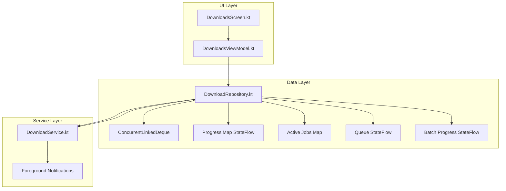
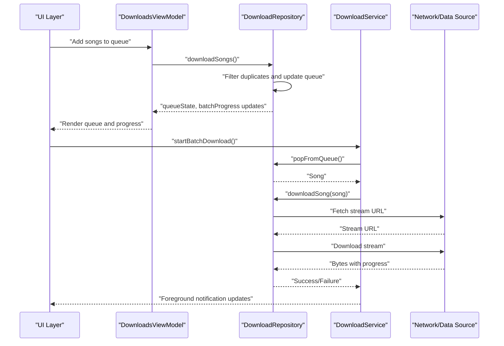
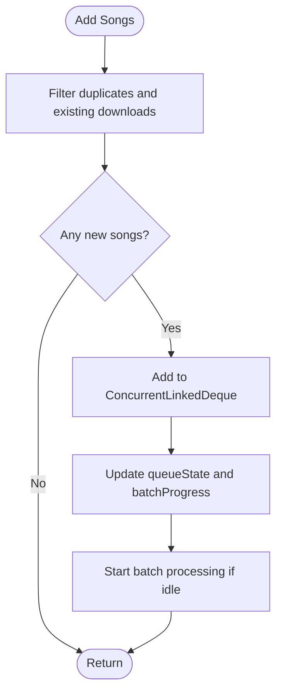
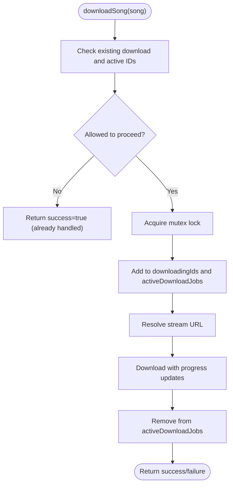
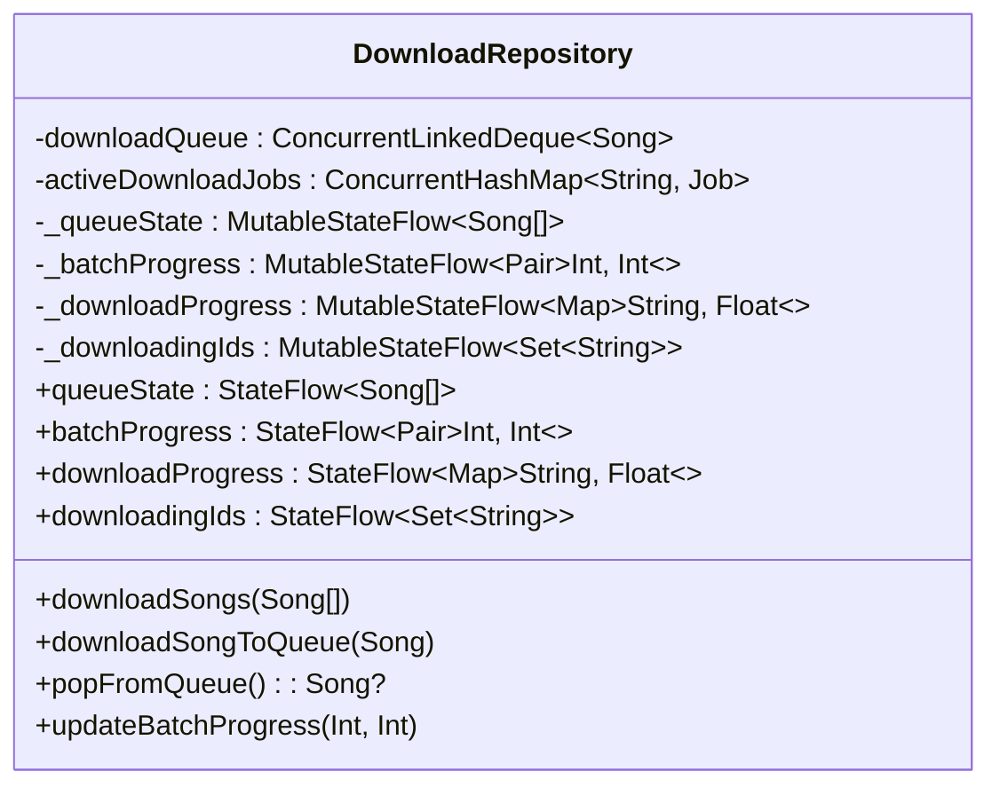

# Download Queue Management

<cite>
**Referenced Files in This Document**
- [DownloadRepository.kt](file://app/src/main/java/com/suvojeet/suvmusic/data/repository/DownloadRepository.kt)
- [DownloadService.kt](file://app/src/main/java/com/suvojeet/suvmusic/service/DownloadService.kt)
- [DownloadsViewModel.kt](file://app/src/main/java/com/suvojeet/suvmusic/ui/viewmodel/DownloadsViewModel.kt)
- [DownloadsScreen.kt](file://app/src/main/java/com/suvojeet/suvmusic/ui/screens/DownloadsScreen.kt)
- [Song.kt](file://core/model/src/main/java/com/suvojeet/suvmusic/core/model/Song.kt)
</cite>

## Table of Contents
1. [Introduction](#introduction)
2. [Project Structure](#project-structure)
3. [Core Components](#core-components)
4. [Architecture Overview](#architecture-overview)
5. [Detailed Component Analysis](#detailed-component-analysis)
6. [Dependency Analysis](#dependency-analysis)
7. [Performance Considerations](#performance-considerations)
8. [Troubleshooting Guide](#troubleshooting-guide)
9. [Conclusion](#conclusion)

## Introduction
This document explains the download queue management system used by the application to handle concurrent downloads, track progress, manage queue state, and coordinate foreground service-based batch processing. It covers the implementation using a concurrent queue, thread-safe operations with mutex locks, job tracking with a concurrent map, state management via StateFlow, and comprehensive error handling and cancellation support.

## Project Structure
The download queue system spans three main layers:
- Data layer: Repository manages the queue, progress tracking, and download lifecycle
- Service layer: Foreground service coordinates batch processing and notifications
- UI layer: ViewModels and Screens expose queue state and user actions

**Diagram sources**
- [DownloadRepository.kt:64-1266](file://app/src/main/java/com/suvojeet/suvmusic/data/repository/DownloadRepository.kt#L64-L1266)
- [DownloadService.kt:38-225](file://app/src/main/java/com/suvojeet/suvmusic/service/DownloadService.kt#L38-L225)
- [DownloadsViewModel.kt:29-81](file://app/src/main/java/com/suvojeet/suvmusic/ui/viewmodel/DownloadsViewModel.kt#L29-L81)
- [DownloadsScreen.kt:103-140](file://app/src/main/java/com/suvojeet/suvmusic/ui/screens/DownloadsScreen.kt#L103-L140)

**Section sources**
- [DownloadRepository.kt:64-1266](file://app/src/main/java/com/suvojeet/suvmusic/data/repository/DownloadRepository.kt#L64-L1266)
- [DownloadService.kt:38-225](file://app/src/main/java/com/suvojeet/suvmusic/service/DownloadService.kt#L38-L225)
- [DownloadsViewModel.kt:29-81](file://app/src/main/java/com/suvojeet/suvmusic/ui/viewmodel/DownloadsViewModel.kt#L29-L81)
- [DownloadsScreen.kt:103-140](file://app/src/main/java/com/suvojeet/suvmusic/ui/screens/DownloadsScreen.kt#L103-L140)

## Core Components
- Concurrent download queue: A thread-safe queue backed by a concurrent linked deque for adding/removing songs
- Thread-safe operations: A mutex lock ensures only one download per song ID proceeds at a time
- Job tracking: A concurrent map tracks active coroutines for cancellation
- StateFlow-based state: Queue state, batch progress, and per-song progress are exposed as reactive streams
- Foreground service orchestration: A long-running service processes the queue and updates notifications
- UI integration: ViewModels combine repository state for rendering and user interactions

**Section sources**
- [DownloadRepository.kt:64-1266](file://app/src/main/java/com/suvojeet/suvmusic/data/repository/DownloadRepository.kt#L64-L1266)
- [DownloadService.kt:38-225](file://app/src/main/java/com/suvojeet/suvmusic/service/DownloadService.kt#L38-L225)
- [DownloadsViewModel.kt:29-81](file://app/src/main/java/com/suvojeet/suvmusic/ui/viewmodel/DownloadsViewModel.kt#L29-L81)

## Architecture Overview
The system follows a reactive, layered architecture:
- UI subscribes to StateFlows from the repository via the ViewModel
- The service consumes the queue and invokes repository download methods
- Repository enforces concurrency constraints and updates state
- Notifications reflect real-time progress

**Diagram sources**
- [DownloadRepository.kt:1250-1266](file://app/src/main/java/com/suvojeet/suvmusic/data/repository/DownloadRepository.kt#L1250-L1266)
- [DownloadRepository.kt:771-807](file://app/src/main/java/com/suvojeet/suvmusic/data/repository/DownloadRepository.kt#L771-L807)
- [DownloadService.kt:164-211](file://app/src/main/java/com/suvojeet/suvmusic/service/DownloadService.kt#L164-L211)

## Detailed Component Analysis

### Concurrent Download Queue Implementation
- Queue backing: A concurrent linked deque enables thread-safe enqueue/dequeue operations
- Queue state: Exposed as a StateFlow list for UI consumption
- Batch progress: A pair of integers tracks current and total items for UI progress indicators
- Queue operations:
  - Add songs: Filters duplicates and newly downloaded items, updates queue and batch totals
  - Pop/poll: Removes and returns the next song for processing
  - Peek: Inspects the next song without removing it

**Diagram sources**
- [DownloadRepository.kt:1250-1266](file://app/src/main/java/com/suvojeet/suvmusic/data/repository/DownloadRepository.kt#L1250-L1266)

**Section sources**
- [DownloadRepository.kt:80-87](file://app/src/main/java/com/suvojeet/suvmusic/data/repository/DownloadRepository.kt#L80-L87)
- [DownloadRepository.kt:1246-1266](file://app/src/main/java/com/suvojeet/suvmusic/data/repository/DownloadRepository.kt#L1246-L1266)

### Thread-Safe Operations with Mutex Locks
- Concurrency guard: A mutex lock prevents multiple simultaneous downloads for the same song ID
- Duplicate prevention: Before acquiring the lock, the repository checks existing downloads and active IDs
- Active job tracking: Associates each song ID with its coroutine job for targeted cancellation

**Diagram sources**
- [DownloadRepository.kt:769-807](file://app/src/main/java/com/suvojeet/suvmusic/data/repository/DownloadRepository.kt#L769-L807)

**Section sources**
- [DownloadRepository.kt:769-807](file://app/src/main/java/com/suvojeet/suvmusic/data/repository/DownloadRepository.kt#L769-L807)

### Job Tracking with ConcurrentHashMap
- Active jobs: Tracks coroutine jobs keyed by song ID for precise cancellation
- Cancellation: Cancels the associated job and removes the song from queue and progress tracking
- Cleanup: Ensures jobs are removed from the map upon completion or failure

**Section sources**
- [DownloadRepository.kt:82](file://app/src/main/java/com/suvojeet/suvmusic/data/repository/DownloadRepository.kt#L82)
- [DownloadRepository.kt:999-1010](file://app/src/main/java/com/suvojeet/suvmusic/data/repository/DownloadRepository.kt#L999-L1010)
- [DownloadService.kt:231-234](file://app/src/main/java/com/suvojeet/suvmusic/service/DownloadService.kt#L231-L234)

### StateFlow-Based Queue State Management
- Queue state: Reactive list of queued songs for UI rendering
- Batch progress: Current and total counts for overall progress indication
- Per-song progress: Map from song ID to progress fraction for granular UI updates
- Downloading IDs: Set of song IDs currently being processed

**Diagram sources**
- [DownloadRepository.kt:64-1266](file://app/src/main/java/com/suvojeet/suvmusic/data/repository/DownloadRepository.kt#L64-L1266)

**Section sources**
- [DownloadRepository.kt:64-87](file://app/src/main/java/com/suvojeet/suvmusic/data/repository/DownloadRepository.kt#L64-L87)

### Progress Tracking for Individual Downloads and Batch Monitoring
- Per-song progress: Updated incrementally during download; cleared on completion or failure
- Batch progress: Updated as each song completes; supports both single and multi-song batches
- UI integration: The ViewModel combines downloaded, queued, downloading, and progress maps to render lists and cards

**Section sources**
- [DownloadRepository.kt:821-829](file://app/src/main/java/com/suvojeet/suvmusic/data/repository/DownloadRepository.kt#L821-L829)
- [DownloadRepository.kt:1248](file://app/src/main/java/com/suvojeet/suvmusic/data/repository/DownloadRepository.kt#L1248)
- [DownloadsViewModel.kt:44-81](file://app/src/main/java/com/suvojeet/suvmusic/ui/viewmodel/DownloadsViewModel.kt#L44-L81)

### Queue Prioritization, Concurrency Limits, and Error Handling
- Prioritization: The queue is FIFO; no explicit priority mechanism is present
- Concurrency: Controlled by the mutex lock; only one active download per song ID
- Error handling: Exceptions are caught, logging is performed, and state is cleaned up; progress and downloading IDs are removed; jobs are canceled

**Section sources**
- [DownloadRepository.kt:771-807](file://app/src/main/java/com/suvojeet/suvmusic/data/repository/DownloadRepository.kt#L771-L807)
- [DownloadRepository.kt:875-881](file://app/src/main/java/com/suvojeet/suvmusic/data/repository/DownloadRepository.kt#L875-L881)
- [DownloadService.kt:191-209](file://app/src/main/java/com/suvojeet/suvmusic/service/DownloadService.kt#L191-L209)

### Download Job Lifecycle, Cancellation Support, and Resource Cleanup
- Lifecycle:
  - Enqueue: Add songs to queue and update batch totals
  - Dequeue: Pop next song for processing
  - Download: Resolve stream URL, download with progress, tag metadata, persist file
  - Complete: Update state, save downloads, clean up progress and IDs
- Cancellation:
  - Cancel by ID: Cancels the associated coroutine job and removes the song from queue and progress
  - Service-level cancel: Delegates to repository
- Resource cleanup:
  - Temporary files and caches are removed
  - Thumbnails and metadata are embedded
  - State is consistently updated to reflect completion or failure

**Section sources**
- [DownloadRepository.kt:999-1010](file://app/src/main/java/com/suvojeet/suvmusic/data/repository/DownloadRepository.kt#L999-L1010)
- [DownloadService.kt:231-234](file://app/src/main/java/com/suvojeet/suvmusic/service/DownloadService.kt#L231-L234)
- [DownloadRepository.kt:839-845](file://app/src/main/java/com/suvojeet/suvmusic/data/repository/DownloadRepository.kt#L839-L845)

### Examples: Adding Songs to Queue, Monitoring Queue State, Handling Failures
- Adding songs to queue:
  - Use the repository method to add a list of songs; duplicates and existing downloads are filtered
  - The queue state and batch progress are updated automatically
- Monitoring queue state:
  - Subscribe to queueState and batchProgress in the ViewModel
  - Combine with downloadingIds and downloadProgress to render UI cards and progress bars
- Handling failures:
  - On failure, the repository logs, cleans up progress and IDs, and returns a failure result
  - The service displays a completion notification indicating success or failure

**Section sources**
- [DownloadRepository.kt:1250-1266](file://app/src/main/java/com/suvojeet/suvmusic/data/repository/DownloadRepository.kt#L1250-L1266)
- [DownloadsViewModel.kt:29-81](file://app/src/main/java/com/suvojeet/suvmusic/ui/viewmodel/DownloadsViewModel.kt#L29-L81)
- [DownloadService.kt:191-209](file://app/src/main/java/com/suvojeet/suvmusic/service/DownloadService.kt#L191-L209)

## Dependency Analysis
The system exhibits clear separation of concerns:
- UI depends on ViewModels for reactive state
- ViewModels depend on the repository for data and operations
- Repository encapsulates queue, progress, and concurrency logic
- Service orchestrates queue processing and notifications

**Diagram sources**
- [DownloadsScreen.kt:103-140](file://app/src/main/java/com/suvojeet/suvmusic/ui/screens/DownloadsScreen.kt#L103-L140)
- [DownloadsViewModel.kt:29-81](file://app/src/main/java/com/suvojeet/suvmusic/ui/viewmodel/DownloadsViewModel.kt#L29-L81)
- [DownloadRepository.kt:64-1266](file://app/src/main/java/com/suvojeet/suvmusic/data/repository/DownloadRepository.kt#L64-L1266)
- [DownloadService.kt:38-225](file://app/src/main/java/com/suvojeet/suvmusic/service/DownloadService.kt#L38-L225)

**Section sources**
- [DownloadsScreen.kt:103-140](file://app/src/main/java/com/suvojeet/suvmusic/ui/screens/DownloadsScreen.kt#L103-L140)
- [DownloadsViewModel.kt:29-81](file://app/src/main/java/com/suvojeet/suvmusic/ui/viewmodel/DownloadsViewModel.kt#L29-L81)
- [DownloadRepository.kt:64-1266](file://app/src/main/java/com/suvojeet/suvmusic/data/repository/DownloadRepository.kt#L64-L1266)
- [DownloadService.kt:38-225](file://app/src/main/java/com/suvojeet/suvmusic/service/DownloadService.kt#L38-L225)

## Performance Considerations
- Queue throughput: The concurrent deque allows efficient multi-threaded access without external synchronization
- Memory footprint: Progress maps and queue lists are updated reactively; ensure UI subscriptions are scoped appropriately
- Network efficiency: Streaming with progress reporting minimizes memory overhead and enables early playback for progressive downloads
- Background processing: Using a foreground service avoids OS restrictions and ensures reliable completion

## Troubleshooting Guide
Common issues and resolutions:
- Duplicate downloads: The repository filters duplicates; ensure IDs are consistent
- Stalled progress: Verify progress updates are emitted and collected by the service
- Cancellation not taking effect: Confirm the job is present in the active map and cancellation is invoked
- Failure cleanup: Ensure exceptions clear progress and IDs and cancel active jobs

**Section sources**
- [DownloadRepository.kt:1250-1266](file://app/src/main/java/com/suvojeet/suvmusic/data/repository/DownloadRepository.kt#L1250-L1266)
- [DownloadRepository.kt:999-1010](file://app/src/main/java/com/suvojeet/suvmusic/data/repository/DownloadRepository.kt#L999-L1010)
- [DownloadService.kt:213-229](file://app/src/main/java/com/suvojeet/suvmusic/service/DownloadService.kt#L213-L229)

## Conclusion
The download queue management system provides a robust, reactive foundation for batch downloading with strong guarantees around concurrency, progress tracking, and error handling. Its modular design integrates cleanly with UI and service layers, enabling scalable and maintainable download workflows.