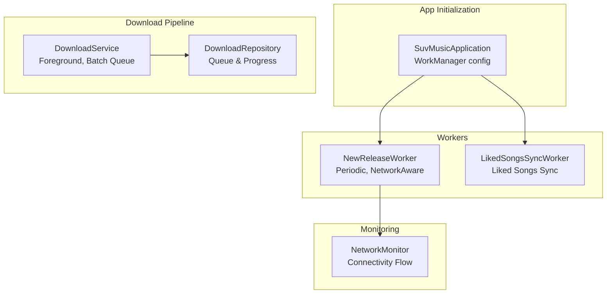
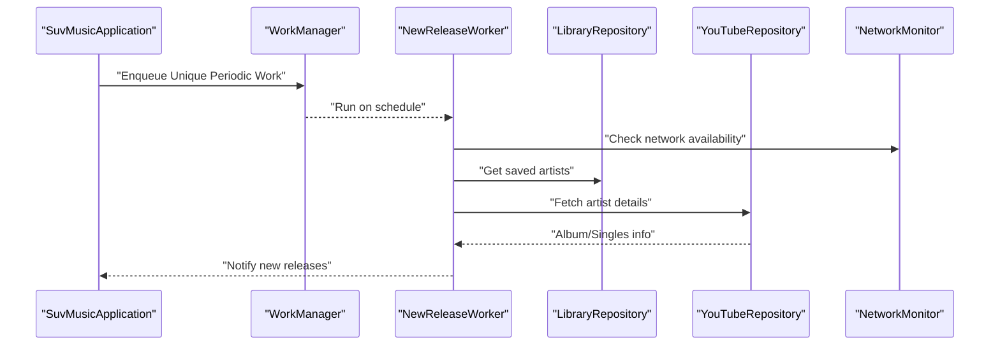
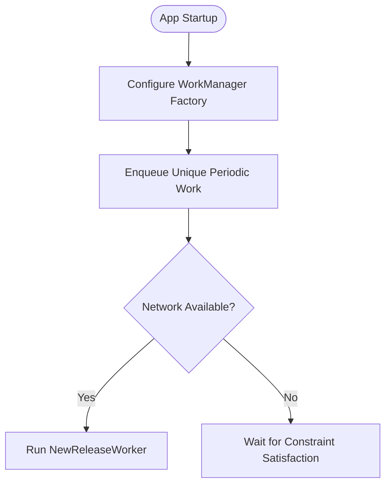
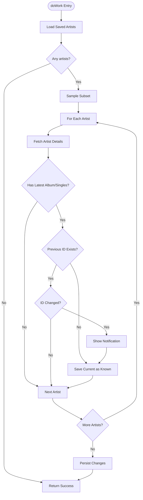
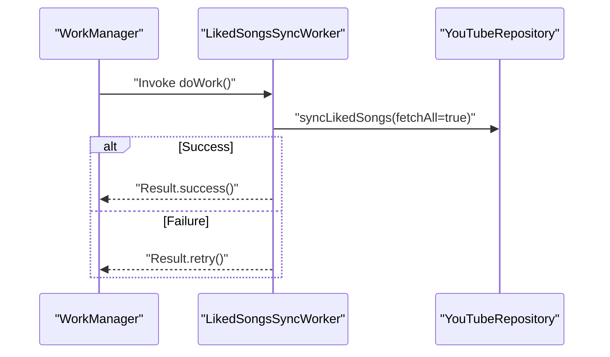
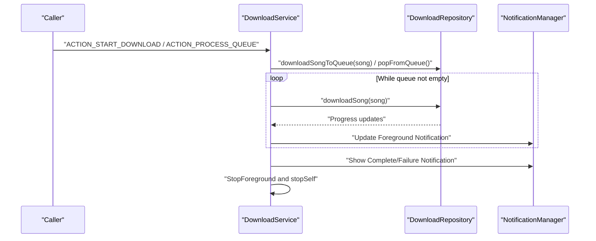
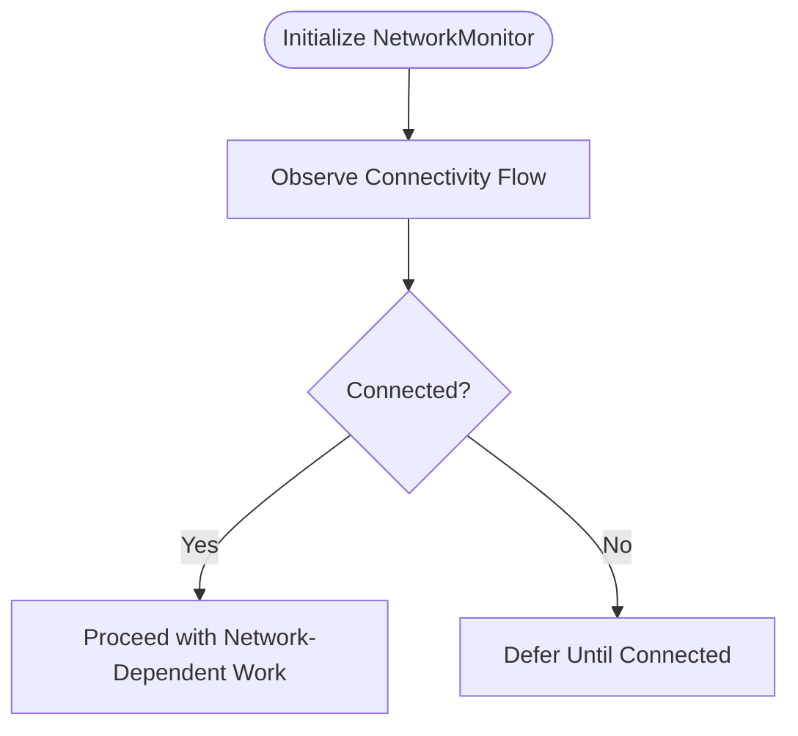
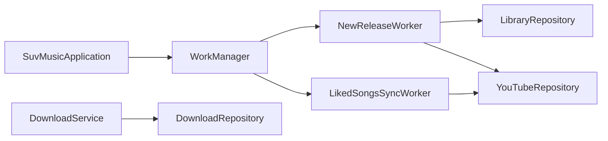

# Download Scheduling and Workers

<cite>
**Referenced Files in This Document**
- [SuvMusicApplication.kt](file://app/src/main/java/com/suvojeet/suvmusic/SuvMusicApplication.kt)
- [NewReleaseWorker.kt](file://app/src/main/java/com/suvojeet/suvmusic/workers/NewReleaseWorker.kt)
- [LikedSongsSyncWorker.kt](file://app/src/main/java/com/suvojeet/suvmusic/data/worker/LikedSongsSyncWorker.kt)
- [DownloadService.kt](file://app/src/main/java/com/suvojeet/suvmusic/service/DownloadService.kt)
- [NetworkMonitor.kt](file://app/src/main/java/com/suvojeet/suvmusic/util/NetworkMonitor.kt)
</cite>

## Table of Contents
1. [Introduction](#introduction)
2. [Project Structure](#project-structure)
3. [Core Components](#core-components)
4. [Architecture Overview](#architecture-overview)
5. [Detailed Component Analysis](#detailed-component-analysis)
6. [Dependency Analysis](#dependency-analysis)
7. [Performance Considerations](#performance-considerations)
8. [Troubleshooting Guide](#troubleshooting-guide)
9. [Conclusion](#conclusion)

## Introduction
This document explains the download scheduling and background workers subsystem in SuvMusic. It covers:
- WorkManager integration for periodic tasks and constraint-based scheduling
- Work request queuing and execution lifecycle
- Implementation of NewReleaseWorker for automatic content discovery and notifications
- LikedSongsSyncWorker for offline access synchronization
- Foreground service-based batch download processing with progress notifications
- Integration with network state monitoring and user preferences
- Retry policies, work chaining, status monitoring, and cancellation mechanisms

## Project Structure
The worker-related code resides primarily under:
- app/src/main/java/com/suvojeet/suvmusic/workers (periodic workers)
- app/src/main/java/com/suvojeet/suvmusic/data/worker (data synchronization workers)
- app/src/main/java/com/suvojeet/suvmusic/service (foreground download service)
- app/src/main/java/com/suvojeet/suvmusic/util (network monitoring)

**Diagram sources**
- [SuvMusicApplication.kt:111-127](file://app/src/main/java/com/suvojeet/suvmusic/SuvMusicApplication.kt#L111-L127)
- [NewReleaseWorker.kt:29-78](file://app/src/main/java/com/suvojeet/suvmusic/workers/NewReleaseWorker.kt#L29-L78)
- [LikedSongsSyncWorker.kt:18-33](file://app/src/main/java/com/suvojeet/suvmusic/data/worker/LikedSongsSyncWorker.kt#L18-L33)
- [DownloadService.kt:164-211](file://app/src/main/java/com/suvojeet/suvmusic/service/DownloadService.kt#L164-L211)
- [NetworkMonitor.kt:29-76](file://app/src/main/java/com/suvojeet/suvmusic/util/NetworkMonitor.kt#L29-L76)

**Section sources**
- [SuvMusicApplication.kt:111-127](file://app/src/main/java/com/suvojeet/suvmusic/SuvMusicApplication.kt#L111-L127)
- [NewReleaseWorker.kt:29-78](file://app/src/main/java/com/suvojeet/suvmusic/workers/NewReleaseWorker.kt#L29-L78)
- [LikedSongsSyncWorker.kt:18-33](file://app/src/main/java/com/suvojeet/suvmusic/data/worker/LikedSongsSyncWorker.kt#L18-L33)
- [DownloadService.kt:164-211](file://app/src/main/java/com/suvojeet/suvmusic/service/DownloadService.kt#L164-L211)
- [NetworkMonitor.kt:29-76](file://app/src/main/java/com/suvojeet/suvmusic/util/NetworkMonitor.kt#L29-L76)

## Core Components
- WorkManager configuration and periodic work registration
- NewReleaseWorker: periodic discovery of new releases for followed artists
- LikedSongsSyncWorker: full sync of liked songs for offline access
- DownloadService: foreground service for batched downloads with progress notifications
- NetworkMonitor: reactive network connectivity flow for constraint-aware scheduling

Key responsibilities:
- Schedule periodic tasks with WorkManager and enforce network constraints
- Discover new content and notify users
- Sync liked songs reliably with retry/failure handling
- Process download queues efficiently with progress updates
- Monitor network state to gate operations

**Section sources**
- [SuvMusicApplication.kt:111-127](file://app/src/main/java/com/suvojeet/suvmusic/SuvMusicApplication.kt#L111-L127)
- [NewReleaseWorker.kt:29-78](file://app/src/main/java/com/suvojeet/suvmusic/workers/NewReleaseWorker.kt#L29-L78)
- [LikedSongsSyncWorker.kt:18-33](file://app/src/main/java/com/suvojeet/suvmusic/data/worker/LikedSongsSyncWorker.kt#L18-L33)
- [DownloadService.kt:164-211](file://app/src/main/java/com/suvojeet/suvmusic/service/DownloadService.kt#L164-L211)
- [NetworkMonitor.kt:29-76](file://app/src/main/java/com/suvojeet/suvmusic/util/NetworkMonitor.kt#L29-L76)

## Architecture Overview
The system integrates WorkManager for scheduling and Lifecycle-aware execution, with a foreground service for robust download processing. NetworkMonitor provides reactive connectivity signals used by workers to respect user constraints.

**Diagram sources**
- [SuvMusicApplication.kt:111-127](file://app/src/main/java/com/suvojeet/suvmusic/SuvMusicApplication.kt#L111-L127)
- [NewReleaseWorker.kt:29-78](file://app/src/main/java/com/suvojeet/suvmusic/workers/NewReleaseWorker.kt#L29-L78)
- [NetworkMonitor.kt:29-76](file://app/src/main/java/com/suvojeet/suvmusic/util/NetworkMonitor.kt#L29-L76)

## Detailed Component Analysis

### WorkManager Integration and Periodic Tasks
- WorkManager is configured via the application’s Hilt worker factory.
- A unique periodic work named “NewReleaseCheck” runs every 12 hours with a network-connected constraint.
- This ensures the app checks for new releases only when the device has validated internet access.

**Diagram sources**
- [SuvMusicApplication.kt:84-87](file://app/src/main/java/com/suvojeet/suvmusic/SuvMusicApplication.kt#L84-L87)
- [SuvMusicApplication.kt:111-127](file://app/src/main/java/com/suvojeet/suvmusic/SuvMusicApplication.kt#L111-L127)

**Section sources**
- [SuvMusicApplication.kt:84-87](file://app/src/main/java/com/suvojeet/suvmusic/SuvMusicApplication.kt#L84-L87)
- [SuvMusicApplication.kt:111-127](file://app/src/main/java/com/suvojeet/suvmusic/SuvMusicApplication.kt#L111-L127)

### NewReleaseWorker: Automatic Content Discovery and Notifications
- Fetches followed artists from the library repository.
- Randomly samples a subset to balance load and bandwidth.
- Queries YouTubeRepository for artist albums/singles and compares against stored last-known IDs.
- Emits a notification when a new release is detected and persists the latest ID.
- Uses SharedPreferences to persist per-artist last release identifiers.

**Diagram sources**
- [NewReleaseWorker.kt:29-78](file://app/src/main/java/com/suvojeet/suvmusic/workers/NewReleaseWorker.kt#L29-L78)

**Section sources**
- [NewReleaseWorker.kt:29-78](file://app/src/main/java/com/suvojeet/suvmusic/workers/NewReleaseWorker.kt#L29-L78)

### LikedSongsSyncWorker: Offline Access Synchronization
- Performs a full sync of liked songs using YouTubeRepository.
- Returns success on completion; otherwise retries via Result.retry().
- Designed to keep offline liked songs synchronized with the remote source.

**Diagram sources**
- [LikedSongsSyncWorker.kt:18-33](file://app/src/main/java/com/suvojeet/suvmusic/data/worker/LikedSongsSyncWorker.kt#L18-L33)

**Section sources**
- [LikedSongsSyncWorker.kt:18-33](file://app/src/main/java/com/suvojeet/suvmusic/data/worker/LikedSongsSyncWorker.kt#L18-L33)

### DownloadService: Foreground Batch Processing with Progress
- Runs as a foreground service to ensure reliable operation in the background.
- Processes a queue of songs, updating progress notifications and handling completion/failure.
- Supports single-song enqueue and batch processing triggers.
- Tracks active downloads and updates the primary notification song.

**Diagram sources**
- [DownloadService.kt:118-144](file://app/src/main/java/com/suvojeet/suvmusic/service/DownloadService.kt#L118-L144)
- [DownloadService.kt:164-211](file://app/src/main/java/com/suvojeet/suvmusic/service/DownloadService.kt#L164-L211)
- [DownloadService.kt:213-229](file://app/src/main/java/com/suvojeet/suvmusic/service/DownloadService.kt#L213-L229)

**Section sources**
- [DownloadService.kt:118-144](file://app/src/main/java/com/suvojeet/suvmusic/service/DownloadService.kt#L118-L144)
- [DownloadService.kt:164-211](file://app/src/main/java/com/suvojeet/suvmusic/service/DownloadService.kt#L164-L211)
- [DownloadService.kt:213-229](file://app/src/main/java/com/suvojeet/suvmusic/service/DownloadService.kt#L213-L229)

### Network State Monitoring and Constraint-Based Scheduling
- NetworkMonitor exposes a Flow<Boolean> indicating internet availability and supports Wi-Fi detection.
- WorkManager constraints ensure tasks run only when the device has validated connectivity.
- NewReleaseWorker leverages network availability to avoid unnecessary work when offline.

**Diagram sources**
- [NetworkMonitor.kt:29-76](file://app/src/main/java/com/suvojeet/suvmusic/util/NetworkMonitor.kt#L29-L76)
- [SuvMusicApplication.kt:115-119](file://app/src/main/java/com/suvojeet/suvmusic/SuvMusicApplication.kt#L115-L119)

**Section sources**
- [NetworkMonitor.kt:29-76](file://app/src/main/java/com/suvojeet/suvmusic/util/NetworkMonitor.kt#L29-L76)
- [SuvMusicApplication.kt:115-119](file://app/src/main/java/com/suvojeet/suvmusic/SuvMusicApplication.kt#L115-L119)

### Work Chaining, Retry Policies, Status Monitoring, and Cancellation
- Work chaining: Not explicitly implemented in the examined files; periodic work is enqueued independently.
- Retry policies:
  - LikedSongsSyncWorker uses Result.retry() on failure to re-run the work automatically.
  - NewReleaseWorker does not specify explicit retry policy; failures are logged and returned as failure.
- Status monitoring:
  - NewReleaseWorker uses notifications for user-visible outcomes.
  - DownloadService publishes progress via a foreground notification and completion notifications.
- Cancellation:
  - DownloadService supports cancellation via a dedicated action delegated to the repository.
  - WorkManager supports cancelling unique periodic work by name when needed.

**Section sources**
- [LikedSongsSyncWorker.kt:28-31](file://app/src/main/java/com/suvojeet/suvmusic/data/worker/LikedSongsSyncWorker.kt#L28-L31)
- [NewReleaseWorker.kt:74-77](file://app/src/main/java/com/suvojeet/suvmusic/workers/NewReleaseWorker.kt#L74-L77)
- [DownloadService.kt:136-141](file://app/src/main/java/com/suvojeet/suvmusic/service/DownloadService.kt#L136-L141)

## Dependency Analysis
- SuvMusicApplication configures WorkManager with HiltWorkerFactory and schedules NewReleaseWorker.
- NewReleaseWorker depends on LibraryRepository and YouTubeRepository; it also uses SharedPreferences for persistence.
- LikedSongsSyncWorker depends on YouTubeRepository for syncing liked songs.
- DownloadService depends on DownloadRepository for queue management and progress tracking.

**Diagram sources**
- [SuvMusicApplication.kt:111-127](file://app/src/main/java/com/suvojeet/suvmusic/SuvMusicApplication.kt#L111-L127)
- [NewReleaseWorker.kt:25-26](file://app/src/main/java/com/suvojeet/suvmusic/workers/NewReleaseWorker.kt#L25-L26)
- [LikedSongsSyncWorker.kt:15](file://app/src/main/java/com/suvojeet/suvmusic/data/worker/LikedSongsSyncWorker.kt#L15)
- [DownloadService.kt:97](file://app/src/main/java/com/suvojeet/suvmusic/service/DownloadService.kt#L97)

**Section sources**
- [SuvMusicApplication.kt:111-127](file://app/src/main/java/com/suvojeet/suvmusic/SuvMusicApplication.kt#L111-L127)
- [NewReleaseWorker.kt:25-26](file://app/src/main/java/com/suvojeet/suvmusic/workers/NewReleaseWorker.kt#L25-L26)
- [LikedSongsSyncWorker.kt:15](file://app/src/main/java/com/suvojeet/suvmusic/data/worker/LikedSongsSyncWorker.kt#L15)
- [DownloadService.kt:97](file://app/src/main/java/com/suvojeet/suvmusic/service/DownloadService.kt#L97)

## Performance Considerations
- NewReleaseWorker limits the number of artists checked per run to reduce bandwidth and CPU usage.
- LikedSongsSyncWorker performs a full sync; consider optimizing to incremental checks if scalability becomes an issue.
- DownloadService batches downloads and updates notifications incrementally to minimize overhead.
- NetworkMonitor avoids redundant emissions by using distinctUntilChanged on the connectivity flow.

[No sources needed since this section provides general guidance]

## Troubleshooting Guide
Common issues and remedies:
- Work not running:
  - Verify WorkManager configuration and unique periodic work registration.
  - Confirm network constraints are satisfied if the task requires connectivity.
- Frequent retries:
  - Inspect LikedSongsSyncWorker failure logs and adjust retry/backoff strategies if needed.
- Download stuck or not progressing:
  - Ensure DownloadService is started with proper actions and that the queue is being processed.
  - Check for exceptions during download and review completion notifications.
- Notifications not appearing:
  - Confirm notification channel creation and permissions.
  - Validate notification IDs and intents used for navigation.

**Section sources**
- [SuvMusicApplication.kt:111-127](file://app/src/main/java/com/suvojeet/suvmusic/SuvMusicApplication.kt#L111-L127)
- [LikedSongsSyncWorker.kt:28-31](file://app/src/main/java/com/suvojeet/suvmusic/data/worker/LikedSongsSyncWorker.kt#L28-L31)
- [DownloadService.kt:164-211](file://app/src/main/java/com/suvojeet/suvmusic/service/DownloadService.kt#L164-L211)
- [NewReleaseWorker.kt:111-121](file://app/src/main/java/com/suvojeet/suvmusic/workers/NewReleaseWorker.kt#L111-L121)

## Conclusion
SuvMusic employs WorkManager for reliable, constraint-aware periodic tasks and a foreground service for robust download processing. NewReleaseWorker discovers new content for followed artists and notifies users, while LikedSongsSyncWorker maintains offline access by syncing liked songs. NetworkMonitor ensures operations respect connectivity constraints. The system balances reliability, performance, and user experience through notifications, progress tracking, and retry policies.