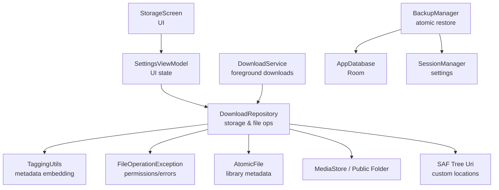
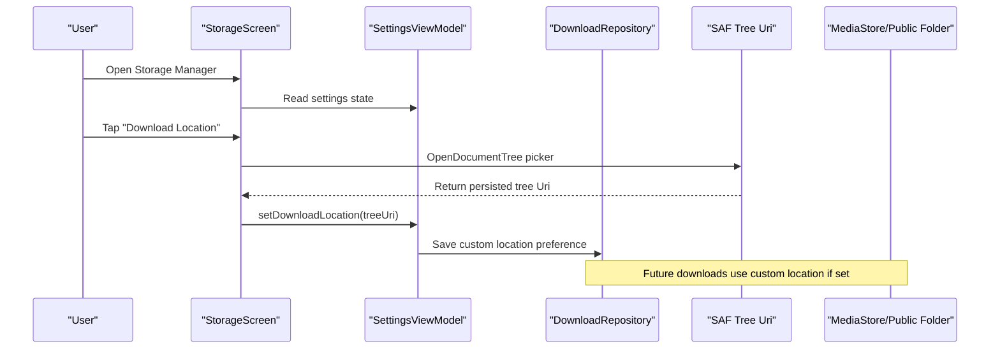
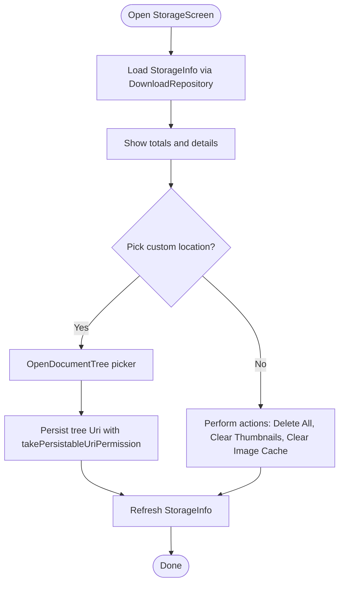
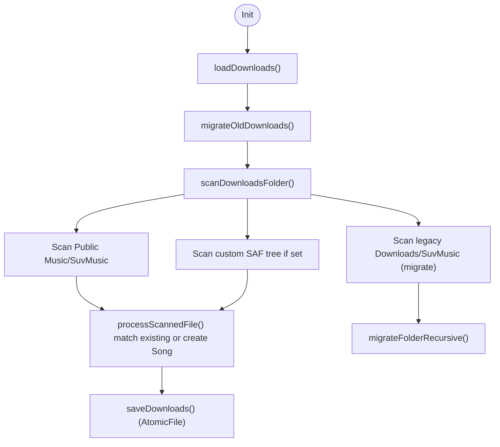
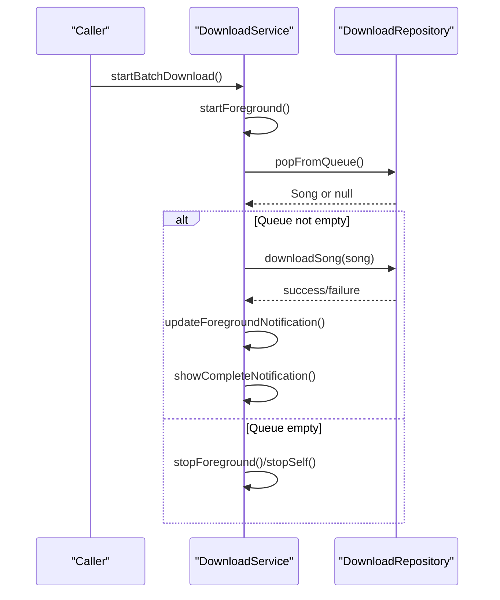
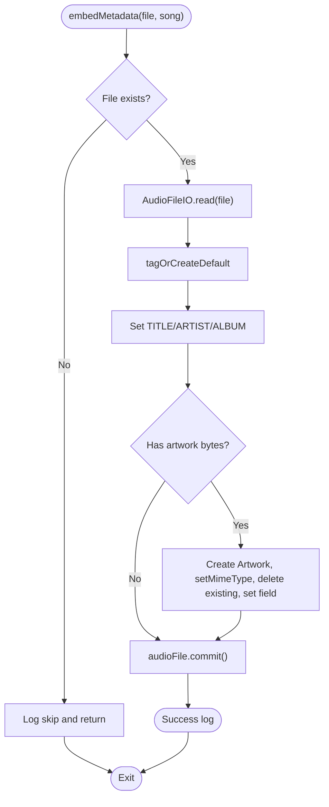
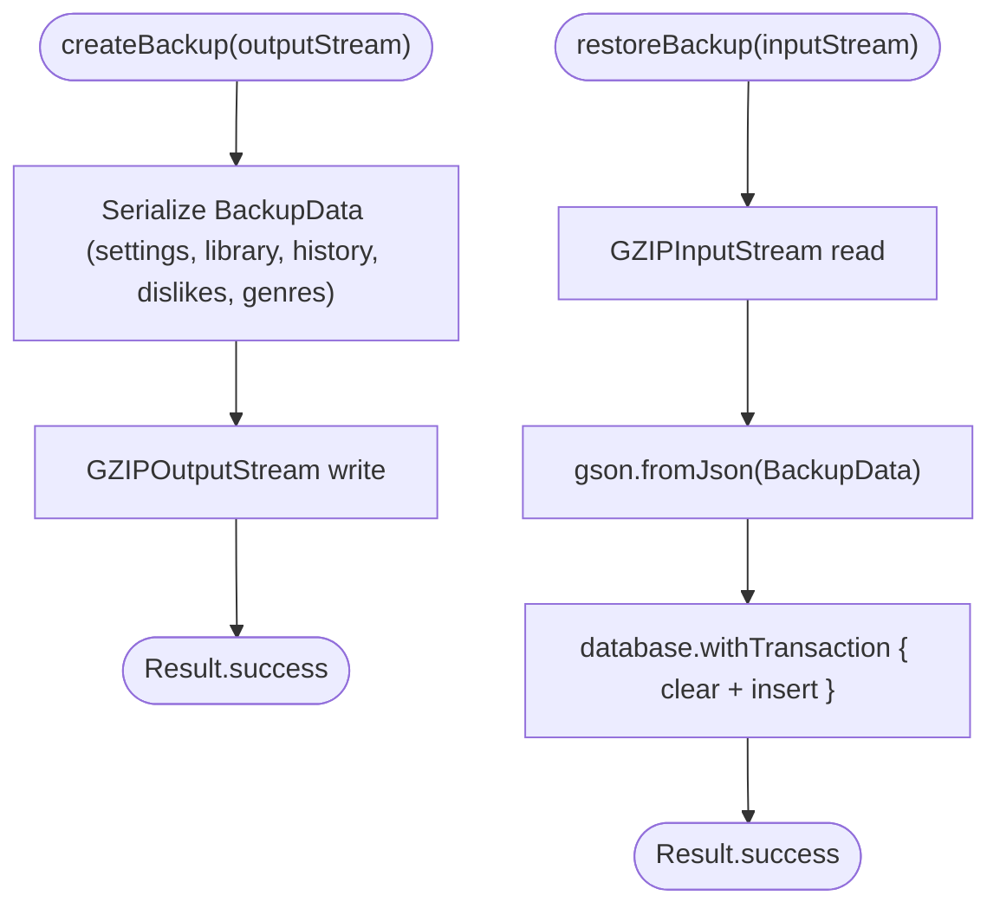
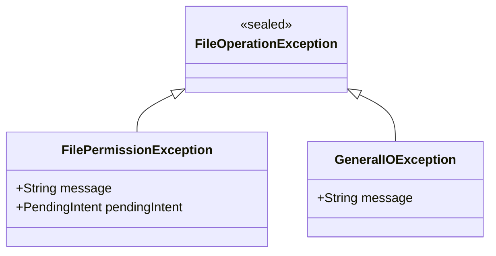
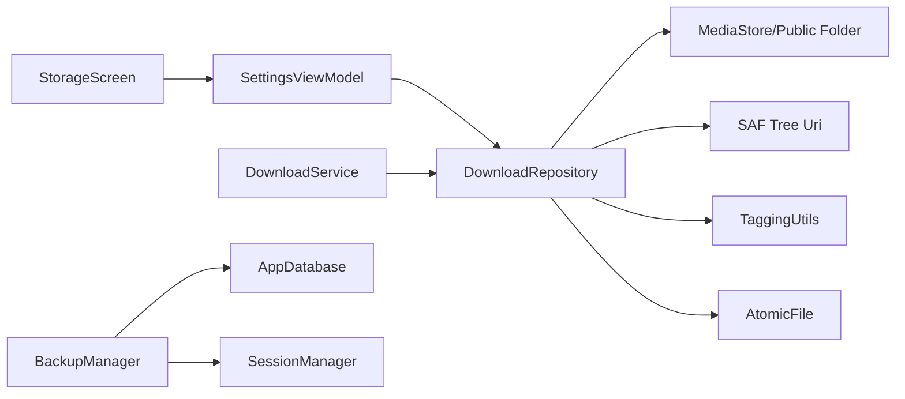

# Storage and File Management

<cite>
**Referenced Files in This Document**
- [StorageScreen.kt](file://app/src/main/java/com/suvojeet/suvmusic/ui/screens/StorageScreen.kt)
- [DownloadRepository.kt](file://app/src/main/java/com/suvojeet/suvmusic/data/repository/DownloadRepository.kt)
- [DownloadService.kt](file://app/src/main/java/com/suvojeet/suvmusic/service/DownloadService.kt)
- [TaggingUtils.kt](file://app/src/main/java/com/suvojeet/suvmusic/util/TaggingUtils.kt)
- [FileOperationException.kt](file://app/src/main/java/com/suvojeet/suvmusic/util/FileOperationException.kt)
- [BackupManager.kt](file://app/src/main/java/com/suvojeet/suvmusic/data/BackupManager.kt)
- [SettingsViewModel.kt](file://app/src/main/java/com/suvojeet/suvmusic/ui/viewmodel/SettingsViewModel.kt)
- [SessionManager.kt](file://app/src/main/java/com/suvojeet/suvmusic/data/SessionManager.kt)
- [file_paths.xml](file://app/src/main/res/xml/file_paths.xml)
</cite>

## Table of Contents
1. [Introduction](#introduction)
2. [Project Structure](#project-structure)
3. [Core Components](#core-components)
4. [Architecture Overview](#architecture-overview)
5. [Detailed Component Analysis](#detailed-component-analysis)
6. [Dependency Analysis](#dependency-analysis)
7. [Performance Considerations](#performance-considerations)
8. [Troubleshooting Guide](#troubleshooting-guide)
9. [Conclusion](#conclusion)
10. [Appendices](#appendices)

## Introduction
This document explains the storage and file management system in the application, focusing on multi-location storage support, file naming conventions, metadata embedding, file format handling, migration strategies, folder organization, discovery mechanisms, atomic writes, backup/restore, and cleanup procedures. It also covers configuring custom download locations, managing storage permissions, and handling storage-related errors.

## Project Structure
The storage subsystem spans UI, repository, service, utilities, and persistence layers:
- UI: Storage management screen for selecting custom locations and clearing caches
- Repository: Centralized logic for scanning, saving, tagging, deleting, and organizing files
- Service: Background download orchestration with progress notifications
- Utilities: Metadata tagging and file operation exceptions
- Persistence: Atomic file writes for library metadata and session settings

**Diagram sources**
- [StorageScreen.kt:47-300](file://app/src/main/java/com/suvojeet/suvmusic/ui/screens/StorageScreen.kt#L47-L300)
- [DownloadRepository.kt:39-1301](file://app/src/main/java/com/suvojeet/suvmusic/data/repository/DownloadRepository.kt#L39-L1301)
- [DownloadService.kt:32-305](file://app/src/main/java/com/suvojeet/suvmusic/service/DownloadService.kt#L32-L305)
- [TaggingUtils.kt:10-60](file://app/src/main/java/com/suvojeet/suvmusic/util/TaggingUtils.kt#L10-L60)
- [FileOperationException.kt:8-23](file://app/src/main/java/com/suvojeet/suvmusic/util/FileOperationException.kt#L8-L23)
- [BackupManager.kt:19-117](file://app/src/main/java/com/suvojeet/suvmusic/data/BackupManager.kt#L19-L117)

**Section sources**
- [StorageScreen.kt:47-300](file://app/src/main/java/com/suvojeet/suvmusic/ui/screens/StorageScreen.kt#L47-L300)
- [DownloadRepository.kt:39-1301](file://app/src/main/java/com/suvojeet/suvmusic/data/repository/DownloadRepository.kt#L39-L1301)
- [DownloadService.kt:32-305](file://app/src/main/java/com/suvojeet/suvmusic/service/DownloadService.kt#L32-L305)
- [TaggingUtils.kt:10-60](file://app/src/main/java/com/suvojeet/suvmusic/util/TaggingUtils.kt#L10-L60)
- [FileOperationException.kt:8-23](file://app/src/main/java/com/suvojeet/suvmusic/util/FileOperationException.kt#L8-L23)
- [BackupManager.kt:19-117](file://app/src/main/java/com/suvojeet/suvmusic/data/BackupManager.kt#L19-L117)

## Core Components
- Multi-location storage:
  - Public Music folder under the app-specific subdirectory
  - Legacy Downloads location migration
  - Custom folder via SAF (Storage Access Framework) tree URI
  - MediaStore integration for Android Q+ with IS_PENDING flag
- File naming and organization:
  - Standard naming pattern: "{title} - {artist}.{ext}"
  - Subfolders per album or playlist during downloads
  - Sanitized filenames to avoid invalid characters
- Metadata embedding:
  - Uses TaggingUtils to write tags and embedded artwork
- File formats:
  - Supported: M4A, MP3, AAC, FLAC, WAV, OGG, OPUS
- Discovery and migration:
  - Recursive scans of default and custom locations
  - Migration from legacy Downloads and internal storage
- Atomic writes and cleanup:
  - AtomicFile for library metadata
  - Cleanup of thumbnails, progressive cache, and image cache
- Backup and restore:
  - Compressed JSON backup with atomic Room transaction
- Permissions and errors:
  - Scoped Storage permission prompts via PendingIntent
  - Dedicated exception types for file operations

**Section sources**
- [DownloadRepository.kt:211-261](file://app/src/main/java/com/suvojeet/suvmusic/data/repository/DownloadRepository.kt#L211-L261)
- [DownloadRepository.kt:375-476](file://app/src/main/java/com/suvojeet/suvmusic/data/repository/DownloadRepository.kt#L375-L476)
- [DownloadRepository.kt:478-639](file://app/src/main/java/com/suvojeet/suvmusic/data/repository/DownloadRepository.kt#L478-L639)
- [TaggingUtils.kt:20-58](file://app/src/main/java/com/suvojeet/suvmusic/util/TaggingUtils.kt#L20-L58)
- [DownloadRepository.kt:145-162](file://app/src/main/java/com/suvojeet/suvmusic/data/repository/DownloadRepository.kt#L145-L162)
- [DownloadRepository.kt:752-767](file://app/src/main/java/com/suvojeet/suvmusic/data/repository/DownloadRepository.kt#L752-L767)
- [BackupManager.kt:30-56](file://app/src/main/java/com/suvojeet/suvmusic/data/BackupManager.kt#L30-L56)
- [FileOperationException.kt:8-23](file://app/src/main/java/com/suvojeet/suvmusic/util/FileOperationException.kt#L8-L23)

## Architecture Overview
The storage architecture integrates UI selection of custom locations, repository-driven file operations, foreground service orchestration, and robust error handling.

**Diagram sources**
- [StorageScreen.kt:64-77](file://app/src/main/java/com/suvojeet/suvmusic/ui/screens/StorageScreen.kt#L64-L77)
- [SettingsViewModel.kt](file://app/src/main/java/com/suvojeet/suvmusic/ui/viewmodel/SettingsViewModel.kt)
- [SessionManager.kt](file://app/src/main/java/com/suvojeet/suvmusic/data/SessionManager.kt)
- [DownloadRepository.kt:378-388](file://app/src/main/java/com/suvojeet/suvmusic/data/repository/DownloadRepository.kt#L378-L388)

## Detailed Component Analysis

### StorageScreen: Custom Locations and Cleanup
- Allows picking a SAF tree URI and persisting it for future downloads
- Provides actions to delete all downloads, clear thumbnails, and clear image cache
- Displays storage breakdown across downloads, thumbnails, progressive cache, and image cache

**Diagram sources**
- [StorageScreen.kt:64-94](file://app/src/main/java/com/suvojeet/suvmusic/ui/screens/StorageScreen.kt#L64-L94)
- [StorageScreen.kt:302-391](file://app/src/main/java/com/suvojeet/suvmusic/ui/screens/StorageScreen.kt#L302-L391)

**Section sources**
- [StorageScreen.kt:47-300](file://app/src/main/java/com/suvojeet/suvmusic/ui/screens/StorageScreen.kt#L47-L300)

### DownloadRepository: Multi-location, Naming, Formats, Migration
- Default location: Public Music/SuvMusic
- Legacy migration: Moves from legacy Downloads/SuvMusic to Public Music/SuvMusic
- Custom location: Uses SAF DocumentFile tree URI; creates subdirectories per album/playlist
- MediaStore integration: Writes with IS_PENDING flag, then marks as ready
- File naming: "{sanitized title} - {sanitized artist}.{ext}"
- Formats: M4A, MP3, AAC, FLAC, WAV, OGG, OPUS
- Discovery: Recursive scan of default/custom locations; matches by filename and metadata
- Deletion: Searches default/public and custom locations; supports Scoped Storage prompts

**Diagram sources**
- [DownloadRepository.kt:91-135](file://app/src/main/java/com/suvojeet/suvmusic/data/repository/DownloadRepository.kt#L91-L135)
- [DownloadRepository.kt:225-261](file://app/src/main/java/com/suvojeet/suvmusic/data/repository/DownloadRepository.kt#L225-L261)
- [DownloadRepository.kt:99-135](file://app/src/main/java/com/suvojeet/suvmusic/data/repository/DownloadRepository.kt#L99-L135)
- [DownloadRepository.kt:164-209](file://app/src/main/java/com/suvojeet/suvmusic/data/repository/DownloadRepository.kt#L164-L209)
- [DownloadRepository.kt:752-767](file://app/src/main/java/com/suvojeet/suvmusic/data/repository/DownloadRepository.kt#L752-L767)

**Section sources**
- [DownloadRepository.kt:91-135](file://app/src/main/java/com/suvojeet/suvmusic/data/repository/DownloadRepository.kt#L91-L135)
- [DownloadRepository.kt:225-261](file://app/src/main/java/com/suvojeet/suvmusic/data/repository/DownloadRepository.kt#L225-L261)
- [DownloadRepository.kt:164-209](file://app/src/main/java/com/suvojeet/suvmusic/data/repository/DownloadRepository.kt#L164-L209)
- [DownloadRepository.kt:752-767](file://app/src/main/java/com/suvojeet/suvmusic/data/repository/DownloadRepository.kt#L752-L767)

### DownloadService: Foreground Downloads and Progress
- Foreground service with persistent progress notifications
- Processes a queue of songs, updates notifications, and handles completion/failure
- Delegates actual download logic to DownloadRepository

**Diagram sources**
- [DownloadService.kt:118-211](file://app/src/main/java/com/suvojeet/suvmusic/service/DownloadService.kt#L118-L211)
- [DownloadService.kt:236-297](file://app/src/main/java/com/suvojeet/suvmusic/service/DownloadService.kt#L236-L297)
- [DownloadRepository.kt:1246-1260](file://app/src/main/java/com/suvojeet/suvmusic/data/repository/DownloadRepository.kt#L1246-L1260)

**Section sources**
- [DownloadService.kt:32-305](file://app/src/main/java/com/suvojeet/suvmusic/service/DownloadService.kt#L32-L305)

### TaggingUtils: Metadata Embedding
- Reads audio files, sets title, artist, album, and embeds artwork
- Handles exceptions and logs failures
- Works with supported formats via underlying tagging library

**Diagram sources**
- [TaggingUtils.kt:20-58](file://app/src/main/java/com/suvojeet/suvmusic/util/TaggingUtils.kt#L20-L58)

**Section sources**
- [TaggingUtils.kt:10-60](file://app/src/main/java/com/suvojeet/suvmusic/util/TaggingUtils.kt#L10-L60)

### BackupManager: Atomic Backup and Restore
- Creates a compressed JSON backup of settings and database content
- Restores atomically inside a Room transaction, clearing and reinserting data
- Uses GZIP compression for efficient storage

**Diagram sources**
- [BackupManager.kt:30-56](file://app/src/main/java/com/suvojeet/suvmusic/data/BackupManager.kt#L30-L56)
- [BackupManager.kt:62-115](file://app/src/main/java/com/suvojeet/suvmusic/data/BackupManager.kt#L62-L115)

**Section sources**
- [BackupManager.kt:19-117](file://app/src/main/java/com/suvojeet/suvmusic/data/BackupManager.kt#L19-L117)

### FileOperationException: Scoped Storage and IO Errors
- Dedicated exception for Scoped Storage permission prompts via PendingIntent
- General IO exception wrapper for other file operation failures

**Diagram sources**
- [FileOperationException.kt:8-23](file://app/src/main/java/com/suvojeet/suvmusic/util/FileOperationException.kt#L8-L23)

**Section sources**
- [FileOperationException.kt:8-23](file://app/src/main/java/com/suvojeet/suvmusic/util/FileOperationException.kt#L8-L23)

## Dependency Analysis
- UI depends on SettingsViewModel and DownloadRepository for storage info and actions
- DownloadRepository orchestrates file operations, MediaStore, SAF, and TaggingUtils
- DownloadService depends on DownloadRepository for queue and progress
- BackupManager depends on AppDatabase and SessionManager for atomic restore
- AtomicFile is used for library metadata persistence

**Diagram sources**
- [StorageScreen.kt:47-52](file://app/src/main/java/com/suvojeet/suvmusic/ui/screens/StorageScreen.kt#L47-L52)
- [DownloadRepository.kt:39-46](file://app/src/main/java/com/suvojeet/suvmusic/data/repository/DownloadRepository.kt#L39-L46)
- [DownloadService.kt:96-97](file://app/src/main/java/com/suvojeet/suvmusic/service/DownloadService.kt#L96-L97)
- [BackupManager.kt:20-25](file://app/src/main/java/com/suvojeet/suvmusic/data/BackupManager.kt#L20-L25)

**Section sources**
- [DownloadRepository.kt:39-1301](file://app/src/main/java/com/suvojeet/suvmusic/data/repository/DownloadRepository.kt#L39-L1301)
- [DownloadService.kt:32-305](file://app/src/main/java/com/suvojeet/suvmusic/service/DownloadService.kt#L32-L305)
- [BackupManager.kt:19-117](file://app/src/main/java/com/suvojeet/suvmusic/data/BackupManager.kt#L19-L117)

## Performance Considerations
- Streaming progress updates: Copy loops compute progress periodically to reduce overhead
- Atomic writes: AtomicFile prevents partial writes of library metadata
- MediaStore batching: IS_PENDING flag minimizes indexing churn until commit
- Cleanup routines: Efficient directory traversal and selective deletion
- Concurrency: Mutex guards concurrent downloads and progress updates

[No sources needed since this section provides general guidance]

## Troubleshooting Guide
Common scenarios and resolutions:
- Scoped Storage deletion prompts:
  - When attempting to delete files on Android 11+, a permission prompt is raised via PendingIntent; handle and launch the intent to grant access
- General IO errors:
  - Catch and handle FileOperationException.GeneralIOException for generic failures
- Custom location not writable:
  - Ensure the SAF tree URI is persisted with takePersistableUriPermission and the user granted write access
- Downloads not appearing:
  - Trigger refresh to rescan default/custom locations; verify naming and extensions
- Backup/restore issues:
  - Verify backup file integrity; ensure atomic restore completes without partial state

**Section sources**
- [DownloadRepository.kt:1022-1035](file://app/src/main/java/com/suvojeet/suvmusic/data/repository/DownloadRepository.kt#L1022-L1035)
- [FileOperationException.kt:8-23](file://app/src/main/java/com/suvojeet/suvmusic/util/FileOperationException.kt#L8-L23)
- [StorageScreen.kt:64-77](file://app/src/main/java/com/suvojeet/suvmusic/ui/screens/StorageScreen.kt#L64-L77)
- [DownloadRepository.kt:1155-1158](file://app/src/main/java/com/suvojeet/suvmusic/data/repository/DownloadRepository.kt#L1155-L1158)
- [BackupManager.kt:62-115](file://app/src/main/java/com/suvojeet/suvmusic/data/BackupManager.kt#L62-L115)

## Conclusion
The storage system provides robust multi-location support, reliable file discovery and migration, atomic writes, and comprehensive cleanup. It integrates SAF for modern Android storage, MediaStore for seamless media integration, and a foreground service for resilient downloads. Backup and restore ensure data portability, while explicit error handling improves reliability on Scoped Storage devices.

[No sources needed since this section summarizes without analyzing specific files]

## Appendices

### Configuring Custom Download Locations
- Open Storage Manager and tap "Download Location"
- Choose a folder using the system picker
- Confirm to persist the tree URI with long-term read/write permissions

**Section sources**
- [StorageScreen.kt:64-77](file://app/src/main/java/com/suvojeet/suvmusic/ui/screens/StorageScreen.kt#L64-L77)
- [SettingsViewModel.kt](file://app/src/main/java/com/suvojeet/suvmusic/ui/viewmodel/SettingsViewModel.kt)
- [SessionManager.kt](file://app/src/main/java/com/suvojeet/suvmusic/data/SessionManager.kt)

### Managing Storage Permissions
- For Android 11+ deletions, handle FilePermissionException by launching the provided PendingIntent
- Ensure SAF URIs are persisted with takePersistableUriPermission for continued access

**Section sources**
- [DownloadRepository.kt:1022-1035](file://app/src/main/java/com/suvojeet/suvmusic/data/repository/DownloadRepository.kt#L1022-L1035)
- [StorageScreen.kt:69-76](file://app/src/main/java/com/suvojeet/suvmusic/ui/screens/StorageScreen.kt#L69-L76)

### File Naming Conventions and Organization
- Naming: "{sanitized title} - {sanitized artist}.{extension}"
- Organization: Subfolders named after albums/playlists during downloads
- Supported formats: M4A, MP3, AAC, FLAC, WAV, OGG, OPUS

**Section sources**
- [DownloadRepository.kt:375-388](file://app/src/main/java/com/suvojeet/suvmusic/data/repository/DownloadRepository.kt#L375-L388)
- [DownloadRepository.kt:145-162](file://app/src/main/java/com/suvojeet/suvmusic/data/repository/DownloadRepository.kt#L145-L162)
- [DownloadRepository.kt:423-456](file://app/src/main/java/com/suvojeet/suvmusic/data/repository/DownloadRepository.kt#L423-L456)

### Atomic File Writing and Cleanup
- Library metadata: AtomicFile ensures consistent writes
- Cleanup: Thumbnails, progressive cache, and image cache can be cleared from UI or programmatically

**Section sources**
- [DownloadRepository.kt:752-767](file://app/src/main/java/com/suvojeet/suvmusic/data/repository/DownloadRepository.kt#L752-L767)
- [DownloadRepository.kt:1241-1244](file://app/src/main/java/com/suvojeet/suvmusic/data/repository/DownloadRepository.kt#L1241-L1244)
- [StorageScreen.kt:333-391](file://app/src/main/java/com/suvojeet/suvmusic/ui/screens/StorageScreen.kt#L333-L391)

### Backup and Restore Procedures
- Create a backup: Compressed JSON with GZIP; includes settings and database content
- Restore: Atomic Room transaction clears and replaces data; logs progress and errors

**Section sources**
- [BackupManager.kt:30-56](file://app/src/main/java/com/suvojeet/suvmusic/data/BackupManager.kt#L30-L56)
- [BackupManager.kt:62-115](file://app/src/main/java/com/suvojeet/suvmusic/data/BackupManager.kt#L62-L115)