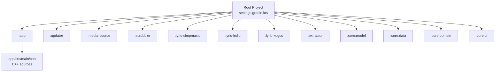
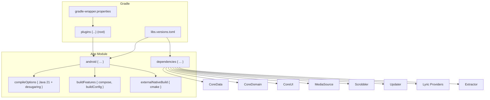
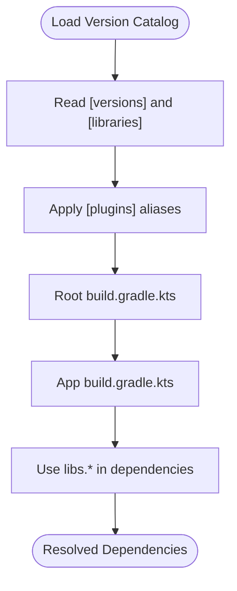
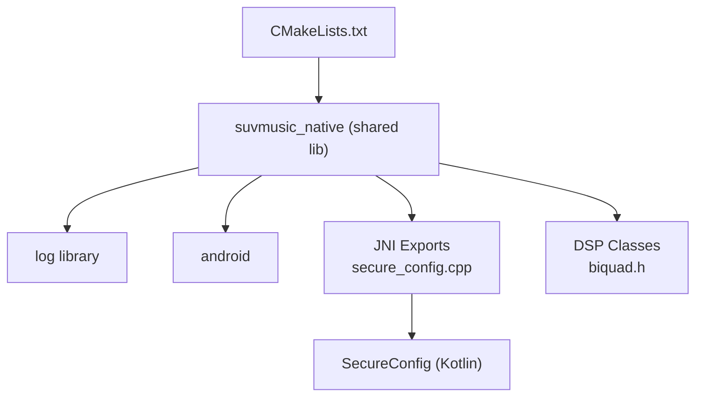
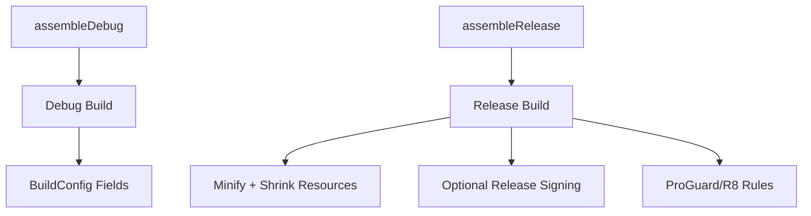
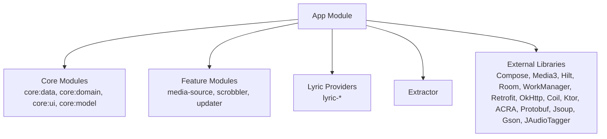

# Getting Started

<cite>
**Referenced Files in This Document**
- [README.md](file://README.md)
- [settings.gradle.kts](file://settings.gradle.kts)
- [build.gradle.kts](file://build.gradle.kts)
- [gradle.properties](file://gradle.properties)
- [gradle/libs.versions.toml](file://gradle/libs.versions.toml)
- [gradle/wrapper/gradle-wrapper.properties](file://gradle/wrapper/gradle-wrapper.properties)
- [app/build.gradle.kts](file://app/build.gradle.kts)
- [app/src/main/AndroidManifest.xml](file://app/src/main/AndroidManifest.xml)
- [app/src/main/cpp/CMakeLists.txt](file://app/src/main/cpp/CMakeLists.txt)
- [app/src/main/cpp/biquad.h](file://app/src/main/cpp/biquad.h)
- [app/src/main/cpp/secure_config.cpp](file://app/src/main/cpp/secure_config.cpp)
- [app/proguard-rules.pro](file://app/proguard-rules.pro)
</cite>

## Table of Contents
1. [Introduction](#introduction)
2. [Project Structure](#project-structure)
3. [Core Components](#core-components)
4. [Architecture Overview](#architecture-overview)
5. [Detailed Component Analysis](#detailed-component-analysis)
6. [Dependency Analysis](#dependency-analysis)
7. [Performance Considerations](#performance-considerations)
8. [Troubleshooting Guide](#troubleshooting-guide)
9. [Conclusion](#conclusion)
10. [Appendices](#appendices)

## Introduction
This guide helps you set up a complete development environment for SuvMusic and run your first build. It covers:
- Prerequisites and Android SDK/NDK requirements
- Environment configuration and dependency installation
- Gradle build system and module dependencies
- Version management via libs.versions.toml
- Step-by-step clone, configure, and build instructions
- Troubleshooting common setup issues
- IDE configuration recommendations for Android Studio and IntelliJ IDEA
- Debugging initial setup problems
- Both command-line and IDE-based workflows

SuvMusic is a high-fidelity music streaming app for Android with a Jetpack Compose UI, a native C++ audio engine, and modern Android libraries. The project uses Gradle with Kotlin DSL, Android Gradle Plugin 9.x, and a centralized version catalog.

**Section sources**
- [README.md:1-143](file://README.md#L1-L143)

## Project Structure
SuvMusic follows a multi-module Gradle project:
- Root build and settings define repositories, plugin management, and included modules
- app is the Android application module with native C++ sources
- Feature and core modules (e.g., media-source, scrobbler, updater, core:* modules) are included as Gradle subprojects
- Version catalog centralizes dependency versions and plugin ids

**Diagram sources**
- [settings.gradle.kts:18-30](file://settings.gradle.kts#L18-L30)
- [app/build.gradle.kts:254-265](file://app/build.gradle.kts#L254-L265)

**Section sources**
- [settings.gradle.kts:1-30](file://settings.gradle.kts#L1-L30)
- [app/build.gradle.kts:14-120](file://app/build.gradle.kts#L14-L120)

## Core Components
- Android Application Module (:app)
  - Compile SDK 36, min SDK 26, target SDK 36
  - Java 21 with desugaring enabled
  - Compose, Media3, Hilt, Room, WorkManager, Retrofit, OkHttp, Coil, Ktor, Protobuf, ACRA, Jsoup, Gson, JAudioTagger
  - Native C++ audio engine via CMake and NDK 27
- Version Catalog (gradle/libs.versions.toml)
  - Centralized versions for Android Gradle Plugin, Kotlin, Compose BOM, Media3, Hilt, Room, WorkManager, Protobuf, KSP, and plugins
- Build Scripts
  - Root build.gradle.kts applies common plugin aliases
  - app/build.gradle.kts configures compile options, signing, build types, compose, buildConfig, native build, and dependencies
- Manifest and Permissions
  - Network, storage, foreground services, notifications, wake lock, vibration, ringtone write, and TV features
  - Intent filters for YouTube deep links, content handling, custom scheme, and Android TV launcher

**Section sources**
- [app/build.gradle.kts:14-120](file://app/build.gradle.kts#L14-L120)
- [gradle/libs.versions.toml:1-162](file://gradle/libs.versions.toml#L1-L162)
- [app/src/main/AndroidManifest.xml:1-224](file://app/src/main/AndroidManifest.xml#L1-L224)

## Architecture Overview
The build system relies on Gradle with Kotlin DSL and a version catalog. The app module integrates:
- Android Gradle Plugin 9.x
- Kotlin 2.3 with Compose compiler plugin
- Hilt DI and KSP annotation processing
- Protobuf code generation
- Desugaring for Java 8+ APIs
- Native C++ compilation via CMake and NDK 27

**Diagram sources**
- [build.gradle.kts:2-10](file://build.gradle.kts#L2-L10)
- [gradle/libs.versions.toml:153-162](file://gradle/libs.versions.toml#L153-L162)
- [gradle/wrapper/gradle-wrapper.properties:1-9](file://gradle/wrapper/gradle-wrapper.properties#L1-L9)
- [app/build.gradle.kts:14-120](file://app/build.gradle.kts#L14-L120)
- [app/build.gradle.kts:140-265](file://app/build.gradle.kts#L140-L265)

## Detailed Component Analysis

### Android SDK and NDK Requirements
- Compile SDK: 36
- Target SDK: 36
- Min SDK: 26
- Java target: 21 (with desugaring)
- NDK: 27.0.12077973
- CMake: 3.22.1
- Android Gradle Plugin: 9.0.1
- Kotlin: 2.3.0

These requirements are defined in the app module’s Gradle configuration and the version catalog.

**Section sources**
- [app/build.gradle.kts:16-110](file://app/build.gradle.kts#L16-L110)
- [gradle/libs.versions.toml:1-38](file://gradle/libs.versions.toml#L1-L38)

### Version Catalog and Dependency Management
- Centralized versions and plugin ids in libs.versions.toml
- Plugins applied via alias in root build.gradle.kts
- App module consumes libraries and plugins from the catalog

**Diagram sources**
- [gradle/libs.versions.toml:1-162](file://gradle/libs.versions.toml#L1-L162)
- [build.gradle.kts:2-10](file://build.gradle.kts#L2-L10)
- [app/build.gradle.kts:140-265](file://app/build.gradle.kts#L140-L265)

**Section sources**
- [gradle/libs.versions.toml:1-162](file://gradle/libs.versions.toml#L1-L162)
- [build.gradle.kts:2-10](file://build.gradle.kts#L2-L10)
- [app/build.gradle.kts:140-265](file://app/build.gradle.kts#L140-L265)

### Native Audio Engine (C++ JNI Layer)
- CMakeLists defines a shared library with native sources
- Linking with log and android libraries
- 16 KB page size linker option for Android 15/16
- Header defines a biquad filter class used in DSP processing
- JNI functions expose secure key derivation logic

**Diagram sources**
- [app/src/main/cpp/CMakeLists.txt:1-23](file://app/src/main/cpp/CMakeLists.txt#L1-L23)
- [app/src/main/cpp/biquad.h:1-125](file://app/src/main/cpp/biquad.h#L1-L125)
- [app/src/main/cpp/secure_config.cpp:1-61](file://app/src/main/cpp/secure_config.cpp#L1-L61)

**Section sources**
- [app/src/main/cpp/CMakeLists.txt:1-23](file://app/src/main/cpp/CMakeLists.txt#L1-L23)
- [app/src/main/cpp/biquad.h:1-125](file://app/src/main/cpp/biquad.h#L1-L125)
- [app/src/main/cpp/secure_config.cpp:1-61](file://app/src/main/cpp/secure_config.cpp#L1-L61)

### Build Types, Signing, and ProGuard/R8
- Debug build type enables non-minified builds and adds a debug suffix
- Release build type enables minification and resource shrinking with custom rules
- Optional release signing via environment variables or keystore properties
- ProGuard/R8 rules keep required classes for NewPipe Extractor, OkHttp, Gson, Hilt, Compose, Media3, Coil, Ktor, Jsoup, JAudioTagger, Kotlinx Serialization, and Protobuf

**Diagram sources**
- [app/build.gradle.kts:70-89](file://app/build.gradle.kts#L70-L89)
- [app/proguard-rules.pro:1-108](file://app/proguard-rules.pro#L1-L108)

**Section sources**
- [app/build.gradle.kts:70-89](file://app/build.gradle.kts#L70-L89)
- [app/proguard-rules.pro:1-108](file://app/proguard-rules.pro#L1-L108)

### Permissions and Intent Filters
- Network, storage, foreground services, notifications, wake lock, vibration, ringtone write, and TV features
- Intent filters for YouTube deep links, content/audio handling, custom scheme, and Android TV launcher

**Section sources**
- [app/src/main/AndroidManifest.xml:1-224](file://app/src/main/AndroidManifest.xml#L1-L224)

## Dependency Analysis
The app module depends on:
- Core Android libraries (Core KTX, Lifecycle, Activity Compose, Material3)
- UI (Compose BOM, Glance widgets)
- Media (Media3 ExoPlayer, Media Router)
- Networking (OkHttp, Retrofit, Ktor)
- DI (Hilt, KSP)
- Persistence (Room, DataStore)
- Background work (WorkManager, Hilt Work)
- Image loading (Coil)
- Utilities (Jsoup, Gson, JAudioTagger, Kotlinx Serialization)
- Crash reporting (ACRA)
- Protobuf (lite)
- Internal modules (core, media-source, scrobbler, updater, lyric providers, extractor)

**Diagram sources**
- [app/build.gradle.kts:254-265](file://app/build.gradle.kts#L254-L265)

**Section sources**
- [app/build.gradle.kts:140-265](file://app/build.gradle.kts#L140-L265)

## Performance Considerations
- Desugaring for Java 8+ APIs reduces runtime overhead on older Android versions
- Resource configurations limit APK size by restricting supported languages
- ABI filters limit native libraries to arm64-v8a and armeabi-v7a
- Minification and resource shrinking in release builds reduce app size
- Native 16 KB page size linker option improves TLB efficiency on newer Android targets

[No sources needed since this section provides general guidance]

## Troubleshooting Guide
Common setup issues and resolutions:
- Gradle Wrapper Version Mismatch
  - Ensure Gradle Wrapper distribution matches the required version in gradle-wrapper.properties
  - Sync Gradle after changing wrapper settings
  - Section sources
    - [gradle/wrapper/gradle-wrapper.properties:1-9](file://gradle/wrapper/gradle-wrapper.properties#L1-L9)
- Android Gradle Plugin and Kotlin Version Compatibility
  - Align Android Gradle Plugin (9.0.1) and Kotlin (2.3.0) versions with libs.versions.toml
  - Section sources
    - [gradle/libs.versions.toml:1-38](file://gradle/libs.versions.toml#L1-L38)
- Java 21 and Desugaring
  - Verify Java source/target compatibility and enable coreLibraryDesugaring
  - Section sources
    - [app/build.gradle.kts:91-96](file://app/build.gradle.kts#L91-L96)
- NDK and CMake
  - Install NDK 27.0.12077973 and CMake 3.22.1 as required by the app module
  - Section sources
    - [app/build.gradle.kts:102-110](file://app/build.gradle.kts#L102-L110)
    - [app/src/main/cpp/CMakeLists.txt:1-23](file://app/src/main/cpp/CMakeLists.txt#L1-L23)
- Missing Last.fm API Keys
  - Provide LAST_FM_API_KEY and LAST_FM_SHARED_SECRET via local.properties or environment variables
  - BuildConfig fields are generated from these values
  - Section sources
    - [app/build.gradle.kts:35-51](file://app/build.gradle.kts#L35-L51)
- Release Signing
  - Configure keystore environment variables for CI or provide keystore properties for local releases
  - Section sources
    - [app/build.gradle.kts:53-68](file://app/build.gradle.kts#L53-L68)
- ProGuard/R8 Rules
  - Ensure rules keep required classes for NewPipe Extractor, OkHttp, Gson, Hilt, Compose, Media3, Coil, Ktor, Jsoup, JAudioTagger, Kotlinx Serialization, and Protobuf
  - Section sources
    - [app/proguard-rules.pro:1-108](file://app/proguard-rules.pro#L1-L108)
- AndroidX and Namespacing
  - Confirm AndroidX is enabled and non-transitive R class is enabled per gradle.properties
  - Section sources
    - [gradle.properties:17-27](file://gradle.properties#L17-L27)
- Repositories and Plugin Management
  - Ensure repositories and pluginManagement are configured in settings.gradle.kts and gradle.properties
  - Section sources
    - [settings.gradle.kts:1-16](file://settings.gradle.kts#L1-L16)
    - [gradle.properties:1-27](file://gradle.properties#L1-L27)

## Conclusion
You now have the essentials to set up SuvMusic locally. Ensure your environment matches the required Android SDK/NDK/CMake versions, align Gradle and Kotlin versions with the version catalog, and configure signing and API keys. Use the provided Gradle scripts and manifest entries as references for building and running the app.

[No sources needed since this section summarizes without analyzing specific files]

## Appendices

### Step-by-Step Setup and First Build
- Clone the repository
  - Use a Git client to clone the repository to your machine
- Install prerequisites
  - Android Studio with Android Gradle Plugin 9.x
  - JDK 21
  - Android SDK with platform 36
  - Android NDK 27.0.12077973
  - CMake 3.22.1
- Configure environment variables (optional)
  - For Last.fm integration, set LAST_FM_API_KEY and LAST_FM_SHARED_SECRET in local.properties or environment variables
  - For release signing, set keystore-related environment variables
- Open the project in Android Studio
  - Select “Open an existing Android Studio project” and choose the repository root
  - Allow Android Studio to sync Gradle and import modules
- Configure Gradle
  - Ensure Gradle Wrapper distribution matches gradle-wrapper.properties
  - Confirm pluginManagement and repositories in settings.gradle.kts
- Build and run
  - Choose a connected Android device/emulator (min SDK 26) or use Android 14+ AVD
  - Run the app module
- Command-line build
  - From the repository root, run ./gradlew assembleDebug or ./gradlew assembleRelease
  - For clean builds, use ./gradlew clean assembleDebug

**Section sources**
- [gradle/wrapper/gradle-wrapper.properties:1-9](file://gradle/wrapper/gradle-wrapper.properties#L1-L9)
- [settings.gradle.kts:1-16](file://settings.gradle.kts#L1-L16)
- [app/build.gradle.kts:35-51](file://app/build.gradle.kts#L35-L51)
- [app/build.gradle.kts:53-68](file://app/build.gradle.kts#L53-L68)

### IDE Configuration Recommendations
- Android Studio
  - Use Android Studio Flamingo or later with Kotlin 2.3 and AGP 9.x support
  - Enable “Use legacy Kotlin DSL for protobuf plugin” if prompted due to AGP 9.0 compatibility
  - Set Gradle JDK to 21
- IntelliJ IDEA
  - Install Android Studio plugin and Android support
  - Configure Gradle project to use the wrapper and correct JDK
- ProGuard/R8
  - Keep the provided rules intact during development and testing
- Native Development
  - Ensure CMake and NDK paths are configured in Android Studio preferences

[No sources needed since this section provides general guidance]