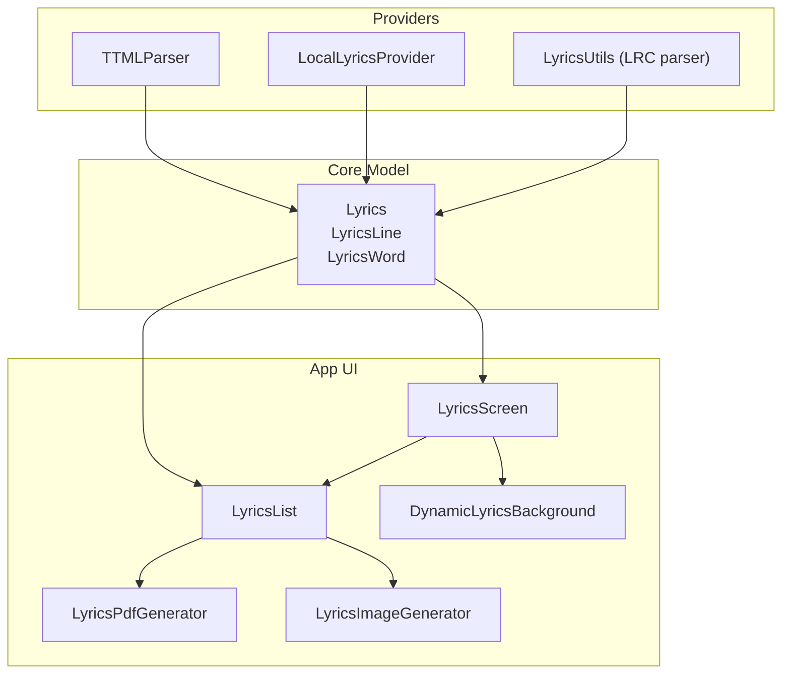
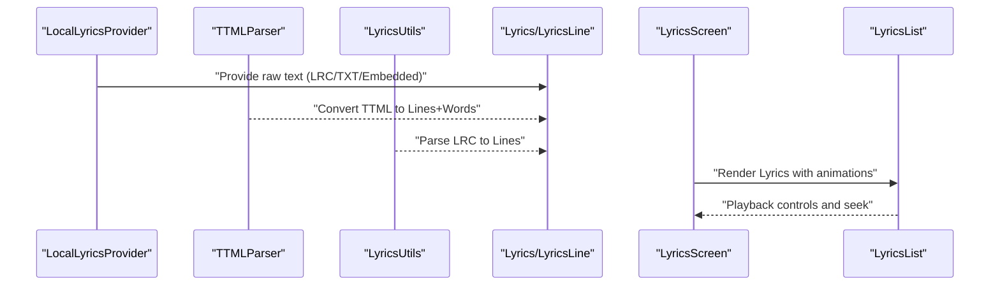
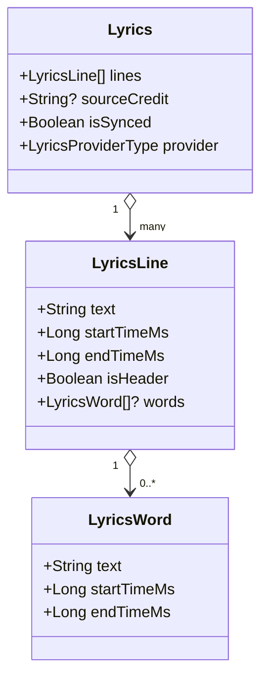
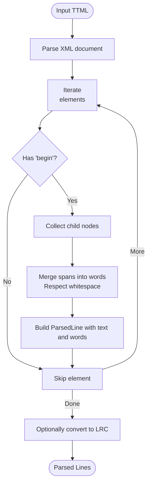
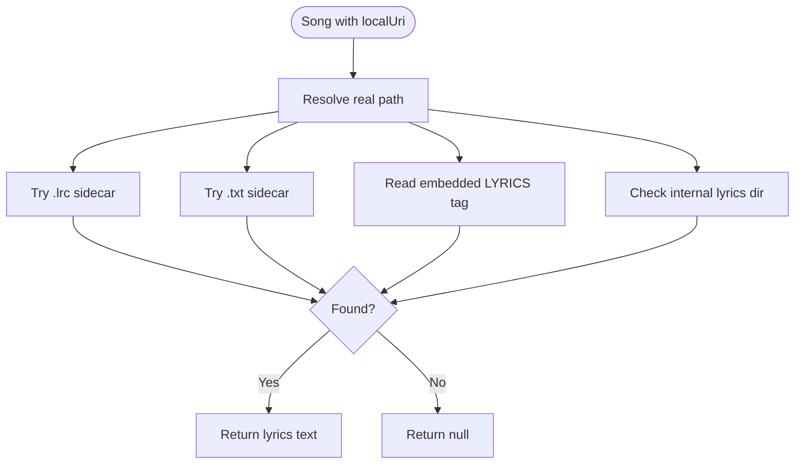
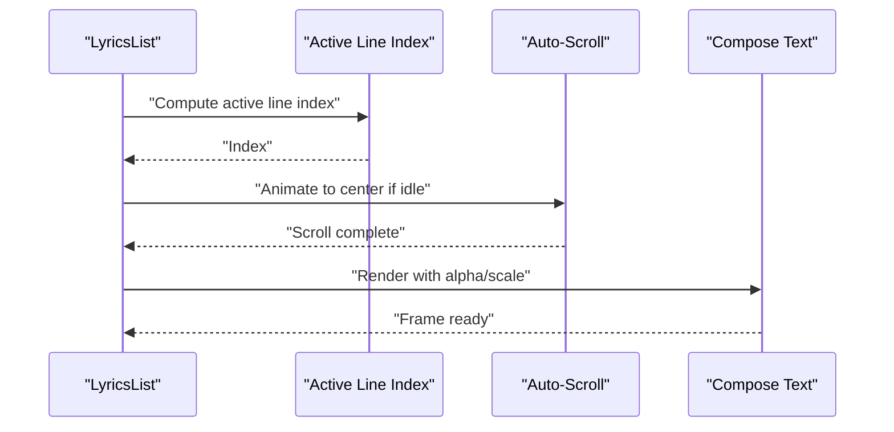
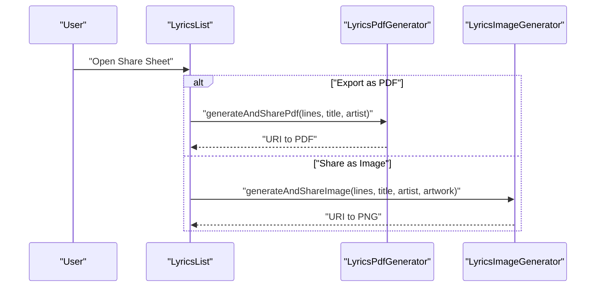
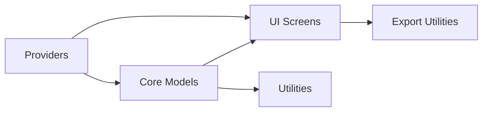

# Lyric Parsing and Display

<cite>
**Referenced Files in This Document**
- [Lyrics.kt](file://core/model/src/main/java/com/suvojeet/suvmusic/core/model/Lyrics.kt)
- [Lyrics.kt](file://media-source/src/main/java/com/suvojeet/suvmusic/providers/lyrics/Lyrics.kt)
- [LyricsModels.kt](file://app/src/main/java/com/suvojeet/suvmusic/data/repository/lyrics/LyricsModels.kt)
- [LyricsModels.kt](file://media-source/src/main/java/com/suvojeet/suvmusic/providers/lyrics/LyricsModels.kt)
- [TTMLParser.kt](file://media-source/src/main/java/com/suvojeet/suvmusic/providers/lyrics/TTMLParser.kt)
- [LyricsUtils.kt](file://app/src/main/java/com/suvojeet/suvmusic/util/LyricsUtils.kt)
- [LyricsScreen.kt](file://app/src/main/java/com/suvojeet/suvmusic/ui/screens/LyricsScreen.kt)
- [LyricsList.kt](file://app/src/main/java/com/suvojeet/suvmusic/ui/screens/LyricsScreen.kt)
- [LyricsPdfGenerator.kt](file://app/src/main/java/com/suvojeet/suvmusic/util/LyricsPdfGenerator.kt)
- [LyricsImageGenerator.kt](file://app/src/main/java/com/suvojeet/suvmusic/ui/utils/LyricsImageGenerator.kt)
- [LocalLyricsProvider.kt](file://app/src/main/java/com/suvojeet/suvmusic/providers/lyrics/LocalLyricsProvider.kt)
- [TTMLParserTest.kt](file://app/src/test/java/com/suvojeet/suvmusic/data/repository/lyrics/TTMLParserTest.kt)
- [DynamicLyricsBackground.kt](file://app/src/main/java/com/suvojeet/suvmusic/ui/components/DynamicLyricsBackground.kt)
- [LyricsAnimationType.kt](file://media-source/src/main/java/com/suvojeet/suvmusic/providers/lyrics/LyricsAnimationType.kt)
- [LyricsTextPosition.kt](file://media-source/src/main/java/com/suvojeet/suvmusic/providers/lyrics/LyricsTextPosition.kt)
</cite>

## Table of Contents
1. [Introduction](#introduction)
2. [Project Structure](#project-structure)
3. [Core Components](#core-components)
4. [Architecture Overview](#architecture-overview)
5. [Detailed Component Analysis](#detailed-component-analysis)
6. [Dependency Analysis](#dependency-analysis)
7. [Performance Considerations](#performance-considerations)
8. [Troubleshooting Guide](#troubleshooting-guide)
9. [Conclusion](#conclusion)
10. [Appendices](#appendices)

## Introduction
This document explains the lyric parsing and display system in SuvMusic. It covers the data models for lyrics, supported lyric formats (LRC and TTML), parsing algorithms, synchronized rendering, animation effects, export capabilities (PDF and image), customization options, and integration with the player UI. It also includes examples of parsing workflows, timing correction mechanisms, and display optimization techniques.

## Project Structure
The lyric system spans three layers:
- Core models define the canonical data structures used across the app.
- Providers encapsulate parsing and format-specific logic.
- UI composes the lyric screen, rendering synchronized lyrics with animations and controls.



**Diagram sources**
- [Lyrics.kt:1-34](file://core/model/src/main/java/com/suvojeet/suvmusic/core/model/Lyrics.kt#L1-L34)
- [TTMLParser.kt:1-214](file://media-source/src/main/java/com/suvojeet/suvmusic/providers/lyrics/TTMLParser.kt#L1-L214)
- [LocalLyricsProvider.kt:1-99](file://app/src/main/java/com/suvojeet/suvmusic/providers/lyrics/LocalLyricsProvider.kt#L1-L99)
- [LyricsUtils.kt:1-77](file://app/src/main/java/com/suvojeet/suvmusic/util/LyricsUtils.kt#L1-L77)
- [LyricsScreen.kt:1-1307](file://app/src/main/java/com/suvojeet/suvmusic/ui/screens/LyricsScreen.kt#L1-L1307)
- [LyricsPdfGenerator.kt:1-220](file://app/src/main/java/com/suvojeet/suvmusic/util/LyricsPdfGenerator.kt#L1-L220)
- [LyricsImageGenerator.kt:1-221](file://app/src/main/java/com/suvojeet/suvmusic/ui/utils/LyricsImageGenerator.kt#L1-L221)

**Section sources**
- [Lyrics.kt:1-34](file://core/model/src/main/java/com/suvojeet/suvmusic/core/model/Lyrics.kt#L1-L34)
- [Lyrics.kt:1-34](file://media-source/src/main/java/com/suvojeet/suvmusic/providers/lyrics/Lyrics.kt#L1-L34)

## Core Components
- Lyrics: Root model containing a list of lines, optional source credit, synchronization flag, and provider type.
- LyricsLine: Represents a single lyric line with start/end timestamps, optional word-level timings, and a header flag.
- LyricsWord: Represents a word with precise start/end timestamps for word-level animations.
- LyricsProviderType: Enumerates available providers (auto, LRCLIB, JioSaavn, YouTube captions, Better Lyrics, SimpMusic, Kugou, Local).
- LyricsAnimationType: Rendering modes (line-by-line vs word-by-word).
- LyricsTextPosition: Horizontal alignment options (center, left, right).

These models are defined consistently in both core and providers modules to ensure cross-module compatibility.

**Section sources**
- [Lyrics.kt:1-34](file://core/model/src/main/java/com/suvojeet/suvmusic/core/model/Lyrics.kt#L1-L34)
- [Lyrics.kt:1-34](file://media-source/src/main/java/com/suvojeet/suvmusic/providers/lyrics/Lyrics.kt#L1-L34)
- [LyricsAnimationType.kt:1-7](file://media-source/src/main/java/com/suvojeet/suvmusic/providers/lyrics/LyricsAnimationType.kt#L1-L7)
- [LyricsTextPosition.kt:1-8](file://media-source/src/main/java/com/suvojeet/suvmusic/providers/lyrics/LyricsTextPosition.kt#L1-L8)

## Architecture Overview
The lyric pipeline integrates providers, parsers, and UI components:



**Diagram sources**
- [LocalLyricsProvider.kt:1-99](file://app/src/main/java/com/suvojeet/suvmusic/providers/lyrics/LocalLyricsProvider.kt#L1-L99)
- [TTMLParser.kt:1-214](file://media-source/src/main/java/com/suvojeet/suvmusic/providers/lyrics/TTMLParser.kt#L1-L214)
- [LyricsUtils.kt:1-77](file://app/src/main/java/com/suvojeet/suvmusic/util/LyricsUtils.kt#L1-L77)
- [LyricsScreen.kt:1-1307](file://app/src/main/java/com/suvojeet/suvmusic/ui/screens/LyricsScreen.kt#L1-L1307)

## Detailed Component Analysis

### Data Models: Lyrics, LyricsLine, LyricsWord
- Lyrics: Holds lines, optional source credit, synchronization flag, and provider type.
- LyricsLine: Supports line-level timing and optional word-level timings.
- LyricsWord: Provides per-word timing for granular animations.



**Diagram sources**
- [Lyrics.kt:1-34](file://core/model/src/main/java/com/suvojeet/suvmusic/core/model/Lyrics.kt#L1-L34)
- [Lyrics.kt:1-34](file://media-source/src/main/java/com/suvojeet/suvmusic/providers/lyrics/Lyrics.kt#L1-L34)

**Section sources**
- [Lyrics.kt:1-34](file://core/model/src/main/java/com/suvojeet/suvmusic/core/model/Lyrics.kt#L1-L34)
- [Lyrics.kt:1-34](file://media-source/src/main/java/com/suvojeet/suvmusic/providers/lyrics/Lyrics.kt#L1-L34)

### LRC Parsing and Synchronization
- LyricsUtils parses LRC content into LyricsLine objects, extracting millisecond-precision timestamps.
- Rich sync metadata (word-level timings) is parsed from lines prefixed with a special marker and attached to the preceding line’s word list.
- The parser ignores standard metadata tags (e.g., [ar:Artist]) and plain text lines that are not timed.

```mermaid
flowchart TD
Start(["Input LRC"]) --> Split["Split into lines"]
Split --> Loop{"For each line"}
Loop --> |Matches [mm:ss.xx]text| ParseTime["Extract mm:ss.xx<br/>Compute ms"]
ParseTime --> AddLine["Create LyricsLine"]
Loop --> |Matches <words>| ParseWords["Parse word:sec pairs"]
ParseWords --> Attach["Attach to previous line's words"]
Loop --> |Plain text| IsHeader{"Is header/tag?"}
IsHeader --> |No| AddPlain["Add as plain line"]
IsHeader --> |Yes| Skip["Skip"]
AddLine --> Next["Next line"]
Attach --> Next
AddPlain --> Next
Skip --> Next
Next --> |More lines| Loop
Next --> |Done| Sort["Sort by startTimeMs"]
Sort --> End(["Output List<LyricsLine>"])
```

**Diagram sources**
- [LyricsUtils.kt:1-77](file://app/src/main/java/com/suvojeet/suvmusic/util/LyricsUtils.kt#L1-L77)

**Section sources**
- [LyricsUtils.kt:1-77](file://app/src/main/java/com/suvojeet/suvmusic/util/LyricsUtils.kt#L1-L77)

### TTML Parsing and Synchronization
- TTMLParser converts TTML XML to a list of ParsedLine entries with optional ParsedWord lists.
- It extracts per-span timing and merges adjacent spans into words, preserving whitespace boundaries.
- The parser supports multiple time formats (MM:SS, HH:MM:SS, numeric seconds) and safely defaults invalid values.



**Diagram sources**
- [TTMLParser.kt:1-214](file://media-source/src/main/java/com/suvojeet/suvmusic/providers/lyrics/TTMLParser.kt#L1-L214)

**Section sources**
- [TTMLParser.kt:1-214](file://media-source/src/main/java/com/suvojeet/suvmusic/providers/lyrics/TTMLParser.kt#L1-L214)
- [TTMLParserTest.kt:1-83](file://app/src/test/java/com/suvojeet/suvmusic/data/repository/lyrics/TTMLParserTest.kt#L1-L83)

### Local Lyrics Provider
- Reads lyrics from sidecar files (.lrc/.txt) or embedded tags in audio files.
- Falls back to internal app storage for manually added lyrics.
- Resolves real file paths from content URIs when needed.



**Diagram sources**
- [LocalLyricsProvider.kt:1-99](file://app/src/main/java/com/suvojeet/suvmusic/providers/lyrics/LocalLyricsProvider.kt#L1-L99)

**Section sources**
- [LocalLyricsProvider.kt:1-99](file://app/src/main/java/com/suvojeet/suvmusic/providers/lyrics/LocalLyricsProvider.kt#L1-L99)

### Synchronized Lyric Rendering and Animations
- LyricsList renders lyrics with smooth animations:
  - Auto-centering when playback is active and idle.
  - Opacity and scaling transitions for active lines/words.
  - Click-to-seek for synced lyrics.
  - Word-by-word rendering when enabled and available.
- Alignment and typography are configurable (font size, line spacing, text position).
- Selection mode allows sharing selected lines as an image.



**Diagram sources**
- [LyricsScreen.kt:945-1307](file://app/src/main/java/com/suvojeet/suvmusic/ui/screens/LyricsScreen.kt#L945-L1307)

**Section sources**
- [LyricsScreen.kt:945-1307](file://app/src/main/java/com/suvojeet/suvmusic/ui/screens/LyricsScreen.kt#L945-L1307)
- [LyricsAnimationType.kt:1-7](file://media-source/src/main/java/com/suvojeet/suvmusic/providers/lyrics/LyricsAnimationType.kt#L1-L7)
- [LyricsTextPosition.kt:1-8](file://media-source/src/main/java/com/suvojeet/suvmusic/providers/lyrics/LyricsTextPosition.kt#L1-L8)

### Lyric Display Components and Background
- DynamicLyricsBackground adapts visuals to detected mood/style:
  - Subtle blur/saturation adjustments.
  - Infinite-scale animations for energetic moments.
  - Gradient overlays aligned with theme.

**Section sources**
- [DynamicLyricsBackground.kt:1-106](file://app/src/main/java/com/suvojeet/suvmusic/ui/components/DynamicLyricsBackground.kt#L1-L106)

### Export Functionality: PDF and Image Generation
- PDF export:
  - Generates a paginated PDF with styled header/footer and centered body text.
  - Uses StaticLayout for accurate line breaking and pagination.
- Image export:
  - Creates a vertical image (story-friendly aspect ratio) with optional artwork background.
  - Saves to cache and shares via FileProvider.



**Diagram sources**
- [LyricsScreen.kt:800-886](file://app/src/main/java/com/suvojeet/suvmusic/ui/screens/LyricsScreen.kt#L800-L886)
- [LyricsPdfGenerator.kt:1-220](file://app/src/main/java/com/suvojeet/suvmusic/util/LyricsPdfGenerator.kt#L1-L220)
- [LyricsImageGenerator.kt:1-221](file://app/src/main/java/com/suvojeet/suvmusic/ui/utils/LyricsImageGenerator.kt#L1-L221)

**Section sources**
- [LyricsPdfGenerator.kt:1-220](file://app/src/main/java/com/suvojeet/suvmusic/util/LyricsPdfGenerator.kt#L1-L220)
- [LyricsImageGenerator.kt:1-221](file://app/src/main/java/com/suvojeet/suvmusic/ui/utils/LyricsImageGenerator.kt#L1-L221)

### Customization Options
- Appearance:
  - Font size and line spacing sliders.
  - Text alignment (center/left/right).
- Behavior:
  - Screen-on toggle.
  - Sync offset adjustment (±0.5s increments).
- Provider selection:
  - Choose lyrics source/provider with enable/disable flags.

**Section sources**
- [LyricsScreen.kt:497-791](file://app/src/main/java/com/suvojeet/suvmusic/ui/screens/LyricsScreen.kt#L497-L791)

## Dependency Analysis
- Core models are consumed by UI and utilities.
- Providers depend on core models and produce Lyrics instances.
- UI depends on providers and models for rendering and interactions.
- Export utilities depend on UI-provided data and Android APIs.



**Diagram sources**
- [Lyrics.kt:1-34](file://core/model/src/main/java/com/suvojeet/suvmusic/core/model/Lyrics.kt#L1-L34)
- [LyricsScreen.kt:1-1307](file://app/src/main/java/com/suvojeet/suvmusic/ui/screens/LyricsScreen.kt#L1-L1307)
- [TTMLParser.kt:1-214](file://media-source/src/main/java/com/suvojeet/suvmusic/providers/lyrics/TTMLParser.kt#L1-L214)
- [LyricsUtils.kt:1-77](file://app/src/main/java/com/suvojeet/suvmusic/util/LyricsUtils.kt#L1-L77)
- [LyricsPdfGenerator.kt:1-220](file://app/src/main/java/com/suvojeet/suvmusic/util/LyricsPdfGenerator.kt#L1-L220)
- [LyricsImageGenerator.kt:1-221](file://app/src/main/java/com/suvojeet/suvmusic/ui/utils/LyricsImageGenerator.kt#L1-L221)

**Section sources**
- [Lyrics.kt:1-34](file://core/model/src/main/java/com/suvojeet/suvmusic/core/model/Lyrics.kt#L1-L34)
- [LyricsScreen.kt:1-1307](file://app/src/main/java/com/suvojeet/suvmusic/ui/screens/LyricsScreen.kt#L1-L1307)

## Performance Considerations
- Lazy rendering: LyricsList uses LazyColumn to render only visible items.
- Minimal recompositions: Animations use state hoisting and remember to reduce recomposition overhead.
- Pagination: PDF generator computes line heights and pages in advance to avoid repeated layout passes.
- Background drawing: Image generator uses StaticLayout for efficient text measurement and drawing.

## Troubleshooting Guide
- TTML parsing errors:
  - Invalid or missing time attributes cause graceful fallbacks; empty lines are skipped.
  - Malformed time strings default to zero without crashing.
- LRC parsing:
  - Non-timed lines and metadata tags are ignored; only lines with valid timestamps are included.
- Export failures:
  - PDF/image generation catches exceptions and returns null; callers should handle null and notify users.

**Section sources**
- [TTMLParser.kt:106-112](file://media-source/src/main/java/com/suvojeet/suvmusic/providers/lyrics/TTMLParser.kt#L106-L112)
- [LyricsUtils.kt:45-51](file://app/src/main/java/com/suvojeet/suvmusic/util/LyricsUtils.kt#L45-L51)
- [LyricsPdfGenerator.kt:186-189](file://app/src/main/java/com/suvojeet/suvmusic/util/LyricsPdfGenerator.kt#L186-L189)
- [LyricsImageGenerator.kt:55-58](file://app/src/main/java/com/suvojeet/suvmusic/ui/utils/LyricsImageGenerator.kt#L55-L58)

## Conclusion
SuvMusic’s lyric system combines robust parsing (LRC and TTML), flexible data models, and expressive UI rendering. Users benefit from synchronized lyrics with customizable animations, alignment, and typography, plus powerful export options for sharing lyrics as PDFs or images. The architecture cleanly separates concerns across core models, providers, and UI, enabling maintainability and extensibility.

## Appendices

### Example Parsing Workflows
- LRC parsing:
  - Input: LRC text with [mm:ss.xx] lines and optional rich-sync markers.
  - Output: Sorted list of LyricsLine with optional word-level timings.
- TTML parsing:
  - Input: TTML XML with <p> blocks and optional <span> words.
  - Output: List of ParsedLine with merged words and per-line start times.

**Section sources**
- [LyricsUtils.kt:12-55](file://app/src/main/java/com/suvojeet/suvmusic/util/LyricsUtils.kt#L12-L55)
- [TTMLParser.kt:32-112](file://media-source/src/main/java/com/suvojeet/suvmusic/providers/lyrics/TTMLParser.kt#L32-L112)

### Timing Correction Mechanisms
- Sync offset:
  - UI maintains a millisecond offset applied to current time and seek targets.
  - Users can adjust in 500ms increments and reset to zero.

**Section sources**
- [LyricsScreen.kt:345-353](file://app/src/main/java/com/suvojeet/suvmusic/ui/screens/LyricsScreen.kt#L345-L353)
- [LyricsScreen.kt:648-697](file://app/src/main/java/com/suvojeet/suvmusic/ui/screens/LyricsScreen.kt#L648-L697)

### Display Optimization Techniques
- Auto-centering:
  - After a period of inactivity, the list smoothly scrolls to center the active line.
- Selection mode:
  - Enables multi-select with a share overlay, limiting selections to five for usability.
- Typography:
  - Dynamic font size and line spacing with spring-based animations for smooth transitions.

**Section sources**
- [LyricsScreen.kt:1033-1058](file://app/src/main/java/com/suvojeet/suvmusic/ui/screens/LyricsScreen.kt#L1033-L1058)
- [LyricsScreen.kt:1004-1013](file://app/src/main/java/com/suvojeet/suvmusic/ui/screens/LyricsScreen.kt#L1004-L1013)
- [LyricsScreen.kt:1144-1148](file://app/src/main/java/com/suvojeet/suvmusic/ui/screens/LyricsScreen.kt#L1144-L1148)