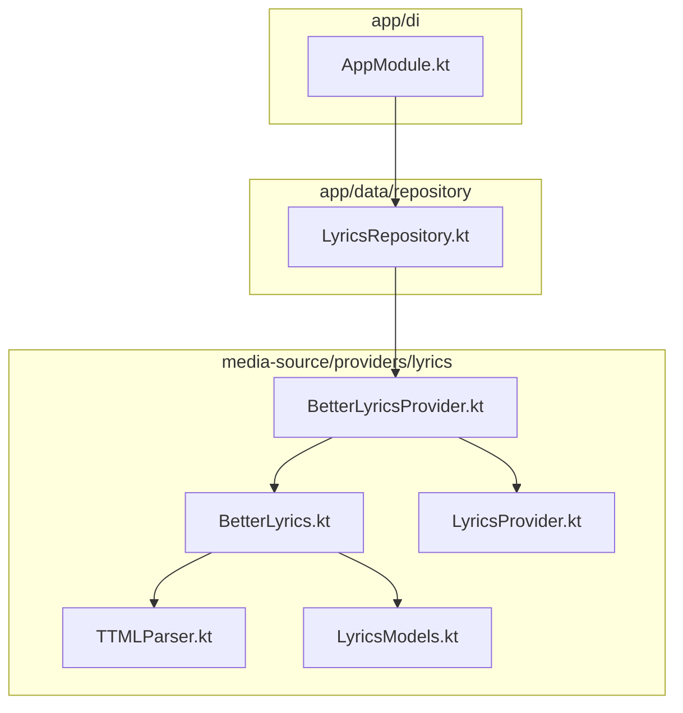
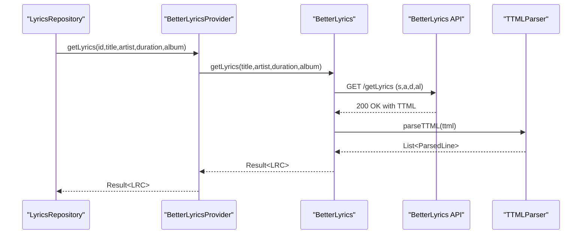
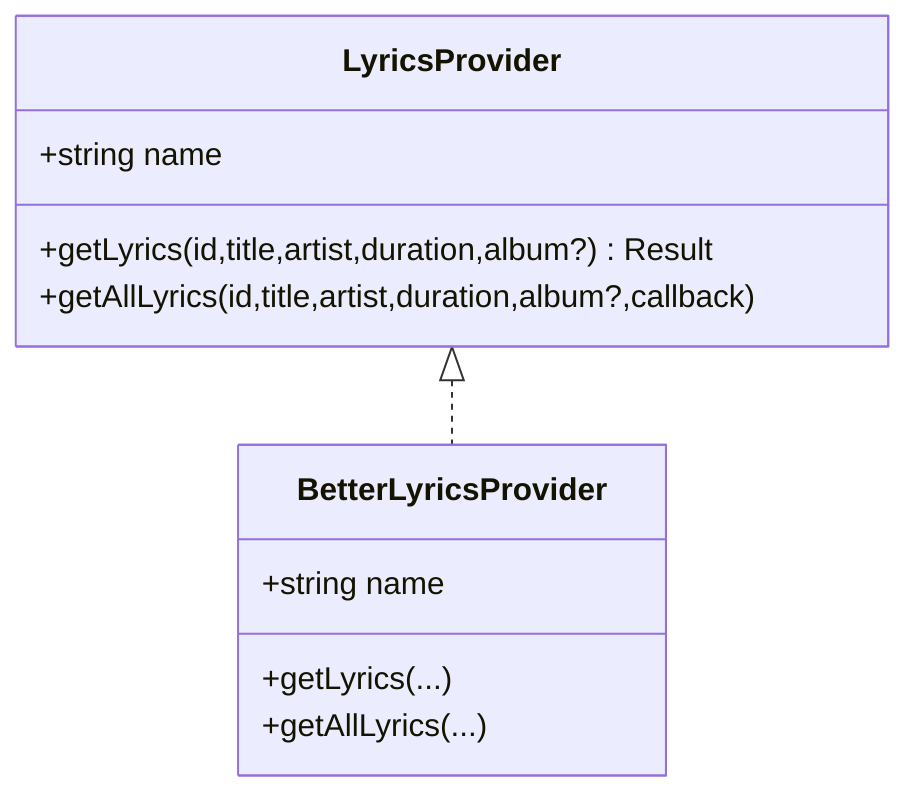
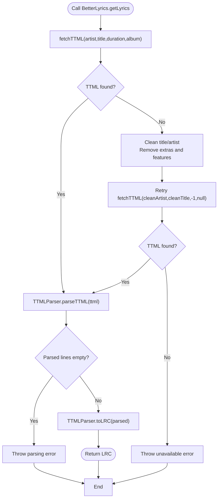
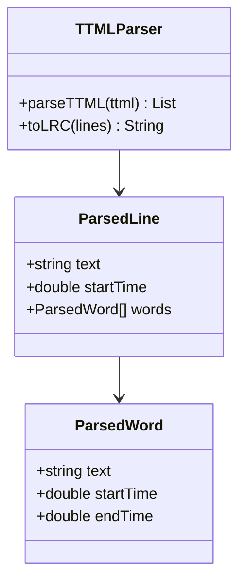
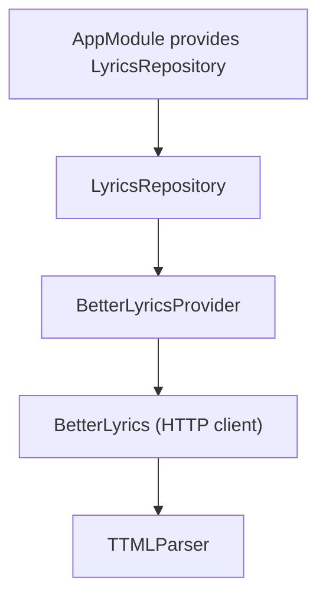
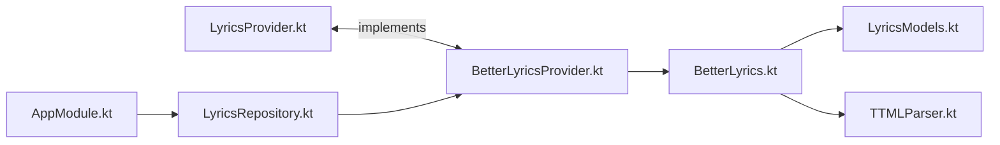

# BetterLyrics Provider

<cite>
**Referenced Files in This Document**
- [BetterLyricsProvider.kt](file://media-source/src/main/java/com/suvojeet/suvmusic/providers/lyrics/BetterLyricsProvider.kt)
- [LyricsProvider.kt](file://media-source/src/main/java/com/suvojeet/suvmusic/providers/lyrics/LyricsProvider.kt)
- [BetterLyrics.kt](file://media-source/src/main/java/com/suvojeet/suvmusic/providers/lyrics/BetterLyrics.kt)
- [TTMLParser.kt](file://media-source/src/main/java/com/suvojeet/suvmusic/providers/lyrics/TTMLParser.kt)
- [LyricsModels.kt](file://media-source/src/main/java/com/suvojeet/suvmusic/providers/lyrics/LyricsModels.kt)
- [LyricsRepository.kt](file://app/src/main/java/com/suvojeet/suvmusic/data/repository/LyricsRepository.kt)
- [AppModule.kt](file://app/src/main/java/com/suvojeet/suvmusic/di/AppModule.kt)
</cite>

## Table of Contents
1. [Introduction](#introduction)
2. [Project Structure](#project-structure)
3. [Core Components](#core-components)
4. [Architecture Overview](#architecture-overview)
5. [Detailed Component Analysis](#detailed-component-analysis)
6. [Dependency Analysis](#dependency-analysis)
7. [Performance Considerations](#performance-considerations)
8. [Troubleshooting Guide](#troubleshooting-guide)
9. [Conclusion](#conclusion)

## Introduction
This document describes the BetterLyrics lyric provider implementation used by the application. It focuses on the BetterLyricsProvider class, its integration with the LyricsProvider interface, the underlying BetterLyrics API client, and the TTML-to-LRC conversion pipeline. It also documents the search and matching strategy, fallback behavior, error handling, timeouts, and how the provider participates in the broader lyrics retrieval architecture.

## Project Structure
BetterLyrics lives in the media-source module under the providers/lyrics package. It integrates with the app’s repository layer and dependency injection setup.

**Diagram sources**
- [BetterLyricsProvider.kt:1-32](file://media-source/src/main/java/com/suvojeet/suvmusic/providers/lyrics/BetterLyricsProvider.kt#L1-L32)
- [BetterLyrics.kt:1-121](file://media-source/src/main/java/com/suvojeet/suvmusic/providers/lyrics/BetterLyrics.kt#L1-L121)
- [LyricsProvider.kt:1-50](file://media-source/src/main/java/com/suvojeet/suvmusic/providers/lyrics/LyricsProvider.kt#L1-L50)
- [TTMLParser.kt:1-214](file://media-source/src/main/java/com/suvojeet/suvmusic/providers/lyrics/TTMLParser.kt#L1-L214)
- [LyricsModels.kt:1-22](file://media-source/src/main/java/com/suvojeet/suvmusic/providers/lyrics/LyricsModels.kt#L1-L22)
- [LyricsRepository.kt:1-310](file://app/src/main/java/com/suvojeet/suvmusic/data/repository/LyricsRepository.kt#L1-L310)
- [AppModule.kt:113-137](file://app/src/main/java/com/suvojeet/suvmusic/di/AppModule.kt#L113-L137)

**Section sources**
- [BetterLyricsProvider.kt:1-32](file://media-source/src/main/java/com/suvojeet/suvmusic/providers/lyrics/BetterLyricsProvider.kt#L1-L32)
- [BetterLyrics.kt:1-121](file://media-source/src/main/java/com/suvojeet/suvmusic/providers/lyrics/BetterLyrics.kt#L1-L121)
- [LyricsProvider.kt:1-50](file://media-source/src/main/java/com/suvojeet/suvmusic/providers/lyrics/LyricsProvider.kt#L1-L50)
- [TTMLParser.kt:1-214](file://media-source/src/main/java/com/suvojeet/suvmusic/providers/lyrics/TTMLParser.kt#L1-L214)
- [LyricsModels.kt:1-22](file://media-source/src/main/java/com/suvojeet/suvmusic/providers/lyrics/LyricsModels.kt#L1-L22)
- [LyricsRepository.kt:1-310](file://app/src/main/java/com/suvojeet/suvmusic/data/repository/LyricsRepository.kt#L1-L310)
- [AppModule.kt:113-137](file://app/src/main/java/com/suvojeet/suvmusic/di/AppModule.kt#L113-L137)

## Core Components
- BetterLyricsProvider: Thin wrapper implementing the LyricsProvider interface for the BetterLyrics backend.
- BetterLyrics: Ktor-based HTTP client that queries the BetterLyrics endpoint, applies search heuristics, and converts TTML to LRC.
- TTMLParser: Parses Apple Music TTML XML into structured timed lines and optionally word-level timings, then emits LRC.
- LyricsProvider: Interface defining the provider contract for fetching lyrics and enumerating variants.
- LyricsRepository: Orchestrates provider selection, caching, and fallback logic across providers.

**Section sources**
- [BetterLyricsProvider.kt:9-31](file://media-source/src/main/java/com/suvojeet/suvmusic/providers/lyrics/BetterLyricsProvider.kt#L9-L31)
- [BetterLyrics.kt:19-121](file://media-source/src/main/java/com/suvojeet/suvmusic/providers/lyrics/BetterLyrics.kt#L19-L121)
- [TTMLParser.kt:11-214](file://media-source/src/main/java/com/suvojeet/suvmusic/providers/lyrics/TTMLParser.kt#L11-L214)
- [LyricsProvider.kt:7-49](file://media-source/src/main/java/com/suvojeet/suvmusic/providers/lyrics/LyricsProvider.kt#L7-L49)
- [LyricsRepository.kt:26-184](file://app/src/main/java/com/suvojeet/suvmusic/data/repository/LyricsRepository.kt#L26-L184)

## Architecture Overview
BetterLyricsProvider delegates to BetterLyrics, which performs:
- HTTP GET to the BetterLyrics endpoint with parameters for title, artist, duration, and album.
- TTML response parsing and conversion to LRC.
- Heuristic fallbacks when exact matches fail.

**Diagram sources**
- [LyricsRepository.kt:108-141](file://app/src/main/java/com/suvojeet/suvmusic/data/repository/LyricsRepository.kt#L108-L141)
- [BetterLyricsProvider.kt:13-19](file://media-source/src/main/java/com/suvojeet/suvmusic/providers/lyrics/BetterLyricsProvider.kt#L13-L19)
- [BetterLyrics.kt:45-106](file://media-source/src/main/java/com/suvojeet/suvmusic/providers/lyrics/BetterLyrics.kt#L45-L106)
- [TTMLParser.kt:32-112](file://media-source/src/main/java/com/suvojeet/suvmusic/providers/lyrics/TTMLParser.kt#L32-L112)

## Detailed Component Analysis

### BetterLyricsProvider
- Implements LyricsProvider and forwards requests to BetterLyrics.
- Exposes a human-readable provider name.
- Supports enumerating all variants via the default getAllLyrics implementation.

**Diagram sources**
- [LyricsProvider.kt:7-49](file://media-source/src/main/java/com/suvojeet/suvmusic/providers/lyrics/LyricsProvider.kt#L7-L49)
- [BetterLyricsProvider.kt:9-31](file://media-source/src/main/java/com/suvojeet/suvmusic/providers/lyrics/BetterLyricsProvider.kt#L9-L31)

**Section sources**
- [BetterLyricsProvider.kt:9-31](file://media-source/src/main/java/com/suvojeet/suvmusic/providers/lyrics/BetterLyricsProvider.kt#L9-L31)
- [LyricsProvider.kt:7-49](file://media-source/src/main/java/com/suvojeet/suvmusic/providers/lyrics/LyricsProvider.kt#L7-L49)

### BetterLyrics API Client
- Base URL: https://lyrics-api.boidu.dev
- Endpoint: GET /getLyrics
- Request parameters:
  - s: song title
  - a: artist
  - d: duration (seconds), optional
  - al: album, optional
- Response: JSON containing a ttml field (XML as a string).
- Timeout configuration:
  - Request timeout: 15 seconds
  - Connect timeout: 10 seconds
  - Socket timeout: 15 seconds
- Parsing:
  - On success, extracts ttml and passes to TTMLParser.
  - Emits an error if no lyrics or parsing fails.

**Diagram sources**
- [BetterLyrics.kt:45-106](file://media-source/src/main/java/com/suvojeet/suvmusic/providers/lyrics/BetterLyrics.kt#L45-L106)
- [TTMLParser.kt:32-185](file://media-source/src/main/java/com/suvojeet/suvmusic/providers/lyrics/TTMLParser.kt#L32-L185)

**Section sources**
- [BetterLyrics.kt:19-121](file://media-source/src/main/java/com/suvojeet/suvmusic/providers/lyrics/BetterLyrics.kt#L19-L121)
- [LyricsModels.kt:5-8](file://media-source/src/main/java/com/suvojeet/suvmusic/providers/lyrics/LyricsModels.kt#L5-L8)

### TTMLParser
- Parses Apple Music TTML into a list of timed lines.
- Supports word-level timing extraction when available.
- Converts to LRC with millisecond-precision timestamps and optional word metadata.

**Diagram sources**
- [TTMLParser.kt:11-185](file://media-source/src/main/java/com/suvojeet/suvmusic/providers/lyrics/TTMLParser.kt#L11-L185)

**Section sources**
- [TTMLParser.kt:32-214](file://media-source/src/main/java/com/suvojeet/suvmusic/providers/lyrics/TTMLParser.kt#L32-L214)

### Integration with LyricsRepository and DI
- LyricsRepository orders providers based on user preferences and availability, and caches results.
- BetterLyricsProvider participates in AUTO mode when enabled.
- Dependency injection wires the provider into the repository.

**Diagram sources**
- [AppModule.kt:113-137](file://app/src/main/java/com/suvojeet/suvmusic/di/AppModule.kt#L113-L137)
- [LyricsRepository.kt:26-75](file://app/src/main/java/com/suvojeet/suvmusic/data/repository/LyricsRepository.kt#L26-L75)
- [BetterLyricsProvider.kt:9-31](file://media-source/src/main/java/com/suvojeet/suvmusic/providers/lyrics/BetterLyricsProvider.kt#L9-L31)
- [BetterLyrics.kt:19-121](file://media-source/src/main/java/com/suvojeet/suvmusic/providers/lyrics/BetterLyrics.kt#L19-L121)
- [TTMLParser.kt:11-185](file://media-source/src/main/java/com/suvojeet/suvmusic/providers/lyrics/TTMLParser.kt#L11-L185)

**Section sources**
- [LyricsRepository.kt:51-184](file://app/src/main/java/com/suvojeet/suvmusic/data/repository/LyricsRepository.kt#L51-L184)
- [AppModule.kt:113-137](file://app/src/main/java/com/suvojeet/suvmusic/di/AppModule.kt#L113-L137)

## Dependency Analysis
- BetterLyricsProvider depends on:
  - BetterLyrics (HTTP client and parsing)
  - LyricsProvider (contract)
- BetterLyrics depends on:
  - Ktor client (HTTP)
  - TTMLParser (conversion)
  - kotlinx.serialization (JSON)
- TTMLParser depends on:
  - Java XML DOM (org.w3c.dom)
- LyricsRepository composes providers and manages ordering and caching.

**Diagram sources**
- [LyricsProvider.kt:7-49](file://media-source/src/main/java/com/suvojeet/suvmusic/providers/lyrics/LyricsProvider.kt#L7-L49)
- [BetterLyricsProvider.kt:9-31](file://media-source/src/main/java/com/suvojeet/suvmusic/providers/lyrics/BetterLyricsProvider.kt#L9-L31)
- [BetterLyrics.kt:19-121](file://media-source/src/main/java/com/suvojeet/suvmusic/providers/lyrics/BetterLyrics.kt#L19-L121)
- [LyricsModels.kt:5-8](file://media-source/src/main/java/com/suvojeet/suvmusic/providers/lyrics/LyricsModels.kt#L5-L8)
- [TTMLParser.kt:11-185](file://media-source/src/main/java/com/suvojeet/suvmusic/providers/lyrics/TTMLParser.kt#L11-L185)
- [LyricsRepository.kt:26-75](file://app/src/main/java/com/suvojeet/suvmusic/data/repository/LyricsRepository.kt#L26-L75)
- [AppModule.kt:113-137](file://app/src/main/java/com/suvojeet/suvmusic/di/AppModule.kt#L113-L137)

**Section sources**
- [BetterLyricsProvider.kt:9-31](file://media-source/src/main/java/com/suvojeet/suvmusic/providers/lyrics/BetterLyricsProvider.kt#L9-L31)
- [BetterLyrics.kt:19-121](file://media-source/src/main/java/com/suvojeet/suvmusic/providers/lyrics/BetterLyrics.kt#L19-L121)
- [TTMLParser.kt:11-185](file://media-source/src/main/java/com/suvojeet/suvmusic/providers/lyrics/TTMLParser.kt#L11-L185)
- [LyricsRepository.kt:26-75](file://app/src/main/java/com/suvojeet/suvmusic/data/repository/LyricsRepository.kt#L26-L75)
- [AppModule.kt:113-137](file://app/src/main/java/com/suvojeet/suvmusic/di/AppModule.kt#L113-L137)

## Performance Considerations
- Timeouts: Requests are bounded to avoid long hangs.
- Caching: LyricsRepository caches results per provider and AUTO mode to reduce repeated network calls.
- Matching strategy: Two-phase search reduces retries by attempting a strict match first, then a relaxed match with cleaned tokens.
- Concurrency: Provider selection runs sequentially in AUTO mode; consider parallelizing future improvements while preserving user preference ordering.

[No sources needed since this section provides general guidance]

## Troubleshooting Guide
Common error scenarios and handling:
- No lyrics returned:
  - Exact match yields no TTML → falls back to relaxed cleaning and retry.
  - If still no lyrics, throws an “unavailable” error.
- Parsing failures:
  - Empty parsed lines after TTML parsing → throws a parsing error.
- Network errors:
  - Non-OK HTTP status → treated as unavailable.
  - Timeouts configured at 15 seconds request and socket timeouts; adjust if needed.
- Provider disabled:
  - BetterLyricsProvider.isEnabled checks user settings; disabled providers are excluded from AUTO mode.

Operational tips:
- Verify network connectivity and endpoint reachability.
- Confirm that title/artist are reasonably normalized; the provider cleans common suffixes and features.
- Check logs for parsing exceptions if LRC is blank despite HTTP success.

**Section sources**
- [BetterLyrics.kt:74-106](file://media-source/src/main/java/com/suvojeet/suvmusic/providers/lyrics/BetterLyrics.kt#L74-L106)
- [TTMLParser.kt:106-112](file://media-source/src/main/java/com/suvojeet/suvmusic/providers/lyrics/TTMLParser.kt#L106-L112)
- [LyricsRepository.kt:108-141](file://app/src/main/java/com/suvojeet/suvmusic/data/repository/LyricsRepository.kt#L108-L141)

## Conclusion
BetterLyricsProvider offers a robust, two-stage search strategy backed by a dedicated API and precise TTML-to-LRC conversion. Its integration into LyricsRepository ensures it participates in a layered fallback system, with caching and user-configurable enablement. While the provider targets synced lyrics from Apple Music-aligned sources, performance and reliability depend on network conditions and the availability of TTML content for the queried metadata.