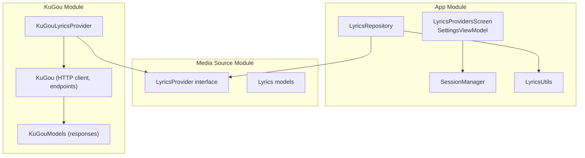
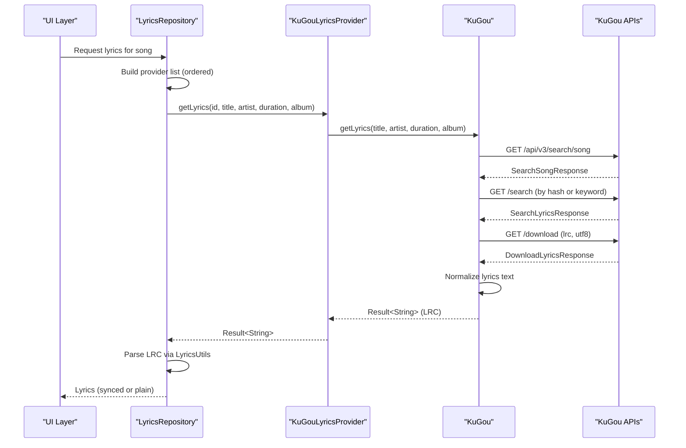
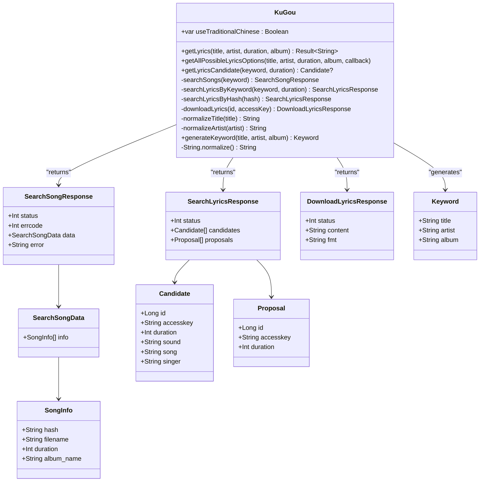
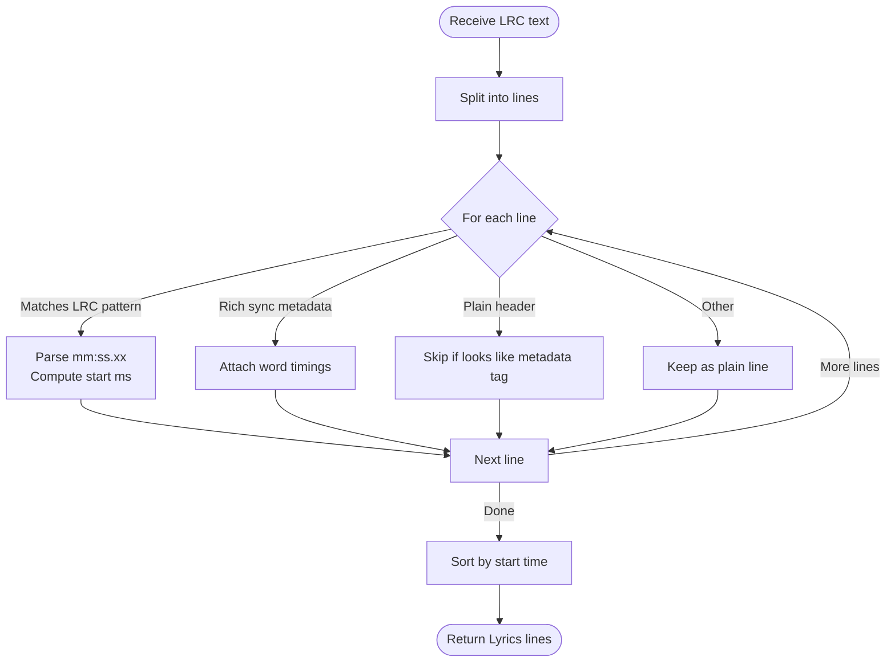
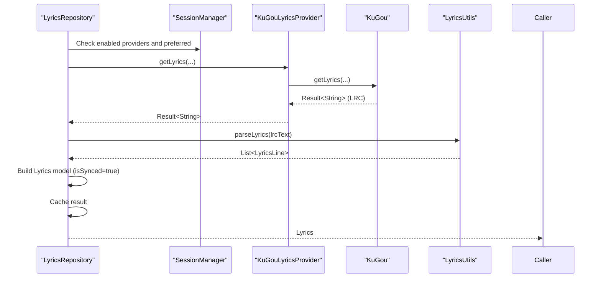
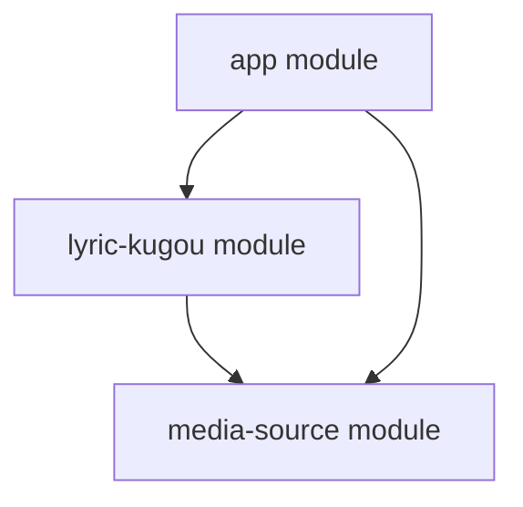

# KuGou Lyrics Provider

<cite>
**Referenced Files in This Document**
- [KuGouLyricsProvider.kt](file://lyric-kugou/src/main/java/com/suvojeet/suvmusic/kugou/KuGouLyricsProvider.kt)
- [KuGou.kt](file://lyric-kugou/src/main/java/com/suvojeet/suvmusic/kugou/KuGou.kt)
- [KuGouModels.kt](file://lyric-kugou/src/main/java/com/suvojeet/suvmusic/kugou/KuGouModels.kt)
- [LyricsProvider.kt](file://media-source/src/main/java/com/suvojeet/suvmusic/providers/lyrics/LyricsProvider.kt)
- [Lyrics.kt](file://media-source/src/main/java/com/suvojeet/suvmusic/providers/lyrics/Lyrics.kt)
- [LyricsRepository.kt](file://app/src/main/java/com/suvojeet/suvmusic/data/repository/LyricsRepository.kt)
- [SessionManager.kt](file://app/src/main/java/com/suvojeet/suvmusic/data/SessionManager.kt)
- [LyricsUtils.kt](file://app/src/main/java/com/suvojeet/suvmusic/util/LyricsUtils.kt)
- [LyricsProvidersScreen.kt](file://app/src/main/java/com/suvojeet/suvmusic/ui/screens/LyricsProvidersScreen.kt)
- [SettingsViewModel.kt](file://app/src/main/java/com/suvojeet/suvmusic/ui/viewmodel/SettingsViewModel.kt)
- [build.gradle.kts](file://lyric-kugou/build.gradle.kts)
</cite>

## Table of Contents
1. [Introduction](#introduction)
2. [Project Structure](#project-structure)
3. [Core Components](#core-components)
4. [Architecture Overview](#architecture-overview)
5. [Detailed Component Analysis](#detailed-component-analysis)
6. [Dependency Analysis](#dependency-analysis)
7. [Performance Considerations](#performance-considerations)
8. [Troubleshooting Guide](#troubleshooting-guide)
9. [Conclusion](#conclusion)

## Introduction
This document explains the KuGou lyrics provider implementation in the SuvMusic project. It covers the KuGouLyricsProvider class, its integration with the LyricsProvider interface, the KuGou API endpoints used, normalization and parsing of lyrics, and how the provider integrates into the application’s lyrics fetching pipeline. It also documents the provider’s capabilities, limitations, and configuration options exposed to users.

## Project Structure
The KuGou lyrics provider is implemented as a separate module that depends on the shared media-source module for the LyricsProvider interface and data models. The provider exposes a thin wrapper around the KuGou object, which encapsulates HTTP calls, response parsing, and text normalization.

**Diagram sources**
- [LyricsRepository.kt:27-38](file://app/src/main/java/com/suvojeet/suvmusic/data/repository/LyricsRepository.kt#L27-L38)
- [LyricsProvider.kt:7-11](file://media-source/src/main/java/com/suvojeet/suvmusic/providers/lyrics/LyricsProvider.kt#L7-L11)
- [Lyrics.kt:3-8](file://media-source/src/main/java/com/suvojeet/suvmusic/providers/lyrics/Lyrics.kt#L3-L8)
- [KuGouLyricsProvider.kt:10-22](file://lyric-kugou/src/main/java/com/suvojeet/suvmusic/kugou/KuGouLyricsProvider.kt#L10-L22)
- [KuGou.kt:42-82](file://lyric-kugou/src/main/java/com/suvojeet/suvmusic/kugou/KuGou.kt#L42-L82)
- [KuGouModels.kt:5-62](file://lyric-kugou/src/main/java/com/suvojeet/suvmusic/kugou/KuGouModels.kt#L5-L62)

**Section sources**
- [LyricsRepository.kt:27-38](file://app/src/main/java/com/suvojeet/suvmusic/data/repository/LyricsRepository.kt#L27-L38)
- [KuGouLyricsProvider.kt:10-22](file://lyric-kugou/src/main/java/com/suvojeet/suvmusic/kugou/KuGouLyricsProvider.kt#L10-L22)
- [KuGou.kt:42-82](file://lyric-kugou/src/main/java/com/suvojeet/suvmusic/kugou/KuGou.kt#L42-L82)
- [KuGouModels.kt:5-62](file://lyric-kugou/src/main/java/com/suvojeet/suvmusic/kugou/KuGouModels.kt#L5-L62)
- [LyricsProvider.kt:7-11](file://media-source/src/main/java/com/suvojeet/suvmusic/providers/lyrics/LyricsProvider.kt#L7-L11)
- [Lyrics.kt:3-8](file://media-source/src/main/java/com/suvojeet/suvmusic/providers/lyrics/Lyrics.kt#L3-L8)

## Core Components
- KuGouLyricsProvider: Implements the LyricsProvider interface and delegates to the KuGou object for fetching lyrics.
- KuGou: Encapsulates HTTP client configuration, endpoint calls, and response normalization.
- KuGouModels: Defines typed models for KuGou API responses.
- LyricsProvider interface and Lyrics models: Define the contract and data structures for lyrics providers and parsed lyrics.

Key responsibilities:
- KuGouLyricsProvider: Exposes provider name and delegates getLyrics and getAllLyrics to KuGou.
- KuGou: Builds search queries, calls KuGou endpoints, downloads lyrics, and normalizes output.
- LyricsRepository: Orchestrates provider selection, caching, and parsing into the application’s Lyrics model.

**Section sources**
- [KuGouLyricsProvider.kt:10-34](file://lyric-kugou/src/main/java/com/suvojeet/suvmusic/kugou/KuGouLyricsProvider.kt#L10-L34)
- [KuGou.kt:42-189](file://lyric-kugou/src/main/java/com/suvojeet/suvmusic/kugou/KuGou.kt#L42-L189)
- [KuGouModels.kt:5-62](file://lyric-kugou/src/main/java/com/suvojeet/suvmusic/kugou/KuGouModels.kt#L5-L62)
- [LyricsProvider.kt:7-49](file://media-source/src/main/java/com/suvojeet/suvmusic/providers/lyrics/LyricsProvider.kt#L7-L49)
- [Lyrics.kt:3-34](file://media-source/src/main/java/com/suvojeet/suvmusic/providers/lyrics/Lyrics.kt#L3-L34)

## Architecture Overview
The KuGou provider participates in the application’s lyrics resolution pipeline. When lyrics are requested, LyricsRepository decides whether to use KuGou based on user preferences and provider availability. It then calls the provider, parses the returned LRC-formatted text, and caches the result.

**Diagram sources**
- [LyricsRepository.kt:77-184](file://app/src/main/java/com/suvojeet/suvmusic/data/repository/LyricsRepository.kt#L77-L184)
- [KuGouLyricsProvider.kt:14-22](file://lyric-kugou/src/main/java/com/suvojeet/suvmusic/kugou/KuGouLyricsProvider.kt#L14-L22)
- [KuGou.kt:84-144](file://lyric-kugou/src/main/java/com/suvojeet/suvmusic/kugou/KuGou.kt#L84-L144)
- [LyricsUtils.kt:12-55](file://app/src/main/java/com/suvojeet/suvmusic/util/LyricsUtils.kt#L12-L55)

## Detailed Component Analysis

### KuGouLyricsProvider
- Purpose: Thin adapter implementing LyricsProvider for KuGou.
- Behavior:
  - Provides a human-readable provider name.
  - Delegates getLyrics to KuGou.getLyrics.
  - Delegates getAllLyrics to KuGou.getAllPossibleLyricsOptions.

Integration notes:
- Injected by DI and used by LyricsRepository alongside other providers.

**Section sources**
- [KuGouLyricsProvider.kt:10-34](file://lyric-kugou/src/main/java/com/suvojeet/suvmusic/kugou/KuGouLyricsProvider.kt#L10-L34)

### KuGou (HTTP Client and Endpoints)
- HTTP client configuration:
  - Uses Ktor with ContentNegotiation for JSON and HTML/Plain text.
  - Expect success responses.
- Endpoints used:
  - Song search: https://mobileservice.kugou.com/api/v3/search/song
  - Lyrics search: https://lyrics.kugou.com/search
  - Lyrics download: https://lyrics.kugou.com/download
- Request parameters:
  - Song search: version, plat, pagesize, showtype, keyword (title - artist [+ album]).
  - Lyrics search: ver=1, man=yes, client=pc, duration (optional), keyword or hash.
  - Lyrics download: fmt=lrc, charset=utf8, client=pc, ver=1, id, accesskey.
- Response models:
  - SearchSongResponse: status, errcode, data(info: List<SongInfo>), error.
  - SearchLyricsResponse: status, candidates(List<Candidate>), proposals.
  - DownloadLyricsResponse: status, content (base64-encoded LRC), fmt.
- Normalization:
  - Removes unwanted metadata lines and cleans up titles/artists.
  - Filters lines to keep only those matching the LRC timing pattern.
- Duration tolerance:
  - Accepts songs within a fixed tolerance when duration is provided.

**Diagram sources**
- [KuGou.kt:42-189](file://lyric-kugou/src/main/java/com/suvojeet/suvmusic/kugou/KuGou.kt#L42-L189)
- [KuGouModels.kt:5-62](file://lyric-kugou/src/main/java/com/suvojeet/suvmusic/kugou/KuGouModels.kt#L5-L62)

**Section sources**
- [KuGou.kt:18-33](file://lyric-kugou/src/main/java/com/suvojeet/suvmusic/kugou/KuGou.kt#L18-L33)
- [KuGou.kt:84-144](file://lyric-kugou/src/main/java/com/suvojeet/suvmusic/kugou/KuGou.kt#L84-L144)
- [KuGouModels.kt:5-62](file://lyric-kugou/src/main/java/com/suvojeet/suvmusic/kugou/KuGouModels.kt#L5-L62)

### Lyrics Parsing and Normalization
- LRC parsing:
  - Extracts timestamped lines and converts to milliseconds.
  - Supports rich sync metadata appended after the line.
- KuGou normalization:
  - Removes bracketed metadata lines.
  - Strips various bracket forms from titles and artists.
  - Filters out non-timed lines and retains only valid LRC entries.

**Diagram sources**
- [LyricsUtils.kt:12-55](file://app/src/main/java/com/suvojeet/suvmusic/util/LyricsUtils.kt#L12-L55)
- [KuGou.kt:159-182](file://lyric-kugou/src/main/java/com/suvojeet/suvmusic/kugou/KuGou.kt#L159-L182)

**Section sources**
- [LyricsUtils.kt:12-55](file://app/src/main/java/com/suvojeet/suvmusic/util/LyricsUtils.kt#L12-L55)
- [KuGou.kt:146-182](file://lyric-kugou/src/main/java/com/suvojeet/suvmusic/kugou/KuGou.kt#L146-L182)

### Integration with Application
- Provider registration:
  - Injected into LyricsRepository and included in the ordered provider list when enabled.
- Provider ordering:
  - Respects user preference and enabled providers.
- Caching:
  - Results are cached by song ID and provider type.
- Parsing:
  - Returned LRC is parsed into the application’s Lyrics model with isSynced flag derived from presence of timestamps.

**Diagram sources**
- [LyricsRepository.kt:51-75](file://app/src/main/java/com/suvojeet/suvmusic/data/repository/LyricsRepository.kt#L51-L75)
- [LyricsRepository.kt:109-141](file://app/src/main/java/com/suvojeet/suvmusic/data/repository/LyricsRepository.kt#L109-L141)
- [LyricsRepository.kt:303-305](file://app/src/main/java/com/suvojeet/suvmusic/data/repository/LyricsRepository.kt#L303-L305)
- [KuGouLyricsProvider.kt:14-22](file://lyric-kugou/src/main/java/com/suvojeet/suvmusic/kugou/KuGouLyricsProvider.kt#L14-L22)
- [KuGou.kt:45-52](file://lyric-kugou/src/main/java/com/suvojeet/suvmusic/kugou/KuGou.kt#L45-L52)
- [LyricsUtils.kt:12-55](file://app/src/main/java/com/suvojeet/suvmusic/util/LyricsUtils.kt#L12-L55)

**Section sources**
- [LyricsRepository.kt:51-75](file://app/src/main/java/com/suvojeet/suvmusic/data/repository/LyricsRepository.kt#L51-L75)
- [LyricsRepository.kt:109-141](file://app/src/main/java/com/suvojeet/suvmusic/data/repository/LyricsRepository.kt#L109-L141)
- [LyricsRepository.kt:303-305](file://app/src/main/java/com/suvojeet/suvmusic/data/repository/LyricsRepository.kt#L303-L305)

## Dependency Analysis
- External libraries:
  - Ktor client (core, CIO, content negotiation, Kotlinx serialization).
  - Kotlinx Serialization for JSON.
- Internal dependencies:
  - media-source module for LyricsProvider and Lyrics models.
  - app module for SessionManager, LyricsRepository, and UI settings.

**Diagram sources**
- [build.gradle.kts:40-60](file://lyric-kugou/build.gradle.kts#L40-L60)

**Section sources**
- [build.gradle.kts:40-60](file://lyric-kugou/build.gradle.kts#L40-L60)

## Performance Considerations
- Network latency:
  - Two network calls are made per search: song search and lyrics search/download.
- Duration matching:
  - When duration is provided, the provider tolerates a small difference to improve matching accuracy.
- Caching:
  - LyricsRepository caches results to reduce repeated network calls.
- Parsing cost:
  - LRC parsing is linear in the number of lines; normalization filters reduce input size.

[No sources needed since this section provides general guidance]

## Troubleshooting Guide
Common issues and resolutions:
- No lyrics found:
  - Verify that the song metadata (title, artist, album) is accurate.
  - Try enabling/disabling duration matching by passing -1 for duration.
- Incorrect or partial lyrics:
  - The provider returns the first candidate; use getAllLyrics to enumerate alternatives.
  - Consider switching to another provider if available.
- Network errors:
  - KuGou endpoints may be rate-limited or temporarily unavailable; retry later.
- Parsing anomalies:
  - LRC normalization removes metadata lines; ensure the returned text is not empty.
- Provider disabled:
  - Ensure KuGou is enabled in the lyrics settings screen.

**Section sources**
- [KuGou.kt:72-82](file://lyric-kugou/src/main/java/com/suvojeet/suvmusic/kugou/KuGou.kt#L72-L82)
- [KuGou.kt:54-70](file://lyric-kugou/src/main/java/com/suvojeet/suvmusic/kugou/KuGou.kt#L54-L70)
- [SessionManager.kt:849-860](file://app/src/main/java/com/suvojeet/suvmusic/data/SessionManager.kt#L849-L860)
- [LyricsProvidersScreen.kt:132-139](file://app/src/main/java/com/suvojeet/suvmusic/ui/screens/LyricsProvidersScreen.kt#L132-L139)

## Conclusion
The KuGou lyrics provider offers a robust integration into SuvMusic’s lyrics pipeline. It leverages KuGou’s extensive lyrics database, normalizes and parses results into a unified format, and integrates seamlessly with the application’s provider orchestration and caching. Users can enable/disable the provider and select it as preferred, while the system handles fallbacks and retries automatically.