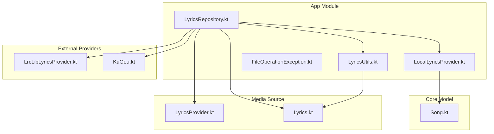
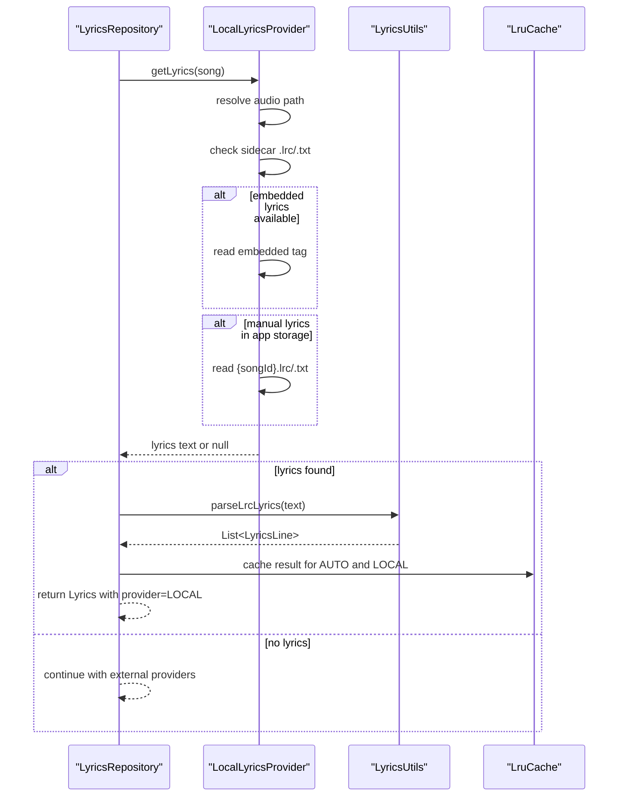
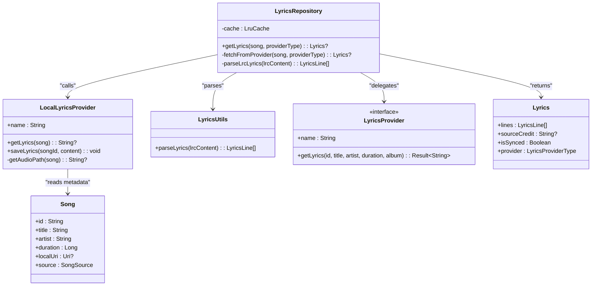

# Local Lyrics Provider

<cite>
**Referenced Files in This Document**
- [LocalLyricsProvider.kt](file://app/src/main/java/com/suvojeet/suvmusic/providers/lyrics/LocalLyricsProvider.kt)
- [LyricsRepository.kt](file://app/src/main/java/com/suvojeet/suvmusic/data/repository/LyricsRepository.kt)
- [LyricsUtils.kt](file://app/src/main/java/com/suvojeet/suvmusic/util/LyricsUtils.kt)
- [Lyrics.kt](file://media-source/src/main/java/com/suvojeet/suvmusic/providers/lyrics/Lyrics.kt)
- [LyricsProvider.kt](file://media-source/src/main/java/com/suvojeet/suvmusic/providers/lyrics/LyricsProvider.kt)
- [Song.kt](file://core/model/src/main/java/com/suvojeet/suvmusic/core/model/Song.kt)
- [LrcLibLyricsProvider.kt](file://lyric-lrclib/src/main/java/com/suvojeet/suvmusic/lrclib/LrcLibLyricsProvider.kt)
- [KuGou.kt](file://lyric-kugou/src/main/java/com/suvojeet/suvmusic/kugou/KuGou.kt)
- [FileOperationException.kt](file://app/src/main/java/com/suvojeet/suvmusic/util/FileOperationException.kt)
</cite>

## Table of Contents
1. [Introduction](#introduction)
2. [Project Structure](#project-structure)
3. [Core Components](#core-components)
4. [Architecture Overview](#architecture-overview)
5. [Detailed Component Analysis](#detailed-component-analysis)
6. [Dependency Analysis](#dependency-analysis)
7. [Performance Considerations](#performance-considerations)
8. [Troubleshooting Guide](#troubleshooting-guide)
9. [Conclusion](#conclusion)

## Introduction
This document explains the Local Lyrics Provider implementation responsible for retrieving lyrics from local audio files stored on device. It covers how the provider resolves local audio paths, searches for sidecar lyrics files, extracts embedded lyrics from audio tags, and falls back to manually saved lyrics in the app’s internal storage. It also documents the provider’s integration with the broader lyrics resolution system, caching behavior, and error handling.

## Project Structure
The Local Lyrics Provider resides in the app module under the providers/lyrics package and integrates with the LyricsRepository to participate in the lyrics resolution pipeline. The provider reads from the filesystem and uses the jaudiotagger library to extract embedded lyrics from audio files.

**Diagram sources**
- [LocalLyricsProvider.kt:1-99](file://app/src/main/java/com/suvojeet/suvmusic/providers/lyrics/LocalLyricsProvider.kt#L1-L99)
- [LyricsRepository.kt:1-310](file://app/src/main/java/com/suvojeet/suvmusic/data/repository/LyricsRepository.kt#L1-L310)
- [LyricsUtils.kt:1-77](file://app/src/main/java/com/suvojeet/suvmusic/util/LyricsUtils.kt#L1-L77)
- [Song.kt:1-129](file://core/model/src/main/java/com/suvojeet/suvmusic/core/model/Song.kt#L1-L129)
- [LyricsProvider.kt:1-50](file://media-source/src/main/java/com/suvojeet/suvmusic/providers/lyrics/LyricsProvider.kt#L1-L50)
- [Lyrics.kt:1-34](file://media-source/src/main/java/com/suvojeet/suvmusic/providers/lyrics/Lyrics.kt#L1-L34)
- [LrcLibLyricsProvider.kt:1-37](file://lyric-lrclib/src/main/java/com/suvojeet/suvmusic/lrclib/LrcLibLyricsProvider.kt#L1-L37)
- [KuGou.kt:44-72](file://lyric-kugou/src/main/java/com/suvojeet/suvmusic/kugou/KuGou.kt#L44-L72)

**Section sources**
- [LocalLyricsProvider.kt:1-99](file://app/src/main/java/com/suvojeet/suvmusic/providers/lyrics/LocalLyricsProvider.kt#L1-L99)
- [LyricsRepository.kt:1-310](file://app/src/main/java/com/suvojeet/suvmusic/data/repository/LyricsRepository.kt#L1-L310)

## Core Components
- LocalLyricsProvider: Reads local audio files and attempts to locate lyrics via sidecar files, embedded tags, or app-managed storage.
- LyricsRepository: Orchestrates lyrics resolution, prioritizing local lyrics and caching results.
- LyricsUtils: Parses LRC-formatted lyrics into structured lines with timing and optional word-level synchronization.
- Song: Provides metadata and identifiers used to locate local files and manage lyrics retrieval.
- Lyrics/LyricsProvider: Defines the contract and data structures for lyrics providers.

**Section sources**
- [LocalLyricsProvider.kt:14-99](file://app/src/main/java/com/suvojeet/suvmusic/providers/lyrics/LocalLyricsProvider.kt#L14-L99)
- [LyricsRepository.kt:27-310](file://app/src/main/java/com/suvojeet/suvmusic/data/repository/LyricsRepository.kt#L27-L310)
- [LyricsUtils.kt:6-77](file://app/src/main/java/com/suvojeet/suvmusic/util/LyricsUtils.kt#L6-L77)
- [Song.kt:9-29](file://core/model/src/main/java/com/suvojeet/suvmusic/core/model/Song.kt#L9-L29)
- [Lyrics.kt:3-34](file://media-source/src/main/java/com/suvojeet/suvmusic/providers/lyrics/Lyrics.kt#L3-L34)
- [LyricsProvider.kt:7-28](file://media-source/src/main/java/com/suvojeet/suvmusic/providers/lyrics/LyricsProvider.kt#L7-L28)

## Architecture Overview
The Local Lyrics Provider participates in the lyrics resolution pipeline managed by LyricsRepository. The provider is invoked first in AUTO mode to maximize the chance of finding locally available lyrics quickly. Results are parsed and cached for subsequent requests.

**Diagram sources**
- [LyricsRepository.kt:94-106](file://app/src/main/java/com/suvojeet/suvmusic/data/repository/LyricsRepository.kt#L94-L106)
- [LocalLyricsProvider.kt:19-62](file://app/src/main/java/com/suvojeet/suvmusic/providers/lyrics/LocalLyricsProvider.kt#L19-L62)
- [LyricsUtils.kt:12-55](file://app/src/main/java/com/suvojeet/suvmusic/util/LyricsUtils.kt#L12-L55)

## Detailed Component Analysis

### LocalLyricsProvider
Responsibilities:
- Resolve the absolute path of a local audio file from a Song’s local URI.
- Search for sidecar lyrics files with the same basename and extensions .lrc and .txt.
- Extract embedded lyrics from audio tags using the jaudiotagger library.
- Fall back to manually saved lyrics in the app’s internal storage under a dedicated lyrics directory keyed by song ID.

Key behaviors:
- Path resolution supports both file and content URIs.
- Sidecar file detection uses the audio file’s extensionless basename.
- Embedded lyrics extraction reads the LYRICS field from the audio tag.
- Manual lyrics are stored under the app’s external or internal files directory in a lyrics subfolder.

Error handling:
- Exceptions during embedded tag reading are caught and logged.
- Returns null when no lyrics are found across all strategies.

Integration:
- Used by LyricsRepository in AUTO mode as the highest-priority provider.
- Provides lyrics text suitable for parsing by LyricsUtils.

**Section sources**
- [LocalLyricsProvider.kt:19-97](file://app/src/main/java/com/suvojeet/suvmusic/providers/lyrics/LocalLyricsProvider.kt#L19-L97)
- [Song.kt:16-18](file://core/model/src/main/java/com/suvojeet/suvmusic/core/model/Song.kt#L16-L18)

### LyricsRepository Integration
Role in the system:
- Executes lyrics resolution in a prioritized order.
- Calls LocalLyricsProvider first in AUTO mode.
- Parses returned lyrics using LyricsUtils and constructs a Lyrics object with provider metadata.
- Caches results in an LruCache keyed by song ID and provider type.

AUTO mode flow highlights:
- Attempt LocalLyricsProvider first.
- If not found, iterate enabled external providers (BetterLyrics, SimpMusic, KuGou).
- Try LRCLIB for synced lyrics, then fallback to plain lyrics.
- As a last resort, fetch from the original source (JioSaavn/YouTube) when applicable.

Caching:
- Stores results under both AUTO and the specific provider key to avoid recomputation.

**Section sources**
- [LyricsRepository.kt:91-184](file://app/src/main/java/com/suvojeet/suvmusic/data/repository/LyricsRepository.kt#L91-L184)
- [LyricsRepository.kt:186-252](file://app/src/main/java/com/suvojeet/suvmusic/data/repository/LyricsRepository.kt#L186-L252)

### Lyrics Parsing and Data Model
LyricsUtils:
- Parses LRC-formatted content into a list of LyricsLine entries.
- Recognizes synchronized lines with timestamps and optional rich sync metadata for word-level timing.
- Filters out standard metadata tags and sorts lines by start time.

Lyrics data model:
- Encapsulates lines, source credit, sync flag, and provider type.
- Supports both synced and plain lyrics.

**Section sources**
- [LyricsUtils.kt:12-77](file://app/src/main/java/com/suvojeet/suvmusic/util/LyricsUtils.kt#L12-L77)
- [Lyrics.kt:3-34](file://media-source/src/main/java/com/suvojeet/suvmusic/providers/lyrics/Lyrics.kt#L3-L34)

### Supported File Formats and Naming Conventions
Supported formats:
- Sidecar files: .lrc and .txt with the same basename as the audio file.
- Embedded lyrics: extracted from audio tags using jaudiotagger.

Manual storage:
- Stored under the app’s external or internal files directory in a lyrics subfolder, named by song ID with .lrc or .txt extension.

Note: The provider does not rely on filename patterns for matching; it uses the audio file’s path and extensionless basename to locate sidecar files.

**Section sources**
- [LocalLyricsProvider.kt:26-32](file://app/src/main/java/com/suvojeet/suvmusic/providers/lyrics/LocalLyricsProvider.kt#L26-L32)
- [LocalLyricsProvider.kt:50-59](file://app/src/main/java/com/suvojeet/suvmusic/providers/lyrics/LocalLyricsProvider.kt#L50-L59)

### Search Algorithms and Matching Strategies
Local file matching:
- Sidecar detection: checks for .lrc and .txt files sharing the audio file’s basename.
- Embedded lyrics: reads the LYRICS field from the audio tag.
- Manual storage: looks for {songId}.lrc or {songId}.txt in the app’s lyrics directory.

Duration-based filtering:
- Duration is not used by LocalLyricsProvider for matching. Duration-based filtering is implemented in external providers (e.g., KuGou) when searching candidates.

Fuzzy matching:
- No fuzzy matching is implemented in LocalLyricsProvider. Matching relies on exact sidecar filenames and embedded tag presence.

**Section sources**
- [LocalLyricsProvider.kt:19-62](file://app/src/main/java/com/suvojeet/suvmusic/providers/lyrics/LocalLyricsProvider.kt#L19-L62)
- [KuGou.kt:54-72](file://lyric-kugou/src/main/java/com/suvojeet/suvmusic/kugou/KuGou.kt#L54-L72)

### Caching Mechanisms
LyricsRepository employs an LruCache keyed by song ID and provider type. When LocalLyricsProvider returns lyrics:
- The result is cached under both AUTO and LOCAL keys.
- Subsequent requests for the same song return the cached Lyrics object.

Cache size:
- Maximum cache size is configured to balance memory usage and hit rate.

**Section sources**
- [LyricsRepository.kt:39-46](file://app/src/main/java/com/suvojeet/suvmusic/data/repository/LyricsRepository.kt#L39-L46)
- [LyricsRepository.kt:307-310](file://app/src/main/java/com/suvojeet/suvmusic/data/repository/LyricsRepository.kt#L307-L310)

### File Monitoring and Automatic Refresh
Observations:
- There is no explicit file monitoring or automatic refresh mechanism implemented for local lyrics in the current codebase.
- Changes to sidecar files or embedded lyrics will not trigger automatic updates; users would need to reload the song or restart playback to re-fetch lyrics.

**Section sources**
- [LocalLyricsProvider.kt:19-62](file://app/src/main/java/com/suvojeet/suvmusic/providers/lyrics/LocalLyricsProvider.kt#L19-L62)
- [LyricsRepository.kt:77-106](file://app/src/main/java/com/suvojeet/suvmusic/data/repository/LyricsRepository.kt#L77-L106)

### Error Handling
Common failure modes:
- Audio path resolution fails (e.g., content URI not resolvable).
- Sidecar files do not exist or are unreadable.
- Embedded lyrics are missing or unreadable.
- Manual lyrics file not found in app storage.

Handled by:
- Returning null when no lyrics are found.
- Catching exceptions during embedded tag reading and logging them.
- Using safe file operations and existence checks.

Related exception types:
- FileOperationException: a sealed exception class covering permission-related and general IO errors, useful for surfacing storage access issues to the UI.

**Section sources**
- [LocalLyricsProvider.kt:93-96](file://app/src/main/java/com/suvojeet/suvmusic/providers/lyrics/LocalLyricsProvider.kt#L93-L96)
- [LocalLyricsProvider.kt:43-45](file://app/src/main/java/com/suvojeet/suvmusic/providers/lyrics/LocalLyricsProvider.kt#L43-L45)
- [FileOperationException.kt:8-22](file://app/src/main/java/com/suvojeet/suvmusic/util/FileOperationException.kt#L8-L22)

## Dependency Analysis
LocalLyricsProvider depends on:
- Android framework APIs for URI resolution and file access.
- jaudiotagger for reading audio metadata and embedded lyrics.
- Core model Song for metadata and identifiers.
- Context for accessing app storage directories.

LyricsRepository orchestrates:
- Calls LocalLyricsProvider in AUTO mode.
- Delegates to external providers (when enabled) and caches results.
- Uses LyricsUtils to parse LRC content.

**Diagram sources**
- [LocalLyricsProvider.kt:14-99](file://app/src/main/java/com/suvojeet/suvmusic/providers/lyrics/LocalLyricsProvider.kt#L14-L99)
- [LyricsRepository.kt:27-310](file://app/src/main/java/com/suvojeet/suvmusic/data/repository/LyricsRepository.kt#L27-L310)
- [LyricsUtils.kt:6-77](file://app/src/main/java/com/suvojeet/suvmusic/util/LyricsUtils.kt#L6-L77)
- [Song.kt:9-29](file://core/model/src/main/java/com/suvojeet/suvmusic/core/model/Song.kt#L9-L29)
- [LyricsProvider.kt:7-28](file://media-source/src/main/java/com/suvojeet/suvmusic/providers/lyrics/LyricsProvider.kt#L7-L28)
- [Lyrics.kt:3-34](file://media-source/src/main/java/com/suvojeet/suvmusic/providers/lyrics/Lyrics.kt#L3-L34)

**Section sources**
- [LocalLyricsProvider.kt:3-12](file://app/src/main/java/com/suvojeet/suvmusic/providers/lyrics/LocalLyricsProvider.kt#L3-L12)
- [LyricsRepository.kt:32-37](file://app/src/main/java/com/suvojeet/suvmusic/data/repository/LyricsRepository.kt#L32-L37)

## Performance Considerations
- File I/O cost: Reading sidecar files and embedded lyrics involves disk access. Keeping lyrics close to audio files minimizes path traversal overhead.
- Parsing cost: LyricsUtils performs linear-time parsing over the lyrics content. For large plain-text lyrics, consider lazy rendering or pagination in UI.
- Caching: LruCache reduces repeated I/O and parsing for the same song across sessions.
- External provider fallbacks: When local lyrics are unavailable, the system delegates to network-based providers, increasing latency and data usage.

[No sources needed since this section provides general guidance]

## Troubleshooting Guide
Symptoms and resolutions:
- No lyrics displayed for local songs:
  - Verify sidecar .lrc/.txt files exist alongside the audio file with the same basename.
  - Confirm embedded lyrics are present in the audio file’s tag.
  - Ensure manual lyrics are placed under the app’s lyrics directory with the correct {songId} naming.
- Permission or storage access issues:
  - On modern Android versions, scoped storage may require user action to access shared media directories. Use appropriate permissions and handle FileOperationException scenarios.
- Corrupted or malformed lyrics:
  - Plain text lyrics are split into lines; malformed LRC content may lead to unexpected rendering. Validate .lrc syntax or switch to embedded lyrics.

Operational tips:
- Prefer sidecar .lrc files for synchronized lyrics; .txt files are treated as plain lyrics.
- If embedded lyrics are missing, consider tagging the audio files with lyrics metadata.

**Section sources**
- [LocalLyricsProvider.kt:26-62](file://app/src/main/java/com/suvojeet/suvmusic/providers/lyrics/LocalLyricsProvider.kt#L26-L62)
- [FileOperationException.kt:8-22](file://app/src/main/java/com/suvojeet/suvmusic/util/FileOperationException.kt#L8-L22)

## Conclusion
The Local Lyrics Provider efficiently retrieves lyrics from local audio files by checking sidecar files, embedded tags, and app-managed storage. Integrated into the LyricsRepository, it serves as the highest priority provider in AUTO mode, leveraging caching to minimize redundant I/O. While it does not implement fuzzy matching or duration-based filtering, it offers a robust fallback chain and straightforward file-based organization that works well for personal music libraries. Future enhancements could include file monitoring and automatic refresh to keep lyrics synchronized with file changes.