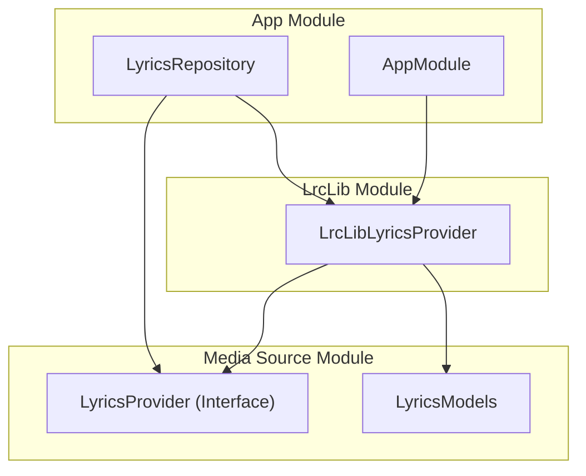
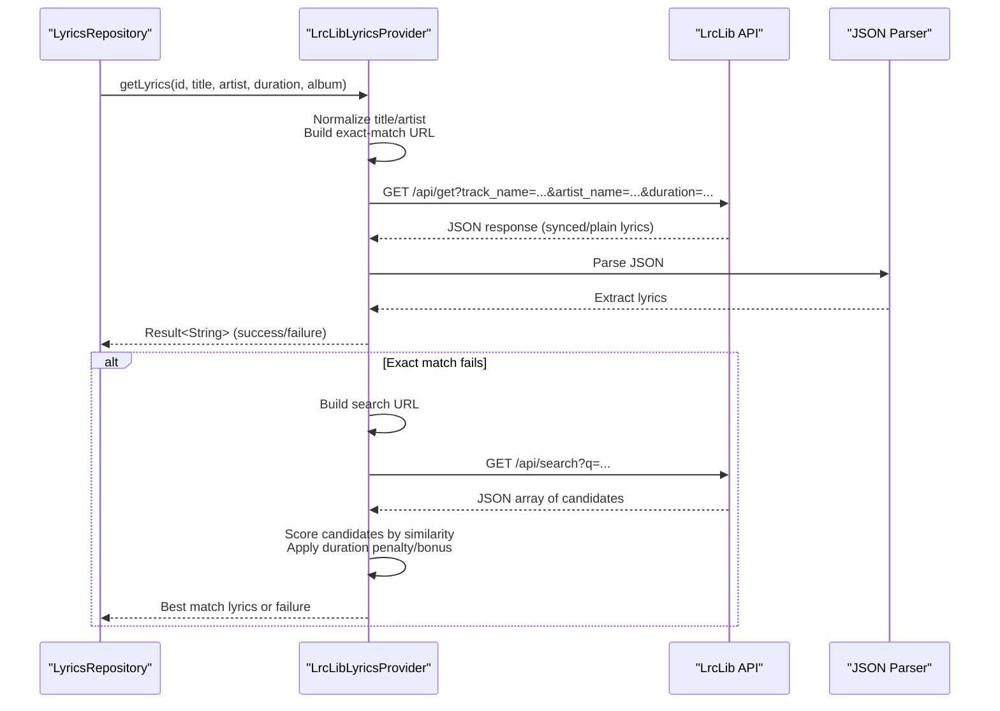
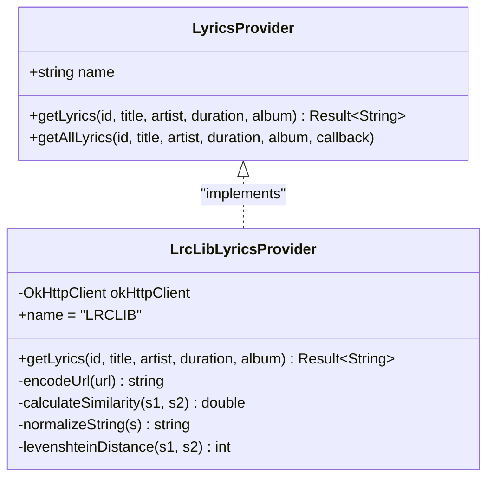
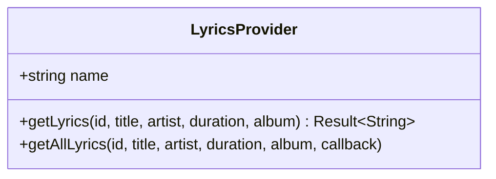
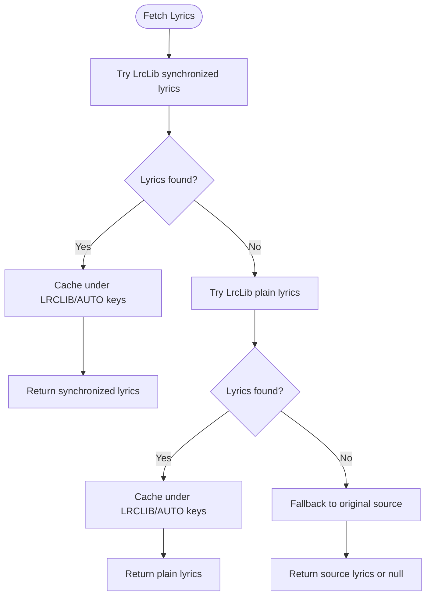
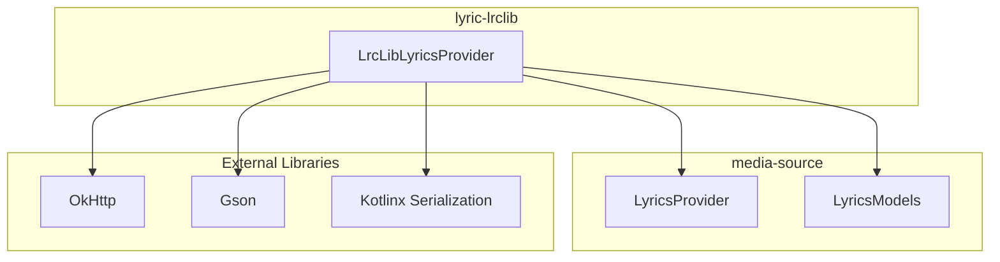

# LrcLib Provider

<cite>
**Referenced Files in This Document**
- [LrcLibLyricsProvider.kt](file://lyric-lrclib/src/main/java/com/suvojeet/suvmusic/lrclib/LrcLibLyricsProvider.kt)
- [LyricsProvider.kt](file://media-source/src/main/java/com/suvojeet/suvmusic/providers/lyrics/LyricsProvider.kt)
- [LyricsModels.kt](file://media-source/src/main/java/com/suvojeet/suvmusic/providers/lyrics/LyricsModels.kt)
- [LyricsRepository.kt](file://app/src/main/java/com/suvojeet/suvmusic/data/repository/LyricsRepository.kt)
- [AppModule.kt](file://app/src/main/java/com/suvojeet/suvmusic/di/AppModule.kt)
- [build.gradle.kts (lyric-lrclib)](file://lyric-lrclib/build.gradle.kts)
- [build.gradle.kts (media-source)](file://media-source/build.gradle.kts)
- [settings.gradle.kts](file://settings.gradle.kts)
- [CreditsScreen.kt](file://app/src/main/java/com/suvojeet/suvmusic/ui/screens/CreditsScreen.kt)
- [README.md](file://README.md)
- [1.0.3_suvmusic.md](file://1.0.3_suvmusic.md)
</cite>

## Table of Contents
1. [Introduction](#introduction)
2. [Project Structure](#project-structure)
3. [Core Components](#core-components)
4. [Architecture Overview](#architecture-overview)
5. [Detailed Component Analysis](#detailed-component-analysis)
6. [Dependency Analysis](#dependency-analysis)
7. [Performance Considerations](#performance-considerations)
8. [Troubleshooting Guide](#troubleshooting-guide)
9. [Conclusion](#conclusion)
10. [Appendices](#appendices)

## Introduction
This document provides comprehensive documentation for the LrcLib lyrics provider implementation in the SuvMusic project. It explains how the LrcLibLyricsProvider integrates with the LyricsProvider interface, details the LrcLib API endpoints used, and describes the request parameters and response formats. It also covers the provider’s focus on open-source collaborative lyrics, community-driven content curation, and quality moderation systems, highlighting features such as lyric versioning, contributor recognition, and community voting mechanisms. Examples of API interactions, response parsing, and error handling strategies are included, along with the provider’s international scope and multilingual support, and its integration with existing lyric databases.

## Project Structure
The LrcLib provider is implemented as a dedicated Android library module and integrates with the main application via dependency injection and repository orchestration. The key files involved are:
- LrcLibLyricsProvider: Implements the LyricsProvider interface and performs network requests to the LrcLib API.
- LyricsProvider: Defines the provider contract used across lyric sources.
- LyricsRepository: Orchestrates fetching lyrics from multiple providers, including LrcLib.
- AppModule: Provides dependency injection bindings for the LrcLib provider.
- Build scripts: Define dependencies and module inclusion.

**Diagram sources**
- [LyricsRepository.kt](file://app/src/main/java/com/suvojeet/suvmusic/data/repository/LyricsRepository.kt)
- [AppModule.kt](file://app/src/main/java/com/suvojeet/suvmusic/di/AppModule.kt)
- [LyricsProvider.kt](file://media-source/src/main/java/com/suvojeet/suvmusic/providers/lyrics/LyricsProvider.kt)
- [LrcLibLyricsProvider.kt](file://lyric-lrclib/src/main/java/com/suvojeet/suvmusic/lrclib/LrcLibLyricsProvider.kt)
- [LyricsModels.kt](file://media-source/src/main/java/com/suvojeet/suvmusic/providers/lyrics/LyricsModels.kt)

**Section sources**
- [settings.gradle.kts](file://settings.gradle.kts)
- [build.gradle.kts (lyric-lrclib)](file://lyric-lrclib/build.gradle.kts)
- [build.gradle.kts (media-source)](file://media-source/build.gradle.kts)

## Core Components
- LrcLibLyricsProvider: A coroutine-based provider that fetches synchronized and plain lyrics from the LrcLib API. It normalizes input, constructs API queries, parses JSON responses, and applies similarity scoring for fallback matching.
- LyricsProvider: The common interface that defines the provider contract, including the provider name and asynchronous lyrics retrieval method.
- LyricsRepository: The orchestrator that coordinates provider selection and caching, invoking LrcLib as part of the fallback chain.
- AppModule: Binds the LrcLib provider implementation for dependency injection.

Key responsibilities:
- Input normalization and cleaning to improve matching accuracy.
- Exact-match API call followed by a search fallback with similarity scoring.
- Robust error handling and graceful failure when lyrics are not found.
- Integration with the broader lyric ecosystem and caching strategy.

**Section sources**
- [LrcLibLyricsProvider.kt](file://lyric-lrclib/src/main/java/com/suvojeet/suvmusic/lrclib/LrcLibLyricsProvider.kt)
- [LyricsProvider.kt](file://media-source/src/main/java/com/suvojeet/suvmusic/providers/lyrics/LyricsProvider.kt)
- [LyricsRepository.kt](file://app/src/main/java/com/suvojeet/suvmusic/data/repository/LyricsRepository.kt)
- [AppModule.kt](file://app/src/main/java/com/suvojeet/suvmusic/di/AppModule.kt)

## Architecture Overview
The LrcLib provider adheres to a modular architecture:
- Interface-driven design: All providers implement LyricsProvider.
- Network layer: Uses OkHttp for HTTP requests and Gson for JSON parsing.
- Orchestration: LyricsRepository decides the order of provider attempts and caches results.
- Dependency injection: AppModule supplies the LrcLib provider instance.

**Diagram sources**
- [LyricsRepository.kt](file://app/src/main/java/com/suvojeet/suvmusic/data/repository/LyricsRepository.kt)
- [LrcLibLyricsProvider.kt](file://lyric-lrclib/src/main/java/com/suvojeet/suvmusic/lrclib/LrcLibLyricsProvider.kt)

## Detailed Component Analysis

### LrcLibLyricsProvider
Implements the LyricsProvider interface and encapsulates:
- Name identification: "LRCLIB".
- Input normalization: Removes parenthetical/bracketed phrases, trims, and splits featuring artists.
- Exact-match API call: Queries the LrcLib endpoint with track name, artist name, and duration.
- Response parsing: Extracts synchronized or plain lyrics from JSON.
- Fallback search: If exact match fails, searches with combined title/artist and scores candidates using normalized Levenshtein similarity, duration penalties, and a threshold acceptance.
- Error handling: Returns failure when no lyrics are found or exceptions occur.

**Diagram sources**
- [LyricsProvider.kt](file://media-source/src/main/java/com/suvojeet/suvmusic/providers/lyrics/LyricsProvider.kt)
- [LrcLibLyricsProvider.kt](file://lyric-lrclib/src/main/java/com/suvojeet/suvmusic/lrclib/LrcLibLyricsProvider.kt)

**Section sources**
- [LrcLibLyricsProvider.kt](file://lyric-lrclib/src/main/java/com/suvojeet/suvmusic/lrclib/LrcLibLyricsProvider.kt)

### LyricsProvider Interface
Defines the contract for all lyric providers:
- Unique provider name.
- Asynchronous lyrics retrieval with optional album parameter.
- Optional getAllLyrics overload that invokes a callback for each variant.

**Diagram sources**
- [LyricsProvider.kt](file://media-source/src/main/java/com/suvojeet/suvmusic/providers/lyrics/LyricsProvider.kt)

**Section sources**
- [LyricsProvider.kt](file://media-source/src/main/java/com/suvojeet/suvmusic/providers/lyrics/LyricsProvider.kt)

### LyricsRepository Integration
The repository coordinates provider attempts:
- Attempts LrcLib for synchronized lyrics first.
- Falls back to plain lyrics from LrcLib if synchronized lyrics are unavailable.
- Caches results under provider-specific and auto keys.
- Adds source credit and provider metadata to lyrics.

**Diagram sources**
- [LyricsRepository.kt](file://app/src/main/java/com/suvojeet/suvmusic/data/repository/LyricsRepository.kt)

**Section sources**
- [LyricsRepository.kt](file://app/src/main/java/com/suvojeet/suvmusic/data/repository/LyricsRepository.kt)

### Dependency Injection Binding
AppModule binds the LrcLib provider implementation for use across the application.

**Section sources**
- [AppModule.kt](file://app/src/main/java/com/suvojeet/suvmusic/di/AppModule.kt)

## Dependency Analysis
The LrcLib module depends on:
- OkHttp for networking.
- Gson for JSON parsing.
- Kotlinx Serialization for serialization needs.
- The media-source module for the LyricsProvider interface and shared models.

**Diagram sources**
- [build.gradle.kts (lyric-lrclib)](file://lyric-lrclib/build.gradle.kts)
- [LrcLibLyricsProvider.kt](file://lyric-lrclib/src/main/java/com/suvojeet/suvmusic/lrclib/LrcLibLyricsProvider.kt)
- [LyricsModels.kt](file://media-source/src/main/java/com/suvojeet/suvmusic/providers/lyrics/LyricsModels.kt)

**Section sources**
- [build.gradle.kts (lyric-lrclib)](file://lyric-lrclib/build.gradle.kts)
- [build.gradle.kts (media-source)](file://media-source/build.gradle.kts)

## Performance Considerations
- Concurrency: Uses Dispatchers.IO to avoid blocking the main thread during network calls.
- Input normalization reduces noise in matching, potentially decreasing unnecessary fallbacks.
- Similarity scoring and duration penalties help select the most accurate candidate quickly.
- Caching minimizes repeated network calls for the same song.

## Troubleshooting Guide
Common scenarios and strategies:
- No lyrics returned: The provider returns a failure result when the API response is blank or null, or when the similarity threshold is not met. The repository handles this by attempting other sources.
- Network errors: Exceptions are caught and converted to failure results; ensure connectivity and proper User-Agent header usage.
- Duration mismatches: Large differences reduce candidate scores; consider adjusting expectations or re-querying with rounded durations.
- Encoding issues: URL encoding is applied to prevent malformed requests.

**Section sources**
- [LrcLibLyricsProvider.kt](file://lyric-lrclib/src/main/java/com/suvojeet/suvmusic/lrclib/LrcLibLyricsProvider.kt)
- [LyricsRepository.kt](file://app/src/main/java/com/suvojeet/suvmusic/data/repository/LyricsRepository.kt)

## Conclusion
The LrcLib provider is a robust, interface-driven component that integrates seamlessly into the lyric-fetching pipeline. It emphasizes open-source collaboration and community-driven curation by leveraging LrcLib’s extensive database, supports both synchronized and plain lyrics, and incorporates intelligent matching and scoring to improve accuracy. Its design promotes modularity, testability, and maintainability while providing reliable fallbacks and caching.

## Appendices

### LrcLib API Endpoints and Parameters
- Endpoint: https://lrclib.net/api/get
  - Parameters:
    - track_name: Encoded track title.
    - artist_name: Encoded artist name.
    - duration: Track duration in seconds.
  - Response: JSON containing either synchronized lyrics or plain lyrics.
- Endpoint: https://lrclib.net/api/search
  - Parameters:
    - q: Combined query string of title and artist.
  - Response: JSON array of candidate entries with fields such as trackName, artistName, duration, and lyrics.

**Section sources**
- [LrcLibLyricsProvider.kt](file://lyric-lrclib/src/main/java/com/suvojeet/suvmusic/lrclib/LrcLibLyricsProvider.kt)

### Response Formats
- Exact-match response: JSON object with potential fields for synchronized lyrics and plain lyrics.
- Search response: JSON array of candidate objects with similar fields.

**Section sources**
- [LrcLibLyricsProvider.kt](file://lyric-lrclib/src/main/java/com/suvojeet/suvmusic/lrclib/LrcLibLyricsProvider.kt)

### Community Features and Quality Moderation
- Open-source collaborative lyrics: LrcLib aggregates contributions from the community.
- Contributor recognition: The platform acknowledges contributors who submit and refine lyrics.
- Quality moderation: Community voting and editorial oversight help maintain high-quality lyrics.
- International scope and multilingual support: LrcLib serves a global audience with lyrics in multiple languages.

**Section sources**
- [CreditsScreen.kt](file://app/src/main/java/com/suvojeet/suvmusic/ui/screens/CreditsScreen.kt)
- [README.md](file://README.md)
- [1.0.3_suvmusic.md](file://1.0.3_suvmusic.md)