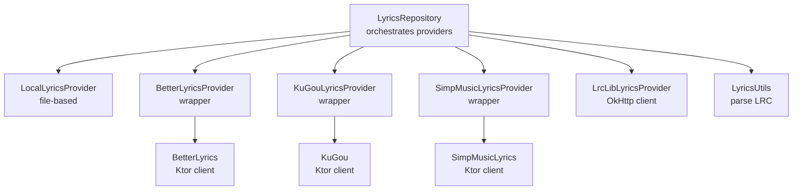
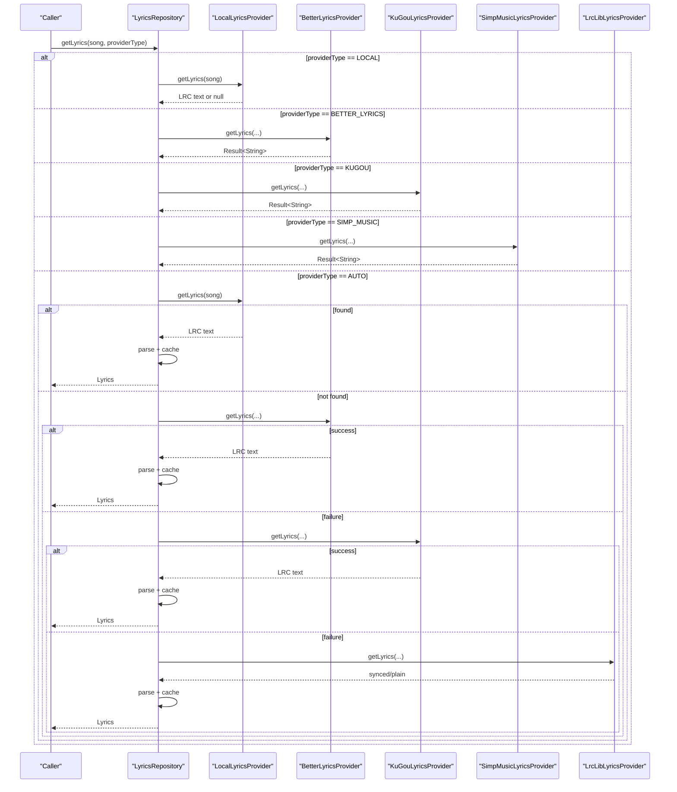
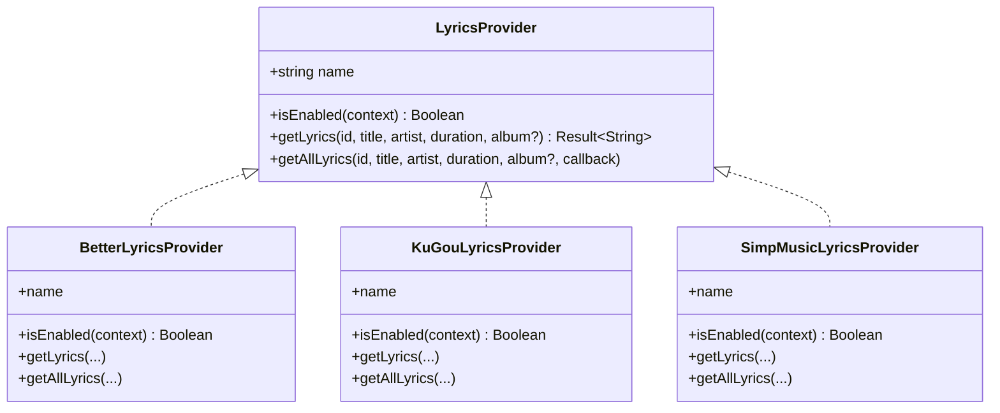
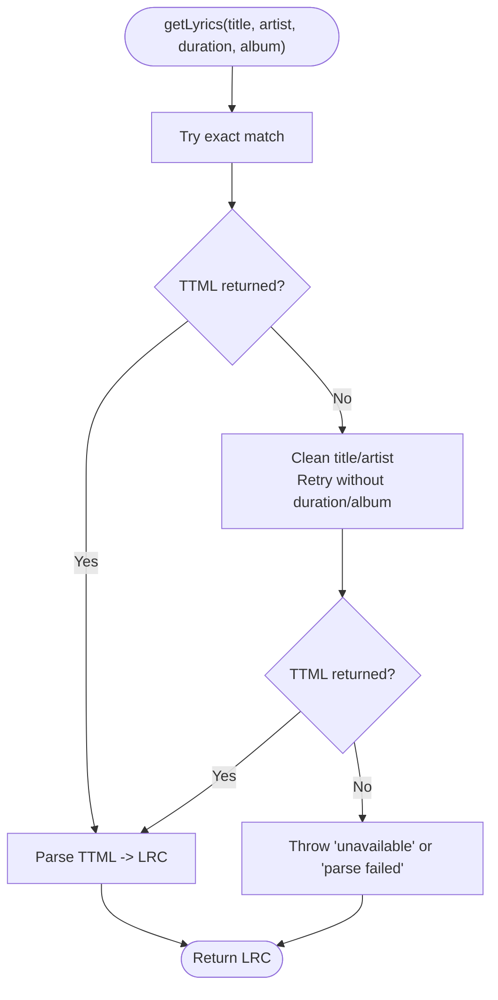
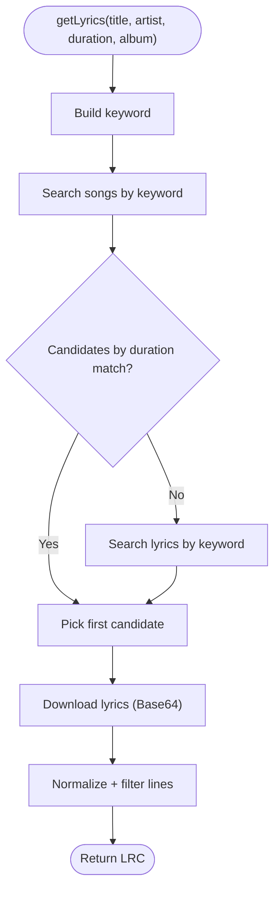
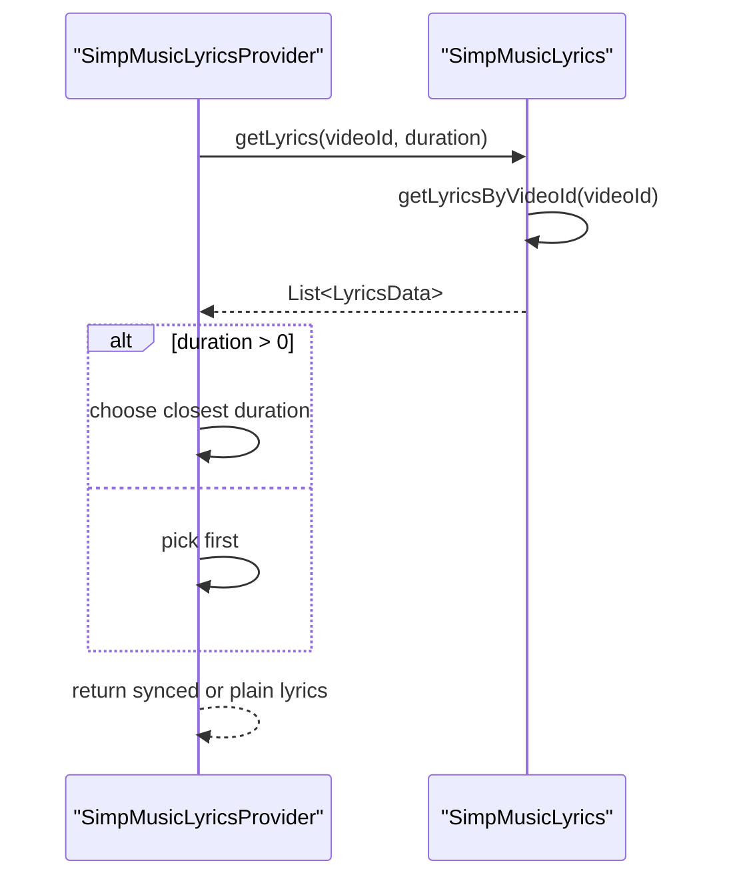
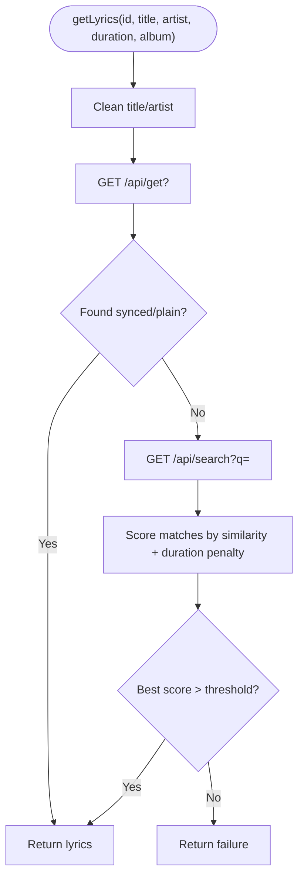
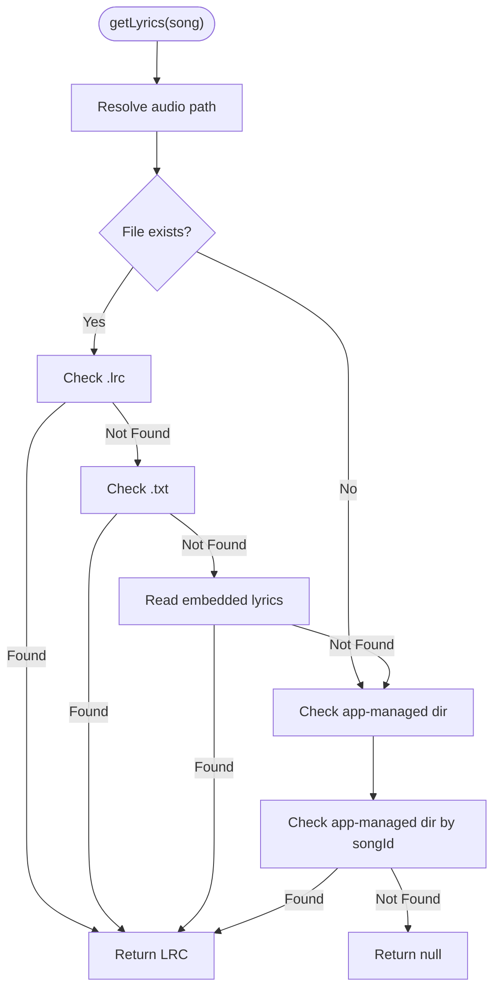
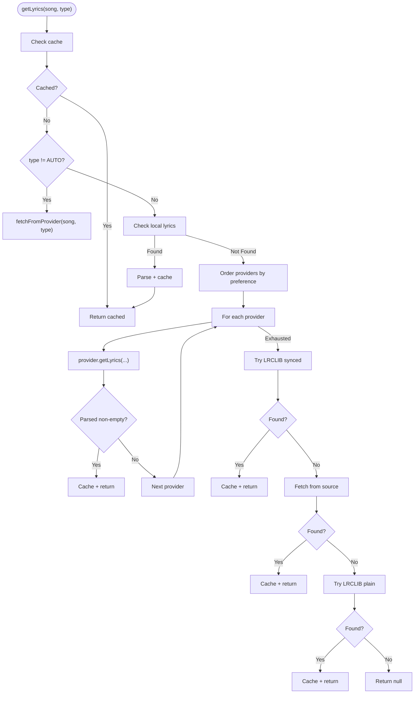
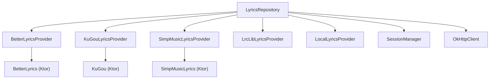

# Lyric Providers

<cite>
**Referenced Files in This Document**
- [LyricsProvider.kt](file://media-source/src/main/java/com/luvojeet/suvmusic/providers/lyrics/LyricsProvider.kt)
- [LyricsRepository.kt](file://app/src/main/java/com/luvojeet/suvmusic/data/repository/LyricsRepository.kt)
- [LocalLyricsProvider.kt](file://app/src/main/java/com/luvojeet/suvmusic/providers/lyrics/LocalLyricsProvider.kt)
- [BetterLyricsProvider.kt](file://app/src/main/java/com/luvojeet/suvmusic/data/repository/lyrics/BetterLyricsProvider.kt)
- [BetterLyrics.kt](file://app/src/main/java/com/luvojeet/suvmusic/data/repository/lyrics/BetterLyrics.kt)
- [KuGouLyricsProvider.kt](file://app/src/main/java/com/luvojeet/suvmusic/data/repository/lyrics/KuGouLyricsProvider.kt)
- [KuGou.kt](file://app/src/main/java/com/luvojeet/suvmusic/data/repository/lyrics/KuGou.kt)
- [KuGouModels.kt](file://app/src/main/java/com/luvojeet/suvmusic/data/repository/lyrics/KuGouModels.kt)
- [SimpMusicLyricsProvider.kt](file://app/src/main/java/com/luvojeet/suvmusic/data/repository/lyrics/SimpMusicLyricsProvider.kt)
- [SimpMusicLyrics.kt](file://app/src/main/java/com/luvojeet/suvmusic/data/repository/lyrics/SimpMusicLyrics.kt)
- [LrcLibLyricsProvider.kt](file://lyric-lrclib/src/main/java/com/luvojeet/suvmusic/lrclib/LrcLibLyricsProvider.kt)
- [LyricsUtils.kt](file://app/src/main/java/com/luvojeet/suvmusic/util/LyricsUtils.kt)
</cite>

## Table of Contents
1. [Introduction](#introduction)
2. [Project Structure](#project-structure)
3. [Core Components](#core-components)
4. [Architecture Overview](#architecture-overview)
5. [Detailed Component Analysis](#detailed-component-analysis)
6. [Dependency Analysis](#dependency-analysis)
7. [Performance Considerations](#performance-considerations)
8. [Troubleshooting Guide](#troubleshooting-guide)
9. [Conclusion](#conclusion)

## Introduction
This document explains the lyric provider ecosystem in SuvMusic. It covers the provider abstraction layer, the common API pattern used across providers, and how parameters (song ID, title, artist, duration, album) are passed. It documents the implementations for BetterLyrics, KuGou, LrcLib, and SimpMusic providers, along with the LocalLyricsProvider for file-based lyrics. It also describes provider configuration via SessionManager, enabling/disabling individual providers, preference-based ordering, and the provider selection logic inside the repository. Examples of provider-specific behaviors, error handling differences, and performance characteristics are included.

## Project Structure
The lyric provider system is organized around a shared interface and a repository orchestrator:
- A shared provider interface defines the contract for fetching lyrics.
- Provider wrappers implement the interface and delegate to underlying clients.
- A repository coordinates provider selection, caching, and fallback strategies.
- A local provider reads lyrics from device storage or embedded tags.
- Utilities parse LRC-formatted lyrics into structured lines.

**Diagram sources**
- [LyricsRepository.kt:77-184](file://app/src/main/java/com/luvojeet/suvmusic/data/repository/LyricsRepository.kt#L77-L184)
- [LocalLyricsProvider.kt:19-62](file://app/src/main/java/com/luvojeet/suvmusic/providers/lyrics/LocalLyricsProvider.kt#L19-L62)
- [BetterLyricsProvider.kt:21-28](file://app/src/main/java/com/luvojeet/suvmusic/data/repository/lyrics/BetterLyricsProvider.kt#L21-L28)
- [KuGouLyricsProvider.kt:21-28](file://app/src/main/java/com/luvojeet/suvmusic/data/repository/lyrics/KuGouLyricsProvider.kt#L21-L28)
- [SimpMusicLyricsProvider.kt:22-28](file://app/src/main/java/com/luvojeet/suvmusic/data/repository/lyrics/SimpMusicLyricsProvider.kt#L22-L28)
- [LrcLibLyricsProvider.kt:19-135](file://lyric-lrclib/src/main/java/com/luvojeet/suvmusic/lrclib/LrcLibLyricsProvider.kt#L19-L135)
- [BetterLyrics.kt:73-110](file://app/src/main/java/com/luvojeet/suvmusic/data/repository/lyrics/BetterLyrics.kt#L73-L110)
- [KuGou.kt:47-54](file://app/src/main/java/com/luvojeet/suvmusic/data/repository/lyrics/KuGou.kt#L47-L54)
- [SimpMusicLyrics.kt:72-94](file://app/src/main/java/com/luvojeet/suvmusic/data/repository/lyrics/SimpMusicLyrics.kt#L72-L94)
- [LyricsUtils.kt:12-55](file://app/src/main/java/com/luvojeet/suvmusic/util/LyricsUtils.kt#L12-L55)

**Section sources**
- [LyricsRepository.kt:77-184](file://app/src/main/java/com/luvojeet/suvmusic/data/repository/LyricsRepository.kt#L77-L184)
- [LocalLyricsProvider.kt:19-62](file://app/src/main/java/com/luvojeet/suvmusic/providers/lyrics/LocalLyricsProvider.kt#L19-L62)

## Core Components
- LyricsProvider interface: Defines the provider contract with name, enablement check, and two methods: getLyrics returning a Result<String> and getAllLyrics iterating over variants.
- Provider wrappers: BetterLyricsProvider, KuGouLyricsProvider, SimpMusicLyricsProvider implement the interface and delegate to underlying clients; they also consult SessionManager for enablement.
- External providers: BetterLyrics (Apple Music TTML via a third-party endpoint), KuGou (search by keyword/hash, download LRC), SimpMusic (video ID lookup with optional duration matching), LrcLib (OkHttp-based search with scoring).
- Local provider: LocalLyricsProvider reads sidecar .lrc/.txt files, embedded tags, or app-managed files.
- Repository: LyricsRepository manages provider ordering, caching, and fallback logic.

**Section sources**
- [LyricsProvider.kt:9-35](file://media-source/src/main/java/com/luvojeet/suvmusic/providers/lyrics/LyricsProvider.kt#L9-L35)
- [BetterLyricsProvider.kt:11-38](file://app/src/main/java/com/luvojeet/suvmusic/data/repository/lyrics/BetterLyricsProvider.kt#L11-L38)
- [KuGouLyricsProvider.kt:11-40](file://app/src/main/java/com/luvojeet/suvmusic/data/repository/lyrics/KuGouLyricsProvider.kt#L11-L40)
- [SimpMusicLyricsProvider.kt:11-39](file://app/src/main/java/com/luvojeet/suvmusic/data/repository/lyrics/SimpMusicLyricsProvider.kt#L11-L39)
- [LocalLyricsProvider.kt:14-74](file://app/src/main/java/com/luvojeet/suvmusic/providers/lyrics/LocalLyricsProvider.kt#L14-L74)
- [LyricsRepository.kt:27-75](file://app/src/main/java/com/luvojeet/suvmusic/data/repository/LyricsRepository.kt#L27-L75)

## Architecture Overview
The repository selects providers based on user preferences and availability, then attempts to fetch lyrics with ordered fallbacks. Local lyrics take highest priority, followed by external providers, then LRCLIB, then source-provided lyrics, and finally plain LRCLIB text.

**Diagram sources**
- [LyricsRepository.kt:77-184](file://app/src/main/java/com/luvojeet/suvmusic/data/repository/LyricsRepository.kt#L77-L184)
- [LocalLyricsProvider.kt:19-62](file://app/src/main/java/com/luvojeet/suvmusic/providers/lyrics/LocalLyricsProvider.kt#L19-L62)
- [BetterLyricsProvider.kt:21-28](file://app/src/main/java/com/luvojeet/suvmusic/data/repository/lyrics/BetterLyricsProvider.kt#L21-L28)
- [KuGouLyricsProvider.kt:21-28](file://app/src/main/java/com/luvojeet/suvmusic/data/repository/lyrics/KuGouLyricsProvider.kt#L21-L28)
- [SimpMusicLyricsProvider.kt:22-28](file://app/src/main/java/com/luvojeet/suvmusic/data/repository/lyrics/SimpMusicLyricsProvider.kt#L22-L28)
- [LrcLibLyricsProvider.kt:19-135](file://lyric-lrclib/src/main/java/com/luvojeet/suvmusic/lrclib/LrcLibLyricsProvider.kt#L19-L135)

## Detailed Component Analysis

### LyricsProvider Abstraction Layer
- Contract: name, isEnabled(context), getLyrics(...), and getAllLyrics(...) with a default implementation delegating to getLyrics.
- Provider wrappers implement isEnabled via SessionManager and forward parameters to underlying clients.

**Diagram sources**
- [LyricsProvider.kt:9-35](file://media-source/src/main/java/com/luvojeet/suvmusic/providers/lyrics/LyricsProvider.kt#L9-L35)
- [BetterLyricsProvider.kt:11-38](file://app/src/main/java/com/luvojeet/suvmusic/data/repository/lyrics/BetterLyricsProvider.kt#L11-L38)
- [KuGouLyricsProvider.kt:11-40](file://app/src/main/java/com/luvojeet/suvmusic/data/repository/lyrics/KuGouLyricsProvider.kt#L11-L40)
- [SimpMusicLyricsProvider.kt:11-39](file://app/src/main/java/com/luvojeet/suvmusic/data/repository/lyrics/SimpMusicLyricsProvider.kt#L11-L39)

**Section sources**
- [LyricsProvider.kt:9-35](file://media-source/src/main/java/com/luvojeet/suvmusic/providers/lyrics/LyricsProvider.kt#L9-L35)
- [BetterLyricsProvider.kt:17-19](file://app/src/main/java/com/luvojeet/suvmusic/data/repository/lyrics/BetterLyricsProvider.kt#L17-L19)
- [KuGouLyricsProvider.kt:17-19](file://app/src/main/java/com/luvojeet/suvmusic/data/repository/lyrics/KuGouLyricsProvider.kt#L17-L19)
- [SimpMusicLyricsProvider.kt:17-20](file://app/src/main/java/com/luvojeet/suvmusic/data/repository/lyrics/SimpMusicLyricsProvider.kt#L17-L20)

### BetterLyrics Provider
- Purpose: Fetch Apple Music-style TTML lyrics via a third-party endpoint.
- Parameter passing: title, artist, duration (seconds), optional album.
- Behavior: Attempts exact match; falls back to cleaned title/artist without duration/album; converts TTML to LRC.
- Error handling: Throws exceptions when unavailable or parsing fails; repository catches and continues.

**Diagram sources**
- [BetterLyrics.kt:73-110](file://app/src/main/java/com/luvojeet/suvmusic/data/repository/lyrics/BetterLyrics.kt#L73-L110)

**Section sources**
- [BetterLyrics.kt:73-110](file://app/src/main/java/com/luvojeet/suvmusic/data/repository/lyrics/BetterLyrics.kt#L73-L110)
- [BetterLyricsProvider.kt:21-28](file://app/src/main/java/com/luvojeet/suvmusic/data/repository/lyrics/BetterLyricsProvider.kt#L21-L28)

### KuGou Provider
- Purpose: Search songs by keyword/hash and download LRC lyrics.
- Parameter passing: title, artist, duration (seconds), optional album.
- Behavior: Builds keyword, searches songs, finds candidates by hash or keyword, downloads Base64-encoded content, normalizes text, and filters lines.
- Error handling: Returns Result.failure when no candidate or decoding fails; repository retries or moves to next provider.

**Diagram sources**
- [KuGou.kt:47-84](file://app/src/main/java/com/luvojeet/suvmusic/data/repository/lyrics/KuGou.kt#L47-L84)

**Section sources**
- [KuGou.kt:47-84](file://app/src/main/java/com/luvojeet/suvmusic/data/repository/lyrics/KuGou.kt#L47-L84)
- [KuGouLyricsProvider.kt:21-28](file://app/src/main/java/com/luvojeet/suvmusic/data/repository/lyrics/KuGouLyricsProvider.kt#L21-L28)
- [KuGouModels.kt:6-63](file://app/src/main/java/com/luvojeet/suvmusic/data/repository/lyrics/KuGouModels.kt#L6-L63)

### SimpMusic Provider
- Purpose: Fetch lyrics by video ID with optional duration matching.
- Parameter passing: video ID (as id), duration (seconds), optional album.
- Behavior: Queries API for tracks; selects best match by duration proximity; returns synced or plain lyrics.
- Error handling: Returns Result.failure when no tracks or lyrics found; repository catches and continues.

**Diagram sources**
- [SimpMusicLyricsProvider.kt:22-28](file://app/src/main/java/com/luvojeet/suvmusic/data/repository/lyrics/SimpMusicLyricsProvider.kt#L22-L28)
- [SimpMusicLyrics.kt:72-94](file://app/src/main/java/com/luvojeet/suvmusic/data/repository/lyrics/SimpMusicLyrics.kt#L72-L94)

**Section sources**
- [SimpMusicLyricsProvider.kt:22-28](file://app/src/main/java/com/luvojeet/suvmusic/data/repository/lyrics/SimpMusicLyricsProvider.kt#L22-L28)
- [SimpMusicLyrics.kt:72-94](file://app/src/main/java/com/luvojeet/suvmusic/data/repository/lyrics/SimpMusicLyrics.kt#L72-L94)

### LrcLib Provider
- Purpose: Search and retrieve synced or plain lyrics via LRCLIB API.
- Parameter passing: id (used as video ID), title, artist, duration (seconds), optional album.
- Behavior: Exact match with cleaned title/artist; if not found, searches with similarity scoring and duration penalties; returns synced lyrics if available, otherwise plain lyrics.
- Error handling: Returns Result.failure when nothing found; repository caches and proceeds to fallbacks.

**Diagram sources**
- [LrcLibLyricsProvider.kt:19-135](file://lyric-lrclib/src/main/java/com/luvojeet/suvmusic/lrclib/LrcLibLyricsProvider.kt#L19-L135)

**Section sources**
- [LrcLibLyricsProvider.kt:19-135](file://lyric-lrclib/src/main/java/com/luvojeet/suvmusic/lrclib/LrcLibLyricsProvider.kt#L19-L135)

### LocalLyricsProvider
- Purpose: Retrieve lyrics from local storage.
- Priority order:
  1) Sidecar .lrc file alongside audio.
  2) Sidecar .txt file.
  3) Embedded lyrics from audio tags.
  4) App-managed files under app’s external/internal storage.
- Parameter passing: Song object; resolves file path via content resolver or file scheme.
- Error handling: Returns null when none found; repository caches and proceeds to external providers.

**Diagram sources**
- [LocalLyricsProvider.kt:19-62](file://app/src/main/java/com/luvojeet/suvmusic/providers/lyrics/LocalLyricsProvider.kt#L19-L62)

**Section sources**
- [LocalLyricsProvider.kt:19-62](file://app/src/main/java/com/luvojeet/suvmusic/providers/lyrics/LocalLyricsProvider.kt#L19-L62)

### Provider Selection Logic in LyricsRepository
- Ordering:
  - Enabled providers per SessionManager (BetterLyrics, SimpMusic, KuGou).
  - Preferred provider moved to front based on user preference.
- AUTO mode priority:
  1) Local lyrics (highest priority).
  2) External providers in configured order.
  3) LRCLIB synced lyrics.
  4) Source-provided lyrics (JioSaavn/YouTube).
  5) LRCLIB plain lyrics fallback.
- Caching: LruCache keyed by songId and provider type.

**Diagram sources**
- [LyricsRepository.kt:77-184](file://app/src/main/java/com/luvojeet/suvmusic/data/repository/LyricsRepository.kt#L77-L184)

**Section sources**
- [LyricsRepository.kt:51-75](file://app/src/main/java/com/luvojeet/suvmusic/data/repository/LyricsRepository.kt#L51-L75)
- [LyricsRepository.kt:77-184](file://app/src/main/java/com/luvojeet/suvmusic/data/repository/LyricsRepository.kt#L77-L184)

## Dependency Analysis
- Repository depends on:
  - Provider wrappers: BetterLyricsProvider, KuGouLyricsProvider, SimpMusicLyricsProvider, LrcLibLyricsProvider.
  - Local provider: LocalLyricsProvider.
  - SessionManager for enablement and ordering.
  - OkHttp client for LRCLIB.
  - Ktor clients for BetterLyrics, KuGou, SimpMusic.
  - Utilities for parsing LRC.

**Diagram sources**
- [LyricsRepository.kt:27-37](file://app/src/main/java/com/luvojeet/suvmusic/data/repository/LyricsRepository.kt#L27-L37)
- [BetterLyricsProvider.kt:11-13](file://app/src/main/java/com/luvojeet/suvmusic/data/repository/lyrics/BetterLyricsProvider.kt#L11-L13)
- [KuGouLyricsProvider.kt:11-12](file://app/src/main/java/com/luvojeet/suvmusic/data/repository/lyrics/KuGouLyricsProvider.kt#L11-L12)
- [SimpMusicLyricsProvider.kt:11-12](file://app/src/main/java/com/luvojeet/suvmusic/data/repository/lyrics/SimpMusicLyricsProvider.kt#L11-L12)
- [LrcLibLyricsProvider.kt:13-14](file://lyric-lrclib/src/main/java/com/luvojeet/suvmusic/lrclib/LrcLibLyricsProvider.kt#L13-L14)

**Section sources**
- [LyricsRepository.kt:27-37](file://app/src/main/java/com/luvojeet/suvmusic/data/repository/LyricsRepository.kt#L27-L37)

## Performance Considerations
- Caching: LruCache with a fixed size reduces repeated network calls.
- Timeout configuration:
  - BetterLyrics and SimpMusic clients set request/connect/socket timeouts.
  - KuGou client uses default expectations; consider adding timeouts for reliability.
- Parsing cost: LyricsUtils parses LRC; keep input minimal and avoid unnecessary re-parsing.
- Network strategy: AUTO mode prioritizes local and LRCLIB to reduce latency; external providers may be slower and less reliable.

[No sources needed since this section provides general guidance]

## Troubleshooting Guide
- Local lyrics not found:
  - Ensure sidecar .lrc/.txt exists alongside audio or embedded lyrics are present.
  - Verify storage permissions and that the audio URI is resolvable.
- External provider failures:
  - BetterLyrics: Clean title/artist heuristics may fail; repository retries with relaxed parameters.
  - KuGou: Duration tolerance is applied; mismatches may require broader search.
  - SimpMusic: Duration matching improves accuracy; otherwise first result is used.
  - LRCLIB: Similarity scoring and duration penalties may reject low-quality matches; try plain lyrics fallback.
- Enable/disable and ordering:
  - Confirm SessionManager flags for each provider are set appropriately.
  - Preferred provider is moved to the front of the list.

**Section sources**
- [LocalLyricsProvider.kt:19-62](file://app/src/main/java/com/luvojeet/suvmusic/providers/lyrics/LocalLyricsProvider.kt#L19-L62)
- [BetterLyrics.kt:82-98](file://app/src/main/java/com/luvojeet/suvmusic/data/repository/lyrics/BetterLyrics.kt#L82-L98)
- [KuGou.kt:74-84](file://app/src/main/java/com/luvojeet/suvmusic/data/repository/lyrics/KuGou.kt#L74-L84)
- [SimpMusicLyrics.kt:82-88](file://app/src/main/java/com/luvojeet/suvmusic/data/repository/lyrics/SimpMusicLyrics.kt#L82-L88)
- [LrcLibLyricsProvider.kt:115-127](file://lyric-lrclib/src/main/java/com/luvojeet/suvmusic/lrclib/LrcLibLyricsProvider.kt#L115-L127)
- [LyricsRepository.kt:51-75](file://app/src/main/java/com/luvojeet/suvmusic/data/repository/LyricsRepository.kt#L51-L75)

## Conclusion
SuvMusic’s lyric provider ecosystem centers on a unified provider interface and a robust repository that orchestrates local and external sources with intelligent fallbacks and caching. Provider wrappers encapsulate API specifics while SessionManager controls enablement and ordering. The system balances accuracy and performance by prioritizing local and LRCLIB sources, applying provider-specific normalization and matching strategies, and offering clear fallback paths.