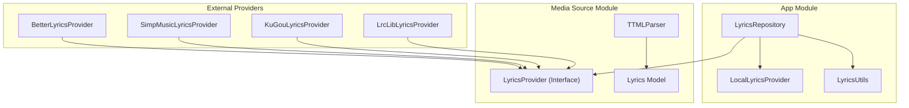
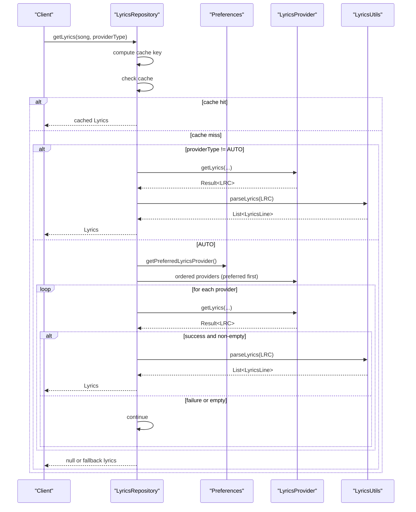
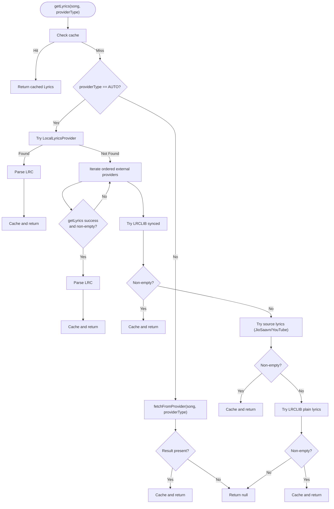
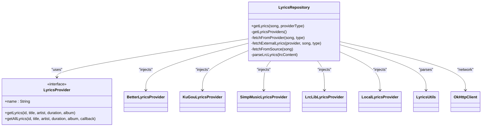

# Lyrics Provider Interface

<cite>
**Referenced Files in This Document**
- [LyricsProvider.kt](file://media-source/src/main/java/com/luvojeet/suvmusic/providers/lyrics/LyricsProvider.kt)
- [LyricsRepository.kt](file://app/src/main/java/com/luvojeet/suvmusic/data/repository/LyricsRepository.kt)
- [Lyrics.kt](file://media-source/src/main/java/com/luvojeet/suvmusic/providers/lyrics/Lyrics.kt)
- [LyricsUtils.kt](file://app/src/main/java/com/luvojeet/suvmusic/util/LyricsUtils.kt)
- [TTMLParser.kt](file://media-source/src/main/java/com/luvojeet/suvmusic/providers/lyrics/TTMLParser.kt)
- [BetterLyricsProvider.kt](file://media-source/src/main/java/com/luvojeet/suvmusic/providers/lyrics/BetterLyricsProvider.kt)
- [SimpMusicLyricsProvider.kt](file://lyric-simpmusic/src/main/java/com/luvojeet/suvmusic/simpmusic/SimpMusicLyricsProvider.kt)
- [KuGouLyricsProvider.kt](file://lyric-kugou/src/main/java/com/luvojeet/suvmusic/kugou/KuGouLyricsProvider.kt)
- [LrcLibLyricsProvider.kt](file://lyric-lrclib/src/main/java/com/luvojeet/suvmusic/lrclib/LrcLibLyricsProvider.kt)
- [LocalLyricsProvider.kt](file://app/src/main/java/com/luvojeet/suvmusic/providers/lyrics/LocalLyricsProvider.kt)
</cite>

## Table of Contents
1. [Introduction](#introduction)
2. [Project Structure](#project-structure)
3. [Core Components](#core-components)
4. [Architecture Overview](#architecture-overview)
5. [Detailed Component Analysis](#detailed-component-analysis)
6. [Dependency Analysis](#dependency-analysis)
7. [Performance Considerations](#performance-considerations)
8. [Troubleshooting Guide](#troubleshooting-guide)
9. [Conclusion](#conclusion)

## Introduction
This document explains the Lyrics Provider interface and core lyrics abstractions used by the application. It covers the interface contract, method signatures, and parameter requirements for implementing custom lyric providers. It documents the Lyrics data model, including fields for lyrics content, timing information, synchronization data, and metadata. It details the provider selection logic, priority ordering, and fallback mechanisms in the repository layer. Error handling patterns, timeout management, and provider-specific exception types are included. Examples of interface implementation, response formatting, and integration with the main application workflow are provided, along with benefits of the provider abstraction, extensibility patterns, and guidelines for adding new lyric providers.

## Project Structure
The lyrics subsystem is split across modules:
- Provider interface and models live in the media-source module.
- Repository and utilities live in the app module.
- Individual provider implementations live in dedicated modules (e.g., lyric-lrclib, lyric-kugou, lyric-simpmusic).
- A local provider lives in the app module.

**Diagram sources**
- [LyricsRepository.kt:1-310](file://app/src/main/java/com/luvojeet/suvmusic/data/repository/LyricsRepository.kt#L1-L310)
- [LyricsProvider.kt:1-50](file://media-source/src/main/java/com/luvojeet/suvmusic/providers/lyrics/LyricsProvider.kt#L1-L50)
- [Lyrics.kt:1-34](file://media-source/src/main/java/com/luvojeet/suvmusic/providers/lyrics/Lyrics.kt#L1-L34)
- [TTMLParser.kt:1-214](file://media-source/src/main/java/com/luvojeet/suvmusic/providers/lyrics/TTMLParser.kt#L1-L214)
- [BetterLyricsProvider.kt:1-32](file://media-source/src/main/java/com/luvojeet/suvmusic/providers/lyrics/BetterLyricsProvider.kt#L1-L32)
- [SimpMusicLyricsProvider.kt:1-33](file://lyric-simpmusic/src/main/java/com/luvojeet/suvmusic/simpmusic/SimpMusicLyricsProvider.kt#L1-L33)
- [KuGouLyricsProvider.kt:1-35](file://lyric-kugou/src/main/java/com/luvojeet/suvmusic/kugou/KuGouLyricsProvider.kt#L1-L35)
- [LrcLibLyricsProvider.kt:1-179](file://lyric-lrclib/src/main/java/com/luvojeet/suvmusic/lrclib/LrcLibLyricsProvider.kt#L1-L179)
- [LocalLyricsProvider.kt:1-99](file://app/src/main/java/com/luvojeet/suvmusic/providers/lyrics/LocalLyricsProvider.kt#L1-L99)

**Section sources**
- [LyricsRepository.kt:1-310](file://app/src/main/java/com/luvojeet/suvmusic/data/repository/LyricsRepository.kt#L1-L310)
- [LyricsProvider.kt:1-50](file://media-source/src/main/java/com/luvojeet/suvmusic/providers/lyrics/LyricsProvider.kt#L1-L50)
- [Lyrics.kt:1-34](file://media-source/src/main/java/com/luvojeet/suvmusic/providers/lyrics/Lyrics.kt#L1-L34)

## Core Components
- LyricsProvider interface defines the contract for fetching lyrics from various sources. Implementations return a Result<String> containing LRC-formatted lyrics text.
- Lyrics model encapsulates parsed lyrics with timing and metadata.
- LyricsRepository orchestrates provider selection, caching, and fallback logic.
- Utilities parse LRC and handle rich sync metadata.
- TTMLParser converts Apple Music TTML captions to LRC with optional word-level timing.

Key responsibilities:
- Provider interface: name, enablement check, getLyrics, and getAllLyrics.
- Repository: provider ordering, AUTO vs explicit provider modes, caching, and fallbacks.
- Models: Lines, words, and provider type metadata.
- Parsing: LRC parsing and TTML conversion.

**Section sources**
- [LyricsProvider.kt:1-50](file://media-source/src/main/java/com/luvojeet/suvmusic/providers/lyrics/LyricsProvider.kt#L1-L50)
- [Lyrics.kt:1-34](file://media-source/src/main/java/com/luvojeet/suvmusic/providers/lyrics/Lyrics.kt#L1-L34)
- [LyricsRepository.kt:1-310](file://app/src/main/java/com/luvojeet/suvmusic/data/repository/LyricsRepository.kt#L1-L310)
- [LyricsUtils.kt:1-77](file://app/src/main/java/com/luvojeet/suvmusic/util/LyricsUtils.kt#L1-L77)
- [TTMLParser.kt:1-214](file://media-source/src/main/java/com/luvojeet/suvmusic/providers/lyrics/TTMLParser.kt#L1-L214)

## Architecture Overview
The lyrics architecture follows a provider abstraction pattern:
- Clients request lyrics via LyricsRepository.
- Repository selects providers based on user preferences and mode (AUTO vs explicit).
- Providers return LRC text; repository parses into Lyrics model.
- Fallbacks ensure robustness when upstream providers fail.
- Caching avoids repeated network calls.

**Diagram sources**
- [LyricsRepository.kt:77-184](file://app/src/main/java/com/luvojeet/suvmusic/data/repository/LyricsRepository.kt#L77-L184)
- [LyricsProvider.kt:22-28](file://media-source/src/main/java/com/luvojeet/suvmusic/providers/lyrics/LyricsProvider.kt#L22-L28)
- [LyricsUtils.kt:12-55](file://app/src/main/java/com/luvojeet/suvmusic/util/LyricsUtils.kt#L12-L55)

## Detailed Component Analysis

### LyricsProvider Interface Contract
- Purpose: Define a uniform way to fetch lyrics from multiple sources.
- Required members:
  - name: Unique provider identifier.
  - isEnabled(context): Optional enablement check (present in app-layer interface).
  - getLyrics(id, title, artist, duration, album?): Returns Result<String> with LRC text.
  - getAllLyrics(..., callback): Default implementation delegates to getLyrics and invokes callback on success.

Parameter requirements:
- id: Video/Track identifier used by the provider.
- title: Song title.
- artist: Primary artist.
- duration: Expected duration in whole seconds.
- album: Optional album name.

Return type:
- Result<String>: Success holds LRC-formatted lyrics; failure indicates provider error.

Notes:
- The interface contract is implemented consistently across providers, enabling polymorphic usage in the repository.

**Section sources**
- [LyricsProvider.kt:1-50](file://media-source/src/main/java/com/luvojeet/suvmusic/providers/lyrics/LyricsProvider.kt#L1-L50)
- [LyricsRepository.kt:29-35](file://app/src/main/java/com/luvojeet/suvmusic/data/repository/LyricsRepository.kt#L29-L35)

### Lyrics Data Model
The model captures parsed lyrics and metadata:
- Lyrics:
  - lines: List of LyricsLine entries.
  - sourceCredit: Optional attribution string.
  - isSynced: Whether lines include millisecond-accurate timing.
  - provider: Origin provider type.
- LyricsLine:
  - text: Visible lyric line.
  - startTimeMs/endTimeMs: Milliseconds for line-level timing.
  - isHeader: Metadata-like line (e.g., [ar:Artist]).
  - words: Optional list of LyricsWord for word-level timing.
- LyricsWord:
  - text: Word content.
  - startTimeMs/endTimeMs: Word-level timing in milliseconds.

Provider types:
- AUTO, LRCLIB, JIOSAAVN, YOUTUBE, BETTER_LYRICS, SIMP_MUSIC, KUGOU, LOCAL.

**Section sources**
- [Lyrics.kt:1-34](file://media-source/src/main/java/com/luvojeet/suvmusic/providers/lyrics/Lyrics.kt#L1-L34)

### Provider Selection Logic and Fallbacks
LyricsRepository implements a robust selection and fallback strategy:

- Provider ordering:
  - Preferred provider is determined from user preferences and moved to the front of the list.
  - Enabled providers are filtered based on user toggles.

- AUTO mode priority:
  1) Local lyrics provider (highest priority).
  2) External providers (BetterLyrics, SimpMusic, KuGou) in preferred order.
  3) LRCLIB synced lyrics.
  4) Source lyrics (JioSaavn/YouTube).
  5) LRCLIB plain lyrics fallback.

- Explicit provider mode:
  - Fetches directly from the selected provider if enabled.

- Caching:
  - LruCache keyed by songId and provider type.
  - Results are cached under both AUTO and specific provider keys.

- Error handling:
  - Try/catch around provider calls; failures are ignored to allow progression.
  - Empty or blank results are treated as failures to trigger fallbacks.

**Diagram sources**
- [LyricsRepository.kt:77-184](file://app/src/main/java/com/luvojeet/suvmusic/data/repository/LyricsRepository.kt#L77-L184)
- [LyricsRepository.kt:186-252](file://app/src/main/java/com/luvojeet/suvmusic/data/repository/LyricsRepository.kt#L186-L252)
- [LyricsRepository.kt:254-301](file://app/src/main/java/com/luvojeet/suvmusic/data/repository/LyricsRepository.kt#L254-L301)

**Section sources**
- [LyricsRepository.kt:48-75](file://app/src/main/java/com/luvojeet/suvmusic/data/repository/LyricsRepository.kt#L48-L75)
- [LyricsRepository.kt:77-184](file://app/src/main/java/com/luvojeet/suvmusic/data/repository/LyricsRepository.kt#L77-L184)
- [LyricsRepository.kt:186-252](file://app/src/main/java/com/luvojeet/suvmusic/data/repository/LyricsRepository.kt#L186-L252)
- [LyricsRepository.kt:254-301](file://app/src/main/java/com/luvojeet/suvmusic/data/repository/LyricsRepository.kt#L254-L301)

### Error Handling Patterns and Timeout Management
- Provider exceptions:
  - LrcLibLyricsProvider wraps network errors and returns Result.failure(e).
  - Other providers propagate exceptions; repository catches and ignores to continue fallbacks.
- Timeouts:
  - LrcLibLyricsProvider relies on OkHttp defaults; no explicit timeouts are set in the provider.
  - Repository does not enforce timeouts; failures are handled by catching exceptions.
- Robustness:
  - Blank or null responses are treated as failures.
  - Rich sync metadata parsing is defensive; malformed lines are skipped.

Recommendations:
- Consider adding configurable timeouts per provider.
- Normalize exception types to distinguish transient vs permanent failures.

**Section sources**
- [LrcLibLyricsProvider.kt:137-139](file://lyric-lrclib/src/main/java/com/luvojeet/suvmusic/lrclib/LrcLibLyricsProvider.kt#L137-L139)
- [LrcLibLyricsProvider.kt:132-134](file://lyric-lrclib/src/main/java/com/luvojeet/suvmusic/lrclib/LrcLibLyricsProvider.kt#L132-L134)
- [LyricsRepository.kt:138-140](file://app/src/main/java/com/luvojeet/suvmusic/data/repository/LyricsRepository.kt#L138-L140)
- [LyricsRepository.kt:181-181](file://app/src/main/java/com/luvojeet/suvmusic/data/repository/LyricsRepository.kt#L181-L181)

### Response Formatting and Parsing
- Response format:
  - Providers return LRC text. Some providers (e.g., BetterLyrics) may embed word-level timing metadata lines prefixed with "<...>".
- Parsing:
  - LyricsUtils.parseLyrics recognizes [mm:ss.xx] lines and attaches word-level timing from metadata lines.
  - TTMLParser converts Apple Music TTML captions to LRC with optional word-level timing.

Integration:
- Repository calls LyricsUtils.parseLyrics on provider responses.
- TTMLParser is used when converting TTML to LRC for BetterLyrics.

**Section sources**
- [LyricsUtils.kt:12-55](file://app/src/main/java/com/luvojeet/suvmusic/util/LyricsUtils.kt#L12-L55)
- [TTMLParser.kt:166-185](file://media-source/src/main/java/com/luvojeet/suvmusic/providers/lyrics/TTMLParser.kt#L166-L185)
- [BetterLyricsProvider.kt:19-19](file://media-source/src/main/java/com/luvojeet/suvmusic/providers/lyrics/BetterLyricsProvider.kt#L19-L19)

### Implementation Examples and Integration
- Implementing a new provider:
  - Create a class implementing LyricsProvider with name and getLyrics returning Result<String>.
  - Optionally implement getAllLyrics to expose multiple variants.
  - Register the provider in the repository’s provider list and enablement checks.
- Integration points:
  - Repository constructs provider lists based on preferences and enables/disables providers.
  - Repository caches results and parses LRC text into the Lyrics model.

Example references:
- Provider wrappers:
  - BetterLyricsProvider, KuGouLyricsProvider, SimpMusicLyricsProvider, LrcLibLyricsProvider.
- Repository wiring:
  - Inject providers and orchestrate selection/fallback.

**Section sources**
- [BetterLyricsProvider.kt:1-32](file://media-source/src/main/java/com/luvojeet/suvmusic/providers/lyrics/BetterLyricsProvider.kt#L1-L32)
- [KuGouLyricsProvider.kt:1-35](file://lyric-kugou/src/main/java/com/luvojeet/suvmusic/kugou/KuGouLyricsProvider.kt#L1-L35)
- [SimpMusicLyricsProvider.kt:1-33](file://lyric-simpmusic/src/main/java/com/luvojeet/suvmusic/simpmusic/SimpMusicLyricsProvider.kt#L1-L33)
- [LrcLibLyricsProvider.kt:1-179](file://lyric-lrclib/src/main/java/com/luvojeet/suvmusic/lrclib/LrcLibLyricsProvider.kt#L1-L179)
- [LyricsRepository.kt:32-37](file://app/src/main/java/com/luvojeet/suvmusic/data/repository/LyricsRepository.kt#L32-L37)
- [LyricsRepository.kt:51-75](file://app/src/main/java/com/luvojeet/suvmusic/data/repository/LyricsRepository.kt#L51-L75)

### Benefits and Extensibility Guidelines
Benefits:
- Abstraction: Uniform interface across providers simplifies integration.
- Modularity: Each provider is self-contained.
- Resilience: Multiple fallbacks reduce single points of failure.
- Flexibility: Users can enable/disable providers and set preferences.

Extensibility guidelines:
- Implement LyricsProvider with a unique name and robust error handling.
- Return LRC text; optionally include rich sync metadata lines for word-level timing.
- Register the provider in the repository’s provider list and enablement logic.
- Consider adding metrics/logging for provider performance and success rates.

**Section sources**
- [LyricsProvider.kt:1-50](file://media-source/src/main/java/com/luvojeet/suvmusic/providers/lyrics/LyricsProvider.kt#L1-L50)
- [LyricsRepository.kt:51-75](file://app/src/main/java/com/luvojeet/suvmusic/data/repository/LyricsRepository.kt#L51-L75)

## Dependency Analysis
The repository depends on:
- Provider implementations (external modules).
- OkHttp client for network providers.
- SessionManager for user preferences.
- LocalLyricsProvider for local file detection.
- LyricsUtils for parsing.

**Diagram sources**
- [LyricsRepository.kt:27-38](file://app/src/main/java/com/luvojeet/suvmusic/data/repository/LyricsRepository.kt#L27-L38)
- [LyricsProvider.kt:1-50](file://media-source/src/main/java/com/luvojeet/suvmusic/providers/lyrics/LyricsProvider.kt#L1-L50)
- [BetterLyricsProvider.kt:9-31](file://media-source/src/main/java/com/luvojeet/suvmusic/providers/lyrics/BetterLyricsProvider.kt#L9-L31)
- [KuGouLyricsProvider.kt:10-34](file://lyric-kugou/src/main/java/com/luvojeet/suvmusic/kugou/KuGouLyricsProvider.kt#L10-L34)
- [SimpMusicLyricsProvider.kt:10-32](file://lyric-simpmusic/src/main/java/com/luvojeet/suvmusic/simpmusic/SimpMusicLyricsProvider.kt#L10-L32)
- [LrcLibLyricsProvider.kt:13-15](file://lyric-lrclib/src/main/java/com/luvojeet/suvmusic/lrclib/LrcLibLyricsProvider.kt#L13-L15)
- [LocalLyricsProvider.kt:14-16](file://app/src/main/java/com/luvojeet/suvmusic/providers/lyrics/LocalLyricsProvider.kt#L14-L16)
- [LyricsUtils.kt:1-77](file://app/src/main/java/com/luvojeet/suvmusic/util/LyricsUtils.kt#L1-L77)

**Section sources**
- [LyricsRepository.kt:1-38](file://app/src/main/java/com/luvojeet/suvmusic/data/repository/LyricsRepository.kt#L1-L38)

## Performance Considerations
- Caching: LruCache reduces redundant network calls; tune capacity based on memory constraints.
- Provider ordering: Place preferred providers first to minimize latency.
- Parsing cost: LyricsUtils parsing is linear in number of lines; keep provider responses concise.
- Network timeouts: Consider adding timeouts to OkHttp clients to avoid hanging requests.
- Concurrency: Repository operations are currently synchronous; consider async parsing and caching for large responses.

[No sources needed since this section provides general guidance]

## Troubleshooting Guide
Common issues and resolutions:
- No lyrics returned:
  - Verify provider enablement and user preferences.
  - Check that the provider returns non-empty LRC text.
  - Confirm AUTO mode progresses through fallbacks.
- Incorrect timing:
  - Ensure provider returns valid LRC timestamps.
  - For rich sync metadata, confirm proper formatting of word-level timing lines.
- Network failures:
  - LrcLibLyricsProvider returns failure on exceptions; repository continues to next provider.
  - Consider adding retry logic or timeouts.
- Local lyrics not detected:
  - Confirm sidecar .lrc/.txt files exist alongside audio.
  - Verify storage permissions and file paths.

**Section sources**
- [LyricsRepository.kt:138-140](file://app/src/main/java/com/luvojeet/suvmusic/data/repository/LyricsRepository.kt#L138-L140)
- [LyricsRepository.kt:181-181](file://app/src/main/java/com/luvojeet/suvmusic/data/repository/LyricsRepository.kt#L181-L181)
- [LocalLyricsProvider.kt:19-62](file://app/src/main/java/com/luvojeet/suvmusic/providers/lyrics/LocalLyricsProvider.kt#L19-L62)

## Conclusion
The lyrics subsystem leverages a clean provider abstraction to unify multiple lyric sources. The repository enforces a clear selection and fallback strategy, robust parsing, and caching to deliver reliable lyrics to users. By adhering to the interface contract and following the established patterns, developers can integrate new providers seamlessly while maintaining system resilience and performance.