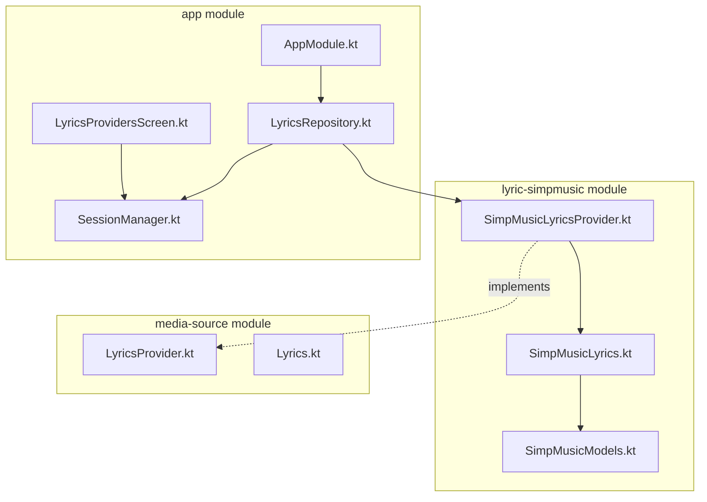
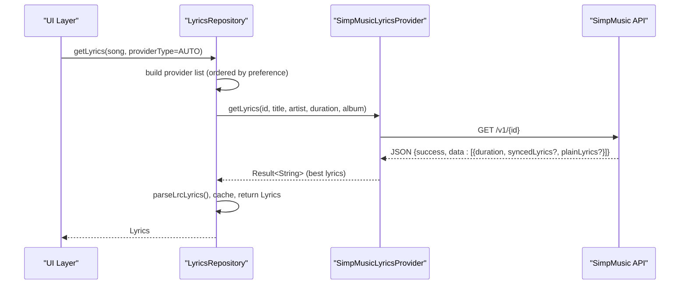
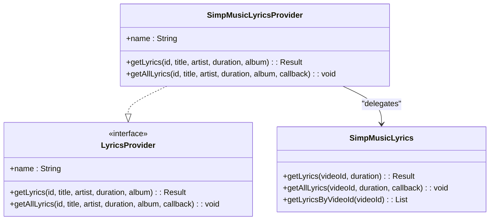
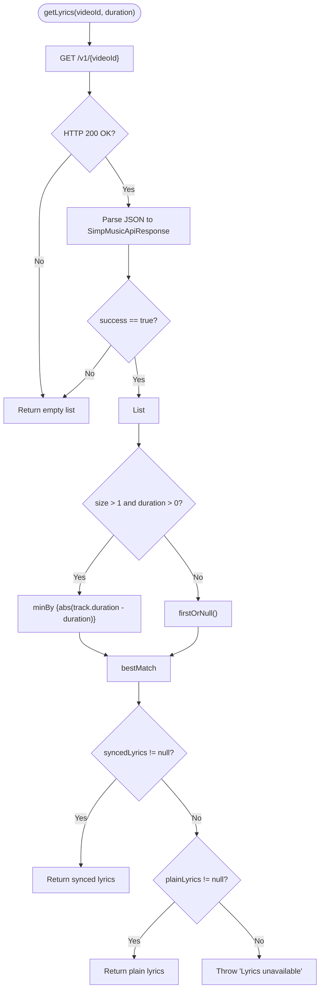
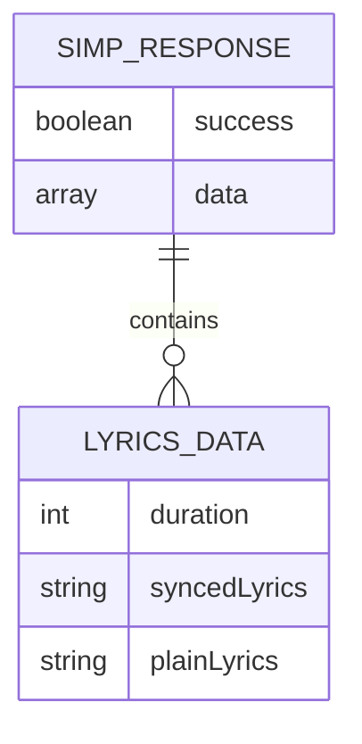
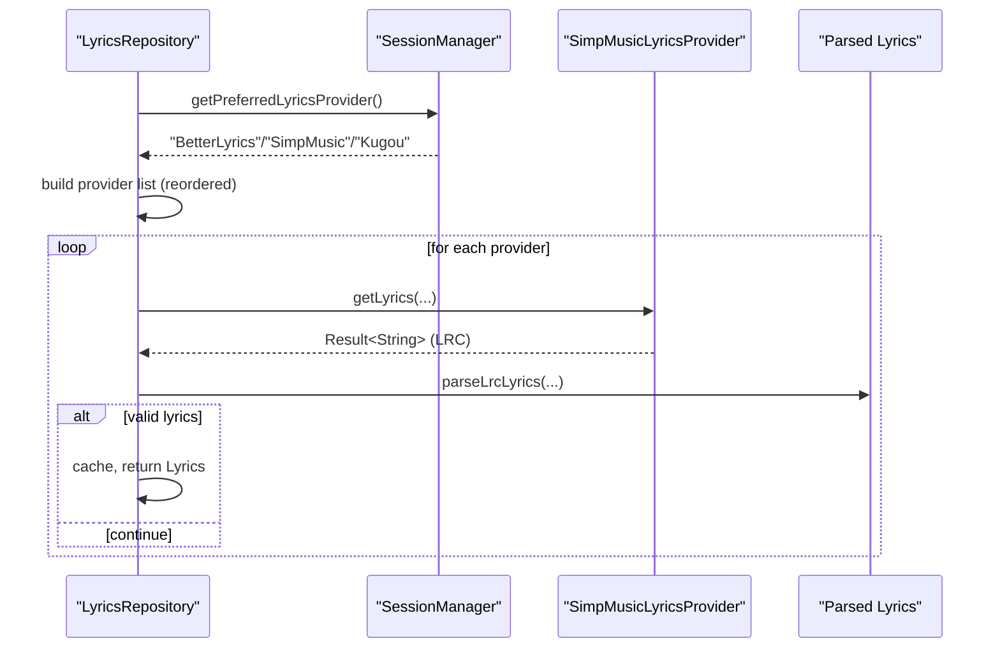
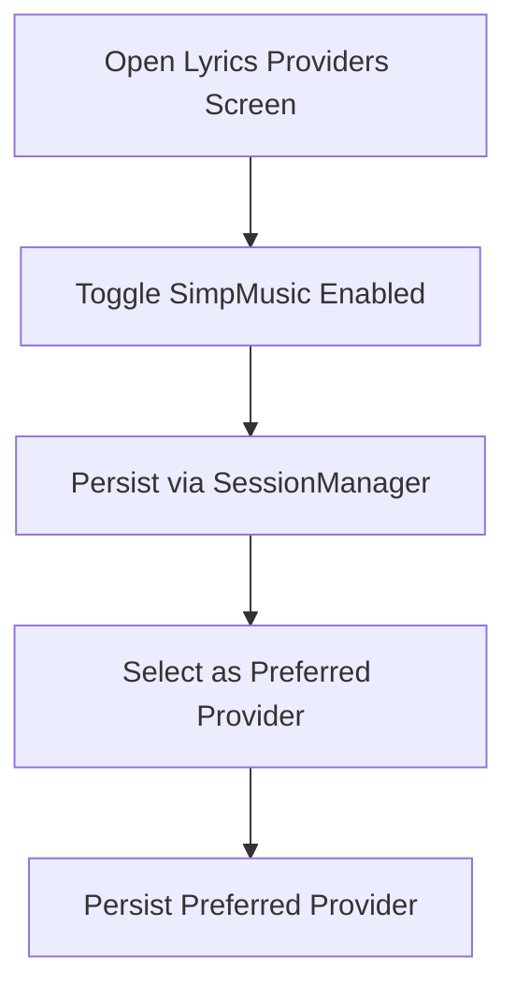
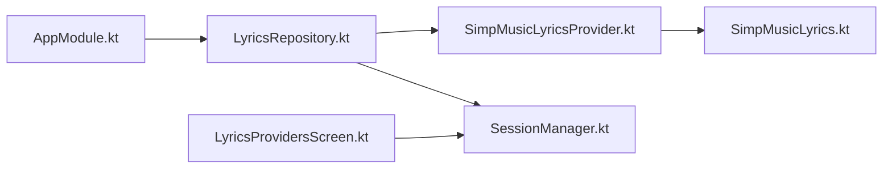

# SimpMusic Provider

<cite>
**Referenced Files in This Document**
- [SimpMusicLyricsProvider.kt](file://lyric-simpmusic/src/main/java/com/suvojeet/suvmusic/simpmusic/SimpMusicLyricsProvider.kt)
- [SimpMusicLyrics.kt](file://lyric-simpmusic/src/main/java/com/suvojeet/suvmusic/simpmusic/SimpMusicLyrics.kt)
- [SimpMusicModels.kt](file://lyric-simpmusic/src/main/java/com/suvojeet/suvmusic/simpmusic/SimpMusicModels.kt)
- [LyricsProvider.kt](file://media-source/src/main/java/com/suvojeet/suvmusic/providers/lyrics/LyricsProvider.kt)
- [Lyrics.kt](file://media-source/src/main/java/com/suvojeet/suvmusic/providers/lyrics/Lyrics.kt)
- [LyricsRepository.kt](file://app/src/main/java/com/suvojeet/suvmusic/data/repository/LyricsRepository.kt)
- [AppModule.kt](file://app/src/main/java/com/suvojeet/suvmusic/di/AppModule.kt)
- [LyricsProvidersScreen.kt](file://app/src/main/java/com/suvojeet/suvmusic/ui/screens/LyricsProvidersScreen.kt)
- [SessionManager.kt](file://app/src/main/java/com/suvojeet/suvmusic/data/SessionManager.kt)
</cite>

## Table of Contents
1. [Introduction](#introduction)
2. [Project Structure](#project-structure)
3. [Core Components](#core-components)
4. [Architecture Overview](#architecture-overview)
5. [Detailed Component Analysis](#detailed-component-analysis)
6. [Dependency Analysis](#dependency-analysis)
7. [Performance Considerations](#performance-considerations)
8. [Troubleshooting Guide](#troubleshooting-guide)
9. [Conclusion](#conclusion)

## Introduction
This document explains the SimpMusic lyrics provider implementation in the SuvMusic project. It covers the SimpMusicLyricsProvider class, its integration with the LyricsProvider interface, the SimpMusic API endpoints and request/response handling, and how the provider participates in the broader lyrics ecosystem. It also documents the provider’s approach to lyric formatting, synchronization support, metadata extraction, and configuration via the application settings.

## Project Structure
The SimpMusic provider is implemented as a separate module and integrates with the main application through dependency injection and the shared lyrics repository.

**Diagram sources**
- [SimpMusicLyricsProvider.kt:1-32](file://lyric-simpmusic/src/main/java/com/suvojeet/suvmusic/simpmusic/SimpMusicLyricsProvider.kt#L1-L32)
- [SimpMusicLyrics.kt:1-124](file://lyric-simpmusic/src/main/java/com/suvojeet/suvmusic/simpmusic/SimpMusicLyrics.kt#L1-L124)
- [SimpMusicModels.kt:1-17](file://lyric-simpmusic/src/main/java/com/suvojeet/suvmusic/simpmusic/SimpMusicModels.kt#L1-L17)
- [LyricsProvider.kt:1-50](file://media-source/src/main/java/com/suvojeet/suvmusic/providers/lyrics/LyricsProvider.kt#L1-L50)
- [Lyrics.kt:1-34](file://media-source/src/main/java/com/suvojeet/suvmusic/providers/lyrics/Lyrics.kt#L1-L34)
- [LyricsRepository.kt:1-310](file://app/src/main/java/com/suvojeet/suvmusic/data/repository/LyricsRepository.kt#L1-L310)
- [AppModule.kt:111-137](file://app/src/main/java/com/suvojeet/suvmusic/di/AppModule.kt#L111-L137)
- [LyricsProvidersScreen.kt:121-128](file://app/src/main/java/com/suvojeet/suvmusic/ui/screens/LyricsProvidersScreen.kt#L121-L128)
- [SessionManager.kt:123-126](file://app/src/main/java/com/suvojeet/suvmusic/data/SessionManager.kt#L123-L126)

**Section sources**
- [SimpMusicLyricsProvider.kt:1-32](file://lyric-simpmusic/src/main/java/com/suvojeet/suvmusic/simpmusic/SimpMusicLyricsProvider.kt#L1-L32)
- [SimpMusicLyrics.kt:1-124](file://lyric-simpmusic/src/main/java/com/suvojeet/suvmusic/simpmusic/SimpMusicLyrics.kt#L1-L124)
- [SimpMusicModels.kt:1-17](file://lyric-simpmusic/src/main/java/com/suvojeet/suvmusic/simpmusic/SimpMusicModels.kt#L1-L17)
- [LyricsProvider.kt:1-50](file://media-source/src/main/java/com/suvojeet/suvmusic/providers/lyrics/LyricsProvider.kt#L1-L50)
- [Lyrics.kt:1-34](file://media-source/src/main/java/com/suvojeet/suvmusic/providers/lyrics/Lyrics.kt#L1-L34)
- [LyricsRepository.kt:1-310](file://app/src/main/java/com/suvojeet/suvmusic/data/repository/LyricsRepository.kt#L1-L310)
- [AppModule.kt:111-137](file://app/src/main/java/com/suvojeet/suvmusic/di/AppModule.kt#L111-L137)
- [LyricsProvidersScreen.kt:121-128](file://app/src/main/java/com/suvojeet/suvmusic/ui/screens/LyricsProvidersScreen.kt#L121-L128)
- [SessionManager.kt:123-126](file://app/src/main/java/com/suvojeet/suvmusic/data/SessionManager.kt#L123-L126)

## Core Components
- SimpMusicLyricsProvider: Thin wrapper implementing the LyricsProvider interface. Delegates fetching to SimpMusicLyrics and forwards getAllLyrics callbacks.
- SimpMusicLyrics: HTTP client that queries the SimpMusic API, parses JSON responses, and selects the best-matching lyrics based on duration.
- SimpMusicModels: Serialization models for the API response and lyrics data.
- LyricsProvider interface and Lyrics data types: Shared contracts for lyrics providers and parsed lyrics representation.

Key behaviors:
- Endpoint: GET base/v1/{videoId}
- Authentication: None observed in the client; uses standard HTTP headers.
- Request/response: JSON payload with success flag and a list of tracks; each track may include synced or plain lyrics.
- Matching: When multiple tracks are returned, the provider chooses the closest match by duration or falls back to the first option.

**Section sources**
- [SimpMusicLyricsProvider.kt:10-31](file://lyric-simpmusic/src/main/java/com/suvojeet/suvmusic/simpmusic/SimpMusicLyricsProvider.kt#L10-L31)
- [SimpMusicLyrics.kt:22-124](file://lyric-simpmusic/src/main/java/com/suvojeet/suvmusic/simpmusic/SimpMusicLyrics.kt#L22-L124)
- [SimpMusicModels.kt:5-16](file://lyric-simpmusic/src/main/java/com/suvojeet/suvmusic/simpmusic/SimpMusicModels.kt#L5-L16)
- [LyricsProvider.kt:7-48](file://media-source/src/main/java/com/suvojeet/suvmusic/providers/lyrics/LyricsProvider.kt#L7-L48)
- [Lyrics.kt:3-33](file://media-source/src/main/java/com/suvojeet/suvmusic/providers/lyrics/Lyrics.kt#L3-L33)

## Architecture Overview
The provider participates in the lyrics resolution pipeline orchestrated by LyricsRepository. Providers are enabled/disabled via SessionManager and ordered according to user preference.

**Diagram sources**
- [LyricsRepository.kt:77-184](file://app/src/main/java/com/suvojeet/suvmusic/data/repository/LyricsRepository.kt#L77-L184)
- [SimpMusicLyricsProvider.kt:14-20](file://lyric-simpmusic/src/main/java/com/suvojeet/suvmusic/simpmusic/SimpMusicLyricsProvider.kt#L14-L20)
- [SimpMusicLyrics.kt:55-92](file://lyric-simpmusic/src/main/java/com/suvojeet/suvmusic/simpmusic/SimpMusicLyrics.kt#L55-L92)

**Section sources**
- [LyricsRepository.kt:77-184](file://app/src/main/java/com/suvojeet/suvmusic/data/repository/LyricsRepository.kt#L77-L184)
- [SimpMusicLyricsProvider.kt:14-31](file://lyric-simpmusic/src/main/java/com/suvojeet/suvmusic/simpmusic/SimpMusicLyricsProvider.kt#L14-L31)
- [SimpMusicLyrics.kt:55-92](file://lyric-simpmusic/src/main/java/com/suvojeet/suvmusic/simpmusic/SimpMusicLyrics.kt#L55-L92)

## Detailed Component Analysis

### SimpMusicLyricsProvider
- Implements LyricsProvider with a fixed provider name “SimpMusic”.
- Delegates getLyrics to SimpMusicLyrics.getLyrics(id, duration).
- Delegates getAllLyrics to SimpMusicLyrics.getAllLyrics(id, duration, callback).

**Diagram sources**
- [LyricsProvider.kt:7-48](file://media-source/src/main/java/com/suvojeet/suvmusic/providers/lyrics/LyricsProvider.kt#L7-L48)
- [SimpMusicLyricsProvider.kt:10-31](file://lyric-simpmusic/src/main/java/com/suvojeet/suvmusic/simpmusic/SimpMusicLyricsProvider.kt#L10-L31)
- [SimpMusicLyrics.kt:55-122](file://lyric-simpmusic/src/main/java/com/suvojeet/suvmusic/simpmusic/SimpMusicLyrics.kt#L55-L122)

**Section sources**
- [SimpMusicLyricsProvider.kt:10-31](file://lyric-simpmusic/src/main/java/com/suvojeet/suvmusic/simpmusic/SimpMusicLyricsProvider.kt#L10-L31)

### SimpMusicLyrics (HTTP Client)
- Base URL: https://api-lyrics.simpmusic.org/v1/
- HTTP client configuration:
  - JSON serialization with lenient parsing and unknown keys ignored.
  - Timeouts: request, connect, and socket timeouts set to 15s/10s/15s respectively.
  - Default headers: Accept, User-Agent, Content-Type.
- Endpoints:
  - GET v1/{videoId}: Returns a list of tracks with optional synced or plain lyrics.
- Matching logic:
  - If multiple tracks are returned and duration > 0, select the track whose duration is closest to the requested duration.
  - Prefer synced lyrics; otherwise fallback to plain lyrics.
  - getAllLyrics streams up to a capped number of variants to the caller, prioritizing synced lyrics within a narrow duration window.

**Diagram sources**
- [SimpMusicLyrics.kt:55-92](file://lyric-simpmusic/src/main/java/com/suvojeet/suvmusic/simpmusic/SimpMusicLyrics.kt#L55-L92)

**Section sources**
- [SimpMusicLyrics.kt:22-53](file://lyric-simpmusic/src/main/java/com/suvojeet/suvmusic/simpmusic/SimpMusicLyrics.kt#L22-L53)
- [SimpMusicLyrics.kt:55-92](file://lyric-simpmusic/src/main/java/com/suvojeet/suvmusic/simpmusic/SimpMusicLyrics.kt#L55-L92)
- [SimpMusicLyrics.kt:94-122](file://lyric-simpmusic/src/main/java/com/suvojeet/suvmusic/simpmusic/SimpMusicLyrics.kt#L94-L122)

### SimpMusicModels (Serialization)
- SimpMusicApiResponse: Root object containing success flag and a list of tracks.
- LyricsData: Each track may include duration, synced lyrics, and/or plain lyrics.

**Diagram sources**
- [SimpMusicModels.kt:5-16](file://lyric-simpmusic/src/main/java/com/suvojeet/suvmusic/simpmusic/SimpMusicModels.kt#L5-L16)

**Section sources**
- [SimpMusicModels.kt:5-16](file://lyric-simpmusic/src/main/java/com/suvojeet/suvmusic/simpmusic/SimpMusicModels.kt#L5-L16)

### Integration with LyricsRepository
- Provider ordering: Built dynamically from user preferences and enabled flags.
- AUTO mode:
  - Highest priority: Local lyrics provider.
  - Then external providers in order: BetterLyrics, SimpMusic, Kugou.
  - Fallback: LRCLIB synced, then plain, then source-specific lyrics.
- Caching: Results are cached per provider and per AUTO selection.

**Diagram sources**
- [LyricsRepository.kt:51-75](file://app/src/main/java/com/suvojeet/suvmusic/data/repository/LyricsRepository.kt#L51-L75)
- [LyricsRepository.kt:108-141](file://app/src/main/java/com/suvojeet/suvmusic/data/repository/LyricsRepository.kt#L108-L141)
- [SessionManager.kt:123-126](file://app/src/main/java/com/suvojeet/suvmusic/data/SessionManager.kt#L123-L126)

**Section sources**
- [LyricsRepository.kt:51-75](file://app/src/main/java/com/suvojeet/suvmusic/data/repository/LyricsRepository.kt#L51-L75)
- [LyricsRepository.kt:108-141](file://app/src/main/java/com/suvojeet/suvmusic/data/repository/LyricsRepository.kt#L108-L141)

### UI and Configuration
- Users can enable/disable SimpMusic and choose it as the preferred provider in the Lyrics Providers screen.
- Enabling/disabling is persisted via SessionManager flags.

**Diagram sources**
- [LyricsProvidersScreen.kt:121-128](file://app/src/main/java/com/suvojeet/suvmusic/ui/screens/LyricsProvidersScreen.kt#L121-L128)
- [SessionManager.kt:123-126](file://app/src/main/java/com/suvojeet/suvmusic/data/SessionManager.kt#L123-L126)

**Section sources**
- [LyricsProvidersScreen.kt:121-128](file://app/src/main/java/com/suvojeet/suvmusic/ui/screens/LyricsProvidersScreen.kt#L121-L128)
- [SessionManager.kt:123-126](file://app/src/main/java/com/suvojeet/suvmusic/data/SessionManager.kt#L123-L126)

## Dependency Analysis
- Module boundaries:
  - lyric-simpmusic: provider implementation and models.
  - media-source: shared provider interface and lyrics data types.
  - app: repository orchestration, DI wiring, UI, and persistence.
- Runtime dependencies:
  - SimpMusicLyricsProvider depends on SimpMusicLyrics for HTTP operations.
  - LyricsRepository depends on all providers and SessionManager for configuration.
  - AppModule wires LyricsRepository with all providers, including SimpMusicLyricsProvider.

**Diagram sources**
- [AppModule.kt:111-137](file://app/src/main/java/com/suvojeet/suvmusic/di/AppModule.kt#L111-L137)
- [LyricsRepository.kt:32-36](file://app/src/main/java/com/suvojeet/suvmusic/data/repository/LyricsRepository.kt#L32-L36)
- [SimpMusicLyricsProvider.kt:10-31](file://lyric-simpmusic/src/main/java/com/suvojeet/suvmusic/simpmusic/SimpMusicLyricsProvider.kt#L10-L31)
- [SimpMusicLyrics.kt:22-53](file://lyric-simpmusic/src/main/java/com/suvojeet/suvmusic/simpmusic/SimpMusicLyrics.kt#L22-L53)
- [SessionManager.kt:123-126](file://app/src/main/java/com/suvojeet/suvmusic/data/SessionManager.kt#L123-L126)

**Section sources**
- [AppModule.kt:111-137](file://app/src/main/java/com/suvojeet/suvmusic/di/AppModule.kt#L111-L137)
- [LyricsRepository.kt:32-36](file://app/src/main/java/com/suvojeet/suvmusic/data/repository/LyricsRepository.kt#L32-L36)

## Performance Considerations
- HTTP client timeouts are tuned to balance responsiveness and reliability.
- getAllLyrics streams variants to avoid buffering large payloads and to surface results early.
- LyricsRepository caches results to reduce repeated network calls.

[No sources needed since this section provides general guidance]

## Troubleshooting Guide
Common issues and strategies:
- No lyrics returned:
  - The API may return success=true with an empty data list or tracks without lyrics. The provider returns an error in this case.
  - Duration mismatch: If duration is provided and no close match is found, the provider falls back to the first track or throws an error if none qualify.
- Network failures:
  - HTTP errors or timeouts are handled gracefully; the provider returns an error result.
- Provider disabled:
  - If SimpMusic is disabled in settings, it will not be included in the provider list.

Operational checks:
- Verify provider is enabled in the UI and persisted in SessionManager.
- Confirm the video ID corresponds to a record with available lyrics on the SimpMusic endpoint.
- Inspect logs for HTTP status codes and JSON parsing outcomes.

**Section sources**
- [SimpMusicLyrics.kt:55-68](file://lyric-simpmusic/src/main/java/com/suvojeet/suvmusic/simpmusic/SimpMusicLyrics.kt#L55-L68)
- [SimpMusicLyrics.kt:70-92](file://lyric-simpmusic/src/main/java/com/suvojeet/suvmusic/simpmusic/SimpMusicLyrics.kt#L70-L92)
- [SessionManager.kt:123-126](file://app/src/main/java/com/suvojeet/suvmusic/data/SessionManager.kt#L123-L126)

## Conclusion
The SimpMusic provider integrates cleanly into the lyrics subsystem by implementing a thin wrapper around a dedicated HTTP client. It leverages duration-based matching to select appropriate lyrics, supports both synced and plain variants, and fits seamlessly into the broader provider pipeline with caching and user-configurable preferences.

[No sources needed since this section summarizes without analyzing specific files]