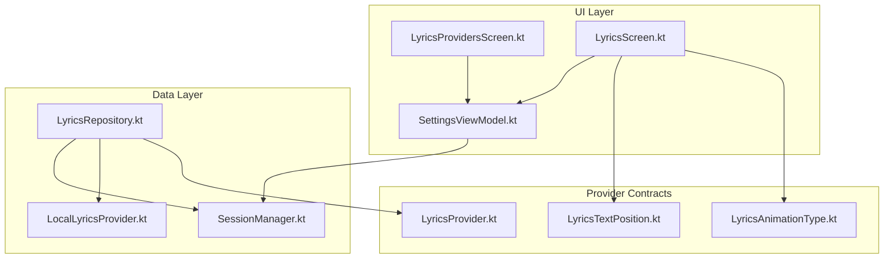
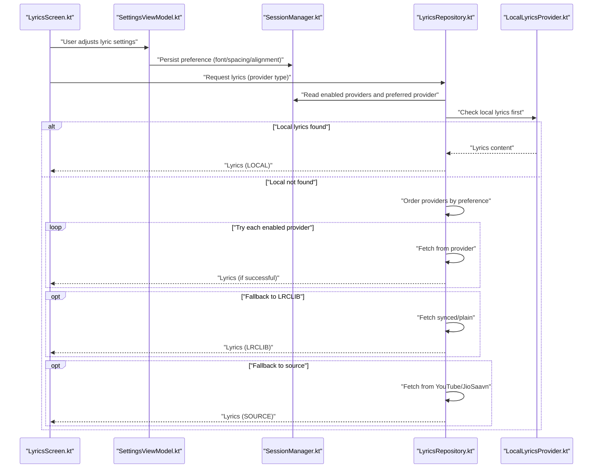
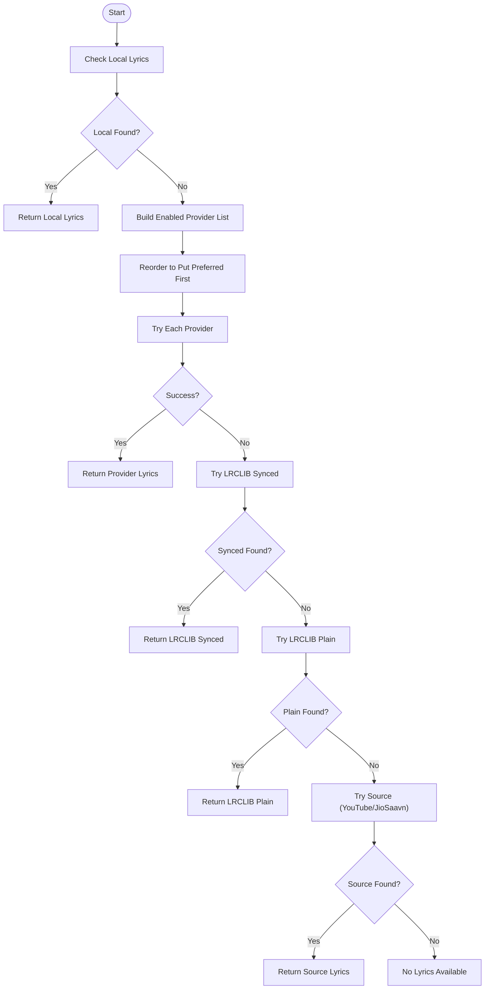
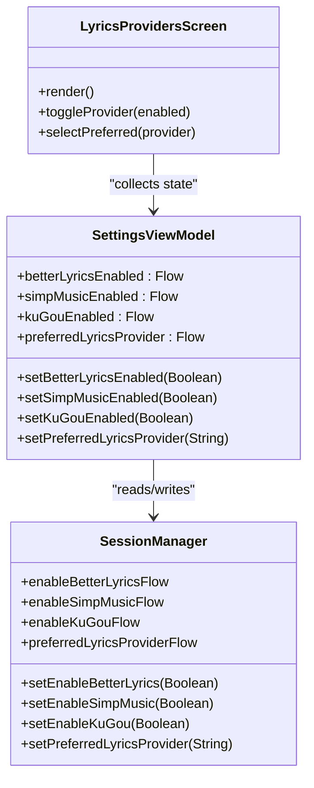
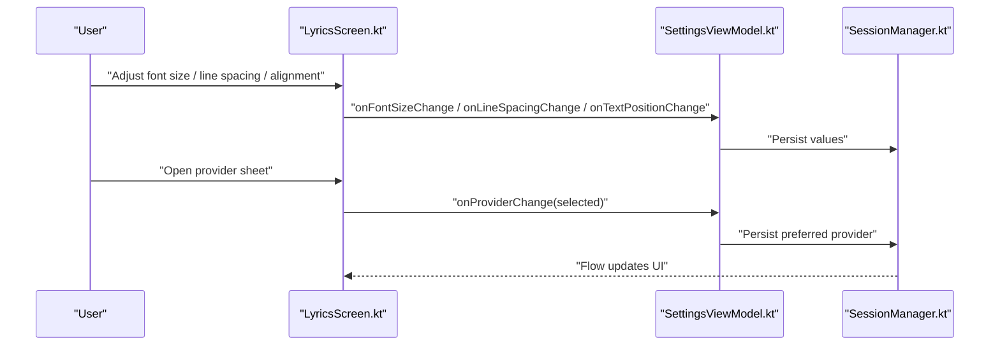
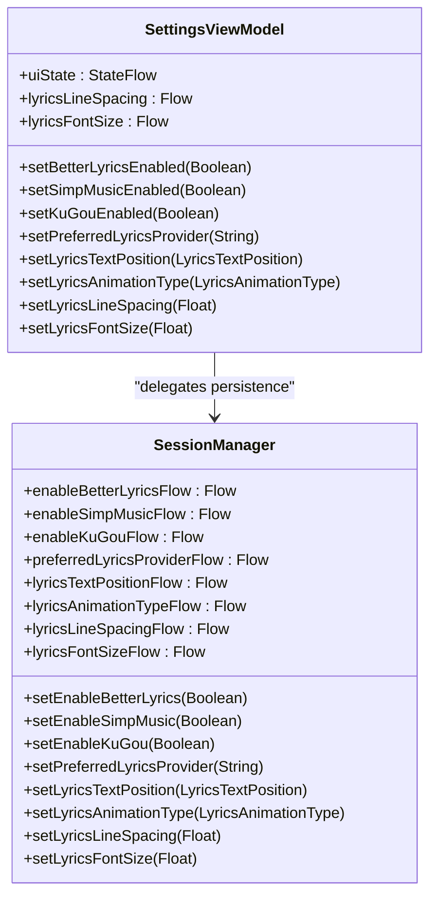
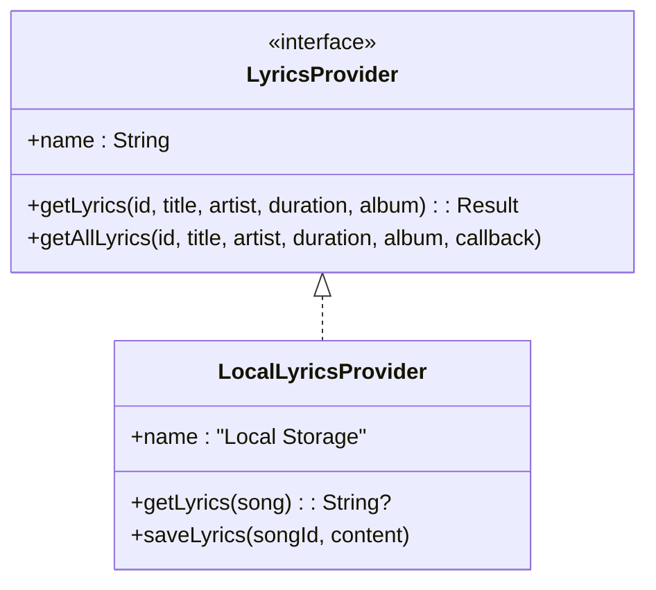
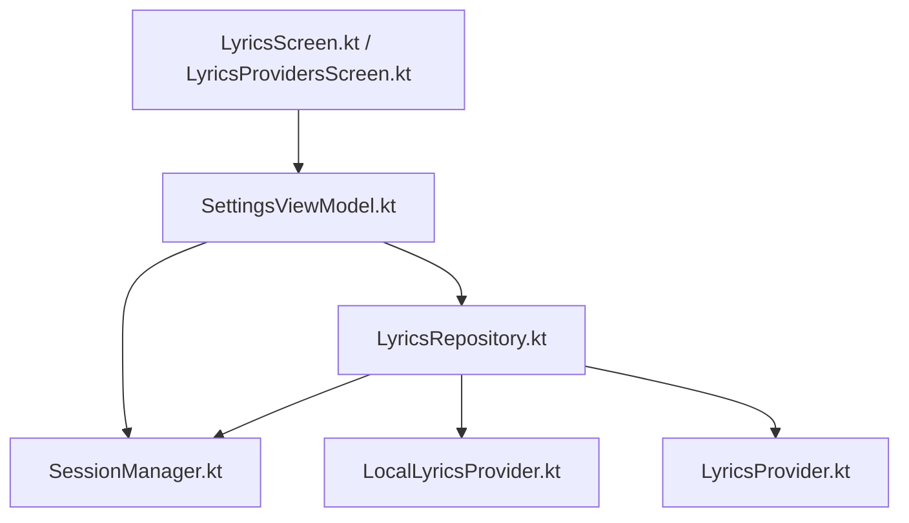

# Lyric Settings and Customization

<cite>
**Referenced Files in This Document**
- [LyricsRepository.kt](file://app/src/main/java/com/suvojeet/suvmusic/data/repository/LyricsRepository.kt)
- [LyricsProvidersScreen.kt](file://app/src/main/java/com/suvojeet/suvmusic/ui/screens/LyricsProvidersScreen.kt)
- [LyricsScreen.kt](file://app/src/main/java/com/suvoje/suvmusic/ui/screens/LyricsScreen.kt)
- [SessionManager.kt](file://app/src/main/java/com/suvojeet/suvmusic/data/SessionManager.kt)
- [SettingsViewModel.kt](file://app/src/main/java/com/suvojeet/suvmusic/ui/viewmodel/SettingsViewModel.kt)
- [LocalLyricsProvider.kt](file://app/src/main/java/com/suvojeet/suvmusic/providers/lyrics/LocalLyricsProvider.kt)
- [LyricsProvider.kt](file://media-source/src/main/java/com/suvojeet/suvmusic/providers/lyrics/LyricsProvider.kt)
- [LyricsTextPosition.kt](file://media-source/src/main/java/com/suvojeet/suvmusic/providers/lyrics/LyricsTextPosition.kt)
- [LyricsAnimationType.kt](file://media-source/src/main/java/com/suvojeet/suvmusic/providers/lyrics/LyricsAnimationType.kt)
</cite>

## Table of Contents
1. [Introduction](#introduction)
2. [Project Structure](#project-structure)
3. [Core Components](#core-components)
4. [Architecture Overview](#architecture-overview)
5. [Detailed Component Analysis](#detailed-component-analysis)
6. [Dependency Analysis](#dependency-analysis)
7. [Performance Considerations](#performance-considerations)
8. [Troubleshooting Guide](#troubleshooting-guide)
9. [Conclusion](#conclusion)

## Introduction
This document explains lyric settings and customization features in SuvMusic. It covers the LyricsProviderType enumeration and provider configuration, the LyricsProvidersScreen UI for managing preferences, SessionManager integration for persistence, provider ordering logic, and customization options such as themes, font sizes, alignment, and animations. It also includes provider configuration workflows, preference persistence, UI interactions, reliability settings, fallback behaviors, and troubleshooting common lyric display issues.

## Project Structure
Lyric-related functionality spans three layers:
- Data layer: LyricsRepository orchestrates provider selection and caching, and integrates with SessionManager for preferences.
- UI layer: LyricsProvidersScreen manages provider enablement and preferred provider selection; LyricsScreen exposes lyric customization controls.
- Persistence layer: SessionManager stores lyric preferences and UI state.

**Diagram sources**
- [LyricsProvidersScreen.kt:1-249](file://app/src/main/java/com/suvojeet/suvmusic/ui/screens/LyricsProvidersScreen.kt#L1-L249)
- [LyricsScreen.kt:1-800](file://app/src/main/java/com/suvojeet/suvmusic/ui/screens/LyricsScreen.kt#L1-L800)
- [SettingsViewModel.kt:1-800](file://app/src/main/java/com/suvojeet/suvmusic/ui/viewmodel/SettingsViewModel.kt#L1-L800)
- [LyricsRepository.kt:1-310](file://app/src/main/java/com/suvojeet/suvmusic/data/repository/LyricsRepository.kt#L1-L310)
- [SessionManager.kt:823-935](file://app/src/main/java/com/suvojeet/suvmusic/data/SessionManager.kt#L823-L935)
- [LocalLyricsProvider.kt:1-99](file://app/src/main/java/com/suvojeet/suvmusic/providers/lyrics/LocalLyricsProvider.kt#L1-L99)
- [LyricsProvider.kt:1-50](file://media-source/src/main/java/com/suvojeet/suvmusic/providers/lyrics/LyricsProvider.kt#L1-L50)
- [LyricsTextPosition.kt:1-8](file://media-source/src/main/java/com/suvojeet/suvmusic/providers/lyrics/LyricsTextPosition.kt#L1-L8)
- [LyricsAnimationType.kt:1-7](file://media-source/src/main/java/com/suvojeet/suvmusic/providers/lyrics/LyricsAnimationType.kt#L1-L7)

**Section sources**
- [LyricsRepository.kt:1-310](file://app/src/main/java/com/suvojeet/suvmusic/data/repository/LyricsRepository.kt#L1-L310)
- [LyricsProvidersScreen.kt:1-249](file://app/src/main/java/com/suvojeet/suvmusic/ui/screens/LyricsProvidersScreen.kt#L1-L249)
- [LyricsScreen.kt:1-800](file://app/src/main/java/com/suvojeet/suvmusic/ui/screens/LyricsScreen.kt#L1-L800)
- [SessionManager.kt:823-935](file://app/src/main/java/com/suvojeet/suvmusic/data/SessionManager.kt#L823-L935)
- [SettingsViewModel.kt:1-800](file://app/src/main/java/com/suvojeet/suvmusic/ui/viewmodel/SettingsViewModel.kt#L1-L800)
- [LocalLyricsProvider.kt:1-99](file://app/src/main/java/com/suvojeet/suvmusic/providers/lyrics/LocalLyricsProvider.kt#L1-L99)
- [LyricsProvider.kt:1-50](file://media-source/src/main/java/com/suvojeet/suvmusic/providers/lyrics/LyricsProvider.kt#L1-L50)
- [LyricsTextPosition.kt:1-8](file://media-source/src/main/java/com/suvojeet/suvmusic/providers/lyrics/LyricsTextPosition.kt#L1-L8)
- [LyricsAnimationType.kt:1-7](file://media-source/src/main/java/com/suvojeet/suvmusic/providers/lyrics/LyricsAnimationType.kt#L1-L7)

## Core Components
- LyricsProviderType and provider configuration:
  - Provider enable/disable flags and preferred provider are persisted via SessionManager.
  - Provider ordering logic prioritizes local lyrics, then enabled providers in preferred order, then LRCLIB, then source lyrics, with fallbacks.
- LyricsProvidersScreen:
  - Presents enable/disable toggles per provider and allows selecting the preferred provider.
- LyricsScreen:
  - Exposes customization controls for font size, line spacing, alignment, screen-on behavior, and sync correction.
  - Provides a lyrics source selector with current provider indication and provider availability.
- SessionManager:
  - Stores lyric preferences (enable flags, preferred provider, text position, animation type, line spacing, font size).
  - Provides reactive flows for UI binding.

**Section sources**
- [LyricsRepository.kt:48-184](file://app/src/main/java/com/suvojeet/suvmusic/data/repository/LyricsRepository.kt#L48-L184)
- [LyricsProvidersScreen.kt:109-140](file://app/src/main/java/com/suvojeet/suvmusic/ui/screens/LyricsProvidersScreen.kt#L109-L140)
- [LyricsScreen.kt:525-788](file://app/src/main/java/com/suvojeet/suvmusic/ui/screens/LyricsScreen.kt#L525-L788)
- [SessionManager.kt:823-935](file://app/src/main/java/com/suvojeet/suvmusic/data/SessionManager.kt#L823-L935)

## Architecture Overview
The lyric pipeline integrates UI, repository, and persistence:

**Diagram sources**
- [LyricsScreen.kt:525-788](file://app/src/main/java/com/suvojeet/suvmusic/ui/screens/LyricsScreen.kt#L525-L788)
- [SettingsViewModel.kt:179-355](file://app/src/main/java/com/suvojeet/suvmusic/ui/viewmodel/SettingsViewModel.kt#L179-L355)
- [SessionManager.kt:823-935](file://app/src/main/java/com/suvojeet/suvmusic/data/SessionManager.kt#L823-L935)
- [LyricsRepository.kt:77-184](file://app/src/main/java/com/suvojeet/suvmusic/data/repository/LyricsRepository.kt#L77-L184)
- [LocalLyricsProvider.kt:19-62](file://app/src/main/java/com/suvojeet/suvmusic/providers/lyrics/LocalLyricsProvider.kt#L19-L62)

## Detailed Component Analysis

### LyricsProviderType and Provider Ordering
- Provider enable flags and preferred provider are stored in SessionManager and surfaced to UI via SettingsViewModel.
- Provider ordering logic:
  - Local lyrics take highest priority.
  - Enabled providers are reordered so the preferred provider appears first.
  - LRCLIB is attempted for synced lyrics, then plain lyrics if synced fails.
  - Source lyrics (YouTube/JioSaavn) serve as a final fallback.

**Diagram sources**
- [LyricsRepository.kt:94-183](file://app/src/main/java/com/suvojeet/suvmusic/data/repository/LyricsRepository.kt#L94-L183)

**Section sources**
- [LyricsRepository.kt:48-184](file://app/src/main/java/com/suvojeet/suvmusic/data/repository/LyricsRepository.kt#L48-L184)
- [SessionManager.kt:823-873](file://app/src/main/java/com/suvojeet/suvmusic/data/SessionManager.kt#L823-L873)

### LyricsProvidersScreen UI
- Allows enabling/disabling BetterLyrics, SimpMusic, and Kugou.
- Lets users select the preferred provider among enabled ones.
- Uses a glass-morphism card layout with animated visibility for preferred settings when a provider is enabled.

**Diagram sources**
- [LyricsProvidersScreen.kt:54-145](file://app/src/main/java/com/suvojeet/suvmusic/ui/screens/LyricsProvidersScreen.kt#L54-L145)
- [SettingsViewModel.kt:232-331](file://app/src/main/java/com/suvojeet/suvmusic/ui/viewmodel/SettingsViewModel.kt#L232-L331)
- [SessionManager.kt:823-873](file://app/src/main/java/com/suvojeet/suvmusic/data/SessionManager.kt#L823-L873)

**Section sources**
- [LyricsProvidersScreen.kt:109-140](file://app/src/main/java/com/suvojeet/suvmusic/ui/screens/LyricsProvidersScreen.kt#L109-L140)
- [SettingsViewModel.kt:232-331](file://app/src/main/java/com/suvojeet/suvmusic/ui/viewmodel/SettingsViewModel.kt#L232-L331)
- [SessionManager.kt:823-873](file://app/src/main/java/com/suvojeet/suvmusic/data/SessionManager.kt#L823-L873)

### LyricsScreen Customization
- Customization controls:
  - Font size slider (16–50 sp).
  - Line spacing slider (1.0–2.5).
  - Alignment selection (Center, Left, Right).
  - Screen-on toggle.
  - Sync correction (+/- 0.5s steps).
  - Provider selector showing current provider and available options.
- These preferences are applied immediately in the UI and can be persisted via SessionManager methods exposed by SettingsViewModel.

**Diagram sources**
- [LyricsScreen.kt:535-788](file://app/src/main/java/com/suvojeet/suvmusic/ui/screens/LyricsScreen.kt#L535-L788)
- [SettingsViewModel.kt:179-355](file://app/src/main/java/com/suvojeet/suvmusic/ui/viewmodel/SettingsViewModel.kt#L179-L355)
- [SessionManager.kt:874-935](file://app/src/main/java/com/suvojeet/suvmusic/data/SessionManager.kt#L874-L935)

**Section sources**
- [LyricsScreen.kt:525-788](file://app/src/main/java/com/suvojeet/suvmusic/ui/screens/LyricsScreen.kt#L525-L788)
- [SettingsViewModel.kt:179-355](file://app/src/main/java/com/suvojeet/suvmusic/ui/viewmodel/SettingsViewModel.kt#L179-L355)
- [SessionManager.kt:874-935](file://app/src/main/java/com/suvojeet/suvmusic/data/SessionManager.kt#L874-L935)

### SessionManager Integration
- Persists:
  - Enable flags for BetterLyrics, SimpMusic, KuGou.
  - Preferred lyrics provider.
  - Lyrics text position, animation type, line spacing, font size.
- Exposes reactive flows for UI binding and updates via SettingsViewModel.

**Diagram sources**
- [SessionManager.kt:823-935](file://app/src/main/java/com/suvojeet/suvmusic/data/SessionManager.kt#L823-L935)
- [SettingsViewModel.kt:179-355](file://app/src/main/java/com/suvojeet/suvmusic/ui/viewmodel/SettingsViewModel.kt#L179-L355)

**Section sources**
- [SessionManager.kt:823-935](file://app/src/main/java/com/suvojeet/suvmusic/data/SessionManager.kt#L823-L935)
- [SettingsViewModel.kt:179-355](file://app/src/main/java/com/suvojeet/suvmusic/ui/viewmodel/SettingsViewModel.kt#L179-L355)

### Provider Contracts and Local Lyrics
- LyricsProvider defines the contract for fetching lyrics and optional getAllLyrics.
- LocalLyricsProvider supports:
  - Sidecar .lrc/.txt files adjacent to audio.
  - Embedded lyrics via audio tags.
  - Manual lyrics saved under app storage.

**Diagram sources**
- [LyricsProvider.kt:7-49](file://media-source/src/main/java/com/suvojeet/suvmusic/providers/lyrics/LyricsProvider.kt#L7-L49)
- [LocalLyricsProvider.kt:14-74](file://app/src/main/java/com/suvojeet/suvmusic/providers/lyrics/LocalLyricsProvider.kt#L14-L74)

**Section sources**
- [LyricsProvider.kt:7-49](file://media-source/src/main/java/com/suvojeet/suvmusic/providers/lyrics/LyricsProvider.kt#L7-L49)
- [LocalLyricsProvider.kt:19-74](file://app/src/main/java/com/suvojeet/suvmusic/providers/lyrics/LocalLyricsProvider.kt#L19-L74)

## Dependency Analysis
- UI depends on SettingsViewModel for reactive state and persistence.
- SettingsViewModel depends on SessionManager for persistent preferences.
- LyricsRepository depends on SessionManager for provider enablement and preferred provider, and on LocalLyricsProvider for local lyrics.
- Provider contracts are defined in media-source module and consumed by repository and UI.

**Diagram sources**
- [LyricsScreen.kt:525-788](file://app/src/main/java/com/suvojeet/suvmusic/ui/screens/LyricsScreen.kt#L525-L788)
- [LyricsProvidersScreen.kt:54-145](file://app/src/main/java/com/suvojeet/suvmusic/ui/screens/LyricsProvidersScreen.kt#L54-L145)
- [SettingsViewModel.kt:140-149](file://app/src/main/java/com/suvojeet/suvmusic/ui/viewmodel/SettingsViewModel.kt#L140-L149)
- [LyricsRepository.kt:27-38](file://app/src/main/java/com/suvojeet/suvmusic/data/repository/LyricsRepository.kt#L27-L38)
- [SessionManager.kt:63-65](file://app/src/main/java/com/suvojeet/suvmusic/data/SessionManager.kt#L63-L65)
- [LocalLyricsProvider.kt:14-16](file://app/src/main/java/com/suvojeet/suvmusic/providers/lyrics/LocalLyricsProvider.kt#L14-L16)
- [LyricsProvider.kt:7-11](file://media-source/src/main/java/com/suvojeet/suvmusic/providers/lyrics/LyricsProvider.kt#L7-L11)

**Section sources**
- [LyricsRepository.kt:27-38](file://app/src/main/java/com/suvojeet/suvmusic/data/repository/LyricsRepository.kt#L27-L38)
- [SettingsViewModel.kt:140-149](file://app/src/main/java/com/suvojeet/suvmusic/ui/viewmodel/SettingsViewModel.kt#L140-L149)
- [SessionManager.kt:63-65](file://app/src/main/java/com/suvojeet/suvmusic/data/SessionManager.kt#L63-L65)

## Performance Considerations
- LRU cache in LyricsRepository reduces repeated network calls for the same provider and song.
- Provider ordering prioritizes local lyrics and the preferred provider to minimize latency.
- Reactive flows avoid unnecessary recompositions by updating only changed preferences.

[No sources needed since this section provides general guidance]

## Troubleshooting Guide
Common lyric display issues and resolutions:
- No lyrics found:
  - Verify provider enable flags in LyricsProvidersScreen.
  - Confirm preferred provider selection and that it is enabled.
  - Check LRCLIB fallback behavior if synced lyrics fail.
- Misaligned or hard-to-read text:
  - Adjust font size and line spacing in LyricsScreen customization.
  - Change alignment to Center/Left/Right depending on preference.
- Sync timing issues:
  - Use the sync correction controls to fine-tune timing.
- Local lyrics not detected:
  - Ensure .lrc/.txt sidecar files exist alongside audio or are saved in app storage.
  - Confirm audio file has embedded lyrics if relying on tag extraction.

**Section sources**
- [LyricsScreen.kt:637-697](file://app/src/main/java/com/suvojeet/suvmusic/ui/screens/LyricsScreen.kt#L637-L697)
- [LocalLyricsProvider.kt:19-62](file://app/src/main/java/com/suvojeet/suvmusic/providers/lyrics/LocalLyricsProvider.kt#L19-L62)
- [LyricsRepository.kt:94-183](file://app/src/main/java/com/suvojeet/suvmusic/data/repository/LyricsRepository.kt#L94-L183)

## Conclusion
SuvMusic’s lyric system combines flexible provider configuration, robust fallback logic, and rich customization options. Users can tailor provider enablement and preferences, while the app ensures reliable lyric delivery through local-first, ordered provider attempts, and multiple fallbacks. SessionManager persists these preferences reactively, and the UI surfaces controls for immediate feedback and adjustments.