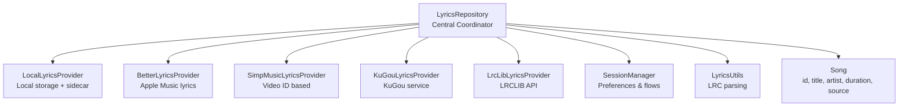
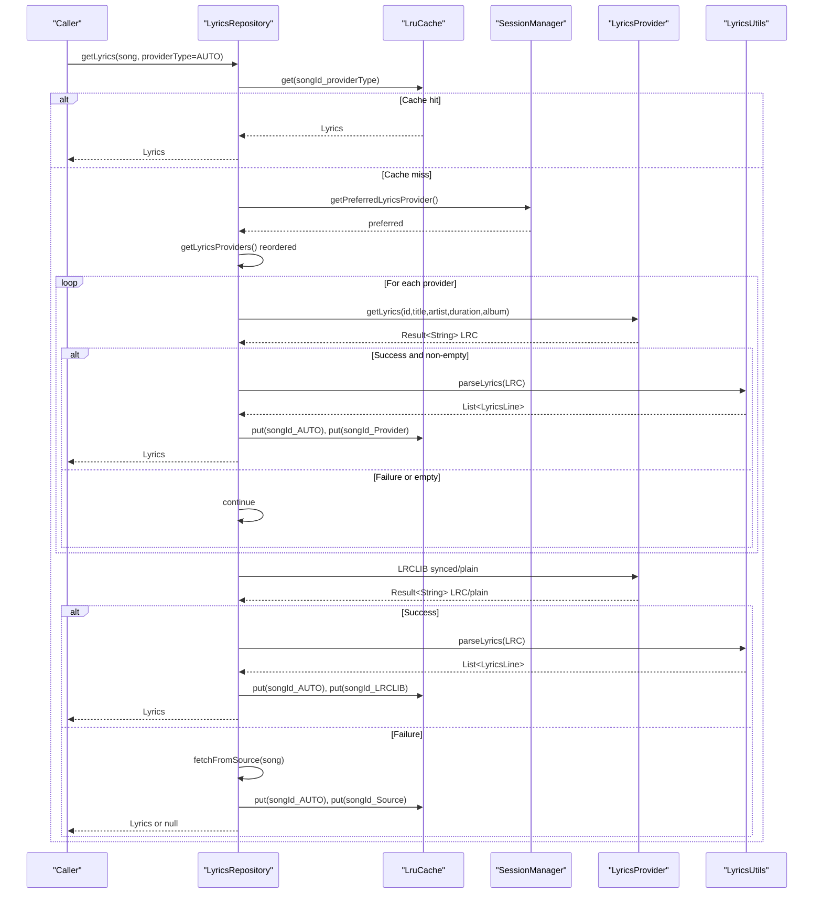
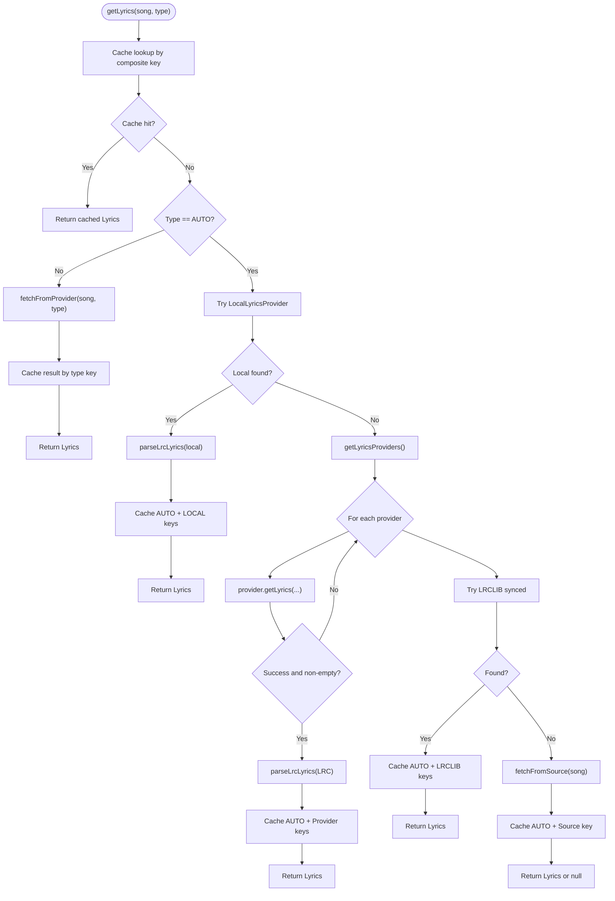
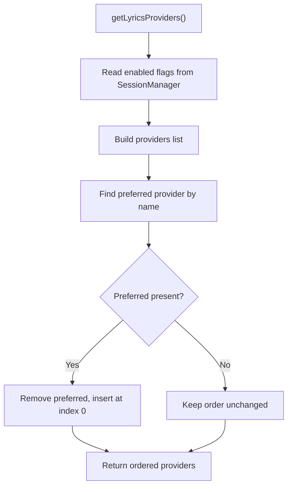
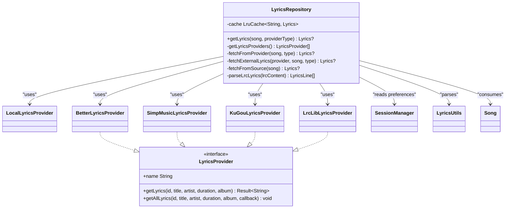

# Lyrics Repository

<cite>
**Referenced Files in This Document**
- [LyricsRepository.kt](file://app/src/main/java/com/suvojeet/suvmusic/data/repository/LyricsRepository.kt)
- [LyricsProvider.kt](file://media-source/src/main/java/com/suvojeet/suvmusic/providers/lyrics/LyricsProvider.kt)
- [LocalLyricsProvider.kt](file://app/src/main/java/com/suvojeet/suvmusic/providers/lyrics/LocalLyricsProvider.kt)
- [BetterLyricsProvider.kt](file://media-source/src/main/java/com/suvojeet/suvmusic/providers/lyrics/BetterLyricsProvider.kt)
- [SimpMusicLyricsProvider.kt](file://lyric-simpmusic/src/main/java/com/suvojeet/suvmusic/simpmusic/SimpMusicLyricsProvider.kt)
- [KuGouLyricsProvider.kt](file://lyric-kugou/src/main/java/com/suvojeet/suvmusic/kugou/KuGouLyricsProvider.kt)
- [LrcLibLyricsProvider.kt](file://lyric-lrclib/src/main/java/com/suvojeet/suvmusic/lrclib/LrcLibLyricsProvider.kt)
- [SessionManager.kt](file://app/src/main/java/com/suvojeet/suvmusic/data/SessionManager.kt)
- [Song.kt](file://core/model/src/main/java/com/suvojeet/suvmusic/core/model/Song.kt)
- [LyricsUtils.kt](file://app/src/main/java/com/suvojeet/suvmusic/util/LyricsUtils.kt)
</cite>

## Table of Contents
1. [Introduction](#introduction)
2. [Project Structure](#project-structure)
3. [Core Components](#core-components)
4. [Architecture Overview](#architecture-overview)
5. [Detailed Component Analysis](#detailed-component-analysis)
6. [Dependency Analysis](#dependency-analysis)
7. [Performance Considerations](#performance-considerations)
8. [Troubleshooting Guide](#troubleshooting-guide)
9. [Conclusion](#conclusion)

## Introduction
This document explains the LyricsRepository class, which centralizes lyrics fetching and caching across multiple providers. It covers provider prioritization, caching strategy with LruCache, fallback mechanisms, and integration with SessionManager for user preferences. The AUTO mode follows a strict priority order: local lyrics, external providers (BetterLyrics, SimpMusic, KuGou), LRCLIB, source-specific lyrics, and plain text fallback. The repository ensures thread-safe operations using Dispatchers.IO and caches results under carefully constructed keys to avoid redundant network calls.

## Project Structure
The lyrics subsystem is organized around a central repository coordinating multiple providers:
- Central repository: LyricsRepository
- Provider interface: LyricsProvider
- Concrete providers: BetterLyricsProvider, SimpMusicLyricsProvider, KuGouLyricsProvider, LrcLibLyricsProvider, LocalLyricsProvider
- Preferences integration: SessionManager
- Data models: Song, Lyrics models
- Utilities: LyricsUtils for parsing LRC and rich-sync formats

**Diagram sources**
- [LyricsRepository.kt:27-38](file://app/src/main/java/com/suvojeet/suvmusic/data/repository/LyricsRepository.kt#L27-L38)
- [LocalLyricsProvider.kt:14-16](file://app/src/main/java/com/suvojeet/suvmusic/providers/lyrics/LocalLyricsProvider.kt#L14-L16)
- [BetterLyricsProvider.kt:9-11](file://media-source/src/main/java/com/suvojeet/suvmusic/providers/lyrics/BetterLyricsProvider.kt#L9-L11)
- [SimpMusicLyricsProvider.kt:10-12](file://lyric-simpmusic/src/main/java/com/suvojeet/suvmusic/simpmusic/SimpMusicLyricsProvider.kt#L10-L12)
- [KuGouLyricsProvider.kt:10-12](file://lyric-kugou/src/main/java/com/suvojeet/suvmusic/kugou/KuGouLyricsProvider.kt#L10-L12)
- [LrcLibLyricsProvider.kt:13-17](file://lyric-lrclib/src/main/java/com/suvojeet/suvmusic/lrclib/LrcLibLyricsProvider.kt#L13-L17)
- [SessionManager.kt:823-873](file://app/src/main/java/com/suvojeet/suvmusic/data/SessionManager.kt#L823-L873)
- [LyricsUtils.kt:6-11](file://app/src/main/java/com/suvojeet/suvmusic/util/LyricsUtils.kt#L6-L11)
- [Song.kt:9-28](file://core/model/src/main/java/com/suvojeet/suvmusic/core/model/Song.kt#L9-L28)

**Section sources**
- [LyricsRepository.kt:27-38](file://app/src/main/java/com/suvojeet/suvmusic/data/repository/LyricsRepository.kt#L27-L38)
- [LyricsProvider.kt:7-28](file://media-source/src/main/java/com/suvojeet/suvmusic/providers/lyrics/LyricsProvider.kt#L7-L28)
- [LocalLyricsProvider.kt:14-16](file://app/src/main/java/com/suvojeet/suvmusic/providers/lyrics/LocalLyricsProvider.kt#L14-L16)
- [BetterLyricsProvider.kt:9-11](file://media-source/src/main/java/com/suvojeet/suvmusic/providers/lyrics/BetterLyricsProvider.kt#L9-L11)
- [SimpMusicLyricsProvider.kt:10-12](file://lyric-simpmusic/src/main/java/com/suvojeet/suvmusic/simpmusic/SimpMusicLyricsProvider.kt#L10-L12)
- [KuGouLyricsProvider.kt:10-12](file://lyric-kugou/src/main/java/com/suvojeet/suvmusic/kugou/KuGouLyricsProvider.kt#L10-L12)
- [LrcLibLyricsProvider.kt:13-17](file://lyric-lrclib/src/main/java/com/suvojeet/suvmusic/lrclib/LrcLibLyricsProvider.kt#L13-L17)
- [SessionManager.kt:823-873](file://app/src/main/java/com/suvojeet/suvmusic/data/SessionManager.kt#L823-L873)
- [LyricsUtils.kt:6-11](file://app/src/main/java/com/suvojeet/suvmusic/util/LyricsUtils.kt#L6-L11)
- [Song.kt:9-28](file://core/model/src/main/java/com/suvojeet/suvmusic/core/model/Song.kt#L9-L28)

## Core Components
- LyricsRepository: Orchestrates provider selection, caching, and fallback logic. Uses LruCache keyed by songId and provider type. Executes all IO-bound work on Dispatchers.IO.
- LyricsProvider interface: Defines a uniform contract for fetching lyrics with Result<String> and optional getAllLyrics callback support.
- Provider implementations:
  - LocalLyricsProvider: Reads sidecar .lrc/.txt files, embedded tags, and app-managed storage.
  - BetterLyricsProvider: Wraps Apple Music lyrics via BetterLyrics API.
  - SimpMusicLyricsProvider: Fetches lyrics by video ID from SimpMusic.
  - KuGouLyricsProvider: Queries KuGou service for lyrics.
  - LrcLibLyricsProvider: LRCLIB API with synced and plain lyrics, plus search fallback.
- SessionManager: Supplies user preferences for enabling/disabling providers and selecting a preferred provider.
- LyricsUtils: Parses LRC content into structured LyricsLine objects, handling both timestamped synchronized lines and rich sync metadata.

**Section sources**
- [LyricsRepository.kt:77-184](file://app/src/main/java/com/suvojeet/suvmusic/data/repository/LyricsRepository.kt#L77-L184)
- [LyricsProvider.kt:7-28](file://media-source/src/main/java/com/suvojeet/suvmusic/providers/lyrics/LyricsProvider.kt#L7-L28)
- [LocalLyricsProvider.kt:19-62](file://app/src/main/java/com/suvojeet/suvmusic/providers/lyrics/LocalLyricsProvider.kt#L19-L62)
- [BetterLyricsProvider.kt:13-19](file://media-source/src/main/java/com/suvojeet/suvmusic/providers/lyrics/BetterLyricsProvider.kt#L13-L19)
- [SimpMusicLyricsProvider.kt:14-20](file://lyric-simpmusic/src/main/java/com/suvojeet/suvmusic/simpmusic/SimpMusicLyricsProvider.kt#L14-L20)
- [KuGouLyricsProvider.kt:14-21](file://lyric-kugou/src/main/java/com/suvojeet/suvmusic/kugou/KuGouLyricsProvider.kt#L14-L21)
- [LrcLibLyricsProvider.kt:19-62](file://lyric-lrclib/src/main/java/com/suvojeet/suvmusic/lrclib/LrcLibLyricsProvider.kt#L19-L62)
- [SessionManager.kt:823-873](file://app/src/main/java/com/suvojeet/suvmusic/data/SessionManager.kt#L823-L873)
- [LyricsUtils.kt:12-55](file://app/src/main/java/com/suvojeet/suvmusic/util/LyricsUtils.kt#L12-L55)

## Architecture Overview
LyricsRepository coordinates a multi-tiered retrieval pipeline:
- Cache-first lookup using a composite key (songId_providerType).
- AUTO mode prioritizes local lyrics, then enabled external providers (reordered by preference), then LRCLIB, then source-specific lyrics, finally plain LRCLIB text.
- Each provider returns Result<String> lyrics in LRC format; LyricsRepository parses with LyricsUtils and constructs a unified Lyrics model.
- Thread safety is ensured by performing all IO on Dispatchers.IO.

**Diagram sources**
- [LyricsRepository.kt:77-184](file://app/src/main/java/com/suvojeet/suvmusic/data/repository/LyricsRepository.kt#L77-L184)
- [SessionManager.kt:862-873](file://app/src/main/java/com/suvojeet/suvmusic/data/SessionManager.kt#L862-L873)
- [LyricsUtils.kt:12-55](file://app/src/main/java/com/suvojeet/suvmusic/util/LyricsUtils.kt#L12-L55)

**Section sources**
- [LyricsRepository.kt:77-184](file://app/src/main/java/com/suvojeet/suvmusic/data/repository/LyricsRepository.kt#L77-L184)
- [SessionManager.kt:862-873](file://app/src/main/java/com/suvojeet/suvmusic/data/SessionManager.kt#L862-L873)
- [LyricsUtils.kt:12-55](file://app/src/main/java/com/suvojeet/suvmusic/util/LyricsUtils.kt#L12-L55)

## Detailed Component Analysis

### LyricsRepository
- Responsibilities:
  - Cache management with LruCache<String, Lyrics>.
  - Provider selection and ordering based on user preferences.
  - AUTO mode priority: local lyrics → enabled external providers (reordered by preference) → LRCLIB → source-specific lyrics → plain LRCLIB → null.
  - Thread-safe IO using Dispatchers.IO.
  - Unified parsing via LyricsUtils and construction of Lyrics model.
- Key methods:
  - getLyrics(song, providerType): orchestrates AUTO or single-provider retrieval.
  - getLyricsProviders(): builds ordered provider list from preferences.
  - fetchFromProvider(song, providerType): executes a specific provider or falls back to AUTO.
  - fetchExternalLyrics(provider, song, type): shared logic for external provider calls.
  - fetchFromSource(song): retrieves lyrics from source repositories (JioSaavn/YouTube).
  - parseLrcLyrics(lrcContent): delegates to LyricsUtils.
- Cache keys:
  - Composite key: "${songId}_${providerType.name}".
  - Also stores AUTO key for general caching.

**Diagram sources**
- [LyricsRepository.kt:77-184](file://app/src/main/java/com/suvojeet/suvmusic/data/repository/LyricsRepository.kt#L77-L184)

**Section sources**
- [LyricsRepository.kt:39-46](file://app/src/main/java/com/suvojeet/suvmusic/data/repository/LyricsRepository.kt#L39-L46)
- [LyricsRepository.kt:51-75](file://app/src/main/java/com/suvojeet/suvmusic/data/repository/LyricsRepository.kt#L51-L75)
- [LyricsRepository.kt:77-184](file://app/src/main/java/com/suvojeet/suvmusic/data/repository/LyricsRepository.kt#L77-L184)
- [LyricsRepository.kt:186-252](file://app/src/main/java/com/suvojeet/suvmusic/data/repository/LyricsRepository.kt#L186-L252)
- [LyricsRepository.kt:254-282](file://app/src/main/java/com/suvojeet/suvmusic/data/repository/LyricsRepository.kt#L254-L282)
- [LyricsRepository.kt:284-301](file://app/src/main/java/com/suvojeet/suvmusic/data/repository/LyricsRepository.kt#L284-L301)
- [LyricsRepository.kt:303-305](file://app/src/main/java/com/suvojeet/suvmusic/data/repository/LyricsRepository.kt#L303-L305)
- [LyricsRepository.kt:307-310](file://app/src/main/java/com/suvojeet/suvmusic/data/repository/LyricsRepository.kt#L307-L310)

### Provider Selection Logic
- Enabled providers are filtered from SessionManager flags.
- Preferred provider is moved to the front of the list.
- External providers are called in order until a non-empty LRC result is obtained.

**Diagram sources**
- [LyricsRepository.kt:51-75](file://app/src/main/java/com/suvojeet/suvmusic/data/repository/LyricsRepository.kt#L51-L75)
- [SessionManager.kt:823-873](file://app/src/main/java/com/suvojeet/suvmusic/data/SessionManager.kt#L823-L873)

**Section sources**
- [LyricsRepository.kt:51-75](file://app/src/main/java/com/suvojeet/suvmusic/data/repository/LyricsRepository.kt#L51-L75)
- [SessionManager.kt:823-873](file://app/src/main/java/com/suvojeet/suvmusic/data/SessionManager.kt#L823-L873)

### Cache Key Generation and Thread Safety
- Cache key: "${songId}_${providerType.name}".
- Thread safety: All IO operations are executed within withContext(Dispatchers.IO).
- Cache stores both AUTO and provider-specific entries for quick retrieval.

**Section sources**
- [LyricsRepository.kt:44-46](file://app/src/main/java/com/suvojeet/suvmusic/data/repository/LyricsRepository.kt#L44-L46)
- [LyricsRepository.kt:77-78](file://app/src/main/java/com/suvojeet/suvmusic/data/repository/LyricsRepository.kt#L77-L78)
- [LyricsRepository.kt:132-134](file://app/src/main/java/com/suvojeet/suvmusic/data/repository/LyricsRepository.kt#L132-L134)
- [LyricsRepository.kt:247-251](file://app/src/main/java/com/suvojeet/suvmusic/data/repository/LyricsRepository.kt#L247-L251)

### Provider Implementations
- LocalLyricsProvider:
  - Sidecar .lrc/.txt files near audio.
  - Embedded lyrics via jaudiotagger.
  - App-managed storage under app's external files dir.
- BetterLyricsProvider:
  - Delegates to BetterLyrics.getLyrics with title, artist, duration, album.
- SimpMusicLyricsProvider:
  - Delegates to SimpMusicLyrics.getLyrics with id and duration.
- KuGouLyricsProvider:
  - Delegates to KuGou.getLyrics with title, artist, duration, album.
- LrcLibLyricsProvider:
  - Attempts synced lyrics via LRCLIB API.
  - Falls back to plain lyrics if synced unavailable.
  - Performs search with similarity scoring and duration penalties.

**Section sources**
- [LocalLyricsProvider.kt:19-62](file://app/src/main/java/com/suvojeet/suvmusic/providers/lyrics/LocalLyricsProvider.kt#L19-L62)
- [BetterLyricsProvider.kt:13-19](file://media-source/src/main/java/com/suvojeet/suvmusic/providers/lyrics/BetterLyricsProvider.kt#L13-L19)
- [SimpMusicLyricsProvider.kt:14-20](file://lyric-simpmusic/src/main/java/com/suvojeet/suvmusic/simpmusic/SimpMusicLyricsProvider.kt#L14-L20)
- [KuGouLyricsProvider.kt:14-21](file://lyric-kugou/src/main/java/com/suvojeet/suvmusic/kugou/KuGouLyricsProvider.kt#L14-L21)
- [LrcLibLyricsProvider.kt:19-135](file://lyric-lrclib/src/main/java/com/suvojeet/suvmusic/lrclib/LrcLibLyricsProvider.kt#L19-L135)

### AUTO Mode Priority Order
- Local lyrics (highest priority).
- External providers in order: BetterLyrics, SimpMusic, KuGou (only if enabled).
- LRCLIB synced lyrics.
- Source-specific lyrics (JioSaavn/YouTube).
- Plain LRCLIB lyrics.
- Null if none succeed.

**Section sources**
- [LyricsRepository.kt:91-183](file://app/src/main/java/com/suvojeet/suvmusic/data/repository/LyricsRepository.kt#L91-L183)

### Integration with SessionManager
- Provider toggles: doesEnableBetterLyrics(), doesEnableSimpMusic(), doesEnableKuGou().
- Preferred provider: getPreferredLyricsProvider().
- These preferences drive provider availability and ordering.

**Section sources**
- [SessionManager.kt:823-873](file://app/src/main/java/com/suvojeet/suvmusic/data/SessionManager.kt#L823-L873)

### Relationship with Different Lyric Providers
- All providers implement LyricsProvider and return Result<String> LRC.
- LyricsRepository normalizes results into a unified Lyrics model with source credit and synchronization flags.

**Section sources**
- [LyricsProvider.kt:7-28](file://media-source/src/main/java/com/suvojeet/suvmusic/providers/lyrics/LyricsProvider.kt#L7-L28)
- [LyricsRepository.kt:117-136](file://app/src/main/java/com/suvojeet/suvmusic/data/repository/LyricsRepository.kt#L117-L136)
- [LyricsRepository.kt:160-181](file://app/src/main/java/com/suvojeet/suvmusic/data/repository/LyricsRepository.kt#L160-L181)

### Examples of Lyrics Retrieval Patterns
- Request lyrics for a Song with AUTO mode:
  - LyricsRepository checks cache, then tries local, external providers, LRCLIB, source-specific, and plain LRCLIB.
- Request lyrics for a specific provider:
  - LyricsRepository invokes fetchFromProvider with providerType and caches the result under that type key.

**Section sources**
- [LyricsRepository.kt:77-184](file://app/src/main/java/com/suvojeet/suvmusic/data/repository/LyricsRepository.kt#L77-L184)
- [LyricsRepository.kt:186-252](file://app/src/main/java/com/suvojeet/suvmusic/data/repository/LyricsRepository.kt#L186-L252)

### Error Handling Strategies
- External provider calls are wrapped in try/catch blocks; failures are ignored to allow fallback to the next provider.
- LRCLIB attempts synced lyrics first, then falls back to plain lyrics if available.
- fetchFromSource handles exceptions and returns null if all attempts fail.

**Section sources**
- [LyricsRepository.kt:138-141](file://app/src/main/java/com/suvojeet/suvmusic/data/repository/LyricsRepository.kt#L138-L141)
- [LyricsRepository.kt:186-252](file://app/src/main/java/com/suvojeet/suvmusic/data/repository/LyricsRepository.kt#L186-L252)
- [LrcLibLyricsProvider.kt:132-135](file://lyric-lrclib/src/main/java/com/suvojeet/suvmusic/lrclib/LrcLibLyricsProvider.kt#L132-L135)

## Dependency Analysis
LyricsRepository depends on:
- Provider implementations for external services.
- SessionManager for user preferences.
- LyricsUtils for parsing.
- Song model for metadata.

**Diagram sources**
- [LyricsRepository.kt:27-38](file://app/src/main/java/com/suvojeet/suvmusic/data/repository/LyricsRepository.kt#L27-L38)
- [LyricsProvider.kt:7-28](file://media-source/src/main/java/com/suvojeet/suvmusic/providers/lyrics/LyricsProvider.kt#L7-L28)
- [LocalLyricsProvider.kt:14-16](file://app/src/main/java/com/suvojeet/suvmusic/providers/lyrics/LocalLyricsProvider.kt#L14-L16)
- [BetterLyricsProvider.kt:9-11](file://media-source/src/main/java/com/suvojeet/suvmusic/providers/lyrics/BetterLyricsProvider.kt#L9-L11)
- [SimpMusicLyricsProvider.kt:10-12](file://lyric-simpmusic/src/main/java/com/suvojeet/suvmusic/simpmusic/SimpMusicLyricsProvider.kt#L10-L12)
- [KuGouLyricsProvider.kt:10-12](file://lyric-kugou/src/main/java/com/suvojeet/suvmusic/kugou/KuGouLyricsProvider.kt#L10-L12)
- [LrcLibLyricsProvider.kt:13-17](file://lyric-lrclib/src/main/java/com/suvojeet/suvmusic/lrclib/LrcLibLyricsProvider.kt#L13-L17)
- [SessionManager.kt:823-873](file://app/src/main/java/com/suvojeet/suvmusic/data/SessionManager.kt#L823-L873)
- [LyricsUtils.kt:6-11](file://app/src/main/java/com/suvojeet/suvmusic/util/LyricsUtils.kt#L6-L11)
- [Song.kt:9-28](file://core/model/src/main/java/com/suvojeet/suvmusic/core/model/Song.kt#L9-L28)

**Section sources**
- [LyricsRepository.kt:27-38](file://app/src/main/java/com/suvojeet/suvmusic/data/repository/LyricsRepository.kt#L27-L38)
- [LyricsProvider.kt:7-28](file://media-source/src/main/java/com/suvojeet/suvmusic/providers/lyrics/LyricsProvider.kt#L7-L28)

## Performance Considerations
- LruCache sizing: MAX_CACHE_SIZE is set to a modest value to balance memory usage and hit rate.
- Provider ordering: Enabled providers are reordered by user preference to reduce latency by hitting the preferred provider early.
- Parsing cost: LyricsUtils performs regex-based parsing; caching prevents repeated parsing.
- IO threading: All network and disk IO are executed on Dispatchers.IO to avoid blocking the main thread.
- Early exits: AUTO mode stops at the first successful non-empty LRC result.

[No sources needed since this section provides general guidance]

## Troubleshooting Guide
- No lyrics returned:
  - Verify provider toggles in SessionManager are enabled.
  - Confirm song metadata (title, artist, duration) is accurate; LRCLIB scoring relies on clean metadata.
  - Check local storage for sidecar files or embedded lyrics.
- Slow retrieval:
  - Enable preferred provider to reduce retries.
  - Ensure cache is warm; subsequent requests should hit cache.
- Incorrect sync timing:
  - Some providers return plain text; LyricsRepository marks isSynced based on presence of timestamps.
- Provider errors:
  - External provider calls are wrapped; failures are ignored to allow fallback. If all fail, expect null.

**Section sources**
- [SessionManager.kt:823-873](file://app/src/main/java/com/suvojeet/suvmusic/data/SessionManager.kt#L823-L873)
- [LocalLyricsProvider.kt:19-62](file://app/src/main/java/com/suvojeet/suvmusic/providers/lyrics/LocalLyricsProvider.kt#L19-L62)
- [LrcLibLyricsProvider.kt:19-135](file://lyric-lrclib/src/main/java/com/suvojeet/suvmusic/lrclib/LrcLibLyricsProvider.kt#L19-L135)
- [LyricsRepository.kt:138-141](file://app/src/main/java/com/suvojeet/suvmusic/data/repository/LyricsRepository.kt#L138-L141)

## Conclusion
LyricsRepository provides a robust, user-configurable, and efficient lyrics retrieval pipeline. Its AUTO mode prioritizes local lyrics, respects user preferences, and leverages multiple external providers with LRCLIB as a reliable fallback. The combination of LruCache, thread-safe IO, and unified parsing yields responsive and consistent lyrics display across diverse sources.