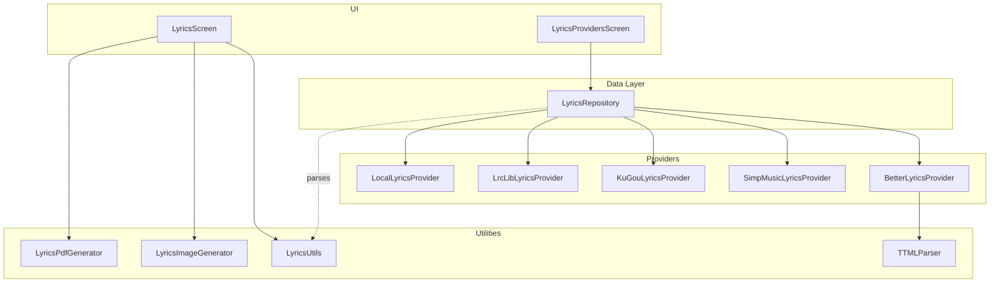
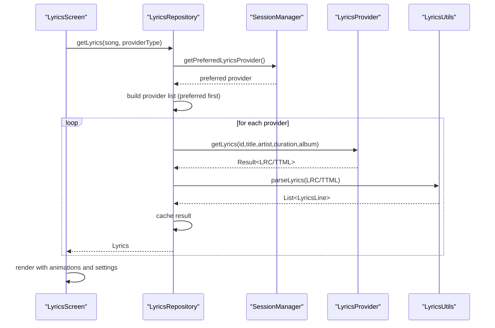
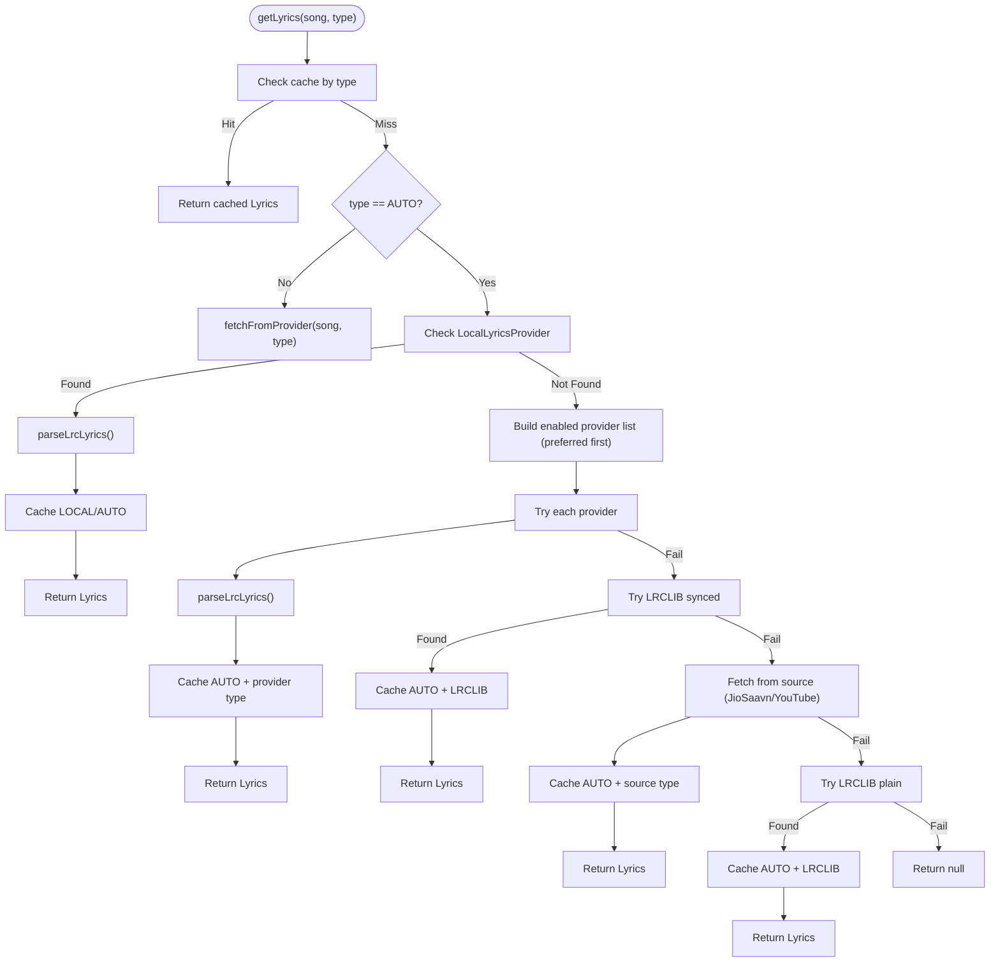
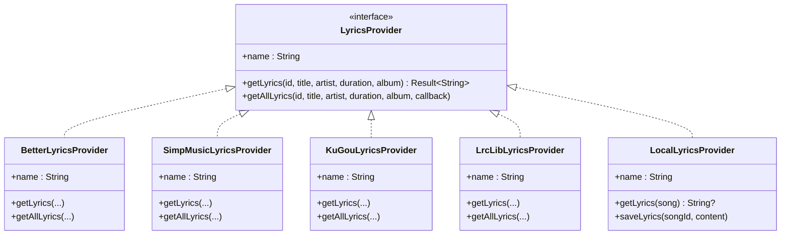
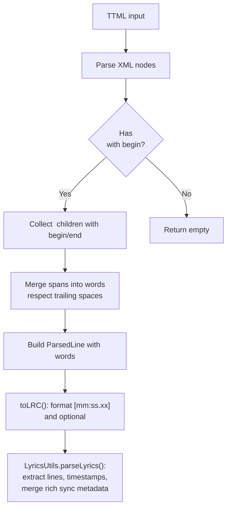
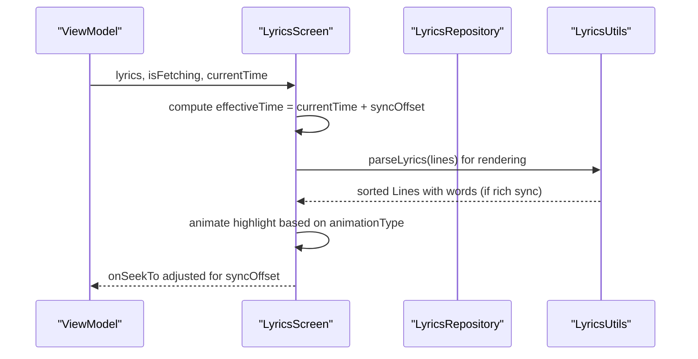
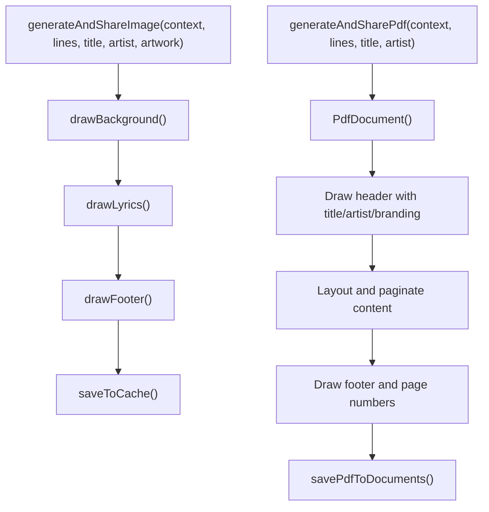
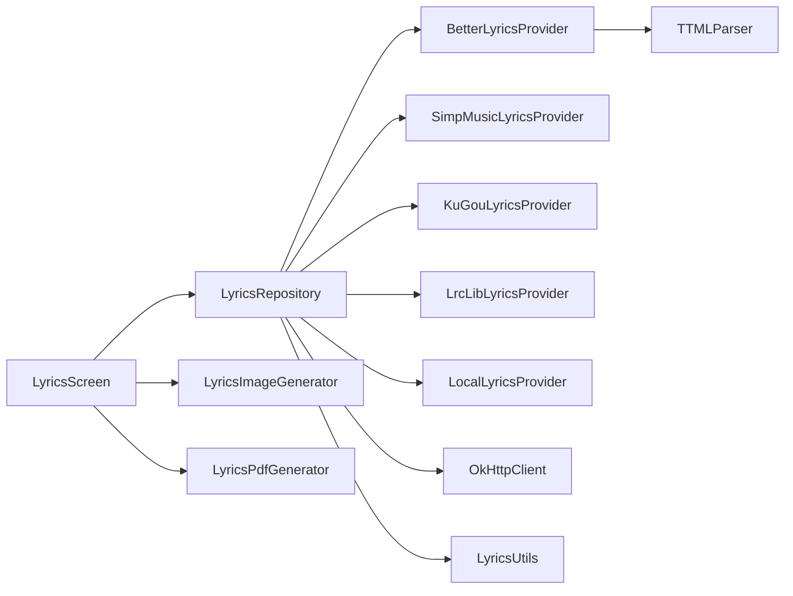

# Lyrics System

<cite>
**Referenced Files in This Document**
- [LyricsRepository.kt](file://app/src/main/java/com/suvojeet/suvmusic/data/repository/LyricsRepository.kt)
- [LyricsProvider.kt](file://media-source/src/main/java/com/suvojeet/suvmusic/providers/lyrics/LyricsProvider.kt)
- [LocalLyricsProvider.kt](file://app/src/main/java/com/suvojeet/suvmusic/providers/lyrics/LocalLyricsProvider.kt)
- [BetterLyricsProvider.kt](file://media-source/src/main/java/com/suvojeet/suvmusic/providers/lyrics/BetterLyricsProvider.kt)
- [SimpMusicLyricsProvider.kt](file://lyric-simpmusic/src/main/java/com/suvojeet/suvmusic/simpmusic/SimpMusicLyricsProvider.kt)
- [KuGouLyricsProvider.kt](file://lyric-kugou/src/main/java/com/suvojeet/suvmusic/kugou/KuGouLyricsProvider.kt)
- [LrcLibLyricsProvider.kt](file://lyric-lrclib/src/main/java/com/suvojeet/suvmusic/lrclib/LrcLibLyricsProvider.kt)
- [TTMLParser.kt](file://media-source/src/main/java/com/suvojeet/suvmusic/providers/lyrics/TTMLParser.kt)
- [LyricsUtils.kt](file://app/src/main/java/com/suvojeet/suvmusic/util/LyricsUtils.kt)
- [Lyrics.kt](file://core/model/src/main/java/com/suvojeet/suvmusic/core/model/Lyrics.kt)
- [Lyrics.kt](file://media-source/src/main/java/com/suvojeet/suvmusic/providers/lyrics/Lyrics.kt)
- [LyricsScreen.kt](file://app/src/main/java/com/suvojeet/suvmusic/ui/screens/LyricsScreen.kt)
- [LyricsProvidersScreen.kt](file://app/src/main/java/com/suvojeet/suvmusic/ui/screens/LyricsProvidersScreen.kt)
- [LyricsImageGenerator.kt](file://app/src/main/java/com/suvojeet/suvmusic/ui/utils/LyricsImageGenerator.kt)
- [LyricsPdfGenerator.kt](file://app/src/main/java/com/suvojeet/suvmusic/util/LyricsPdfGenerator.kt)
</cite>

## Table of Contents
1. [Introduction](#introduction)
2. [Project Structure](#project-structure)
3. [Core Components](#core-components)
4. [Architecture Overview](#architecture-overview)
5. [Detailed Component Analysis](#detailed-component-analysis)
6. [Dependency Analysis](#dependency-analysis)
7. [Performance Considerations](#performance-considerations)
8. [Troubleshooting Guide](#troubleshooting-guide)
9. [Conclusion](#conclusion)
10. [Appendices](#appendices)

## Introduction
This document explains SuvMusic’s lyrics system with multiple provider support. It covers the lyrics repository architecture, provider abstraction layer, synchronized lyric display implementation, and integrations with BetterLyrics, KuGou, LrcLib, and SimpMusic. It also documents lyric fetching mechanisms, caching strategies, fallback provider selection, synchronized lyric parsing, timing correction, display animation, export functionality (PDF and image), customization options, provider reliability, error handling, and performance optimization for real-time lyric display.

## Project Structure
The lyrics system is organized across several modules:
- Data repository: orchestrates provider selection, caching, and fallback logic
- Provider abstractions: unified interface for external and local providers
- Provider implementations: BetterLyrics, KuGou, LrcLib, SimpMusic, and Local
- Utilities: parsing, synchronization, and export helpers
- UI: lyrics screen, provider settings, and animations

**Diagram sources**
- [LyricsRepository.kt:27-38](file://app/src/main/java/com/suvojeet/suvmusic/data/repository/LyricsRepository.kt#L27-L38)
- [BetterLyricsProvider.kt:9-31](file://media-source/src/main/java/com/suvojeet/suvmusic/providers/lyrics/BetterLyricsProvider.kt#L9-L31)
- [SimpMusicLyricsProvider.kt:10-32](file://lyric-simpmusic/src/main/java/com/suvojeet/suvmusic/simpmusic/SimpMusicLyricsProvider.kt#L10-L32)
- [KuGouLyricsProvider.kt:10-34](file://lyric-kugou/src/main/java/com/suvojeet/suvmusic/kugou/KuGouLyricsProvider.kt#L10-L34)
- [LrcLibLyricsProvider.kt:13-15](file://lyric-lrclib/src/main/java/com/suvojeet/suvmusic/lrclib/LrcLibLyricsProvider.kt#L13-L15)
- [LocalLyricsProvider.kt:14-16](file://app/src/main/java/com/suvojeet/suvmusic/providers/lyrics/LocalLyricsProvider.kt#L14-L16)
- [LyricsUtils.kt:6-76](file://app/src/main/java/com/suvojeet/suvmusic/util/LyricsUtils.kt#L6-L76)
- [TTMLParser.kt:11-214](file://media-source/src/main/java/com/suvojeet/suvmusic/providers/lyrics/TTMLParser.kt#L11-L214)
- [LyricsImageGenerator.kt:24-221](file://app/src/main/java/com/suvojeet/suvmusic/ui/utils/LyricsImageGenerator.kt#L24-L221)
- [LyricsPdfGenerator.kt:18-220](file://app/src/main/java/com/suvojeet/suvmusic/util/LyricsPdfGenerator.kt#L18-L220)
- [LyricsScreen.kt:77-106](file://app/src/main/java/com/suvojeet/suvmusic/ui/screens/LyricsScreen.kt#L77-L106)
- [LyricsProvidersScreen.kt:52-145](file://app/src/main/java/com/suvojeet/suvmusic/ui/screens/LyricsProvidersScreen.kt#L52-L145)

**Section sources**
- [LyricsRepository.kt:27-38](file://app/src/main/java/com/suvojeet/suvmusic/data/repository/LyricsRepository.kt#L27-L38)
- [LyricsProvider.kt:7-49](file://media-source/src/main/java/com/suvojeet/suvmusic/providers/lyrics/LyricsProvider.kt#L7-L49)
- [LocalLyricsProvider.kt:14-99](file://app/src/main/java/com/suvojeet/suvmusic/providers/lyrics/LocalLyricsProvider.kt#L14-L99)
- [BetterLyricsProvider.kt:9-31](file://media-source/src/main/java/com/suvojeet/suvmusic/providers/lyrics/BetterLyricsProvider.kt#L9-L31)
- [SimpMusicLyricsProvider.kt:10-32](file://lyric-simpmusic/src/main/java/com/suvojeet/suvmusic/simpmusic/SimpMusicLyricsProvider.kt#L10-L32)
- [KuGouLyricsProvider.kt:10-34](file://lyric-kugou/src/main/java/com/suvojeet/suvmusic/kugou/KuGouLyricsProvider.kt#L10-L34)
- [LrcLibLyricsProvider.kt:13-179](file://lyric-lrclib/src/main/java/com/suvojeet/suvmusic/lrclib/LrcLibLyricsProvider.kt#L13-L179)
- [TTMLParser.kt:11-214](file://media-source/src/main/java/com/suvojeet/suvmusic/providers/lyrics/TTMLParser.kt#L11-L214)
- [LyricsUtils.kt:6-76](file://app/src/main/java/com/suvojeet/suvmusic/util/LyricsUtils.kt#L6-L76)
- [Lyrics.kt:3-34](file://core/model/src/main/java/com/suvojeet/suvmusic/core/model/Lyrics.kt#L3-L34)
- [Lyrics.kt:3-34](file://media-source/src/main/java/com/suvojeet/suvmusic/providers/lyrics/Lyrics.kt#L3-L34)
- [LyricsScreen.kt:77-106](file://app/src/main/java/com/suvojeet/suvmusic/ui/screens/LyricsScreen.kt#L77-L106)
- [LyricsProvidersScreen.kt:52-145](file://app/src/main/java/com/suvojeet/suvmusic/ui/screens/LyricsProvidersScreen.kt#L52-L145)
- [LyricsImageGenerator.kt:24-221](file://app/src/main/java/com/suvojeet/suvmusic/ui/utils/LyricsImageGenerator.kt#L24-L221)
- [LyricsPdfGenerator.kt:18-220](file://app/src/main/java/com/suvojeet/suvmusic/util/LyricsPdfGenerator.kt#L18-L220)

## Core Components
- LyricsRepository: central orchestrator for provider selection, caching, and fallback logic
- LyricsProvider interface: contract for all providers
- Provider implementations: BetterLyrics, KuGou, LrcLib, SimpMusic, Local
- Parsing utilities: LyricsUtils for LRC parsing, TTMLParser for Apple Music TTML
- Export utilities: LyricsImageGenerator and LyricsPdfGenerator
- UI components: LyricsScreen and LyricsProvidersScreen for display and configuration

**Section sources**
- [LyricsRepository.kt:27-310](file://app/src/main/java/com/suvojeet/suvmusic/data/repository/LyricsRepository.kt#L27-L310)
- [LyricsProvider.kt:7-49](file://media-source/src/main/java/com/suvojeet/suvmusic/providers/lyrics/LyricsProvider.kt#L7-L49)
- [LyricsUtils.kt:6-76](file://app/src/main/java/com/suvojeet/suvmusic/util/LyricsUtils.kt#L6-L76)
- [TTMLParser.kt:11-214](file://media-source/src/main/java/com/suvojeet/suvmusic/providers/lyrics/TTMLParser.kt#L11-L214)
- [LyricsImageGenerator.kt:24-221](file://app/src/main/java/com/suvojeet/suvmusic/ui/utils/LyricsImageGenerator.kt#L24-L221)
- [LyricsPdfGenerator.kt:18-220](file://app/src/main/java/com/suvojeet/suvmusic/util/LyricsPdfGenerator.kt#L18-L220)
- [LyricsScreen.kt:77-106](file://app/src/main/java/com/suvojeet/suvmusic/ui/screens/LyricsScreen.kt#L77-L106)
- [LyricsProvidersScreen.kt:52-145](file://app/src/main/java/com/suvojeet/suvmusic/ui/screens/LyricsProvidersScreen.kt#L52-L145)

## Architecture Overview
The lyrics system follows a layered architecture:
- UI requests lyrics with optional provider preference
- Repository selects providers based on user settings and preferences
- Providers return LRC-formatted lyrics (or TTML for BetterLyrics)
- Repository caches results and converts to internal model
- UI renders synchronized lyrics with animations and customization

**Diagram sources**
- [LyricsRepository.kt:51-184](file://app/src/main/java/com/suvojeet/suvmusic/data/repository/LyricsRepository.kt#L51-L184)
- [LyricsProvider.kt:22-28](file://media-source/src/main/java/com/suvojeet/suvmusic/providers/lyrics/LyricsProvider.kt#L22-L28)
- [LyricsUtils.kt:12-55](file://app/src/main/java/com/suvojeet/suvmusic/util/LyricsUtils.kt#L12-L55)
- [LyricsScreen.kt:344-361](file://app/src/main/java/com/suvojeet/suvmusic/ui/screens/LyricsScreen.kt#L344-L361)

## Detailed Component Analysis

### LyricsRepository
Responsibilities:
- Provider ordering and preference handling
- Caching with LruCache keyed by songId and provider type
- Auto mode fallback chain: Local → Enabled providers (preferred first) → LRCLIB → Source lyrics → Plain LRCLIB
- External provider fetching with error handling
- Local lyrics extraction from file system and embedded tags

Key behaviors:
- Cache key construction: `${songId}_${provider.name}`
- Preferred provider moved to front of list
- AUTO mode prioritizes local lyrics, then external providers, then LRCLIB, then source lyrics
- Parses LRC/TTML into internal model and sets isSynced flag based on presence of timestamps

**Diagram sources**
- [LyricsRepository.kt:77-184](file://app/src/main/java/com/suvojeet/suvmusic/data/repository/LyricsRepository.kt#L77-L184)
- [LyricsRepository.kt:186-252](file://app/src/main/java/com/suvojeet/suvmusic/data/repository/LyricsRepository.kt#L186-L252)
- [LyricsRepository.kt:254-301](file://app/src/main/java/com/suvojeet/suvmusic/data/repository/LyricsRepository.kt#L254-L301)
- [LyricsUtils.kt:12-55](file://app/src/main/java/com/suvojeet/suvmusic/util/LyricsUtils.kt#L12-L55)

**Section sources**
- [LyricsRepository.kt:27-310](file://app/src/main/java/com/suvojeet/suvmusic/data/repository/LyricsRepository.kt#L27-L310)

### Provider Abstraction and Implementations
- LyricsProvider interface defines getLyrics and getAllLyrics
- Provider implementations:
  - BetterLyricsProvider: wraps BetterLyrics API, returns TTML for rich sync
  - SimpMusicLyricsProvider: wraps SimpMusic API by video ID
  - KuGouLyricsProvider: wraps KuGou API
  - LrcLibLyricsProvider: integrates LRCLIB API with similarity scoring and fallback search
  - LocalLyricsProvider: reads sidecar .lrc/.txt files, embedded tags, or internal storage

**Diagram sources**
- [LyricsProvider.kt:7-49](file://media-source/src/main/java/com/suvojeet/suvmusic/providers/lyrics/LyricsProvider.kt#L7-L49)
- [BetterLyricsProvider.kt:9-31](file://media-source/src/main/java/com/suvojeet/suvmusic/providers/lyrics/BetterLyricsProvider.kt#L9-L31)
- [SimpMusicLyricsProvider.kt:10-32](file://lyric-simpmusic/src/main/java/com/suvojeet/suvmusic/simpmusic/SimpMusicLyricsProvider.kt#L10-L32)
- [KuGouLyricsProvider.kt:10-34](file://lyric-kugou/src/main/java/com/suvojeet/suvmusic/kugou/KuGouLyricsProvider.kt#L10-L34)
- [LrcLibLyricsProvider.kt:13-179](file://lyric-lrclib/src/main/java/com/suvojeet/suvmusic/lrclib/LrcLibLyricsProvider.kt#L13-L179)
- [LocalLyricsProvider.kt:14-99](file://app/src/main/java/com/suvojeet/suvmusic/providers/lyrics/LocalLyricsProvider.kt#L14-L99)

**Section sources**
- [LyricsProvider.kt:7-49](file://media-source/src/main/java/com/suvojeet/suvmusic/providers/lyrics/LyricsProvider.kt#L7-L49)
- [BetterLyricsProvider.kt:9-31](file://media-source/src/main/java/com/suvojeet/suvmusic/providers/lyrics/BetterLyricsProvider.kt#L9-L31)
- [SimpMusicLyricsProvider.kt:10-32](file://lyric-simpmusic/src/main/java/com/suvojeet/suvmusic/simpmusic/SimpMusicLyricsProvider.kt#L10-L32)
- [KuGouLyricsProvider.kt:10-34](file://lyric-kugou/src/main/java/com/suvojeet/suvmusic/kugou/KuGouLyricsProvider.kt#L10-L34)
- [LrcLibLyricsProvider.kt:13-179](file://lyric-lrclib/src/main/java/com/suvojeet/suvmusic/lrclib/LrcLibLyricsProvider.kt#L13-L179)
- [LocalLyricsProvider.kt:14-99](file://app/src/main/java/com/suvojeet/suvmusic/providers/lyrics/LocalLyricsProvider.kt#L14-L99)

### Synchronized Lyric Parsing and TTML Handling
- LyricsUtils parses LRC lines with timestamps and supports rich sync metadata (<word:start:end|...>) appended to the previous line
- TTMLParser converts Apple Music TTML to LRC with optional word-level timing; merges spans into words and preserves whitespace boundaries
- Repository caches parsed results and marks isSynced based on presence of timestamps

**Diagram sources**
- [TTMLParser.kt:32-185](file://media-source/src/main/java/com/suvojeet/suvmusic/providers/lyrics/TTMLParser.kt#L32-L185)
- [LyricsUtils.kt:12-75](file://app/src/main/java/com/suvojeet/suvmusic/util/LyricsUtils.kt#L12-L75)

**Section sources**
- [TTMLParser.kt:11-214](file://media-source/src/main/java/com/suvojeet/suvmusic/providers/lyrics/TTMLParser.kt#L11-L214)
- [LyricsUtils.kt:6-76](file://app/src/main/java/com/suvojeet/suvmusic/util/LyricsUtils.kt#L6-L76)
- [LyricsRepository.kt:303-305](file://app/src/main/java/com/suvojeet/suvmusic/data/repository/LyricsRepository.kt#L303-L305)

### UI Rendering and Animation
- LyricsScreen displays lyrics with customizable alignment, font size, line spacing, and animation type (line or word)
- Supports sync offset adjustment for timing correction
- Provides controls for play/pause, seek, and provider switching
- Uses DynamicLyricsBackground and Compose animations for immersive experience

**Diagram sources**
- [LyricsScreen.kt:344-361](file://app/src/main/java/com/suvojeet/suvmusic/ui/screens/LyricsScreen.kt#L344-L361)
- [LyricsUtils.kt:12-55](file://app/src/main/java/com/suvojeet/suvmusic/util/LyricsUtils.kt#L12-L55)

**Section sources**
- [LyricsScreen.kt:77-106](file://app/src/main/java/com/suvojeet/suvmusic/ui/screens/LyricsScreen.kt#L77-L106)
- [LyricsScreen.kt:344-361](file://app/src/main/java/com/suvojeet/suvmusic/ui/screens/LyricsScreen.kt#L344-L361)

### Export Functionality
- LyricsImageGenerator: creates a shareable PNG with background artwork, lyrics, and song info
- LyricsPdfGenerator: generates a multi-page PDF with styled header/footer and pagination

**Diagram sources**
- [LyricsImageGenerator.kt:30-59](file://app/src/main/java/com/suvojeet/suvmusic/ui/utils/LyricsImageGenerator.kt#L30-L59)
- [LyricsImageGenerator.kt:61-109](file://app/src/main/java/com/suvojeet/suvmusic/ui/utils/LyricsImageGenerator.kt#L61-L109)
- [LyricsImageGenerator.kt:111-153](file://app/src/main/java/com/suvojeet/suvmusic/ui/utils/LyricsImageGenerator.kt#L111-L153)
- [LyricsImageGenerator.kt:155-196](file://app/src/main/java/com/suvojeet/suvmusic/ui/utils/LyricsImageGenerator.kt#L155-L196)
- [LyricsImageGenerator.kt:198-219](file://app/src/main/java/com/suvojeet/suvmusic/ui/utils/LyricsImageGenerator.kt#L198-L219)
- [LyricsPdfGenerator.kt:24-190](file://app/src/main/java/com/suvojeet/suvmusic/util/LyricsPdfGenerator.kt#L24-L190)
- [LyricsPdfGenerator.kt:192-218](file://app/src/main/java/com/suvojeet/suvmusic/util/LyricsPdfGenerator.kt#L192-L218)

**Section sources**
- [LyricsImageGenerator.kt:24-221](file://app/src/main/java/com/suvojeet/suvmusic/ui/utils/LyricsImageGenerator.kt#L24-L221)
- [LyricsPdfGenerator.kt:18-220](file://app/src/main/java/com/suvojeet/suvmusic/util/LyricsPdfGenerator.kt#L18-L220)

### Provider Settings and Customization
- LyricsProvidersScreen manages enabling/disabling providers and selecting preferred provider
- LyricsScreen exposes customization for text position, animation type, font size, line spacing, and sync offset

**Section sources**
- [LyricsProvidersScreen.kt:52-145](file://app/src/main/java/com/suvojeet/suvmusic/ui/screens/LyricsProvidersScreen.kt#L52-L145)
- [LyricsScreen.kt:498-791](file://app/src/main/java/com/suvojeet/suvmusic/ui/screens/LyricsScreen.kt#L498-L791)

## Dependency Analysis
- Repository depends on:
  - SessionManager for provider enablement and preference
  - External repositories for source lyrics (YouTube/JioSaavn)
  - OkHttp client for network calls (LRCLIB)
  - Provider implementations for fetching lyrics
- Providers depend on:
  - External APIs or local filesystem
- UI depends on:
  - Repository for lyrics data
  - Utilities for parsing and export

**Diagram sources**
- [LyricsRepository.kt:27-38](file://app/src/main/java/com/suvojeet/suvmusic/data/repository/LyricsRepository.kt#L27-L38)
- [BetterLyricsProvider.kt:9-31](file://media-source/src/main/java/com/suvojeet/suvmusic/providers/lyrics/BetterLyricsProvider.kt#L9-L31)
- [SimpMusicLyricsProvider.kt:10-32](file://lyric-simpmusic/src/main/java/com/suvojeet/suvmusic/simpmusic/SimpMusicLyricsProvider.kt#L10-L32)
- [KuGouLyricsProvider.kt:10-34](file://lyric-kugou/src/main/java/com/suvojeet/suvmusic/kugou/KuGouLyricsProvider.kt#L10-L34)
- [LrcLibLyricsProvider.kt:13-15](file://lyric-lrclib/src/main/java/com/suvojeet/suvmusic/lrclib/LrcLibLyricsProvider.kt#L13-L15)
- [LocalLyricsProvider.kt:14-16](file://app/src/main/java/com/suvojeet/suvmusic/providers/lyrics/LocalLyricsProvider.kt#L14-L16)
- [TTMLParser.kt:11-214](file://media-source/src/main/java/com/suvojeet/suvmusic/providers/lyrics/TTMLParser.kt#L11-L214)
- [LyricsUtils.kt:6-76](file://app/src/main/java/com/suvojeet/suvmusic/util/LyricsUtils.kt#L6-L76)
- [LyricsImageGenerator.kt:24-221](file://app/src/main/java/com/suvojeet/suvmusic/ui/utils/LyricsImageGenerator.kt#L24-L221)
- [LyricsPdfGenerator.kt:18-220](file://app/src/main/java/com/suvojeet/suvmusic/util/LyricsPdfGenerator.kt#L18-L220)

**Section sources**
- [LyricsRepository.kt:27-38](file://app/src/main/java/com/suvojeet/suvmusic/data/repository/LyricsRepository.kt#L27-L38)
- [LrcLibLyricsProvider.kt:13-179](file://lyric-lrclib/src/main/java/com/suvojeet/suvmusic/lrclib/LrcLibLyricsProvider.kt#L13-L179)

## Performance Considerations
- Caching: LruCache with bounded size prevents repeated network calls; cache keys include provider type to avoid cross-provider collisions
- Provider ordering: preferred provider first reduces latency for successful matches
- Parsing: LyricsUtils and TTMLParser operate on strings; complexity proportional to number of lines and words
- UI rendering: lazy lists and animated transitions optimized for smooth playback; keepScreenOn toggle minimizes UI interruptions
- Network: LRCLIB search uses similarity scoring and duration penalties; consider retry/backoff for transient failures

[No sources needed since this section provides general guidance]

## Troubleshooting Guide
Common issues and resolutions:
- No lyrics found:
  - Verify provider enablement in settings
  - Check preferred provider selection
  - Confirm song metadata (title, artist, duration) accuracy
- Incorrect timing:
  - Use sync offset adjustment in lyrics screen
  - Prefer synced providers (BetterLyrics, LRCLIB)
- Poor matches:
  - Enable multiple providers; repository tries fallbacks automatically
  - Use LRCLIB search fallback logic
- Local lyrics not detected:
  - Ensure .lrc/.txt sidecar files or embedded tags exist
  - Verify storage permissions and file paths

**Section sources**
- [LyricsRepository.kt:51-184](file://app/src/main/java/com/suvojeet/suvmusic/data/repository/LyricsRepository.kt#L51-L184)
- [LocalLyricsProvider.kt:19-62](file://app/src/main/java/com/suvojeet/suvmusic/providers/lyrics/LocalLyricsProvider.kt#L19-L62)
- [LrcLibLyricsProvider.kt:65-130](file://lyric-lrclib/src/main/java/com/suvojeet/suvmusic/lrclib/LrcLibLyricsProvider.kt#L65-L130)

## Conclusion
SuvMusic’s lyrics system provides robust, extensible support for multiple providers with intelligent fallback, caching, and synchronization. The architecture cleanly separates concerns between data retrieval, parsing, and presentation, enabling reliable real-time lyric display and flexible customization. Export capabilities further enhance user engagement by allowing sharing and archival of lyrics experiences.

[No sources needed since this section summarizes without analyzing specific files]

## Appendices

### Model Definitions
- Lyrics: container for lines, source credit, sync flag, and provider type
- LyricsLine: text with optional timestamps and word-level timing
- LyricsWord: individual word with precise timing

**Section sources**
- [Lyrics.kt:3-34](file://core/model/src/main/java/com/suvojeet/suvmusic/core/model/Lyrics.kt#L3-L34)
- [Lyrics.kt:3-34](file://media-source/src/main/java/com/suvojeet/suvmusic/providers/lyrics/Lyrics.kt#L3-L34)